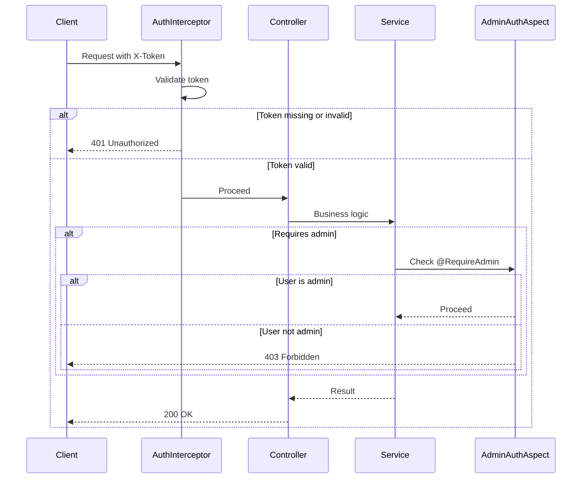

# API Endpoints Reference

<cite>
**Referenced Files in This Document**   
- [AuthController.java](file://src/main/java/com/example/onlinestore/controller/AuthController.java)
- [ProductController.java](file://src/main/java/com/example/onlinestore/controller/ProductController.java)
- [UserController.java](file://src/main/java/com/example/onlinestore/controller/UserController.java)
- [RequireAdmin.java](file://src/main/java/com/example/onlinestore/annotation/RequireAdmin.java)
- [AdminAuthAspect.java](file://src/main/java/com/example/onlinestore/aspect/AdminAuthAspect.java)
- [AuthInterceptor.java](file://src/main/java/com/example/onlinestore/interceptor/AuthInterceptor.java)
- [PageResponse.java](file://src/main/java/com/example/onlinestore/dto/PageResponse.java)
- [ProductPageRequest.java](file://src/main/java/com/example/onlinestore/dto/ProductPageRequest.java)
- [UserPageRequest.java](file://src/main/java/com/example/onlinestore/dto/UserPageRequest.java)
- [LoginRequest.java](file://src/main/java/com/example/onlinestore/dto/LoginRequest.java)
- [LoginResponse.java](file://src/main/java/com/example/onlinestore/dto/LoginResponse.java)
- [CreateProductRequest.java](file://src/main/java/com/example/onlinestore/dto/CreateProductRequest.java)
- [UserVO.java](file://src/main/java/com/example/onlinestore/dto/UserVO.java)
- [UserService.java](file://src/main/java/com/example/onlinestore/service/UserService.java)
- [ProductService.java](file://src/main/java/com/example/onlinestore/service/ProductService.java)
</cite>

## Table of Contents
1. [Introduction](#introduction)
2. [Authentication Endpoints](#authentication-endpoints)
3. [Product Management Endpoints](#product-management-endpoints)
4. [User Management Endpoints](#user-management-endpoints)
5. [Request and Response Schemas](#request-and-response-schemas)
6. [Pagination Implementation](#pagination-implementation)
7. [Security Considerations](#security-considerations)
8. [Client Implementation Guidelines](#client-implementation-guidelines)
9. [Performance Optimization Tips](#performance-optimization-tips)

## Introduction
This document provides comprehensive reference documentation for all RESTful endpoints in the online-store application. The API is organized into three main groups: Authentication, Product Management, and User Management. All endpoints require authentication via token-based authorization, with certain endpoints restricted to administrators only using the `@RequireAdmin` annotation. The system implements robust validation, error handling, and pagination for efficient data retrieval.

**Section sources**
- [AuthController.java](file://src/main/java/com/example/onlinestore/controller/AuthController.java#L1-L45)
- [ProductController.java](file://src/main/java/com/example/onlinestore/controller/ProductController.java#L1-L78)
- [UserController.java](file://src/main/java/com/example/onlinestore/controller/UserController.java#L1-L66)

## Authentication Endpoints

### POST /api/auth/login
Authenticates a user and returns a token for subsequent requests.

**Request Parameters**
- **Body**: `LoginRequest` object containing:
  - `username`: User's login name (required)
  - `password`: User's password (required)

**Headers**
- `Content-Type: application/json`

**Response Schema**
- Success: `LoginResponse` object containing:
  - `token`: Authentication token (string)
  - `expireTime`: Token expiration timestamp (ISO 8601 format)

**Status Codes**
- `200 OK`: Authentication successful
- `400 Bad Request`: Invalid credentials or missing parameters
- `500 Internal Server Error`: System error during authentication

**Example Request**
```json
{
  "username": "admin",
  "password": "password123"
}
```

**Example Success Response**
```json
{
  "token": "eyJhbGciOiJIUzI1NiIsInR5cCI6IkpXVCJ9.xJ...",
  "expireTime": "2024-01-01T12:00:00"
}
```

**Example Error Response**
```json
"Invalid username or password"
```

**Authentication Requirements**
This endpoint does not require authentication.

**Section sources**
- [AuthController.java](file://src/main/java/com/example/onlinestore/controller/AuthController.java#L29-L44)
- [LoginRequest.java](file://src/main/java/com/example/onlinestore/dto/LoginRequest.java#L1-L22)
- [LoginResponse.java](file://src/main/java/com/example/onlinestore/dto/LoginResponse.java#L1-L24)
- [UserService.java](file://src/main/java/com/example/onlinestore/service/UserService.java#L11)

## Product Management Endpoints

### POST /api/products
Creates a new product in the system. Requires admin privileges.

**Authentication Requirements**
- Requires valid `X-Token` header
- Requires admin privileges (`@RequireAdmin` annotation)

**Request Parameters**
- **Body**: `CreateProductRequest` object containing:
  - `name`: Product name (string, required, not blank)
  - `category`: Product category (string, required, not blank)
  - `price`: Product price (BigDecimal, required, minimum 0.01)

**Headers**
- `Content-Type: application/json`
- `X-Token: {token}`

**Response Schema**
- Success: `Product` object containing:
  - `id`: Product ID
  - `name`: Product name
  - `category`: Product category
  - `price`: Product price
  - `createdAt`: Creation timestamp
  - `updatedAt`: Last update timestamp

**Status Codes**
- `200 OK`: Product created successfully
- `400 Bad Request`: Validation error or invalid parameters
- `401 Unauthorized`: Missing or invalid token
- `403 Forbidden`: User lacks admin privileges
- `500 Internal Server Error`: System error during creation

**Example Request**
```json
{
  "name": "Wireless Headphones",
  "category": "Electronics",
  "price": 99.99
}
```

**Example Success Response**
```json
{
  "id": 123,
  "name": "Wireless Headphones",
  "category": "Electronics",
  "price": 99.99,
  "createdAt": "2024-01-01T10:00:00",
  "updatedAt": "2024-01-01T10:00:00"
}
```

**Example Error Response**
```json
{
  "message": "Product name cannot be empty"
}
```

### GET /api/products
Retrieves a paginated list of products with optional filtering.

**Authentication Requirements**
- Requires valid `X-Token` header

**Request Parameters**
- **Query Parameters**:
  - `pageNum`: Page number (integer, default: 1, minimum: 1)
  - `pageSize`: Number of items per page (integer, default: 10, range: 1-100)
  - `name`: Filter by product name (optional string)

**Headers**
- `X-Token: {token}`

**Response Schema**
- Success: `PageResponse<Product>` object containing:
  - `records`: Array of product objects
  - `total`: Total number of products matching criteria
  - `pageNum`: Current page number
  - `pageSize`: Number of items per page

**Status Codes**
- `200 OK`: Products retrieved successfully
- `400 Bad Request`: Invalid pagination parameters
- `401 Unauthorized`: Missing or invalid token
- `500 Internal Server Error`: System error during retrieval

**Example Request**
```
GET /api/products?pageNum=1&pageSize=10&name=headphones
```

**Example Success Response**
```json
{
  "records": [
    {
      "id": 123,
      "name": "Wireless Headphones",
      "category": "Electronics",
      "price": 99.99,
      "createdAt": "2024-01-01T10:00:00",
      "updatedAt": "2024-01-01T10:00:00"
    }
  ],
  "total": 1,
  "pageNum": 1,
  "pageSize": 10
}
```

**Section sources**
- [ProductController.java](file://src/main/java/com/example/onlinestore/controller/ProductController.java#L36-L77)
- [CreateProductRequest.java](file://src/main/java/com/example/onlinestore/dto/CreateProductRequest.java#L1-L42)
- [ProductPageRequest.java](file://src/main/java/com/example/onlinestore/dto/ProductPageRequest.java#L1-L39)
- [ProductService.java](file://src/main/java/com/example/onlinestore/service/ProductService.java#L9-L10)

## User Management Endpoints

### GET /api/users
Retrieves a paginated list of users. Requires admin privileges.

**Authentication Requirements**
- Requires valid `X-Token` header
- Requires admin privileges (`@RequireAdmin` annotation)

**Request Parameters**
- **Query Parameters**:
  - `pageNum`: Page number (integer, default: 1, minimum: 1)
  - `pageSize`: Number of items per page (integer, default: 10, range: 1-100)

**Headers**
- `X-Token: {token}`

**Response Schema**
- Success: `PageResponse<UserVO>` object containing:
  - `records`: Array of user objects with:
    - `id`: User ID
    - `username`: Username
    - `createdAt`: Account creation timestamp
    - `updatedAt`: Last update timestamp
  - `total`: Total number of users
  - `pageNum`: Current page number
  - `pageSize`: Number of items per page

**Status Codes**
- `200 OK`: Users retrieved successfully
- `400 Bad Request`: Invalid pagination parameters
- `401 Unauthorized`: Missing or invalid token
- `403 Forbidden`: User lacks admin privileges
- `500 Internal Server Error`: System error during retrieval

**Example Request**
```
GET /api/users?pageNum=1&pageSize=5
```

**Example Success Response**
```json
{
  "records": [
    {
      "id": 1,
      "username": "admin",
      "createdAt": "2024-01-01T09:00:00",
      "updatedAt": "2024-01-01T09:00:00"
    },
    {
      "id": 2,
      "username": "customer1",
      "createdAt": "2024-01-01T09:30:00",
      "updatedAt": "2024-01-01T09:30:00"
    }
  ],
  "total": 2,
  "pageNum": 1,
  "pageSize": 5
}
```

**Section sources**
- [UserController.java](file://src/main/java/com/example/onlinestore/controller/UserController.java#L41-L65)
- [UserPageRequest.java](file://src/main/java/com/example/onlinestore/dto/UserPageRequest.java#L1-L29)
- [UserVO.java](file://src/main/java/com/example/onlinestore/dto/UserVO.java#L1-L42)
- [UserService.java](file://src/main/java/com/example/onlinestore/service/UserService.java#L12)

## Request and Response Schemas

### LoginRequest
Request body for authentication.

**Properties**
- `username`: string, required, not blank
- `password`: string, required, not blank

### LoginResponse
Response body for successful authentication.

**Properties**
- `token`: string, authentication token
- `expireTime`: string (ISO 8601), token expiration time

### CreateProductRequest
Request body for creating a product.

**Properties**
- `name`: string, required, not blank
- `category`: string, required, not blank
- `price`: number (BigDecimal), required, minimum 0.01

### ErrorResponse
Standard error response format.

**Properties**
- `message`: string, error description (localized)

### PageResponse<T>
Generic pagination response wrapper.

**Properties**
- `records`: array of T objects
- `total`: number, total count of records
- `pageNum`: number, current page number
- `pageSize`: number, number of items per page

**Section sources**
- [LoginRequest.java](file://src/main/java/com/example/onlinestore/dto/LoginRequest.java#L1-L22)
- [LoginResponse.java](file://src/main/java/com/example/onlinestore/dto/LoginResponse.java#L1-L24)
- [CreateProductRequest.java](file://src/main/java/com/example/onlinestore/dto/CreateProductRequest.java#L1-L42)
- [PageResponse.java](file://src/main/java/com/example/onlinestore/dto/PageResponse.java#L1-L42)
- [UserVO.java](file://src/main/java/com/example/onlinestore/dto/UserVO.java#L1-L42)

## Pagination Implementation

The API implements pagination using request and response DTOs to standardize data retrieval across endpoints.

### Page Request DTOs
- `ProductPageRequest` and `UserPageRequest` classes extend the pagination functionality
- Default page size: 10 items
- Maximum page size: 100 items (enforced by `@Max` validation)
- Minimum page number: 1 (enforced by `@Min` validation)
- Validation handled by `@ValidateParams` aspect and JSR-303 annotations

### Page Response DTO
- `PageResponse<T>` provides a generic wrapper for paginated results
- Contains metadata: total count, current page, page size
- Generic type parameter allows reuse across different entity types
- Records field contains the actual data array

### Usage Pattern
All paginated endpoints follow the same pattern:
1. Client specifies `pageNum` and `pageSize` query parameters
2. Server validates parameters using JSR-303 constraints
3. Service layer retrieves data with pagination
4. Response wrapped in `PageResponse` with metadata

**Section sources**
- [ProductPageRequest.java](file://src/main/java/com/example/onlinestore/dto/ProductPageRequest.java#L1-L39)
- [UserPageRequest.java](file://src/main/java/com/example/onlinestore/dto/UserPageRequest.java#L1-L29)
- [PageResponse.java](file://src/main/java/com/example/onlinestore/dto/PageResponse.java#L1-L42)
- [ValidationAspect.java](file://src/main/java/com/example/onlinestore/aspect/ValidationAspect.java#L1-L79)

## Security Considerations

### Authentication Mechanism
- Token-based authentication using `X-Token` header
- Tokens generated upon successful login
- Interceptor-based validation in `AuthInterceptor`
- User context stored in thread-local storage during request processing

### Authorization
- Admin-only endpoints protected by `@RequireAdmin` annotation
- `AdminAuthAspect` enforces admin privileges by checking username against configured admin user
- Configuration-driven admin username (`admin.auth.username` property)
- Both authentication and authorization checks performed before business logic

### Token Security
- Tokens should be treated as sensitive credentials
- Clients should store tokens securely (e.g., HTTP-only cookies or secure storage)
- Tokens have limited lifespan (expiration time included in response)
- Server-side token validation on every request
- No token revocation mechanism currently implemented

### Input Validation
- Comprehensive validation using JSR-303 annotations
- `@ValidateParams` aspect automatically validates all method parameters
- Validation errors return 400 Bad Request with descriptive messages
- All input fields properly constrained (min/max values, not blank, etc.)

### Error Handling
- Business logic errors return 400 Bad Request
- System errors return 500 Internal Server Error
- Unauthorized access returns 401 Unauthorized
- Forbidden operations return 403 Forbidden
- Error messages are localized using `MessageSource`



**Diagram sources**
- [AuthInterceptor.java](file://src/main/java/com/example/onlinestore/interceptor/AuthInterceptor.java#L23-L48)
- [AdminAuthAspect.java](file://src/main/java/com/example/onlinestore/aspect/AdminAuthAspect.java#L54-L71)
- [RequireAdmin.java](file://src/main/java/com/example/onlinestore/annotation/RequireAdmin.java#L8-L11)

**Section sources**
- [AuthInterceptor.java](file://src/main/java/com/example/onlinestore/interceptor/AuthInterceptor.java#L1-L49)
- [AdminAuthAspect.java](file://src/main/java/com/example/onlinestore/aspect/AdminAuthAspect.java#L1-L71)
- [RequireAdmin.java](file://src/main/java/com/example/onlinestore/annotation/RequireAdmin.java#L1-L11)

## Client Implementation Guidelines

### HTTP Client Configuration
- Set default headers: `Content-Type: application/json`
- Implement token storage and automatic attachment to requests
- Handle 401 responses by redirecting to login
- Handle 403 responses with appropriate user feedback

### Authentication Flow
1. Send POST request to `/api/auth/login` with credentials
2. Store returned token securely
3. Include token in `X-Token` header for all subsequent requests
4. Monitor token expiration and prompt for re-authentication

### Error Handling
- Parse error responses and display user-friendly messages
- Implement retry logic for 500 errors with exponential backoff
- Validate input locally before sending requests
- Handle network errors gracefully

### Language-Specific Examples

#### JavaScript/Node.js
```javascript
const apiClient = axios.create({
  baseURL: 'http://localhost:8080',
  headers: { 'Content-Type': 'application/json' }
});

// Set token after login
apiClient.interceptors.request.use(config => {
  const token = localStorage.getItem('token');
  if (token) config.headers['X-Token'] = token;
  return config;
});
```

#### Python
```python
import requests

class APIClient:
    def __init__(self, base_url):
        self.base_url = base_url
        self.session = requests.Session()
        self.session.headers.update({'Content-Type': 'application/json'})
    
    def set_token(self, token):
        self.session.headers['X-Token'] = token
```

#### Java
```java
RestTemplate restTemplate = new RestTemplate();
restTemplate.setRequestFactory(new HttpComponentsClientHttpRequestFactory());

// Add token interceptor
restTemplate.setInterceptors(Collections.singletonList((request, body, execution) -> {
    request.getHeaders().add("X-Token", token);
    return execution.execute(request, body);
}));
```

**Section sources**
- [AuthController.java](file://src/main/java/com/example/onlinestore/controller/AuthController.java#L29-L44)
- [AuthInterceptor.java](file://src/main/java/com/example/onlinestore/interceptor/AuthInterceptor.java#L23-L48)

## Performance Optimization Tips

### For Large Datasets
- Use appropriate page sizes (20-50 items) to balance network and memory usage
- Implement infinite scrolling with pagination in UI
- Cache frequently accessed pages on the client side
- Use filtering parameters to reduce result set size

### Network Optimization
- Implement request batching where applicable
- Use gzip compression for responses
- Minimize request frequency with client-side caching
- Implement optimistic UI updates for create operations

### Query Optimization
- Ensure database indexes on frequently queried fields (e.g., product name)
- Use projection queries to retrieve only needed fields
- Implement server-side caching for frequently accessed data
- Monitor and optimize slow queries using database profiling

### Client-Side Strategies
- Implement debouncing for search/filter inputs
- Use virtual scrolling for large lists
- Pre-fetch next page when user approaches end of current page
- Implement loading states and skeleton screens

### Monitoring
- Log response times for performance analysis
- Monitor API usage patterns to identify bottlenecks
- Set up alerts for slow endpoints
- Regularly review and optimize database queries

**Section sources**
- [ProductController.java](file://src/main/java/com/example/onlinestore/controller/ProductController.java#L62-L77)
- [UserController.java](file://src/main/java/com/example/onlinestore/controller/UserController.java#L41-L65)
- [ProductService.java](file://src/main/java/com/example/onlinestore/service/ProductService.java#L10)
- [UserService.java](file://src/main/java/com/example/onlinestore/service/UserService.java#L12)