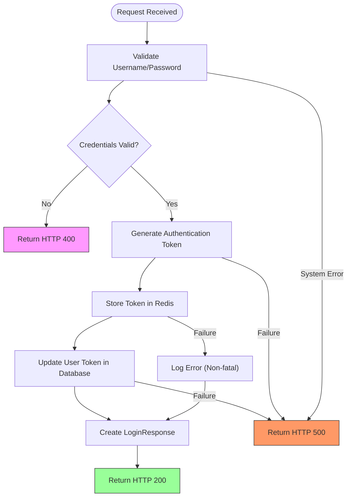
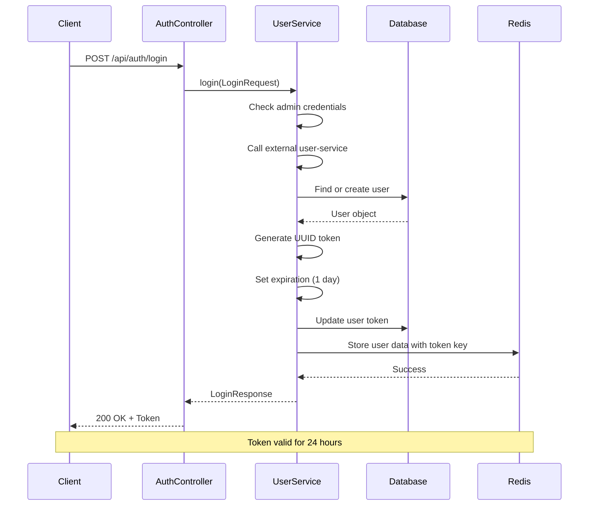
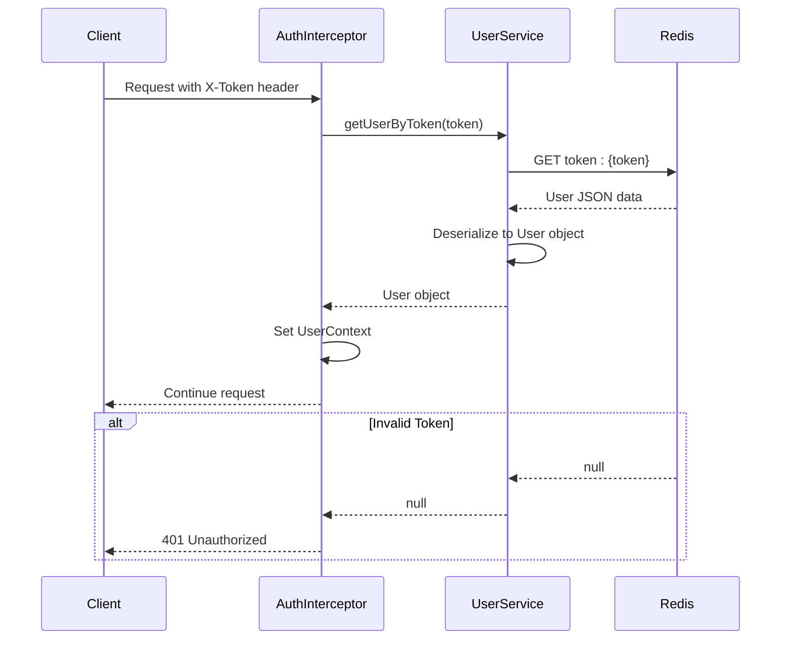
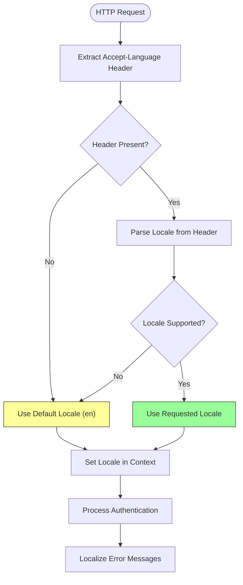

# Authentication API

<cite>
**Referenced Files in This Document**   
- [AuthController.java](file://src/main/java/com/example/onlinestore/controller/AuthController.java)
- [LoginRequest.java](file://src/main/java/com/example/onlinestore/dto/LoginRequest.java)
- [LoginResponse.java](file://src/main/java/com/example/onlinestore/dto/LoginResponse.java)
- [UserServiceImpl.java](file://src/main/java/com/example/onlinestore/service/impl/UserServiceImpl.java)
- [AuthInterceptor.java](file://src/main/java/com/example/onlinestore/interceptor/AuthInterceptor.java)
- [MessageConfig.java](file://src/main/java/com/example/onlinestore/config/MessageConfig.java)
- [messages.properties](file://src/main/resources/i18n/messages.properties)
- [messages_zh_CN.properties](file://src/main/resources/i18n/messages_zh_CN.properties)
- [WebConfig.java](file://src/main/java/com/example/onlinestore/config/WebConfig.java)
- [User.java](file://src/main/java/com/example/onlinestore/model/User.java)
- [application.yml](file://src/main/resources/application.yml)
</cite>

## Table of Contents
1. [Authentication Endpoint](#authentication-endpoint)
2. [Request Structure](#request-structure)
3. [Response Structure](#response-structure)
4. [Error Handling](#error-handling)
5. [Token-Based Authentication Mechanism](#token-based-authentication-mechanism)
6. [Internationalization Implementation](#internationalization-implementation)
7. [Client Implementation Examples](#client-implementation-examples)
8. [Security Best Practices](#security-best-practices)

## Authentication Endpoint

The `/api/auth/login` endpoint provides user authentication functionality for the online-store application. It accepts POST requests with JSON payloads containing user credentials and returns authentication tokens upon successful validation.

**Section sources**
- [AuthController.java](file://src/main/java/com/example/onlinestore/controller/AuthController.java#L29-L44)

## Request Structure

The authentication endpoint accepts a JSON request body conforming to the LoginRequest DTO structure.

### LoginRequest DTO
The request must contain the following fields:

| Field | Type | Description |
|-------|------|-------------|
| username | string | User's username for authentication |
| password | string | User's password for authentication |

### Example Request (JSON)
```json
{
  "username": "john_doe",
  "password": "secure_password_123"
}
```

### Example Request (curl)
```bash
curl -X POST https://api.online-store.com/api/auth/login \
  -H "Content-Type: application/json" \
  -d '{
    "username": "john_doe",
    "password": "secure_password_123"
  }'
```

**Section sources**
- [LoginRequest.java](file://src/main/java/com/example/onlinestore/dto/LoginRequest.java#L3-L22)

## Response Structure

Upon successful authentication, the endpoint returns a LoginResponse DTO containing the authentication token and expiration time.

### LoginResponse DTO
The successful response includes the following fields:

| Field | Type | Description |
|-------|------|-------------|
| token | string | JWT token for subsequent API requests |
| expireTime | string (ISO 8601) | Token expiration timestamp in ISO 8601 format |

### Example Response (HTTP 200)
```json
{
  "token": "eyJhbGciOiJIUzI1NiIsInR5cCI6IkpXVCJ9.xJ...",
  "expireTime": "2024-01-15T10:30:00"
}
```

### Example Response (curl)
```bash
curl -X POST https://api.online-store.com/api/auth/login \
  -H "Content-Type: application/json" \
  -d '{"username":"john_doe","password":"secure_password_123"}'

# Response
# {
#   "token": "eyJhbGciOiJIUzI1NiIsInR5cCI6IkpXVCJ9.xJ...",
#   "expireTime": "2024-01-15T10:30:00"
# }
```

**Section sources**
- [LoginResponse.java](file://src/main/java/com/example/onlinestore/dto/LoginResponse.java#L5-L24)

## Error Handling

The authentication endpoint implements comprehensive error handling with appropriate HTTP status codes and localized error messages.

### Error Response Structure
All error responses return plain text messages localized based on the Accept-Language header.

#### Invalid Credentials (HTTP 400)
When authentication fails due to incorrect username or password.

**Example Response (English)**
```
Invalid username or password
```

**Example Response (Chinese)**
```
用户名或密码错误
```

#### System Errors (HTTP 500)
When internal server errors occur during the authentication process.

**Example Response (English)**
```
Internal server error
```

**Example Response (Chinese)**
```
系统内部错误
```

### Error Handling Flow


**Diagram sources**
- [UserServiceImpl.java](file://src/main/java/com/example/onlinestore/service/impl/UserServiceImpl.java#L69-L95)
- [AuthController.java](file://src/main/java/com/example/onlinestore/controller/AuthController.java#L34-L43)

**Section sources**
- [AuthController.java](file://src/main/java/com/example/onlinestore/controller/AuthController.java#L34-L43)
- [messages.properties](file://src/main/resources/i18n/messages.properties#L5)
- [messages_zh_CN.properties](file://src/main/resources/i18n/messages_zh_CN.properties#L5)

## Token-Based Authentication Mechanism

The online-store application implements a token-based authentication system using JWT-like tokens stored in Redis for session management.

### Authentication Flow


**Diagram sources**
- [UserServiceImpl.java](file://src/main/java/com/example/onlinestore/service/impl/UserServiceImpl.java#L69-L138)
- [AuthController.java](file://src/main/java/com/example/onlinestore/controller/AuthController.java#L30-L33)

### Token Validation Process
All protected endpoints use the AuthInterceptor to validate tokens on each request.



**Diagram sources**
- [AuthInterceptor.java](file://src/main/java/com/example/onlinestore/interceptor/AuthInterceptor.java#L23-L48)
- [UserServiceImpl.java](file://src/main/java/com/example/onlinestore/service/impl/UserServiceImpl.java#L179-L192)

**Section sources**
- [AuthInterceptor.java](file://src/main/java/com/example/onlinestore/interceptor/AuthInterceptor.java#L23-L48)
- [UserContext.java](file://src/main/java/com/example/onlinestore/context/UserContext.java#L5-L19)
- [User.java](file://src/main/java/com/example/onlinestore/model/User.java#L5-L60)

## Internationalization Implementation

The authentication system supports multiple languages using Spring's MessageSource and locale resolution based on the Accept-Language header.

### Supported Languages
- English (en)
- Simplified Chinese (zh-CN)

### Message Configuration
```mermaid
classDiagram
class MessageConfig {
+messageSource() MessageSource
+localeResolver() LocaleResolver
}
class MessageSource {
<<interface>>
+getMessage(code, args, locale)
}
class ResourceBundleMessageSource {
+setBasenames()
+setDefaultEncoding()
+setFallbackToSystemLocale()
+setDefaultLocale()
}
class AcceptHeaderLocaleResolver {
+setSupportedLocales()
+setDefaultLocale()
}
MessageConfig --> MessageSource : creates
MessageConfig --> AcceptHeaderLocaleResolver : creates
ResourceBundleMessageSource --|> MessageSource
AcceptHeaderLocaleResolver --|> LocaleResolver
note right of MessageConfig
Configures i18n support with
messages.properties and
messages_zh_CN.properties
end note
```

**Diagram sources**
- [MessageConfig.java](file://src/main/java/com/example/onlinestore/config/MessageConfig.java#L13-L35)
- [messages.properties](file://src/main/resources/i18n/messages.properties#L1-L17)
- [messages_zh_CN.properties](file://src/main/resources/i18n/messages_zh_CN.properties#L1-L17)

### Locale Resolution Flow


**Diagram sources**
- [MessageConfig.java](file://src/main/java/com/example/onlinestore/config/MessageConfig.java#L26-L35)
- [AuthController.java](file://src/main/java/com/example/onlinestore/controller/AuthController.java#L37-L38)
- [AuthController.java](file://src/main/java/com/example/onlinestore/controller/AuthController.java#L42-L43)

**Section sources**
- [MessageConfig.java](file://src/main/java/com/example/onlinestore/config/MessageConfig.java#L13-L35)

## Client Implementation Examples

### JavaScript (Fetch API)
```javascript
async function login(username, password) {
  try {
    const response = await fetch('https://api.online-store.com/api/auth/login', {
      method: 'POST',
      headers: {
        'Content-Type': 'application/json',
        'Accept-Language': 'en'
      },
      body: JSON.stringify({ username, password })
    });

    if (response.ok) {
      const data = await response.json();
      // Store token securely
      localStorage.setItem('authToken', data.token);
      return data;
    } else {
      const error = await response.text();
      throw new Error(error);
    }
  } catch (error) {
    console.error('Login failed:', error.message);
    throw error;
  }
}
```

### Python (requests)
```python
import requests

def login(username, password, language='en'):
    url = "https://api.online-store.com/api/auth/login"
    headers = {
        "Content-Type": "application/json",
        "Accept-Language": language
    }
    data = {
        "username": username,
        "password": password
    }
    
    response = requests.post(url, json=data, headers=headers)
    
    if response.status_code == 200:
        result = response.json()
        # Store token securely
        import os
        os.environ['AUTH_TOKEN'] = result['token']
        return result
    else:
        raise Exception(response.text)
```

### Java (Spring RestTemplate)
```java
@Service
public class AuthService {
    
    @Autowired
    private RestTemplate restTemplate;
    
    public LoginResponse login(String username, String password) {
        String url = "https://api.online-store.com/api/auth/login";
        
        LoginRequest request = new LoginRequest();
        request.setUsername(username);
        request.setPassword(password);
        
        HttpHeaders headers = new HttpHeaders();
        headers.setContentType(MediaType.APPLICATION_JSON);
        headers.setAcceptLanguageAsLocales(Arrays.asList(Locale.ENGLISH));
        
        HttpEntity<LoginRequest> entity = new HttpEntity<>(request, headers);
        
        try {
            ResponseEntity<LoginResponse> response = 
                restTemplate.postForEntity(url, entity, LoginResponse.class);
            return response.getBody();
        } catch (HttpClientErrorException e) {
            throw new AuthenticationException(e.getResponseBodyAsString());
        }
    }
}
```

**Section sources**
- [AuthController.java](file://src/main/java/com/example/onlinestore/controller/AuthController.java#L29-L44)
- [LoginRequest.java](file://src/main/java/com/example/onlinestore/dto/LoginRequest.java#L3-L22)
- [LoginResponse.java](file://src/main/java/com/example/onlinestore/dto/LoginResponse.java#L5-L24)

## Security Best Practices

### Token Storage Recommendations
- **Client-Side**: Store tokens in memory rather than localStorage when possible
- **Mobile Apps**: Use secure storage mechanisms (Keychain for iOS, Keystore for Android)
- **Web Applications**: Consider using httpOnly cookies for added XSS protection

### Token Transmission Security
- Always use HTTPS for all API communications
- Include tokens in the Authorization header or custom X-Token header
- Set appropriate token expiration (currently 24 hours)

### Additional Security Measures
- Implement token refresh mechanisms for long-lived sessions
- Monitor for suspicious authentication patterns
- Enforce strong password policies
- Implement rate limiting on authentication endpoints
- Regularly rotate and update secret keys

### Configuration Settings
The authentication system is configured through application.yml with the following key settings:

```yaml
admin:
  auth:
    username: admin
    password: password

service:
  user:
    base-url: http://localhost:8080

spring:
  data:
    redis:
      host: localhost
      port: 6379
```

**Section sources**
- [application.yml](file://src/main/resources/application.yml#L41-L48)
- [UserServiceImpl.java](file://src/main/java/com/example/onlinestore/service/impl/UserServiceImpl.java#L42-L53)
- [WebConfig.java](file://src/main/java/com/example/onlinestore/config/WebConfig.java#L16-L19)