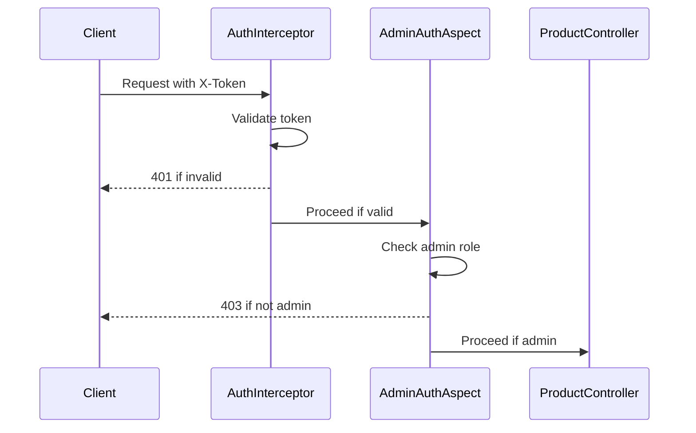
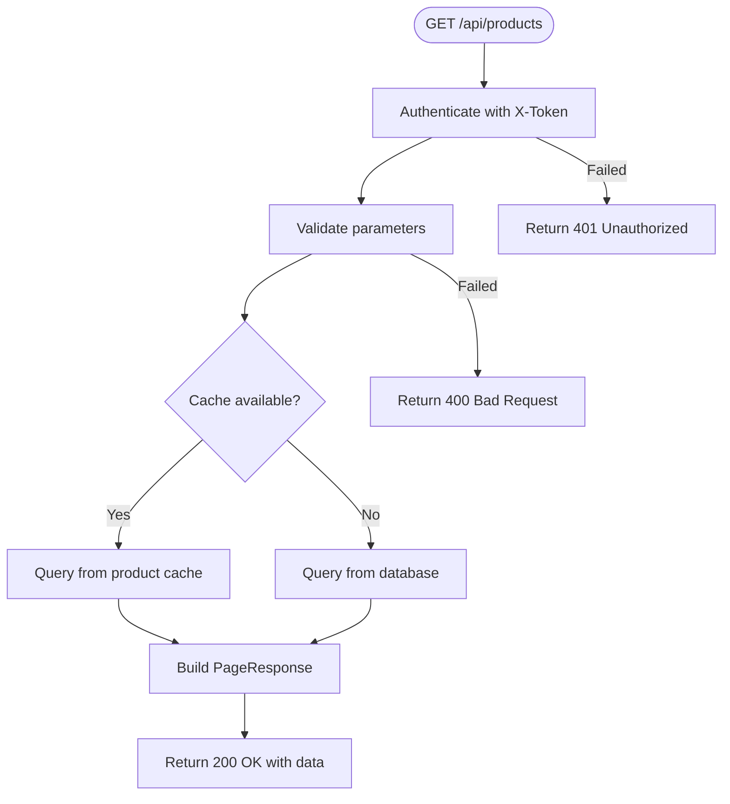

# Product Management API

<cite>
**Referenced Files in This Document**   
- [ProductController.java](file://src/main/java/com/example/onlinestore/controller/ProductController.java)
- [CreateProductRequest.java](file://src/main/java/com/example/onlinestore/dto/CreateProductRequest.java)
- [ProductPageRequest.java](file://src/main/java/com/example/onlinestore/dto/ProductPageRequest.java)
- [PageResponse.java](file://src/main/java/com/example/onlinestore/dto/PageResponse.java)
- [Product.java](file://src/main/java/com/example/onlinestore/model/Product.java)
- [ProductServiceImpl.java](file://src/main/java/com/example/onlinestore/service/impl/ProductServiceImpl.java)
- [AdminAuthAspect.java](file://src/main/java/com/example/onlinestore/aspect/AdminAuthAspect.java)
- [ValidationAspect.java](file://src/main/java/com/example/onlinestore/aspect/ValidationAspect.java)
- [AuthInterceptor.java](file://src/main/java/com/example/onlinestore/interceptor/AuthInterceptor.java)
- [messages.properties](file://src/main/resources/i18n/messages.properties)
</cite>

## Table of Contents
1. [Introduction](#introduction)
2. [Authentication and Authorization](#authentication-and-authorization)
3. [POST /api/products - Create Product](#post-apiproducts---create-product)
4. [GET /api/products - List Products](#get-apiproducts---list-products)
5. [Request/Response Schemas](#requestresponse-schemas)
6. [Error Handling](#error-handling)
7. [Performance Considerations](#performance-considerations)

## Introduction
This document provides comprehensive API documentation for the product management endpoints in the online-store application. It covers two primary endpoints: creating products and retrieving product lists with pagination. The API follows REST conventions, uses standard HTTP status codes, and implements robust validation and authorization mechanisms.

The product management system enables administrators to create new products and all authenticated users to retrieve paginated product listings. The implementation includes input validation, role-based access control, and performance optimizations through caching.

**Section sources**
- [ProductController.java](file://src/main/java/com/example/onlinestore/controller/ProductController.java#L1-L78)

## Authentication and Authorization
All product management endpoints require authentication via the `X-Token` header. The system uses token-based authentication where clients must include a valid token in the request header:

```
X-Token: <valid-token-here>
```

The `AuthInterceptor` validates the token on each request and sets the current user context. If the token is missing or invalid, the system returns a 401 Unauthorized response.

For the POST endpoint, additional authorization is required. The `@RequireAdmin` annotation enforces that only users with the administrator role can create products. The system checks the current user's username against the configured admin username (default: "admin") from the application configuration.



**Diagram sources**
- [AuthInterceptor.java](file://src/main/java/com/example/onlinestore/interceptor/AuthInterceptor.java#L23-L48)
- [AdminAuthAspect.java](file://src/main/java/com/example/onlinestore/aspect/AdminAuthAspect.java#L54-L71)

**Section sources**
- [AuthInterceptor.java](file://src/main/java/com/example/onlinestore/interceptor/AuthInterceptor.java#L1-L49)
- [AdminAuthAspect.java](file://src/main/java/com/example/onlinestore/aspect/AdminAuthAspect.java#L1-L71)

## POST /api/products - Create Product
Creates a new product in the system. This endpoint requires admin privileges and validates all input parameters.

### Request
- **Method**: POST
- **URL**: `/api/products`
- **Headers**: 
  - `X-Token`: Admin user token
  - `Content-Type`: application/json
- **Body**: JSON object with product details

### Example Request
```bash
curl -X POST "http://localhost:8080/api/products" \
  -H "X-Token: admin-token-123" \
  -H "Content-Type: application/json" \
  -d '{
    "name": "Wireless Headphones",
    "category": "Electronics",
    "price": 99.99
  }'
```

### Validation Rules
The request body is validated using the `@ValidateParams` aspect and JSR-303 annotations:
- `name`: Required, cannot be empty
- `category`: Required, cannot be empty  
- `price`: Required, must be at least 0.01

**Section sources**
- [ProductController.java](file://src/main/java/com/example/onlinestore/controller/ProductController.java#L36-L54)
- [CreateProductRequest.java](file://src/main/java/com/example/onlinestore/dto/CreateProductRequest.java#L1-L42)
- [ValidationAspect.java](file://src/main/java/com/example/onlinestore/aspect/ValidationAspect.java#L54-L79)

## GET /api/products - List Products
Retrieves a paginated list of products with optional filtering.

### Request
- **Method**: GET
- **URL**: `/api/products`
- **Headers**: `X-Token`: Valid user token
- **Query Parameters**:
  - `pageNum`: Page number (default: 1, min: 1)
  - `pageSize`: Number of items per page (default: 10, min: 1, max: 100)
  - `name`: Filter by product name (exact match)

### Example Request
```bash
curl -X GET "http://localhost:8080/api/products?pageNum=1&pageSize=10&name=Phone" \
  -H "X-Token: user-token-456"
```

### Response
Returns a `PageResponse` object containing:
- `records`: Array of product objects
- `total`: Total number of products matching the criteria
- `pageNum`: Current page number
- `pageSize`: Number of items per page



**Diagram sources**
- [ProductController.java](file://src/main/java/com/example/onlinestore/controller/ProductController.java#L62-L77)
- [ProductServiceImpl.java](file://src/main/java/com/example/onlinestore/service/impl/ProductServiceImpl.java#L60-L132)

**Section sources**
- [ProductController.java](file://src/main/java/com/example/onlinestore/controller/ProductController.java#L62-L77)
- [ProductPageRequest.java](file://src/main/java/com/example/onlinestore/dto/ProductPageRequest.java#L1-L39)
- [ProductServiceImpl.java](file://src/main/java/com/example/onlinestore/service/impl/ProductServiceImpl.java#L60-L132)

## Request/Response Schemas
### CreateProductRequest
Request body for creating a new product.

```json
{
  "name": "string",
  "category": "string", 
  "price": 0.01
}
```

**Section sources**
- [CreateProductRequest.java](file://src/main/java/com/example/onlinestore/dto/CreateProductRequest.java#L1-L42)

### ProductPageRequest
Query parameters for product listing.

```json
{
  "pageNum": 1,
  "pageSize": 10,
  "name": "string"
}
```

**Section sources**
- [ProductPageRequest.java](file://src/main/java/com/example/onlinestore/dto/ProductPageRequest.java#L1-L39)

### Product
Product entity returned in responses.

```json
{
  "id": 1,
  "name": "string",
  "category": "string",
  "price": 0.01,
  "createdAt": "2024-01-01T00:00:00",
  "updatedAt": "2024-01-01T00:00:00"
}
```

**Section sources**
- [Product.java](file://src/main/java/com/example/onlinestore/model/Product.java#L1-L61)

### PageResponse
Generic pagination response wrapper.

```json
{
  "records": [],
  "total": 0,
  "pageNum": 1,
  "pageSize": 10
}
```

**Section sources**
- [PageResponse.java](file://src/main/java/com/example/onlinestore/dto/PageResponse.java#L1-L42)

## Error Handling
The API returns standardized error responses with appropriate HTTP status codes.

### Common Status Codes
- **200 OK**: Successful operation
- **400 Bad Request**: Validation error or invalid parameters
- **401 Unauthorized**: Missing or invalid authentication token
- **403 Forbidden**: Insufficient permissions (non-admin user)
- **500 Internal Server Error**: System error

### Error Response Format
```json
{
  "message": "error description"
}
```

### Validation Error Messages
Localized error messages are returned for validation failures:
- `error.product.name.empty`: Product name cannot be empty
- `error.product.category.empty`: Product category cannot be empty
- `error.product.price.empty`: Product price cannot be empty
- `error.product.price.min`: Product price must be at least 0.01
- `error.page.number.min`: Page number must be at least 1
- `error.page.size.min`: Page size must be at least 1
- `error.page.size.max`: Page size must be at most 100

**Section sources**
- [ProductController.java](file://src/main/java/com/example/onlinestore/controller/ProductController.java#L45-L53)
- [messages.properties](file://src/main/resources/i18n/messages.properties#L1-L17)

## Performance Considerations
The product listing endpoint includes performance optimizations for handling large product catalogs.

### Caching Strategy
The system implements an in-memory cache for product data:
- Cache stores up to 1,000 most recently accessed products
- New products are automatically added to the cache
- When capacity is exceeded, the oldest product is removed
- Cache is populated on first access to improve subsequent query performance

### Database Optimization
For large catalogs (over 1,000 products), the system falls back to direct database queries with pagination:
- Uses offset-based pagination
- Database queries are optimized with appropriate indexes
- Count queries are executed separately to get total counts

### Recommendations
1. **For small catalogs (<1,000 products)**: The in-memory cache provides excellent performance
2. **For large catalogs**: Consider implementing Redis or other distributed caching solutions
3. **For high-traffic scenarios**: Implement response caching at the reverse proxy level
4. **For search functionality**: Consider integrating Elasticsearch for full-text search capabilities
5. **Monitor cache hit rates** and adjust cache size based on usage patterns

**Section sources**
- [ProductServiceImpl.java](file://src/main/java/com/example/onlinestore/service/impl/ProductServiceImpl.java#L28-L132)