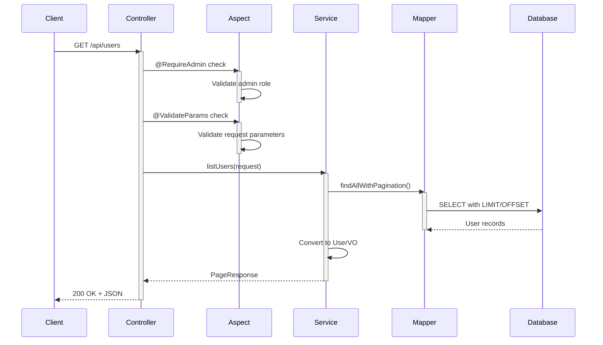
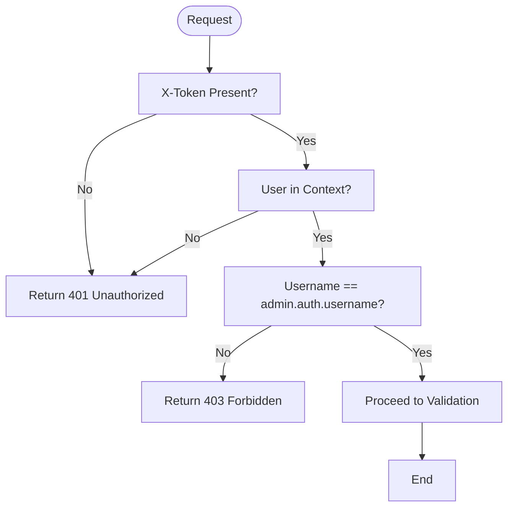
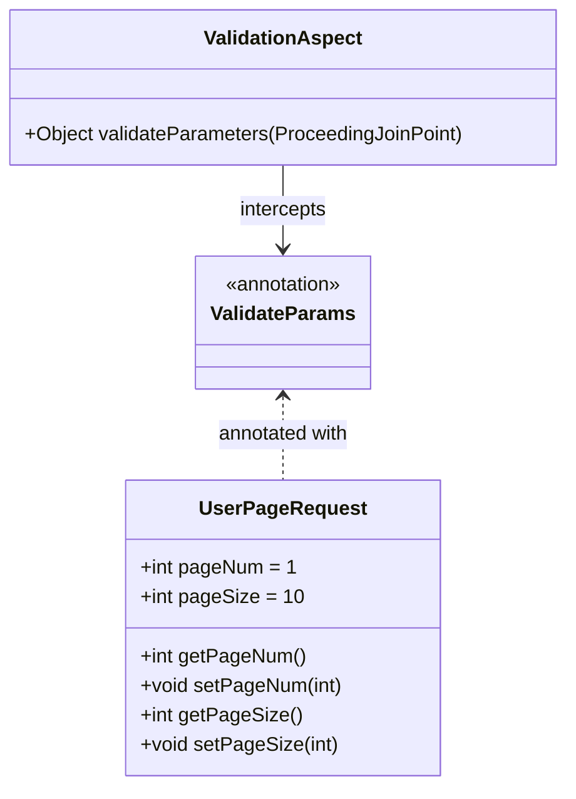
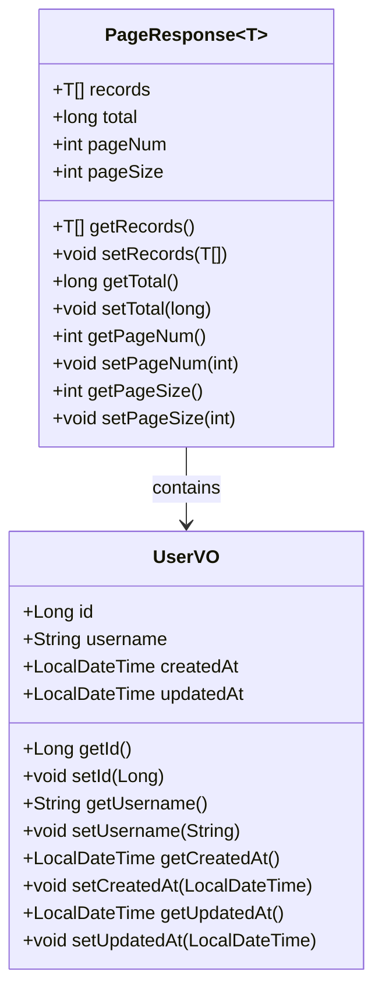
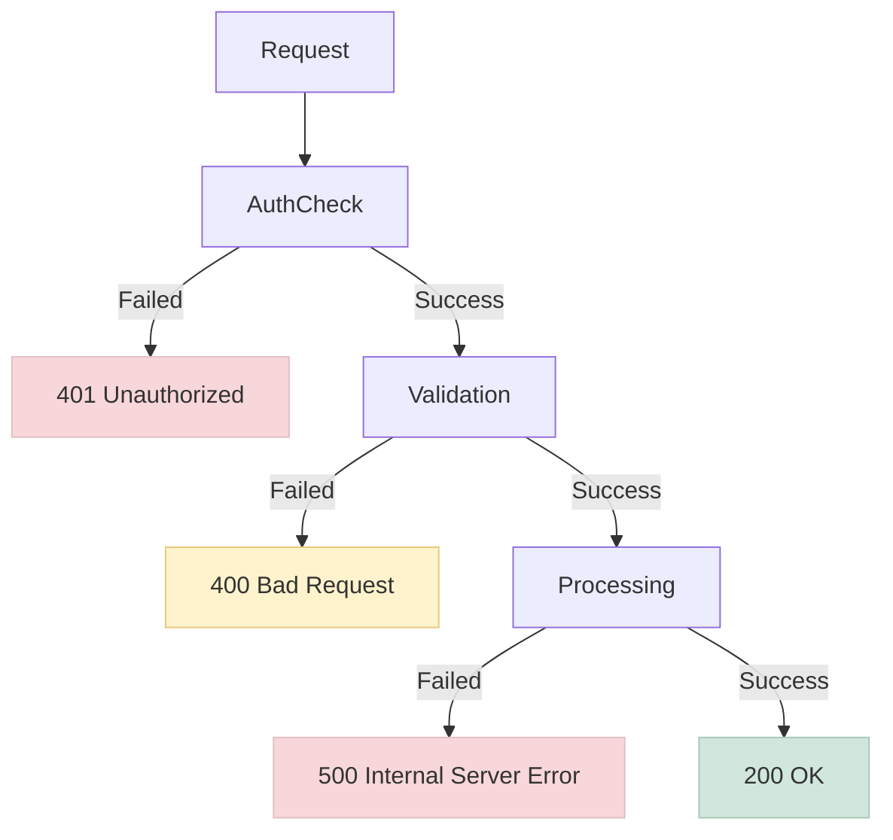

# User Management API

<cite>
**Referenced Files in This Document**   
- [UserController.java](file://src/main/java/com/example/onlinestore/controller/UserController.java)
- [UserPageRequest.java](file://src/main/java/com/example/onlinestore/dto/UserPageRequest.java)
- [PageResponse.java](file://src/main/java/com/example/onlinestore/dto/PageResponse.java)
- [UserVO.java](file://src/main/java/com/example/onlinestore/dto/UserVO.java)
- [RequireAdmin.java](file://src/main/java/com/example/onlinestore/annotation/RequireAdmin.java)
- [ValidateParams.java](file://src/main/java/com/example/onlinestore/annotation/ValidateParams.java)
- [AdminAuthAspect.java](file://src/main/java/com/example/onlinestore/aspect/AdminAuthAspect.java)
- [ValidationAspect.java](file://src/main/java/com/example/onlinestore/aspect/ValidationAspect.java)
- [UserServiceImpl.java](file://src/main/java/com/example/onlinestore/service/impl/UserServiceImpl.java)
- [UserMapper.java](file://src/main/java/com/example/onlinestore/mapper/UserMapper.java)
- [UserMapper.xml](file://src/main/resources/mapper/UserMapper.xml)
- [ErrorResponse.java](file://src/main/java/com/example/onlinestore/dto/ErrorResponse.java)
- [application.yml](file://src/main/resources/application.yml)
</cite>

## Table of Contents
1. [Introduction](#introduction)
2. [Endpoint Overview](#endpoint-overview)
3. [Security Model](#security-model)
4. [Request Parameters](#request-parameters)
5. [Response Structure](#response-structure)
6. [Error Handling](#error-handling)
7. [Pagination Implementation](#pagination-implementation)
8. [Performance Considerations](#performance-considerations)
9. [Usage Examples](#usage-examples)
10. [Monitoring and Logging](#monitoring-and-logging)

## Introduction

The GET /api/users endpoint provides administrative access to retrieve paginated user lists from the online-store application. This sensitive endpoint is restricted to administrators only and implements a robust security model combining token-based authentication and role-based authorization. The endpoint supports configurable pagination and returns structured responses with metadata for client-side processing.

**Section sources**
- [UserController.java](file://src/main/java/com/example/onlinestore/controller/UserController.java#L26-L65)

## Endpoint Overview

The GET /api/users endpoint retrieves a paginated list of users with essential user information. This administrative endpoint requires both authentication via the X-Token header and authorization through the @RequireAdmin annotation.



**Diagram sources**
- [UserController.java](file://src/main/java/com/example/onlinestore/controller/UserController.java#L41-L55)
- [UserServiceImpl.java](file://src/main/java/com/example/onlinestore/service/impl/UserServiceImpl.java#L154-L175)
- [UserMapper.java](file://src/main/java/com/example/onlinestore/mapper/UserMapper.java#L18-L20)

## Security Model

The endpoint implements a two-layer security model combining authentication and authorization:

1. **Authentication**: The X-Token header must be provided and validated by the authentication system
2. **Authorization**: The @RequireAdmin annotation enforces admin-only access through AOP

The AdminAuthAspect checks if the current user's username matches the configured admin username (default: "admin"). Non-admin users are denied access with a 403-equivalent response.



**Diagram sources**
- [AdminAuthAspect.java](file://src/main/java/com/example/onlinestore/aspect/AdminAuthAspect.java#L54-L70)
- [UserContext.java](file://src/main/java/com/example/onlinestore/context/UserContext.java#L5-L18)

**Section sources**
- [RequireAdmin.java](file://src/main/java/com/example/onlinestore/annotation/RequireAdmin.java#L8-L10)
- [AdminAuthAspect.java](file://src/main/java/com/example/onlinestore/aspect/AdminAuthAspect.java#L38-L70)

## Request Parameters

The endpoint accepts pagination parameters through the UserPageRequest object, validated using JSR-303 annotations:

| Parameter | Type | Required | Default | Constraints | Description |
|---------|------|----------|---------|-------------|-------------|
| pageNum | int | No | 1 | ≥ 1 | Page number (1-based) |
| pageSize | int | No | 10 | 1 ≤ size ≤ 100 | Number of items per page |

The @ValidateParams annotation triggers AOP-based validation that checks all method parameters for constraint violations.



**Diagram sources**
- [UserPageRequest.java](file://src/main/java/com/example/onlinestore/dto/UserPageRequest.java#L6-L28)
- [ValidateParams.java](file://src/main/java/com/example/onlinestore/annotation/ValidateParams.java#L8-L10)
- [ValidationAspect.java](file://src/main/java/com/example/onlinestore/aspect/ValidationAspect.java#L54-L78)

**Section sources**
- [UserPageRequest.java](file://src/main/java/com/example/onlinestore/dto/UserPageRequest.java#L6-L28)
- [ValidationAspect.java](file://src/main/java/com/example/onlinestore/aspect/ValidationAspect.java#L54-L78)

## Response Structure

The endpoint returns a PageResponse object containing user data and pagination metadata:

```json
{
  "records": [
    {
      "id": 1,
      "username": "admin",
      "createdAt": "2023-01-01T10:00:00",
      "updatedAt": "2023-01-01T10:00:00"
    }
  ],
  "total": 1,
  "pageNum": 1,
  "pageSize": 10
}
```



**Diagram sources**
- [PageResponse.java](file://src/main/java/com/example/onlinestore/dto/PageResponse.java#L5-L42)
- [UserVO.java](file://src/main/java/com/example/onlinestore/dto/UserVO.java#L5-L42)

**Section sources**
- [PageResponse.java](file://src/main/java/com/example/onlinestore/dto/PageResponse.java#L5-L42)
- [UserVO.java](file://src/main/java/com/example/onlinestore/dto/UserVO.java#L5-L42)

## Error Handling

The endpoint implements comprehensive error handling for various failure scenarios:



**Diagram sources**
- [UserController.java](file://src/main/java/com/example/onlinestore/controller/UserController.java#L56-L63)
- [ErrorResponse.java](file://src/main/java/com/example/onlinestore/dto/ErrorResponse.java#L3-L17)

**Section sources**
- [ErrorResponse.java](file://src/main/java/com/example/onlinestore/dto/ErrorResponse.java#L3-L17)
- [UserController.java](file://src/main/java/com/example/onlinestore/controller/UserController.java#L56-L63)

## Pagination Implementation

The pagination system uses offset-based pagination with LIMIT and OFFSET clauses:

```sql
SELECT id, username, token, token_expire_time, created_at, updated_at
FROM users
ORDER BY created_at DESC
LIMIT #{offset}, #{limit}
```

The implementation calculates offset as (pageNum - 1) * pageSize and executes two queries:
1. Data query with LIMIT/OFFSET for the current page
2. Count query to determine total record count

This approach ensures accurate pagination metadata but may have performance implications with large datasets.

**Section sources**
- [UserMapper.xml](file://src/main/resources/mapper/UserMapper.xml#L24-L29)
- [UserServiceImpl.java](file://src/main/java/com/example/onlinestore/service/impl/UserServiceImpl.java#L156-L162)

## Performance Considerations

The user list query performance depends on several factors:

1. **Database Indexing**: The ORDER BY created_at DESC clause should be supported by an index
2. **Large Offset Penalty**: Offset-based pagination becomes slower as pageNum increases
3. **Count Query Overhead**: The COUNT(*) query executes on every request
4. **Memory Usage**: All records for the current page are loaded into memory

For optimal performance with large user bases, consider:
- Adding an index on the created_at column
- Implementing cursor-based pagination for better large dataset performance
- Caching frequently accessed pages
- Adding search and filtering capabilities to reduce result set size

**Section sources**
- [UserMapper.java](file://src/main/java/com/example/onlinestore/mapper/UserMapper.java#L18-L20)
- [UserMapper.xml](file://src/main/resources/mapper/UserMapper.xml#L24-L33)

## Usage Examples

### Successful Request
```bash
curl -X GET "http://localhost:8080/api/users?pageNum=1&pageSize=10" \
  -H "X-Token: your-admin-token" \
  -H "Content-Type: application/json"
```

### Response (HTTP 200)
```json
{
  "records": [
    {
      "id": 1,
      "username": "admin",
      "createdAt": "2023-01-01T10:00:00",
      "updatedAt": "2023-01-01T10:00:00"
    },
    {
      "id": 2,
      "username": "user1",
      "createdAt": "2023-01-02T11:30:00",
      "updatedAt": "2023-01-02T11:30:00"
    }
  ],
  "total": 2,
  "pageNum": 1,
  "pageSize": 10
}
```

### Invalid Parameters (HTTP 400)
```bash
curl -X GET "http://localhost:8080/api/users?pageSize=101" \
  -H "X-Token: your-admin-token"
```

### System Error (HTTP 500)
```json
{
  "message": "System internal error"
}
```

**Section sources**
- [UserControllerTest.java](file://src/test/java/com/example/onlinestore/controller/UserControllerTest.java#L67-L126)

## Monitoring and Logging

The endpoint includes comprehensive logging for monitoring and debugging:

- DEBUG level: Request parameters and execution time
- WARN level: Validation failures and access denials
- ERROR level: Unhandled exceptions and system errors

Log entries include:
- Request processing start/end with parameters
- Execution duration for performance monitoring
- Security-related warnings for unauthorized access attempts
- Detailed error information for troubleshooting

These logs enable administrators to monitor usage patterns, detect suspicious activity, and troubleshoot issues effectively.

**Section sources**
- [UserController.java](file://src/main/java/com/example/onlinestore/controller/UserController.java#L46-L53)
- [AdminAuthAspect.java](file://src/main/java/com/example/onlinestore/aspect/AdminAuthAspect.java#L57-L69)
- [ValidationAspect.java](file://src/main/java/com/example/onlinestore/aspect/ValidationAspect.java#L70-L71)