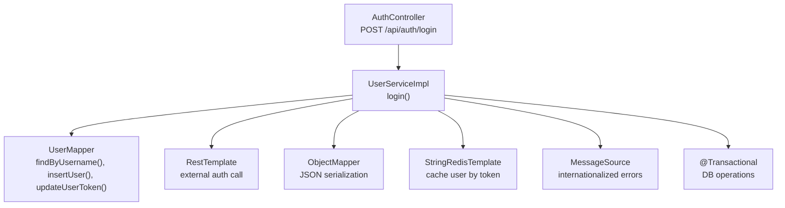
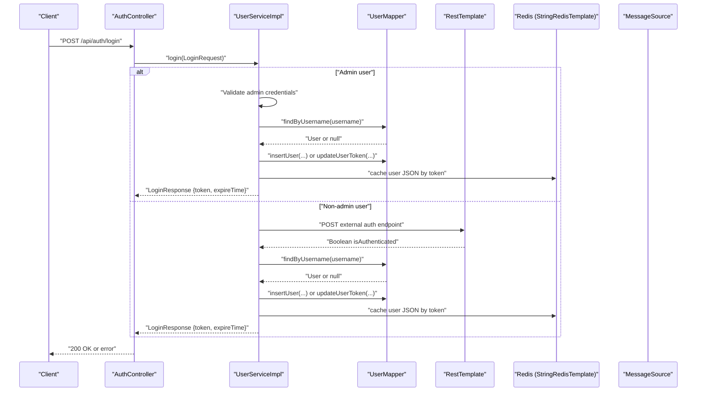
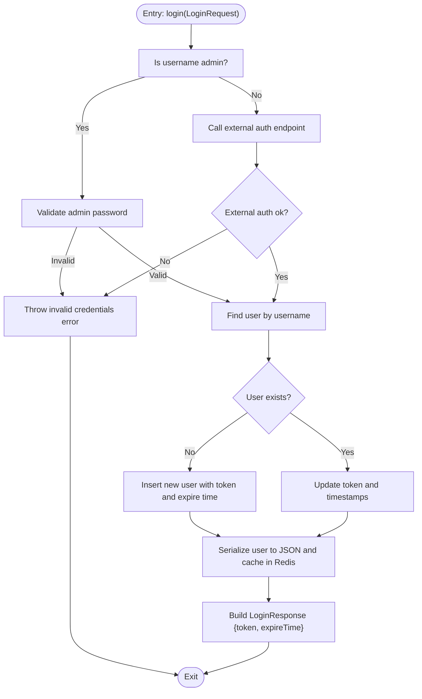
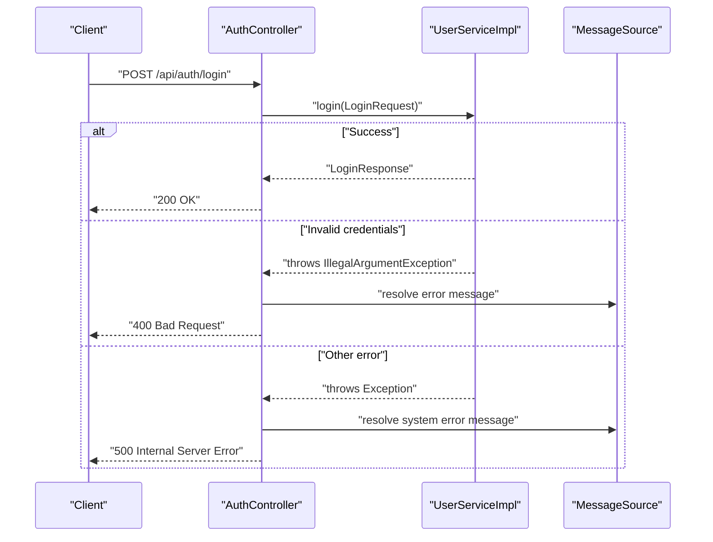
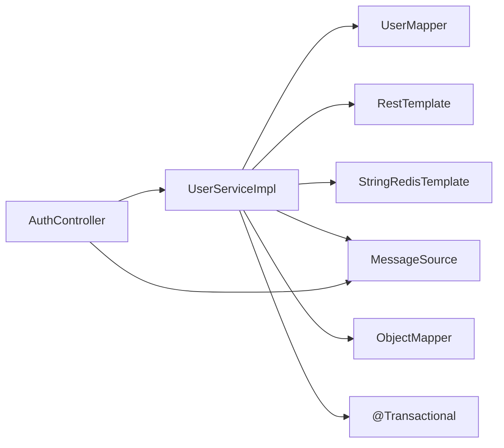

# Authentication Service

<cite>
**Referenced Files in This Document**
- [UserServiceImpl.java](file://src/main/java/com/example/onlinestore/service/impl/UserServiceImpl.java)
- [AuthController.java](file://src/main/java/com/example/onlinestore/controller/AuthController.java)
- [UserMapper.java](file://src/main/java/com/example/onlinestore/mapper/UserMapper.java)
- [RedisConfig.java](file://src/main/java/com/example/onlinestore/config/RedisConfig.java)
- [RestTemplateConfig.java](file://src/main/java/com/example/onlinestore/config/RestTemplateConfig.java)
- [MessageConfig.java](file://src/main/java/com/example/onlinestore/config/MessageConfig.java)
- [LoginRequest.java](file://src/main/java/com/example/onlinestore/dto/LoginRequest.java)
- [LoginResponse.java](file://src/main/java/com/example/onlinestore/dto/LoginResponse.java)
- [User.java](file://src/main/java/com/example/onlinestore/model/User.java)
- [application.yml](file://src/main/resources/application.yml)
- [messages.properties](file://src/main/resources/i18n/messages.properties)
- [messages_zh_CN.properties](file://src/main/resources/i18n/messages_zh_CN.properties)
- [UserServiceTest.java](file://src/test/java/com/example/onlinestore/service/UserServiceTest.java)
</cite>

## Table of Contents
1. [Introduction](#introduction)
2. [Project Structure](#project-structure)
3. [Core Components](#core-components)
4. [Architecture Overview](#architecture-overview)
5. [Detailed Component Analysis](#detailed-component-analysis)
6. [Dependency Analysis](#dependency-analysis)
7. [Performance Considerations](#performance-considerations)
8. [Troubleshooting Guide](#troubleshooting-guide)
9. [Conclusion](#conclusion)
10. [Appendices](#appendices)

## Introduction
This document explains the authentication service implementation centered on UserServiceImpl.login() and related flows. It covers:
- Administrator quick login with password validation
- External user service authentication for non-admin users
- Token generation using UUID and Redis caching of user session data
- Integration with RestTemplate, ObjectMapper, and MessageSource
- Transaction management with @Transactional
- Error handling for invalid credentials
- Race condition prevention during token updates
- Relationship between UserService and AuthController, UserMapper, and Redis

## Project Structure
The authentication flow spans controller, service, persistence, configuration, and resource layers:
- Controller: AuthController receives login requests and delegates to UserService
- Service: UserServiceImpl orchestrates login logic, token generation, and Redis caching
- Persistence: UserMapper interacts with the database to find/create/update users
- Configuration: RedisConfig, RestTemplateConfig, and MessageConfig provide infrastructure beans
- Resources: application.yml defines admin credentials and external service base URL; i18n messages support internationalized error messages

**Diagram sources**
- [AuthController.java](file://src/main/java/com/example/onlinestore/controller/AuthController.java#L29-L44)
- [UserServiceImpl.java](file://src/main/java/com/example/onlinestore/service/impl/UserServiceImpl.java#L67-L139)
- [UserMapper.java](file://src/main/java/com/example/onlinestore/mapper/UserMapper.java#L12-L16)
- [RestTemplateConfig.java](file://src/main/java/com/example/onlinestore/config/RestTemplateConfig.java#L10-L13)
- [RedisConfig.java](file://src/main/java/com/example/onlinestore/config/RedisConfig.java#L11-L14)
- [MessageConfig.java](file://src/main/java/com/example/onlinestore/config/MessageConfig.java#L16-L24)

**Section sources**
- [AuthController.java](file://src/main/java/com/example/onlinestore/controller/AuthController.java#L29-L44)
- [UserServiceImpl.java](file://src/main/java/com/example/onlinestore/service/impl/UserServiceImpl.java#L67-L139)
- [UserMapper.java](file://src/main/java/com/example/onlinestore/mapper/UserMapper.java#L12-L16)
- [RestTemplateConfig.java](file://src/main/java/com/example/onlinestore/config/RestTemplateConfig.java#L10-L13)
- [RedisConfig.java](file://src/main/java/com/example/onlinestore/config/RedisConfig.java#L11-L14)
- [MessageConfig.java](file://src/main/java/com/example/onlinestore/config/MessageConfig.java#L16-L24)

## Core Components
- AuthController: Exposes the login endpoint and translates exceptions into HTTP responses
- UserServiceImpl: Implements login, token generation, Redis caching, and DB updates
- UserMapper: Provides database operations for user lookup, creation, and token update
- RestTemplateConfig: Provides RestTemplate bean for external service calls
- RedisConfig: Provides StringRedisTemplate bean for Redis operations
- MessageConfig: Provides MessageSource and LocaleResolver for internationalization
- DTOs: LoginRequest and LoginResponse define request/response shapes
- Model: User holds user attributes including token and expiration

**Section sources**
- [AuthController.java](file://src/main/java/com/example/onlinestore/controller/AuthController.java#L29-L44)
- [UserServiceImpl.java](file://src/main/java/com/example/onlinestore/service/impl/UserServiceImpl.java#L67-L139)
- [UserMapper.java](file://src/main/java/com/example/onlinestore/mapper/UserMapper.java#L12-L16)
- [RestTemplateConfig.java](file://src/main/java/com/example/onlinestore/config/RestTemplateConfig.java#L10-L13)
- [RedisConfig.java](file://src/main/java/com/example/onlinestore/config/RedisConfig.java#L11-L14)
- [MessageConfig.java](file://src/main/java/com/example/onlinestore/config/MessageConfig.java#L16-L24)
- [LoginRequest.java](file://src/main/java/com/example/onlinestore/dto/LoginRequest.java#L1-L22)
- [LoginResponse.java](file://src/main/java/com/example/onlinestore/dto/LoginResponse.java#L1-L24)
- [User.java](file://src/main/java/com/example/onlinestore/model/User.java#L1-L60)

## Architecture Overview
The authentication flow integrates REST, database, and Redis:
- AuthController receives a LoginRequest and calls UserService.login()
- For administrators, credentials are validated locally; otherwise, an external user service is called via RestTemplate
- On success, a UUID token is generated, the user record is created or updated, and user data is cached in Redis
- Internationalized error messages are returned on failures

**Diagram sources**
- [AuthController.java](file://src/main/java/com/example/onlinestore/controller/AuthController.java#L29-L44)
- [UserServiceImpl.java](file://src/main/java/com/example/onlinestore/service/impl/UserServiceImpl.java#L67-L139)
- [UserMapper.java](file://src/main/java/com/example/onlinestore/mapper/UserMapper.java#L12-L16)
- [RestTemplateConfig.java](file://src/main/java/com/example/onlinestore/config/RestTemplateConfig.java#L10-L13)
- [RedisConfig.java](file://src/main/java/com/example/onlinestore/config/RedisConfig.java#L11-L14)
- [MessageConfig.java](file://src/main/java/com/example/onlinestore/config/MessageConfig.java#L16-L24)

## Detailed Component Analysis

### UserServiceImpl.login() and createLoginResponse()
- Administrator quick login:
  - Compares request username/password to configured admin credentials
  - On success, returns a LoginResponse with token and expiration
  - On failure, throws an IllegalArgumentException with an internationalized message
- Non-admin login:
  - Calls external user service at configured base URL plus "/auth"
  - If the external service returns false or null, throws an IllegalArgumentException with an internationalized message
  - On success, proceeds to create or update the user and cache session data
- Token generation and caching:
  - Generates a UUID token and sets expiration to one day
  - Creates a user record if not present; otherwise updates token and timestamps
  - Serializes the user object to JSON using ObjectMapper and caches it under a Redis key prefixed with "token:"
- Transaction management:
  - The login method is annotated with @Transactional to ensure DB operations are atomic

**Diagram sources**
- [UserServiceImpl.java](file://src/main/java/com/example/onlinestore/service/impl/UserServiceImpl.java#L67-L139)
- [UserMapper.java](file://src/main/java/com/example/onlinestore/mapper/UserMapper.java#L12-L16)
- [RedisConfig.java](file://src/main/java/com/example/onlinestore/config/RedisConfig.java#L11-L14)
- [MessageConfig.java](file://src/main/java/com/example/onlinestore/config/MessageConfig.java#L16-L24)

**Section sources**
- [UserServiceImpl.java](file://src/main/java/com/example/onlinestore/service/impl/UserServiceImpl.java#L67-L139)
- [UserMapper.java](file://src/main/java/com/example/onlinestore/mapper/UserMapper.java#L12-L16)
- [RedisConfig.java](file://src/main/java/com/example/onlinestore/config/RedisConfig.java#L11-L14)
- [MessageConfig.java](file://src/main/java/com/example/onlinestore/config/MessageConfig.java#L16-L24)

### AuthController Integration
- Receives LoginRequest and invokes UserService.login()
- Catches IllegalArgumentException and returns 400 with the localized message
- Catches other exceptions and returns 500 with a system error message resolved by MessageSource

**Diagram sources**
- [AuthController.java](file://src/main/java/com/example/onlinestore/controller/AuthController.java#L29-L44)
- [MessageConfig.java](file://src/main/java/com/example/onlinestore/config/MessageConfig.java#L16-L24)

**Section sources**
- [AuthController.java](file://src/main/java/com/example/onlinestore/controller/AuthController.java#L29-L44)
- [MessageConfig.java](file://src/main/java/com/example/onlinestore/config/MessageConfig.java#L16-L24)

### External User Service Authentication
- Base URL for the external user service is configured via application.yml
- The service appends "/auth" to the base URL and posts the LoginRequest
- If the response is null or false, authentication fails and an internationalized error is thrown

**Section sources**
- [application.yml](file://src/main/resources/application.yml#L41-L44)
- [UserServiceImpl.java](file://src/main/java/com/example/onlinestore/service/impl/UserServiceImpl.java#L83-L92)
- [RestTemplateConfig.java](file://src/main/java/com/example/onlinestore/config/RestTemplateConfig.java#L10-L13)

### Token Generation, Expiration, and Redis Caching
- Token: Generated using UUID.randomUUID()
- Expiration: One day from now
- Redis key: "token:" + token
- Serialization: ObjectMapper writes the User object to JSON
- Caching: StringRedisTemplate stores the JSON with TTL in days

**Section sources**
- [UserServiceImpl.java](file://src/main/java/com/example/onlinestore/service/impl/UserServiceImpl.java#L97-L139)
- [RedisConfig.java](file://src/main/java/com/example/onlinestore/config/RedisConfig.java#L11-L14)
- [User.java](file://src/main/java/com/example/onlinestore/model/User.java#L1-L60)

### Transaction Management and Race Condition Prevention
- @Transactional ensures that user creation/update and DB operations occur atomically
- Race condition prevention:
  - Token update occurs within the same transactional method
  - Redis caching happens after DB update completes, minimizing inconsistency windows
  - No concurrent token updates are performed elsewhere in the login flow

**Section sources**
- [UserServiceImpl.java](file://src/main/java/com/example/onlinestore/service/impl/UserServiceImpl.java#L67-L139)

### Internationalized Error Messages
- MessageSource loads i18n bundles from i18n/messages.properties and messages_zh_CN.properties
- LocaleResolver supports English and Simplified Chinese
- Invalid credentials error key is used consistently across admin and external auth failures

**Section sources**
- [MessageConfig.java](file://src/main/java/com/example/onlinestore/config/MessageConfig.java#L16-L35)
- [messages.properties](file://src/main/resources/i18n/messages.properties#L1-L17)
- [messages_zh_CN.properties](file://src/main/resources/i18n/messages_zh_CN.properties#L1-L17)
- [UserServiceImpl.java](file://src/main/java/com/example/onlinestore/service/impl/UserServiceImpl.java#L78-L81)
- [UserServiceImpl.java](file://src/main/java/com/example/onlinestore/service/impl/UserServiceImpl.java#L89-L92)
- [AuthController.java](file://src/main/java/com/example/onlinestore/controller/AuthController.java#L35-L43)

### DTOs and Model
- LoginRequest: carries username and password
- LoginResponse: carries token and expireTime
- User: holds username, token, tokenExpireTime, and timestamps

**Section sources**
- [LoginRequest.java](file://src/main/java/com/example/onlinestore/dto/LoginRequest.java#L1-L22)
- [LoginResponse.java](file://src/main/java/com/example/onlinestore/dto/LoginResponse.java#L1-L24)
- [User.java](file://src/main/java/com/example/onlinestore/model/User.java#L1-L60)

## Dependency Analysis
- UserServiceImpl depends on:
  - RestTemplate for external authentication
  - UserMapper for DB operations
  - StringRedisTemplate for caching
  - MessageSource for error messages
  - ObjectMapper for JSON serialization
  - @Transactional for DB atomicity
- AuthController depends on UserService and MessageSource
- Configuration beans are provided by RestTemplateConfig, RedisConfig, and MessageConfig

**Diagram sources**
- [AuthController.java](file://src/main/java/com/example/onlinestore/controller/AuthController.java#L29-L44)
- [UserServiceImpl.java](file://src/main/java/com/example/onlinestore/service/impl/UserServiceImpl.java#L67-L139)
- [UserMapper.java](file://src/main/java/com/example/onlinestore/mapper/UserMapper.java#L12-L16)
- [RestTemplateConfig.java](file://src/main/java/com/example/onlinestore/config/RestTemplateConfig.java#L10-L13)
- [RedisConfig.java](file://src/main/java/com/example/onlinestore/config/RedisConfig.java#L11-L14)
- [MessageConfig.java](file://src/main/java/com/example/onlinestore/config/MessageConfig.java#L16-L24)

**Section sources**
- [AuthController.java](file://src/main/java/com/example/onlinestore/controller/AuthController.java#L29-L44)
- [UserServiceImpl.java](file://src/main/java/com/example/onlinestore/service/impl/UserServiceImpl.java#L67-L139)
- [UserMapper.java](file://src/main/java/com/example/onlinestore/mapper/UserMapper.java#L12-L16)
- [RestTemplateConfig.java](file://src/main/java/com/example/onlinestore/config/RestTemplateConfig.java#L10-L13)
- [RedisConfig.java](file://src/main/java/com/example/onlinestore/config/RedisConfig.java#L11-L14)
- [MessageConfig.java](file://src/main/java/com/example/onlinestore/config/MessageConfig.java#L16-L24)

## Performance Considerations
- Token generation is lightweight and fast
- ObjectMapper serialization is straightforward; ensure minimal user data is cached
- Redis TTL aligns with token expiration to prevent stale entries
- External auth calls are synchronous; consider timeouts and retries for reliability
- Transaction boundaries keep DB operations efficient and consistent

[No sources needed since this section provides general guidance]

## Troubleshooting Guide
Common issues and solutions:
- External user service unavailable:
  - Symptom: login throws an exception and AuthController returns 500
  - Solution: verify service URL configuration, network connectivity, and health checks
- Invalid credentials:
  - Symptom: 400 Bad Request with internationalized message
  - Solution: confirm admin credentials and external service auth payload
- Redis caching failures:
  - Symptom: user data not cached; login succeeds but subsequent token lookups fail
  - Solution: check Redis connectivity and permissions; note that caching is best-effort
- Transaction rollback:
  - Symptom: user not persisted or token not updated
  - Solution: inspect DB connectivity and ensure @Transactional is effective

Concrete examples from tests:
- Admin login with wrong password triggers invalid credentials error
- Normal user login returning false triggers invalid credentials error
- Successful admin/new user login creates user and caches data
- Successful normal/existing user login updates token and caches data

**Section sources**
- [UserServiceTest.java](file://src/test/java/com/example/onlinestore/service/UserServiceTest.java#L203-L252)
- [UserServiceTest.java](file://src/test/java/com/example/onlinestore/service/UserServiceTest.java#L124-L201)
- [AuthController.java](file://src/main/java/com/example/onlinestore/controller/AuthController.java#L35-L43)
- [UserServiceImpl.java](file://src/main/java/com/example/onlinestore/service/impl/UserServiceImpl.java#L78-L81)
- [UserServiceImpl.java](file://src/main/java/com/example/onlinestore/service/impl/UserServiceImpl.java#L89-L92)

## Conclusion
UserServiceImpl.login() provides a robust authentication flow:
- Administrators are authenticated locally with configurable credentials
- Non-admin users are authenticated via an external service
- Tokens are generated, persisted, and cached for session management
- Internationalized error messages improve UX across locales
- Transactional DB operations ensure consistency and minimize race conditions

[No sources needed since this section summarizes without analyzing specific files]

## Appendices

### Configuration References
- Admin credentials and external service base URL:
  - [application.yml](file://src/main/resources/application.yml#L41-L48)
- MessageSource and LocaleResolver:
  - [MessageConfig.java](file://src/main/java/com/example/onlinestore/config/MessageConfig.java#L16-L35)
- Redis and RestTemplate beans:
  - [RedisConfig.java](file://src/main/java/com/example/onlinestore/config/RedisConfig.java#L11-L14)
  - [RestTemplateConfig.java](file://src/main/java/com/example/onlinestore/config/RestTemplateConfig.java#L10-L13)

**Section sources**
- [application.yml](file://src/main/resources/application.yml#L41-L48)
- [MessageConfig.java](file://src/main/java/com/example/onlinestore/config/MessageConfig.java#L16-L35)
- [RedisConfig.java](file://src/main/java/com/example/onlinestore/config/RedisConfig.java#L11-L14)
- [RestTemplateConfig.java](file://src/main/java/com/example/onlinestore/config/RestTemplateConfig.java#L10-L13)