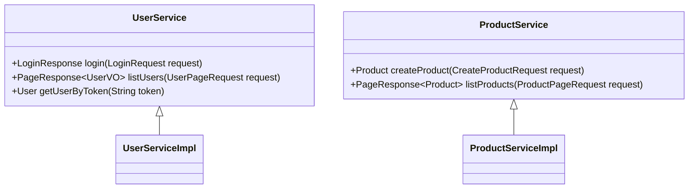
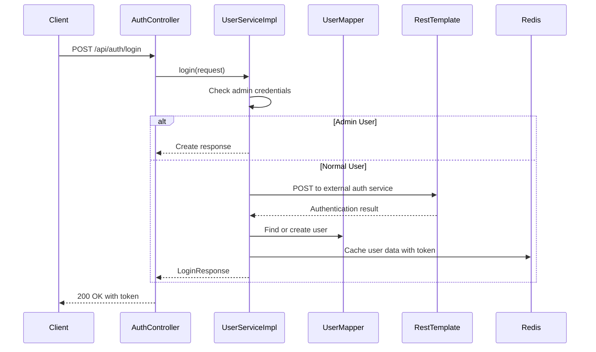
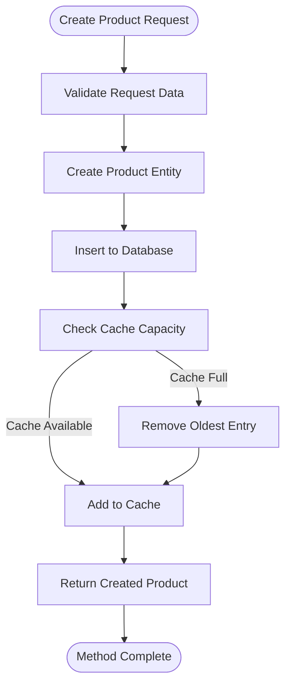
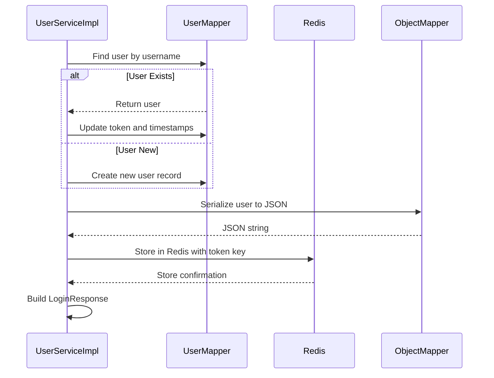
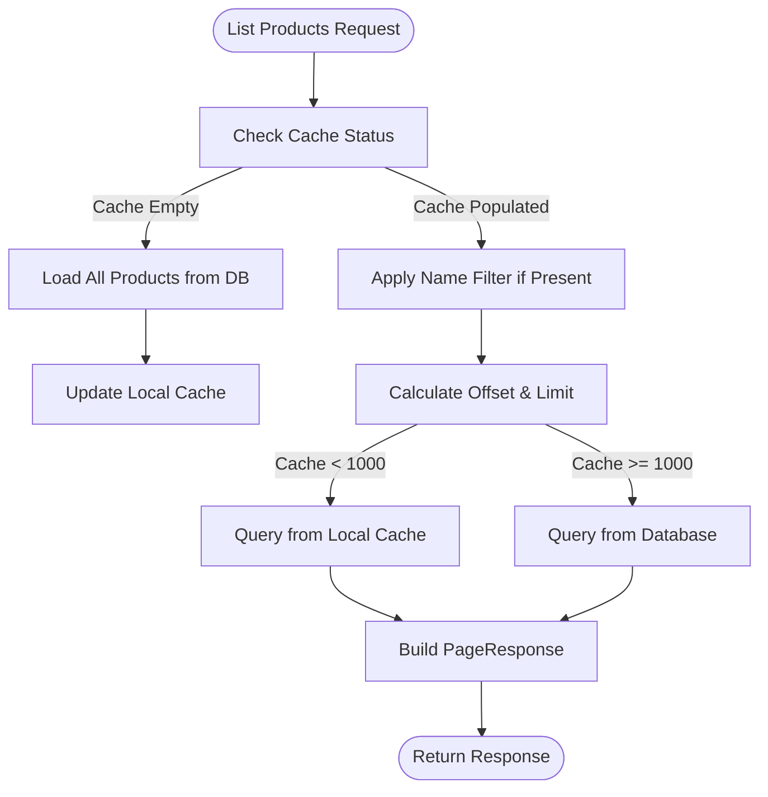
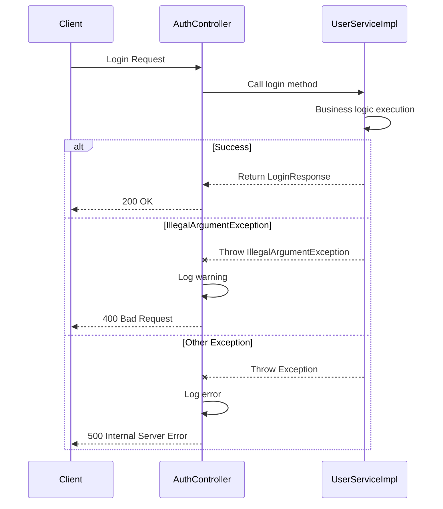
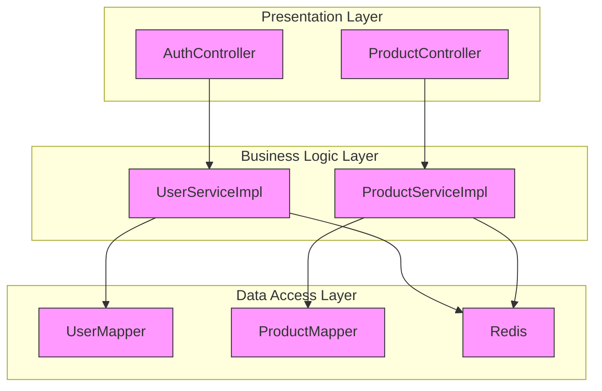
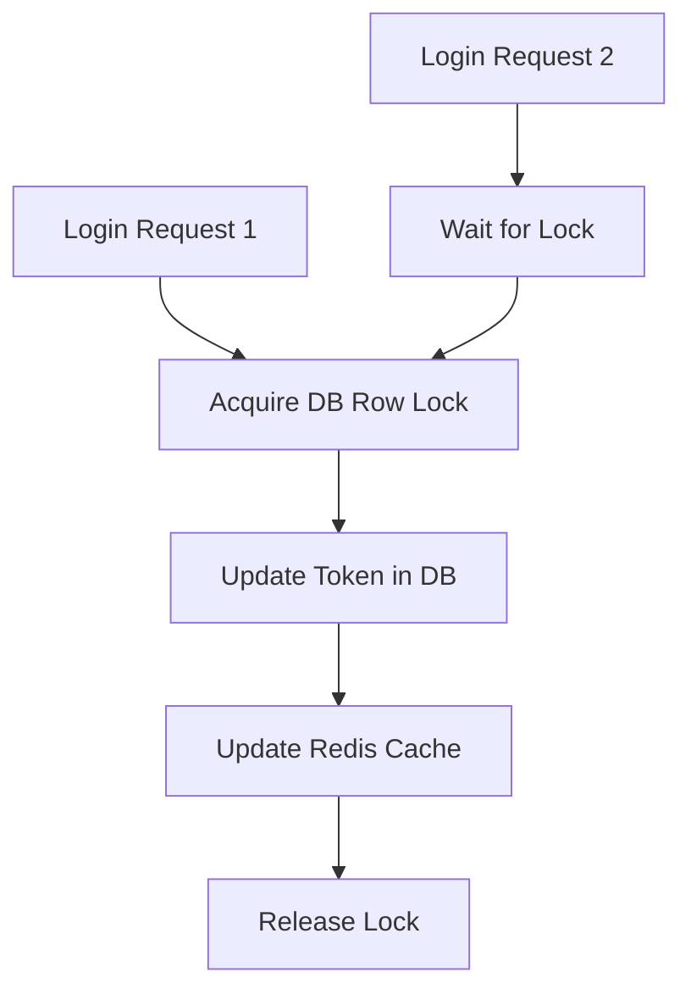

# Business Logic Layer

<cite>
**Referenced Files in This Document**   
- [UserService.java](file://src/main/java/com/example/onlinestore/service/UserService.java)
- [UserServiceImpl.java](file://src/main/java/com/example/onlinestore/service/impl/UserServiceImpl.java)
- [ProductService.java](file://src/main/java/com/example/onlinestore/service/ProductService.java)
- [ProductServiceImpl.java](file://src/main/java/com/example/onlinestore/service/impl/ProductServiceImpl.java)
- [AuthController.java](file://src/main/java/com/example/onlinestore/controller/AuthController.java)
- [UserMapper.java](file://src/main/java/com/example/onlinestore/mapper/UserMapper.java)
- [ProductMapper.java](file://src/main/java/com/example/onlinestore/mapper/ProductMapper.java)
- [RedisConfig.java](file://src/main/java/com/example/onlinestore/config/RedisConfig.java)
- [AuthInterceptor.java](file://src/main/java/com/example/onlinestore/interceptor/AuthInterceptor.java)
- [User.java](file://src/main/java/com/example/onlinestore/model/User.java)
- [Product.java](file://src/main/java/com/example/onlinestore/model/Product.java)
- [LoginRequest.java](file://src/main/java/com/example/onlinestore/dto/LoginRequest.java)
- [LoginResponse.java](file://src/main/java/com/example/onlinestore/dto/LoginResponse.java)
- [UserContext.java](file://src/main/java/com/example/onlinestore/context/UserContext.java)
- [application.yml](file://src/main/resources/application.yml)
</cite>

## Table of Contents
1. [Introduction](#introduction)
2. [Service Interface Design](#service-interface-design)
3. [User Service Implementation](#user-service-implementation)
4. [Product Service Implementation](#product-service-implementation)
5. [Login Workflow Analysis](#login-workflow-analysis)
6. [Product Management Logic](#product-management-logic)
7. [Transaction Management](#transaction-management)
8. [Error Handling Patterns](#error-handling-patterns)
9. [Integration with Controllers and Data Access Layer](#integration-with-controllers-and-data-access-layer)
10. [Common Issues and Solutions](#common-issues-and-solutions)

## Introduction
The business logic layer of the online-store application implements core functionality for user authentication and product management. This document provides a comprehensive analysis of the UserService and ProductService interfaces and their implementations, focusing on the login workflow, product creation and listing with pagination, transaction management, and error handling patterns. The architecture follows a layered approach with clear separation between controllers, services, and data access components.

## Service Interface Design

The application defines two primary service interfaces that encapsulate business logic contracts:

- **UserService**: Handles user authentication and user listing operations
- **ProductService**: Manages product creation and retrieval operations

These interfaces provide abstraction between the controller layer and implementation details, enabling loose coupling and easier testing.



**Diagram sources**
- [UserService.java](file://src/main/java/com/example/onlinestore/service/UserService.java#L10-L14)
- [ProductService.java](file://src/main/java/com/example/onlinestore/service/ProductService.java#L8-L11)

**Section sources**
- [UserService.java](file://src/main/java/com/example/onlinestore/service/UserService.java#L1-L14)
- [ProductService.java](file://src/main/java/com/example/onlinestore/service/ProductService.java#L1-L11)

## User Service Implementation

The UserServiceImpl class provides concrete implementation of user-related business logic, including authentication, token management, and user listing with pagination support.

### Login and Authentication Flow

The `login()` method implements a dual authentication mechanism:
1. **Admin Quick Login**: Direct credential validation for administrator accounts
2. **External Service Authentication**: Integration with external user-service for regular users



**Diagram sources**
- [UserServiceImpl.java](file://src/main/java/com/example/onlinestore/service/impl/UserServiceImpl.java#L67-L95)
- [AuthController.java](file://src/main/java/com/example/onlinestore/controller/AuthController.java#L29-L44)

**Section sources**
- [UserServiceImpl.java](file://src/main/java/com/example/onlinestore/service/impl/UserServiceImpl.java#L31-L193)

## Product Service Implementation

The ProductServiceImpl class handles product management operations with built-in caching and pagination capabilities.

### Product Creation Process

The `createProduct()` method follows a transactional approach to ensure data consistency:



**Diagram sources**
- [ProductServiceImpl.java](file://src/main/java/com/example/onlinestore/service/impl/ProductServiceImpl.java#L34-L57)

**Section sources**
- [ProductServiceImpl.java](file://src/main/java/com/example/onlinestore/service/impl/ProductServiceImpl.java#L21-L132)

## Login Workflow Analysis

The login workflow integrates multiple components to provide secure authentication with token-based session management.

### Token Generation and Caching

When a user successfully authenticates, the system:
1. Generates a UUID-based token
2. Updates user record in database with new token and expiration time
3. Caches user information in Redis with token as key
4. Returns token and expiration time to client



**Diagram sources**
- [UserServiceImpl.java](file://src/main/java/com/example/onlinestore/service/impl/UserServiceImpl.java#L97-L139)

## Product Management Logic

The product management system implements efficient data retrieval with multi-level caching and pagination support.

### Pagination Implementation

The `listProducts()` method supports pagination with the following parameters:
- Page number (pageNum)
- Page size (pageSize)
- Optional product name filter



**Diagram sources**
- [ProductServiceImpl.java](file://src/main/java/com/example/onlinestore/service/impl/ProductServiceImpl.java#L60-L132)

## Transaction Management

The application uses Spring's declarative transaction management to ensure data consistency.

### Transaction Boundaries

Transactional boundaries are defined at the service method level using the `@Transactional` annotation:

```mermaid
classDiagram
class UserServiceImpl {
+@Transactional login(LoginRequest)
+getUserByToken(String)
+listUsers(UserPageRequest)
}
class ProductServiceImpl {
+@Transactional createProduct(CreateProductRequest)
+listProducts(ProductPageRequest)
}
note right of UserServiceImpl : : +@Transactional login(LoginRequest)
Transaction spans :
- External service call
- Database user update/insert
- Redis cache update
end note
note right of ProductServiceImpl : : +@Transactional createProduct(CreateProductRequest)
Transaction spans :
- Database product insertion
- Cache maintenance
end note
```

**Diagram sources**
- [UserServiceImpl.java](file://src/main/java/com/example/onlinestore/service/impl/UserServiceImpl.java#L68)
- [ProductServiceImpl.java](file://src/main/java/com/example/onlinestore/service/impl/ProductServiceImpl.java#L34)

## Error Handling Patterns

The application implements a comprehensive error handling strategy across layers.

### Exception Handling Flow



**Diagram sources**
- [AuthController.java](file://src/main/java/com/example/onlinestore/controller/AuthController.java#L34-L42)
- [UserServiceImpl.java](file://src/main/java/com/example/onlinestore/service/impl/UserServiceImpl.java#L78-L80)

## Integration with Controllers and Data Access Layer

The business logic layer serves as an intermediary between controllers and data access components.

### Component Relationships



**Diagram sources**
- [AuthController.java](file://src/main/java/com/example/onlinestore/controller/AuthController.java#L24)
- [UserServiceImpl.java](file://src/main/java/com/example/onlinestore/service/impl/UserServiceImpl.java#L59-L62)
- [ProductServiceImpl.java](file://src/main/java/com/example/onlinestore/service/impl/ProductServiceImpl.java#L26)

## Common Issues and Solutions

### Race Conditions in Token Updates

**Issue**: Concurrent login requests for the same user could lead to race conditions where multiple tokens are generated and stored.

**Solution**: The current implementation uses database-level transactions to ensure atomic updates to user tokens. The `updateUserToken()` method in UserMapper is executed within a transactional context, preventing concurrent modifications.



**Section sources**
- [UserServiceImpl.java](file://src/main/java/com/example/onlinestore/service/impl/UserServiceImpl.java#L114-L121)
- [UserMapper.java](file://src/main/java/com/example/onlinestore/mapper/UserMapper.java#L14)