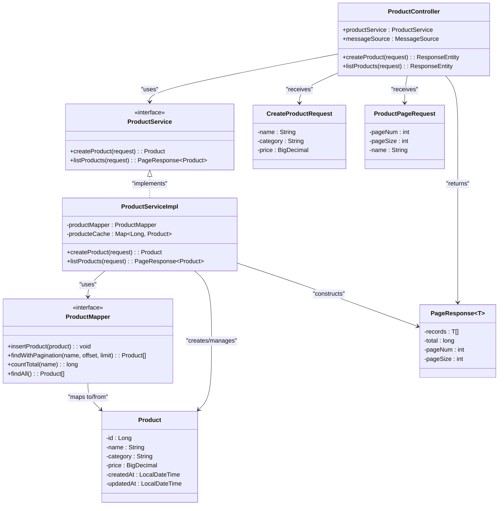
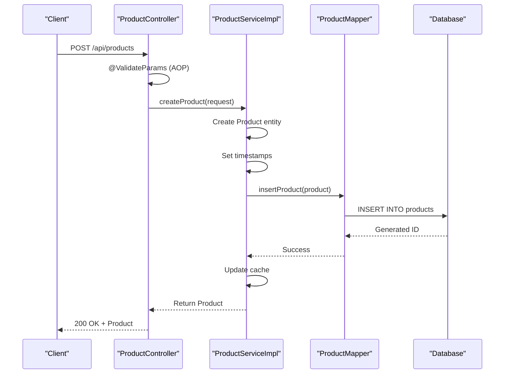
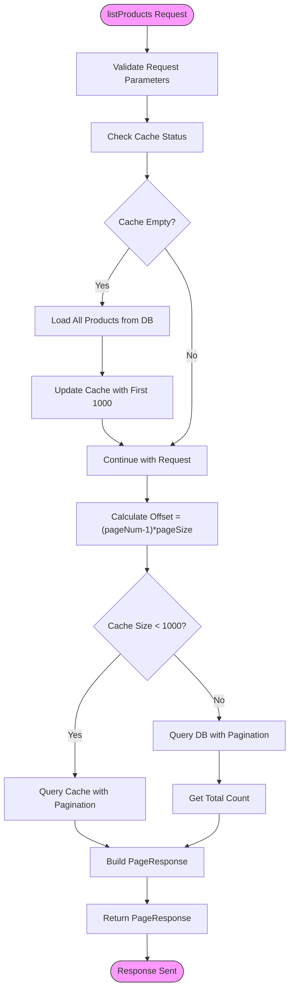
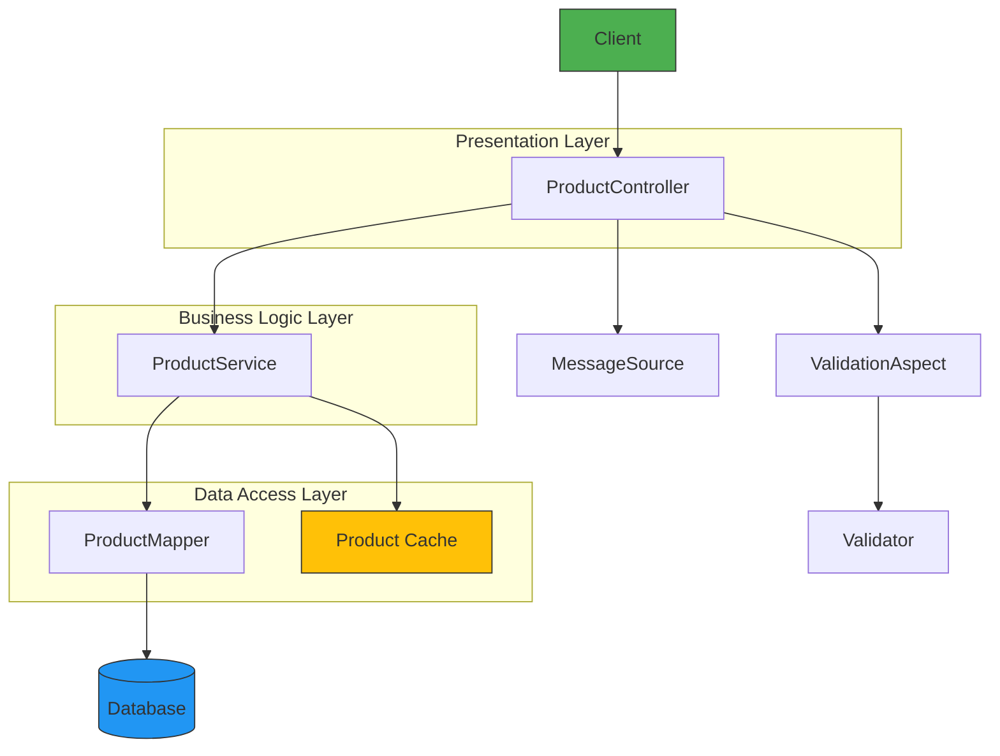
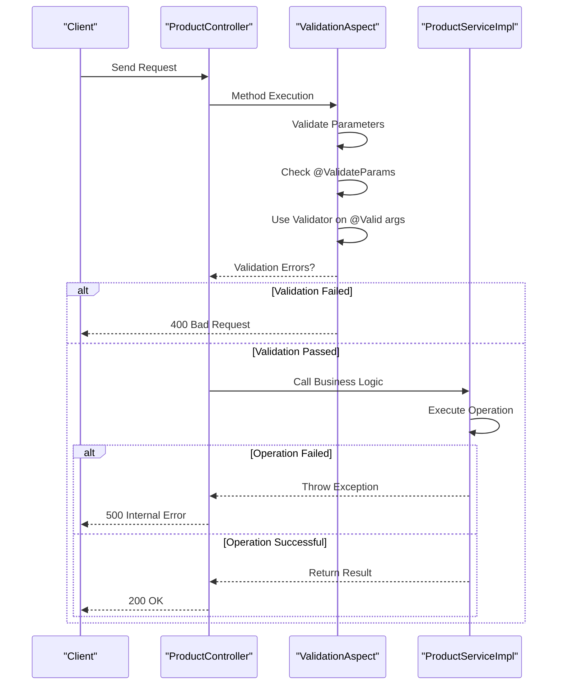
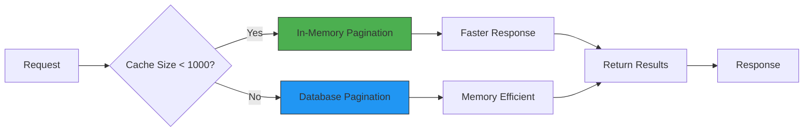

# Product Service

<cite>
**Referenced Files in This Document**   
- [ProductServiceImpl.java](file://src/main/java/com/example/onlinestore/service/impl/ProductServiceImpl.java)
- [ProductService.java](file://src/main/java/com/example/onlinestore/service/ProductService.java)
- [ProductController.java](file://src/main/java/com/example/onlinestore/controller/ProductController.java)
- [ProductMapper.java](file://src/main/java/com/example/onlinestore/mapper/ProductMapper.java)
- [ProductMapper.xml](file://src/main/resources/mapper/ProductMapper.xml)
- [CreateProductRequest.java](file://src/main/java/com/example/onlinestore/dto/CreateProductRequest.java)
- [ProductPageRequest.java](file://src/main/java/com/example/onlinestore/dto/ProductPageRequest.java)
- [PageResponse.java](file://src/main/java/com/example/onlinestore/dto/PageResponse.java)
- [Product.java](file://src/main/java/com/example/onlinestore/model/Product.java)
- [ValidationAspect.java](file://src/main/java/com/example/onlinestore/aspect/ValidationAspect.java)
- [ValidateParams.java](file://src/main/java/com/example/onlinestore/annotation/ValidateParams.java)
- [MyBatisConfig.java](file://src/main/java/com/example/onlinestore/config/MyBatisConfig.java)
</cite>

## Table of Contents
1. [Introduction](#introduction)
2. [Core Components](#core-components)
3. [Product Creation Process](#product-creation-process)
4. [Product Listing with Pagination](#product-listing-with-pagination)
5. [Component Relationships](#component-relationships)
6. [Error Handling and Validation](#error-handling-and-validation)
7. [Performance Considerations](#performance-considerations)
8. [Common Issues and Solutions](#common-issues-and-solutions)
9. [Conclusion](#conclusion)

## Introduction
The Product Service in the online store application provides essential functionality for managing products, including creation and retrieval with pagination support. This document details the implementation of the `ProductServiceImpl` class, which handles business logic for product operations, including request validation, database persistence, response generation, and caching strategies. The service follows a layered architecture with clear separation of concerns between controllers, services, and data access components.

## Core Components

This section outlines the key components involved in the product management functionality.

**Diagram sources**
- [ProductController.java](file://src/main/java/com/example/onlinestore/controller/ProductController.java#L19-L78)
- [ProductService.java](file://src/main/java/com/example/onlinestore/service/ProductService.java#L8-L11)
- [ProductServiceImpl.java](file://src/main/java/com/example/onlinestore/service/impl/ProductServiceImpl.java#L22-L132)
- [ProductMapper.java](file://src/main/java/com/example/onlinestore/mapper/ProductMapper.java#L10-L20)
- [Product.java](file://src/main/java/com/example/onlinestore/model/Product.java#L6-L61)
- [CreateProductRequest.java](file://src/main/java/com/example/onlinestore/dto/CreateProductRequest.java#L8-L42)
- [ProductPageRequest.java](file://src/main/java/com/example/onlinestore/dto/ProductPageRequest.java#L6-L39)
- [PageResponse.java](file://src/main/java/com/example/onlinestore/dto/PageResponse.java#L5-L42)

**Section sources**
- [ProductController.java](file://src/main/java/com/example/onlinestore/controller/ProductController.java#L1-L78)
- [ProductService.java](file://src/main/java/com/example/onlinestore/service/ProductService.java#L1-L11)
- [ProductServiceImpl.java](file://src/main/java/com/example/onlinestore/service/impl/ProductServiceImpl.java#L1-L132)
- [ProductMapper.java](file://src/main/java/com/example/onlinestore/mapper/ProductMapper.java#L1-L20)

## Product Creation Process

The product creation process begins with a POST request to the `/api/products` endpoint, handled by the `ProductController`. The process involves several key steps: request validation, entity creation, database persistence, and response generation.

The `createProduct` method in `ProductServiceImpl` first creates a new `Product` entity from the `CreateProductRequest` data, setting the creation and update timestamps. It then persists the product to the database using `ProductMapper.insertProduct()`, which executes an INSERT statement. After successful persistence, the product is added to an in-memory cache for faster subsequent access. The method returns the created product entity, which is then returned to the client as a JSON response.

**Section sources**
- [ProductServiceImpl.java](file://src/main/java/com/example/onlinestore/service/impl/ProductServiceImpl.java#L35-L57)
- [ProductController.java](file://src/main/java/com/example/onlinestore/controller/ProductController.java#L36-L54)
- [ProductMapper.java](file://src/main/java/com/example/onlinestore/mapper/ProductMapper.java#L11-L11)
- [ProductMapper.xml](file://src/main/resources/mapper/ProductMapper.xml#L4-L7)

## Product Listing with Pagination

The product listing functionality supports pagination through the `listProducts` method, which accepts a `ProductPageRequest` containing page number and page size parameters. The implementation includes both database queries and an in-memory caching strategy to optimize performance.

The `listProducts` method first calculates the offset and limit for pagination using the formula `offset = (pageNum - 1) * pageSize`. It then checks if the product cache is empty, and if so, loads all products from the database into the cache. For requests when the cache contains fewer than 1000 products, the method performs pagination on the cached data. When the cache exceeds 1000 products, it falls back to database pagination queries to avoid memory issues. The method constructs a `PageResponse` object containing the paginated records, total count, page number, and page size.

**Section sources**
- [ProductServiceImpl.java](file://src/main/java/com/example/onlinestore/service/impl/ProductServiceImpl.java#L60-L132)
- [ProductService.java](file://src/main/java/com/example/onlinestore/service/ProductService.java#L10-L10)
- [ProductPageRequest.java](file://src/main/java/com/example/onlinestore/dto/ProductPageRequest.java#L6-L39)
- [PageResponse.java](file://src/main/java/com/example/onlinestore/dto/PageResponse.java#L5-L42)
- [ProductMapper.xml](file://src/main/resources/mapper/ProductMapper.xml#L9-L36)

## Component Relationships

The product management functionality is implemented using a layered architecture with clear separation of concerns. The components interact through well-defined interfaces, promoting maintainability and testability.

The `ProductController` serves as the entry point for HTTP requests, handling request/response serialization and delegating business logic to the `ProductService`. The `ProductService` interface defines the contract for product operations, implemented by `ProductServiceImpl` which contains the actual business logic. The service uses `ProductMapper` for database operations and maintains an in-memory cache for performance optimization. Cross-cutting concerns like validation are handled by aspects such as `ValidationAspect`, which intercepts method calls to validate parameters before execution.

**Diagram sources**
- [ProductController.java](file://src/main/java/com/example/onlinestore/controller/ProductController.java#L19-L78)
- [ProductServiceImpl.java](file://src/main/java/com/example/onlinestore/service/impl/ProductServiceImpl.java#L22-L132)
- [ProductMapper.java](file://src/main/java/com/example/onlinestore/mapper/ProductMapper.java#L10-L20)
- [ValidationAspect.java](file://src/main/java/com/example/onlinestore/aspect/ValidationAspect.java#L36-L79)

**Section sources**
- [ProductController.java](file://src/main/java/com/example/onlinestore/controller/ProductController.java#L1-L78)
- [ProductServiceImpl.java](file://src/main/java/com/example/onlinestore/service/impl/ProductServiceImpl.java#L1-L132)
- [ProductMapper.java](file://src/main/java/com/example/onlinestore/mapper/ProductMapper.java#L1-L20)
- [ValidationAspect.java](file://src/main/java/com/example/onlinestore/aspect/ValidationAspect.java#L1-L79)

## Error Handling and Validation

The application implements comprehensive error handling and validation at multiple levels to ensure data integrity and provide meaningful feedback to clients.

Validation occurs at multiple levels. The `@ValidateParams` annotation triggers the `ValidationAspect`, which uses JSR-303 validation to check all method parameters annotated with `@Valid`. For product creation, the `CreateProductRequest` class contains validation constraints such as `@NotBlank` for name and category, and `@DecimalMin` for price. These constraints ensure that required fields are present and values meet minimum requirements. Error messages are localized using `MessageSource`, allowing the application to return user-friendly error messages in the client's preferred language.

**Section sources**
- [ValidationAspect.java](file://src/main/java/com/example/onlinestore/aspect/ValidationAspect.java#L36-L79)
- [ValidateParams.java](file://src/main/java/com/example/onlinestore/annotation/ValidateParams.java#L8-L11)
- [CreateProductRequest.java](file://src/main/java/com/example/onlinestore/dto/CreateProductRequest.java#L9-L17)
- [ProductController.java](file://src/main/java/com/example/onlinestore/controller/ProductController.java#L37-L54)
- [ProductServiceImpl.java](file://src/main/java/com/example/onlinestore/service/impl/ProductServiceImpl.java#L45-L57)

## Performance Considerations

The product service implementation includes several performance optimizations, particularly around data access and caching strategies.

The service employs a hybrid caching strategy where frequently accessed products are stored in an in-memory HashMap cache. This cache is initialized when empty by loading all products from the database, which reduces the number of database queries for subsequent requests. The cache has a maximum capacity of 1000 products, after which the oldest entries are removed to prevent memory issues.

For pagination, the implementation intelligently chooses between in-memory and database pagination based on cache size. When the cache contains fewer than 1000 products, pagination is performed in-memory, which is faster than database queries. For larger datasets, the service falls back to database-level pagination using LIMIT and OFFSET clauses, which is more memory-efficient.

The MyBatis configuration enables camel case mapping, which improves performance by eliminating the need for explicit column-to-property mapping. Database queries are optimized with appropriate indexing (implied by the schema), and the use of parameterized queries prevents SQL injection while allowing query plan caching.

**Diagram sources**
- [ProductServiceImpl.java](file://src/main/java/com/example/onlinestore/service/impl/ProductServiceImpl.java#L65-L114)
- [ProductMapper.xml](file://src/main/resources/mapper/ProductMapper.xml#L9-L19)
- [MyBatisConfig.java](file://src/main/java/com/example/onlinestore/config/MyBatisConfig.java#L21-L23)

**Section sources**
- [ProductServiceImpl.java](file://src/main/java/com/example/onlinestore/service/impl/ProductServiceImpl.java#L31-L56)
- [ProductMapper.xml](file://src/main/resources/mapper/ProductMapper.xml#L9-L36)
- [MyBatisConfig.java](file://src/main/java/com/example/onlinestore/config/MyBatisConfig.java#L1-L27)

## Common Issues and Solutions

This section addresses common issues that may arise when using the product service and provides solutions for each.

**Invalid Pagination Parameters**: The `ProductPageRequest` class validates pagination parameters with `@Min` and `@Max` constraints, ensuring page number is at least 1 and page size is between 1 and 100. This prevents inefficient queries with excessively large page sizes or invalid page numbers.

**Database Constraint Violations**: While the current schema doesn't show product table constraints, typical issues like duplicate names or null required fields would be caught by the validation in `CreateProductRequest` before reaching the database. The service should be enhanced with database-level constraints and appropriate exception handling.

**Cache Inconsistency**: The current implementation updates the cache on product creation but doesn't handle updates or deletions, which could lead to stale data. A complete solution would implement cache invalidation strategies for all CRUD operations.

**Memory Usage**: The in-memory cache has a fixed limit of 1000 products, but could be enhanced with a proper eviction policy like LRU (Least Recently Used) instead of removing the first entry. For production use, consider using Redis or another distributed cache.

**Solution Recommendations**:
1. Implement cache invalidation for update and delete operations
2. Add database constraints for product uniqueness and required fields
3. Enhance the cache with LRU eviction policy
4. Add monitoring for cache hit/miss ratios
5. Implement proper error handling for database constraint violations

**Section sources**
- [ProductPageRequest.java](file://src/main/java/com/example/onlinestore/dto/ProductPageRequest.java#L7-L12)
- [CreateProductRequest.java](file://src/main/java/com/example/onlinestore/dto/CreateProductRequest.java#L9-L17)
- [ProductServiceImpl.java](file://src/main/java/com/example/onlinestore/service/impl/ProductServiceImpl.java#L31-L56)

## Conclusion

The Product Service implementation provides a robust foundation for product management in the online store application. The service follows sound architectural principles with clear separation of concerns between presentation, business logic, and data access layers. Key features include comprehensive validation, pagination support, and performance optimizations through caching.

The implementation demonstrates effective use of Spring framework features including dependency injection, transaction management, and aspect-oriented programming for cross-cutting concerns. The validation aspect provides a clean way to handle parameter validation across multiple endpoints without code duplication.

While the current implementation is functional, there are opportunities for improvement, particularly in cache management and error handling. Future enhancements should focus on implementing proper cache invalidation, adding database constraints, and improving monitoring capabilities. The service provides a solid foundation that can be extended to support additional product management features as the application evolves.