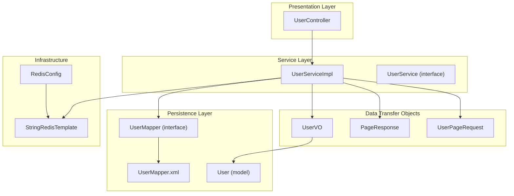
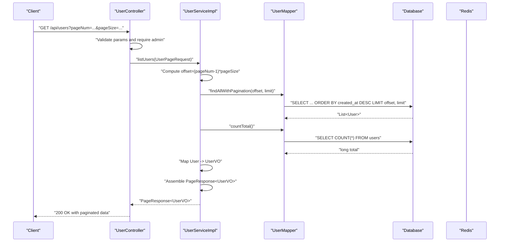
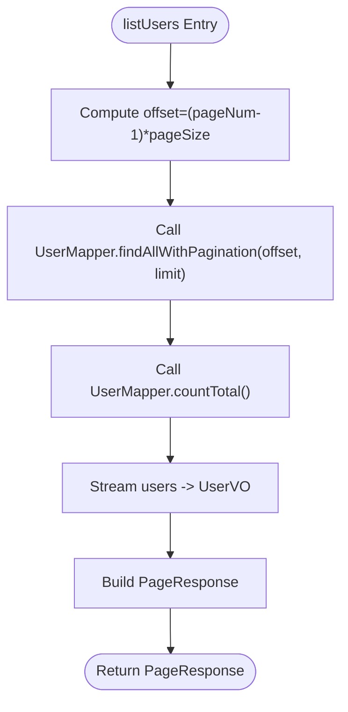
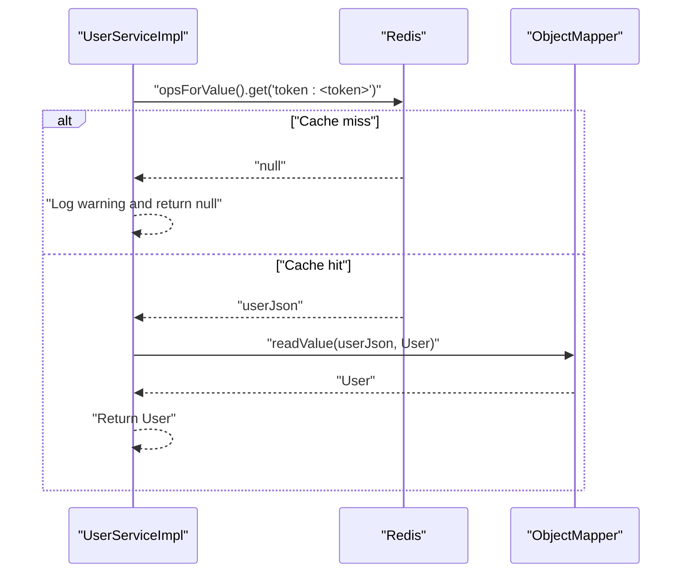
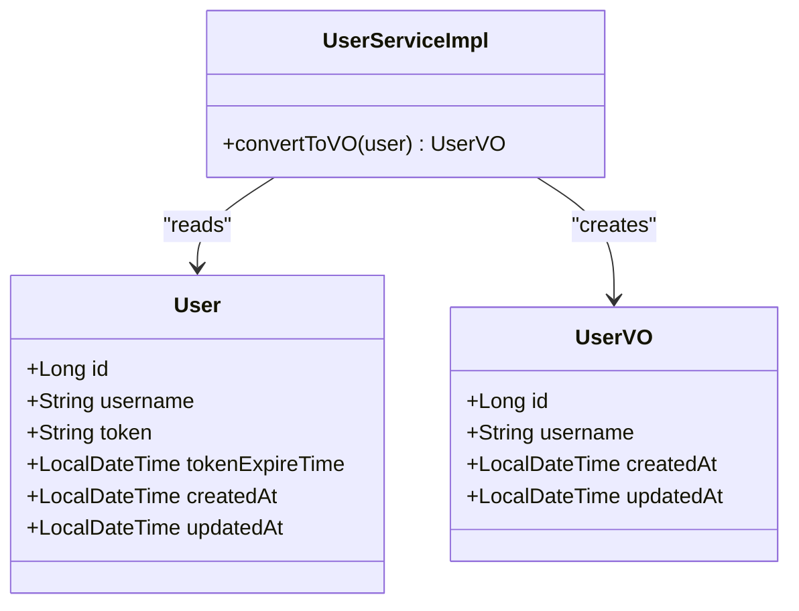
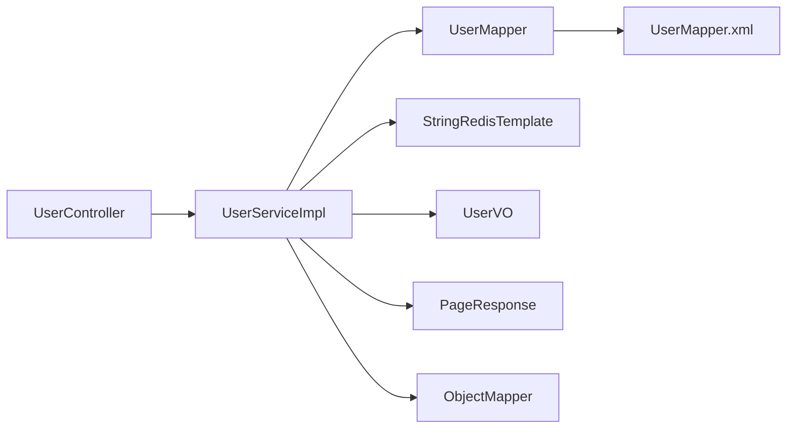

# User Service

<cite>
**Referenced Files in This Document**
- [UserServiceImpl.java](file://src/main/java/com/example/onlinestore/service/impl/UserServiceImpl.java)
- [UserService.java](file://src/main/java/com/example/onlinestore/service/UserService.java)
- [UserController.java](file://src/main/java/com/example/onlinestore/controller/UserController.java)
- [UserMapper.java](file://src/main/java/com/example/onlinestore/mapper/UserMapper.java)
- [UserMapper.xml](file://src/main/resources/mapper/UserMapper.xml)
- [UserVO.java](file://src/main/java/com/example/onlinestore/dto/UserVO.java)
- [PageResponse.java](file://src/main/java/com/example/onlinestore/dto/PageResponse.java)
- [UserPageRequest.java](file://src/main/java/com/example/onlinestore/dto/UserPageRequest.java)
- [RedisConfig.java](file://src/main/java/com/example/onlinestore/config/RedisConfig.java)
- [User.java](file://src/main/java/com/example/onlinestore/model/User.java)
</cite>

## Table of Contents
1. [Introduction](#introduction)
2. [Project Structure](#project-structure)
3. [Core Components](#core-components)
4. [Architecture Overview](#architecture-overview)
5. [Detailed Component Analysis](#detailed-component-analysis)
6. [Dependency Analysis](#dependency-analysis)
7. [Performance Considerations](#performance-considerations)
8. [Troubleshooting Guide](#troubleshooting-guide)
9. [Conclusion](#conclusion)

## Introduction
This document explains the user management service centered around the UserServiceImpl implementation. It focuses on:
- listUsers: pagination logic, database query execution, entity-to-VO conversion, and PageResponse assembly
- getUserByToken: session validation using Redis cache lookup with JSON deserialization
- UserVO pattern for API response shaping and data exposure control
- The relationships among UserService, UserController, UserMapper, and Redis
- Common issues such as cache misses and pagination edge cases
- Performance considerations for user listing queries and cache efficiency

## Project Structure
The user management feature spans the controller, service, mapper, and DTO layers, plus Redis configuration and persistence mapping.

**Diagram sources**
- [UserController.java](file://src/main/java/com/example/onlinestore/controller/UserController.java#L1-L66)
- [UserServiceImpl.java](file://src/main/java/com/example/onlinestore/service/impl/UserServiceImpl.java#L1-L193)
- [UserService.java](file://src/main/java/com/example/onlinestore/service/UserService.java#L1-L14)
- [UserMapper.java](file://src/main/java/com/example/onlinestore/mapper/UserMapper.java#L1-L23)
- [UserMapper.xml](file://src/main/resources/mapper/UserMapper.xml#L1-L34)
- [UserVO.java](file://src/main/java/com/example/onlinestore/dto/UserVO.java#L1-L42)
- [PageResponse.java](file://src/main/java/com/example/onlinestore/dto/PageResponse.java#L1-L42)
- [UserPageRequest.java](file://src/main/java/com/example/onlinestore/dto/UserPageRequest.java#L1-L29)
- [RedisConfig.java](file://src/main/java/com/example/onlinestore/config/RedisConfig.java#L1-L15)
- [User.java](file://src/main/java/com/example/onlinestore/model/User.java#L1-L60)

**Section sources**
- [UserController.java](file://src/main/java/com/example/onlinestore/controller/UserController.java#L1-L66)
- [UserServiceImpl.java](file://src/main/java/com/example/onlinestore/service/impl/UserServiceImpl.java#L1-L193)
- [UserMapper.java](file://src/main/java/com/example/onlinestore/mapper/UserMapper.java#L1-L23)
- [UserMapper.xml](file://src/main/resources/mapper/UserMapper.xml#L1-L34)
- [UserVO.java](file://src/main/java/com/example/onlinestore/dto/UserVO.java#L1-L42)
- [PageResponse.java](file://src/main/java/com/example/onlinestore/dto/PageResponse.java#L1-L42)
- [UserPageRequest.java](file://src/main/java/com/example/onlinestore/dto/UserPageRequest.java#L1-L29)
- [RedisConfig.java](file://src/main/java/com/example/onlinestore/config/RedisConfig.java#L1-L15)
- [User.java](file://src/main/java/com/example/onlinestore/model/User.java#L1-L60)

## Core Components
- UserServiceImpl: Implements user authentication, token lifecycle, user listing with pagination, and Redis-backed session validation.
- UserController: Exposes GET /api/users with admin-only access and parameter validation.
- UserMapper and UserMapper.xml: Define SQL queries for pagination and counting.
- UserVO: Defines the API surface for user data exposure.
- PageResponse: Standardized paginated response container.
- UserPageRequest: Validates pageNum and pageSize constraints.
- RedisConfig and StringRedisTemplate: Provide Redis client bean for caching.

**Section sources**
- [UserServiceImpl.java](file://src/main/java/com/example/onlinestore/service/impl/UserServiceImpl.java#L1-L193)
- [UserController.java](file://src/main/java/com/example/onlinestore/controller/UserController.java#L1-L66)
- [UserMapper.java](file://src/main/java/com/example/onlinestore/mapper/UserMapper.java#L1-L23)
- [UserMapper.xml](file://src/main/resources/mapper/UserMapper.xml#L1-L34)
- [UserVO.java](file://src/main/java/com/example/onlinestore/dto/UserVO.java#L1-L42)
- [PageResponse.java](file://src/main/java/com/example/onlinestore/dto/PageResponse.java#L1-L42)
- [UserPageRequest.java](file://src/main/java/com/example/onlinestore/dto/UserPageRequest.java#L1-L29)
- [RedisConfig.java](file://src/main/java/com/example/onlinestore/config/RedisConfig.java#L1-L15)

## Architecture Overview
The user listing flow is a typical MVC pipeline with service-layer pagination and Redis-backed session validation.

**Diagram sources**
- [UserController.java](file://src/main/java/com/example/onlinestore/controller/UserController.java#L1-L66)
- [UserServiceImpl.java](file://src/main/java/com/example/onlinestore/service/impl/UserServiceImpl.java#L153-L176)
- [UserMapper.java](file://src/main/java/com/example/onlinestore/mapper/UserMapper.java#L1-L23)
- [UserMapper.xml](file://src/main/resources/mapper/UserMapper.xml#L1-L34)
- [UserVO.java](file://src/main/java/com/example/onlinestore/dto/UserVO.java#L1-L42)
- [PageResponse.java](file://src/main/java/com/example/onlinestore/dto/PageResponse.java#L1-L42)

## Detailed Component Analysis

### UserServiceImpl: listUsers
- Pagination logic:
  - Offset computed as (pageNum - 1) × pageSize
  - Limit equals pageSize
- Database query execution:
  - Uses UserMapper.findAllWithPagination(offset, limit) to fetch a page
  - Uses UserMapper.countTotal() to get total count
- Entity-to-VO conversion:
  - Converts each User to UserVO via a dedicated converter method
- PageResponse assembly:
  - Populates records, total, pageNum, and pageSize

Concrete examples from the implementation:
- [listUsers(UserPageRequest)](file://src/main/java/com/example/onlinestore/service/impl/UserServiceImpl.java#L153-L176)
- [UserMapper.findAllWithPagination(...)](file://src/main/java/com/example/onlinestore/mapper/UserMapper.java#L18-L18)
- [UserMapper.countTotal()](file://src/main/java/com/example/onlinestore/mapper/UserMapper.java#L20-L20)
- [convertToVO(User)](file://src/main/java/com/example/onlinestore/service/impl/UserServiceImpl.java#L141-L151)
- [UserVO](file://src/main/java/com/example/onlinestore/dto/UserVO.java#L1-L42)
- [PageResponse](file://src/main/java/com/example/onlinestore/dto/PageResponse.java#L1-L42)

**Diagram sources**
- [UserServiceImpl.java](file://src/main/java/com/example/onlinestore/service/impl/UserServiceImpl.java#L153-L176)
- [UserMapper.java](file://src/main/java/com/example/onlinestore/mapper/UserMapper.java#L18-L20)
- [UserVO.java](file://src/main/java/com/example/onlinestore/dto/UserVO.java#L1-L42)
- [PageResponse.java](file://src/main/java/com/example/onlinestore/dto/PageResponse.java#L1-L42)

**Section sources**
- [UserServiceImpl.java](file://src/main/java/com/example/onlinestore/service/impl/UserServiceImpl.java#L153-L176)
- [UserMapper.java](file://src/main/java/com/example/onlinestore/mapper/UserMapper.java#L18-L20)
- [UserMapper.xml](file://src/main/resources/mapper/UserMapper.xml#L24-L33)
- [UserVO.java](file://src/main/java/com/example/onlinestore/dto/UserVO.java#L1-L42)
- [PageResponse.java](file://src/main/java/com/example/onlinestore/dto/PageResponse.java#L1-L42)

### UserServiceImpl: getUserByToken
- Session validation via Redis:
  - Builds key "token:<token>"
  - Retrieves JSON string from Redis
  - Deserializes JSON into User model
- Error handling:
  - Logs warnings for invalid tokens
  - Logs errors for deserialization failures
  - Returns null gracefully

Concrete examples from the implementation:
- [getUserByToken(String)](file://src/main/java/com/example/onlinestore/service/impl/UserServiceImpl.java#L178-L192)
- [RedisConfig bean](file://src/main/java/com/example/onlinestore/config/RedisConfig.java#L1-L15)

**Diagram sources**
- [UserServiceImpl.java](file://src/main/java/com/example/onlinestore/service/impl/UserServiceImpl.java#L178-L192)
- [RedisConfig.java](file://src/main/java/com/example/onlinestore/config/RedisConfig.java#L1-L15)

**Section sources**
- [UserServiceImpl.java](file://src/main/java/com/example/onlinestore/service/impl/UserServiceImpl.java#L178-L192)
- [RedisConfig.java](file://src/main/java/com/example/onlinestore/config/RedisConfig.java#L1-L15)

### UserVO Pattern and Data Exposure Control
- UserVO exposes only a subset of User fields suitable for API responses:
  - id, username, createdAt, updatedAt
- This pattern ensures minimal data transfer and controlled exposure of sensitive fields (e.g., token-related fields are intentionally omitted from VO)
- Conversion from User to UserVO is centralized in UserServiceImpl.convertToVO

Concrete examples from the implementation:
- [UserVO fields and setters/getters](file://src/main/java/com/example/onlinestore/dto/UserVO.java#L1-L42)
- [convertToVO(User)](file://src/main/java/com/example/onlinestore/service/impl/UserServiceImpl.java#L141-L151)
- [User model fields](file://src/main/java/com/example/onlinestore/model/User.java#L1-L60)

**Diagram sources**
- [User.java](file://src/main/java/com/example/onlinestore/model/User.java#L1-L60)
- [UserVO.java](file://src/main/java/com/example/onlinestore/dto/UserVO.java#L1-L42)
- [UserServiceImpl.java](file://src/main/java/com/example/onlinestore/service/impl/UserServiceImpl.java#L141-L151)

**Section sources**
- [UserVO.java](file://src/main/java/com/example/onlinestore/dto/UserVO.java#L1-L42)
- [UserServiceImpl.java](file://src/main/java/com/example/onlinestore/service/impl/UserServiceImpl.java#L141-L151)
- [User.java](file://src/main/java/com/example/onlinestore/model/User.java#L1-L60)

### Relationship Between UserService, UserController, UserMapper, and Redis
- UserController delegates to UserService for business logic and returns standardized responses.
- UserServiceImpl orchestrates:
  - Database access via UserMapper
  - Redis operations for session caching and validation
  - VO conversion and response assembly
- UserMapper defines SQL operations for pagination and counting.
- RedisConfig provides the StringRedisTemplate bean used by UserServiceImpl.

Concrete references:
- [UserController.listUsers](file://src/main/java/com/example/onlinestore/controller/UserController.java#L41-L66)
- [UserService interface](file://src/main/java/com/example/onlinestore/service/UserService.java#L1-L14)
- [UserServiceImpl](file://src/main/java/com/example/onlinestore/service/impl/UserServiceImpl.java#L1-L193)
- [UserMapper](file://src/main/java/com/example/onlinestore/mapper/UserMapper.java#L1-L23)
- [UserMapper.xml](file://src/main/resources/mapper/UserMapper.xml#L1-L34)
- [RedisConfig](file://src/main/java/com/example/onlinestore/config/RedisConfig.java#L1-L15)

**Section sources**
- [UserController.java](file://src/main/java/com/example/onlinestore/controller/UserController.java#L1-L66)
- [UserService.java](file://src/main/java/com/example/onlinestore/service/UserService.java#L1-L14)
- [UserServiceImpl.java](file://src/main/java/com/example/onlinestore/service/impl/UserServiceImpl.java#L1-L193)
- [UserMapper.java](file://src/main/java/com/example/onlinestore/mapper/UserMapper.java#L1-L23)
- [UserMapper.xml](file://src/main/resources/mapper/UserMapper.xml#L1-L34)
- [RedisConfig.java](file://src/main/java/com/example/onlinestore/config/RedisConfig.java#L1-L15)

## Dependency Analysis
- UserServiceImpl depends on:
  - UserMapper for database operations
  - StringRedisTemplate for Redis operations
  - ObjectMapper for JSON serialization/deserialization
  - UserVO and PageResponse for response shaping
- UserController depends on UserService and returns ResponseEntity with standardized error handling.
- UserMapper.xml maps SQL statements to User entities.

**Diagram sources**
- [UserController.java](file://src/main/java/com/example/onlinestore/controller/UserController.java#L1-L66)
- [UserServiceImpl.java](file://src/main/java/com/example/onlinestore/service/impl/UserServiceImpl.java#L1-L193)
- [UserMapper.java](file://src/main/java/com/example/onlinestore/mapper/UserMapper.java#L1-L23)
- [UserMapper.xml](file://src/main/resources/mapper/UserMapper.xml#L1-L34)
- [UserVO.java](file://src/main/java/com/example/onlinestore/dto/UserVO.java#L1-L42)
- [PageResponse.java](file://src/main/java/com/example/onlinestore/dto/PageResponse.java#L1-L42)

**Section sources**
- [UserServiceImpl.java](file://src/main/java/com/example/onlinestore/service/impl/UserServiceImpl.java#L1-L193)
- [UserMapper.java](file://src/main/java/com/example/onlinestore/mapper/UserMapper.java#L1-L23)
- [UserMapper.xml](file://src/main/resources/mapper/UserMapper.xml#L1-L34)
- [UserController.java](file://src/main/java/com/example/onlinestore/controller/UserController.java#L1-L66)

## Performance Considerations
- Database pagination:
  - The query uses ORDER BY created_at DESC with LIMIT and OFFSET. Ensure an index exists on created_at for efficient sorting and paging.
  - The countTotal query performs a full table scan; consider maintaining a cached row count if the dataset is large and updates are infrequent.
- Redis caching:
  - Token-to-user JSON is stored with a TTL aligned to token expiration. This reduces repeated database lookups for session validation.
  - ObjectMapper is configured with JavaTimeModule to handle LocalDateTime fields efficiently.
- Response shaping:
  - Using UserVO limits payload size and avoids exposing unnecessary fields.
- Controller timing:
  - Logging around listUsers helps track latency; consider adding metrics for throughput and p95/p99 latencies.

[No sources needed since this section provides general guidance]

## Troubleshooting Guide
Common issues and solutions:
- Cache miss during session validation:
  - Symptom: getUserByToken returns null for a valid token
  - Causes: Redis down, expired key, or missing JSON cache
  - Solutions: Verify Redis connectivity and TTL; re-authenticate to repopulate cache; confirm token prefix and key naming
  - References:
    - [getUserByToken](file://src/main/java/com/example/onlinestore/service/impl/UserServiceImpl.java#L178-L192)
    - [RedisConfig bean](file://src/main/java/com/example/onlinestore/config/RedisConfig.java#L1-L15)
- Pagination edge cases:
  - pageNum < 1 or pageSize < 1: ValidationAspect enforces constraints via UserPageRequest
  - pageNum too large: countTotal determines whether there are records beyond the requested page; adjust pageNum accordingly
  - pageSize > 100: ValidationAspect enforces maximum page size
  - References:
    - [UserPageRequest constraints](file://src/main/java/com/example/onlinestore/dto/UserPageRequest.java#L1-L29)
    - [listUsers pagination](file://src/main/java/com/example/onlinestore/service/impl/UserServiceImpl.java#L153-L176)
    - [UserMapper.findAllWithPagination](file://src/main/java/com/example/onlinestore/mapper/UserMapper.java#L18-L18)
    - [UserMapper.countTotal](file://src/main/java/com/example/onlinestore/mapper/UserMapper.java#L20-L20)
- Deserialization errors:
  - Symptom: getUserByToken logs error and returns null
  - Causes: Corrupted JSON in Redis or schema mismatch
  - Solutions: Clear stale cache entries; ensure ObjectMapper module registration; re-authenticate to refresh cache
  - References:
    - [getUserByToken](file://src/main/java/com/example/onlinestore/service/impl/UserServiceImpl.java#L178-L192)
- Controller error handling:
  - Invalid parameters return 400 with ErrorResponse
  - Internal errors return 500 with localized message
  - References:
    - [UserController.listUsers](file://src/main/java/com/example/onlinestore/controller/UserController.java#L41-L66)

**Section sources**
- [UserServiceImpl.java](file://src/main/java/com/example/onlinestore/service/impl/UserServiceImpl.java#L178-L192)
- [RedisConfig.java](file://src/main/java/com/example/onlinestore/config/RedisConfig.java#L1-L15)
- [UserPageRequest.java](file://src/main/java/com/example/onlinestore/dto/UserPageRequest.java#L1-L29)
- [UserServiceImpl.java](file://src/main/java/com/example/onlinestore/service/impl/UserServiceImpl.java#L153-L176)
- [UserMapper.java](file://src/main/java/com/example/onlinestore/mapper/UserMapper.java#L18-L20)
- [UserController.java](file://src/main/java/com/example/onlinestore/controller/UserController.java#L41-L66)

## Conclusion
The user management service cleanly separates concerns across controller, service, mapper, and Redis layers. UserServiceImpl implements robust pagination, safe session validation via Redis, and strict data exposure through UserVO. By following the outlined patterns and troubleshooting steps, teams can maintain reliable, performant user listing and session validation features.