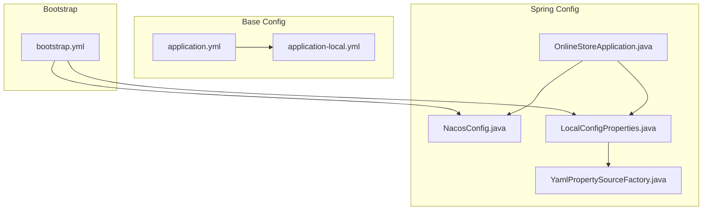
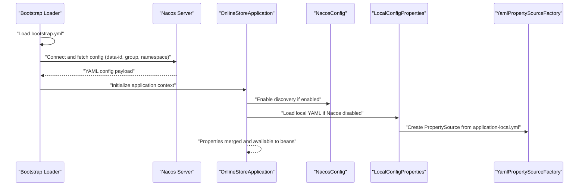
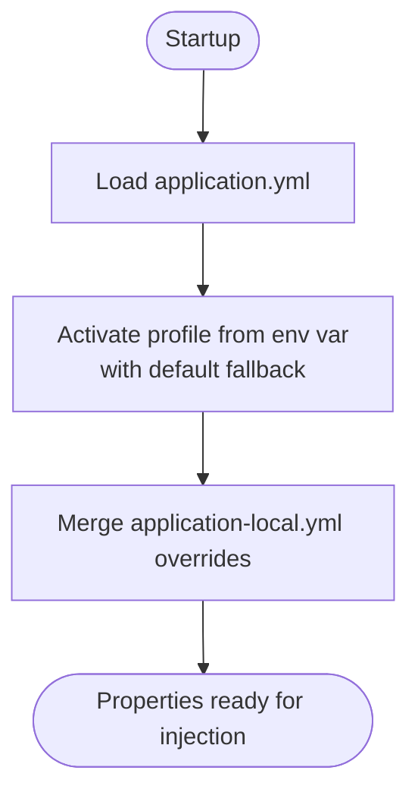
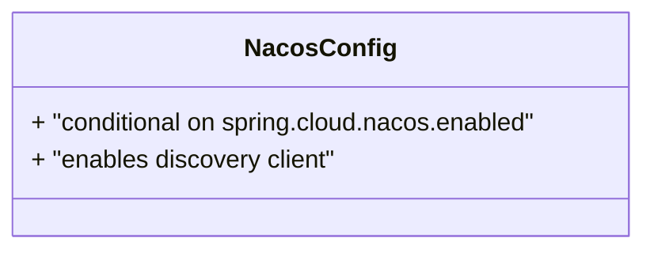
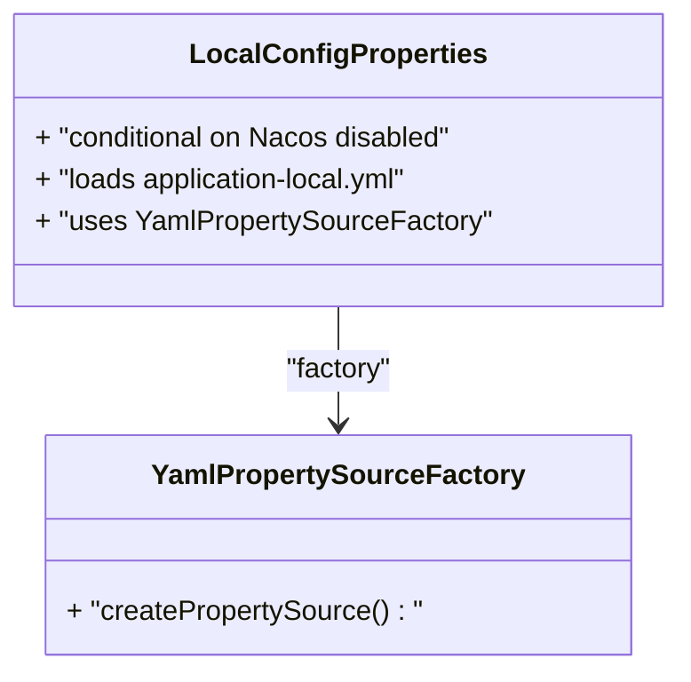
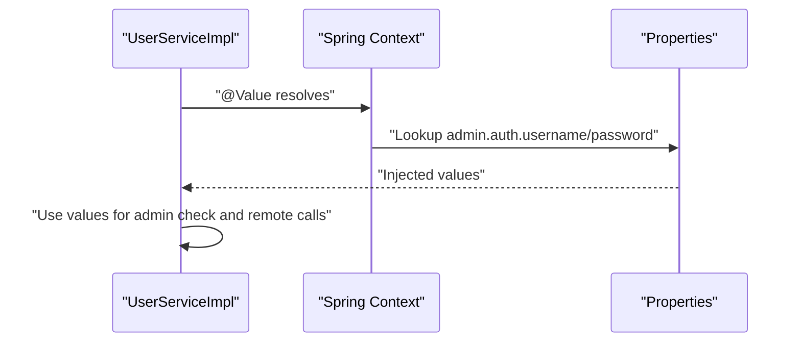
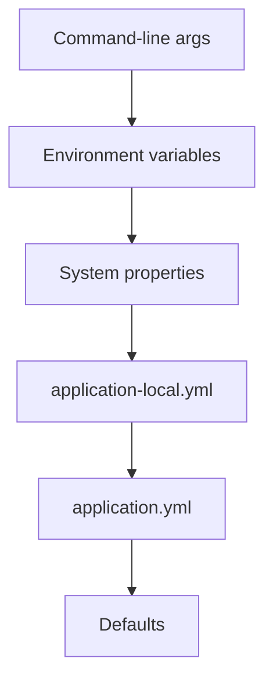
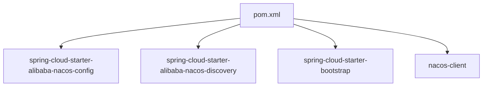

# Configuration Management

<cite>
**Referenced Files in This Document**
- [application.yml](file://src/main/resources/application.yml)
- [application-local.yml](file://src/main/resources/application-local.yml)
- [bootstrap.yml](file://src/main/resources/bootstrap.yml)
- [NacosConfig.java](file://src/main/java/com/example/onlinestore/config/NacosConfig.java)
- [LocalConfigProperties.java](file://src/main/java/com/example/onlinestore/config/LocalConfigProperties.java)
- [YamlPropertySourceFactory.java](file://src/main/java/com/example/onlinestore/config/YamlPropertySourceFactory.java)
- [OnlineStoreApplication.java](file://src/main/java/com/example/onlinestore/OnlineStoreApplication.java)
- [AdminAuthAspect.java](file://src/main/java/com/example/onlinestore/aspect/AdminAuthAspect.java)
- [UserServiceImpl.java](file://src/main/java/com/example/onlinestore/service/impl/UserServiceImpl.java)
- [pom.xml](file://pom.xml)
</cite>

## Table of Contents
1. [Introduction](#introduction)
2. [Project Structure](#project-structure)
3. [Core Components](#core-components)
4. [Architecture Overview](#architecture-overview)
5. [Detailed Component Analysis](#detailed-component-analysis)
6. [Dependency Analysis](#dependency-analysis)
7. [Performance Considerations](#performance-considerations)
8. [Troubleshooting Guide](#troubleshooting-guide)
9. [Conclusion](#conclusion)
10. [Appendices](#appendices)

## Introduction
This document explains configuration management in the online-store application. It covers:
- Profile-based configuration using application.yml and environment-specific overrides in application-local.yml
- Nacos integration via bootstrap.yml and NacosConfig.java for dynamic configuration and service discovery
- Custom configuration properties via LocalConfigProperties and YamlPropertySourceFactory
- Practical examples of configuration injection and usage patterns
- Configuration loading order and precedence rules in Spring Boot
- Troubleshooting common configuration issues
- Best practices for managing sensitive data and environment differences

## Project Structure
The configuration system is organized around three primary YAML files and two Spring configuration classes:
- bootstrap.yml: Nacos bootstrap configuration (loaded early)
- application.yml: Base application configuration and default property values
- application-local.yml: Environment-specific overrides for local development
- NacosConfig.java: Conditional enabling of Nacos discovery
- LocalConfigProperties.java: Conditional loading of local YAML properties
- YamlPropertySourceFactory.java: Factory to load YAML as PropertySource
- OnlineStoreApplication.java: Application entrypoint annotated with RefreshScope

**Diagram sources**
- [bootstrap.yml](file://src/main/resources/bootstrap.yml#L1-L17)
- [application.yml](file://src/main/resources/application.yml#L1-L48)
- [application-local.yml](file://src/main/resources/application-local.yml#L1-L33)
- [NacosConfig.java](file://src/main/java/com/example/onlinestore/config/NacosConfig.java#L1-L29)
- [LocalConfigProperties.java](file://src/main/java/com/example/onlinestore/config/LocalConfigProperties.java#L1-L12)
- [YamlPropertySourceFactory.java](file://src/main/java/com/example/onlinestore/config/YamlPropertySourceFactory.java#L1-L26)
- [OnlineStoreApplication.java](file://src/main/java/com/example/onlinestore/OnlineStoreApplication.java#L1-L15)

**Section sources**
- [application.yml](file://src/main/resources/application.yml#L1-L48)
- [application-local.yml](file://src/main/resources/application-local.yml#L1-L33)
- [bootstrap.yml](file://src/main/resources/bootstrap.yml#L1-L17)
- [NacosConfig.java](file://src/main/java/com/example/onlinestore/config/NacosConfig.java#L1-L29)
- [LocalConfigProperties.java](file://src/main/java/com/example/onlinestore/config/LocalConfigProperties.java#L1-L12)
- [YamlPropertySourceFactory.java](file://src/main/java/com/example/onlinestore/config/YamlPropertySourceFactory.java#L1-L26)
- [OnlineStoreApplication.java](file://src/main/java/com/example/onlinestore/OnlineStoreApplication.java#L1-L15)

## Core Components
- Profile activation and defaults
  - The active Spring profile is controlled by an environment variable with a default fallback in application.yml.
  - Local environment overrides are provided in application-local.yml.
- Nacos bootstrap and discovery
  - bootstrap.yml defines Nacos server address, namespace, group, and enables dynamic refresh.
  - NacosConfig.java conditionally enables discovery client based on a property.
- Local YAML loading
  - LocalConfigProperties.java loads application-local.yml when Nacos is disabled.
  - YamlPropertySourceFactory.java converts YAML files into PropertySource entries.

Practical injection examples:
- @Value is used to inject configuration values into AdminAuthAspect and UserServiceImpl.
- These injections demonstrate how properties flow from YAML files into application beans.

**Section sources**
- [application.yml](file://src/main/resources/application.yml#L1-L48)
- [application-local.yml](file://src/main/resources/application-local.yml#L1-L33)
- [bootstrap.yml](file://src/main/resources/bootstrap.yml#L1-L17)
- [NacosConfig.java](file://src/main/java/com/example/onlinestore/config/NacosConfig.java#L1-L29)
- [LocalConfigProperties.java](file://src/main/java/com/example/onlinestore/config/LocalConfigProperties.java#L1-L12)
- [YamlPropertySourceFactory.java](file://src/main/java/com/example/onlinestore/config/YamlPropertySourceFactory.java#L1-L26)
- [AdminAuthAspect.java](file://src/main/java/com/example/onlinestore/aspect/AdminAuthAspect.java#L1-L71)
- [UserServiceImpl.java](file://src/main/java/com/example/onlinestore/service/impl/UserServiceImpl.java#L1-L193)

## Architecture Overview
The configuration lifecycle integrates bootstrap-time Nacos configuration with runtime application properties and conditional local overrides.

**Diagram sources**
- [bootstrap.yml](file://src/main/resources/bootstrap.yml#L1-L17)
- [NacosConfig.java](file://src/main/java/com/example/onlinestore/config/NacosConfig.java#L1-L29)
- [LocalConfigProperties.java](file://src/main/java/com/example/onlinestore/config/LocalConfigProperties.java#L1-L12)
- [YamlPropertySourceFactory.java](file://src/main/java/com/example/onlinestore/config/YamlPropertySourceFactory.java#L1-L26)
- [OnlineStoreApplication.java](file://src/main/java/com/example/onlinestore/OnlineStoreApplication.java#L1-L15)

## Detailed Component Analysis

### Profile-Based Configuration and Overrides
- Base configuration
  - application.yml defines default ports, datasource, Redis, MyBatis, and application metadata.
  - It activates a Spring profile via an environment variable with a default fallback.
- Environment-specific overrides
  - application-local.yml mirrors base keys and overrides them for local development.
- Precedence
  - application-local.yml overrides matching keys from application.yml when the local profile is active.

**Diagram sources**
- [application.yml](file://src/main/resources/application.yml#L1-L48)
- [application-local.yml](file://src/main/resources/application-local.yml#L1-L33)

**Section sources**
- [application.yml](file://src/main/resources/application.yml#L1-L48)
- [application-local.yml](file://src/main/resources/application-local.yml#L1-L33)

### Nacos Integration: bootstrap.yml and NacosConfig.java
- bootstrap.yml
  - Enables Nacos config and discovery, sets server address, namespace, group, file extension, and refresh behavior.
  - Declares an extension config with data-id and group for dynamic refresh.
- NacosConfig.java
  - Conditionally enables the discovery client when the Nacos flag is true.
  - Defaults to enabled if the property is missing.

**Diagram sources**
- [bootstrap.yml](file://src/main/resources/bootstrap.yml#L1-L17)
- [NacosConfig.java](file://src/main/java/com/example/onlinestore/config/NacosConfig.java#L1-L29)

**Section sources**
- [bootstrap.yml](file://src/main/resources/bootstrap.yml#L1-L17)
- [NacosConfig.java](file://src/main/java/com/example/onlinestore/config/NacosConfig.java#L1-L29)

### Local YAML Loading via LocalConfigProperties and YamlPropertySourceFactory
- LocalConfigProperties.java
  - Loads application-local.yml only when Nacos is disabled.
  - Uses a YAML factory to produce a PropertySource.
- YamlPropertySourceFactory.java
  - Converts YAML resource into Properties and wraps as PropertySource.

**Diagram sources**
- [LocalConfigProperties.java](file://src/main/java/com/example/onlinestore/config/LocalConfigProperties.java#L1-L12)
- [YamlPropertySourceFactory.java](file://src/main/java/com/example/onlinestore/config/YamlPropertySourceFactory.java#L1-L26)

**Section sources**
- [LocalConfigProperties.java](file://src/main/java/com/example/onlinestore/config/LocalConfigProperties.java#L1-L12)
- [YamlPropertySourceFactory.java](file://src/main/java/com/example/onlinestore/config/YamlPropertySourceFactory.java#L1-L26)

### Configuration Injection and Usage Patterns
- @Value injection
  - AdminAuthAspect injects admin credentials from configuration.
  - UserServiceImpl injects admin credentials and a remote service base URL.
- Usage patterns
  - Values are injected into fields and used during runtime logic (e.g., admin checks and external service calls).

**Diagram sources**
- [UserServiceImpl.java](file://src/main/java/com/example/onlinestore/service/impl/UserServiceImpl.java#L1-L193)
- [AdminAuthAspect.java](file://src/main/java/com/example/onlinestore/aspect/AdminAuthAspect.java#L1-L71)

**Section sources**
- [AdminAuthAspect.java](file://src/main/java/com/example/onlinestore/aspect/AdminAuthAspect.java#L1-L71)
- [UserServiceImpl.java](file://src/main/java/com/example/onlinestore/service/impl/UserServiceImpl.java#L1-L193)

### Configuration Loading Order and Precedence Rules in Spring Boot
- Bootstrap phase
  - bootstrap.yml is loaded first to configure Nacos client and enable dynamic config.
- Application phase
  - application.yml is loaded and merged.
  - application-local.yml overrides matching keys when the local profile is active.
- Property precedence (high to low)
  - Command-line arguments
  - SPRING_APPLICATION_JSON
  - Environment variables
  - System properties
  - application-{profile}.yml (e.g., application-local.yml)
  - application.yml
  - Default values (e.g., defaults embedded in code)
- Notes for this project
  - Profile activation comes from an environment variable with a default fallback.
  - Nacos extension configs are refreshed dynamically when enabled.

[No sources needed since this diagram shows conceptual workflow, not actual code structure]

**Section sources**
- [application.yml](file://src/main/resources/application.yml#L1-L48)
- [application-local.yml](file://src/main/resources/application-local.yml#L1-L33)
- [bootstrap.yml](file://src/main/resources/bootstrap.yml#L1-L17)

## Dependency Analysis
External dependencies relevant to configuration:
- Nacos Config and Discovery starters
- Bootstrap starter for early loading
- Nacos client

**Diagram sources**
- [pom.xml](file://pom.xml#L85-L122)

**Section sources**
- [pom.xml](file://pom.xml#L85-L122)

## Performance Considerations
- Dynamic refresh overhead
  - Enabling Nacos refresh introduces network calls and property updates; monitor latency and adjust polling intervals if needed.
- Property resolution cost
  - @Value injection is lightweight; avoid excessive use in hot paths.
- Local vs. remote configuration
  - Prefer local overrides for development to reduce network dependencies.

[No sources needed since this section provides general guidance]

## Troubleshooting Guide
Common issues and resolutions:
- Nacos not connecting
  - Verify NACOS_ENABLED is set appropriately.
  - Confirm NACOS_SERVER_ADDR and namespace/group align with your Nacos setup.
  - Ensure bootstrap.yml is present and loaded before application.yml.
- Properties not picked up
  - Check profile activation via the environment variable and confirm application-local.yml is merged when the local profile is active.
  - Validate that @Value keys match the YAML structure.
- Local YAML not loaded
  - Ensure Nacos is disabled so LocalConfigProperties can load application-local.yml.
  - Confirm YamlPropertySourceFactory is used by LocalConfigProperties.
- Sensitive data exposure
  - Do not commit secrets to version control; use environment variables or secret stores.
  - For local development, keep application-local.yml out of version control or use .gitignore.
- Service discovery not working
  - Confirm NacosConfig is enabled and the application name matches the registry expectations.

**Section sources**
- [bootstrap.yml](file://src/main/resources/bootstrap.yml#L1-L17)
- [application.yml](file://src/main/resources/application.yml#L1-L48)
- [application-local.yml](file://src/main/resources/application-local.yml#L1-L33)
- [LocalConfigProperties.java](file://src/main/java/com/example/onlinestore/config/LocalConfigProperties.java#L1-L12)
- [YamlPropertySourceFactory.java](file://src/main/java/com/example/onlinestore/config/YamlPropertySourceFactory.java#L1-L26)
- [NacosConfig.java](file://src/main/java/com/example/onlinestore/config/NacosConfig.java#L1-L29)

## Conclusion
The online-store application employs a layered configuration strategy:
- Base properties in application.yml
- Environment-specific overrides in application-local.yml
- Early bootstrap configuration via bootstrap.yml for Nacos
- Conditional loading of local YAML when Nacos is disabled
- Runtime injection via @Value for practical usage

Following the precedence rules and best practices ensures predictable behavior across environments while maintaining flexibility for dynamic updates and local development.

[No sources needed since this section summarizes without analyzing specific files]

## Appendices

### Practical Configuration Injection Examples
- Injecting admin credentials and base URL
  - See field-level injection in UserServiceImpl and AdminAuthAspect.
- Using properties in runtime logic
  - Admin checks and remote service calls rely on injected values.

**Section sources**
- [UserServiceImpl.java](file://src/main/java/com/example/onlinestore/service/impl/UserServiceImpl.java#L1-L193)
- [AdminAuthAspect.java](file://src/main/java/com/example/onlinestore/aspect/AdminAuthAspect.java#L1-L71)

### Best Practices for Managing Sensitive Data and Environments
- Keep secrets out of version control; use environment variables or secret managers.
- Use separate profiles for environments (local, dev, prod) with minimal shared keys.
- Prefer environment variables for overrides in CI/CD pipelines.
- Document property keys and their expected types to prevent misconfiguration.

[No sources needed since this section provides general guidance]