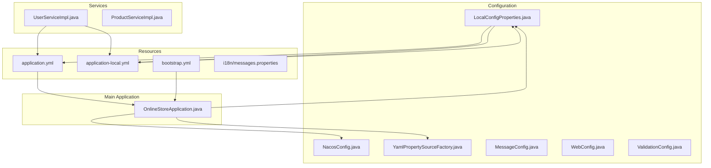
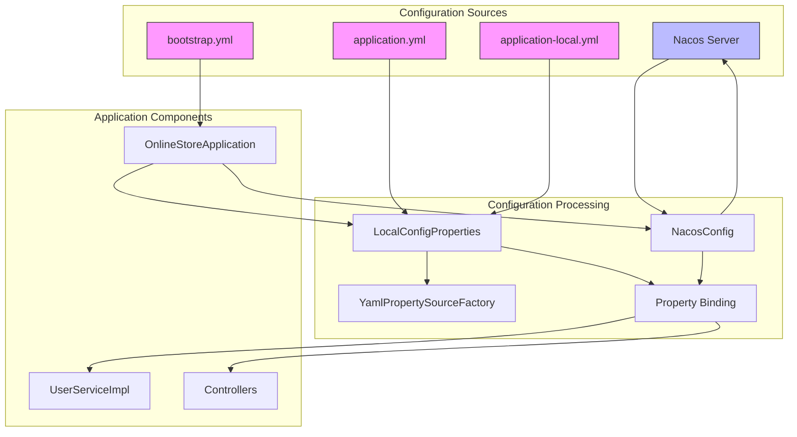
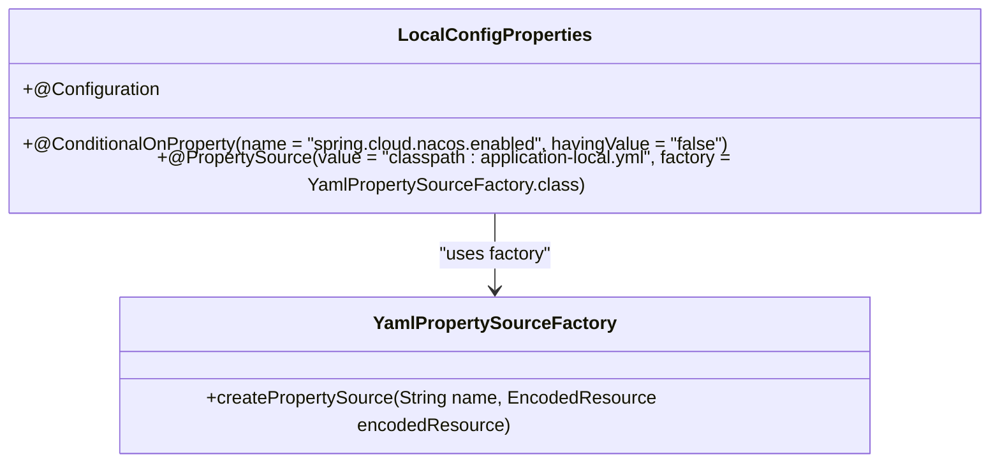
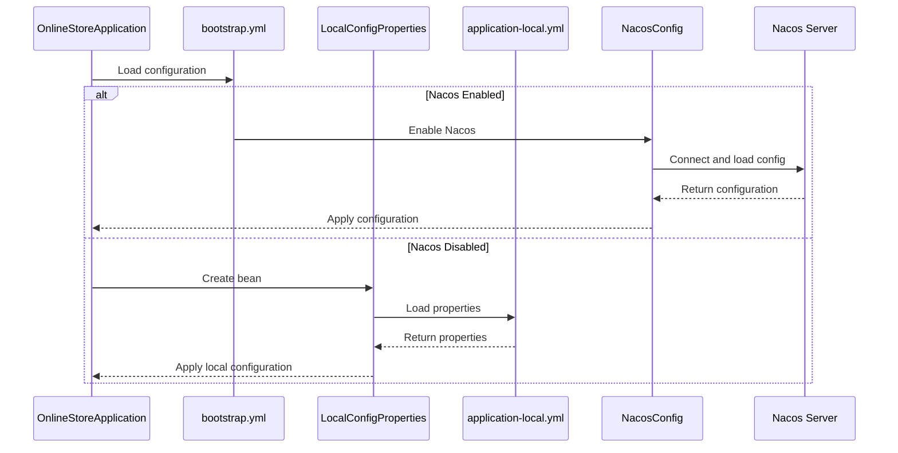
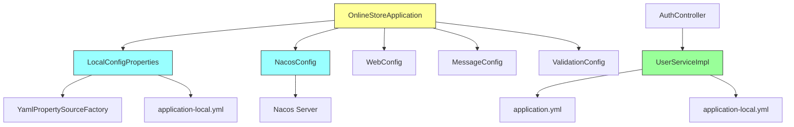

# External Configuration

<cite>
**Referenced Files in This Document**   
- [LocalConfigProperties.java](file://src/main/java/com/example/onlinestore/config/LocalConfigProperties.java)
- [application.yml](file://src/main/resources/application.yml)
- [application-local.yml](file://src/main/resources/application-local.yml)
- [bootstrap.yml](file://src/main/resources/bootstrap.yml)
- [NacosConfig.java](file://src/main/java/com/example/onlinestore/config/NacosConfig.java)
- [YamlPropertySourceFactory.java](file://src/main/java/com/example/onlinestore/config/YamlPropertySourceFactory.java)
- [OnlineStoreApplication.java](file://src/main/java/com/example/onlinestore/OnlineStoreApplication.java)
- [UserServiceImpl.java](file://src/main/java/com/example/onlinestore/service/impl/UserServiceImpl.java)
</cite>

## Table of Contents
1. [Introduction](#introduction)
2. [Project Structure](#project-structure)
3. [Core Components](#core-components)
4. [Architecture Overview](#architecture-overview)
5. [Detailed Component Analysis](#detailed-component-analysis)
6. [Dependency Analysis](#dependency-analysis)
7. [Performance Considerations](#performance-considerations)
8. [Troubleshooting Guide](#troubleshooting-guide)
9. [Conclusion](#conclusion)

## Introduction
This document provides comprehensive documentation for external configuration properties in the online-store application, with a focus on the use of type-safe configuration properties through Spring Boot's `@ConfigurationProperties`. The application leverages both local YAML configuration files and Nacos for dynamic configuration management. The documentation covers the implementation of `LocalConfigProperties.java`, which facilitates loading configuration from `application-local.yml`, and explains the benefits of type-safe configuration over direct `@Value` injection, including improved IDE support, validation capabilities, and maintainability. It also details the setup process, configuration reloading with Nacos, common issues, and best practices for organizing and validating configuration properties.

## Project Structure



**Diagram sources**
- [LocalConfigProperties.java](file://src/main/java/com/example/onlinestore/config/LocalConfigProperties.java)
- [application.yml](file://src/main/resources/application.yml)
- [application-local.yml](file://src/main/resources/application-local.yml)
- [bootstrap.yml](file://src/main/resources/bootstrap.yml)
- [OnlineStoreApplication.java](file://src/main/java/com/example/onlinestore/OnlineStoreApplication.java)

**Section sources**
- [LocalConfigProperties.java](file://src/main/java/com/example/onlinestore/config/LocalConfigProperties.java)
- [application.yml](file://src/main/resources/application.yml)
- [application-local.yml](file://src/main/resources/application-local.yml)
- [bootstrap.yml](file://src/main/resources/bootstrap.yml)

## Core Components

The online-store application implements a robust external configuration system that supports both local development and cloud-based dynamic configuration through Nacos. The core components include configuration classes that load properties from YAML files, a custom property source factory for YAML support, and integration with Nacos for configuration management. The application uses `@ConfigurationProperties` for type-safe configuration binding, although the current implementation primarily relies on `@Value` annotations in service classes. The configuration system is designed to be flexible, allowing for different configuration sources based on the active profile and Nacos enablement.

**Section sources**
- [LocalConfigProperties.java](file://src/main/java/com/example/onlinestore/config/LocalConfigProperties.java)
- [NacosConfig.java](file://src/main/java/com/example/onlinestore/config/NacosConfig.java)
- [YamlPropertySourceFactory.java](file://src/main/java/com/example/onlinestore/config/YamlPropertySourceFactory.java)

## Architecture Overview



**Diagram sources**
- [LocalConfigProperties.java](file://src/main/java/com/example/onlinestore/config/LocalConfigProperties.java)
- [NacosConfig.java](file://src/main/java/com/example/onlinestore/config/NacosConfig.java)
- [YamlPropertySourceFactory.java](file://src/main/java/com/example/onlinestore/config/YamlPropertySourceFactory.java)
- [bootstrap.yml](file://src/main/resources/bootstrap.yml)
- [application.yml](file://src/main/resources/application.yml)
- [application-local.yml](file://src/main/resources/application-local.yml)

## Detailed Component Analysis

### Local Configuration Properties Analysis

The `LocalConfigProperties` class serves as a configuration component that loads properties from `application-local.yml` when Nacos is disabled. It uses the `@PropertySource` annotation with a custom `YamlPropertySourceFactory` to parse YAML configuration files. The class is conditionally enabled based on the `spring.cloud.nacos.enabled` property, ensuring that local configuration is only loaded when Nacos is not in use. This implementation allows for seamless switching between local and cloud-based configuration management.



**Diagram sources**
- [LocalConfigProperties.java](file://src/main/java/com/example/onlinestore/config/LocalConfigProperties.java)
- [YamlPropertySourceFactory.java](file://src/main/java/com/example/onlinestore/config/YamlPropertySourceFactory.java)

### Configuration Loading Mechanism

The application implements a dual configuration loading mechanism that supports both local files and Nacos-based configuration. When Nacos is enabled, configuration is loaded from the Nacos server as specified in `bootstrap.yml`. When Nacos is disabled, the application falls back to local configuration files, with `LocalConfigProperties` explicitly loading `application-local.yml`. This conditional loading is managed through Spring's `@ConditionalOnProperty` annotation, providing a clean separation between local and cloud configurations.



**Diagram sources**
- [OnlineStoreApplication.java](file://src/main/java/com/example/onlinestore/OnlineStoreApplication.java)
- [bootstrap.yml](file://src/main/resources/bootstrap.yml)
- [LocalConfigProperties.java](file://src/main/java/com/example/onlinestore/config/LocalConfigProperties.java)
- [NacosConfig.java](file://src/main/java/com/example/onlinestore/config/NacosConfig.java)

### Configuration Properties Usage Analysis

Although the application is set up to support type-safe configuration properties through the `LocalConfigProperties` class, the current implementation in `UserServiceImpl` demonstrates the use of `@Value` annotations for property injection. This approach directly injects configuration values such as `service.user.base-url` and `admin.auth.username` into the service class. While functional, this method lacks the benefits of type-safe configuration properties, such as IDE support for property discovery, compile-time checking, and built-in validation.

```mermaid
classDiagram
class UserServiceImpl {
-@Value("${admin.auth.username}") String adminUsername
-@Value("${admin.auth.password}") String adminPassword
-@Value("${service.user.base-url}") String userServiceBaseUrl
+login(LoginRequest request) LoginResponse
}
class applicationYml {
service :
user :
base-url : http : //localhost : 8080
admin :
auth :
username : admin
password : password
}
UserServiceImpl --> applicationYml : "binds properties"
```

**Diagram sources**
- [UserServiceImpl.java](file://src/main/java/com/example/onlinestore/service/impl/UserServiceImpl.java)
- [application.yml](file://src/main/resources/application.yml)

## Dependency Analysis



**Diagram sources**
- [OnlineStoreApplication.java](file://src/main/java/com/example/onlinestore/OnlineStoreApplication.java)
- [LocalConfigProperties.java](file://src/main/java/com/example/onlinestore/config/LocalConfigProperties.java)
- [NacosConfig.java](file://src/main/java/com/example/onlinestore/config/NacosConfig.java)
- [UserServiceImpl.java](file://src/main/java/com/example/onlinestore/service/impl/UserServiceImpl.java)

**Section sources**
- [OnlineStoreApplication.java](file://src/main/java/com/example/onlinestore/OnlineStoreApplication.java)
- [LocalConfigProperties.java](file://src/main/java/com/example/onlinestore/config/LocalConfigProperties.java)
- [NacosConfig.java](file://src/main/java/com/example/onlinestore/config/NacosConfig.java)
- [UserServiceImpl.java](file://src/main/java/com/example/onlinestore/service/impl/UserServiceImpl.java)

## Performance Considerations

The configuration loading mechanism in the online-store application is designed for flexibility rather than optimal performance. The use of conditional configuration classes allows for clean separation between local and Nacos-based configurations, but results in redundant property definitions across multiple files (`application.yml`, `application-local.yml`, and Nacos). During application startup, all configuration sources are processed, which may lead to slightly longer initialization times. The current implementation using `@Value` annotations provides fast property access at runtime, but lacks the compile-time safety and IDE support of type-safe configuration properties. For production environments with Nacos enabled, configuration reloading is supported through the `refresh-enabled: true` setting in `bootstrap.yml`, allowing dynamic updates without application restarts.

## Troubleshooting Guide

Common issues with the configuration system include:

1. **Properties not binding correctly**: This can occur when the property names in the YAML files do not match the `@Value` annotations or when there are typos in the property paths.

2. **Prefix mismatches**: Ensure that the property prefixes in `@Value` annotations exactly match the structure in the YAML files, including proper nesting and hyphenation.

3. **Missing getters/setters**: While not applicable to the current `@Value`-based approach, if type-safe configuration properties were implemented, missing getters and setters would prevent proper binding.

4. **Nacos connectivity issues**: When Nacos is enabled but the server is unreachable, the application may fail to start or fall back to default values.

5. **Configuration precedence issues**: Properties defined in multiple locations (bootstrap.yml, application.yml, Nacos) may conflict, with the last loaded source taking precedence.

**Section sources**
- [LocalConfigProperties.java](file://src/main/java/com/example/onlinestore/config/LocalConfigProperties.java)
- [application.yml](file://src/main/resources/application.yml)
- [application-local.yml](file://src/main/resources/application-local.yml)
- [bootstrap.yml](file://src/main/resources/bootstrap.yml)
- [UserServiceImpl.java](file://src/main/java/com/example/onlinestore/service/impl/UserServiceImpl.java)

## Conclusion

The online-store application implements a flexible external configuration system that supports both local development and cloud-based configuration management through Nacos. While the infrastructure for type-safe configuration properties is present with the `LocalConfigProperties` class, the current implementation primarily relies on `@Value` annotations for property injection. To fully leverage the benefits of type-safe configuration, the application should be refactored to use `@ConfigurationProperties` classes with proper getters and setters, enabling better IDE support, validation, and maintainability. The configuration system effectively supports dynamic reloading through Nacos when enabled, and provides a clean separation between local and cloud configurations through conditional configuration classes.