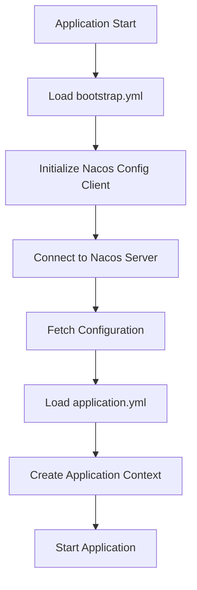
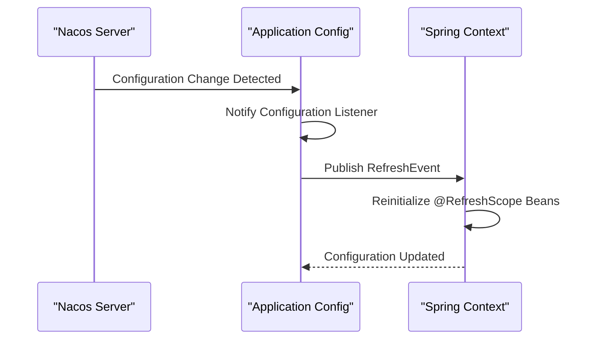
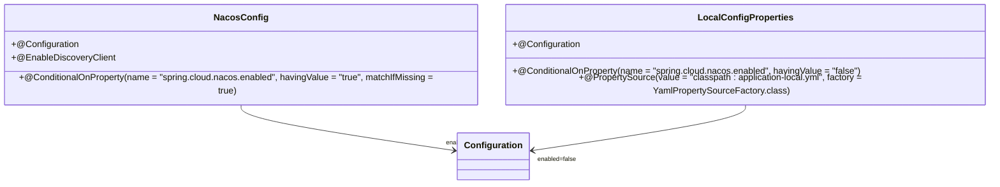

# Nacos Integration

<cite>
**Referenced Files in This Document**   
- [bootstrap.yml](file://src/main/resources/bootstrap.yml)
- [application.yml](file://src/main/resources/application.yml)
- [NacosConfig.java](file://src/main/java/com/example/onlinestore/config/NacosConfig.java)
- [OnlineStoreApplication.java](file://src/main/java/com/example/onlinestore/OnlineStoreApplication.java)
- [pom.xml](file://pom.xml)
- [LocalConfigProperties.java](file://src/main/java/com/example/onlinestore/config/LocalConfigProperties.java)
- [YamlPropertySourceFactory.java](file://src/main/java/com/example/onlinestore/config/YamlPropertySourceFactory.java)
</cite>

## Table of Contents
1. [Introduction](#introduction)
2. [Bootstrap Configuration with bootstrap.yml](#bootstrap-configuration-with-bootstrapyml)
3. [Nacos Configuration Properties](#nacos-configuration-properties)
4. [Dynamic Configuration Management](#dynamic-configuration-management)
5. [Service Discovery with Nacos Discovery](#service-discovery-with-nacos-discovery)
6. [Conditional Nacos Configuration via NacosConfig.java](#conditional-nacos-configuration-via-nacosconfigjava)
7. [Externalizing Configuration to Nacos Server](#externalizing-configuration-to-nacos-server)
8. [Multiple Configuration Files with extension-configs](#multiple-configuration-files-with-extension-configs)
9. [Common Issues and Troubleshooting](#common-issues-and-troubleshooting)
10. [Best Practices for Nacos Integration](#best-practices-for-nacos-integration)

## Introduction
This document provides a comprehensive guide to integrating Nacos into the online-store application for dynamic configuration management and service discovery. It explains the role of `bootstrap.yml` in initializing Nacos before the application context starts, details key configuration properties, and demonstrates how Nacos enables runtime configuration refresh and service registration. The document also covers conditional configuration loading, troubleshooting common issues, and best practices for secure and resilient Nacos integration.

## Bootstrap Configuration with bootstrap.yml

The `bootstrap.yml` file is critical for early initialization of Nacos configuration before the Spring application context is created. Unlike `application.yml`, which is loaded during application startup, `bootstrap.yml` is processed during the bootstrap phase, enabling the application to fetch configuration from Nacos before any beans are instantiated.

This ensures that configuration values from Nacos are available from the very beginning of the application lifecycle, supporting externalized configuration and dynamic updates.

**Diagram sources**
- [bootstrap.yml](file://src/main/resources/bootstrap.yml#L1-L17)

**Section sources**
- [bootstrap.yml](file://src/main/resources/bootstrap.yml#L1-L17)

## Nacos Configuration Properties

The `bootstrap.yml` file contains essential Nacos configuration properties that define how the application connects to the Nacos server:

- **server-addr**: Specifies the Nacos server address (default: localhost:8848), configurable via `NACOS_SERVER_ADDR` environment variable
- **namespace**: Isolates configuration environments (e.g., development, staging, production); empty by default
- **group**: Groups related configurations (default: DEFAULT_GROUP)
- **refresh-enabled**: Enables automatic refresh of configuration changes at runtime
- **file-extension**: Specifies the configuration file format (yml in this case)
- **enabled**: Global toggle for Nacos functionality, defaulting to false via `NACOS_ENABLED` environment variable

These properties are designed with environment variable fallbacks to support different deployment environments without code changes.

**Section sources**
- [bootstrap.yml](file://src/main/resources/bootstrap.yml#L4-L17)

## Dynamic Configuration Management

Nacos enables dynamic configuration management through the `spring-cloud-starter-alibaba-nacos-config` dependency, which allows configuration changes to be pushed to applications in real-time without restarts. When `refresh-enabled: true`, the application listens for configuration changes in Nacos and automatically updates the Spring environment.

The `@RefreshScope` annotation on the `OnlineStoreApplication` class ensures that beans are reinitialized when configuration changes are detected, making them responsive to updated values from Nacos.

**Diagram sources**
- [bootstrap.yml](file://src/main/resources/bootstrap.yml#L7-L13)
- [OnlineStoreApplication.java](file://src/main/java/com/example/onlinestore/OnlineStoreApplication.java#L6)

**Section sources**
- [bootstrap.yml](file://src/main/resources/bootstrap.yml#L7-L13)
- [OnlineStoreApplication.java](file://src/main/java/com/example/onlinestore/OnlineStoreApplication.java#L6)

## Service Discovery with Nacos Discovery

Service discovery is enabled through the `spring-cloud-starter-alibaba-nacos-discovery` dependency, which registers the application with Nacos as a service instance. The service name is derived from `spring.application.name` (online-store), and registration can be controlled via configuration.

In `application.yml`, service discovery and registration are conditionally enabled based on the `NACOS_ENABLED` environment variable. This allows for flexible deployment scenarios where service registration can be disabled for local development or testing.

The `spring.cloud.service-registry.auto-registration.enabled` property controls whether the application automatically registers with the service registry, providing fine-grained control over service discovery behavior.

**Section sources**
- [application.yml](file://src/main/resources/application.yml#L7-L14)
- [pom.xml](file://pom.xml#L91-L93)

## Conditional Nacos Configuration via NacosConfig.java

The `NacosConfig` class uses Spring's conditional configuration mechanism to control Nacos service registration based on the `spring.cloud.nacos.enabled` property:

- `@EnableDiscoveryClient` activates service discovery capabilities
- `@ConditionalOnProperty` ensures the configuration is only applied when `spring.cloud.nacos.enabled` is true (default behavior if property is missing)

This conditional approach allows the application to seamlessly switch between Nacos-enabled and standalone modes. When Nacos is disabled, the application falls back to local configuration via `LocalConfigProperties`, which loads settings from `application-local.yml`.

**Diagram sources**
- [NacosConfig.java](file://src/main/java/com/example/onlinestore/config/NacosConfig.java#L24-L27)
- [LocalConfigProperties.java](file://src/main/java/com/example/onlinestore/config/LocalConfigProperties.java#L7-L9)

**Section sources**
- [NacosConfig.java](file://src/main/java/com/example/onlinestore/config/NacosConfig.java#L1-L29)
- [LocalConfigProperties.java](file://src/main/java/com/example/onlinestore/config/LocalConfigProperties.java#L1-L12)

## Externalizing Configuration to Nacos Server

The application supports externalizing configuration to the Nacos server through the `bootstrap.yml` configuration. When Nacos is enabled, configuration is loaded from the Nacos server instead of local files, enabling centralized configuration management.

The configuration loading priority is:
1. Nacos server configuration (highest priority)
2. Local `application.yml`
3. Environment variables
4. Default values in configuration files

This hierarchy allows for environment-specific overrides while maintaining a consistent configuration structure. The `file-extension: yml` setting ensures YAML format is used for configuration files in Nacos, maintaining consistency with local configuration files.

**Section sources**
- [bootstrap.yml](file://src/main/resources/bootstrap.yml#L1-L17)
- [application.yml](file://src/main/resources/application.yml#L1-L48)

## Multiple Configuration Files with extension-configs

The `extension-configs` feature in `bootstrap.yml` allows loading multiple configuration files from Nacos, enabling modular configuration management. In this application, it's configured to load `online-store.yaml` from the DEFAULT_GROUP with refresh enabled.

This approach supports:
- Separation of concerns by splitting configuration into logical files
- Shared configuration across multiple services
- Independent refresh of different configuration modules
- Gradual migration of configuration to Nacos

The extension configuration is loaded in addition to the default configuration (typically named after the application), providing flexibility in organizing configuration data.

**Section sources**
- [bootstrap.yml](file://src/main/resources/bootstrap.yml#L14-L17)

## Common Issues and Troubleshooting

### Nacos Connection Failures
**Symptoms**: Application fails to start or logs show connection timeouts
**Causes**:
- Incorrect `server-addr` in configuration
- Nacos server not running or network connectivity issues
- Firewall blocking port 8848
- Namespace mismatch between application and Nacos

**Troubleshooting Steps**:
1. Verify Nacos server is running and accessible
2. Check `NACOS_SERVER_ADDR` environment variable or configuration
3. Validate namespace configuration matches Nacos server
4. Test connectivity using `telnet localhost 8848`

### Configuration Not Refreshing
**Symptoms**: Changes in Nacos console don't reflect in running application
**Causes**:
- `refresh-enabled: false` in configuration
- Missing `@RefreshScope` on beans using the configuration
- Network issues preventing configuration push

**Troubleshooting Steps**:
1. Verify `refresh-enabled: true` in `bootstrap.yml`
2. Ensure `@RefreshScope` is applied to relevant beans
3. Check application logs for configuration refresh events
4. Test manual refresh via `/actuator/refresh` endpoint

### Namespace Mismatches
**Symptoms**: Configuration not found or wrong configuration loaded
**Causes**:
- Empty namespace in application vs. non-default namespace in Nacos
- Typos in namespace IDs
- Different environments using conflicting namespace strategies

**Troubleshooting Steps**:
1. Verify namespace configuration in both application and Nacos console
2. Use explicit namespace IDs instead of relying on defaults
3. Check Nacos logs for configuration lookup attempts

**Section sources**
- [bootstrap.yml](file://src/main/resources/bootstrap.yml#L1-L17)
- [application.yml](file://src/main/resources/application.yml#L1-L48)
- [NacosConfig.java](file://src/main/java/com/example/onlinestore/config/NacosConfig.java#L1-L29)

## Best Practices for Nacos Integration

### Configuration Security
- Never store sensitive information (passwords, keys) in plain text in Nacos
- Use Nacos's built-in support for configuration encryption
- Implement access control and authentication for Nacos console
- Use separate namespaces for different environments (dev, staging, prod)

### Failover and Resilience
- Implement local fallback configuration using `LocalConfigProperties`
- Set appropriate timeouts for Nacos connections
- Use health checks to monitor Nacos connectivity
- Design applications to function with degraded configuration services

### Configuration Management
- Use meaningful data IDs and groups for organization
- Version configuration changes using Nacos's history features
- Document configuration purpose and usage in Nacos console
- Establish naming conventions for configuration files

### Monitoring and Operations
- Enable Nacos client logging for troubleshooting
- Monitor configuration change history and audit trails
- Set up alerts for configuration changes in production
- Regularly review and clean up unused configurations

**Section sources**
- [bootstrap.yml](file://src/main/resources/bootstrap.yml#L1-L17)
- [NacosConfig.java](file://src/main/java/com/example/onlinestore/config/NacosConfig.java#L1-L29)
- [LocalConfigProperties.java](file://src/main/java/com/example/onlinestore/config/LocalConfigProperties.java#L1-L12)
- [YamlPropertySourceFactory.java](file://src/main/java/com/example/onlinestore/config/YamlPropertySourceFactory.java#L1-L26)