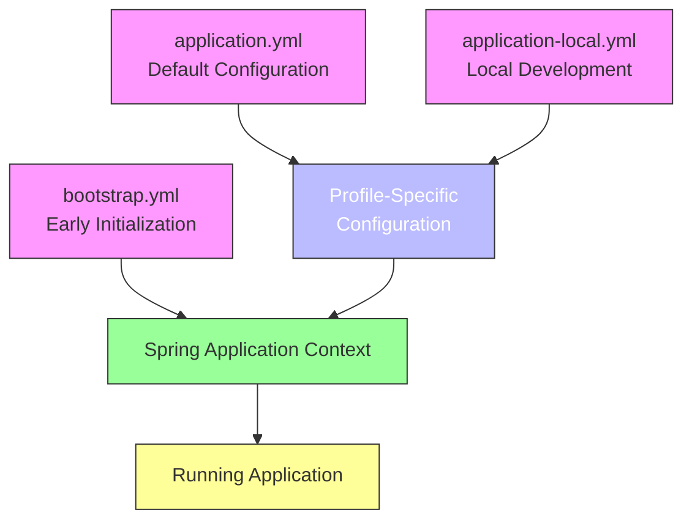
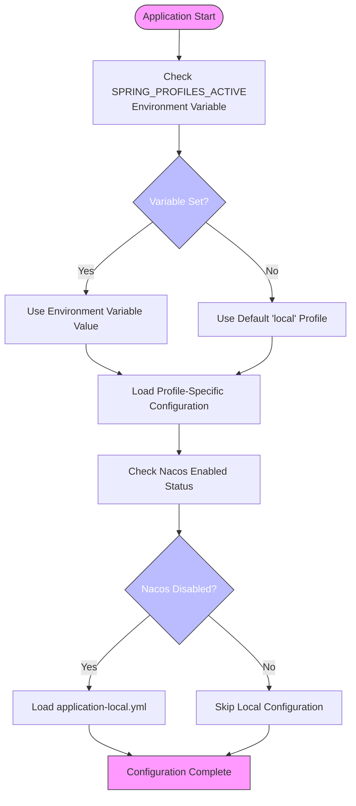
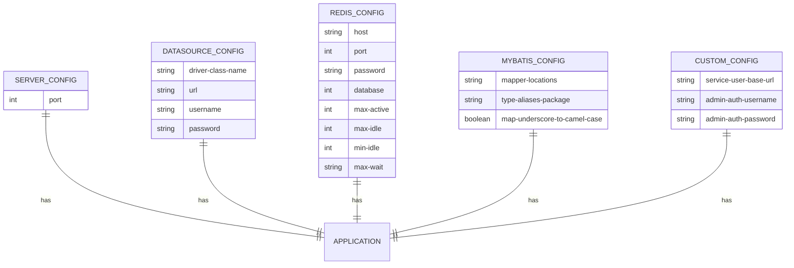
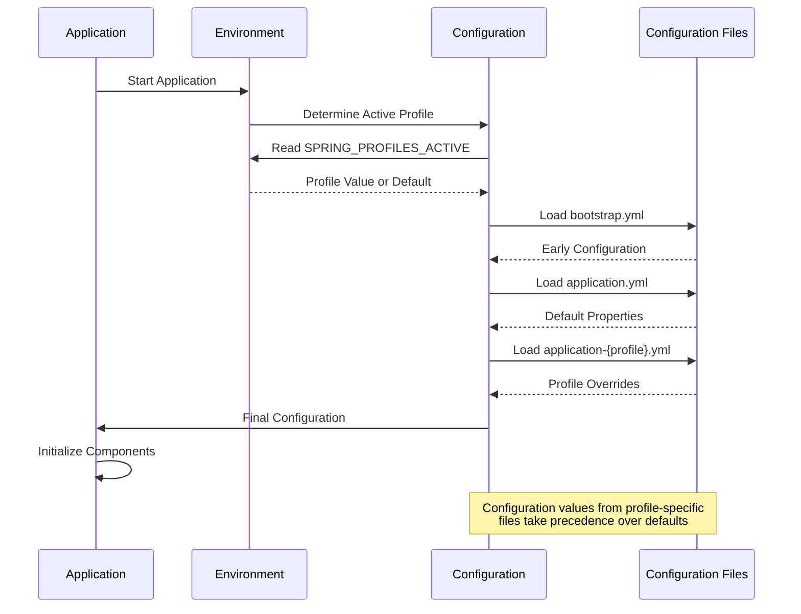

# Profile-based Configuration

<cite>
**Referenced Files in This Document**   
- [application.yml](file://src/main/resources/application.yml)
- [application-local.yml](file://src/main/resources/application-local.yml)
- [bootstrap.yml](file://src/main/resources/bootstrap.yml)
- [LocalConfigProperties.java](file://src/main/java/com/example/onlinestore/config/LocalConfigProperties.java)
- [YamlPropertySourceFactory.java](file://src/main/java/com/example/onlinestore/config/YamlPropertySourceFactory.java)
- [NacosConfig.java](file://src/main/java/com/example/onlinestore/config/NacosConfig.java)
- [AdminAuthAspect.java](file://src/main/java/com/example/onlinestore/aspect/AdminAuthAspect.java)
- [UserServiceImpl.java](file://src/main/java/com/example/onlinestore/service/impl/UserServiceImpl.java)
- [pom.xml](file://pom.xml)
</cite>

## Table of Contents
1. [Introduction](#introduction)
2. [Configuration File Structure](#configuration-file-structure)
3. [Profile Activation Mechanism](#profile-activation-mechanism)
4. [Configuration Properties Overview](#configuration-properties-overview)
5. [Property Injection Patterns](#property-injection-patterns)
6. [Configuration Loading Process](#configuration-loading-process)
7. [Common Configuration Issues](#common-configuration-issues)
8. [Best Practices for Configuration Management](#best-practices-for-configuration-management)
9. [Conclusion](#conclusion)

## Introduction
The online-store application implements a robust profile-based configuration system using Spring Boot's environment abstraction. This system enables seamless transitions between different deployment environments (development, testing, production) through configuration file overrides and profile-specific settings. The core mechanism relies on Spring Boot's profile support, where `application.yml` serves as the default configuration and `application-local.yml` provides environment-specific overrides for local development. This documentation details the configuration architecture, property management, and best practices for maintaining environment-specific settings across the application lifecycle.

**Section sources**
- [application.yml](file://src/main/resources/application.yml#L1-L48)
- [application-local.yml](file://src/main/resources/application-local.yml#L1-L33)

## Configuration File Structure
The application employs a hierarchical configuration structure with multiple YAML files that work together to provide environment-appropriate settings. The primary configuration files are located in the `src/main/resources` directory and follow Spring Boot's naming convention for profile-specific configurations.

The `application.yml` file contains the default configuration that applies to all environments unless overridden by a profile-specific file. This includes server settings, datasource configurations, Redis connection details, MyBatis settings, and custom service properties. The file also defines the default active profile through the `spring.profiles.active` property, which uses a placeholder with a default value.

The `application-local.yml` file serves as the profile-specific configuration for local development environments. It contains identical property keys to the main configuration file but with values tailored for local development, such as localhost connections for database and Redis services. This file is automatically loaded when the 'local' profile is active.

Additionally, the `bootstrap.yml` file configures early initialization properties needed for Spring Cloud components, particularly Nacos configuration management. This file is loaded before `application.yml` and contains settings for Nacos server connectivity and configuration discovery.



**Diagram sources**
- [application.yml](file://src/main/resources/application.yml#L1-L48)
- [application-local.yml](file://src/main/resources/application-local.yml#L1-L33)
- [bootstrap.yml](file://src/main/resources/bootstrap.yml#L1-L17)

**Section sources**
- [application.yml](file://src/main/resources/application.yml#L1-L48)
- [application-local.yml](file://src/main/resources/application-local.yml#L1-L33)
- [bootstrap.yml](file://src/main/resources/bootstrap.yml#L1-L17)

## Profile Activation Mechanism
The online-store application implements a flexible profile activation mechanism that prioritizes environment variables while providing sensible defaults for local development. The profile activation is controlled through the `spring.profiles.active` property in `application.yml`, which uses Spring's property placeholder syntax with a default value:

```yaml
spring:
  profiles:
    active: ${SPRING_PROFILES_ACTIVE:local}
```

This configuration means the application will:
1. Check for the `SPRING_PROFILES_ACTIVE` environment variable
2. If present, use its value as the active profile
3. If not present, default to the 'local' profile

This approach ensures that developers can run the application without any configuration, as it automatically uses the local development profile. In other environments (testing, staging, production), operators can specify the appropriate profile through environment variables.

The application also implements conditional configuration loading through the `LocalConfigProperties` class, which is annotated with `@ConditionalOnProperty`. This configuration class only loads when Nacos is disabled (`spring.cloud.nacos.enabled=false`), ensuring that local configuration files are only used when not running in a cloud environment with centralized configuration management.



**Diagram sources**
- [application.yml](file://src/main/resources/application.yml#L4-L6)
- [LocalConfigProperties.java](file://src/main/java/com/example/onlinestore/config/LocalConfigProperties.java#L7-L9)
- [NacosConfig.java](file://src/main/java/com/example/onlinestore/config/NacosConfig.java#L26)

**Section sources**
- [application.yml](file://src/main/resources/application.yml#L4-L6)
- [LocalConfigProperties.java](file://src/main/java/com/example/onlinestore/config/LocalConfigProperties.java#L7-L9)
- [NacosConfig.java](file://src/main/java/com/example/onlinestore/config/NacosConfig.java#L26)

## Configuration Properties Overview
The online-store application defines a comprehensive set of configuration properties across multiple domains, including server settings, database connectivity, caching, ORM configuration, and custom business properties.

### Server Configuration
The server port is configured in `application.yml` with a default value of 8080:
```yaml
server:
  port: 8080
```

### Datasource Settings
Database connectivity is configured with MySQL settings pointing to a local instance:
```yaml
spring:
  datasource:
    driver-class-name: com.mysql.cj.jdbc.Driver
    url: jdbc:mysql://localhost:3306/online_store?useUnicode=true&characterEncoding=utf-8&useSSL=false&serverTimezone=Asia/Shanghai
    username: root
    password: 
```

### Redis Configuration
Redis connection settings are defined for local development:
```yaml
spring:
  data:
    redis:
      host: localhost
      port: 6379
      password:
      database: 0
      jedis:
        pool:
          max-active: 8
          max-idle: 8
          min-idle: 0
          max-wait: -1ms
```

### MyBatis Configuration
MyBatis settings include mapper locations and type aliases:
```yaml
mybatis:
  mapper-locations: classpath:mapper/*.xml
  type-aliases-package: com.example.onlinestore.model
  configuration:
    map-underscore-to-camel-case: true
```

### Custom Service Properties
The application defines custom properties for service integration and administrative access:
```yaml
service:
  user:
    base-url: http://localhost:8080

admin:
  auth:
    username: admin
    password: password
```

These properties are used throughout the application for service-to-service communication and administrative authentication. The configuration structure follows Spring Boot best practices by organizing properties into logical groups and using consistent naming conventions.



**Diagram sources**
- [application.yml](file://src/main/resources/application.yml#L1-L48)
- [application-local.yml](file://src/main/resources/application-local.yml#L1-L33)

**Section sources**
- [application.yml](file://src/main/resources/application.yml#L1-L48)
- [application-local.yml](file://src/main/resources/application-local.yml#L1-L33)

## Property Injection Patterns
The online-store application demonstrates two primary patterns for accessing configuration properties: direct property injection using `@Value` and type-safe configuration properties.

### @Value Annotation Usage
The application uses `@Value` annotations to inject specific configuration values directly into components. This pattern is used in several key locations:

In `AdminAuthAspect.java`, administrative credentials are injected:
```java
@Value("${admin.auth.username}")
protected String adminUsername;
```

In `UserServiceImpl.java`, multiple properties are injected for service integration:
```java
@Value("${admin.auth.username}")
private String adminUsername;

@Value("${admin.auth.password}")
private String adminPassword;

@Value("${service.user.base-url}")
private String userServiceBaseUrl;
```

This approach provides direct access to configuration values with minimal boilerplate code. The placeholder syntax `${property.name}` resolves to the corresponding value in the active profile configuration, with values from profile-specific files taking precedence over defaults.

### Configuration Loading Process
The application implements a custom `YamlPropertySourceFactory` to support loading YAML properties from non-standard locations. This factory is used by the `LocalConfigProperties` configuration class to explicitly load `application-local.yml` when Nacos is disabled.

The configuration loading process follows this sequence:
1. Bootstrap phase: `bootstrap.yml` is loaded first for early initialization
2. Profile determination: `SPRING_PROFILES_ACTIVE` is evaluated
3. Default configuration: `application.yml` is loaded
4. Profile-specific override: `application-{profile}.yml` is loaded, overriding defaults
5. Conditional configuration: `LocalConfigProperties` loads `application-local.yml` if conditions are met

This layered approach ensures that configuration values are resolved in the correct order of precedence, with environment-specific values overriding defaults.



**Diagram sources**
- [YamlPropertySourceFactory.java](file://src/main/java/com/example/onlinestore/config/YamlPropertySourceFactory.java#L12-L26)
- [LocalConfigProperties.java](file://src/main/java/com/example/onlinestore/config/LocalConfigProperties.java#L9)
- [application.yml](file://src/main/resources/application.yml#L4-L6)

**Section sources**
- [YamlPropertySourceFactory.java](file://src/main/java/com/example/onlinestore/config/YamlPropertySourceFactory.java#L12-L26)
- [LocalConfigProperties.java](file://src/main/java/com/example/onlinestore/config/LocalConfigProperties.java#L9)
- [AdminAuthAspect.java](file://src/main/java/com/example/onlinestore/aspect/AdminAuthAspect.java#L42-L44)
- [UserServiceImpl.java](file://src/main/java/com/example/onlinestore/service/impl/UserServiceImpl.java#L41-L49)

## Common Configuration Issues
Despite the robust configuration system, several common issues may arise during development and deployment. Understanding these issues and their solutions is critical for maintaining application stability.

### Properties Not Being Loaded
One common issue is configuration properties not being loaded correctly. This typically occurs when:
- The configuration file is not in the correct location (`src/main/resources`)
- The file name does not follow Spring Boot conventions
- There are syntax errors in the YAML file
- The active profile does not match the configuration file name

### Incorrect Profile Activation
Profile activation issues often stem from:
- Missing or incorrect `SPRING_PROFILES_ACTIVE` environment variable
- Conflicting profile settings in different configuration files
- Conditional annotations preventing configuration loading

### Missing Environment Variables
When relying on environment variables for configuration, issues arise if:
- Required environment variables are not set
- Variable names are misspelled
- Default values are inappropriate for the environment

### Configuration Precedence Confusion
Developers may experience confusion about which configuration values take precedence. The order of precedence is:
1. Command line arguments
2. Environment variables
3. Profile-specific configuration files
4. Default configuration file
5. Application defaults

### Nacos Configuration Conflicts
When using Nacos for centralized configuration, conflicts may occur between:
- Local configuration files and Nacos server settings
- Bootstrap configuration and application configuration
- Different Nacos namespaces or groups

## Best Practices for Configuration Management
To ensure reliable and maintainable configuration management, follow these best practices:

### Organize Properties by Domain
Group related properties together in the configuration files:
```yaml
server:
  port: 8080

spring:
  datasource:
    url: jdbc:mysql://localhost:3306/online_store
  redis:
    host: localhost
    port: 6379

mybatis:
  mapper-locations: classpath:mapper/*.xml

service:
  user:
    base-url: http://localhost:8080

admin:
  auth:
    username: admin
    password: password
```

### Use Descriptive Property Names
Choose clear, descriptive names that indicate the property's purpose:
- `service.user.base-url` instead of `user.service.url`
- `admin.auth.username` instead of `admin.user`

### Provide Sensible Defaults
Ensure default values work for local development:
```yaml
spring:
  profiles:
    active: ${SPRING_PROFILES_ACTIVE:local}
```

### Externalize Sensitive Data
Never commit sensitive data to version control:
```yaml
spring:
  datasource:
    username: ${DB_USERNAME:root}
    password: ${DB_PASSWORD:}
```

### Document Configuration Options
Include comments in configuration files to explain non-obvious settings:
```yaml
# Redis connection pool settings
# max-active: maximum number of connections in pool
# max-idle: maximum number of idle connections
spring:
  data:
    redis:
      jedis:
        pool:
          max-active: 8
          max-idle: 8
```

### Use Type-Safe Configuration Properties
For complex configurations, consider using `@ConfigurationProperties` instead of multiple `@Value` annotations:
```java
@ConfigurationProperties(prefix = "service.user")
public class UserProperties {
    private String baseUrl;
    // getters and setters
}
```

### Test Configuration Scenarios
Verify configuration behavior across different profiles:
- Unit tests for configuration classes
- Integration tests with different profile combinations
- End-to-end tests in various environments

## Conclusion
The online-store application's profile-based configuration system provides a flexible and maintainable approach to managing environment-specific settings. By leveraging Spring Boot's profile support, the application seamlessly transitions between development, testing, and production environments through configuration file overrides and environment variable activation.

The configuration architecture combines default settings in `application.yml` with profile-specific overrides in `application-local.yml`, ensuring that developers can work efficiently in local environments while maintaining compatibility with cloud deployments. The use of environment variables for profile activation provides deployment flexibility, while conditional configuration classes enable graceful fallback to local settings when centralized configuration (Nacos) is unavailable.

Key strengths of this configuration approach include:
- Clear separation of concerns between default and environment-specific settings
- Robust profile activation mechanism with sensible defaults
- Comprehensive property organization across multiple domains
- Effective use of property injection patterns
- Support for both local development and cloud deployment scenarios

By following the documented best practices, teams can maintain a reliable configuration management system that supports the application's evolution across different environments and deployment scenarios.

**Section sources**
- [application.yml](file://src/main/resources/application.yml#L1-L48)
- [application-local.yml](file://src/main/resources/application-local.yml#L1-L33)
- [LocalConfigProperties.java](file://src/main/java/com/example/onlinestore/config/LocalConfigProperties.java#L7-L9)
- [YamlPropertySourceFactory.java](file://src/main/java/com/example/onlinestore/config/YamlPropertySourceFactory.java#L12-L26)
- [NacosConfig.java](file://src/main/java/com/example/onlinestore/config/NacosConfig.java#L26)