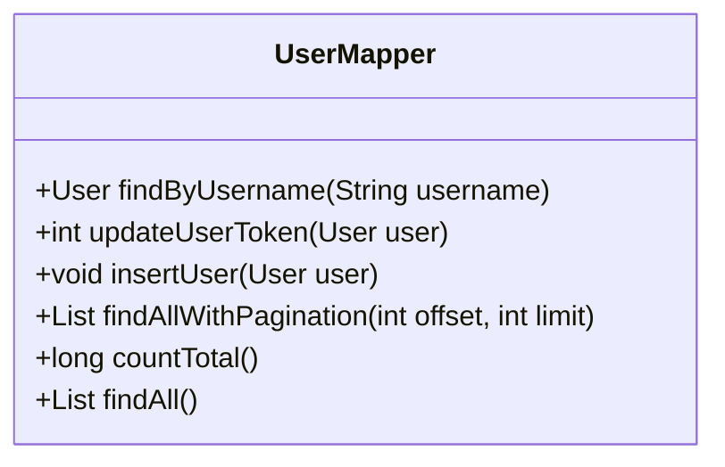
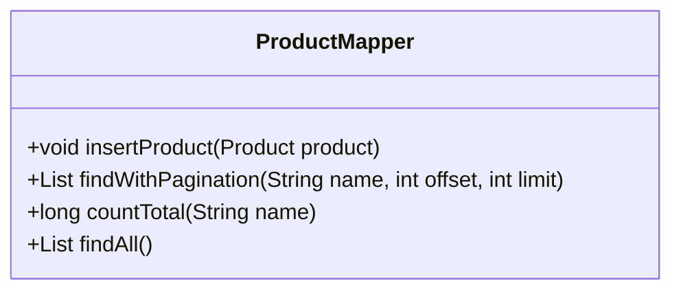
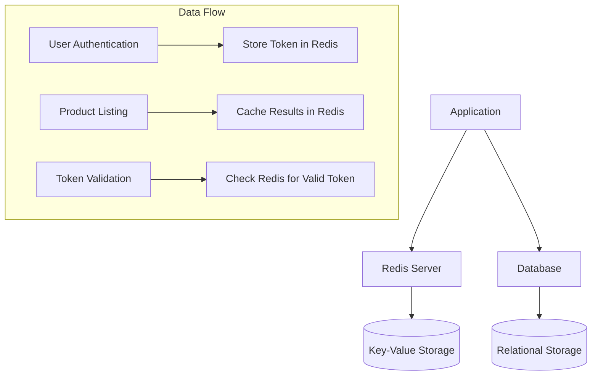

# Data Models & ORM Mapping

<cite>
**Referenced Files in This Document**   
- [schema.sql](file://src/main/resources/db/schema.sql)
- [User.java](file://src/main/java/com/example/onlinestore/model/User.java)
- [Product.java](file://src/main/java/com/example/onlinestore/model/Product.java)
- [UserMapper.xml](file://src/main/resources/mapper/UserMapper.xml)
- [ProductMapper.xml](file://src/main/resources/mapper/ProductMapper.xml)
- [UserMapper.java](file://src/main/java/com/example/onlinestore/mapper/UserMapper.java)
- [ProductMapper.java](file://src/main/java/com/example/onlinestore/mapper/ProductMapper.java)
- [MyBatisConfig.java](file://src/main/java/com/example/onlinestore/config/MyBatisConfig.java)
- [RedisConfig.java](file://src/main/java/com/example/onlinestore/config/RedisConfig.java)
- [application.yml](file://src/main/resources/application.yml)
</cite>

## Table of Contents
1. [Introduction](#introduction)
2. [Database Schema](#database-schema)
3. [User Entity Model](#user-entity-model)
4. [Product Entity Model](#product-entity-model)
5. [MyBatis Mapping Configuration](#mybatis-mapping-configuration)
6. [Data Access Patterns](#data-access-patterns)
7. [Data Validation and Business Logic](#data-validation-and-business-logic)
8. [Performance Considerations](#performance-considerations)
9. [Data Lifecycle and Redis Integration](#data-lifecycle-and-redis-integration)
10. [Conclusion](#conclusion)

## Introduction
This document provides comprehensive documentation for the User and Product entities in the online-store application. It details the database schema, Java entity models, MyBatis XML mappings, data access patterns, validation rules, and performance considerations. The documentation covers both structural and behavioral aspects of the data models, including their interaction with Redis for caching and session management.

## Database Schema

```mermaid
erDiagram
users {
BIGINT id PK
VARCHAR(50) username UK
VARCHAR(100) token
DATETIME token_expire_time
DATETIME created_at
DATETIME updated_at
}
products {
BIGINT id PK
VARCHAR(100) name
VARCHAR(50) category
DECIMAL(10,2) price
DATETIME created_at
DATETIME updated_at
}
users ||--o{ products : "owns"
```

**Diagram sources**
- [schema.sql](file://src/main/resources/db/schema.sql)

**Section sources**
- [schema.sql](file://src/main/resources/db/schema.sql)

## User Entity Model

The User entity represents system users with authentication and metadata fields. It is mapped to the `users` table in the database.

| Field | Data Type | Constraints | Business Meaning |
|-------|-----------|-----------|------------------|
| id | BIGINT | PRIMARY KEY, AUTO_INCREMENT | Unique identifier for the user |
| username | VARCHAR(50) | NOT NULL, UNIQUE | Login identifier, must be unique across the system |
| token | VARCHAR(100) | NULLABLE | Authentication token for session management |
| token_expire_time | DATETIME | NULLABLE | Expiration timestamp for the authentication token |
| created_at | DATETIME | DEFAULT CURRENT_TIMESTAMP | Timestamp when the user record was created |
| updated_at | DATETIME | DEFAULT CURRENT_TIMESTAMP ON UPDATE CURRENT_TIMESTAMP | Timestamp of the last update to the user record |

The Java model class includes standard getter and setter methods for all fields, following JavaBean conventions. The `token` and `token_expire_time` fields are used for stateless authentication, where the token serves as a session identifier with an expiration policy.

**Section sources**
- [User.java](file://src/main/java/com/example/onlinestore/model/User.java)
- [schema.sql](file://src/main/resources/db/schema.sql)

## Product Entity Model

The Product entity represents items available in the online store. It is mapped to the `products` table in the database.

| Field | Data Type | Constraints | Business Meaning |
|-------|-----------|-----------|------------------|
| id | BIGINT | PRIMARY KEY, AUTO_INCREMENT | Unique identifier for the product |
| name | VARCHAR(100) | NOT NULL | Product name visible to customers |
| category | VARCHAR(50) | NOT NULL | Classification of the product for organization and filtering |
| price | DECIMAL(10,2) | NOT NULL | Product price in currency units with two decimal places |
| created_at | DATETIME | DEFAULT CURRENT_TIMESTAMP | Timestamp when the product was added |
| updated_at | DATETIME | DEFAULT CURRENT_TIMESTAMP ON UPDATE CURRENT_TIMESTAMP | Timestamp of the last modification to product details |

The entity supports basic product information management with creation and update timestamps for audit purposes. The price field uses BigDecimal in Java to ensure precision in financial calculations.

**Section sources**
- [Product.java](file://src/main/java/com/example/onlinestore/model/Product.java)
- [schema.sql](file://src/main/resources/db/schema.sql)

## MyBatis Mapping Configuration

### User Mapper Configuration

The UserMapper interface and XML configuration provide data access methods for the User entity.



**Diagram sources**
- [UserMapper.java](file://src/main/java/com/example/onlinestore/mapper/UserMapper.java)
- [UserMapper.xml](file://src/main/resources/mapper/UserMapper.xml)

### Product Mapper Configuration

The ProductMapper interface and XML configuration provide data access methods for the Product entity.



**Diagram sources**
- [ProductMapper.java](file://src/main/java/com/example/onlinestore/mapper/ProductMapper.java)
- [ProductMapper.xml](file://src/main/resources/mapper/ProductMapper.xml)

### MyBatis Configuration

The MyBatis configuration enables camel case to underscore mapping, allowing Java's camelCase field names to automatically map to database's snake_case column names. The mapper locations are configured to load XML files from the classpath under `mapper/` directory.

**Section sources**
- [MyBatisConfig.java](file://src/main/java/com/example/onlinestore/config/MyBatisConfig.java)
- [application.yml](file://src/main/resources/application.yml)

## Data Access Patterns

### CRUD Operations

#### User Operations
- **Create**: `insertUser` inserts a new user record with all fields
- **Read**: `findByUsername` retrieves a user by username; `findAllWithPagination` returns paginated user list
- **Update**: `updateUserToken` updates token, expiration, and timestamp fields
- **Delete**: Not implemented in current mapper

#### Product Operations
- **Create**: `insertProduct` adds a new product to the catalog
- **Read**: `findWithPagination` retrieves products with optional name filtering and pagination
- **Update**: Not implemented in current mapper
- **Delete**: Not implemented in current mapper

### Pagination Queries

Both entities support pagination through offset-based queries. The pattern uses two queries:
1. Count query (`countTotal`) to determine total records for pagination metadata
2. Data query (`findWithPagination`) with LIMIT and OFFSET for retrieving the actual page of data

The pagination is implemented in the service layer through `listUsers` and `listProducts` methods, which combine the count and data queries into a `PageResponse` DTO.

**Section sources**
- [UserMapper.xml](file://src/main/resources/mapper/UserMapper.xml)
- [ProductMapper.xml](file://src/main/resources/mapper/ProductMapper.xml)
- [UserController.java](file://src/main/java/com/example/onlinestore/controller/UserController.java)
- [ProductController.java](file://src/main/java/com/example/onlinestore/controller/ProductController.java)

## Data Validation and Business Logic

### Field-Level Validation
- Username: Must be unique and not null (enforced at database level)
- Token: Variable length string up to 100 characters
- Name: Required field for products
- Price: Positive decimal value with two decimal places

### Business Constraints
- User creation requires unique username
- Token management includes expiration time to support automatic session invalidation
- Product search supports partial name matching through LIKE queries
- All records maintain creation and modification timestamps for audit purposes

### Service Layer Validation
The application uses Spring's validation framework with `@Valid` annotation on controller method parameters. Custom validation aspects (`ValidationAspect`) intercept method calls to enforce parameter validation rules before business logic execution.

**Section sources**
- [ValidateParams.java](file://src/main/java/com/example/onlinestore/annotation/ValidateParams.java)
- [ValidationAspect.java](file://src/main/java/com/example/onlinestore/aspect/ValidationAspect.java)
- [UserPageRequest.java](file://src/main/java/com/example/onlinestore/dto/UserPageRequest.java)
- [ProductPageRequest.java](file://src/main/java/com/example/onlinestore/dto/ProductPageRequest.java)

## Performance Considerations

### Indexing Strategy
- Primary key index on `id` for both tables (automatically created)
- Unique index on `username` in users table for fast authentication lookups
- No explicit indexes on product fields, but `name` filtering suggests potential need for index on `name` column

### Query Optimization
- Pagination uses LIMIT with OFFSET, which may have performance implications for deep pagination
- The `findWithPagination` query for products includes conditional filtering on name
- Count queries are executed separately from data queries to support pagination metadata

### MyBatis Configuration
- Result mapping is optimized through type aliases and camel case conversion
- SQL statements are externalized in XML files for maintainability
- The configuration enables automatic mapping between underscore and camel case naming conventions

**Section sources**
- [UserMapper.xml](file://src/main/resources/mapper/UserMapper.xml)
- [ProductMapper.xml](file://src/main/resources/mapper/ProductMapper.xml)
- [MyBatisConfig.java](file://src/main/java/com/example/onlinestore/config/MyBatisConfig.java)

## Data Lifecycle and Redis Integration

### Redis Configuration
The application is configured to connect to Redis for caching and session management. The Redis configuration creates a `StringRedisTemplate` bean for string-based operations.



**Diagram sources**
- [RedisConfig.java](file://src/main/java/com/example/onlinestore/config/RedisConfig.java)
- [application.yml](file://src/main/resources/application.yml)

### Data Lifecycle Management
- User tokens are stored in Redis with expiration matching `token_expire_time`
- The application likely uses Redis to cache frequently accessed data such as product listings
- Session state is managed through tokens rather than server-side sessions
- Data consistency is maintained between database and Redis through application logic

The Redis integration supports scalability by externalizing session state and providing a fast cache layer for database queries.

**Section sources**
- [RedisConfig.java](file://src/main/java/com/example/onlinestore/config/RedisConfig.java)
- [application.yml](file://src/main/resources/application.yml)
- [UserService.java](file://src/main/java/com/example/onlinestore/service/UserService.java)

## Conclusion
The online-store application implements a clean data model with well-defined User and Product entities. The MyBatis-based ORM layer provides efficient database access with XML-configured SQL statements. The architecture supports pagination, filtering, and authentication workflows with integration to Redis for session management and caching. While the current implementation covers core functionality, opportunities exist for enhancing the data access layer with additional indexes, soft deletion, and more comprehensive CRUD operations. The separation of concerns between database schema, Java models, and mapping configurations follows established patterns for maintainable enterprise applications.