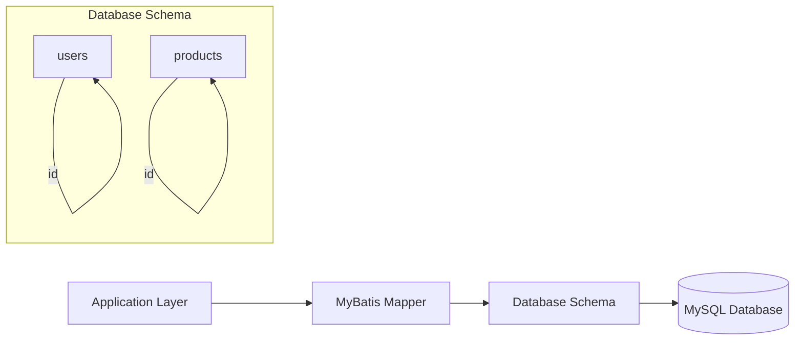
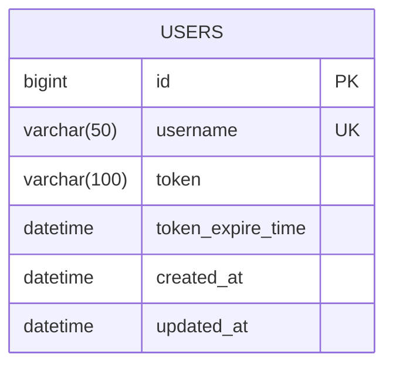
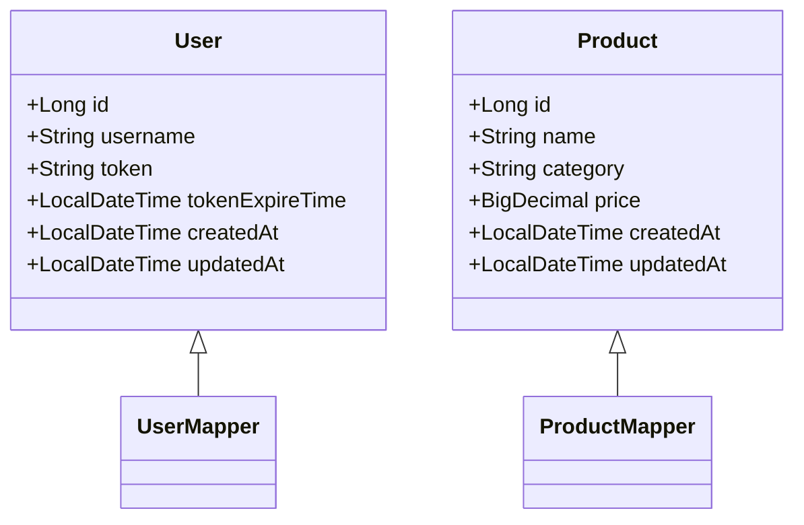
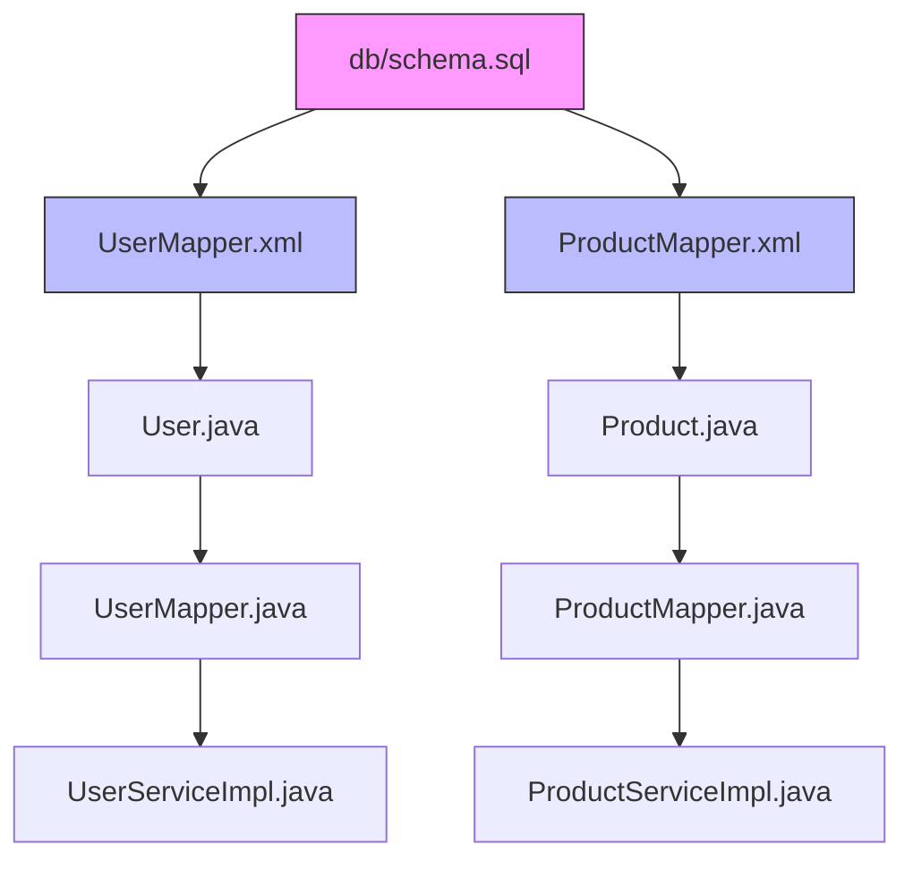

# Database Schema

<cite>
**Referenced Files in This Document**   
- [schema.sql](file://src/main/resources/db/schema.sql)
- [User.java](file://src/main/java/com/example/onlinestore/model/User.java)
- [Product.java](file://src/main/java/com/example/onlinestore/model/Product.java)
- [UserMapper.xml](file://src/main/resources/mapper/UserMapper.xml)
- [ProductMapper.xml](file://src/main/resources/mapper/ProductMapper.xml)
- [application.yml](file://src/main/resources/application.yml)
- [application-local.yml](file://src/main/resources/application-local.yml)
</cite>

## Table of Contents
1. [Introduction](#introduction)
2. [Project Structure](#project-structure)
3. [Core Components](#core-components)
4. [Architecture Overview](#architecture-overview)
5. [Detailed Component Analysis](#detailed-component-analysis)
6. [Dependency Analysis](#dependency-analysis)
7. [Performance Considerations](#performance-considerations)
8. [Troubleshooting Guide](#troubleshooting-guide)
9. [Conclusion](#conclusion)

## Introduction
This document provides comprehensive documentation for the database schema of the online-store application. The schema supports core application features including user authentication and product management. The analysis is based on the schema.sql file and related components that define the data model, including entity classes, MyBatis mappers, and configuration files. The documentation covers table definitions, schema design decisions, relationships between entities, and performance considerations for MySQL 8.0.

**Section sources**
- [schema.sql](file://src/main/resources/db/schema.sql#L1-L8)

## Project Structure
The database schema is defined in the `src/main/resources/db/schema.sql` file, which contains the DDL statements for creating the database tables. The application follows a standard Maven project structure with Java source code organized under `src/main/java` and resources under `src/main/resources`. The database-related components are organized as follows:
- SQL schema definition in `src/main/resources/db/schema.sql`
- MyBatis mapper XML files in `src/main/resources/mapper/`
- Entity model classes in `src/main/java/com/example/onlinestore/model/`
- Mapper interfaces in `src/main/java/com/example/onlinestore/mapper/`
- Database configuration in `src/main/resources/application.yml` and `application-local.yml`

```mermaid
graph TB
subgraph "Resources"
schema[db/schema.sql]
mappers[mapper/*.xml]
config[application.yml]
end
subgraph "Java Source"
models[model/]
mappers_java[mapper/]
services[service/]
end
schema --> models : Defines structure
mappers --> schema : Implements queries
models --> mappers : Data mapping
config --> schema : Database connection
```

**Diagram sources**
- [schema.sql](file://src/main/resources/db/schema.sql#L1-L8)
- [application.yml](file://src/main/resources/application.yml#L1-L48)

**Section sources**
- [schema.sql](file://src/main/resources/db/schema.sql#L1-L8)
- [application.yml](file://src/main/resources/application.yml#L1-L48)

## Core Components
The database schema consists of two primary tables: `users` and `products`. The `users` table is explicitly defined in the schema.sql file and supports user authentication functionality. The `products` table, while not explicitly defined in the schema.sql file, is referenced in the ProductMapper.xml file and is essential for product management functionality. Both tables follow consistent design patterns including auto-incrementing primary keys, timestamp tracking, and appropriate data typing for their respective domains.

**Section sources**
- [schema.sql](file://src/main/resources/db/schema.sql#L1-L8)
- [UserMapper.xml](file://src/main/resources/mapper/UserMapper.xml#L1-L34)
- [ProductMapper.xml](file://src/main/resources/mapper/ProductMapper.xml#L1-L36)

## Architecture Overview
The database architecture follows a simple relational model with two main entities: users and products. The application uses MyBatis as the persistence framework, which provides XML-based SQL mapping for database operations. The schema is designed to support the application's core functionality with minimal complexity, focusing on essential data storage needs for user authentication and product catalog management. The architecture leverages MySQL 8.0 features through the use of DATETIME with DEFAULT CURRENT_TIMESTAMP and ON UPDATE CURRENT_TIMESTAMP clauses.



**Diagram sources**
- [schema.sql](file://src/main/resources/db/schema.sql#L1-L8)
- [UserMapper.xml](file://src/main/resources/mapper/UserMapper.xml#L1-L34)
- [ProductMapper.xml](file://src/main/resources/mapper/ProductMapper.xml#L1-L36)

## Detailed Component Analysis

### Users Table Analysis
The users table is designed to support user authentication and session management. It stores user credentials and session tokens with appropriate constraints and indexing considerations.



**Diagram sources**
- [schema.sql](file://src/main/resources/db/schema.sql#L1-L8)
- [User.java](file://src/main/java/com/example/onlinestore/model/User.java#L1-L60)

**Section sources**
- [schema.sql](file://src/main/resources/db/schema.sql#L1-L8)
- [User.java](file://src/main/java/com/example/onlinestore/model/User.java#L1-L60)
- [UserMapper.xml](file://src/main/resources/mapper/UserMapper.xml#L1-L34)

### Products Table Analysis
The products table supports product management functionality with fields for product name, category, price, and timestamps. Although not explicitly defined in schema.sql, its structure can be inferred from the MyBatis mapper configuration and entity class.

```mermaid
erDiagram
PRODUCTS {
bigint id PK
varchar(255) name
varchar(100) category
decimal(10,2) price
datetime created_at
datetime updated_at
}
```

**Diagram sources**
- [Product.java](file://src/main/java/com/example/onlinestore/model/Product.java#L1-L61)
- [ProductMapper.xml](file://src/main/resources/mapper/ProductMapper.xml#L1-L36)

**Section sources**
- [Product.java](file://src/main/java/com/example/onlinestore/model/Product.java#L1-L61)
- [ProductMapper.xml](file://src/main/resources/mapper/ProductMapper.xml#L1-L36)

### Schema Design Decisions
The schema design reflects several important decisions that impact application functionality and data integrity:

**Users Table Design:**
- **VARCHAR Lengths**: The username field uses VARCHAR(50), which provides sufficient length for typical usernames while conserving storage space. The token field uses VARCHAR(100) to accommodate typical JWT or session token lengths.
- **NOT NULL Constraints**: The username field is marked as NOT NULL and UNIQUE, ensuring data integrity for user identification. The id field is AUTO_INCREMENT and PRIMARY KEY, providing a reliable unique identifier.
- **Timestamp Management**: Both created_at and updated_at fields use DATETIME with DEFAULT CURRENT_TIMESTAMP. The updated_at field additionally uses ON UPDATE CURRENT_TIMESTAMP, automatically tracking when records are modified.

**Products Table Inferred Design:**
- **Data Types**: The price field uses DECIMAL (inferred from BigDecimal in Java), ensuring precise monetary calculations without floating-point errors.
- **Indexing Strategy**: While not explicitly defined, the findWithPagination query in ProductMapper.xml suggests that the name field should be indexed to support efficient LIKE queries with pagination.
- **Temporal Fields**: Consistent with the users table, products includes created_at and updated_at fields with the same automatic timestamp behavior.



**Diagram sources**
- [User.java](file://src/main/java/com/example/onlinestore/model/User.java#L1-L60)
- [Product.java](file://src/main/java/com/example/onlinestore/model/Product.java#L1-L61)
- [schema.sql](file://src/main/resources/db/schema.sql#L1-L8)

**Section sources**
- [schema.sql](file://src/main/resources/db/schema.sql#L1-L8)
- [User.java](file://src/main/java/com/example/onlinestore/model/User.java#L1-L60)
- [Product.java](file://src/main/java/com/example/onlinestore/model/Product.java#L1-L61)

## Dependency Analysis
The database schema components are interconnected through the application's data access layer. The MyBatis mapper interfaces and XML files define the contract between the Java application and the database schema.



**Diagram sources**
- [schema.sql](file://src/main/resources/db/schema.sql#L1-L8)
- [UserMapper.xml](file://src/main/resources/mapper/UserMapper.xml#L1-L34)
- [ProductMapper.xml](file://src/main/resources/mapper/ProductMapper.xml#L1-L36)
- [User.java](file://src/main/java/com/example/onlinestore/model/User.java#L1-L60)
- [Product.java](file://src/main/java/com/example/onlinestore/model/Product.java#L1-L61)

**Section sources**
- [schema.sql](file://src/main/resources/db/schema.sql#L1-L8)
- [UserMapper.xml](file://src/main/resources/mapper/UserMapper.xml#L1-L34)
- [ProductMapper.xml](file://src/main/resources/mapper/ProductMapper.xml#L1-L36)

## Performance Considerations
The current schema design has several performance implications and optimization opportunities:

**Indexing Recommendations:**
- Add an index on the users.username field to optimize findByUsername queries
- Add an index on products.name to improve search performance for product lookups
- Consider composite indexes on (name, category) if product filtering by both fields is common
- Add an index on token_expire_time to efficiently identify expired tokens during cleanup operations

**Query Execution Plans:**
- The pagination queries use LIMIT with offset, which can become inefficient for large datasets. Consider keyset pagination for better performance at scale.
- The LIKE queries with wildcards in ProductMapper.xml may benefit from full-text indexing if text search is a common operation.
- All queries should leverage the MySQL query optimizer with proper indexing to avoid full table scans.

**MySQL 8.0 Features:**
- The schema already uses modern DATETIME with DEFAULT and ON UPDATE clauses
- Consider using invisible indexes for testing new indexing strategies without affecting production
- Utilize MySQL 8.0's window functions if complex analytical queries are needed in the future
- Implement generated columns if derived data needs to be stored efficiently

**Section sources**
- [UserMapper.xml](file://src/main/resources/mapper/UserMapper.xml#L1-L34)
- [ProductMapper.xml](file://src/main/resources/mapper/ProductMapper.xml#L1-L36)
- [schema.sql](file://src/main/resources/db/schema.sql#L1-L8)

## Troubleshooting Guide
Common database-related issues and their solutions:

**Schema Evolution:**
- When adding new tables or columns, create migration scripts rather than modifying the initial schema.sql
- Use versioned migration files to ensure consistent schema evolution across environments
- Always backup data before schema modifications in production

**Connection Issues:**
- Verify database URL, username, and password in application.yml
- Ensure MySQL server is running and accessible on the configured port
- Check that the online_store database exists and has proper permissions

**Performance Problems:**
- Monitor slow query logs to identify inefficient queries
- Use EXPLAIN to analyze query execution plans
- Add appropriate indexes based on query patterns

**Data Integrity:**
- The UNIQUE constraint on users.username prevents duplicate accounts
- Use transactions for operations that modify multiple related records
- Implement proper error handling for constraint violations

**Section sources**
- [schema.sql](file://src/main/resources/db/schema.sql#L1-L8)
- [application.yml](file://src/main/resources/application.yml#L1-L48)
- [UserMapper.xml](file://src/main/resources/mapper/UserMapper.xml#L1-L34)
- [ProductMapper.xml](file://src/main/resources/mapper/ProductMapper.xml#L1-L36)

## Conclusion
The online-store application's database schema provides a solid foundation for user authentication and product management functionality. The users table is explicitly defined with appropriate constraints and temporal tracking, while the products table structure can be inferred from the application code. The schema design follows good practices with consistent use of primary keys, timestamps, and appropriate data types. To enhance the schema, consider adding explicit DDL for the products table, implementing proper indexing strategies, and creating a migration framework for schema evolution. The current design is compatible with MySQL 8.0 and leverages modern features like automatic timestamp management.