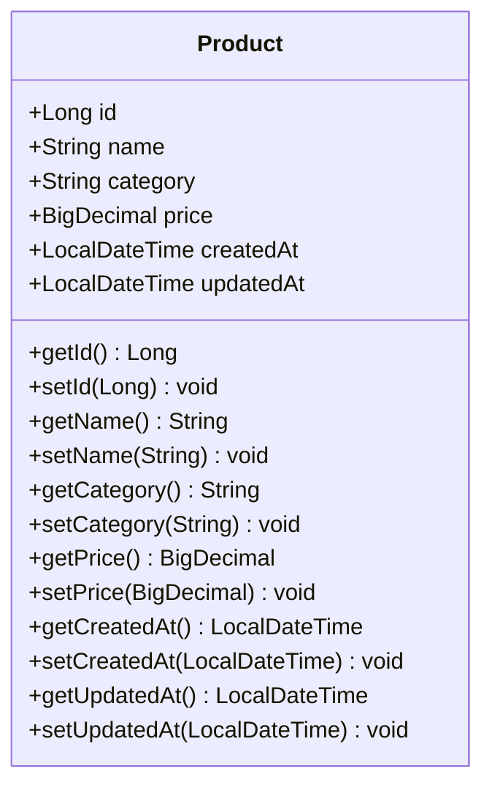
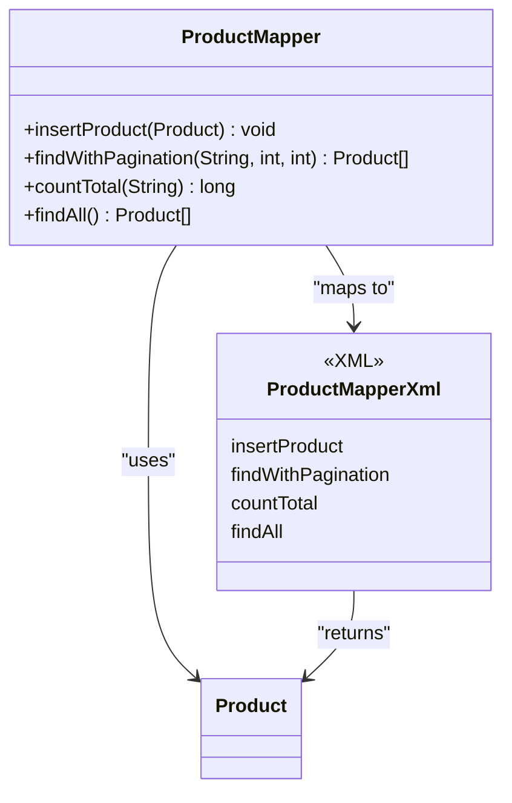
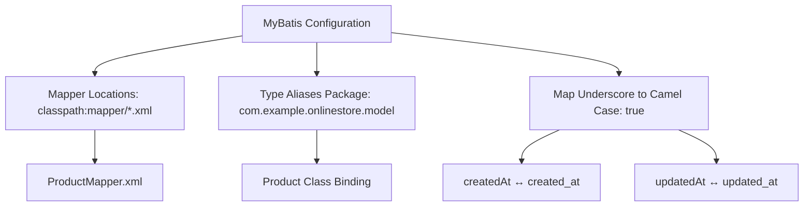
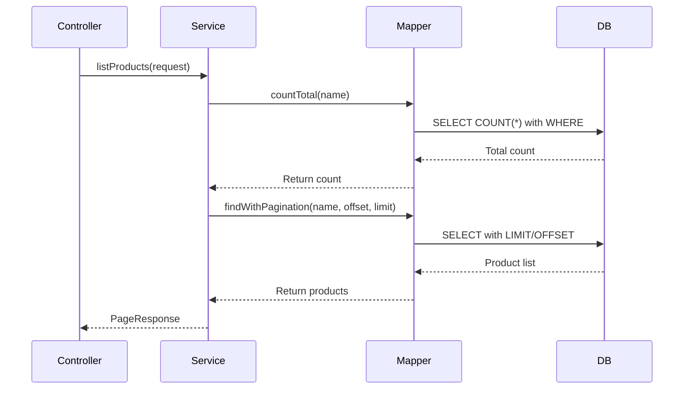
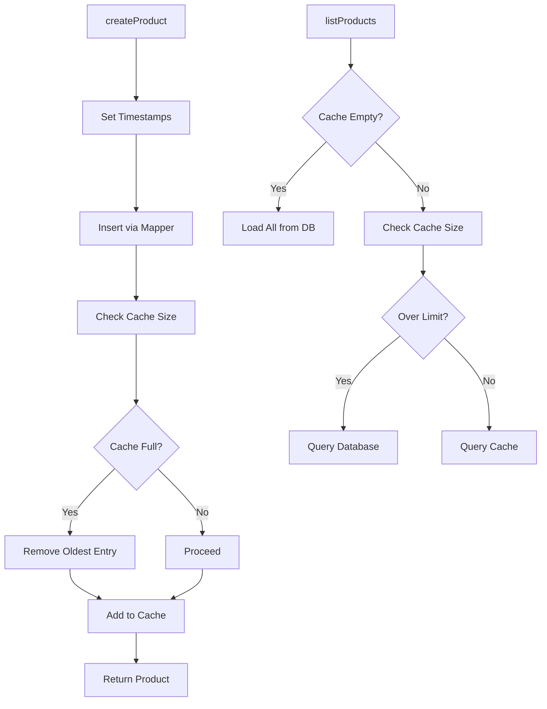
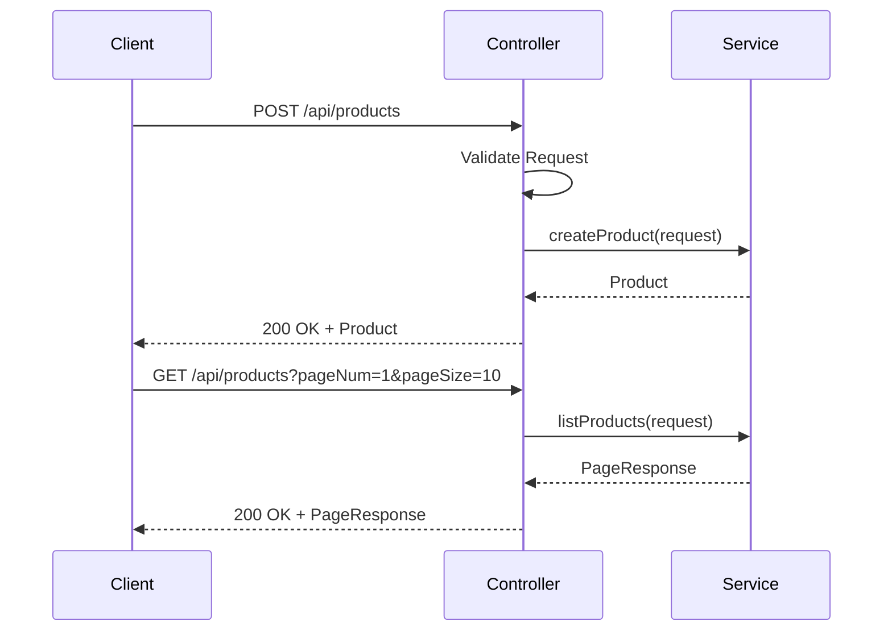
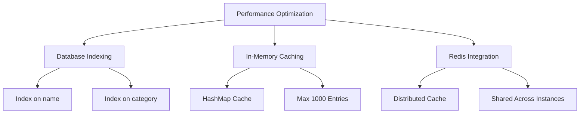

# Product Model

<cite>
**Referenced Files in This Document**   
- [Product.java](file://src/main/java/com/example/onlinestore/model/Product.java)
- [ProductMapper.xml](file://src/main/resources/mapper/ProductMapper.xml)
- [ProductMapper.java](file://src/main/java/com/example/onlinestore/mapper/ProductMapper.java)
- [ProductServiceImpl.java](file://src/main/java/com/example/onlinestore/service/impl/ProductServiceImpl.java)
- [ProductController.java](file://src/main/java/com/example/onlinestore/controller/ProductController.java)
- [CreateProductRequest.java](file://src/main/java/com/example/onlinestore/dto/CreateProductRequest.java)
- [ProductPageRequest.java](file://src/main/java/com/example/onlinestore/dto/ProductPageRequest.java)
- [schema.sql](file://src/main/resources/db/schema.sql)
- [RedisConfig.java](file://src/main/java/com/example/onlinestore/config/RedisConfig.java)
</cite>

## Table of Contents
1. [Introduction](#introduction)
2. [Product Entity Data Model](#product-entity-data-model)
3. [Field Specifications](#field-specifications)
4. [Persistence Layer Architecture](#persistence-layer-architecture)
5. [SQL Mapping and MyBatis Configuration](#sql-mapping-and-mybatis-configuration)
6. [Query Patterns and Business Logic](#query-patterns-and-business-logic)
7. [Service Layer Implementation](#service-layer-implementation)
8. [Controller Interface and Usage Examples](#controller-interface-and-usage-examples)
9. [Performance Optimization Strategies](#performance-optimization-strategies)
10. [Conclusion](#conclusion)

## Introduction

The Product entity serves as a core domain model in the online-store application, representing merchandise available for sale. This document provides comprehensive documentation of the Product data model, its persistence mechanism using MyBatis ORM, and integration with service and controller layers. The model supports essential e-commerce operations including product creation, paginated listing, and name-based search functionality. A hybrid caching strategy combining in-memory storage with potential Redis integration enhances read performance for frequently accessed products.

**Section sources**
- [Product.java](file://src/main/java/com/example/onlinestore/model/Product.java#L1-L61)
- [ProductServiceImpl.java](file://src/main/java/com/example/onlinestore/service/impl/ProductServiceImpl.java#L1-L132)

## Product Entity Data Model

The Product class is a plain Java object (POJO) that represents a product in the online store system. It encapsulates key attributes such as name, category, price, and timestamps, serving as both a domain model and data transfer object throughout the application layers. The entity follows JavaBean conventions with private fields and public getter/setter methods, enabling seamless integration with Spring Framework components and MyBatis ORM.

**Diagram sources**
- [Product.java](file://src/main/java/com/example/onlinestore/model/Product.java#L6-L61)

**Section sources**
- [Product.java](file://src/main/java/com/example/onlinestore/model/Product.java#L1-L61)

## Field Specifications

The Product entity contains six core fields, each serving a specific business purpose with defined data types and constraints:

| Field | Data Type | Constraints | Business Meaning |
|-------|-----------|-----------|------------------|
| id | Long | Primary Key, Auto-generated | Unique identifier for the product |
| name | String | Not Blank, Unique Index | Display name of the product |
| category | String | Not Blank | Classification grouping for the product |
| price | BigDecimal | Not Null, Minimum 0.01 | Monetary value in base currency units |
| createdAt | LocalDateTime | Not Null, Default Current Timestamp | Creation timestamp in server time |
| updatedAt | LocalDateTime | Not Null, Default Current Timestamp | Last modification timestamp |

The `id` field serves as the primary key, automatically generated by the database. The `name` and `category` fields are string values with validation constraints enforced through DTO validation. The `price` field uses BigDecimal to ensure precise monetary calculations without floating-point errors. Both timestamp fields use Java's LocalDateTime type, capturing date and time without timezone information, synchronized with the database server's timezone (Asia/Shanghai).

**Section sources**
- [Product.java](file://src/main/java/com/example/onlinestore/model/Product.java#L7-L12)
- [CreateProductRequest.java](file://src/main/java/com/example/onlinestore/dto/CreateProductRequest.java#L9-L17)

## Persistence Layer Architecture

The persistence layer implements a clean separation between the domain model and database operations through MyBatis ORM. The architecture follows a three-tier pattern consisting of the Product entity, ProductMapper interface, and ProductMapper.xml SQL mapping file. This design enables type-safe database operations while maintaining full control over SQL queries.

**Diagram sources**
- [ProductMapper.java](file://src/main/java/com/example/onlinestore/mapper/ProductMapper.java#L10-L20)
- [ProductMapper.xml](file://src/main/resources/mapper/ProductMapper.xml#L1-L36)

**Section sources**
- [ProductMapper.java](file://src/main/java/com/example/onlinestore/mapper/ProductMapper.java#L1-L20)
- [ProductMapper.xml](file://src/main/resources/mapper/ProductMapper.xml#L1-L36)

## SQL Mapping and MyBatis Configuration

The MyBatis configuration defines four key operations for product management through XML-based SQL mappings. The `insertProduct` statement handles new product creation with automatic timestamp population. Two complementary queries, `findWithPagination` and `countTotal`, enable efficient paginated retrieval with optional name-based filtering. The `findAll` query supports complete dataset loading for caching purposes.

The MyBatis configuration in application.yml specifies mapper locations, type aliases, and camel case mapping, enabling seamless integration between Java properties (camelCase) and database columns (snake_case). The mapper interface uses @Mapper annotation for automatic proxy creation by Spring, with @Param annotations ensuring proper parameter binding in dynamic SQL queries.

**Diagram sources**
- [ProductMapper.xml](file://src/main/resources/mapper/ProductMapper.xml#L1-L36)
- [application.yml](file://src/main/resources/application.yml#L35-L39)

**Section sources**
- [ProductMapper.xml](file://src/main/resources/mapper/ProductMapper.xml#L1-L36)
- [application.yml](file://src/main/resources/application.yml#L35-L39)

## Query Patterns and Business Logic

The application implements three primary query patterns for product data retrieval: paginated listing, name-based search, and bulk loading. The paginated listing pattern uses offset-based pagination with LIMIT and OFFSET clauses, ordered by creation time in descending order. The name-based search employs SQL LIKE with wildcards for partial matching, implemented through MyBatis' dynamic SQL <if> conditions.

The business logic enforces timestamp handling during product creation, setting both createdAt and updatedAt to the current time. The search functionality supports optional filtering by name, with empty or null search terms returning all products. The pagination system validates page number and size parameters through the ProductPageRequest DTO, ensuring values fall within acceptable ranges (page size between 1-100).

**Diagram sources**
- [ProductMapper.xml](file://src/main/resources/mapper/ProductMapper.xml#L9-L19)
- [ProductServiceImpl.java](file://src/main/java/com/example/onlinestore/service/impl/ProductServiceImpl.java#L60-L132)

**Section sources**
- [ProductMapper.xml](file://src/main/resources/mapper/ProductMapper.xml#L9-L36)
- [ProductServiceImpl.java](file://src/main/java/com/example/onlinestore/service/impl/ProductServiceImpl.java#L60-L132)

## Service Layer Implementation

The ProductServiceImpl class implements the core business logic for product management, orchestrating operations between the controller and persistence layers. It implements the ProductService interface with two primary methods: createProduct and listProducts. The service layer incorporates logging, transaction management, and caching strategies to enhance reliability and performance.

A HashMap-based in-memory cache stores up to 1,000 products, with oldest entries removed when capacity is exceeded. The caching strategy follows a hybrid approach: new products are immediately cached upon creation, while read operations first attempt to serve from cache before falling back to database queries. The service uses @Transactional annotation to ensure data consistency during product creation, treating the insert operation as an atomic unit of work.

**Diagram sources**
- [ProductServiceImpl.java](file://src/main/java/com/example/onlinestore/service/impl/ProductServiceImpl.java#L22-L132)

**Section sources**
- [ProductServiceImpl.java](file://src/main/java/com/example/onlinestore/service/impl/ProductServiceImpl.java#L22-L132)

## Controller Interface and Usage Examples

The ProductController exposes RESTful endpoints for product management, following standard HTTP conventions. The POST /api/products endpoint creates new products and requires administrative privileges, enforced by the @RequireAdmin annotation. The GET /api/products endpoint retrieves paginated product lists with optional name filtering, accessible to all authenticated users.

Usage examples include creating a product with JSON payload containing name, category, and price fields, and retrieving products with query parameters for pagination (pageNum, pageSize) and search (name). The controller implements comprehensive error handling, returning appropriate HTTP status codes (400 for validation errors, 500 for internal errors) with localized error messages sourced from message properties files.

**Diagram sources**
- [ProductController.java](file://src/main/java/com/example/onlinestore/controller/ProductController.java#L19-L78)
- [ProductServiceImpl.java](file://src/main/java/com/example/onlinestore/service/impl/ProductServiceImpl.java#L35-L57)

**Section sources**
- [ProductController.java](file://src/main/java/com/example/onlinestore/controller/ProductController.java#L19-L78)
- [CreateProductRequest.java](file://src/main/java/com/example/onlinestore/dto/CreateProductRequest.java#L1-L42)
- [ProductPageRequest.java](file://src/main/java/com/example/onlinestore/dto/ProductPageRequest.java#L1-L39)

## Performance Optimization Strategies

The application employs multiple strategies to optimize product data access performance. Database indexing on the name and category fields enables efficient filtering and searching operations. The current implementation uses a HashMap-based in-memory cache with a maximum capacity of 1,000 entries, providing fast access to frequently requested products.

The architecture is designed to integrate with Redis for distributed caching, as evidenced by the RedisConfig class and Spring Data Redis dependencies. This would enable cache sharing across multiple application instances in a clustered environment. The caching strategy prioritizes recent products, automatically removing the oldest entries when capacity is exceeded, ensuring that the most relevant products remain in cache.

Future optimization opportunities include implementing database indexes on frequently queried columns, adding Redis caching for product details, and introducing query result caching for common search patterns. The current hybrid approach of serving small datasets from memory and larger datasets from the database balances memory usage with query performance.

**Diagram sources**
- [ProductServiceImpl.java](file://src/main/java/com/example/onlinestore/service/impl/ProductServiceImpl.java#L31-L56)
- [RedisConfig.java](file://src/main/java/com/example/onlinestore/config/RedisConfig.java#L1-L15)

**Section sources**
- [ProductServiceImpl.java](file://src/main/java/com/example/onlinestore/service/impl/ProductServiceImpl.java#L31-L56)
- [RedisConfig.java](file://src/main/java/com/example/onlinestore/config/RedisConfig.java#L1-L15)

## Conclusion

The Product model in the online-store application represents a well-designed domain entity with clear field definitions, robust persistence through MyBatis ORM, and efficient service layer implementation. The architecture balances immediate performance needs with scalability considerations, incorporating both in-memory caching and support for distributed Redis caching. The separation of concerns between entity, mapper, service, and controller layers follows Spring best practices, enabling maintainable and testable code. The comprehensive validation, error handling, and logging provide operational visibility while ensuring data integrity across all product management operations.