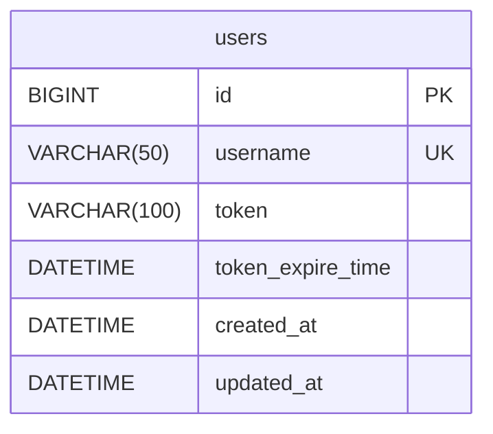
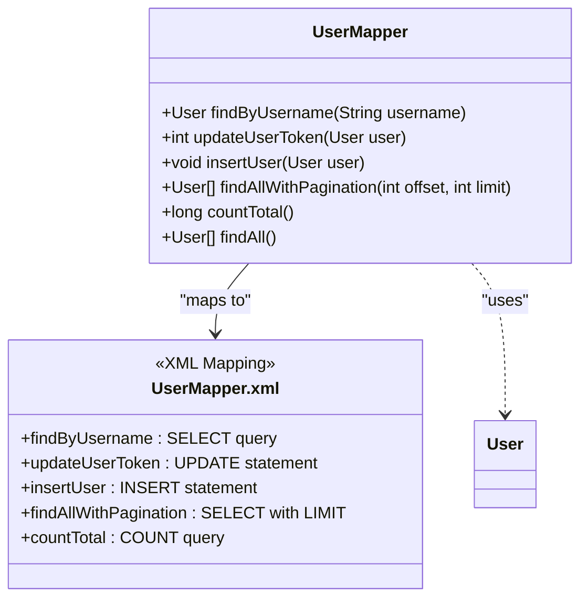
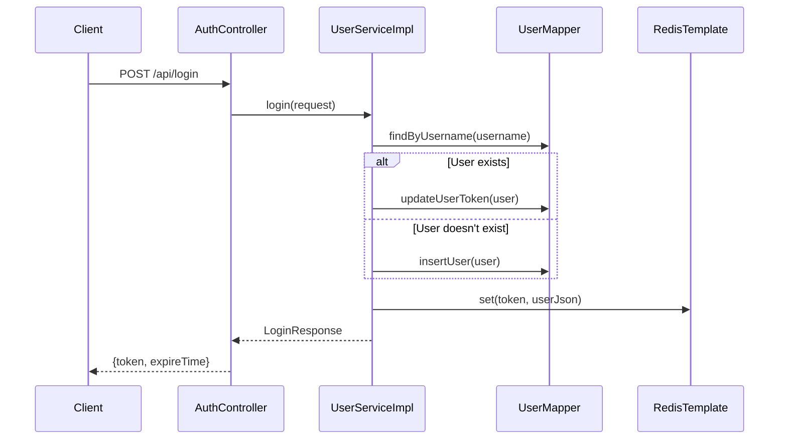
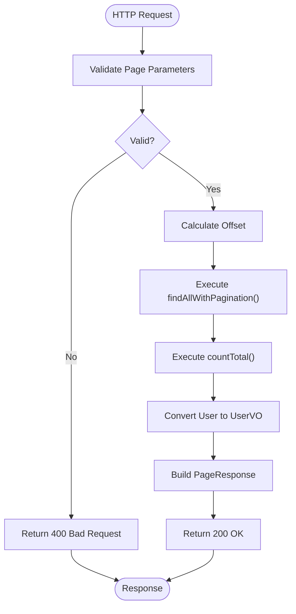

# User Model

<cite>
**Referenced Files in This Document**   
- [User.java](file://src/main/java/com/example/onlinestore/model/User.java)
- [UserMapper.java](file://src/main/java/com/example/onlinestore/mapper/UserMapper.java)
- [UserMapper.xml](file://src/main/resources/mapper/UserMapper.xml)
- [UserServiceImpl.java](file://src/main/java/com/example/onlinestore/service/impl/UserServiceImpl.java)
- [UserController.java](file://src/main/java/com/example/onlinestore/controller/UserController.java)
- [UserPageRequest.java](file://src/main/java/com/example/onlinestore/dto/UserPageRequest.java)
- [UserVO.java](file://src/main/java/com/example/onlinestore/dto/UserVO.java)
- [schema.sql](file://src/main/resources/db/schema.sql)
- [RedisConfig.java](file://src/main/java/com/example/onlinestore/config/RedisConfig.java)
- [AuthInterceptor.java](file://src/main/java/com/example/onlinestore/interceptor/AuthInterceptor.java)
</cite>

## Table of Contents
1. [Introduction](#introduction)
2. [Data Model Definition](#data-model-definition)
3. [Database Schema](#database-schema)
4. [MyBatis Mapping Configuration](#mybatis-mapping-configuration)
5. [Service Layer Implementation](#service-layer-implementation)
6. [Data Access Patterns](#data-access-patterns)
7. [Security and Token Management](#security-and-token-management)
8. [Performance Considerations](#performance-considerations)

## Introduction
The User model serves as a core domain entity in the online-store application, representing user accounts and their authentication state. This documentation provides comprehensive details about the User entity's structure, persistence mechanism, and interaction patterns within the Spring Boot application. The model plays a critical role in authentication workflows, user management, and session handling through token-based authentication integrated with Redis caching.

## Data Model Definition

The User class is a Java domain model that represents user data in the application's business logic layer. It contains essential fields for user identification, authentication tokens, and temporal tracking.

**Field Specifications:**
- **id**: `Long` - Unique identifier for the user, auto-generated by the database
- **username**: `String` - User's login identifier, must be unique across the system
- **token**: `String` - Authentication token used for session management
- **tokenExpireTime**: `LocalDateTime` - Timestamp indicating when the current token expires
- **createdAt**: `LocalDateTime` - Timestamp of user record creation
- **updatedAt**: `LocalDateTime` - Timestamp of last user record modification

The User class follows JavaBean conventions with private fields and public getter/setter methods, enabling proper encapsulation and compatibility with Spring's reflection-based operations.

**Section sources**
- [User.java](file://src/main/java/com/example/onlinestore/model/User.java#L5-L60)

## Database Schema

The users table is designed to store user information with appropriate constraints and indexing for optimal performance. The schema includes:

- **Primary Key**: `id` field with BIGINT auto-increment for unique identification
- **Unique Constraint**: `username` field is marked as NOT NULL and UNIQUE to prevent duplicate accounts
- **Token Fields**: `token` and `token_expire_time` for authentication state management
- **Timestamps**: Automatic management of `created_at` and `updated_at` fields with database-level defaults

The schema ensures data integrity through proper constraints and supports efficient querying through indexing on critical fields.



**Diagram sources**
- [schema.sql](file://src/main/resources/db/schema.sql#L1-L8)

**Section sources**
- [schema.sql](file://src/main/resources/db/schema.sql#L1-L8)

## MyBatis Mapping Configuration

The MyBatis persistence layer is configured through a combination of Java interfaces and XML mapping files that define the contract between the application and database.

### UserMapper Interface
The UserMapper interface declares several data access methods:
- `findByUsername(String username)`: Retrieves a user by their username
- `updateUserToken(User user)`: Updates a user's token and expiration time
- `insertUser(User user)`: Creates a new user record
- `findAllWithPagination(int offset, int limit)`: Retrieves users with pagination
- `countTotal()`: Returns the total count of users for pagination
- `findAll()`: Retrieves all users (unused in current implementation)

### XML Mapping Details
The UserMapper.xml file contains SQL statements mapped to interface methods:
- **findByUsername**: SELECT query with parameterized username filtering
- **updateUserToken**: UPDATE statement modifying token, expiration, and updated timestamp
- **insertUser**: INSERT statement with all user fields
- **findAllWithPagination**: SELECT with LIMIT/OFFSET for pagination
- **countTotal**: COUNT query for total user count

The MyBatis configuration enables underscore-to-camel-case mapping, allowing proper field name translation between database columns (snake_case) and Java properties (camelCase).



**Diagram sources**
- [UserMapper.java](file://src/main/java/com/example/onlinestore/mapper/UserMapper.java#L9-L23)
- [UserMapper.xml](file://src/main/resources/mapper/UserMapper.xml#L1-L34)

**Section sources**
- [UserMapper.java](file://src/main/java/com/example/onlinestore/mapper/UserMapper.java#L9-L23)
- [UserMapper.xml](file://src/main/resources/mapper/UserMapper.xml#L1-L34)
- [MyBatisConfig.java](file://src/main/java/com/example/onlinestore/config/MyBatisConfig.java#L10-L27)

## Service Layer Implementation

The UserService interface and its implementation provide business logic for user authentication, token management, and user listing operations.

### Core Operations
The UserService interface defines three primary methods:
- `login(LoginRequest request)`: Handles user authentication and token generation
- `listUsers(UserPageRequest request)`: Retrieves paginated user listings
- `getUserByToken(String token)`: Validates and retrieves user information from token

### Login Workflow
The login process follows a multi-step workflow:
1. Admin users are authenticated using configured credentials
2. Regular users are validated through an external user service
3. User records are either created (new users) or updated (existing users)
4. Authentication tokens are generated and stored in both database and Redis
5. Token expiration is set to one day by default

### User Context Management
The service layer integrates with UserContext, a ThreadLocal-based storage mechanism that maintains the current user's information during request processing, enabling access to user data across different layers of the application.



**Diagram sources**
- [UserServiceImpl.java](file://src/main/java/com/example/onlinestore/service/impl/UserServiceImpl.java#L67-L139)
- [UserMapper.java](file://src/main/java/com/example/onlinestore/mapper/UserMapper.java#L12-L18)

**Section sources**
- [UserServiceImpl.java](file://src/main/java/com/example/onlinestore/service/impl/UserServiceImpl.java#L31-L193)
- [UserService.java](file://src/main/java/com/example/onlinestore/service/UserService.java#L10-L14)
- [UserContext.java](file://src/main/java/com/example/onlinestore/context/UserContext.java#L1-L19)

## Data Access Patterns

The application implements standardized data access patterns for retrieving and managing user information with proper pagination and filtering capabilities.

### Pagination Implementation
The pagination system uses offset-based pagination with the following parameters:
- **Page Number**: 1-based index for the requested page
- **Page Size**: Number of records per page (1-100, default 10)
- **Offset Calculation**: (pageNum - 1) * pageSize

The implementation separates concerns by using UserPageRequest for input validation and PageResponse for structured output, with UserVO as the presentation model that excludes sensitive token information.

### Filtering and Validation
Request parameters are validated using Jakarta Bean Validation annotations:
- `@Min(1)` ensures page numbers and sizes are positive
- `@Max(100)` limits maximum page size to prevent excessive data retrieval
- Default values are provided for optional parameters

The controller layer handles error cases gracefully, returning appropriate HTTP status codes and error messages in localized format.



**Diagram sources**
- [UserController.java](file://src/main/java/com/example/onlinestore/controller/UserController.java#L41-L66)
- [UserPageRequest.java](file://src/main/java/com/example/onlinestore/dto/UserPageRequest.java#L6-L29)
- [PageResponse.java](file://src/main/java/com/example/onlinestore/dto/PageResponse.java#L5-L42)
- [UserVO.java](file://src/main/java/com/example/onlinestore/dto/UserVO.java#L5-L42)

**Section sources**
- [UserController.java](file://src/main/java/com/example/onlinestore/controller/UserController.java#L26-L66)
- [UserPageRequest.java](file://src/main/java/com/example/onlinestore/dto/UserPageRequest.java#L6-L29)
- [UserServiceImpl.java](file://src/main/java/com/example/onlinestore/service/impl/UserServiceImpl.java#L153-L176)

## Security and Token Management

The application implements a comprehensive token-based authentication system with multiple security layers and performance optimizations.

### Authentication Flow
The authentication process integrates with both internal and external systems:
- Admin users authenticate with predefined credentials from configuration
- Regular users are validated through an external user-service REST API
- Successful authentication generates a UUID-based token with one-day expiration
- Tokens are stored in both persistent storage (database) and temporary cache (Redis)

### Interceptor-Based Security
The AuthInterceptor implements a pre-handle filter that:
- Extracts token from X-Token HTTP header
- Validates token by retrieving user information
- Stores authenticated user in ThreadLocal context
- Clears context after request completion
- Returns 401 Unauthorized for invalid tokens

Role-based access control is enforced through the @RequireAdmin annotation on controller methods, ensuring only authorized users can access sensitive operations like user listing.

**Section sources**
- [AuthInterceptor.java](file://src/main/java/com/example/onlinestore/interceptor/AuthInterceptor.java#L1-L49)
- [RequireAdmin.java](file://src/main/java/com/example/onlinestore/annotation/RequireAdmin.java#L1-L11)
- [UserServiceImpl.java](file://src/main/java/com/example/onlinestore/service/impl/UserServiceImpl.java#L67-L139)

## Performance Considerations

The user management system incorporates several performance optimization strategies to ensure responsive operations and efficient resource utilization.

### Database Indexing
While not explicitly defined in the schema, optimal performance requires indexes on:
- **username**: Unique index for fast user lookup during authentication
- **token**: Index for token-based user retrieval
- **created_at**: Index for efficient sorting in pagination queries

These indexes support the application's primary access patterns and prevent full table scans during critical operations.

### Redis Caching Strategy
The system implements a multi-layer caching approach:
- **Cache Key Pattern**: "token:{token}" namespace for easy management
- **TTL Management**: Cache expiration synchronized with token expiration (1 day)
- **Write-Through**: User data is written to both database and cache simultaneously
- **Read-Through**: Authentication checks first consult Redis before falling back to database

This caching strategy significantly reduces database load for authentication operations, which are typically high-frequency operations in the application.

### Connection and Resource Management
The application leverages Spring's dependency injection and connection pooling:
- MyBatis SqlSessionFactory manages database connections efficiently
- RedisTemplate provides thread-safe operations on Redis connections
- Transactional annotations ensure data consistency during user updates

```mermaid
graph TB
subgraph "Application Layer"
US[UserServiceImpl]
UM[UserMapper]
end
subgraph "Caching Layer"
RT[RedisTemplate]
RDS[(Redis)]
end
subgraph "Persistence Layer"
DB[(MySQL)]
end
US --> UM
US --> RT
UM --> DB
RT --> RDS
US -.-> DB: Fallback when cache miss
style RDS fill:#f9f,stroke:#333
style DB fill:#bbf,stroke:#333
```

**Diagram sources**
- [RedisConfig.java](file://src/main/java/com/example/onlinestore/config/RedisConfig.java#L1-L15)
- [UserServiceImpl.java](file://src/main/java/com/example/onlinestore/service/impl/UserServiceImpl.java#L178-L193)
- [UserMapper.xml](file://src/main/resources/mapper/UserMapper.xml#L5-L9)

**Section sources**
- [RedisConfig.java](file://src/main/java/com/example/onlinestore/config/RedisConfig.java#L1-L15)
- [UserServiceImpl.java](file://src/main/java/com/example/onlinestore/service/impl/UserServiceImpl.java#L178-L193)
- [schema.sql](file://src/main/resources/db/schema.sql#L1-L8)