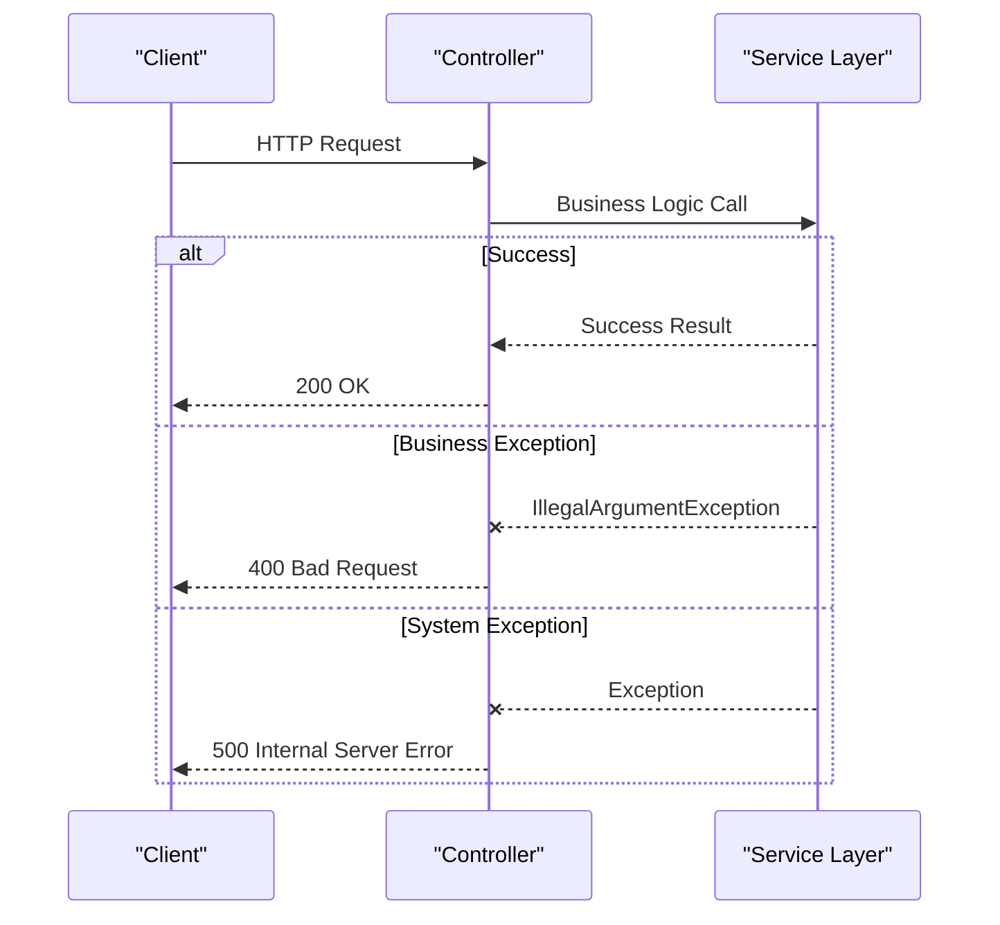
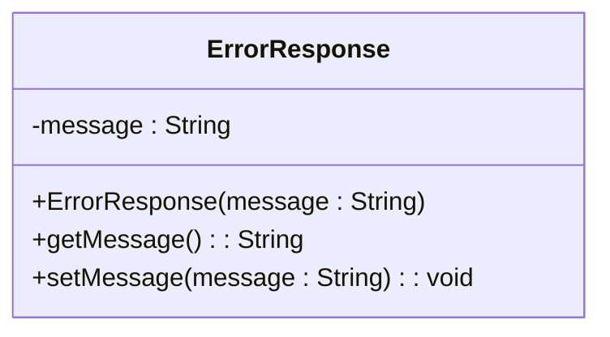
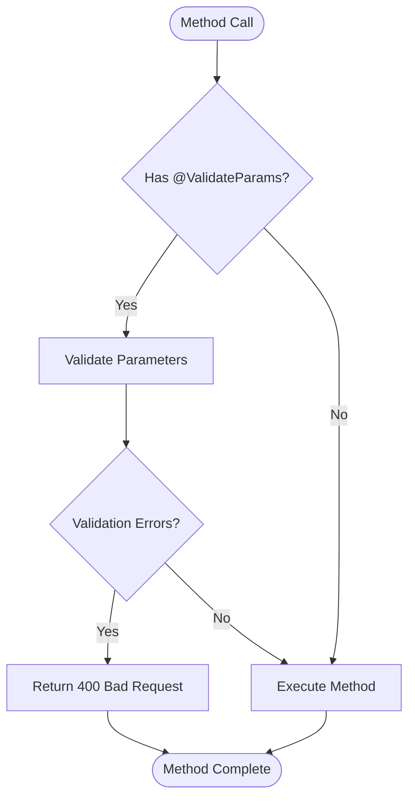
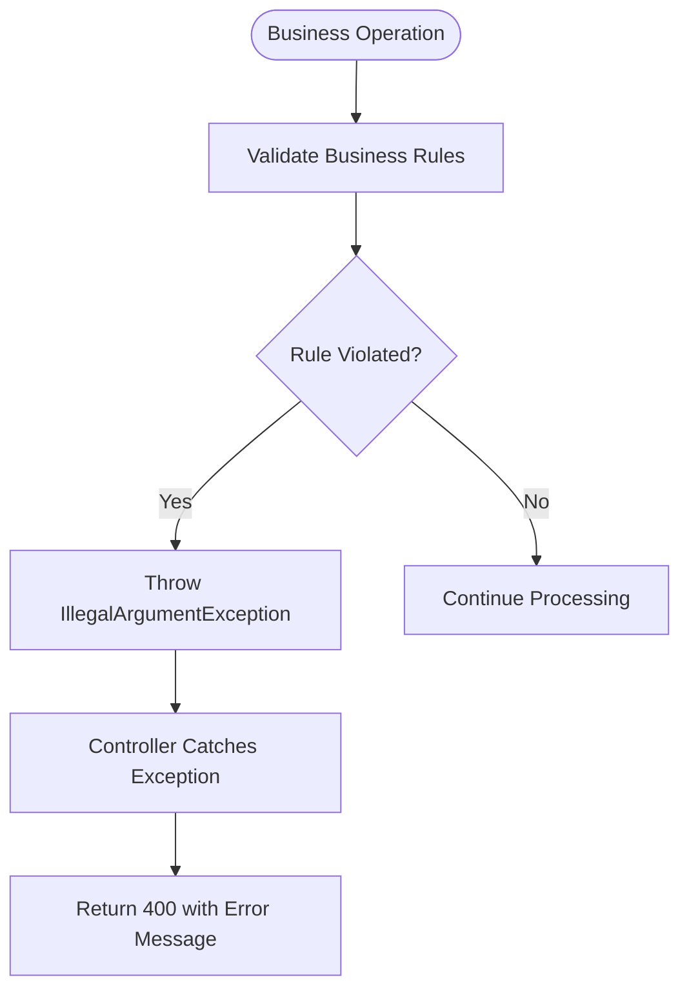
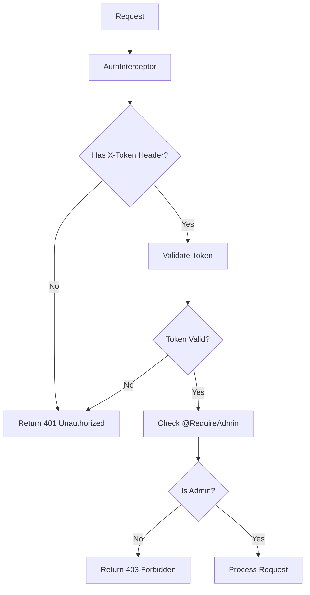

# Error Handling & Logging

<cite>
**Referenced Files in This Document**   
- [ErrorResponse.java](file://src/main/java/com/example/onlinestore/dto/ErrorResponse.java)
- [AuthController.java](file://src/main/java/com/example/onlinestore/controller/AuthController.java)
- [ProductController.java](file://src/main/java/com/example/onlinestore/controller/ProductController.java)
- [UserController.java](file://src/main/java/com/example/onlinestore/controller/UserController.java)
- [ValidationAspect.java](file://src/main/java/com/example/onlinestore/aspect/ValidationAspect.java)
- [AdminAuthAspect.java](file://src/main/java/com/example/onlinestore/aspect/AdminAuthAspect.java)
- [AuthInterceptor.java](file://src/main/java/com/example/onlinestore/interceptor/AuthInterceptor.java)
- [messages.properties](file://src/main/resources/i18n/messages.properties)
- [messages_zh_CN.properties](file://src/main/resources/i18n/messages_zh_CN.properties)
</cite>

## Table of Contents
1. [Introduction](#introduction)
2. [Centralized Exception Handling](#centralized-exception-handling)
3. [ErrorResponse DTO Structure](#errorresponse-dto-structure)
4. [Logging Levels and Usage](#logging-levels-and-usage)
5. [Validation and Business Logic Error Handling](#validation-and-business-logic-error-handling)
6. [Interpreting Log Messages](#interpreting-log-messages)
7. [Error Message Design Best Practices](#error-message-design-best-practices)
8. [Security Considerations](#security-considerations)

## Introduction
The online-store application implements a comprehensive error handling and logging strategy to ensure robustness, maintainability, and security. This document details the mechanisms used for centralized exception handling, error response formatting, logging practices, and security considerations across the application's controllers and supporting components.

## Centralized Exception Handling
The application employs a centralized exception handling pattern using try-catch blocks within controller methods to manage different types of exceptions and provide appropriate HTTP responses.



**Diagram sources**
- [AuthController.java](file://src/main/java/com/example/onlinestore/controller/AuthController.java#L31-L44)
- [ProductController.java](file://src/main/java/com/example/onlinestore/controller/ProductController.java#L40-L53)

**Section sources**
- [AuthController.java](file://src/main/java/com/example/onlinestore/controller/AuthController.java#L31-L44)
- [ProductController.java](file://src/main/java/com/example/onlinestore/controller/ProductController.java#L40-L53)
- [UserController.java](file://src/main/java/com/example/onlinestore/controller/UserController.java#L45-L64)

## ErrorResponse DTO Structure
The ErrorResponse class serves as a standardized data transfer object for conveying error information to clients in a consistent format.



**Diagram sources**
- [ErrorResponse.java](file://src/main/java/com/example/onlinestore/dto/ErrorResponse.java#L3-L16)

**Section sources**
- [ErrorResponse.java](file://src/main/java/com/example/onlinestore/dto/ErrorResponse.java#L3-L16)
- [ProductController.java](file://src/main/java/com/example/onlinestore/controller/ProductController.java#L47)
- [UserController.java](file://src/main/java/com/example/onlinestore/controller/UserController.java#L58)

## Logging Levels and Usage
The application utilizes different logging levels to provide appropriate context and severity information for troubleshooting and monitoring purposes.

### DEBUG Level
Used for detailed information about application flow and parameter values during normal execution.

```java
logger.debug("开始创建商品，请求参数：{}", request);
```

### WARN Level
Indicates potential issues or expected error conditions that don't prevent application functionality.

```java
logger.warn("创建商品失败：{}", e.getMessage());
```

### ERROR Level
Records unexpected errors or system failures that require attention.

```java
logger.error("创建商品失败：{}", e.getMessage(), e);
```

**Section sources**
- [ProductController.java](file://src/main/java/com/example/onlinestore/controller/ProductController.java#L41-L49)
- [UserController.java](file://src/main/java/com/example/onlinestore/controller/UserController.java#L46-L52)
- [AuthController.java](file://src/main/java/com/example/onlinestore/controller/AuthController.java#L36-L40)

## Validation and Business Logic Error Handling
The application differentiates between validation errors, business logic exceptions, and system errors, handling each appropriately.

### Validation Error Handling
Validation is performed using the @ValidateParams annotation and ValidationAspect, which intercepts method calls and validates parameters using JSR-303.



**Diagram sources**
- [ValidationAspect.java](file://src/main/java/com/example/onlinestore/aspect/ValidationAspect.java#L54-L78)

**Section sources**
- [ValidationAspect.java](file://src/main/java/com/example/onlinestore/aspect/ValidationAspect.java#L54-L78)
- [ProductController.java](file://src/main/java/com/example/onlinestore/controller/ProductController.java#L37)
- [UserController.java](file://src/main/java/com/example/onlinestore/controller/UserController.java#L43)

### Business Logic Exception Handling
Business logic exceptions are typically represented by IllegalArgumentException and result in 400 Bad Request responses with user-friendly error messages.



**Diagram sources**
- [AuthController.java](file://src/main/java/com/example/onlinestore/controller/AuthController.java#L34-L38)

**Section sources**
- [AuthController.java](file://src/main/java/com/example/onlinestore/controller/AuthController.java#L34-L38)
- [AdminAuthAspect.java](file://src/main/java/com/example/onlinestore/aspect/AdminAuthAspect.java#L59-L66)

## Interpreting Log Messages
Log messages follow a consistent pattern that aids in troubleshooting and understanding application behavior.

### Log Message Structure
- **DEBUG**: Detailed flow information with parameter values
- **WARN**: Warning about expected error conditions
- **ERROR**: Full stack trace for unexpected failures

### Example Log Patterns
```
DEBUG: 开始查询用户列表，请求参数：UserPageRequest{pageNum=1, pageSize=10}
WARN: 查询商品列表失败：页码必须大于等于1
ERROR: 系统错误: java.lang.NullPointerException
```

**Section sources**
- [ProductController.java](file://src/main/java/com/example/onlinestore/controller/ProductController.java#L41-L49)
- [UserController.java](file://src/main/java/com/example/onlinestore/controller/UserController.java#L46-L53)
- [AuthController.java](file://src/main/java/com/example/onlinestore/controller/AuthController.java#L36-L40)

## Error Message Design Best Practices
The application follows best practices for designing error messages that balance user experience with security.

### User-Friendly Messages
Error messages presented to users are clear and actionable, avoiding technical jargon.

### Internal Logging Details
Internal logs contain detailed technical information for debugging, while user responses remain generic.

### Internationalization
Error messages are localized using MessageSource and properties files for different languages.

```properties
# English messages
error.system.internal=Internal server error
error.invalid.credentials=Invalid username or password

# Chinese messages
error.system.internal=系统内部错误
error.invalid.credentials=用户名或密码错误
```

**Section sources**
- [messages.properties](file://src/main/resources/i18n/messages.properties#L2-L5)
- [messages_zh_CN.properties](file://src/main/resources/i18n/messages_zh_CN.properties#L2-L5)
- [AuthController.java](file://src/main/java/com/example/onlinestore/controller/AuthController.java#L42)
- [ProductController.java](file://src/main/java/com/example/onlinestore/controller/ProductController.java#L51)

## Security Considerations
The application implements several security measures in its error handling to prevent information leakage.

### Information Leakage Prevention
System errors return generic messages to clients while detailed information is logged internally.

### Authentication and Authorization Errors
Authentication failures (401) and authorization failures (403) are handled by AuthInterceptor and AdminAuthAspect respectively.



**Diagram sources**
- [AuthInterceptor.java](file://src/main/java/com/example/onlinestore/interceptor/AuthInterceptor.java#L24-L43)
- [AdminAuthAspect.java](file://src/main/java/com/example/onlinestore/aspect/AdminAuthAspect.java#L54-L70)

**Section sources**
- [AuthInterceptor.java](file://src/main/java/com/example/onlinestore/interceptor/AuthInterceptor.java#L24-L43)
- [AdminAuthAspect.java](file://src/main/java/com/example/onlinestore/aspect/AdminAuthAspect.java#L54-L70)
- [messages.properties](file://src/main/resources/i18n/messages.properties#L3-L5)