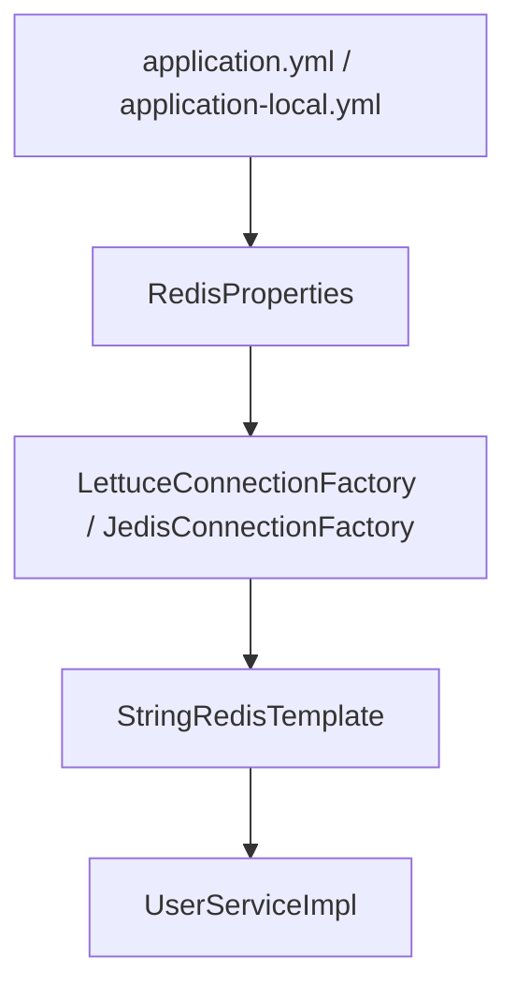
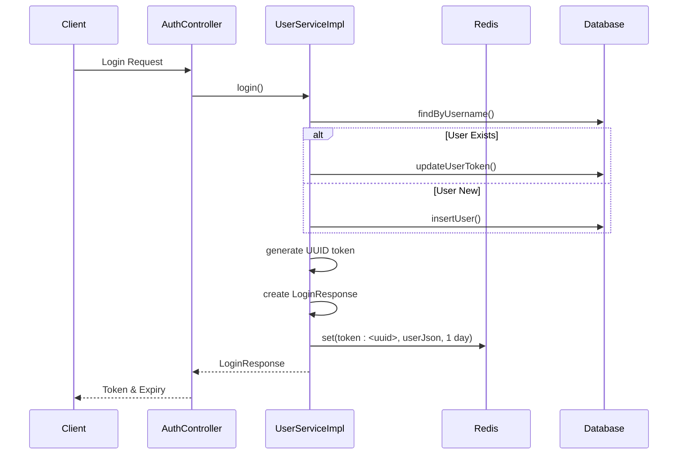

# Caching (Redis)

<cite>
**Referenced Files in This Document**   
- [RedisConfig.java](file://src/main/java/com/example/onlinestore/config/RedisConfig.java)
- [UserServiceImpl.java](file://src/main/java/com/example/onlinestore/service/impl/UserServiceImpl.java)
- [application.yml](file://src/main/resources/application.yml)
- [application-local.yml](file://src/main/resources/application-local.yml)
- [pom.xml](file://pom.xml)
- [UserMapper.java](file://src/main/java/com/example/onlinestore/mapper/UserMapper.java)
</cite>

## Table of Contents
1. [Introduction](#introduction)
2. [Redis Configuration and Connection Setup](#redis-configuration-and-connection-setup)
3. [StringRedisTemplate and Serialization Strategy](#stringredistemplate-and-serialization-strategy)
4. [Cache Key Naming Conventions](#cache-key-naming-conventions)
5. [Token Management in UserServiceImpl](#token-management-in-userserviceimpl)
6. [Connection Pool Configuration](#connection-pool-configuration)
7. [Error Handling and Failure Fallbacks](#error-handling-and-failure-fallbacks)
8. [Cache Invalidation and Data Consistency](#cache-invalidation-and-data-consistency)
9. [Monitoring and Performance Best Practices](#monitoring-and-performance-best-practices)
10. [Security Considerations](#security-considerations)
11. [Troubleshooting Common Issues](#troubleshooting-common-issues)

## Introduction
The online-store application integrates Redis as a distributed caching layer to enhance performance and scalability, particularly for user session and token management. This document details the Redis integration architecture, configuration, usage patterns, and operational best practices. The implementation leverages Spring Data Redis with Jedis as the client driver, focusing on token caching with time-to-live (TTL) policies, connection pooling, and fault-tolerant design.

## Redis Configuration and Connection Setup
Redis is configured through Spring Boot's auto-configuration mechanism, with connection parameters defined in YAML configuration files. The application uses `application.yml` and profile-specific `application-local.yml` to define Redis host, port, database index, and connection pool settings. The Redis connection factory is automatically created by Spring Boot based on these properties, enabling seamless integration with Spring Data Redis components.

**Diagram sources**
- [application.yml](file://src/main/resources/application.yml#L23-L34)
- [application-local.yml](file://src/main/resources/application-local.yml#L7-L18)

**Section sources**
- [application.yml](file://src/main/resources/application.yml#L23-L34)
- [application-local.yml](file://src/main/resources/application-local.yml#L7-L18)

## StringRedisTemplate and Serialization Strategy
The application uses `StringRedisTemplate` for Redis operations, which is configured as a Spring bean in `RedisConfig`. This template is specifically designed for string-keyed operations and uses default serialization strategies: UTF-8 encoded strings for keys and JDK serialization for values. In the implementation, however, JSON serialization via Jackson's `ObjectMapper` is used for value serialization instead of JDK serialization, providing better readability and interoperability.

The `StringRedisTemplate` is injected into `UserServiceImpl` and used to store user session data as JSON strings with a defined TTL. This approach combines the simplicity of string templates with the flexibility of JSON serialization, avoiding the limitations of JDK serialization while maintaining type safety.

**Section sources**
- [RedisConfig.java](file://src/main/java/com/example/onlinestore/config/RedisConfig.java#L8-L15)
- [UserServiceImpl.java](file://src/main/java/com/example/onlinestore/service/impl/UserServiceImpl.java#L62)

## Cache Key Naming Conventions
The application follows a consistent cache key naming convention using prefixes to namespace different types of cached data. For token storage, the prefix `token:` is used, followed by the actual token value. This pattern (`{domain}:{identifier}`) improves cache organization, enables targeted cache invalidation, and prevents key collisions across different data types.

This naming strategy also facilitates operational tasks such as cache inspection, cleanup, and monitoring, as keys can be easily identified and grouped by their prefixes. The prefix is defined as a static constant `TOKEN_PREFIX` in `UserServiceImpl`, ensuring consistency across all token-related operations.

**Section sources**
- [UserServiceImpl.java](file://src/main/java/com/example/onlinestore/service/impl/UserServiceImpl.java#L52)

## Token Management in UserServiceImpl
The `UserServiceImpl` class implements token-based authentication with Redis-backed session storage. Upon successful login, a UUID token is generated and associated with the user's data, which is then serialized to JSON and stored in Redis with a TTL of 1 day. The `createLoginResponse` method handles this process, storing the complete user object to avoid database round-trips during subsequent requests.

The `getUserByToken` method retrieves user data from Redis, deserializing the JSON string back to a `User` object. If the key is not found (indicating an expired or invalid token), the method returns null, triggering authentication renewal. This implementation provides a stateless yet efficient session management system with automatic expiration.

**Diagram sources**
- [UserServiceImpl.java](file://src/main/java/com/example/onlinestore/service/impl/UserServiceImpl.java#L68-L138)
- [UserMapper.java](file://src/main/java/com/example/onlinestore/mapper/UserMapper.java#L12)

**Section sources**
- [UserServiceImpl.java](file://src/main/java/com/example/onlinestore/service/impl/UserServiceImpl.java#L68-L192)

## Connection Pool Configuration
The application configures a Jedis connection pool through Spring Boot properties, with settings defined in both `application.yml` and `application-local.yml`. The pool configuration includes:
- `max-active`: 8 (maximum number of active connections)
- `max-idle`: 8 (maximum number of idle connections)
- `min-idle`: 0 (minimum number of idle connections)
- `max-wait`: -1ms (indefinite wait for connection)

This configuration balances resource utilization and performance, allowing up to 8 concurrent Redis operations while minimizing connection overhead. The use of connection pooling improves throughput and reduces latency by reusing established connections rather than creating new ones for each operation.

**Section sources**
- [application.yml](file://src/main/resources/application.yml#L28-L34)
- [application-local.yml](file://src/main/resources/application-local.yml#L13-L18)

## Error Handling and Failure Fallbacks
The Redis integration includes robust error handling to maintain application availability during Redis failures. In the `createLoginResponse` method, Redis operations are wrapped in try-catch blocks that log errors but do not interrupt the login flow. If Redis storage fails, the application continues with database-persisted token information, treating Redis as a non-critical caching layer rather than a primary data store.

This fail-soft approach ensures that temporary Redis outages or network issues do not prevent user authentication. The application prioritizes availability over cache consistency, allowing it to degrade gracefully when the caching layer is unavailable. Error logging provides visibility into Redis issues without exposing sensitive information to clients.

**Section sources**
- [UserServiceImpl.java](file://src/main/java/com/example/onlinestore/service/impl/UserServiceImpl.java#L123-L132)

## Cache Invalidation and Data Consistency
The application relies primarily on TTL-based cache invalidation rather than explicit deletion. Tokens automatically expire after 1 day, ensuring eventual consistency between the cache and database. When user data is updated, the application updates both the database and Redis cache synchronously within the same transactional context, minimizing the window for inconsistency.

This write-through pattern ensures that cached data is updated immediately upon changes, while the TTL provides a safety mechanism to clear stale data if updates are missed. The application does not implement complex cache invalidation strategies, as the data volume and update frequency do not warrant the added complexity.

**Section sources**
- [UserServiceImpl.java](file://src/main/java/com/example/onlinestore/service/impl/UserServiceImpl.java#L103-L120)

## Monitoring and Performance Best Practices
While the current implementation lacks built-in Redis monitoring, best practices suggest implementing metrics collection for cache hit/miss ratios, operation latency, and memory usage. The connection pool settings should be tuned based on actual usage patterns, and Redis memory usage should be monitored to prevent out-of-memory conditions.

For performance optimization, consider using Redis pipelining for batch operations and evaluating the use of Redis Cluster for horizontal scaling. The JSON serialization approach, while readable, adds CPU overhead compared to binary formats; this trade-off should be evaluated based on performance requirements.

**Section sources**
- [application.yml](file://src/main/resources/application.yml#L28-L34)
- [UserServiceImpl.java](file://src/main/java/com/example/onlinestore/service/impl/UserServiceImpl.java#L126-L127)

## Security Considerations
The current configuration does not enable Redis authentication, as the password field is empty in the configuration files. In production environments, Redis should be secured with a strong password and ideally deployed within a private network segment, not exposed to external networks. The application connects to Redis over the default port (6379) without SSL/TLS encryption, which is acceptable only in trusted internal networks.

Best practices recommend configuring Redis with authentication, binding to internal interfaces only, and potentially using SSL/TLS for data in transit. The application should also validate and sanitize any user input that influences Redis keys to prevent injection attacks, though the current implementation uses UUIDs which are safe from such attacks.

**Section sources**
- [application.yml](file://src/main/resources/application.yml#L26-L27)
- [application-local.yml](file://src/main/resources/application-local.yml#L11-L12)

## Troubleshooting Common Issues
Common Redis issues in this application may include:
- **Connection timeouts**: Verify Redis server availability and network connectivity; check firewall rules for port 6379
- **Serialization mismatches**: Ensure consistent JSON serialization/deserialization between services; verify Jackson configuration
- **Memory exhaustion**: Monitor Redis memory usage; consider adjusting TTL or implementing LRU eviction policies
- **Cache misses**: Verify key naming consistency; check TTL settings; ensure clock synchronization between application and Redis servers

When troubleshooting, examine application logs for Redis-related error messages, use Redis CLI to inspect keys and memory usage, and verify connection pool metrics to identify resource bottlenecks.

**Section sources**
- [UserServiceImpl.java](file://src/main/java/com/example/onlinestore/service/impl/UserServiceImpl.java#L129-L131)
- [application.yml](file://src/main/resources/application.yml#L24-L25)