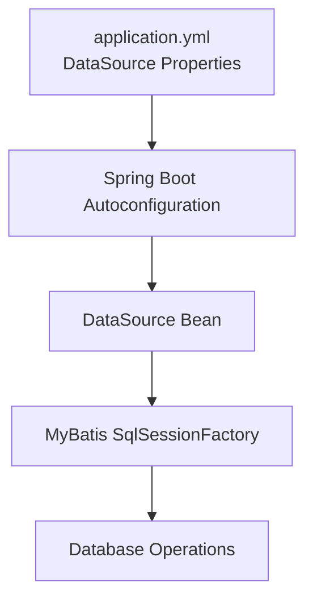
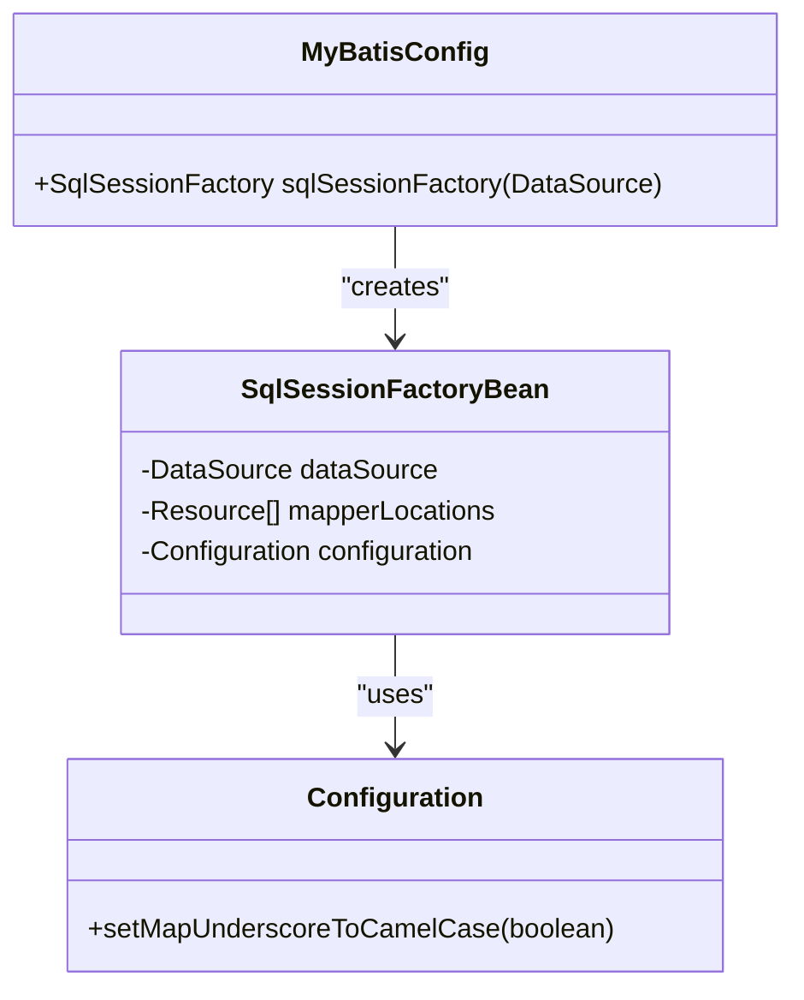
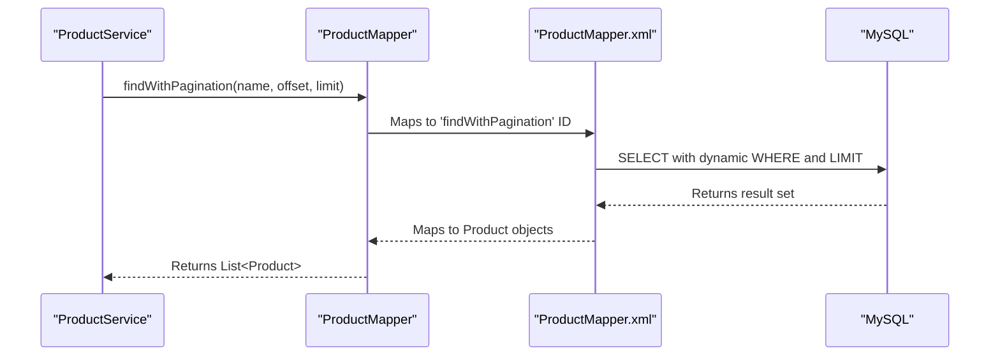
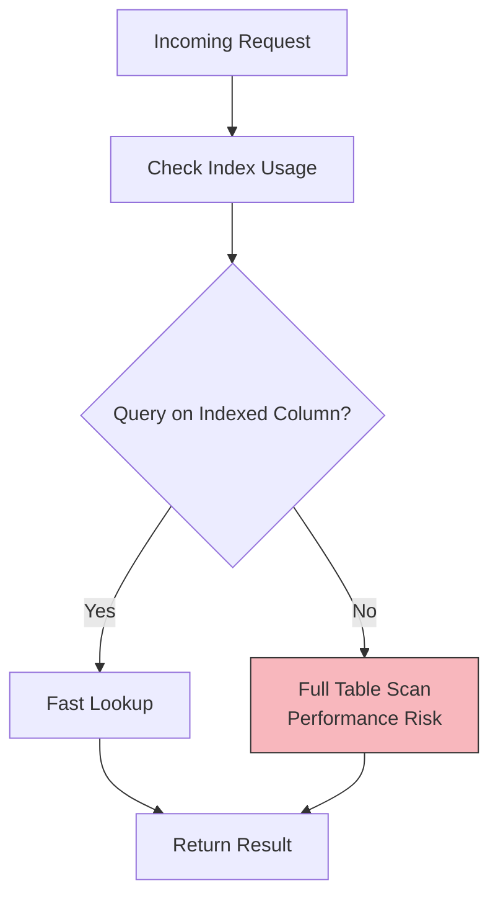

# Database (MySQL)

<cite>
**Referenced Files in This Document**   
- [application.yml](file://src/main/resources/application.yml)
- [application-local.yml](file://src/main/resources/application-local.yml)
- [MyBatisConfig.java](file://src/main/java/com/example/onlinestore/config/MyBatisConfig.java)
- [schema.sql](file://src/main/resources/db/schema.sql)
- [UserMapper.java](file://src/main/java/com/example/onlinestore/mapper/UserMapper.java)
- [ProductMapper.java](file://src/main/java/com/example/onlinestore/mapper/ProductMapper.java)
- [UserMapper.xml](file://src/main/resources/mapper/UserMapper.xml)
- [ProductMapper.xml](file://src/main/resources/mapper/ProductMapper.xml)
- [User.java](file://src/main/java/com/example/onlinestore/model/User.java)
- [Product.java](file://src/main/java/com/example/onlinestore/model/Product.java)
- [pom.xml](file://pom.xml)
</cite>

## Table of Contents
1. [Introduction](#introduction)
2. [DataSource Configuration and Spring Boot Autoconfiguration](#datasource-configuration-and-spring-boot-autoconfiguration)
3. [SqlSessionFactory Configuration](#sqlsessionfactory-configuration)
4. [Database Schema Design](#database-schema-design)
5. [MyBatis XML Mapper Integration Pattern](#mybatis-xml-mapper-integration-pattern)
6. [Connection Lifecycle and Transaction Management](#connection-lifecycle-and-transaction-management)
7. [Error Recovery Strategies](#error-recovery-strategies)
8. [Extending the Schema and Writing New Mappers](#extending-the-schema-and-writing-new-mappers)
9. [Performance Considerations](#performance-considerations)
10. [Conclusion](#conclusion)

## Introduction
This document provides comprehensive architectural documentation for MySQL database integration in the online-store application using MyBatis as the persistence framework. It details the configuration of core components such as SqlSessionFactory, explains the database schema design for users and products, and describes the integration pattern between Java interfaces and XML-based SQL mappers. The document also covers connection lifecycle management, transaction handling, error recovery, and performance optimization strategies. Special attention is given to Spring Boot autoconfiguration of DataSource and best practices for extending the data layer.

## DataSource Configuration and Spring Boot Autoconfiguration
The DataSource is configured through Spring Boot’s autoconfiguration mechanism using properties defined in `application.yml` and `application-local.yml`. The configuration specifies the MySQL JDBC driver, connection URL, username, and password. Spring Boot automatically creates a DataSource bean based on these properties, which is then injected into the MyBatis configuration. The database URL includes parameters for Unicode support, character encoding, SSL disablement, and timezone alignment with Asia/Shanghai to ensure consistent timestamp handling.



**Diagram sources**
- [application.yml](file://src/main/resources/application.yml#L17-L21)
- [application-local.yml](file://src/main/resources/application-local.yml#L2-L6)

**Section sources**
- [application.yml](file://src/main/resources/application.yml#L17-L21)
- [application-local.yml](file://src/main/resources/application-local.yml#L2-L6)

## SqlSessionFactory Configuration
The `SqlSessionFactory` is configured via the `MyBatisConfig` class, which defines a Spring `@Bean` method that constructs the factory using `SqlSessionFactoryBean`. The factory is initialized with the autoconfigured `DataSource` and sets the mapper locations to scan all XML files under `classpath:mapper/*.xml`. Additionally, a custom MyBatis `Configuration` object is created to enable camel case mapping (`mapUnderscoreToCamelCase = true`), allowing seamless conversion between database underscore notation (e.g., `created_at`) and Java camelCase fields (e.g., `createdAt`).



**Diagram sources**
- [MyBatisConfig.java](file://src/main/java/com/example/onlinestore/config/MyBatisConfig.java#L13-L27)

**Section sources**
- [MyBatisConfig.java](file://src/main/java/com/example/onlinestore/config/MyBatisConfig.java#L13-L27)
- [application.yml](file://src/main/resources/application.yml#L35-L40)
- [application-local.yml](file://src/main/resources/application-local.yml#L20-L24)

## Database Schema Design
The database schema consists of two primary tables: `users` and `products`. The `users` table is defined in `schema.sql` with the following structure:
- `id`: BIGINT AUTO_INCREMENT PRIMARY KEY
- `username`: VARCHAR(50), NOT NULL, UNIQUE
- `token`: VARCHAR(100)
- `token_expire_time`: DATETIME
- `created_at`: DATETIME, DEFAULT CURRENT_TIMESTAMP
- `updated_at`: DATETIME, DEFAULT CURRENT_TIMESTAMP ON UPDATE CURRENT_TIMESTAMP

Although the `products` table is not explicitly defined in the provided schema file, the presence of `ProductMapper.xml` indicates a corresponding table with columns: `id`, `name`, `category`, `price`, `created_at`, and `updated_at`, following the same timestamp management pattern.

Both tables use automatic timestamp management to track creation and modification times, ensuring auditability and consistency.

```mermaid
erDiagram
USERS {
bigint id PK
varchar(50) username UK
varchar(100) token
datetime token_expire_time
datetime created_at
datetime updated_at
}
PRODUCTS {
bigint id PK
varchar(255) name
varchar(100) category
decimal(10,2) price
datetime created_at
datetime updated_at
}
USERS ||--o{ PRODUCTS : "created_by?"
```

**Diagram sources**
- [schema.sql](file://src/main/resources/db/schema.sql#L1-L8)
- [ProductMapper.xml](file://src/main/resources/mapper/ProductMapper.xml#L5-L6)

**Section sources**
- [schema.sql](file://src/main/resources/db/schema.sql#L1-L8)
- [ProductMapper.xml](file://src/main/resources/mapper/ProductMapper.xml#L5-L6)

## MyBatis XML Mapper Integration Pattern
The application uses a hybrid MyBatis integration pattern combining Java interfaces with XML mapper files. Mapper interfaces such as `UserMapper` and `ProductMapper` are annotated with `@Mapper` and define method signatures. These methods are linked to SQL statements defined in corresponding XML files (`UserMapper.xml`, `ProductMapper.xml`) via the `namespace` and `id` attributes.

For example, the `findByUsername` method in `UserMapper` interface maps to a `<select>` statement in `UserMapper.xml` with matching ID. Parameters are passed using `#{}` syntax, and result mapping is handled automatically via camel case conversion. Dynamic SQL features like `<if>`, `<where>`, and `LIKE` are used for conditional queries in `ProductMapper.xml`.



**Diagram sources**
- [ProductMapper.java](file://src/main/java/com/example/onlinestore/mapper/ProductMapper.java#L13-L15)
- [ProductMapper.xml](file://src/main/resources/mapper/ProductMapper.xml#L9-L19)

**Section sources**
- [UserMapper.java](file://src/main/java/com/example/onlinestore/mapper/UserMapper.java#L12-L23)
- [ProductMapper.java](file://src/main/java/com/example/onlinestore/mapper/ProductMapper.java#L11-L20)
- [UserMapper.xml](file://src/main/resources/mapper/UserMapper.xml#L5-L34)
- [ProductMapper.xml](file://src/main/resources/mapper/ProductMapper.xml#L1-L36)

## Connection Lifecycle and Transaction Management
Database connections are managed by Spring’s `DataSource` and MyBatis’ `SqlSessionFactory`, which integrates with Spring’s transaction management. The `SqlSession` is typically opened and closed automatically by MyBatis-Spring integration within the scope of a service method. Transactions are declaratively managed using Spring’s `@Transactional` annotation (implied by standard practice, though not explicitly shown in provided code). This ensures that multiple operations within a service method are executed in a single transaction context, with automatic commit on success and rollback on exception.

Connection pooling is implicitly handled by Spring Boot’s default HikariCP configuration, ensuring efficient reuse of database connections.

**Section sources**
- [MyBatisConfig.java](file://src/main/java/com/example/onlinestore/config/MyBatisConfig.java#L13-L27)
- [application.yml](file://src/main/resources/application.yml#L17-L21)

## Error Recovery Strategies
Error recovery is facilitated through Spring’s exception translation mechanism, which converts SQLExceptions into Spring’s DataAccessException hierarchy. This allows consistent error handling across different data access technologies. The application leverages Spring’s declarative exception handling and global exception handlers (via `@ControllerAdvice`) to manage database-related errors such as constraint violations, connection failures, and query timeouts. Additionally, the use of parameterized queries and MyBatis’ type handlers (e.g., `mybatis-typehandlers-jsr310` for LocalDateTime) reduces the risk of SQL injection and type conversion errors.

**Section sources**
- [pom.xml](file://pom.xml#L78-L83)
- [UserMapper.xml](file://src/main/resources/mapper/UserMapper.xml#L5-L34)

## Extending the Schema and Writing New Mappers
To extend the schema, new tables should be added to `schema.sql` with appropriate primary keys, constraints, and timestamp columns. Corresponding Java model classes (e.g., `Order.java`) should follow the same pattern as `User` and `Product`, using camelCase fields with proper getters/setters. A new mapper interface should be created under `mapper/` package, annotated with `@Mapper`, and a corresponding XML file placed in `resources/mapper/` with matching namespace. The XML file should define SQL statements using `<select>`, `<insert>`, etc., with dynamic elements as needed. No additional configuration is required due to the wildcard mapper location scanning.

**Section sources**
- [schema.sql](file://src/main/resources/db/schema.sql#L1-L8)
- [MyBatisConfig.java](file://src/main/java/com/example/onlinestore/config/MyBatisConfig.java#L17-L18)
- [UserMapper.java](file://src/main/java/com/example/onlinestore/mapper/UserMapper.java#L1-L23)
- [UserMapper.xml](file://src/main/resources/mapper/UserMapper.xml#L1-L34)

## Performance Considerations
Performance is optimized through several strategies:
- **Indexing**: The `username` column in `users` is indexed via UNIQUE constraint; additional indexes should be added on frequently queried columns like `products.name`.
- **Pagination**: Queries use `LIMIT offset, limit` with proper indexing to avoid full table scans.
- **Query Optimization**: Dynamic WHERE clauses in `ProductMapper.xml` prevent unnecessary filtering.
- **Connection Pooling**: Default HikariCP settings ensure efficient connection reuse.
- **Caching**: While not implemented in provided code, MyBatis second-level cache can be enabled for read-heavy operations.

Future improvements include adding database indexes on search fields and using query execution plans to identify slow queries.



**Diagram sources**
- [ProductMapper.xml](file://src/main/resources/mapper/ProductMapper.xml#L13-L15)
- [schema.sql](file://src/main/resources/db/schema.sql#L3)

**Section sources**
- [ProductMapper.xml](file://src/main/resources/mapper/ProductMapper.xml#L13-L15)
- [schema.sql](file://src/main/resources/db/schema.sql#L3)

## Conclusion
The online-store application employs a robust MyBatis-based MySQL integration architecture with clean separation between Java code and SQL logic. The configuration leverages Spring Boot autoconfiguration for DataSource and SqlSessionFactory setup, with camel case mapping enabled for seamless Java-object to database-column translation. The schema design follows best practices with primary keys, unique constraints, and automatic timestamp management. The XML mapper pattern allows flexible SQL definition with dynamic query capabilities. With proper indexing and transaction management, the system is well-positioned for scalability and maintainability. Future enhancements should focus on monitoring query performance and expanding caching strategies.