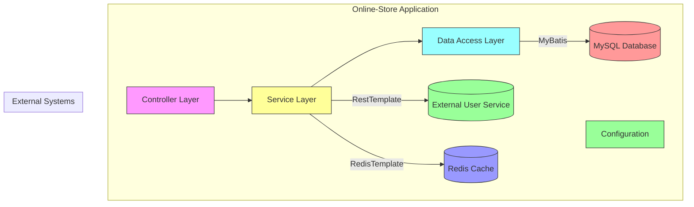
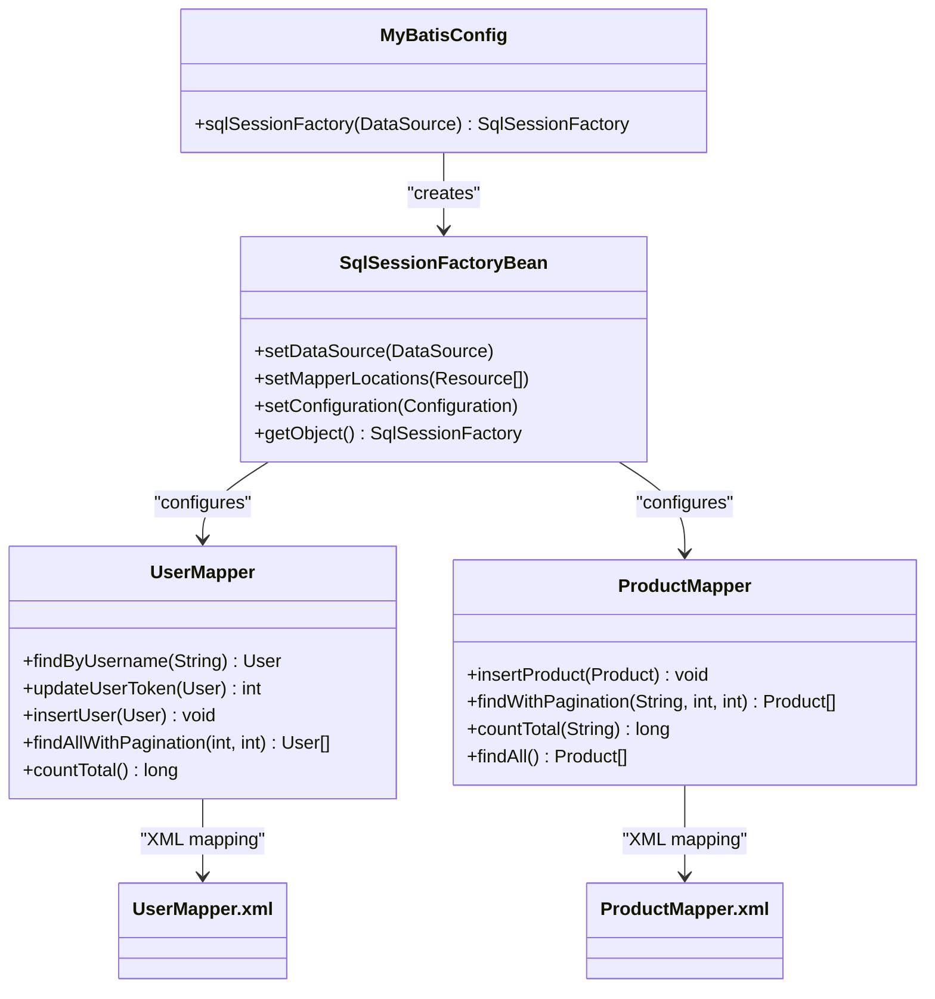
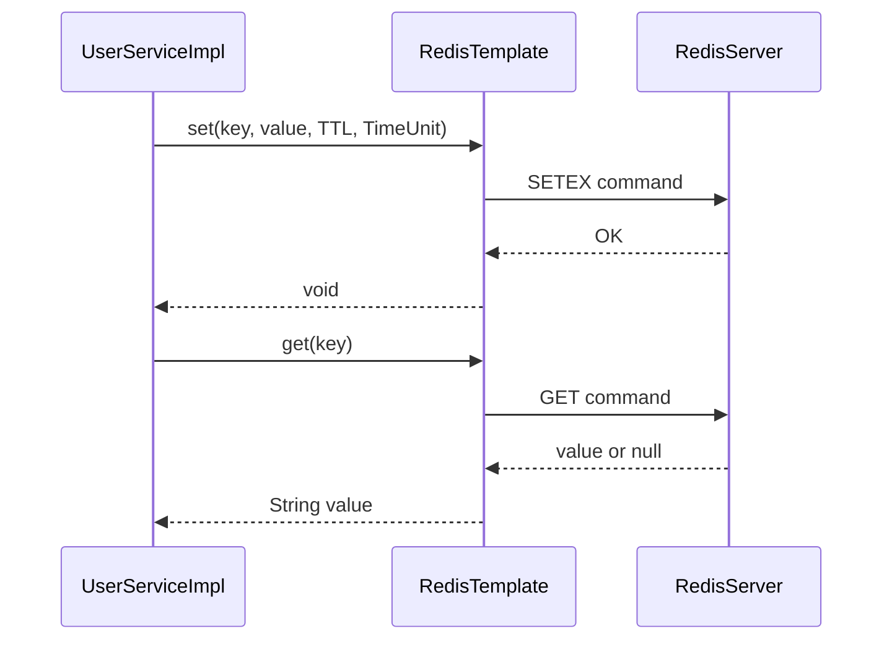
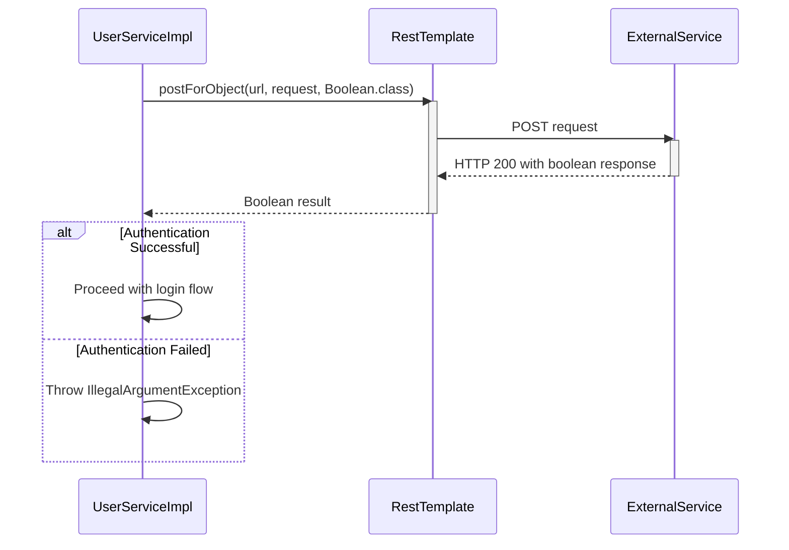
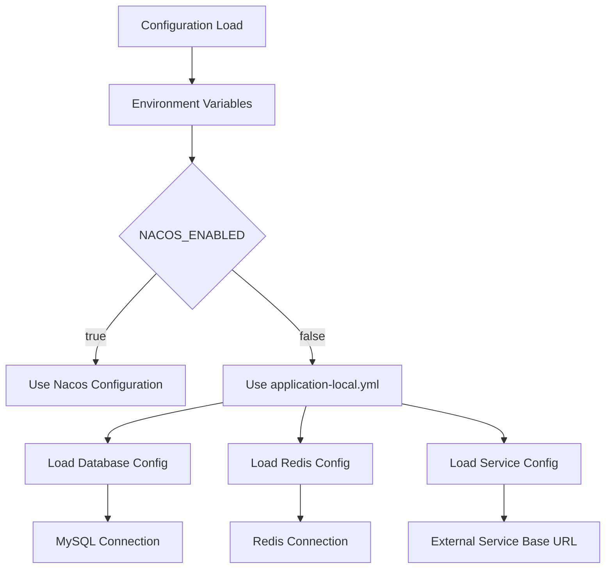
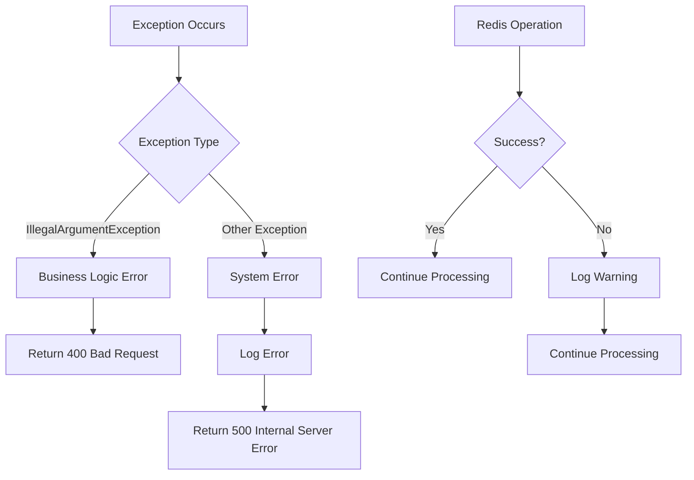
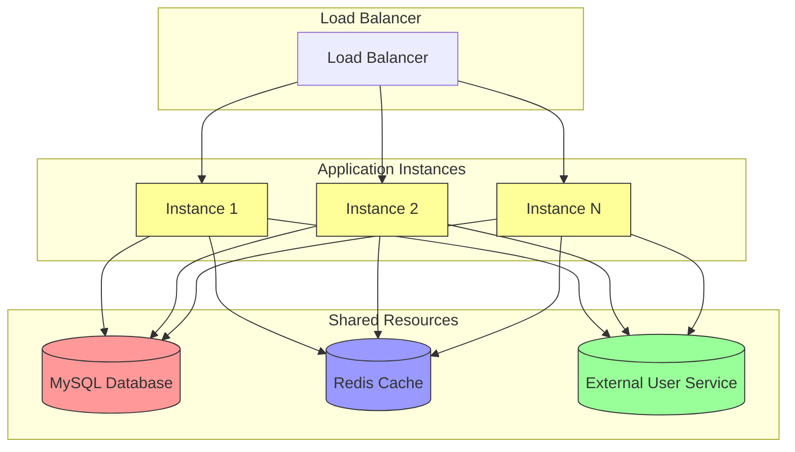

# External Integrations

<cite>
**Referenced Files in This Document**   
- [MyBatisConfig.java](file://src/main/java/com/example/onlinestore/config/MyBatisConfig.java)
- [RedisConfig.java](file://src/main/java/com/example/onlinestore/config/RedisConfig.java)
- [RestTemplateConfig.java](file://src/main/java/com/example/onlinestore/config/RestTemplateConfig.java)
- [application.yml](file://src/main/resources/application.yml)
- [schema.sql](file://src/main/resources/db/schema.sql)
- [UserServiceImpl.java](file://src/main/java/com/example/onlinestore/service/impl/UserServiceImpl.java)
- [ProductServiceImpl.java](file://src/main/java/com/example/onlinestore/service/impl/ProductServiceImpl.java)
- [UserMapper.java](file://src/main/java/com/example/onlinestore/mapper/UserMapper.java)
- [UserMapper.xml](file://src/main/resources/mapper/UserMapper.xml)
- [ProductMapper.xml](file://src/main/resources/mapper/ProductMapper.xml)
- [pom.xml](file://pom.xml)
</cite>

## Table of Contents
1. [Introduction](#introduction)
2. [Integration Architecture Overview](#integration-architecture-overview)
3. [MySQL Integration via MyBatis](#mysql-integration-via-mybatis)
4. [Redis Caching Integration](#redis-caching-integration)
5. [External Service Integration via RestTemplate](#external-service-integration-via-resttemplate)
6. [Database Schema and Initialization](#database-schema-and-initialization)
7. [Infrastructure Requirements and Configuration](#infrastructure-requirements-and-configuration)
8. [Error Handling and Failure Recovery](#error-handling-and-failure-recovery)
9. [Scalability and Performance Considerations](#scalability-and-performance-considerations)
10. [Version Compatibility and Upgrade Paths](#version-compatibility-and-upgrade-paths)

## Introduction
The online-store application implements a comprehensive integration architecture that connects with external systems including MySQL for persistent data storage, Redis for caching, and external services through RESTful APIs. This documentation provides a detailed analysis of the integration patterns, configuration strategies, and operational considerations for these external dependencies. The system follows a microservices-inspired architecture with local configuration management and external service communication capabilities.

## Integration Architecture Overview



**Diagram sources**
- [MyBatisConfig.java](file://src/main/java/com/example/onlinestore/config/MyBatisConfig.java)
- [RedisConfig.java](file://src/main/java/com/example/onlinestore/config/RedisConfig.java)
- [RestTemplateConfig.java](file://src/main/java/com/example/onlinestore/config/RestTemplateConfig.java)
- [UserServiceImpl.java](file://src/main/java/com/example/onlinestore/service/impl/UserServiceImpl.java)

**Section sources**
- [MyBatisConfig.java](file://src/main/java/com/example/onlinestore/config/MyBatisConfig.java)
- [RedisConfig.java](file://src/main/java/com/example/onlinestore/config/RedisConfig.java)
- [RestTemplateConfig.java](file://src/main/java/com/example/onlinestore/config/RestTemplateConfig.java)

## MySQL Integration via MyBatis

The application integrates with MySQL using MyBatis as the persistence framework, providing a flexible and efficient approach to database operations. The integration follows Spring Boot's auto-configuration patterns with custom configuration for optimal performance.

### MyBatis Configuration and Connection Management
The MyBatis configuration is implemented through the `MyBatisConfig` class, which defines the `SqlSessionFactory` bean with proper data source injection and mapper location configuration. The configuration enables camel case mapping to support the Java convention of camelCase properties with database columns in snake_case format.



**Diagram sources**
- [MyBatisConfig.java](file://src/main/java/com/example/onlinestore/config/MyBatisConfig.java)
- [UserMapper.java](file://src/main/java/com/example/onlinestore/mapper/UserMapper.java)
- [UserMapper.xml](file://src/main/resources/mapper/UserMapper.xml)
- [ProductMapper.xml](file://src/main/resources/mapper/ProductMapper.xml)

**Section sources**
- [MyBatisConfig.java](file://src/main/java/com/example/onlinestore/config/MyBatisConfig.java)
- [UserMapper.java](file://src/main/java/com/example/onlinestore/mapper/UserMapper.java)
- [UserMapper.xml](file://src/main/resources/mapper/UserMapper.xml)

### Transaction Management
The application implements declarative transaction management using Spring's `@Transactional` annotation. This ensures data consistency during operations that involve multiple database operations. The transaction management is configured at the service layer, specifically in the `UserServiceImpl` and `ProductServiceImpl` classes, where business logic that requires atomicity is implemented.

### Mapper Implementation and SQL Configuration
The data access layer uses MyBatis XML mapper files to define SQL queries, providing a clear separation between Java code and SQL statements. The mappers support parameterized queries, result mapping, and dynamic SQL construction. The `UserMapper.xml` and `ProductMapper.xml` files contain optimized SQL statements for CRUD operations with pagination support.

## Redis Caching Integration

The application leverages Redis as a distributed cache to improve performance and reduce database load. The integration is implemented using Spring Data Redis with StringRedisTemplate for simplified string-based operations.

### Redis Configuration and Connection Pooling
The Redis integration is configured through the `RedisConfig` class, which defines a `StringRedisTemplate` bean that uses the `RedisConnectionFactory`. The connection pool settings are configured in the `application.yml` file, specifying the maximum active, idle, and minimum idle connections, as well as the maximum wait time for acquiring connections from the pool.



**Diagram sources**
- [RedisConfig.java](file://src/main/java/com/example/onlinestore/config/RedisConfig.java)
- [UserServiceImpl.java](file://src/main/java/com/example/onlinestore/service/impl/UserServiceImpl.java)

**Section sources**
- [RedisConfig.java](file://src/main/java/com/example/onlinestore/config/RedisConfig.java)
- [UserServiceImpl.java](file://src/main/java/com/example/onlinestore/service/impl/UserServiceImpl.java)

### Caching Strategy and Data Serialization
The application implements a token-based caching strategy where user authentication tokens are stored in Redis with an expiration time of one day. The caching mechanism uses JSON serialization via Jackson's ObjectMapper to store complex object structures. The cache key follows the pattern `token:{token}` to ensure uniqueness and easy retrieval.

### In-Memory Caching Implementation
In addition to Redis caching, the application implements an in-memory cache for product data using a HashMap with a maximum capacity of 1,000 entries. When the cache reaches capacity, the oldest entry is removed to make space for new entries. This hybrid caching approach optimizes performance by reducing both database queries and network calls to the Redis server.

## External Service Integration via RestTemplate

The application integrates with external services using Spring's RestTemplate for HTTP communication. This enables the system to delegate authentication to a dedicated user service while maintaining its own business logic.

### RestTemplate Configuration
The RestTemplate integration is configured through the `RestTemplateConfig` class, which defines a `RestTemplate` bean. The configuration is minimal, using the default RestTemplate implementation without custom message converters or interceptors. The bean is injected into service classes that require external service communication.



**Diagram sources**
- [RestTemplateConfig.java](file://src/main/java/com/example/onlinestore/config/RestTemplateConfig.java)
- [UserServiceImpl.java](file://src/main/java/com/example/onlinestore/service/impl/UserServiceImpl.java)

**Section sources**
- [RestTemplateConfig.java](file://src/main/java/com/example/onlinestore/config/RestTemplateConfig.java)
- [UserServiceImpl.java](file://src/main/java/com/example/onlinestore/service/impl/UserServiceImpl.java)

### Service-to-Service Communication Pattern
The application implements a service-to-service communication pattern where the online-store service delegates user authentication to an external user service. This is achieved through the `login` method in `UserServiceImpl`, which constructs a request to the external authentication endpoint and processes the response. The base URL for the external service is configurable through the `service.user.base-url` property.

### Error Handling in External Service Calls
The integration includes error handling for external service calls, with proper exception handling for cases where the external service is unavailable or returns an error response. The application treats authentication failures from the external service as business logic exceptions, translating them into appropriate error responses for the client.

## Database Schema and Initialization

The application's database schema is designed to support user management functionality with a focus on authentication and session management.

### Database Schema Definition
The database schema is defined in the `schema.sql` file, which creates the `users` table with fields for user identification, authentication tokens, and timestamps. The schema includes appropriate data types, constraints, and indexes to ensure data integrity and query performance.

```mermaid
erDiagram
USERS {
bigint id PK
varchar(50) username UK
varchar(100) token
datetime token_expire_time
datetime created_at
datetime updated_at
}
PRODUCTS {
bigint id PK
varchar(255) name
varchar(100) category
decimal(10,2) price
datetime created_at
datetime updated_at
}
USERS ||--o{ AUTHENTICATION : "uses tokens"
PRODUCTS ||--o{ CATALOG : "contains items"
```

**Diagram sources**
- [schema.sql](file://src/main/resources/db/schema.sql)
- [UserMapper.xml](file://src/main/resources/mapper/UserMapper.xml)
- [ProductMapper.xml](file://src/main/resources/mapper/ProductMapper.xml)

**Section sources**
- [schema.sql](file://src/main/resources/db/schema.sql)
- [UserMapper.xml](file://src/main/resources/mapper/UserMapper.xml)

### Schema Initialization Process
The database schema is initialized through the `schema.sql` script, which is executed during application startup. The script uses `CREATE TABLE IF NOT EXISTS` to ensure idempotent execution, allowing the application to start successfully even if the table already exists. This approach supports both initial deployment and subsequent restarts without schema conflicts.

### Migration Considerations
While the current implementation does not include a formal database migration framework, the use of conditional table creation provides basic protection against schema conflicts. For future enhancements, implementing a migration framework such as Flyway or Liquibase would provide better version control and migration management capabilities.

## Infrastructure Requirements and Configuration

The application's external integrations have specific infrastructure requirements and configuration settings that must be properly configured for optimal performance and reliability.

### Connection Configuration and Timeout Settings
The application's external integrations are configured through the `application.yml` file, which specifies connection parameters for MySQL, Redis, and external services. The configuration includes hostnames, ports, database indices, and connection pool settings.



**Diagram sources**
- [application.yml](file://src/main/resources/application.yml)
- [application-local.yml](file://src/main/resources/application-local.yml)
- [NacosConfig.java](file://src/main/java/com/example/onlinestore/config/NacosConfig.java)

**Section sources**
- [application.yml](file://src/main/resources/application.yml)
- [application-local.yml](file://src/main/resources/application-local.yml)

### Connection Pool Configuration
The Redis connection pool is configured with the following parameters:
- Maximum active connections: 8
- Maximum idle connections: 8
- Minimum idle connections: 0
- Maximum wait time: -1ms (infinite wait)

These settings provide a balanced approach to connection management, allowing the application to handle concurrent requests while preventing resource exhaustion.

### Retry Mechanisms
The current implementation does not include explicit retry mechanisms for failed external service calls or database operations. However, the application's error handling strategy allows for client-side retries by returning appropriate HTTP status codes (400 for business errors, 500 for system errors) that clients can use to determine retry behavior.

## Error Handling and Failure Recovery

The application implements a comprehensive error handling strategy for external integrations, ensuring graceful degradation and meaningful error reporting.

### Error Handling Strategies
The application distinguishes between business logic errors and system errors, handling them appropriately:



**Diagram sources**
- [UserServiceImpl.java](file://src/main/java/com/example/onlinestore/service/impl/UserServiceImpl.java)
- [AuthController.java](file://src/main/java/com/example/onlinestore/controller/AuthController.java)

**Section sources**
- [UserServiceImpl.java](file://src/main/java/com/example/onlinestore/service/impl/UserServiceImpl.java)
- [AuthController.java](file://src/main/java/com/example/onlinestore/controller/AuthController.java)

### Failure Recovery Procedures
The application implements several failure recovery mechanisms:
1. **Redis Failure**: When Redis operations fail, the application logs the error but continues processing, treating the cache as optional rather than mandatory.
2. **External Service Failure**: If the external authentication service is unavailable, the login attempt fails with a 500 error, indicating a system problem.
3. **Database Failure**: Database transaction failures result in rolled-back operations and appropriate error responses.

### Logging and Monitoring
The application uses SLF4J for logging, with appropriate log levels for different types of events:
- INFO level for normal operations (user creation, token updates)
- WARN level for non-critical failures (cache operations)
- ERROR level for system failures (database errors, external service failures)

## Scalability and Performance Considerations

The application's integration architecture includes several features designed to support scalability and performance requirements.

### Scalability Design
The integration architecture supports horizontal scaling through stateless service design and externalized session management:



**Diagram sources**
- [UserServiceImpl.java](file://src/main/java/com/example/onlinestore/service/impl/UserServiceImpl.java)
- [RedisConfig.java](file://src/main/java/com/example/onlinestore/config/RedisConfig.java)

**Section sources**
- [UserServiceImpl.java](file://src/main/java/com/example/onlinestore/service/impl/UserServiceImpl.java)

### Performance Optimization
The application implements several performance optimization techniques:
1. **Caching**: User authentication tokens are cached in Redis to avoid repeated database queries.
2. **Connection Pooling**: Redis connections are pooled to reduce connection overhead.
3. **Batch Operations**: The product service loads all products into the in-memory cache on first access to minimize database queries.
4. **Pagination**: Database queries use pagination to limit result set sizes and improve query performance.

### Bottleneck Analysis
Potential performance bottlenecks include:
- **Redis Single Point of Failure**: The current Redis configuration does not include clustering or replication.
- **Database Connection Limits**: The application relies on the underlying data source connection pool without explicit configuration.
- **External Service Latency**: Authentication requests depend on the external user service response time.

## Version Compatibility and Upgrade Paths

The application's external dependencies are managed through Maven, with specific versions declared in the `pom.xml` file.

### Dependency Versions
The current dependency versions are:
- Spring Boot: 3.1.5
- MyBatis Spring Boot: 3.0.2
- Jedis: 4.3.1
- MySQL Connector: 8.0.33
- Spring Cloud: 2022.0.4
- Spring Cloud Alibaba: 2022.0.0.0
- Nacos Client: 2.2.0

```mermaid
dependencyDiagram
online-store --> spring-boot-starter-web : "3.1.5"
online-store --> spring-boot-starter-data-redis : "3.1.5"
online-store --> mybatis-spring-boot-starter : "3.0.2"
online-store --> mysql-connector-j : "8.0.33"
online-store --> jedis : "4.3.1"
online-store --> spring-cloud-starter-alibaba-nacos-config : "2022.0.0.0"
online-store --> spring-cloud-starter-alibaba-nacos-discovery : "2022.0.0.0"
style online-store fill:#f9f,stroke:#333
```

**Diagram sources**
- [pom.xml](file://pom.xml)

**Section sources**
- [pom.xml](file://pom.xml)

### Upgrade Considerations
When upgrading dependencies, consider the following:
1. **Spring Boot Upgrades**: Ensure compatibility with MyBatis and Spring Cloud versions.
2. **MyBatis Upgrades**: Verify XML mapper compatibility and configuration property changes.
3. **Redis Client Upgrades**: Check for API changes in Jedis and Spring Data Redis.
4. **MySQL Driver Upgrades**: Validate connection URL parameters and SSL configuration.

### Compatibility Matrix
The current configuration represents a compatible stack of Spring Boot 3.x with corresponding versions of MyBatis, Spring Cloud, and other dependencies. Future upgrades should maintain compatibility within the same release train for Spring Cloud and Spring Cloud Alibaba components.