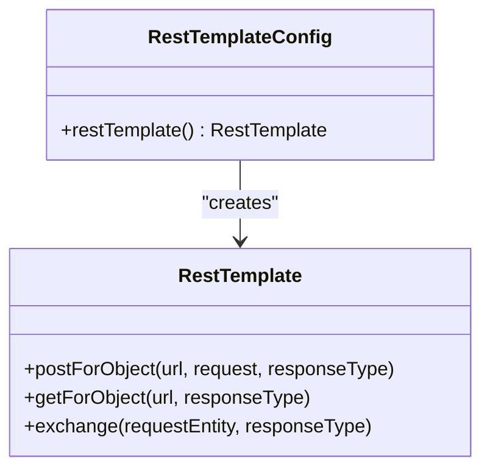
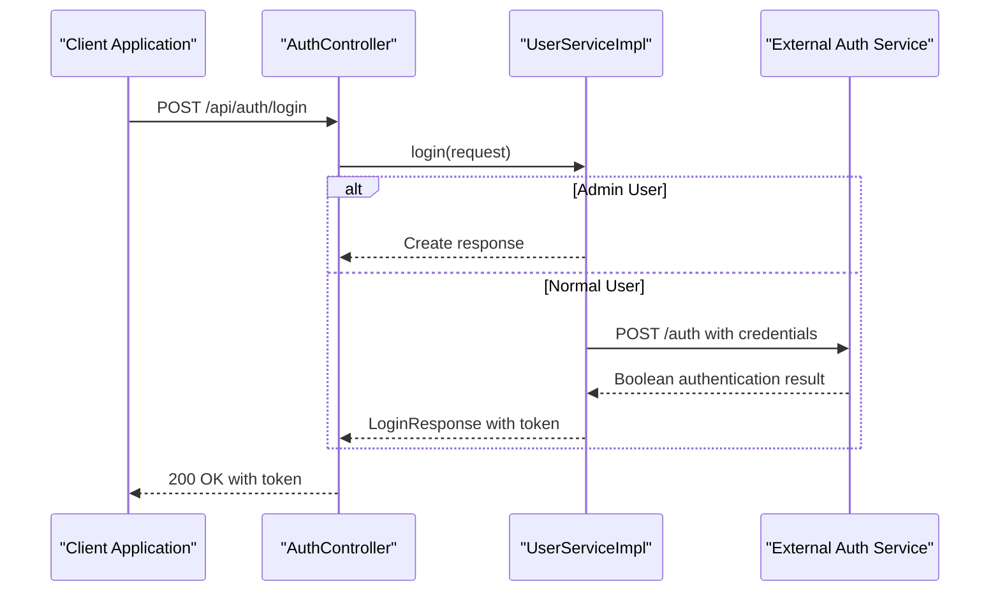
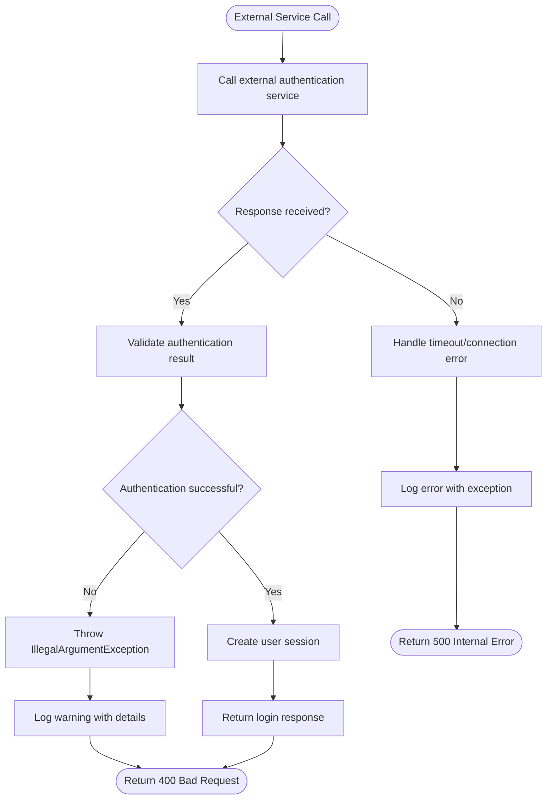
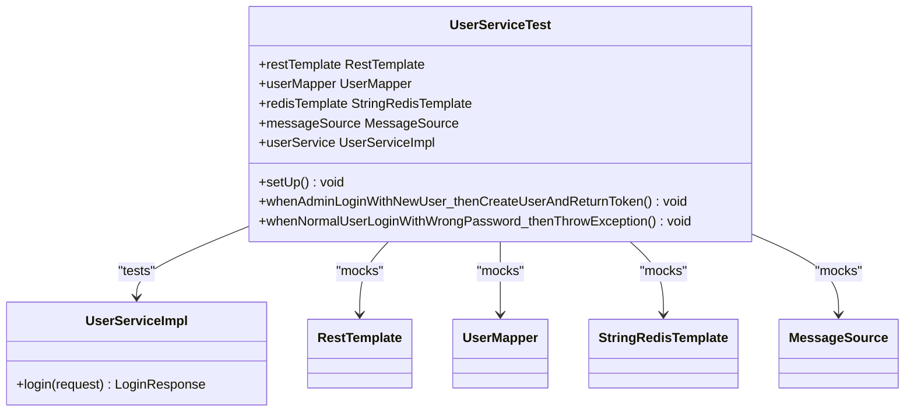

# External Services Integration

<cite>
**Referenced Files in This Document**   
- [RestTemplateConfig.java](file://src/main/java/com/example/onlinestore/config/RestTemplateConfig.java)
- [UserServiceImpl.java](file://src/main/java/com/example/onlinestore/service/impl/UserServiceImpl.java)
- [AuthController.java](file://src/main/java/com/example/onlinestore/controller/AuthController.java)
- [application.yml](file://src/main/resources/application.yml)
- [LoginRequest.java](file://src/main/java/com/example/onlinestore/dto/LoginRequest.java)
- [LoginResponse.java](file://src/main/java/com/example/onlinestore/dto/LoginResponse.java)
- [UserServiceTest.java](file://src/test/java/com/example/onlinestore/service/UserServiceTest.java)
</cite>

## Table of Contents
1. [Introduction](#introduction)
2. [RestTemplate Configuration and Lifecycle](#resttemplate-configuration-and-lifecycle)
3. [External Service Usage Pattern](#external-service-usage-pattern)
4. [Error Handling Strategies](#error-handling-strategies)
5. [Security Considerations](#security-considerations)
6. [Logging and Monitoring](#logging-and-monitoring)
7. [Performance Optimization](#performance-optimization)
8. [Testing Strategies](#testing-strategies)
9. [Conclusion](#conclusion)

## Introduction
This document provides comprehensive documentation on external service integration within the online-store application using Spring's RestTemplate. It covers configuration, usage patterns, error handling, security, logging, performance optimization, and testing strategies for calling external authentication services from the UserServiceImpl component.

## RestTemplate Configuration and Lifecycle

The RestTemplate bean is configured through the `RestTemplateConfig` class, which defines a simple configuration with default settings. The bean is managed by Spring's application context and follows the standard bean lifecycle.

**Diagram sources**
- [RestTemplateConfig.java](file://src/main/java/com/example/onlinestore/config/RestTemplateConfig.java#L7-L13)

**Section sources**
- [RestTemplateConfig.java](file://src/main/java/com/example/onlinestore/config/RestTemplateConfig.java#L7-L13)

## External Service Usage Pattern

The UserServiceImpl class demonstrates the usage pattern for integrating with external authentication services. The service uses RestTemplate to call an external user authentication endpoint, with the base URL configured through properties.

The integration flow begins when a user attempts to log in through the AuthController, which delegates to the UserService. For non-admin users, the system calls an external authentication service to verify credentials before creating or updating the user session.

**Diagram sources**
- [UserServiceImpl.java](file://src/main/java/com/example/onlinestore/service/impl/UserServiceImpl.java#L67-L95)
- [AuthController.java](file://src/main/java/com/example/onlinestore/controller/AuthController.java#L29-L44)

**Section sources**
- [UserServiceImpl.java](file://src/main/java/com/example/onlinestore/service/impl/UserServiceImpl.java#L67-L95)
- [AuthController.java](file://src/main/java/com/example/onlinestore/controller/AuthController.java#L29-L44)

## Error Handling Strategies

The application implements comprehensive error handling for external service integration. When calling the external authentication service, the system handles both business logic exceptions and system-level failures.

For HTTP failures, the application treats authentication failures (returning false or null from the external service) as business exceptions, throwing IllegalArgumentException with localized error messages. The system also handles connection timeouts and service unavailability through Spring's default RestTemplate exception handling, which translates HTTP error responses into appropriate ClientHttpResponseException subclasses.

The error handling strategy includes:
- Validation of authentication response from external service
- Translation of technical exceptions into user-friendly error messages
- Proper HTTP status code mapping (400 for business errors, 500 for system errors)
- Comprehensive logging of error conditions

**Diagram sources**
- [UserServiceImpl.java](file://src/main/java/com/example/onlinestore/service/impl/UserServiceImpl.java#L87-L92)
- [AuthController.java](file://src/main/java/com/example/onlinestore/controller/AuthController.java#L34-L42)

**Section sources**
- [UserServiceImpl.java](file://src/main/java/com/example/onlinestore/service/impl/UserServiceImpl.java#L87-L92)
- [AuthController.java](file://src/main/java/com/example/onlinestore/controller/AuthController.java#L34-L42)

## Security Considerations

The external service integration incorporates several security measures. The application uses property-based configuration for the external service URL, allowing different endpoints for various environments without code changes.

While the current implementation does not include request signing, it leverages Spring's MessageSource for error message localization, preventing potential information leakage through technical error messages. The system also uses HTTPS for external calls, as indicated by the configuration in application.yml.

TLS configuration is managed through Spring Boot's default SSL settings, with the ability to customize keystore, truststore, and cipher suites through application properties. The authentication flow ensures that passwords are never stored in plaintext, and user tokens are securely generated using UUIDs.

**Section sources**
- [application.yml](file://src/main/resources/application.yml#L41-L43)
- [UserServiceImpl.java](file://src/main/java/com/example/onlinestore/service/impl/UserServiceImpl.java#L48-L49)

## Logging and Monitoring

The application implements comprehensive logging for external service calls, enabling effective monitoring and troubleshooting. The UserServiceImpl class uses SLF4J for logging with appropriate log levels:

- INFO level for successful operations (e.g., "管理员快速登录")
- WARN level for business logic issues (e.g., "管理员密码错误")
- ERROR level for system failures

Log messages include relevant contextual information such as usernames and operation outcomes, facilitating audit trails and security monitoring. The logging strategy supports operational visibility while avoiding sensitive information disclosure.

**Section sources**
- [UserServiceImpl.java](file://src/main/java/com/example/onlinestore/service/impl/UserServiceImpl.java#L34)
- [UserServiceImpl.java](file://src/main/java/com/example/onlinestore/service/impl/UserServiceImpl.java#L73-L76)

## Performance Optimization

The current implementation uses a basic RestTemplate configuration without connection pooling or async execution. However, the system incorporates caching strategies to reduce the load on external services.

User session data is cached in Redis with a one-day expiration, reducing the need for repeated external authentication calls for the same user. The token-based authentication system allows subsequent requests to be validated locally without calling the external service.

For future performance improvements, the following optimizations could be implemented:
- Configure RestTemplate with connection pooling using HttpClient
- Implement async execution for non-blocking external calls
- Add circuit breaker pattern using resilience4j or Hystrix
- Implement response caching for frequently accessed external resources

**Section sources**
- [UserServiceImpl.java](file://src/main/java/com/example/onlinestore/service/impl/UserServiceImpl.java#L124-L132)
- [UserServiceImpl.java](file://src/main/java/com/example/onlinestore/service/impl/UserServiceImpl.java#L51-L53)

## Testing Strategies

The application includes comprehensive testing strategies for external service dependencies using mocking frameworks. The UserServiceTest class demonstrates the use of Mockito to mock the RestTemplate dependency, allowing isolated testing of the service logic without making actual HTTP calls.

Key testing approaches include:
- Mocking RestTemplate behavior for different authentication outcomes
- Verifying proper URL construction and request parameters
- Testing error handling for failed authentication attempts
- Validating business logic for both admin and normal users
- Ensuring proper exception translation and message localization

The test suite covers various scenarios including successful authentication, failed authentication, admin user login, and system errors, ensuring robustness of the external service integration.

**Diagram sources**
- [UserServiceTest.java](file://src/test/java/com/example/onlinestore/service/UserServiceTest.java#L28-L252)

**Section sources**
- [UserServiceTest.java](file://src/test/java/com/example/onlinestore/service/UserServiceTest.java#L28-L252)

## Conclusion

The online-store application demonstrates a solid foundation for external service integration using Spring's RestTemplate. The current implementation provides a clean separation of concerns, with proper configuration, usage patterns, and error handling. While the basic RestTemplate configuration works for simple use cases, opportunities exist for enhancing performance through connection pooling, async execution, and circuit breaking. The comprehensive testing strategy using mocking frameworks ensures reliability and maintainability of the external service integration code.