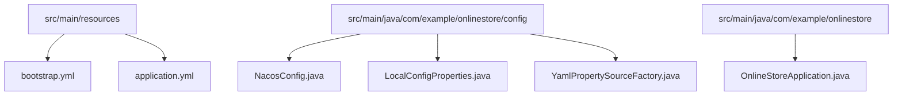
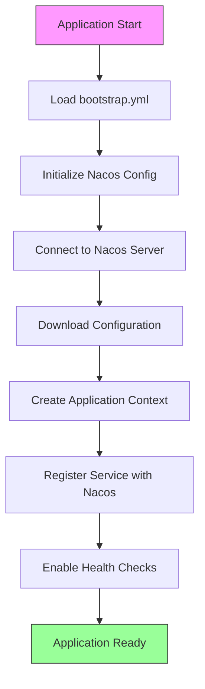
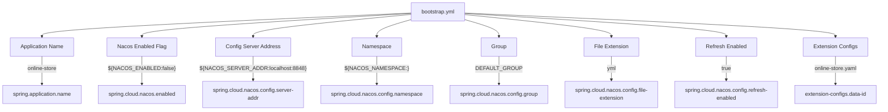
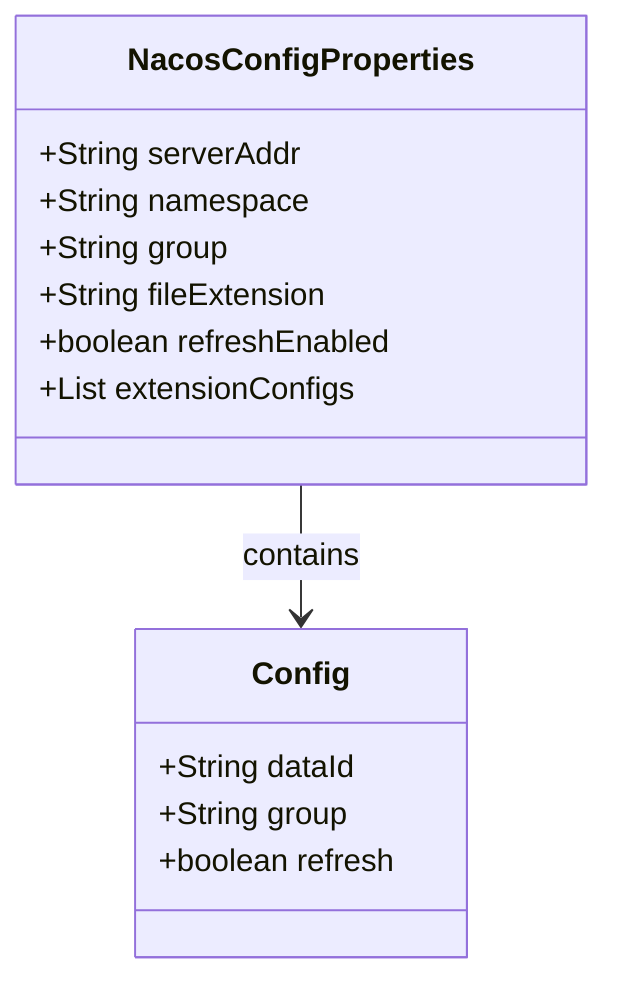
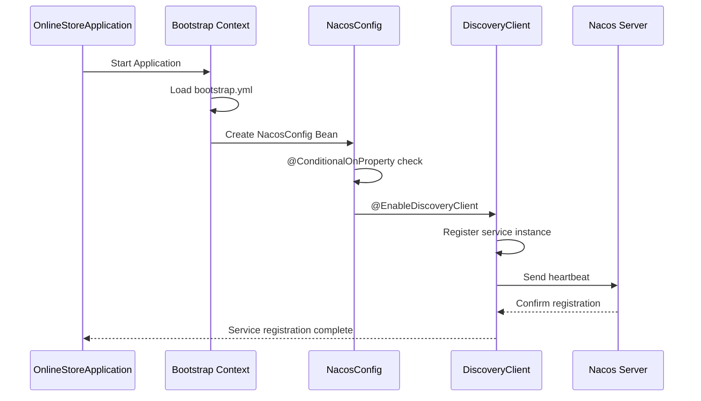
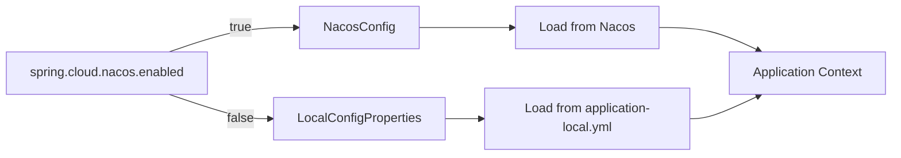
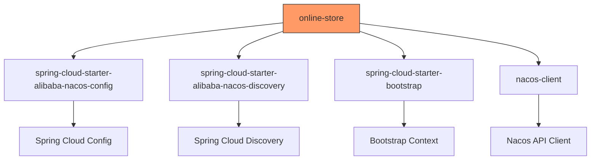

# Service Discovery (Nacos)

<cite>
**Referenced Files in This Document**   
- [bootstrap.yml](file://src/main/resources/bootstrap.yml)
- [application.yml](file://src/main/resources/application.yml)
- [NacosConfig.java](file://src/main/java/com/example/onlinestore/config/NacosConfig.java)
- [LocalConfigProperties.java](file://src/main/java/com/example/onlinestore/config/LocalConfigProperties.java)
- [OnlineStoreApplication.java](file://src/main/java/com/example/onlinestore/OnlineStoreApplication.java)
- [pom.xml](file://pom.xml)
- [YamlPropertySourceFactory.java](file://src/main/java/com/example/onlinestore/config/YamlPropertySourceFactory.java)
</cite>

## Table of Contents
1. [Introduction](#introduction)
2. [Project Structure](#project-structure)
3. [Core Components](#core-components)
4. [Architecture Overview](#architecture-overview)
5. [Detailed Component Analysis](#detailed-component-analysis)
6. [Dependency Analysis](#dependency-analysis)
7. [Performance Considerations](#performance-considerations)
8. [Troubleshooting Guide](#troubleshooting-guide)
9. [Conclusion](#conclusion)

## Introduction
This document provides comprehensive architectural documentation for Nacos integration in the online-store application. It details how Nacos is used for dynamic configuration management and service discovery, including initialization sequence, configuration binding, service registration, health checks, failover strategies, and monitoring. The document also covers security considerations and troubleshooting guidance for Nacos-related issues.

## Project Structure
The online-store application follows a standard Spring Boot project structure with Java source code located under `src/main/java` and configuration files under `src/main/resources`. The core Nacos integration components are located in the configuration package and bootstrap configuration files.

**Diagram sources**
- [bootstrap.yml](file://src/main/resources/bootstrap.yml)
- [application.yml](file://src/main/resources/application.yml)
- [NacosConfig.java](file://src/main/java/com/example/onlinestore/config/NacosConfig.java)
- [LocalConfigProperties.java](file://src/main/java/com/example/onlinestore/config/LocalConfigProperties.java)

**Section sources**
- [bootstrap.yml](file://src/main/resources/bootstrap.yml)
- [application.yml](file://src/main/resources/application.yml)
- [NacosConfig.java](file://src/main/java/com/example/onlinestore/config/NacosConfig.java)

## Core Components
The Nacos integration in the online-store application is built around several key components: bootstrap configuration for early Nacos initialization, conditional configuration classes that enable or disable Nacos features, and dependency management that ensures proper client integration. The system supports both cloud-based configuration via Nacos and fallback to local configuration when Nacos is disabled.

**Section sources**
- [bootstrap.yml](file://src/main/resources/bootstrap.yml#L1-L17)
- [NacosConfig.java](file://src/main/java/com/example/onlinestore/config/NacosConfig.java#L1-L29)
- [LocalConfigProperties.java](file://src/main/java/com/example/onlinestore/config/LocalConfigProperties.java#L1-L12)

## Architecture Overview
The Nacos integration architecture follows the Spring Cloud Alibaba pattern, where configuration is loaded during application bootstrap before the main application context is created. This ensures that all configuration properties are available when beans are initialized. The system supports dynamic configuration reloading and service discovery with health check integration.

**Diagram sources**
- [bootstrap.yml](file://src/main/resources/bootstrap.yml#L1-L17)
- [NacosConfig.java](file://src/main/java/com/example/onlinestore/config/NacosConfig.java#L24-L27)
- [OnlineStoreApplication.java](file://src/main/java/com/example/onlinestore/OnlineStoreApplication.java#L8-L10)

## Detailed Component Analysis

### Bootstrap Configuration
The bootstrap.yml file contains the primary Nacos configuration that is loaded before the application context creation. This includes the Nacos server address, namespace, group, and configuration file extension. The configuration uses environment variables with default values to ensure flexibility across different deployment environments.

**Diagram sources**
- [bootstrap.yml](file://src/main/resources/bootstrap.yml#L1-L17)

**Section sources**
- [bootstrap.yml](file://src/main/resources/bootstrap.yml#L1-L17)

### Configuration Management
The Nacos configuration system supports dynamic configuration management through the extension-configs feature, which allows multiple configuration files to be loaded from Nacos. The online-store application loads the online-store.yaml configuration file from the DEFAULT_GROUP, with refresh enabled to support hot-reloading of configuration changes.

**Diagram sources**
- [bootstrap.yml](file://src/main/resources/bootstrap.yml#L7-L17)

**Section sources**
- [bootstrap.yml](file://src/main/resources/bootstrap.yml#L7-L17)

### Service Discovery Configuration
The NacosConfig class enables service discovery using the @EnableDiscoveryClient annotation. This configuration is conditionally applied based on the spring.cloud.nacos.enabled property, allowing the feature to be toggled on or off. When enabled, the application registers itself with the Nacos service registry and participates in service discovery.

**Diagram sources**
- [NacosConfig.java](file://src/main/java/com/example/onlinestore/config/NacosConfig.java#L24-L27)
- [bootstrap.yml](file://src/main/resources/bootstrap.yml#L6-L7)

**Section sources**
- [NacosConfig.java](file://src/main/java/com/example/onlinestore/config/NacosConfig.java#L1-L29)

### Local Configuration Fallback
The LocalConfigProperties class provides a fallback mechanism when Nacos is disabled. When spring.cloud.nacos.enabled is set to false, this configuration class loads properties from the local application-local.yml file using a custom YamlPropertySourceFactory. This ensures the application can run in environments without Nacos.

**Diagram sources**
- [LocalConfigProperties.java](file://src/main/java/com/example/onlinestore/config/LocalConfigProperties.java#L7-L9)
- [NacosConfig.java](file://src/main/java/com/example/onlinestore/config/NacosConfig.java#L26)

**Section sources**
- [LocalConfigProperties.java](file://src/main/java/com/example/onlinestore/config/LocalConfigProperties.java#L1-L12)

## Dependency Analysis
The Maven dependency configuration includes all necessary components for Nacos integration, including the configuration starter, discovery starter, bootstrap starter, and the Nacos client itself. The dependencies are managed through the Spring Cloud Alibaba BOM, ensuring version compatibility.

**Diagram sources**
- [pom.xml](file://pom.xml#L85-L108)

**Section sources**
- [pom.xml](file://pom.xml#L85-L108)

## Performance Considerations
The Nacos integration is designed with performance in mind. Configuration refresh is enabled but can be tuned based on environment requirements. The heartbeat interval for service registration is configured through Nacos server settings, and the client handles connection pooling and retry logic internally. For production environments, it's recommended to configure appropriate timeouts and retry policies.

## Troubleshooting Guide
Common issues with Nacos integration include configuration not being loaded, service registration failures, and configuration hot-reloading not working. Ensure that bootstrap.yml is properly configured, the Nacos server is reachable, and the spring.cloud.nacos.enabled property is set correctly. When troubleshooting, check application logs for Nacos client initialization messages and verify network connectivity to the Nacos server.

**Section sources**
- [bootstrap.yml](file://src/main/resources/bootstrap.yml#L6-L17)
- [NacosConfig.java](file://src/main/java/com/example/onlinestore/config/NacosConfig.java#L26)
- [application.yml](file://src/main/resources/application.yml#L8-L14)

## Conclusion
The online-store application's Nacos integration provides robust configuration management and service discovery capabilities. The architecture supports dynamic configuration reloading, service registration with health checks, and graceful fallback to local configuration when needed. The implementation follows Spring Cloud best practices and provides a solid foundation for microservices deployment in cloud environments.