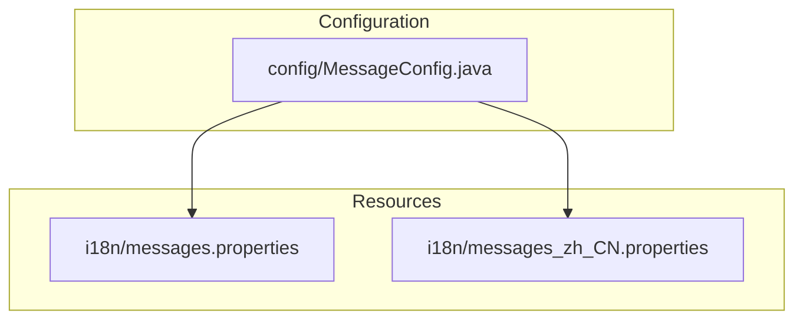
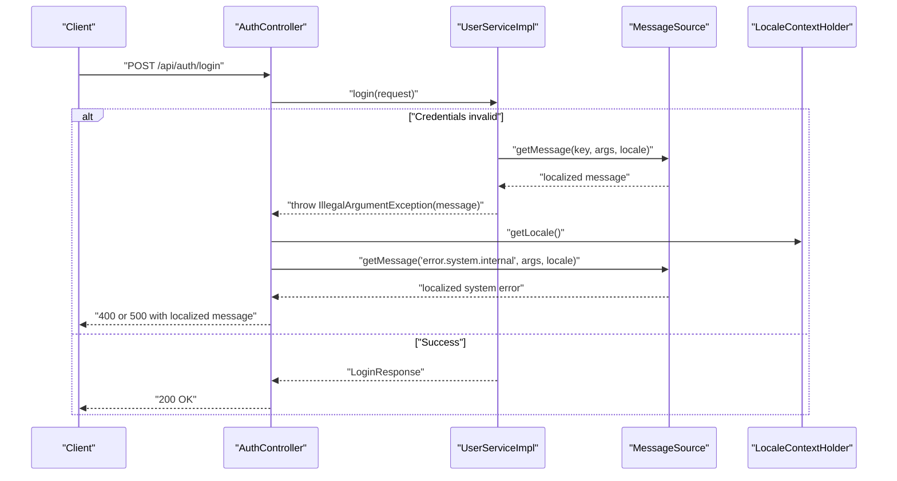
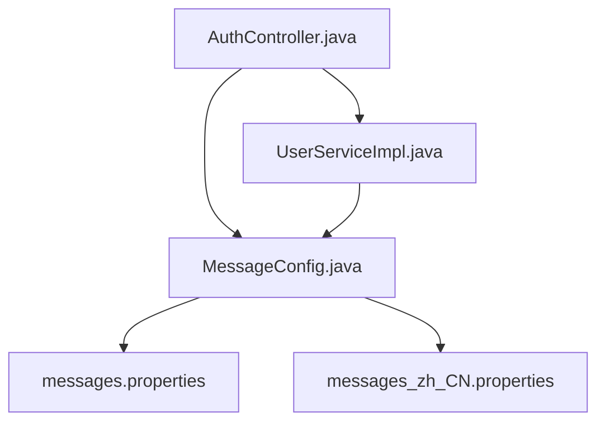

# Internationalization

<cite>
**Referenced Files in This Document**
- [MessageConfig.java](file://src/main/java/com/example/onlinestore/config/MessageConfig.java)
- [messages.properties](file://src/main/resources/i18n/messages.properties)
- [messages_zh_CN.properties](file://src/main/resources/i18n/messages_zh_CN.properties)
- [AuthController.java](file://src/main/java/com/example/onlinestore/controller/AuthController.java)
- [UserServiceImpl.java](file://src/main/java/com/example/onlinestore/service/impl/UserServiceImpl.java)
- [MessageSourceTest.java](file://src/test/java/com/example/onlinestore/config/MessageSourceTest.java)
- [AuthControllerTest.java](file://src/test/java/com/example/onlinestore/controller/AuthControllerTest.java)
- [ErrorResponse.java](file://src/main/java/com/example/onlinestore/dto/ErrorResponse.java)
</cite>

## Table of Contents
1. [Introduction](#introduction)
2. [Project Structure](#project-structure)
3. [Core Components](#core-components)
4. [Architecture Overview](#architecture-overview)
5. [Detailed Component Analysis](#detailed-component-analysis)
6. [Dependency Analysis](#dependency-analysis)
7. [Performance Considerations](#performance-considerations)
8. [Troubleshooting Guide](#troubleshooting-guide)
9. [Conclusion](#conclusion)
10. [Appendices](#appendices)

## Introduction
This document explains internationalization (i18n) in the online-store application. It covers the message resource bundle structure with default and Chinese (zh_CN) properties files, the MessageConfig configuration for message source setup, and how localized error messages are retrieved using LocaleContextHolder in controllers and services. It also provides examples of message key usage such as "error.invalid.credentials" and "error.system.internal", guidelines for adding new languages and message keys, and best practices for maintaining message consistency across the application.

## Project Structure
The i18n resources are organized under src/main/resources/i18n with two files:
- messages.properties: default English messages
- messages_zh_CN.properties: Chinese (Simplified) messages

The Spring configuration defines the message source and locale resolution.

**Diagram sources**
- [MessageConfig.java](file://src/main/java/com/example/onlinestore/config/MessageConfig.java#L16-L24)
- [messages.properties](file://src/main/resources/i18n/messages.properties#L1-L17)
- [messages_zh_CN.properties](file://src/main/resources/i18n/messages_zh_CN.properties#L1-L17)

**Section sources**
- [MessageConfig.java](file://src/main/java/com/example/onlinestore/config/MessageConfig.java#L16-L35)
- [messages.properties](file://src/main/resources/i18n/messages.properties#L1-L17)
- [messages_zh_CN.properties](file://src/main/resources/i18n/messages_zh_CN.properties#L1-L17)

## Core Components
- Message source configuration: Defines basenames, default encoding, fallback behavior, and default locale.
- Locale resolver: Determines supported locales and default locale based on the Accept-Language header.
- Resource bundles: English and Chinese message property files.
- Controllers and services: Retrieve localized messages using LocaleContextHolder and MessageSource.

Key responsibilities:
- MessageConfig sets up the message source and locale resolver beans.
- Controllers/services use MessageSource.getMessage with the current locale from LocaleContextHolder.
- Tests validate localization behavior and error message retrieval.

**Section sources**
- [MessageConfig.java](file://src/main/java/com/example/onlinestore/config/MessageConfig.java#L16-L35)
- [AuthController.java](file://src/main/java/com/example/onlinestore/controller/AuthController.java#L29-L44)
- [UserServiceImpl.java](file://src/main/java/com/example/onlinestore/service/impl/UserServiceImpl.java#L68-L95)
- [MessageSourceTest.java](file://src/test/java/com/example/onlinestore/config/MessageSourceTest.java#L19-L35)

## Architecture Overview
The i18n flow integrates configuration, resource bundles, and runtime usage in controllers and services.

**Diagram sources**
- [AuthController.java](file://src/main/java/com/example/onlinestore/controller/AuthController.java#L29-L44)
- [UserServiceImpl.java](file://src/main/java/com/example/onlinestore/service/impl/UserServiceImpl.java#L68-L95)
- [MessageConfig.java](file://src/main/java/com/example/onlinestore/config/MessageConfig.java#L16-L35)

## Detailed Component Analysis

### MessageConfig: Message Source and Locale Resolver
- Message source bean:
  - Basenames: "i18n/messages"
  - Default encoding: UTF-8
  - Fallback behavior: disabled
  - Default locale: English
- Locale resolver bean:
  - Accept header-based resolution
  - Supported locales: English and Simplified Chinese
  - Default locale: English

These settings ensure that messages are loaded from the configured basenames, encoded in UTF-8, and that the application’s default locale is English while honoring client-provided Accept-Language.

**Section sources**
- [MessageConfig.java](file://src/main/java/com/example/onlinestore/config/MessageConfig.java#L16-L35)

### Resource Bundles: Default and Chinese
- Default bundle (messages.properties):
  - Contains keys for system errors, access control, unauthorized access, invalid credentials, page validation, and product validation.
- Chinese bundle (messages_zh_CN.properties):
  - Mirrors the default keys with localized values.

Examples of keys present:
- error.invalid.credentials
- error.system.internal

These keys are used in controllers and services to return localized error messages.

**Section sources**
- [messages.properties](file://src/main/resources/i18n/messages.properties#L1-L17)
- [messages_zh_CN.properties](file://src/main/resources/i18n/messages_zh_CN.properties#L1-L17)

### Controllers: Retrieving Localized Messages
- AuthController retrieves localized system error messages using LocaleContextHolder.getLocale() and MessageSource.getMessage with the "error.system.internal" key.
- The controller returns 400 for business exceptions and 500 for unexpected system errors, with the message localized according to the current locale.

**Section sources**
- [AuthController.java](file://src/main/java/com/example/onlinestore/controller/AuthController.java#L29-L44)

### Services: Retrieving Localized Messages
- UserServiceImpl retrieves localized messages for invalid credentials using LocaleContextHolder.getLocale() and MessageSource.getMessage with the "error.invalid.credentials" key.
- The service throws IllegalArgumentException with the localized message when authentication fails.

**Section sources**
- [UserServiceImpl.java](file://src/main/java/com/example/onlinestore/service/impl/UserServiceImpl.java#L68-L95)

### Tests: Validating Localization Behavior
- MessageSourceTest validates:
  - English and Chinese retrieval for "error.invalid.credentials" and "error.system.internal"
  - Validation messages for page number and page size
  - Default value fallback for non-existent keys
  - Parameterized message retrieval
  - NoSuchMessageException for truly missing keys
- AuthControllerTest verifies:
  - Accept-Language header usage
  - Correct localized error messages for login failures in English and Chinese
  - System error localization in English and Chinese

**Section sources**
- [MessageSourceTest.java](file://src/test/java/com/example/onlinestore/config/MessageSourceTest.java#L19-L35)
- [AuthControllerTest.java](file://src/test/java/com/example/onlinestore/controller/AuthControllerTest.java#L100-L145)

### Message Keys and Usage Examples
Commonly used keys:
- error.invalid.credentials: Used when login credentials are invalid.
- error.system.internal: Used for internal server errors.

Controllers and services retrieve these keys with the current locale resolved by LocaleContextHolder.

**Section sources**
- [UserServiceImpl.java](file://src/main/java/com/example/onlinestore/service/impl/UserServiceImpl.java#L68-L95)
- [AuthController.java](file://src/main/java/com/example/onlinestore/controller/AuthController.java#L29-L44)
- [messages.properties](file://src/main/resources/i18n/messages.properties#L1-L17)
- [messages_zh_CN.properties](file://src/main/resources/i18n/messages_zh_CN.properties#L1-L17)

## Dependency Analysis
The i18n subsystem depends on:
- MessageConfig for message source and locale resolver configuration
- Resource bundles for message content
- Controllers and services for runtime message retrieval
- Tests for validating behavior

**Diagram sources**
- [MessageConfig.java](file://src/main/java/com/example/onlinestore/config/MessageConfig.java#L16-L35)
- [messages.properties](file://src/main/resources/i18n/messages.properties#L1-L17)
- [messages_zh_CN.properties](file://src/main/resources/i18n/messages_zh_CN.properties#L1-L17)
- [AuthController.java](file://src/main/java/com/example/onlinestore/controller/AuthController.java#L29-L44)
- [UserServiceImpl.java](file://src/main/java/com/example/onlinestore/service/impl/UserServiceImpl.java#L68-L95)

**Section sources**
- [MessageConfig.java](file://src/main/java/com/example/onlinestore/config/MessageConfig.java#L16-L35)
- [AuthController.java](file://src/main/java/com/example/onlinestore/controller/AuthController.java#L29-L44)
- [UserServiceImpl.java](file://src/main/java/com/example/onlinestore/service/impl/UserServiceImpl.java#L68-L95)

## Performance Considerations
- UTF-8 encoding is set on the message source to support international characters without decoding overhead.
- Using basenames avoids scanning multiple locations, keeping message loading efficient.
- Locale resolution from Accept-Language header is lightweight and handled by Spring’s built-in resolver.

[No sources needed since this section provides general guidance]

## Troubleshooting Guide
Common issues and resolutions:
- Missing translation for a key:
  - Add the key to messages.properties and mirror it in messages_zh_CN.properties.
  - Verify the key spelling and namespace.
- Encoding problems:
  - Ensure properties files are saved in UTF-8.
  - Confirm message source default encoding is UTF-8.
- Incorrect locale selection:
  - Verify Accept-Language header is sent by clients.
  - Confirm supported locales in MessageConfig include the desired locale.
- NoSuchMessageException:
  - Occurs when a key is not found and no default value is provided.
  - Provide a default value or ensure the key exists in the appropriate bundle.

**Section sources**
- [MessageConfig.java](file://src/main/java/com/example/onlinestore/config/MessageConfig.java#L16-L35)
- [MessageSourceTest.java](file://src/test/java/com/example/onlinestore/config/MessageSourceTest.java#L78-L84)

## Conclusion
The online-store application implements i18n through a clear separation of concerns: configuration via MessageConfig, resource bundles for default and Chinese messages, and runtime retrieval using LocaleContextHolder and MessageSource. The tests demonstrate robust localization behavior for both business and system errors. Following the guidelines below ensures consistent and maintainable internationalization across the application.

## Appendices

### Guidelines for Adding New Languages
- Create a new properties file named messages_<locale>.properties under src/main/resources/i18n, where <locale> follows Spring’s Locale conventions (e.g., zh_CN).
- Mirror all keys from messages.properties in the new file.
- Register the new locale in MessageConfig.localeResolver by adding it to supported locales.
- Validate with tests similar to MessageSourceTest and AuthControllerTest.

**Section sources**
- [MessageConfig.java](file://src/main/java/com/example/onlinestore/config/MessageConfig.java#L26-L35)
- [messages.properties](file://src/main/resources/i18n/messages.properties#L1-L17)

### Guidelines for Adding New Message Keys
- Choose a descriptive key following the existing pattern (e.g., error.<category>.<detail>).
- Add the key to messages.properties with the default English value.
- Add the key to messages_zh_CN.properties with the Chinese translation.
- Use the key in controllers/services via MessageSource.getMessage with LocaleContextHolder.getLocale().
- Add or update tests to validate retrieval for both locales.

**Section sources**
- [messages.properties](file://src/main/resources/i18n/messages.properties#L1-L17)
- [messages_zh_CN.properties](file://src/main/resources/i18n/messages_zh_CN.properties#L1-L17)
- [UserServiceImpl.java](file://src/main/java/com/example/onlinestore/service/impl/UserServiceImpl.java#L68-L95)
- [AuthController.java](file://src/main/java/com/example/onlinestore/controller/AuthController.java#L29-L44)

### Best Practices for Maintaining Message Consistency
- Centralize message keys in shared DTOs or constants if reused widely.
- Keep message keys stable; avoid renaming to prevent breaking changes.
- Use parameterized messages when appropriate to avoid concatenation errors.
- Keep default English messages as the source of truth; treat other locales as translations.
- Regularly audit missing translations during feature additions.

[No sources needed since this section provides general guidance]