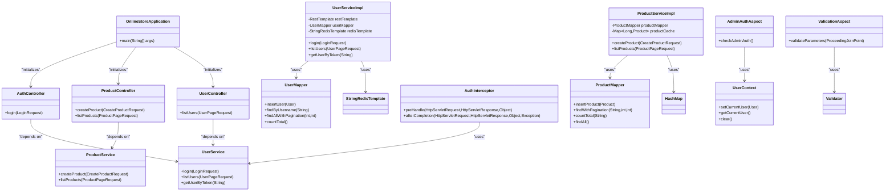

# Project Overview

<cite>
**Referenced Files in This Document**   
- [README.md](file://README.md)
- [OnlineStoreApplication.java](file://src/main/java/com/example/onlinestore/OnlineStoreApplication.java)
- [application.yml](file://src/main/resources/application.yml)
- [bootstrap.yml](file://src/main/resources/bootstrap.yml)
- [pom.xml](file://pom.xml)
- [AuthController.java](file://src/main/java/com/example/onlinestore/controller/AuthController.java)
- [ProductController.java](file://src/main/java/com/example/onlinestore/controller/ProductController.java)
- [UserController.java](file://src/main/java/com/example/onlinestore/controller/UserController.java)
- [UserServiceImpl.java](file://src/main/java/com/example/onlinestore/service/impl/UserServiceImpl.java)
- [ProductServiceImpl.java](file://src/main/java/com/example/onlinestore/service/impl/ProductServiceImpl.java)
- [AdminAuthAspect.java](file://src/main/java/com/example/onlinestore/aspect/AdminAuthAspect.java)
- [ValidationAspect.java](file://src/main/java/com/example/onlinestore/aspect/ValidationAspect.java)
- [AuthInterceptor.java](file://src/main/java/com/example/onlinestore/interceptor/AuthInterceptor.java)
- [UserContext.java](file://src/main/java/com/example/onlinestore/context/UserContext.java)
- [schema.sql](file://src/main/resources/db/schema.sql)
</cite>

## Table of Contents
1. [Introduction](#introduction)
2. [Technology Stack](#technology-stack)
3. [High-Level Architecture](#high-level-architecture)
4. [Component Relationships](#component-relationships)
5. [Setup Instructions](#setup-instructions)
6. [Quick Start Guide](#quick-start-guide)
7. [Key Workflows](#key-workflows)
8. [Conclusion](#conclusion)

## Introduction

The online-store project is a Spring Cloud-based backend service designed to manage an online store with comprehensive user authentication and product management capabilities. Built on modern Java technologies, it provides a scalable and maintainable foundation for e-commerce applications. The system implements token-based authentication to secure API endpoints and enforces admin authorization for sensitive operations. It exposes RESTful APIs for client applications to interact with user and product data, supporting essential e-commerce functionality such as user management, product catalog operations, and secure access control.

**Section sources**
- [README.md](file://README.md#L1-L55)
- [OnlineStoreApplication.java](file://src/main/java/com/example/onlinestore/OnlineStoreApplication.java#L1-L15)

## Technology Stack

The online-store application leverages a modern technology stack centered around Spring Cloud and Spring Boot. The backend is built with JDK 17+, ensuring compatibility with the latest Java features and performance improvements. Spring Boot 3.1.5 provides the foundation for rapid development and embedded server capabilities, while Spring Cloud 2022.0.4 enables cloud-native features such as service discovery and configuration management. Data persistence is handled by MySQL 8.0 through MyBatis 3.0.2 as the ORM framework, providing efficient database operations. Redis is integrated via Jedis 4.3.1 for caching user session data and improving system performance. Configuration management is implemented using Nacos, allowing dynamic configuration updates without service restarts. The build system uses Maven for dependency management and project compilation.

**Section sources**
- [README.md](file://README.md#L5-L13)
- [pom.xml](file://pom.xml#L1-L169)
- [application.yml](file://src/main/resources/application.yml#L1-L48)

## High-Level Architecture

The online-store application follows a layered architecture pattern with clear separation of concerns. At the foundation, the database layer consists of MySQL for persistent storage of user and product data, with Redis serving as a high-performance cache for user sessions. The persistence layer is implemented using MyBatis, which maps Java objects to database records through XML configuration files. Above this, the service layer contains the business logic for user authentication, product management, and data processing. RESTful API endpoints are exposed through Spring MVC controllers, which handle HTTP requests and responses. Security is implemented through a combination of interceptors and aspects: the AuthInterceptor validates authentication tokens on incoming requests, while AOP aspects handle cross-cutting concerns like admin authorization and parameter validation. Configuration is managed through Spring's profile system with Nacos integration for dynamic configuration updates.

```mermaid
graph TB
subgraph "Client"
Client[Web/Mobile Client]
end
subgraph "Backend"
Controller[REST Controllers]
Service[Service Layer]
Mapper[MyBatis Mappers]
end
subgraph "Data"
MySQL[(MySQL Database)]
Redis[(Redis Cache)]
end
subgraph "Infrastructure"
Nacos[Nacos Configuration]
end
Client --> Controller
Controller --> Service
Service --> Mapper
Mapper --> MySQL
Service --> Redis
Service --> Nacos
```

**Diagram sources**
- [OnlineStoreApplication.java](file://src/main/java/com/example/onlinestore/OnlineStoreApplication.java#L1-L15)
- [application.yml](file://src/main/resources/application.yml#L1-L48)
- [bootstrap.yml](file://src/main/resources/bootstrap.yml#L1-L17)

## Component Relationships

The application implements a clean component architecture with well-defined relationships between layers. Controllers in the `controller` package expose REST endpoints and delegate business logic to service components. The `AuthController` handles user authentication requests, while `ProductController` and `UserController` manage product and user operations respectively. These controllers depend on services in the `service` package, specifically `UserService` and `ProductService`, which contain the core business logic. Service implementations in the `impl` subpackage use MyBatis mappers to interact with the database, with `UserMapper` and `ProductMapper` providing data access methods. Cross-cutting concerns are addressed through aspects and interceptors: `AdminAuthAspect` enforces admin authorization on methods annotated with `@RequireAdmin`, `ValidationAspect` performs parameter validation on methods with `@ValidateParams`, and `AuthInterceptor` handles token-based authentication for protected endpoints. The `UserContext` class provides thread-local storage for the currently authenticated user, enabling access to user information throughout the request processing chain.



**Diagram sources**
- [AuthController.java](file://src/main/java/com/example/onlinestore/controller/AuthController.java#L1-L45)
- [ProductController.java](file://src/main/java/com/example/onlinestore/controller/ProductController.java#L1-L78)
- [UserController.java](file://src/main/java/com/example/onlinestore/controller/UserController.java#L1-L66)
- [UserServiceImpl.java](file://src/main/java/com/example/onlinestore/service/impl/UserServiceImpl.java#L1-L193)
- [ProductServiceImpl.java](file://src/main/java/com/example/onlinestore/service/impl/ProductServiceImpl.java#L1-L132)
- [AdminAuthAspect.java](file://src/main/java/com/example/onlinestore/aspect/AdminAuthAspect.java#L1-L71)
- [ValidationAspect.java](file://src/main/java/com/example/onlinestore/aspect/ValidationAspect.java#L1-L79)
- [AuthInterceptor.java](file://src/main/java/com/example/onlinestore/interceptor/AuthInterceptor.java#L1-L49)
- [UserContext.java](file://src/main/java/com/example/onlinestore/context/UserContext.java#L1-L19)

## Setup Instructions

To set up the online-store application, ensure the following prerequisites are installed: JDK 17 or higher, Maven 3.6 or higher, MySQL 8.0, and Redis 6.0 or higher. The application requires both MySQL and Redis services to be running before startup. Database configuration is managed through the `application.yml` file, where connection parameters such as URL, username, and password can be customized. Redis connection settings are also configured in the same file. Nacos configuration is disabled by default but can be enabled by setting the `NACOS_ENABLED` environment variable to `true`. The application uses UTF-8 character encoding with utf8mb4 collation to support international characters in product and user data. Internationalization is supported through message properties files in the `i18n` directory, allowing for localized error messages and responses.

**Section sources**
- [README.md](file://README.md#L37-L43)
- [application.yml](file://src/main/resources/application.yml#L1-L48)
- [bootstrap.yml](file://src/main/resources/bootstrap.yml#L1-L17)

## Quick Start Guide

To quickly start the online-store application, follow these steps: First, ensure MySQL and Redis services are running on the default ports. Create the database using the provided SQL command: `CREATE DATABASE online_store DEFAULT CHARACTER SET utf8mb4 COLLATE utf8mb4_unicode_ci;`. This creates a database with proper character encoding for international support. The database schema is automatically managed by the application, with table definitions available in `src/main/resources/db/schema.sql`. After database creation, build and run the application using the command `mvn spring-boot:run`. The application will start on port 8080 and be accessible at `http://localhost:8080`. By default, the application runs in 'local' profile, using the configuration from `application-local.yml`. The admin user credentials are configured in the application properties with username 'admin' and password 'password', allowing immediate access to admin-protected endpoints after startup.

**Section sources**
- [README.md](file://README.md#L44-L55)
- [application.yml](file://src/main/resources/application.yml#L1-L48)
- [schema.sql](file://src/main/resources/db/schema.sql)

## Key Workflows

### User Authentication Workflow

The user authentication process follows a token-based approach with automatic user provisioning. When a client sends a login request to the `/api/auth/login` endpoint with valid credentials, the `AuthController` delegates to the `UserService` for processing. For the predefined admin user, authentication is performed by comparing the provided password with the configured admin password. For other users, the system assumes external authentication through a user service, currently simulated in the implementation. Upon successful authentication, the system generates a UUID-based token, creates or updates the user record in the database, and stores the user session in Redis with a one-day expiration. The token is returned to the client in the response, which must include it in the `X-Token` header for subsequent requests. The `AuthInterceptor` validates this token on each request, extracting user information from Redis and storing it in the `UserContext` for the duration of the request.


**Diagram sources**
- [AuthController.java](file://src/main/java/com/example/onlinestore/controller/AuthController.java#L1-L45)
- [UserServiceImpl.java](file://src/main/java/com/example/onlinestore/service/impl/UserServiceImpl.java#L1-L193)
- [AuthInterceptor.java](file://src/main/java/com/example/onlinestore/interceptor/AuthInterceptor.java#L1-L49)

### Product Creation Workflow

Creating a new product requires admin authorization and follows a structured process. An authenticated admin user sends a POST request to `/api/products` with product details in the request body. The request first passes through the `AuthInterceptor`, which validates the `X-Token` header and establishes the user context. The `ValidationAspect` then processes the `@ValidateParams` annotation, using JSR-303 validation to ensure all required fields are present and valid. The `AdminAuthAspect` checks the `@RequireAdmin` annotation, verifying that the authenticated user is the configured admin user. Once these cross-cutting concerns are satisfied, the `ProductController` delegates to `ProductService` to create the product. The service layer constructs a `Product` entity with the provided data, sets creation timestamps, and persists it to the database via `ProductMapper`. The newly created product is also added to an in-memory cache, with automatic eviction of the oldest entry when the cache reaches 1,000 items. The created product is returned in the response with its assigned database ID.


**Diagram sources**
- [ProductController.java](file://src/main/java/com/example/onlinestore/controller/ProductController.java#L1-L78)
- [ProductServiceImpl.java](file://src/main/java/com/example/onlinestore/service/impl/ProductServiceImpl.java#L1-L132)
- [AdminAuthAspect.java](file://src/main/java/com/example/onlinestore/aspect/AdminAuthAspect.java#L1-L71)
- [ValidationAspect.java](file://src/main/java/com/example/onlinestore/aspect/ValidationAspect.java#L1-L79)
- [AuthInterceptor.java](file://src/main/java/com/example/onlinestore/interceptor/AuthInterceptor.java#L1-L49)

## Conclusion

The online-store project provides a robust foundation for an e-commerce backend with comprehensive user authentication and product management capabilities. Its Spring Cloud-based architecture offers scalability and maintainability, while the layered design ensures separation of concerns and testability. The implementation of token-based authentication and admin authorization provides secure access control, and the integration of Redis enhances performance through session caching. The use of AOP aspects for cross-cutting concerns keeps the business logic clean and focused. With its well-defined RESTful APIs and clear component relationships, the system is well-suited for integration with various frontend applications. The comprehensive setup and quick start instructions enable rapid deployment and development, making it an effective solution for online store management requirements.