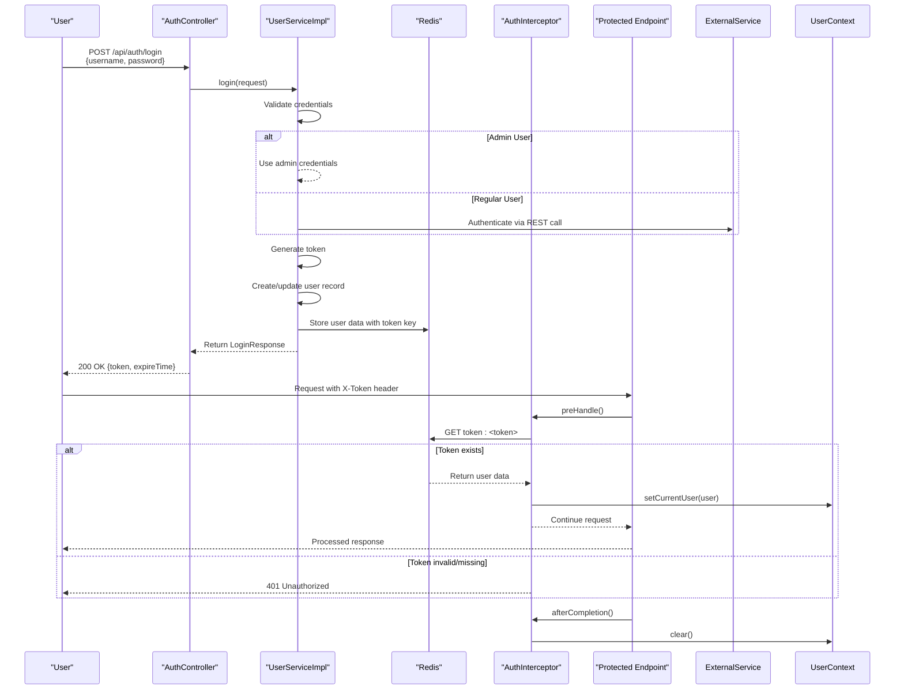
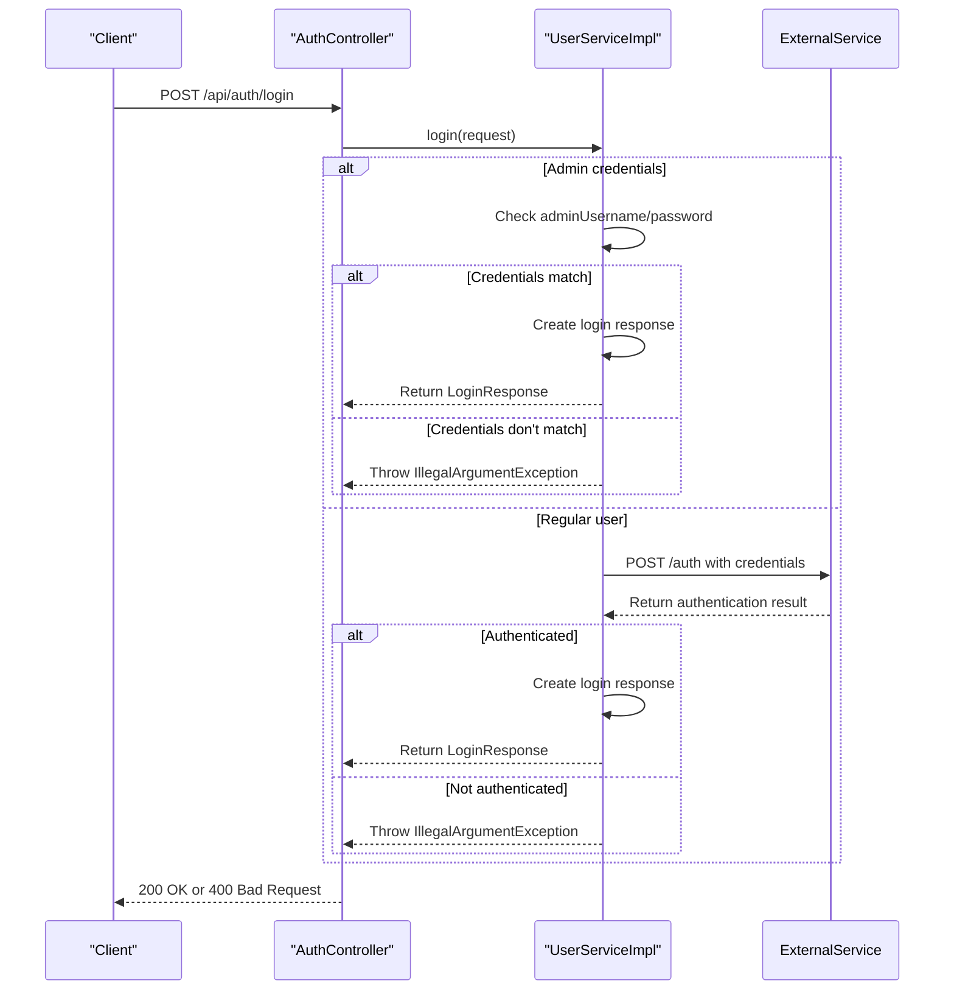
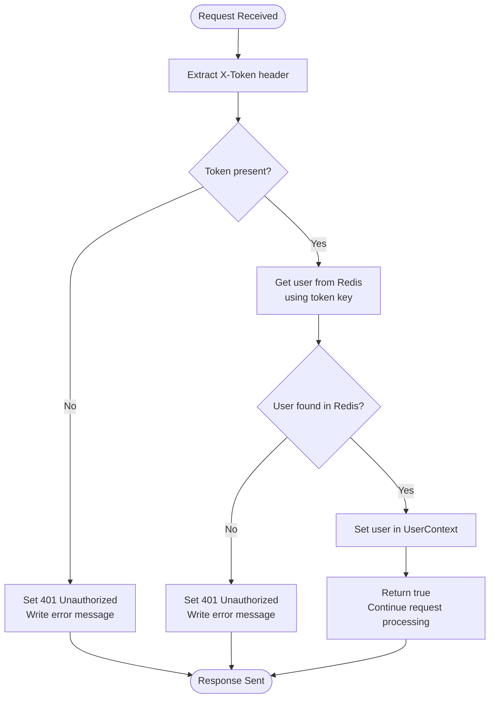
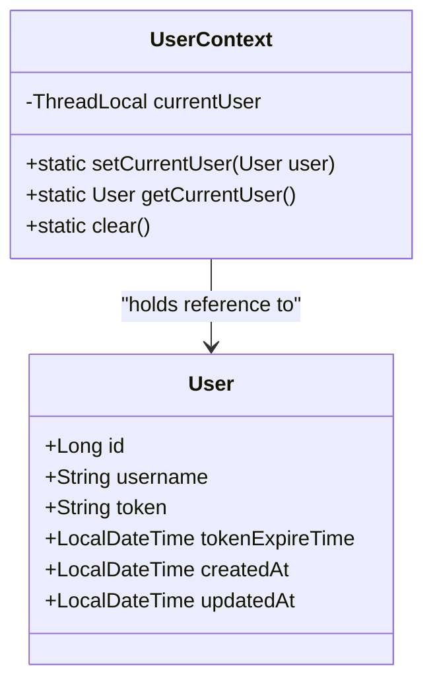
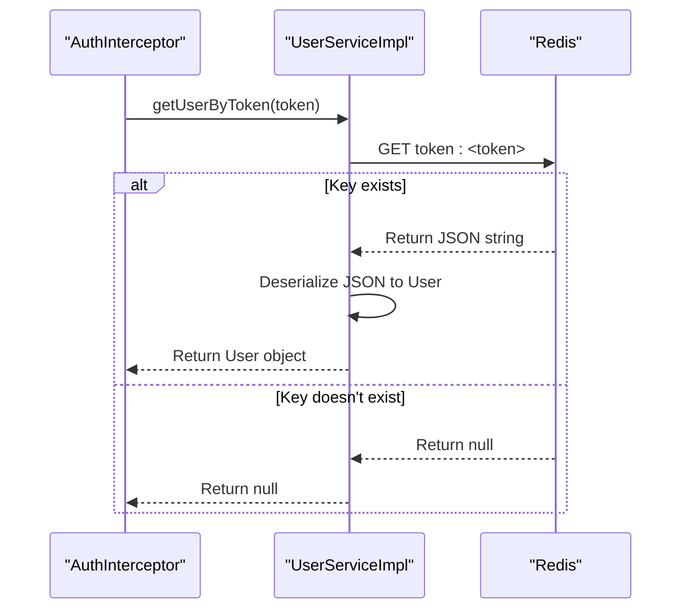
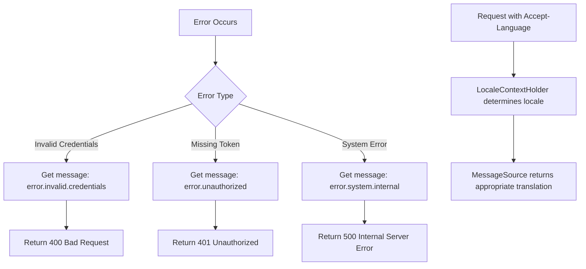

# Authentication Flow

<cite>
**Referenced Files in This Document**   
- [AuthController.java](file://src/main/java/com/example/onlinestore/controller/AuthController.java)
- [AuthInterceptor.java](file://src/main/java/com/example/onlinestore/interceptor/AuthInterceptor.java)
- [UserContext.java](file://src/main/java/com/example/onlinestore/context/UserContext.java)
- [UserServiceImpl.java](file://src/main/java/com/example/onlinestore/service/impl/UserServiceImpl.java)
- [UserService.java](file://src/main/java/com/example/onlinestore/service/UserService.java)
- [WebConfig.java](file://src/main/java/com/example/onlinestore/config/WebConfig.java)
- [RedisConfig.java](file://src/main/java/com/example/onlinestore/config/RedisConfig.java)
- [LoginRequest.java](file://src/main/java/com/example/onlinestore/dto/LoginRequest.java)
- [LoginResponse.java](file://src/main/java/com/example/onlinestore/dto/LoginResponse.java)
- [User.java](file://src/main/java/com/example/onlinestore/model/User.java)
- [messages.properties](file://src/main/resources/i18n/messages.properties)
- [messages_zh_CN.properties](file://src/main/resources/i18n/messages_zh_CN.properties)
- [application.yml](file://src/main/resources/application.yml)
</cite>

## Table of Contents
1. [Authentication Flow Overview](#authentication-flow-overview)
2. [Login Process](#login-process)
3. [Request Authentication](#request-authentication)
4. [User Context Management](#user-context-management)
5. [Token Validation with Redis](#token-validation-with-redis)
6. [Error Handling and Internationalization](#error-handling-and-internationalization)
7. [Security Considerations](#security-considerations)

## Authentication Flow Overview

The online-store application implements a token-based authentication system that handles user login, token generation, and request validation. The flow begins with a user submitting credentials to the AuthController, which processes the login request and returns a token. Subsequent requests must include this token in the X-Token header, which is validated by the AuthInterceptor before allowing access to protected endpoints. The UserContext maintains thread-local user state during request processing.

**Diagram sources**
- [AuthController.java](file://src/main/java/com/example/onlinestore/controller/AuthController.java#L29-L44)
- [UserServiceImpl.java](file://src/main/java/com/example/onlinestore/service/impl/UserServiceImpl.java#L67-L139)
- [AuthInterceptor.java](file://src/main/java/com/example/onlinestore/interceptor/AuthInterceptor.java#L23-L48)
- [UserContext.java](file://src/main/java/com/example/onlinestore/context/UserContext.java#L5-L18)

**Section sources**
- [AuthController.java](file://src/main/java/com/example/onlinestore/controller/AuthController.java#L1-L45)
- [AuthInterceptor.java](file://src/main/java/com/example/onlinestore/interceptor/AuthInterceptor.java#L1-L49)
- [UserContext.java](file://src/main/java/com/example/onlinestore/context/UserContext.java#L1-L19)

## Login Process

The login process is initiated through the AuthController's login method, which accepts a LoginRequest containing username and password. The UserService handles the authentication logic, with special handling for the admin user defined in configuration. Upon successful authentication, a new token is generated using UUID, and the user's information is stored in both the database and Redis cache.

For non-admin users, the system delegates authentication to an external user service via REST API call. Once authenticated, the system creates or updates the user record in the local database and stores the user data in Redis with a key prefixed with "token:" followed by the generated token. The token has a default expiration of 1 day, configured as a constant in the UserServiceImpl.

**Diagram sources**
- [AuthController.java](file://src/main/java/com/example/onlinestore/controller/AuthController.java#L29-L44)
- [UserServiceImpl.java](file://src/main/java/com/example/onlinestore/service/impl/UserServiceImpl.java#L67-L95)

**Section sources**
- [AuthController.java](file://src/main/java/com/example/onlinestore/controller/AuthController.java#L29-L44)
- [UserServiceImpl.java](file://src/main/java/com/example/onlinestore/service/impl/UserServiceImpl.java#L67-L139)
- [LoginRequest.java](file://src/main/java/com/example/onlinestore/dto/LoginRequest.java#L1-L22)
- [LoginResponse.java](file://src/main/java/com/example/onlinestore/dto/LoginResponse.java#L1-L24)

## Request Authentication

The AuthInterceptor handles authentication for incoming requests by implementing Spring's HandlerInterceptor interface. It is registered in WebConfig to intercept all requests under /api/** except the login endpoint. The interceptor extracts the X-Token header from incoming requests and validates it against the Redis store.

The preHandle method performs the token validation and user context setup. If the token is missing or invalid, it returns false and writes an unauthorized error message to the response. If the token is valid, it retrieves the user information from Redis, sets it in the UserContext, and allows the request to proceed. The afterCompletion method ensures proper cleanup by clearing the UserContext, preventing thread-local variable leaks in the thread pool.

**Diagram sources**
- [AuthInterceptor.java](file://src/main/java/com/example/onlinestore/interceptor/AuthInterceptor.java#L23-L48)
- [WebConfig.java](file://src/main/java/com/example/onlinestore/config/WebConfig.java#L15-L20)

**Section sources**
- [AuthInterceptor.java](file://src/main/java/com/example/onlinestore/interceptor/AuthInterceptor.java#L23-L48)
- [WebConfig.java](file://src/main/java/com/example/onlinestore/config/WebConfig.java#L15-L20)

## User Context Management

The UserContext class provides thread-local storage for the currently authenticated user, allowing any component in the call chain to access user information without passing it through method parameters. Implemented as a simple wrapper around Java's ThreadLocal, it stores the User object in the current thread's context.

This approach enables services and controllers to retrieve the current user's information anywhere in the application without dependency on the request object. The context is set during the preHandle phase of the interceptor and cleared in afterCompletion, ensuring that each request has its own isolated user context and preventing cross-request contamination in the thread pool.

**Diagram sources**
- [UserContext.java](file://src/main/java/com/example/onlinestore/context/UserContext.java#L5-L18)
- [User.java](file://src/main/java/com/example/onlinestore/model/User.java#L1-L60)

**Section sources**
- [UserContext.java](file://src/main/java/com/example/onlinestore/context/UserContext.java#L5-L18)

## Token Validation with Redis

Token validation is implemented through integration between UserService and Redis. The UserServiceImpl uses StringRedisTemplate to store and retrieve user data, with keys formatted as "token:{token}" where {token} is the generated UUID. When a user logs in, their complete User object is serialized to JSON using Jackson's ObjectMapper and stored in Redis with an expiration time of 1 day.

During request processing, the AuthInterceptor calls getUserByToken in UserService to validate the provided token. This method retrieves the JSON string from Redis using the token key, deserializes it back to a User object, and returns it. If the key doesn't exist or has expired, Redis returns null, resulting in an unauthorized response.

The Redis configuration is set up through RedisConfig, which defines a StringRedisTemplate bean using the connection factory. The Redis host and port are configured in application.yml, pointing to localhost on the default port 6379.

**Diagram sources**
- [UserServiceImpl.java](file://src/main/java/com/example/onlinestore/service/impl/UserServiceImpl.java#L179-L192)
- [RedisConfig.java](file://src/main/java/com/example/onlinestore/config/RedisConfig.java#L1-L15)
- [application.yml](file://src/main/resources/application.yml#L23-L27)

**Section sources**
- [UserServiceImpl.java](file://src/main/java/com/example/onlinestore/service/impl/UserServiceImpl.java#L179-L192)
- [RedisConfig.java](file://src/main/java/com/example/onlinestore/config/RedisConfig.java#L1-L15)

## Error Handling and Internationalization

The authentication system implements comprehensive error handling with internationalized error messages. The MessageSource bean, configured through MessageConfig (not shown in files), provides localized messages based on the client's locale, which is determined by Spring's LocaleContextHolder.

When authentication fails due to invalid credentials, an IllegalArgumentException is thrown with a localized error message retrieved from the message properties files. For system errors, a generic internal server error message is returned. The AuthInterceptor returns a 401 Unauthorized status with a localized "Unauthorized access" message when the token is missing or invalid.

The application supports multiple languages through properties files in the i18n directory. The base messages.properties contains English messages, while messages_zh_CN.properties contains Chinese translations. This allows the system to return error messages in the user's preferred language based on request headers.

**Diagram sources**
- [AuthController.java](file://src/main/java/com/example/onlinestore/controller/AuthController.java#L34-L42)
- [AuthInterceptor.java](file://src/main/java/com/example/onlinestore/interceptor/AuthInterceptor.java#L27-L38)
- [messages.properties](file://src/main/resources/i18n/messages.properties#L1-L17)
- [messages_zh_CN.properties](file://src/main/resources/i18n/messages_zh_CN.properties#L1-L17)

**Section sources**
- [AuthController.java](file://src/main/java/com/example/onlinestore/controller/AuthController.java#L34-L42)
- [AuthInterceptor.java](file://src/main/java/com/example/onlinestore/interceptor/AuthInterceptor.java#L27-L38)
- [messages.properties](file://src/main/resources/i18n/messages.properties#L1-L17)
- [messages_zh_CN.properties](file://src/main/resources/i18n/messages_zh_CN.properties#L1-L17)

## Security Considerations

The authentication implementation addresses several security concerns. The UserContext uses ThreadLocal storage, which is inherently thread-safe and prevents user data leakage between concurrent requests processed by the same thread from the pool. The afterCompletion method ensures that the thread-local variable is cleared after each request, preventing potential information disclosure.

Token generation uses Java's UUID.randomUUID(), which provides cryptographically strong random values. Tokens are stored in Redis with a one-day expiration, limiting the window of opportunity for token theft and replay attacks. The system stores the complete user object in Redis, reducing database load but requiring careful management of the data stored in the cache.

Potential security improvements could include using HTTPS in production to prevent token interception, implementing token revocation mechanisms, adding rate limiting to prevent brute force attacks, and using more secure token formats like JWT with digital signatures. The current implementation exposes tokens in the response, so secure storage on the client side is essential.

**Section sources**
- [UserContext.java](file://src/main/java/com/example/onlinestore/context/UserContext.java#L5-L18)
- [UserServiceImpl.java](file://src/main/java/com/example/onlinestore/service/impl/UserServiceImpl.java#L98-L100)
- [AuthInterceptor.java](file://src/main/java/com/example/onlinestore/interceptor/AuthInterceptor.java#L46-L48)