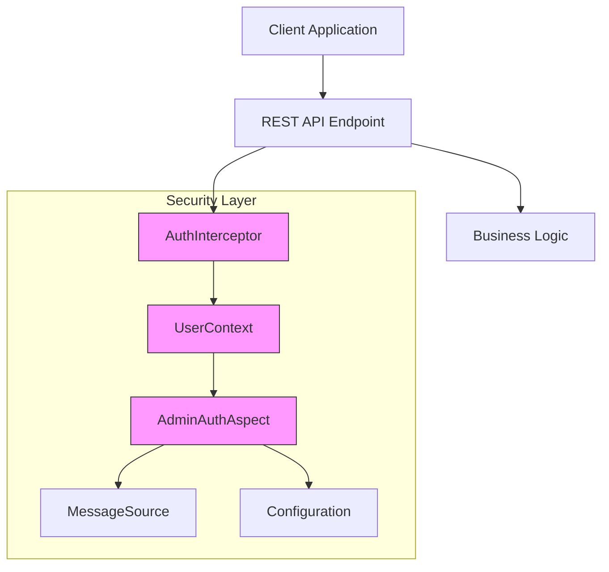
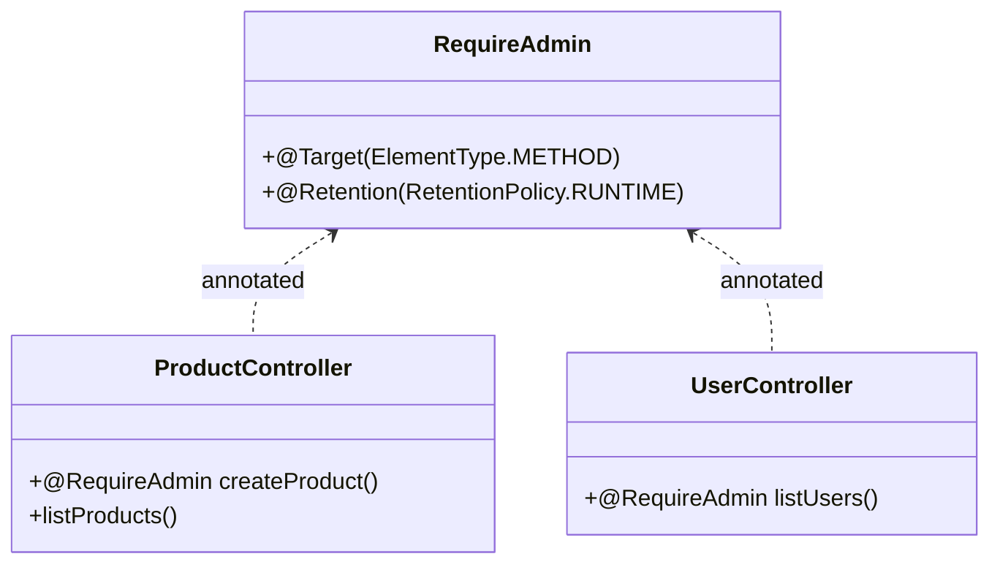
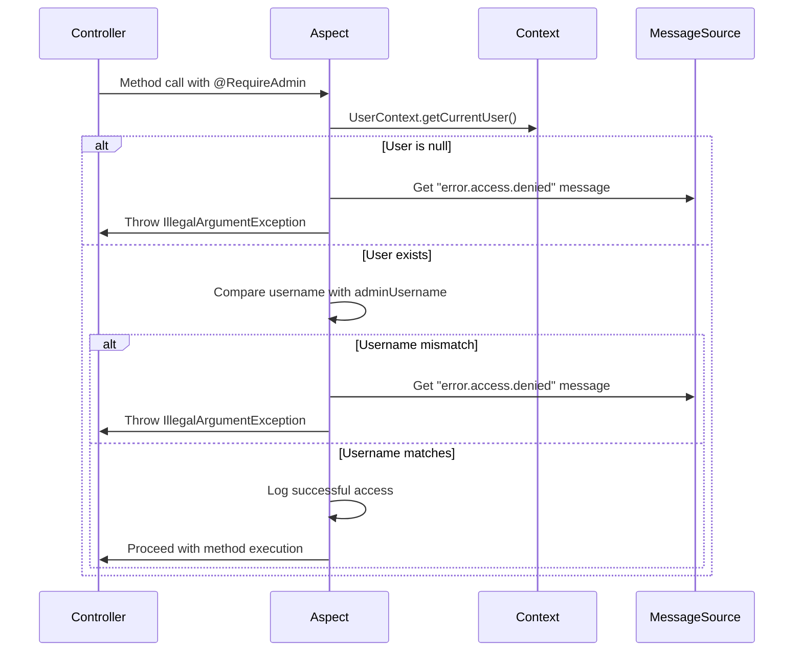
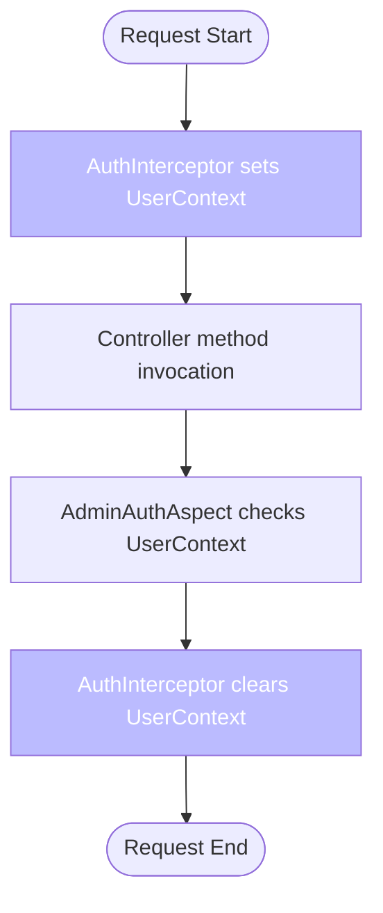
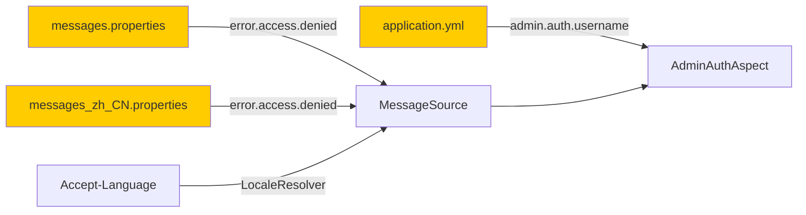
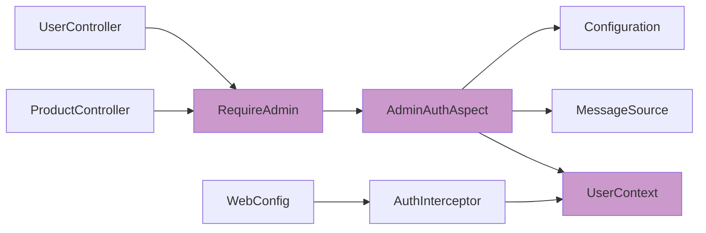
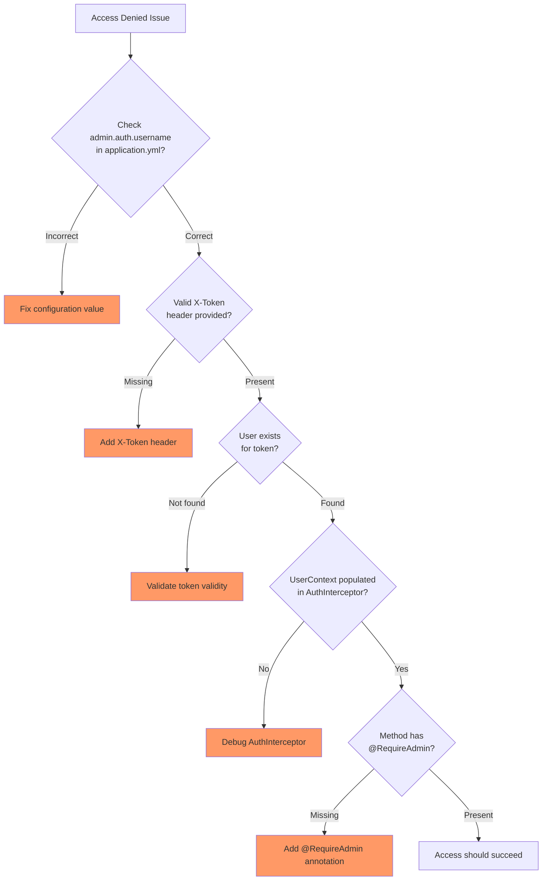

# Authorization (Admin Access Control)

<cite>
**Referenced Files in This Document**   
- [RequireAdmin.java](file://src/main/java/com/example/onlinestore/annotation/RequireAdmin.java)
- [AdminAuthAspect.java](file://src/main/java/com/example/onlinestore/aspect/AdminAuthAspect.java)
- [UserContext.java](file://src/main/java/com/example/onlinestore/context/UserContext.java)
- [ProductController.java](file://src/main/java/com/example/onlinestore/controller/ProductController.java)
- [UserController.java](file://src/main/java/com/example/onlinestore/controller/UserController.java)
- [application.yml](file://src/main/resources/application.yml)
- [AdminAuthAspectTest.java](file://src/test/java/com/example/onlinestore/aspect/AdminAuthAspectTest.java)
- [MessageConfig.java](file://src/main/java/com/example/onlinestore/config/MessageConfig.java)
- [messages.properties](file://src/main/resources/i18n/messages.properties)
- [messages_zh_CN.properties](file://src/main/resources/i18n/messages_zh_CN.properties)
- [AuthInterceptor.java](file://src/main/java/com/example/onlinestore/interceptor/AuthInterceptor.java)
- [WebConfig.java](file://src/main/java/com/example/onlinestore/config/WebConfig.java)
</cite>

## Table of Contents
1. [Introduction](#introduction)
2. [Core Components](#core-components)
3. [Architecture Overview](#architecture-overview)
4. [Detailed Component Analysis](#detailed-component-analysis)
5. [Dependency Analysis](#dependency-analysis)
6. [Performance Considerations](#performance-considerations)
7. [Troubleshooting Guide](#troubleshooting-guide)
8. [Conclusion](#conclusion)

## Introduction
The admin authorization mechanism in the online store application provides a secure way to restrict access to sensitive operations by leveraging Spring AOP and custom annotations. This system ensures that only authenticated users with specific administrator privileges can invoke protected endpoints. The mechanism is built around the `@RequireAdmin` annotation and the `AdminAuthAspect` aspect, which work together to enforce access control at the method level. The design incorporates thread-safe user context management, localized error messaging, and comprehensive logging for audit purposes. This document details the implementation, configuration, and usage patterns of this security mechanism.

**Section sources**
- [AdminAuthAspect.java](file://src/main/java/com/example/onlinestore/aspect/AdminAuthAspect.java#L15-L37)
- [RequireAdmin.java](file://src/main/java/com/example/onlinestore/annotation/RequireAdmin.java#L1-L11)

## Core Components
The admin authorization system consists of several key components working in concert: the `@RequireAdmin` annotation marks controller methods requiring administrative privileges; the `AdminAuthAspect` implements the security logic using AOP before advice; the `UserContext` class manages the current user's identity in a thread-safe manner using ThreadLocal; and the configuration system injects the authorized admin username from application properties. The mechanism integrates with the application's authentication interceptor and message localization system to provide a cohesive security experience.

**Section sources**
- [RequireAdmin.java](file://src/main/java/com/example/onlinestore/annotation/RequireAdmin.java#L1-L11)
- [AdminAuthAspect.java](file://src/main/java/com/example/onlinestore/aspect/AdminAuthAspect.java#L1-L71)
- [UserContext.java](file://src/main/java/com/example/onlinestore/context/UserContext.java#L1-L19)

## Architecture Overview
The admin authorization architecture follows a layered security approach where authentication and authorization concerns are separated. The authentication interceptor establishes the user context for each request, while the authorization aspect enforces role-based access control on specific methods. This separation of concerns allows for modular security design where different aspects can handle different security requirements.

**Diagram sources**
- [AuthInterceptor.java](file://src/main/java/com/example/onlinestore/interceptor/AuthInterceptor.java#L14-L49)
- [AdminAuthAspect.java](file://src/main/java/com/example/onlinestore/aspect/AdminAuthAspect.java#L38-L71)
- [UserContext.java](file://src/main/java/com/example/onlinestore/context/UserContext.java#L5-L19)

## Detailed Component Analysis

### @RequireAdmin Annotation
The `@RequireAdmin` annotation is a method-level annotation used to mark controller methods that require administrative privileges. It is defined with runtime retention policy, allowing the aspect to inspect it during execution. The annotation serves as a marker without any parameters, indicating that any method annotated with it should only be accessible to the configured administrator user.

**Diagram sources**
- [RequireAdmin.java](file://src/main/java/com/example/onlinestore/annotation/RequireAdmin.java#L8-L11)
- [ProductController.java](file://src/main/java/com/example/onlinestore/controller/ProductController.java#L37-L45)
- [UserController.java](file://src/main/java/com/example/onlinestore/controller/UserController.java#L42-L56)

### AdminAuthAspect Implementation
The `AdminAuthAspect` class implements the core authorization logic using Spring AOP. It uses `@Before` advice to intercept method calls annotated with `@RequireAdmin`. The aspect retrieves the admin username from configuration and injects the `MessageSource` for localization. The `checkAdminAuth()` method performs two validation steps: ensuring a user is present in context and verifying the user's username matches the configured admin username.

**Diagram sources**
- [AdminAuthAspect.java](file://src/main/java/com/example/onlinestore/aspect/AdminAuthAspect.java#L40-L71)
- [UserContext.java](file://src/main/java/com/example/onlinestore/context/UserContext.java#L12-L14)

### UserContext Management
The `UserContext` class provides a thread-safe mechanism for storing and retrieving the current user's information during request processing. Using `ThreadLocal`, it ensures that user data is isolated to the current thread, preventing cross-request contamination. The context is established by the authentication interceptor at the beginning of the request and cleared at completion, ensuring proper resource management.

**Diagram sources**
- [UserContext.java](file://src/main/java/com/example/onlinestore/context/UserContext.java#L6-L18)
- [AuthInterceptor.java](file://src/main/java/com/example/onlinestore/interceptor/AuthInterceptor.java#L41-L48)

### Configuration and Localization
The admin authorization system integrates with Spring's configuration and internationalization capabilities. The admin username is externalized in `application.yml` and injected using `@Value`. The system uses `MessageSource` to provide localized error messages, supporting multiple languages through properties files. The configuration also sets up locale resolution based on HTTP headers.

**Diagram sources**
- [application.yml](file://src/main/resources/application.yml#L45-L48)
- [MessageConfig.java](file://src/main/java/com/example/onlinestore/config/MessageConfig.java#L13-L36)
- [messages.properties](file://src/main/resources/i18n/messages.properties#L3)
- [messages_zh_CN.properties](file://src/main/resources/i18n/messages_zh_CN.properties#L3)

## Dependency Analysis
The admin authorization components have well-defined dependencies that follow the inversion of control principle. The aspect depends on configuration properties and message resources through dependency injection, while controllers depend on the aspect through annotation. The user context serves as a shared state mechanism between interceptors and aspects.

**Diagram sources**
- [go.mod](file://pom.xml)
- [AdminAuthAspect.java](file://src/main/java/com/example/onlinestore/aspect/AdminAuthAspect.java#L3-L14)
- [WebConfig.java](file://src/main/java/com/example/onlinestore/config/WebConfig.java#L3-L21)

## Performance Considerations
The admin authorization mechanism is designed to have minimal performance impact. The AOP interception occurs only on methods marked with `@RequireAdmin`, avoiding overhead on regular endpoints. The security check consists of simple null checks and string comparisons, both O(1) operations. The use of ThreadLocal for user context provides fast access without synchronization overhead. Message localization is also efficient, with Spring caching message lookups. The overall performance impact is negligible compared to database operations typically performed in controller methods.

## Troubleshooting Guide
Common issues with the admin authorization system include configuration errors, thread context issues, and testing challenges. Configuration errors typically involve incorrect admin username specification in `application.yml`. Thread context issues may occur if the authentication interceptor fails to set the user context properly. Testing requires careful setup of the user context and mocking of message sources.

**Section sources**
- [application.yml](file://src/main/resources/application.yml#L45-L48)
- [AuthInterceptor.java](file://src/main/java/com/example/onlinestore/interceptor/AuthInterceptor.java#L25-L42)
- [AdminAuthAspectTest.java](file://src/test/java/com/example/onlinestore/aspect/AdminAuthAspectTest.java#L1-L106)

## Conclusion
The admin authorization mechanism provides a robust, maintainable solution for protecting administrative endpoints in the online store application. By leveraging Spring AOP and custom annotations, it offers a clean separation of security concerns from business logic. The design emphasizes configurability, localization, and proper error handling, making it suitable for production environments. The integration with thread-local user context ensures thread safety, while comprehensive testing coverage validates the security logic. This approach can be extended to support more complex role-based access control scenarios as needed.