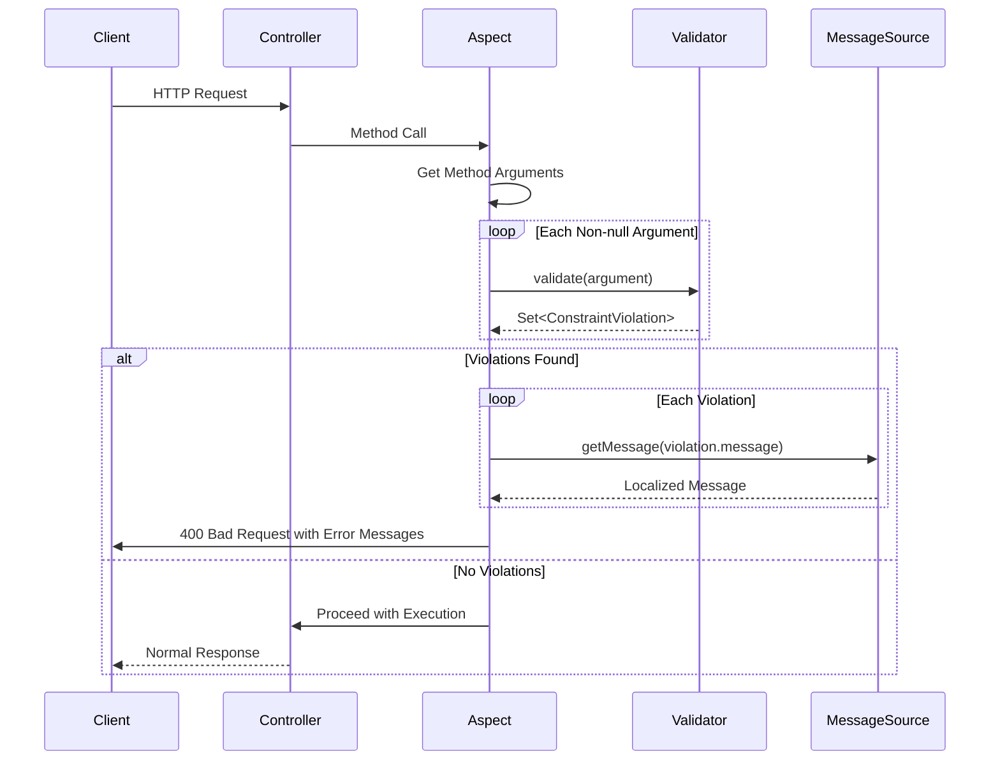
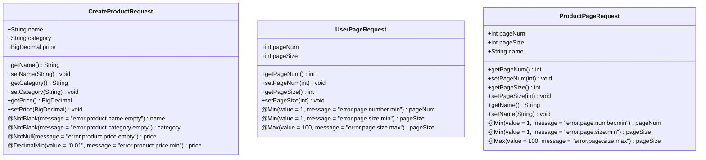
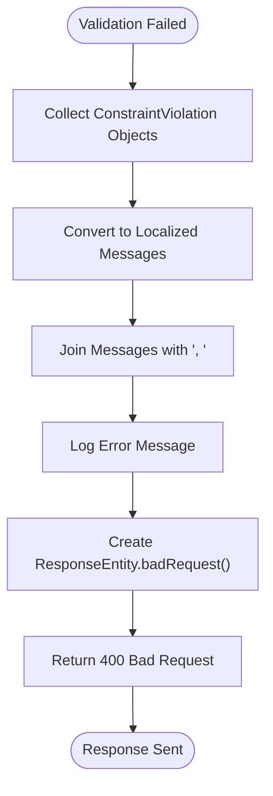
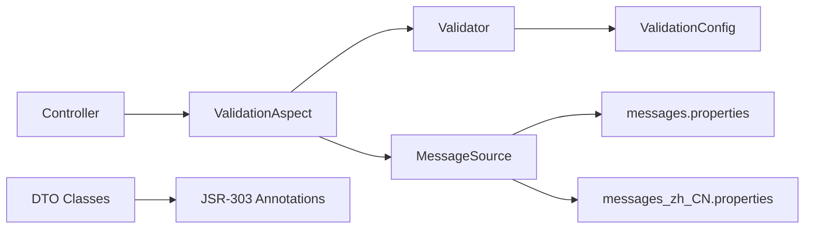
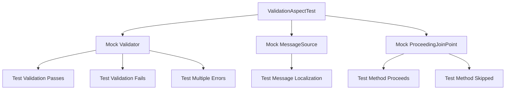

# Request Validation

<cite>
**Referenced Files in This Document**   
- [ValidateParams.java](file://src/main/java/com/example/onlinestore/annotation/ValidateParams.java)
- [ValidationAspect.java](file://src/main/java/com/example/onlinestore/aspect/ValidationAspect.java)
- [CreateProductRequest.java](file://src/main/java/com/example/onlinestore/dto/CreateProductRequest.java)
- [UserPageRequest.java](file://src/main/java/com/example/onlinestore/dto/UserPageRequest.java)
- [ProductPageRequest.java](file://src/main/java/com/example/onlinestore/dto/ProductPageRequest.java)
- [ValidationAspectTest.java](file://src/test/java/com/example/onlinestore/aspect/ValidationAspectTest.java)
- [messages.properties](file://src/main/resources/i18n/messages.properties)
- [messages_zh_CN.properties](file://src/main/resources/i18n/messages_zh_CN.properties)
- [ValidationConfig.java](file://src/main/java/com/example/onlinestore/config/ValidationConfig.java)
- [ProductController.java](file://src/main/java/com/example/onlinestore/controller/ProductController.java)
- [UserController.java](file://src/main/java/com/example/onlinestore/controller/UserController.java)
- [ErrorResponse.java](file://src/main/java/com/example/onlinestore/dto/ErrorResponse.java)
</cite>

## Table of Contents
1. [Introduction](#introduction)
2. [Core Components](#core-components)
3. [Architecture Overview](#architecture-overview)
4. [Detailed Component Analysis](#detailed-component-analysis)
5. [Dependency Analysis](#dependency-analysis)
6. [Performance Considerations](#performance-considerations)
7. [Testing Strategy](#testing-strategy)
8. [Best Practices](#best-practices)
9. [Conclusion](#conclusion)

## Introduction
The request validation system in the online store application implements AOP-based parameter validation using the `@ValidateParams` annotation and `ValidationAspect`. This system intercepts controller method calls, validates all non-null parameters using JSR-303 Bean Validation, and returns appropriate error responses when validation fails. The validation process includes collecting constraint violations, converting them to localized messages via `MessageSource`, and returning 400 Bad Request responses with aggregated error messages. This document provides a comprehensive analysis of the validation system's architecture, implementation, and integration with various components.

## Core Components
The request validation system consists of several key components that work together to provide robust parameter validation. The `@ValidateParams` annotation marks controller methods that require parameter validation, while the `ValidationAspect` class implements the actual validation logic using AOP. DTO classes like `CreateProductRequest` and `UserPageRequest` contain validation constraints defined using JSR-303 annotations. The system integrates with Spring's `MessageSource` for message localization and uses the built-in JSR-303 validator for constraint checking.

**Section sources**
- [ValidateParams.java](file://src/main/java/com/example/onlinestore/annotation/ValidateParams.java)
- [ValidationAspect.java](file://src/main/java/com/example/onlinestore/aspect/ValidationAspect.java)
- [CreateProductRequest.java](file://src/main/java/com/example/onlinestore/dto/CreateProductRequest.java)
- [UserPageRequest.java](file://src/main/java/com/example/onlinestore/dto/UserPageRequest.java)

## Architecture Overview
The request validation system follows an Aspect-Oriented Programming (AOP) approach to separate cross-cutting validation concerns from business logic. When a controller method annotated with `@ValidateParams` is invoked, the `ValidationAspect` intercepts the call before execution. The aspect iterates through all method parameters, validates non-null ones using JSR-303 Bean Validation, and either proceeds with the method execution or returns a 400 Bad Request response with localized error messages.

```mermaid
graph TD
A[Controller Method] --> |@ValidateParams| B(ValidationAspect)
B --> C{All Parameters Valid?}
C --> |Yes| D[Proceed with Method Execution]
C --> |No| E[Collect Constraint Violations]
E --> F[Convert to Localized Messages]
F --> G[Return 400 Bad Request]
D --> H[Return Normal Response]
```

**Diagram sources**
- [ValidationAspect.java](file://src/main/java/com/example/onlinestore/aspect/ValidationAspect.java)
- [ValidateParams.java](file://src/main/java/com/example/onlinestore/annotation/ValidateParams.java)

## Detailed Component Analysis

### ValidationAspect Analysis
The `ValidationAspect` class implements the core validation logic using Spring AOP's `@Around` advice. It intercepts method calls annotated with `@ValidateParams` and performs validation on all non-null parameters. The aspect uses dependency injection to obtain instances of `Validator` for JSR-303 validation and `MessageSource` for message localization.



**Diagram sources**
- [ValidationAspect.java](file://src/main/java/com/example/onlinestore/aspect/ValidationAspect.java)
- [ValidationConfig.java](file://src/main/java/com/example/onlinestore/config/ValidationConfig.java)

**Section sources**
- [ValidationAspect.java](file://src/main/java/com/example/onlinestore/aspect/ValidationAspect.java)

### DTO Validation Constraints
Data Transfer Objects (DTOs) in the system define validation rules using JSR-303 annotations. These constraints are automatically validated when the `@Valid` annotation is used in controller method parameters. The validation aspect processes these constraints and converts any violations into user-friendly error messages.



**Diagram sources**
- [CreateProductRequest.java](file://src/main/java/com/example/onlinestore/dto/CreateProductRequest.java)
- [UserPageRequest.java](file://src/main/java/com/example/onlinestore/dto/UserPageRequest.java)
- [ProductPageRequest.java](file://src/main/java/com/example/onlinestore/dto/ProductPageRequest.java)

**Section sources**
- [CreateProductRequest.java](file://src/main/java/com/example/onlinestore/dto/CreateProductRequest.java)
- [UserPageRequest.java](file://src/main/java/com/example/onlinestore/dto/UserPageRequest.java)
- [ProductPageRequest.java](file://src/main/java/com/example/onlinestore/dto/ProductPageRequest.java)

### Error Response Generation
When validation fails, the system generates error responses containing localized messages. The validation aspect collects all constraint violations, converts them to localized messages using `MessageSource`, and returns them in a 400 Bad Request response. Multiple validation errors are aggregated and joined with commas to provide comprehensive feedback.



**Diagram sources**
- [ValidationAspect.java](file://src/main/java/com/example/onlinestore/aspect/ValidationAspect.java)
- [ErrorResponse.java](file://src/main/java/com/example/onlinestore/dto/ErrorResponse.java)

**Section sources**
- [ValidationAspect.java](file://src/main/java/com/example/onlinestore/aspect/ValidationAspect.java)
- [ErrorResponse.java](file://src/main/java/com/example/onlinestore/dto/ErrorResponse.java)

## Dependency Analysis
The request validation system has well-defined dependencies between components. The `ValidationAspect` depends on Spring's `Validator` and `MessageSource` beans, which are configured in the application context. Controller classes depend on the validation aspect through the `@ValidateParams` annotation. DTO classes depend on JSR-303 validation annotations, and the message localization system depends on property files containing error message translations.



**Diagram sources**
- [ValidationAspect.java](file://src/main/java/com/example/onlinestore/aspect/ValidationAspect.java)
- [ValidationConfig.java](file://src/main/java/com/example/onlinestore/config/ValidationConfig.java)
- [messages.properties](file://src/main/resources/i18n/messages.properties)
- [messages_zh_CN.properties](file://src/main/resources/i18n/messages_zh_CN.properties)

**Section sources**
- [ValidationAspect.java](file://src/main/java/com/example/onlinestore/aspect/ValidationAspect.java)
- [ValidationConfig.java](file://src/main/java/com/example/onlinestore/config/ValidationConfig.java)
- [messages.properties](file://src/main/resources/i18n/messages.properties)
- [messages_zh_CN.properties](file://src/main/resources/i18n/messages_zh_CN.properties)

## Performance Considerations
The validation system uses reflection-based validation, which has some performance implications. Each method call annotated with `@ValidateParams` incurs the overhead of AOP interception and parameter validation. The system optimizes performance by skipping validation for null parameters and using efficient stream operations to process constraint violations. For high-throughput endpoints, consider the impact of validation overhead and potentially implement caching strategies for frequently accessed data.

**Section sources**
- [ValidationAspect.java](file://src/main/java/com/example/onlinestore/aspect/ValidationAspect.java)

## Testing Strategy
The validation system is thoroughly tested using unit tests in `ValidationAspectTest`. These tests use Mockito to mock dependencies like `Validator`, `MessageSource`, and `ProceedingJoinPoint`, allowing comprehensive testing of various scenarios including successful validation, validation failures, null parameters, multiple validation errors, and exception handling during method execution.



**Diagram sources**
- [ValidationAspectTest.java](file://src/test/java/com/example/onlinestore/aspect/ValidationAspectTest.java)

**Section sources**
- [ValidationAspectTest.java](file://src/test/java/com/example/onlinestore/aspect/ValidationAspectTest.java)

## Best Practices
The system demonstrates several best practices for request validation. Custom validation messages are defined in message bundles (`messages.properties` and `messages_zh_CN.properties`) for easy localization. The use of AOP separates validation concerns from business logic, promoting cleaner code. The system handles multiple validation errors by aggregating them into a single response, providing comprehensive feedback to clients. The integration with Spring's `MessageSource` enables easy internationalization of error messages.

**Section sources**
- [messages.properties](file://src/main/resources/i18n/messages.properties)
- [messages_zh_CN.properties](file://src/main/resources/i18n/messages_zh_CN.properties)
- [ValidationAspect.java](file://src/main/java/com/example/onlinestore/aspect/ValidationAspect.java)

## Conclusion
The request validation system provides a robust, reusable solution for parameter validation in the online store application. By leveraging AOP and JSR-303 Bean Validation, it offers a clean separation of concerns while ensuring data integrity. The system's integration with message localization enables internationalized error responses, and its comprehensive testing ensures reliability. The design allows for easy extension and maintenance, making it a solid foundation for handling request validation across the application.