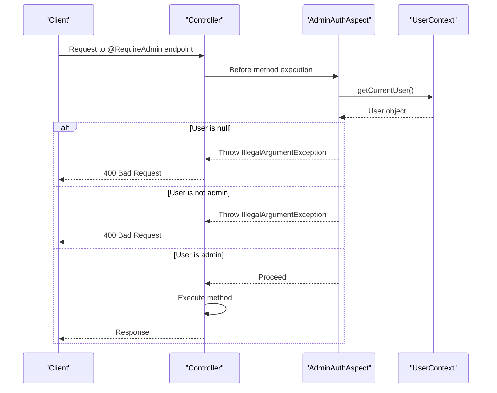
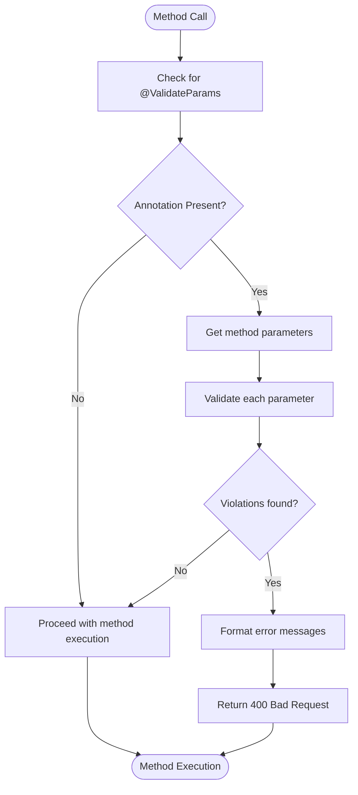
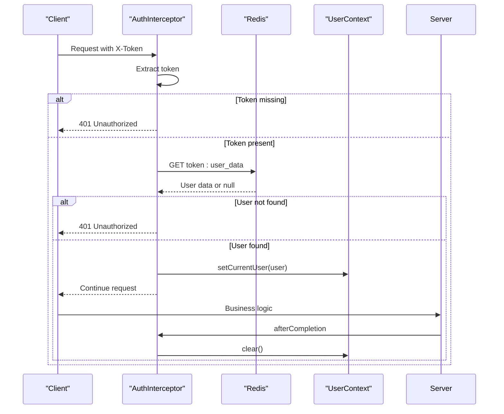
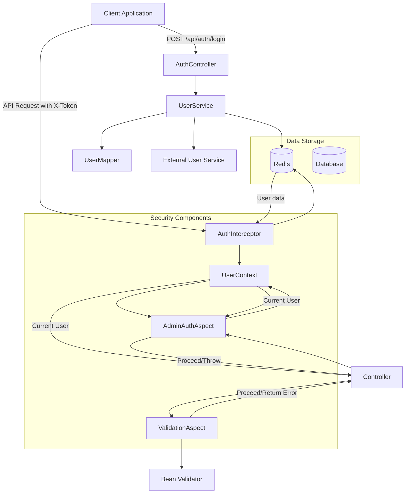

# Security Architecture

<cite>
**Referenced Files in This Document**   
- [RequireAdmin.java](file://src/main/java/com/example/onlinestore/annotation/RequireAdmin.java)
- [ValidateParams.java](file://src/main/java/com/example/onlinestore/annotation/ValidateParams.java)
- [AdminAuthAspect.java](file://src/main/java/com/example/onlinestore/aspect/AdminAuthAspect.java)
- [ValidationAspect.java](file://src/main/java/com/example/onlinestore/aspect/ValidationAspect.java)
- [AuthInterceptor.java](file://src/main/java/com/example/onlinestore/interceptor/AuthInterceptor.java)
- [AuthController.java](file://src/main/java/com/example/onlinestore/controller/AuthController.java)
- [UserContext.java](file://src/main/java/com/example/onlinestore/context/UserContext.java)
- [UserService.java](file://src/main/java/com/example/onlinestore/service/UserService.java)
- [UserServiceImpl.java](file://src/main/java/com/example/onlinestore/service/impl/UserServiceImpl.java)
- [WebConfig.java](file://src/main/java/com/example/onlinestore/config/WebConfig.java)
- [LoginRequest.java](file://src/main/java/com/example/onlinestore/dto/LoginRequest.java)
- [LoginResponse.java](file://src/main/java/com/example/onlinestore/dto/LoginResponse.java)
- [User.java](file://src/main/java/com/example/onlinestore/model/User.java)
- [schema.sql](file://src/main/resources/db/schema.sql)
- [application.yml](file://src/main/resources/application.yml)
</cite>

## Table of Contents
1. [Introduction](#introduction)
2. [Authentication Mechanism](#authentication-mechanism)
3. [Authorization with Role-Based Access Control](#authorization-with-role-based-access-control)
4. [Input Validation with AOP](#input-validation-with-aop)
5. [Request Filtering with AuthInterceptor](#request-filtering-with-authinterceptor)
6. [System Context and Component Interactions](#system-context-and-component-interactions)
7. [Cross-Cutting Concerns](#cross-cutting-concerns)
8. [Security Best Practices and Vulnerability Mitigation](#security-best-practices-and-vulnerability-mitigation)
9. [Conclusion](#conclusion)

## Introduction
The online-store application implements a comprehensive security architecture using Spring AOP, interceptors, and token-based authentication. This document details the design and implementation of security components including authentication, authorization, input validation, and request filtering. The system uses a layered approach with cross-cutting concerns handled through aspects and interceptors, ensuring separation of concerns and maintainability.

## Authentication Mechanism

The application implements a token-based authentication flow that begins with user login and continues through request validation for subsequent API calls. The authentication process follows these steps:

1. User submits credentials via POST /api/auth/login
2. System validates credentials against configured admin credentials or external user service
3. Upon successful authentication, a UUID-based token is generated and returned to the client
4. Token is stored in Redis with user information and expiration time
5. Client includes token in X-Token header for subsequent requests
6. AuthInterceptor validates the token on each request

The authentication flow ensures that only authenticated users can access protected endpoints while maintaining statelessness through token-based identification.

**Section sources**
- [AuthController.java](file://src/main/java/com/example/onlinestore/controller/AuthController.java#L29-L44)
- [UserServiceImpl.java](file://src/main/java/com/example/onlinestore/service/impl/UserServiceImpl.java#L67-L139)
- [LoginRequest.java](file://src/main/java/com/example/onlinestore/dto/LoginRequest.java#L3-L22)
- [LoginResponse.java](file://src/main/java/com/example/onlinestore/dto/LoginResponse.java#L5-L24)

## Authorization with Role-Based Access Control

The application implements role-based access control through the @RequireAdmin annotation and AdminAuthAspect. This mechanism restricts access to administrative functionality based on user identity.

The @RequireAdmin annotation is applied to controller methods that require administrative privileges:

```java
@RequireAdmin
public ResponseEntity<?> adminOnlyMethod() {
    // Method implementation
}
```

The AdminAuthAspect processes this annotation by checking if the current user's username matches the configured admin username (default: "admin"). The aspect retrieves the current user from UserContext and validates their administrative status before allowing method execution. If the user is not authenticated or not an administrator, an IllegalArgumentException is thrown with a localized error message.

This approach provides a declarative way to secure endpoints without embedding authorization logic within business methods, promoting cleaner code and consistent security policies.



**Diagram sources**
- [RequireAdmin.java](file://src/main/java/com/example/onlinestore/annotation/RequireAdmin.java#L8-L11)
- [AdminAuthAspect.java](file://src/main/java/com/example/onlinestore/aspect/AdminAuthAspect.java#L38-L71)
- [UserContext.java](file://src/main/java/com/example/onlinestore/context/UserContext.java#L5-L19)

**Section sources**
- [AdminAuthAspect.java](file://src/main/java/com/example/onlinestore/aspect/AdminAuthAspect.java#L38-L71)
- [RequireAdmin.java](file://src/main/java/com/example/onlinestore/annotation/RequireAdmin.java#L8-L11)

## Input Validation with AOP

The application implements input validation using the @ValidateParams annotation and ValidationAspect, leveraging JSR-303 bean validation. This aspect-oriented approach separates validation logic from business logic, ensuring consistent validation across the application.

The @ValidateParams annotation is applied to controller methods that require parameter validation:

```java
@ValidateParams
public ResponseEntity<?> someMethod(@Valid SomeRequest request) {
    // Method implementation
}
```

The ValidationAspect uses Spring's Validator to validate all method parameters when the @ValidateParams annotation is present. It iterates through each parameter, performs validation, and collects any constraint violations. If violations are found, the aspect returns a 400 Bad Request response with localized error messages. If validation passes, the method execution proceeds normally.

This implementation provides centralized validation handling, reducing code duplication and ensuring consistent error responses across all validated endpoints.



**Diagram sources**
- [ValidateParams.java](file://src/main/java/com/example/onlinestore/annotation/ValidateParams.java#L8-L11)
- [ValidationAspect.java](file://src/main/java/com/example/onlinestore/aspect/ValidationAspect.java#L36-L79)

**Section sources**
- [ValidationAspect.java](file://src/main/java/com/example/onlinestore/aspect/ValidationAspect.java#L36-L79)
- [ValidateParams.java](file://src/main/java/com/example/onlinestore/annotation/ValidateParams.java#L8-L11)

## Request Filtering with AuthInterceptor

The AuthInterceptor implements request filtering for authentication, acting as a gateway for all incoming requests. Registered through WebConfig, it applies to all endpoints under /api/** except the login endpoint.

The interceptor follows this process:
1. Extract X-Token header from incoming request
2. If token is missing, return 401 Unauthorized
3. Retrieve user information from Redis using the token
4. If user is not found, return 401 Unauthorized
5. Set the user in UserContext for downstream components
6. Clear UserContext after request completion

This interceptor-based approach ensures that authentication is consistently applied across all protected endpoints while maintaining separation from business logic. The afterCompletion method clears the UserContext to prevent thread-local variable leaks in pooled thread environments.



**Diagram sources**
- [AuthInterceptor.java](file://src/main/java/com/example/onlinestore/interceptor/AuthInterceptor.java#L15-L49)
- [WebConfig.java](file://src/main/java/com/example/onlinestore/config/WebConfig.java#L10-L21)

**Section sources**
- [AuthInterceptor.java](file://src/main/java/com/example/onlinestore/interceptor/AuthInterceptor.java#L15-L49)
- [WebConfig.java](file://src/main/java/com/example/onlinestore/config/WebConfig.java#L10-L21)

## System Context and Component Interactions

The security components work together to provide a comprehensive security layer for the application. The following diagram illustrates the interactions between security components:



**Diagram sources**
- [AuthController.java](file://src/main/java/com/example/onlinestore/controller/AuthController.java#L17-L45)
- [UserServiceImpl.java](file://src/main/java/com/example/onlinestore/service/impl/UserServiceImpl.java#L31-L193)
- [AuthInterceptor.java](file://src/main/java/com/example/onlinestore/interceptor/AuthInterceptor.java#L15-L49)
- [UserContext.java](file://src/main/java/com/example/onlinestore/context/UserContext.java#L5-L19)
- [AdminAuthAspect.java](file://src/main/java/com/example/onlinestore/aspect/AdminAuthAspect.java#L38-L71)
- [ValidationAspect.java](file://src/main/java/com/example/onlinestore/aspect/ValidationAspect.java#L36-L79)

## Cross-Cutting Concerns

### Error Handling
The security architecture implements consistent error handling through exceptions and localized messages. Authentication failures return 401 Unauthorized, authorization failures return 400 Bad Request, and validation failures return 400 Bad Request with detailed error messages. All error messages are localized using MessageSource, supporting internationalization.

### Logging
Comprehensive logging is implemented throughout the security components:
- AuthInterceptor logs authentication attempts
- AdminAuthAspect logs authorization decisions
- ValidationAspect logs validation failures
- UserServiceImpl logs user creation and token updates

Log levels are appropriately set with warnings for security-related events and errors for system failures.

### Performance Impact of AOP
The AOP implementations have minimal performance impact:
- AdminAuthAspect performs a simple string comparison
- ValidationAspect leverages Spring's optimized validation framework
- AuthInterceptor's Redis lookup is typically sub-millisecond

The aspects are applied only to specific endpoints through annotations, avoiding unnecessary processing for non-secured methods.

**Section sources**
- [AuthController.java](file://src/main/java/com/example/onlinestore/controller/AuthController.java#L34-L42)
- [AdminAuthAspect.java](file://src/main/java/com/example/onlinestore/aspect/AdminAuthAspect.java#L57-L67)
- [ValidationAspect.java](file://src/main/java/com/example/onlinestore/aspect/ValidationAspect.java#L70-L71)
- [AuthInterceptor.java](file://src/main/java/com/example/onlinestore/interceptor/AuthInterceptor.java#L27-L29)
- [UserServiceImpl.java](file://src/main/java/com/example/onlinestore/service/impl/UserServiceImpl.java#L74-L77)

## Security Best Practices and Vulnerability Mitigation

### Implemented Best Practices
- **Token-based authentication**: Stateless authentication using UUID tokens
- **Secure token storage**: Tokens stored in Redis with expiration
- **Input validation**: Comprehensive validation using JSR-303
- **Role-based access control**: Declarative authorization with @RequireAdmin
- **Separation of concerns**: Security logic separated from business logic
- **Logging and monitoring**: Comprehensive security event logging
- **Internationalization**: Localized error messages to prevent information leakage

### Potential Vulnerabilities and Mitigations
- **Brute force attacks**: Mitigated by external user service rate limiting
- **Token theft**: Mitigated by short token expiration (1 day)
- **Session fixation**: Mitigated by generating new tokens on each login
- **Information leakage**: Mitigated by generic error messages
- **Redis exposure**: Mitigated by network isolation and authentication

### Recommended Enhancements
- Implement token refresh mechanism
- Add rate limiting for login attempts
- Implement multi-factor authentication for admin accounts
- Add token revocation endpoint
- Implement more granular role-based access control
- Add audit logging for security-critical operations

**Section sources**
- [application.yml](file://src/main/resources/application.yml#L45-L48)
- [UserServiceImpl.java](file://src/main/java/com/example/onlinestore/service/impl/UserServiceImpl.java#L53)
- [AuthInterceptor.java](file://src/main/java/com/example/onlinestore/interceptor/AuthInterceptor.java#L25-L38)
- [schema.sql](file://src/main/resources/db/schema.sql#L1-L8)

## Conclusion
The online-store application implements a robust security architecture using Spring's AOP capabilities, interceptors, and token-based authentication. The design effectively separates security concerns from business logic through annotations and aspects, promoting maintainability and consistency. The system provides comprehensive authentication, authorization, and input validation while addressing cross-cutting concerns like error handling, logging, and performance. By following security best practices and implementing appropriate mitigations, the application establishes a solid foundation for protecting user data and system integrity. Future enhancements could further strengthen security by implementing additional controls like rate limiting and multi-factor authentication.