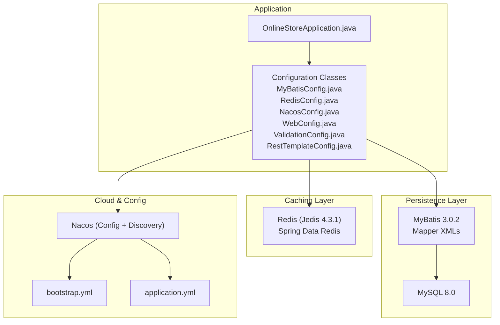
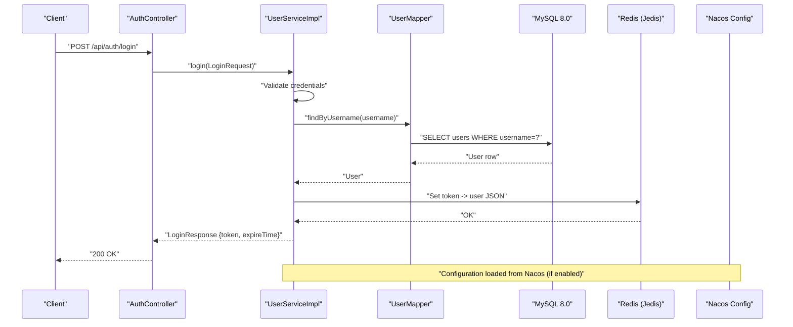
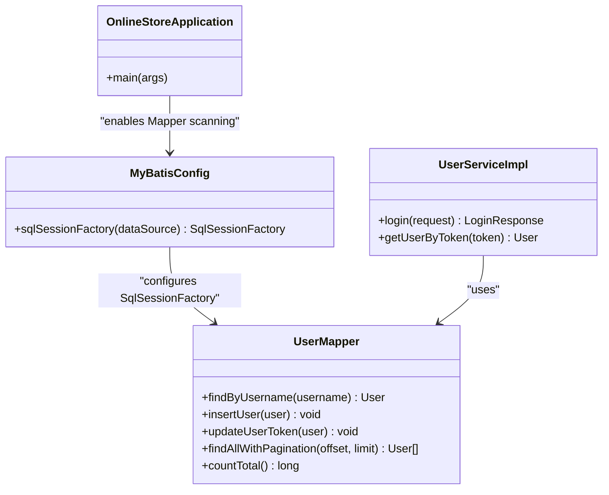
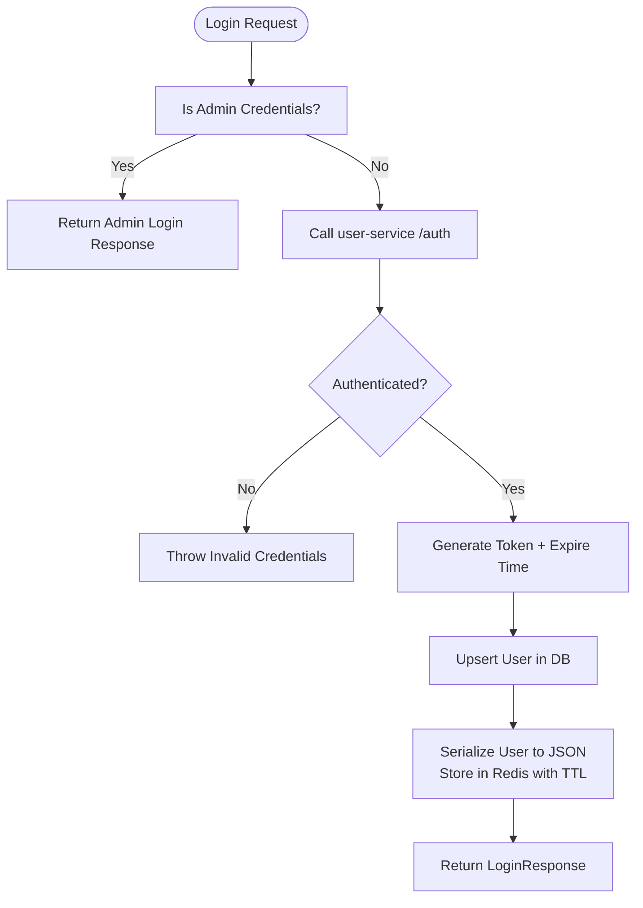
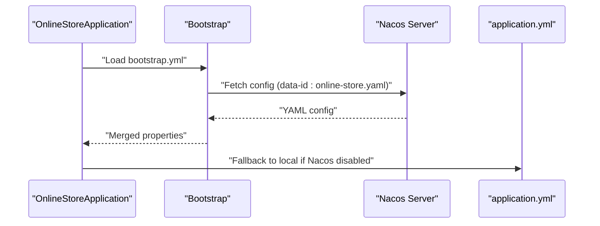
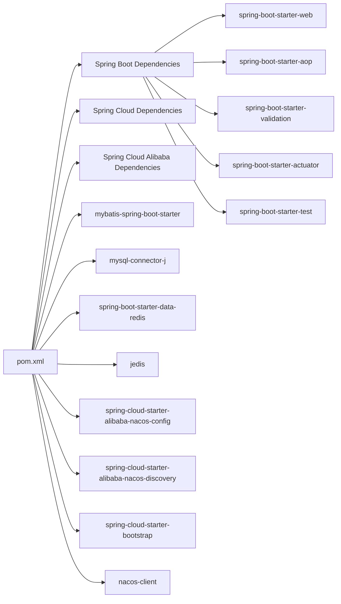

# Technology Stack & Dependencies

<cite>
**Referenced Files in This Document**
- [pom.xml](file://pom.xml)
- [OnlineStoreApplication.java](file://src/main/java/com/example/onlinestore/OnlineStoreApplication.java)
- [application.yml](file://src/main/resources/application.yml)
- [bootstrap.yml](file://src/main/resources/bootstrap.yml)
- [MyBatisConfig.java](file://src/main/java/com/example/onlinestore/config/MyBatisConfig.java)
- [RedisConfig.java](file://src/main/java/com/example/onlinestore/config/RedisConfig.java)
- [NacosConfig.java](file://src/main/java/com/example/onlinestore/config/NacosConfig.java)
- [LocalConfigProperties.java](file://src/main/java/com/example/onlinestore/config/LocalConfigProperties.java)
- [WebConfig.java](file://src/main/java/com/example/onlinestore/config/WebConfig.java)
- [ValidationConfig.java](file://src/main/java/com/example/onlinestore/config/ValidationConfig.java)
- [RestTemplateConfig.java](file://src/main/java/com/example/onlinestore/config/RestTemplateConfig.java)
- [UserServiceImpl.java](file://src/main/java/com/example/onlinestore/service/impl/UserServiceImpl.java)
- [schema.sql](file://src/main/resources/db/schema.sql)
</cite>

## Table of Contents
1. [Introduction](#introduction)
2. [Project Structure](#project-structure)
3. [Core Components](#core-components)
4. [Architecture Overview](#architecture-overview)
5. [Detailed Component Analysis](#detailed-component-analysis)
6. [Dependency Analysis](#dependency-analysis)
7. [Performance Considerations](#performance-considerations)
8. [Troubleshooting Guide](#troubleshooting-guide)
9. [Conclusion](#conclusion)
10. [Appendices](#appendices)

## Introduction
This section documents the technology stack and dependencies used by the online-store application. It explains how Spring Boot 3.1.5, Spring Cloud 2022.0.4, MyBatis 3.0.2, MySQL 8.0, Redis (Jedis 4.3.1), and Nacos are integrated within the Spring ecosystem. It also covers the roles of key dependencies declared in the Maven POM, including Spring Web, AOP, Validation, and Test. Version compatibility, rationale for technology choices, and guidance for managing and extending dependencies are included, along with troubleshooting tips for common issues.

## Project Structure
The application follows a layered Spring Boot structure:
- Application entry point annotated with Spring Boot and MyBatis Mapper scanning
- Configuration classes for MyBatis, Redis, Nacos, Web MVC, Validation, and RestTemplate
- Controllers, Services, and Mappers for business logic and persistence
- YAML configuration files for local and Nacos-managed settings
- Database schema for persistence

**Diagram sources**
- [OnlineStoreApplication.java](file://src/main/java/com/example/onlinestore/OnlineStoreApplication.java#L1-L15)
- [MyBatisConfig.java](file://src/main/java/com/example/onlinestore/config/MyBatisConfig.java#L1-L27)
- [RedisConfig.java](file://src/main/java/com/example/onlinestore/config/RedisConfig.java#L1-L15)
- [NacosConfig.java](file://src/main/java/com/example/onlinestore/config/NacosConfig.java#L1-L29)
- [WebConfig.java](file://src/main/java/com/example/onlinestore/config/WebConfig.java#L1-L21)
- [ValidationConfig.java](file://src/main/java/com/example/onlinestore/config/ValidationConfig.java#L1-L15)
- [RestTemplateConfig.java](file://src/main/java/com/example/onlinestore/config/RestTemplateConfig.java#L1-L14)
- [application.yml](file://src/main/resources/application.yml#L1-L48)
- [bootstrap.yml](file://src/main/resources/bootstrap.yml#L1-L17)
- [schema.sql](file://src/main/resources/db/schema.sql#L1-L8)

**Section sources**
- [OnlineStoreApplication.java](file://src/main/java/com/example/onlinestore/OnlineStoreApplication.java#L1-L15)
- [pom.xml](file://pom.xml#L1-L169)

## Core Components
- Spring Boot 3.1.5: Provides application bootstrapping, auto-configuration, embedded server, Actuator, and starter dependencies.
- Spring Cloud 2022.0.4: Enables cloud integration via dependency management and Bootstrap for Nacos.
- MyBatis 3.0.2: ORM framework with Spring Boot starter for simplified configuration and Mapper scanning.
- MySQL 8.0: Relational database for persistent storage.
- Redis (Jedis 4.3.1) + Spring Data Redis: Caching and session-like storage for user tokens and JSON payloads.
- Nacos: Centralized configuration and service discovery.

Key dependency roles in the POM:
- Spring Web: REST endpoints and MVC infrastructure.
- AOP: Aspect-oriented concerns (e.g., validation and admin auth aspects).
- Validation: Bean validation support via Spring Boot Starter Validation.
- Test: Unit/integration testing with JUnit and Spring Boot Test.

How these integrate within the Spring ecosystem:
- Spring Boot manages versions and auto-configures components.
- Spring Cloud aligns with Spring Boot’s versioning and provides Nacos integration.
- MyBatis integrates with Spring via the MyBatis Spring Boot Starter and Mapper scanning.
- Redis is configured via Spring Data Redis and Jedis client.
- Nacos is enabled via Spring Cloud Alibaba starters and Bootstrap.

**Section sources**
- [pom.xml](file://pom.xml#L1-L169)
- [OnlineStoreApplication.java](file://src/main/java/com/example/onlinestore/OnlineStoreApplication.java#L1-L15)
- [MyBatisConfig.java](file://src/main/java/com/example/onlinestore/config/MyBatisConfig.java#L1-L27)
- [RedisConfig.java](file://src/main/java/com/example/onlinestore/config/RedisConfig.java#L1-L15)
- [NacosConfig.java](file://src/main/java/com/example/onlinestore/config/NacosConfig.java#L1-L29)
- [application.yml](file://src/main/resources/application.yml#L1-L48)
- [bootstrap.yml](file://src/main/resources/bootstrap.yml#L1-L17)

## Architecture Overview
The application architecture combines Spring Boot, MyBatis, Redis, MySQL, and Nacos. The runtime flow includes:
- HTTP requests handled by Spring MVC controllers
- Business logic executed by services
- Persistence via MyBatis mapped statements and MySQL
- Caching via Redis for token and user data
- Configuration and discovery via Nacos

**Diagram sources**
- [AuthController.java](file://src/main/java/com/example/onlinestore/controller/AuthController.java#L1-L45)
- [UserServiceImpl.java](file://src/main/java/com/example/onlinestore/service/impl/UserServiceImpl.java#L1-L193)
- [schema.sql](file://src/main/resources/db/schema.sql#L1-L8)
- [RedisConfig.java](file://src/main/java/com/example/onlinestore/config/RedisConfig.java#L1-L15)
- [application.yml](file://src/main/resources/application.yml#L1-L48)
- [bootstrap.yml](file://src/main/resources/bootstrap.yml#L1-L17)

## Detailed Component Analysis

### Spring Boot 3.1.5
- Role: Bootstraps the application, enables auto-configuration, and provides starters for Web, AOP, Validation, Actuator, and Test.
- Integration: Managed via Spring Boot Dependencies in dependencyManagement; plugin alignment ensures consistent build behavior.
- Compatibility: Aligns with Java 17 and Spring Cloud 2022.0.4.

Implementation highlights:
- Application class enables Mapper scanning and refresh scope for dynamic config updates.

**Section sources**
- [pom.xml](file://pom.xml#L1-L169)
- [OnlineStoreApplication.java](file://src/main/java/com/example/onlinestore/OnlineStoreApplication.java#L1-L15)

### Spring Cloud 2022.0.4
- Role: Provides cloud integration via dependency management and Bootstrap for Nacos.
- Integration: Spring Cloud Dependencies imported in dependencyManagement; Bootstrap starter included for early configuration loading.
- Compatibility: Designed to work with Spring Boot 3.x; aligns with Spring Boot version in use.

**Section sources**
- [pom.xml](file://pom.xml#L1-L169)
- [bootstrap.yml](file://src/main/resources/bootstrap.yml#L1-L17)

### MyBatis 3.0.2
- Role: ORM for SQL mapping and database access.
- Integration: Spring Boot Starter simplifies configuration; Mapper scanning enabled at application level; custom SqlSessionFactory bean sets underscore-to-camel-case mapping and mapper locations.
- Persistence: Mappers and XML files under resources/mapper; schema.sql defines the users table.

**Diagram sources**
- [OnlineStoreApplication.java](file://src/main/java/com/example/onlinestore/OnlineStoreApplication.java#L1-L15)
- [MyBatisConfig.java](file://src/main/java/com/example/onlinestore/config/MyBatisConfig.java#L1-L27)
- [UserServiceImpl.java](file://src/main/java/com/example/onlinestore/service/impl/UserServiceImpl.java#L1-L193)

**Section sources**
- [pom.xml](file://pom.xml#L1-L169)
- [MyBatisConfig.java](file://src/main/java/com/example/onlinestore/config/MyBatisConfig.java#L1-L27)
- [schema.sql](file://src/main/resources/db/schema.sql#L1-L8)

### MySQL 8.0
- Role: Persistent relational store for user data.
- Configuration: JDBC URL, driver, and credentials configured in application.yml; schema.sql creates the users table.
- Access: Managed by DataSource and MyBatis configuration.

**Section sources**
- [application.yml](file://src/main/resources/application.yml#L1-L48)
- [schema.sql](file://src/main/resources/db/schema.sql#L1-L8)

### Redis (Jedis 4.3.1) + Spring Data Redis
- Role: Caching for user tokens and JSON payloads; used to store user sessions keyed by token.
- Integration: StringRedisTemplate bean configured; Jedis client version managed via dependencyManagement; pool settings configured in application.yml.
- Usage: Token-to-user JSON serialization/deserialization and TTL-based expiration.

**Diagram sources**
- [UserServiceImpl.java](file://src/main/java/com/example/onlinestore/service/impl/UserServiceImpl.java#L1-L193)
- [RedisConfig.java](file://src/main/java/com/example/onlinestore/config/RedisConfig.java#L1-L15)
- [application.yml](file://src/main/resources/application.yml#L1-L48)

**Section sources**
- [pom.xml](file://pom.xml#L1-L169)
- [RedisConfig.java](file://src/main/java/com/example/onlinestore/config/RedisConfig.java#L1-L15)
- [application.yml](file://src/main/resources/application.yml#L1-L48)

### Nacos for Configuration Management
- Role: Centralized configuration and service discovery.
- Integration: Spring Cloud Alibaba Nacos Config and Discovery starters; Bootstrap loads Nacos config early; Conditional enablement via property; Local fallback when Nacos is disabled.
- Configuration: bootstrap.yml controls Nacos server address, namespace, group, and extension configs; application.yml contains local defaults.

**Diagram sources**
- [bootstrap.yml](file://src/main/resources/bootstrap.yml#L1-L17)
- [application.yml](file://src/main/resources/application.yml#L1-L48)
- [NacosConfig.java](file://src/main/java/com/example/onlinestore/config/NacosConfig.java#L1-L29)
- [LocalConfigProperties.java](file://src/main/java/com/example/onlinestore/config/LocalConfigProperties.java#L1-L12)

**Section sources**
- [pom.xml](file://pom.xml#L1-L169)
- [bootstrap.yml](file://src/main/resources/bootstrap.yml#L1-L17)
- [NacosConfig.java](file://src/main/java/com/example/onlinestore/config/NacosConfig.java#L1-L29)
- [LocalConfigProperties.java](file://src/main/java/com/example/onlinestore/config/LocalConfigProperties.java#L1-L12)

### Spring Web, AOP, Validation, Test
- Spring Web: REST controllers and MVC infrastructure.
- AOP: Interceptors and aspects (e.g., validation and admin auth) are wired via configuration classes.
- Validation: Bean validation support via Spring Boot Starter Validation; custom Validator bean provided.
- Test: Spring Boot Test starter for unit and integration tests.

**Section sources**
- [pom.xml](file://pom.xml#L1-L169)
- [WebConfig.java](file://src/main/java/com/example/onlinestore/config/WebConfig.java#L1-L21)
- [ValidationConfig.java](file://src/main/java/com/example/onlinestore/config/ValidationConfig.java#L1-L15)

## Dependency Analysis
The dependency graph shows how core modules depend on each other and external systems.

**Diagram sources**
- [pom.xml](file://pom.xml#L1-L169)

**Section sources**
- [pom.xml](file://pom.xml#L1-L169)

## Performance Considerations
- Redis pool sizing: Tune max-active, max-idle, min-idle, and max-wait in application.yml to match expected concurrency and latency targets.
- MyBatis pagination: Use efficient LIMIT/OFFSET queries and consider indexing on frequently filtered columns.
- Connection pooling: Ensure MySQL and Redis pools are sized appropriately for workload.
- Caching strategy: Evaluate cache invalidation and TTL policies to balance freshness and performance.
- Nacos refresh: Enable refresh scope selectively to avoid unnecessary reload overhead.

[No sources needed since this section provides general guidance]

## Troubleshooting Guide
Common issues and resolutions:
- Nacos connectivity: Verify NACOS_SERVER_ADDR and namespace/group in bootstrap.yml; confirm Nacos server availability.
- Property precedence: When Nacos is enabled, properties may override local ones; disable via spring.cloud.nacos.enabled if local-only configuration is desired.
- Redis connectivity: Confirm host/port/password in application.yml; ensure Redis server is reachable.
- MySQL connectivity: Validate JDBC URL, driver-class-name, username, and password in application.yml.
- MyBatis mapping: Ensure mapper XMLs are on the classpath and SqlSessionFactory is configured to scan them.
- AOP/interceptors: Confirm WebConfig registers interceptors for intended paths and excludes.
- Validation errors: Bean validation exceptions surface as 400 responses; review DTOs and constraints.
- Test failures: Exclude conflicting transitive dependencies if tests fail due to version mismatches.

**Section sources**
- [bootstrap.yml](file://src/main/resources/bootstrap.yml#L1-L17)
- [application.yml](file://src/main/resources/application.yml#L1-L48)
- [NacosConfig.java](file://src/main/java/com/example/onlinestore/config/NacosConfig.java#L1-L29)
- [LocalConfigProperties.java](file://src/main/java/com/example/onlinestore/config/LocalConfigProperties.java#L1-L12)
- [RedisConfig.java](file://src/main/java/com/example/onlinestore/config/RedisConfig.java#L1-L15)
- [MyBatisConfig.java](file://src/main/java/com/example/onlinestore/config/MyBatisConfig.java#L1-L27)
- [WebConfig.java](file://src/main/java/com/example/onlinestore/config/WebConfig.java#L1-L21)
- [pom.xml](file://pom.xml#L1-L169)

## Conclusion
The online-store application leverages a modern Spring Boot 3.1.5 stack with Spring Cloud 2022.0.4 for cloud integration, MyBatis for ORM, MySQL 8.0 for persistence, Redis (Jedis) for caching, and Nacos for configuration management. The POM centralizes version management and aligns dependencies for compatibility. The configuration classes wire components seamlessly, while YAML files provide flexible runtime settings with Nacos-backed overrides. Following the guidance here will help maintain, extend, and troubleshoot the stack effectively.

[No sources needed since this section summarizes without analyzing specific files]

## Appendices

### Version Compatibility Notes
- Spring Boot 3.1.5 requires Java 17.
- Spring Cloud 2022.0.4 aligns with Spring Boot 3.x and integrates with Spring Cloud Alibaba.
- MyBatis Spring Boot Starter 3.0.2 works with Spring Boot 3.x.
- MySQL Connector/J 8.x is compatible with MySQL 8.0.
- Jedis 4.3.1 integrates with Spring Data Redis.
- Nacos Config and Discovery starters require Bootstrap for early loading.

**Section sources**
- [pom.xml](file://pom.xml#L1-L169)
- [application.yml](file://src/main/resources/application.yml#L1-L48)
- [bootstrap.yml](file://src/main/resources/bootstrap.yml#L1-L17)

### Dependency Management via Maven
- Use dependencyManagement to centralize versions and avoid duplication.
- Import Spring Boot, Spring Cloud, and Spring Cloud Alibaba BOMs to ensure compatibility.
- Add or remove starters based on features (Web, AOP, Validation, Test, Actuator).
- Keep client libraries (e.g., nacos-client) aligned with Nacos starters.

**Section sources**
- [pom.xml](file://pom.xml#L1-L169)

### Updating or Extending the Stack
- Update versions in properties and re-run dependency updates.
- When adding new features, include the minimal set of starters and ensure BOM alignment.
- For new persistence needs, add MyBatis or Spring Data JPA starters and configure accordingly.
- For additional caching, consider Redis repositories or other caches with proper serialization.

**Section sources**
- [pom.xml](file://pom.xml#L1-L169)