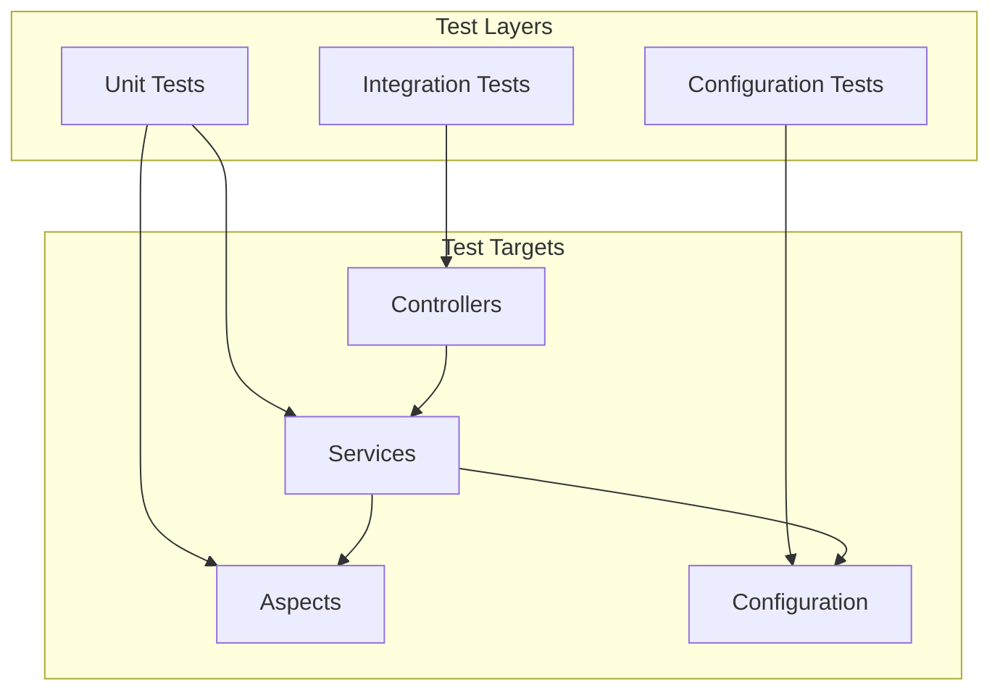
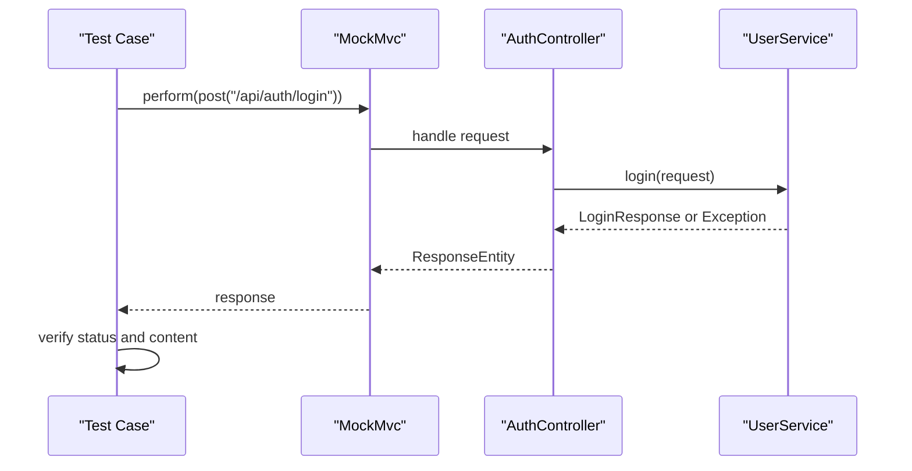
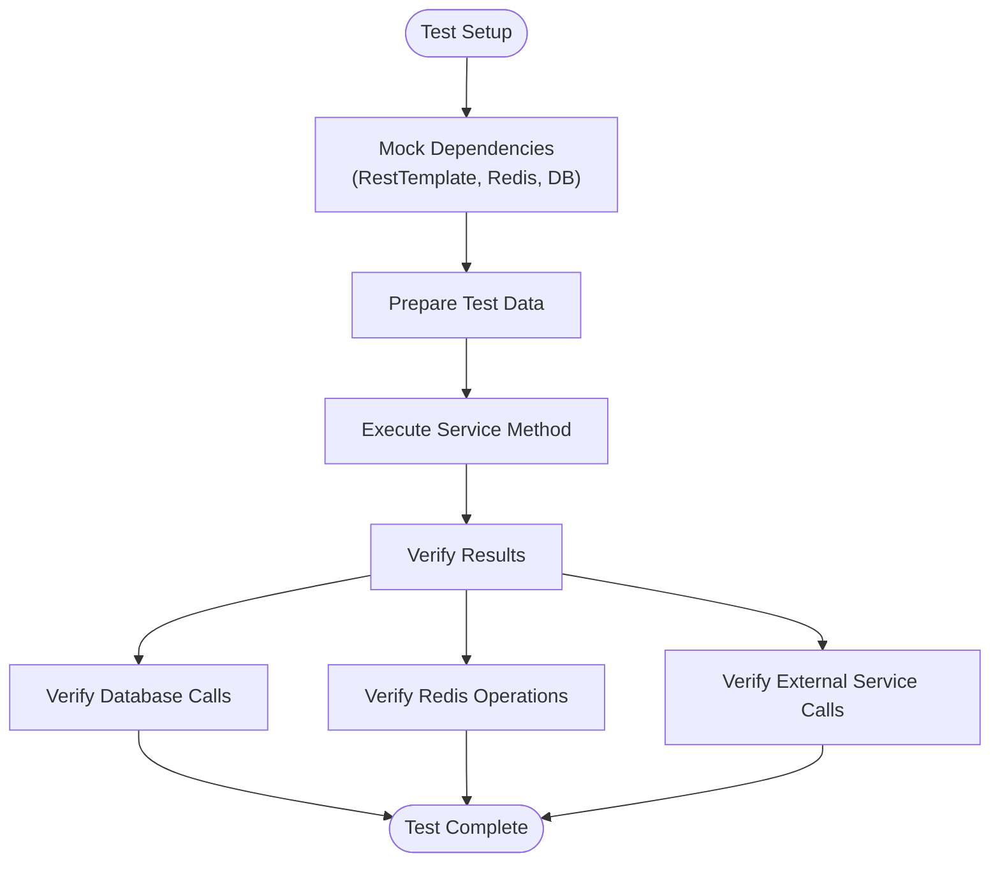
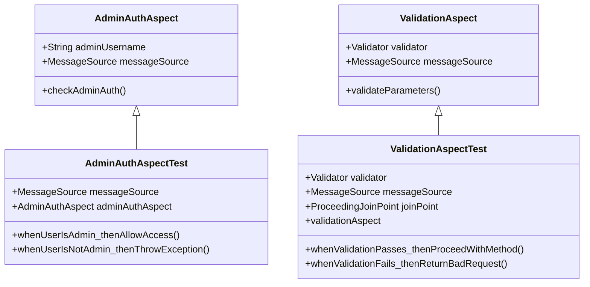
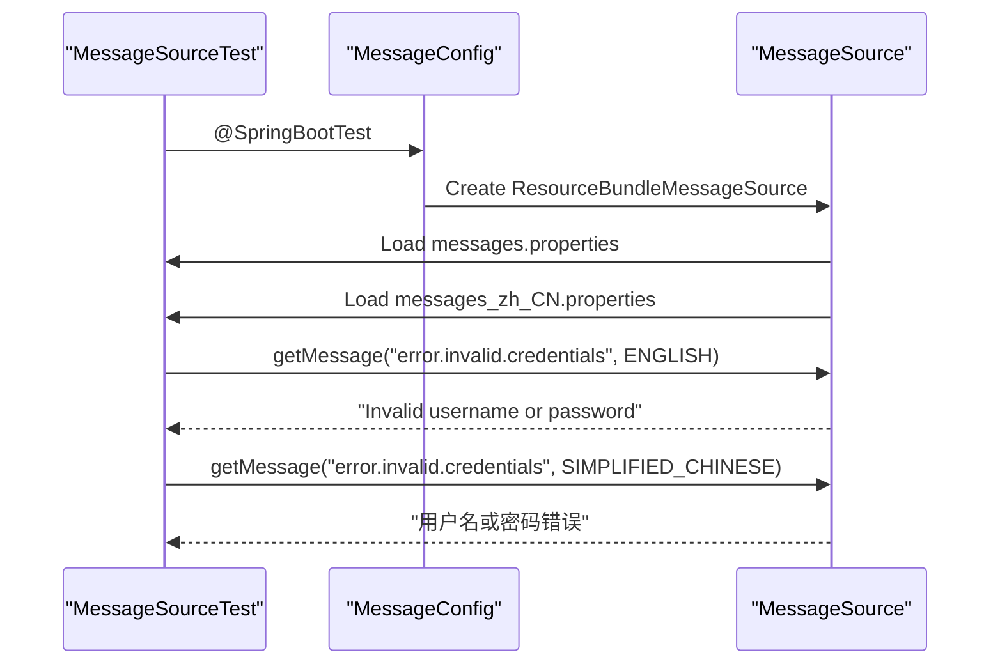
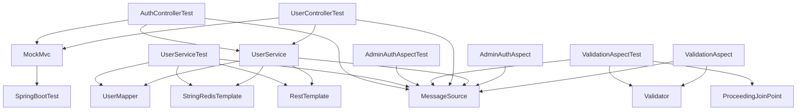

# Testing Strategy

<cite>
**Referenced Files in This Document**   
- [AuthControllerTest.java](file://src/test/java/com/example/onlinestore/controller/AuthControllerTest.java)
- [UserServiceTest.java](file://src/test/java/com/example/onlinestore/service/UserServiceTest.java)
- [AdminAuthAspectTest.java](file://src/test/java/com/example/onlinestore/aspect/AdminAuthAspectTest.java)
- [ValidationAspectTest.java](file://src/test/java/com/example/onlinestore/aspect/ValidationAspectTest.java)
- [MessageSourceTest.java](file://src/test/java/com/example/onlinestore/config/MessageSourceTest.java)
- [UserControllerTest.java](file://src/test/java/com/example/onlinestore/controller/UserControllerTest.java)
- [AuthController.java](file://src/main/java/com/example/onlinestore/controller/AuthController.java)
- [UserServiceImpl.java](file://src/main/java/com/example/onlinestore/service/impl/UserServiceImpl.java)
- [AdminAuthAspect.java](file://src/main/java/com/example/onlinestore/aspect/AdminAuthAspect.java)
- [ValidationAspect.java](file://src/main/java/com/example/onlinestore/aspect/ValidationAspect.java)
- [MessageConfig.java](file://src/main/java/com/example/onlinestore/config/MessageConfig.java)
- [messages.properties](file://src/main/resources/i18n/messages.properties)
- [messages_zh_CN.properties](file://src/main/resources/i18n/messages_zh_CN.properties)
- [pom.xml](file://pom.xml)
</cite>

## Table of Contents
1. [Introduction](#introduction)
2. [Test Structure and Framework](#test-structure-and-framework)
3. [Core Components](#core-components)
4. [Architecture Overview](#architecture-overview)
5. [Detailed Component Analysis](#detailed-component-analysis)
6. [Dependency Analysis](#dependency-analysis)
7. [Performance Considerations](#performance-considerations)
8. [Troubleshooting Guide](#troubleshooting-guide)
9. [Conclusion](#conclusion)

## Introduction
The online-store application employs a comprehensive testing strategy using JUnit 5 and Mockito to ensure code quality and reliability across all layers of the application. The test suite covers unit and integration testing for controllers, services, aspects, and configuration classes, with a strong emphasis on authentication flows, admin authorization, error handling, and internationalization. The testing approach leverages Spring Boot's testing support to provide realistic integration testing while using Mockito to isolate components and mock external dependencies such as RestTemplate, RedisTemplate, and MessageSource.

## Test Structure and Framework
The testing framework is built on JUnit 5 with Mockito for mocking, leveraging Spring Boot's testing annotations to enable integration testing. Tests are organized by component type in the `src/test/java/com/example/onlinestore/` directory, mirroring the main application structure with separate packages for controllers, services, aspects, and configuration. The test suite utilizes `@SpringBootTest` for integration tests that require the full application context and `@ExtendWith(MockitoExtension.class)` for unit tests that focus on isolated components. Key testing annotations include `@MockBean` for creating mock beans in the Spring context and `@InjectMocks` for injecting mocked dependencies into the class under test.

**Section sources**
- [pom.xml](file://pom.xml#L137-L148)

## Core Components

The core testing components include controller tests, service tests, aspect tests, and configuration tests, each designed to validate specific aspects of the application's functionality. Controller tests focus on HTTP request/response behavior, service tests validate business logic and data processing, aspect tests verify cross-cutting concerns like security and validation, and configuration tests ensure proper setup of application components.

**Section sources**
- [AuthControllerTest.java](file://src/test/java/com/example/onlinestore/controller/AuthControllerTest.java#L1-L147)
- [UserServiceTest.java](file://src/test/java/com/example/onlinestore/service/UserServiceTest.java#L1-L252)
- [AdminAuthAspectTest.java](file://src/test/java/com/example/onlinestore/aspect/AdminAuthAspectTest.java#L1-L106)
- [ValidationAspectTest.java](file://src/test/java/com/example/onlinestore/aspect/ValidationAspectTest.java#L1-L167)

## Architecture Overview

The testing architecture follows a layered approach with different test types targeting specific components:

**Diagram sources **
- [AuthControllerTest.java](file://src/test/java/com/example/onlinestore/controller/AuthControllerTest.java#L1-L147)
- [UserServiceTest.java](file://src/test/java/com/example/onlinestore/service/UserServiceTest.java#L1-L252)
- [AdminAuthAspectTest.java](file://src/test/java/com/example/onlinestore/aspect/AdminAuthAspectTest.java#L1-L106)
- [ValidationAspectTest.java](file://src/test/java/com/example/onlinestore/aspect/ValidationAspectTest.java#L1-L167)
- [MessageSourceTest.java](file://src/test/java/com/example/onlinestore/config/MessageSourceTest.java#L1-L84)

## Detailed Component Analysis

### Controller Testing
Controller tests validate the HTTP interface of the application, ensuring proper request handling, response formatting, and error conditions. The `AuthControllerTest` and `UserControllerTest` classes use `MockMvc` to simulate HTTP requests and verify responses without starting a full server. These tests cover successful operations, validation errors, and system errors, with special attention to internationalized error messages.

**Diagram sources **
- [AuthControllerTest.java](file://src/test/java/com/example/onlinestore/controller/AuthControllerTest.java#L1-L147)
- [AuthController.java](file://src/main/java/com/example/onlinestore/controller/AuthController.java#L1-L45)

**Section sources**
- [AuthControllerTest.java](file://src/test/java/com/example/onlinestore/controller/AuthControllerTest.java#L1-L147)
- [UserControllerTest.java](file://src/test/java/com/example/onlinestore/controller/UserControllerTest.java#L1-L128)

### Service Testing
Service tests focus on the business logic and data processing within the `UserServiceImpl` class. These tests use Mockito to mock dependencies such as `RestTemplate`, `UserMapper`, `StringRedisTemplate`, and `MessageSource`, allowing for isolated testing of the service's core functionality. The tests cover various scenarios including admin login, normal user login, token management, and error handling.

**Diagram sources **
- [UserServiceTest.java](file://src/test/java/com/example/onlinestore/service/UserServiceTest.java#L1-L252)
- [UserServiceImpl.java](file://src/main/java/com/example/onlinestore/service/impl/UserServiceImpl.java#L1-L193)

**Section sources**
- [UserServiceTest.java](file://src/test/java/com/example/onlinestore/service/UserServiceTest.java#L1-L252)

### Aspect Testing
Aspect tests validate the cross-cutting concerns implemented using Spring AOP. The `AdminAuthAspectTest` and `ValidationAspectTest` classes verify that the aspects properly intercept method calls and enforce security and validation rules. These tests use Mockito to mock the `MessageSource` for internationalized error messages and verify that the aspects throw appropriate exceptions when conditions are not met.

**Diagram sources **
- [AdminAuthAspectTest.java](file://src/test/java/com/example/onlinestore/aspect/AdminAuthAspectTest.java#L1-L106)
- [AdminAuthAspect.java](file://src/main/java/com/example/onlinestore/aspect/AdminAuthAspect.java#L1-L71)
- [ValidationAspectTest.java](file://src/test/java/com/example/onlinestore/aspect/ValidationAspectTest.java#L1-L167)
- [ValidationAspect.java](file://src/main/java/com/example/onlinestore/aspect/ValidationAspect.java#L1-L79)

**Section sources**
- [AdminAuthAspectTest.java](file://src/test/java/com/example/onlinestore/aspect/AdminAuthAspectTest.java#L1-L106)
- [ValidationAspectTest.java](file://src/test/java/com/example/onlinestore/aspect/ValidationAspectTest.java#L1-L167)

### Configuration Testing
Configuration tests ensure that the application's configuration classes are properly set up and that externalized configuration works as expected. The `MessageSourceTest` class verifies that internationalized messages are correctly loaded from property files and that the `MessageSource` can retrieve messages in different locales.

**Diagram sources **
- [MessageSourceTest.java](file://src/test/java/com/example/onlinestore/config/MessageSourceTest.java#L1-L84)
- [MessageConfig.java](file://src/main/java/com/example/onlinestore/config/MessageConfig.java#L1-L36)
- [messages.properties](file://src/main/resources/i18n/messages.properties#L1-L17)
- [messages_zh_CN.properties](file://src/main/resources/i18n/messages_zh_CN.properties#L1-L17)

**Section sources**
- [MessageSourceTest.java](file://src/test/java/com/example/onlinestore/config/MessageSourceTest.java#L1-L84)

## Dependency Analysis

The test suite has a well-defined dependency structure that enables effective testing of the application components:

**Diagram sources **
- [pom.xml](file://pom.xml#L137-L148)
- [AuthControllerTest.java](file://src/test/java/com/example/onlinestore/controller/AuthControllerTest.java#L1-L147)
- [UserServiceTest.java](file://src/test/java/com/example/onlinestore/service/UserServiceTest.java#L1-L252)
- [AdminAuthAspectTest.java](file://src/test/java/com/example/onlinestore/aspect/AdminAuthAspectTest.java#L1-L106)
- [ValidationAspectTest.java](file://src/test/java/com/example/onlinestore/aspect/ValidationAspectTest.java#L1-L167)
- [UserControllerTest.java](file://src/test/java/com/example/onlinestore/controller/UserControllerTest.java#L1-L128)

**Section sources**
- [pom.xml](file://pom.xml#L137-L148)

## Performance Considerations

The testing strategy includes considerations for performance testing, particularly for database and external service interactions. The use of mocked dependencies in unit tests ensures fast execution, while integration tests with `@SpringBootTest` provide realistic performance characteristics. The test suite avoids actual database connections by mocking the `UserMapper` interface, which allows for rapid test execution while still validating the service logic. For performance testing in CI/CD pipelines, it is recommended to add specific performance tests that measure response times under load and verify database query efficiency.

## Troubleshooting Guide

When encountering test failures, consider the following common issues and solutions:

1. **Mocking issues**: Ensure that all required dependencies are properly mocked using `@MockBean` or `@Mock`. Verify that mock behaviors are correctly set up with `when().thenReturn()` or `when().thenThrow()`.

2. **Internationalization problems**: Check that the `MessageSource` is properly configured and that message keys in test assertions match those in the properties files. Verify that the correct locale is being used in tests.

3. **Database state issues**: Since the tests use mocked data access objects, ensure that the mock behaviors accurately reflect the expected database state for each test scenario.

4. **Aspect weaving problems**: Verify that aspects are properly applied to the target methods by checking the `@Aspect` annotation and pointcut expressions.

5. **Configuration loading issues**: Ensure that test configuration files are correctly loaded and that property values are accessible through `@Value` annotations.

**Section sources**
- [AuthControllerTest.java](file://src/test/java/com/example/onlinestore/controller/AuthControllerTest.java#L1-L147)
- [UserServiceTest.java](file://src/test/java/com/example/onlinestore/service/UserServiceTest.java#L1-L252)
- [AdminAuthAspectTest.java](file://src/test/java/com/example/onlinestore/aspect/AdminAuthAspectTest.java#L1-L106)
- [ValidationAspectTest.java](file://src/test/java/com/example/onlinestore/aspect/ValidationAspectTest.java#L1-L167)

## Conclusion

The online-store application's testing strategy provides comprehensive coverage of all critical components using JUnit 5 and Mockito. The test suite effectively validates controller endpoints, service business logic, aspect-oriented programming concerns, and configuration settings. By leveraging Spring Boot's testing support and Mockito's mocking capabilities, the tests achieve a good balance between isolation and integration, ensuring both speed and realism. The strategy includes thorough testing of authentication flows, admin authorization, error conditions, and internationalization, with clear examples of mocking external dependencies like RestTemplate, RedisTemplate, and MessageSource. To further enhance the testing strategy, consider adding performance tests, security tests, and contract tests for external service interactions in the CI/CD pipeline.