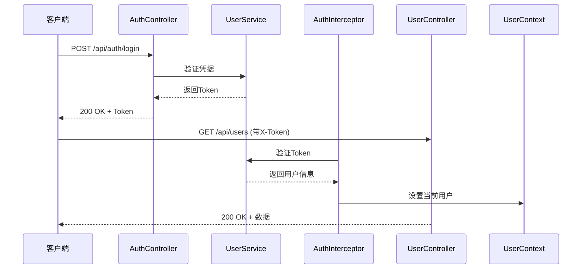

# API参考

<cite>
**本文档引用的文件**  
- [AuthController.java](file://src/main/java/com/example/onlinestore/controller/AuthController.java)
- [UserController.java](file://src/main/java/com/example/onlinestore/controller/UserController.java)
- [ProductController.java](file://src/main/java/com/example/onlinestore/controller/ProductController.java)
- [LoginRequest.java](file://src/main/java/com/example/onlinestore/dto/LoginRequest.java)
- [CreateProductRequest.java](file://src/main/java/com/example/onlinestore/dto/CreateProductRequest.java)
- [UserPageRequest.java](file://src/main/java/com/example/onlinestore/dto/UserPageRequest.java)
- [ProductPageRequest.java](file://src/main/java/com/example/onlinestore/dto/ProductPageRequest.java)
- [PageResponse.java](file://src/main/java/com/example/onlinestore/dto/PageResponse.java)
- [LoginResponse.java](file://src/main/java/com/example/onlinestore/dto/LoginResponse.java)
- [UserVO.java](file://src/main/java/com/example/onlinestore/dto/UserVO.java)
- [RequireAdmin.java](file://src/main/java/com/example/onlinestore/annotation/RequireAdmin.java)
- [AuthInterceptor.java](file://src/main/java/com/example/onlinestore/interceptor/AuthInterceptor.java)
- [UserService.java](file://src/main/java/com/example/onlinestore/service/UserService.java)
- [ProductService.java](file://src/main/java/com/example/onlinestore/service/ProductService.java)
- [application.yml](file://src/main/resources/application.yml)
</cite>

## 目录
1. [简介](#简介)
2. [认证机制](#认证机制)
3. [AuthController接口](#authcontroller接口)
4. [UserController接口](#usercontroller接口)
5. [ProductController接口](#productcontroller接口)
6. [分页查询规范](#分页查询规范)
7. [错误响应格式](#错误响应格式)
8. [常见错误码](#常见错误码)

## 简介
本API文档详细描述了online-store项目的公开RESTful端点，涵盖认证、用户管理和商品管理三大模块。所有接口均遵循统一的响应格式和错误处理机制，使用Token进行身份验证，并通过注解实现权限控制。

**Section sources**
- [AuthController.java](file://src/main/java/com/example/onlinestore/controller/AuthController.java#L1-L45)
- [UserController.java](file://src/main/java/com/example/onlinestore/controller/UserController.java#L1-L66)
- [ProductController.java](file://src/main/java/com/example/onlinestore/controller/ProductController.java#L1-L78)

## 认证机制
系统采用基于Token的认证机制。用户登录成功后获取Token，后续请求需在请求头中携带`X-Token`字段。认证由`AuthInterceptor`实现，未携带有效Token的请求将返回401状态码。

管理员权限通过`@RequireAdmin`注解标识，仅管理员账户可访问相关接口。



**Diagram sources**
- [AuthInterceptor.java](file://src/main/java/com/example/onlinestore/interceptor/AuthInterceptor.java#L1-L49)
- [RequireAdmin.java](file://src/main/java/com/example/onlinestore/annotation/RequireAdmin.java#L1-L11)

## AuthController接口

### 用户登录
- **HTTP方法**: POST
- **URL路径**: `/api/auth/login`
- **请求头**: 无特殊要求
- **请求体**: `LoginRequest`对象
- **认证方式**: 无需认证
- **权限要求**: 无

#### 请求体结构 (LoginRequest)
```json
{
  "username": "string",
  "password": "string"
}
```

#### 成功响应 (200 OK)
```json
{
  "token": "string",
  "expireTime": "2024-01-01T00:00:00"
}
```

#### curl示例
```bash
curl -X POST http://localhost:8080/api/auth/login \
  -H "Content-Type: application/json" \
  -d '{"username":"admin","password":"password"}'
```

**Section sources**
- [AuthController.java](file://src/main/java/com/example/onlinestore/controller/AuthController.java#L29-L44)
- [LoginRequest.java](file://src/main/java/com/example/onlinestore/dto/LoginRequest.java#L3-L22)
- [LoginResponse.java](file://src/main/java/com/example/onlinestore/dto/LoginResponse.java#L5-L24)

## UserController接口

### 获取用户列表
- **HTTP方法**: GET
- **URL路径**: `/api/users`
- **请求头**: `X-Token: <token>`
- **认证方式**: Token认证
- **权限要求**: 管理员 (`@RequireAdmin`)
- **参数验证**: 启用 (`@ValidateParams`)

#### 查询参数 (UserPageRequest)
| 参数名 | 类型 | 必填 | 默认值 | 说明 |
|-------|------|------|--------|------|
| pageNum | int | 否 | 1 | 页码，最小值1 |
| pageSize | int | 否 | 10 | 每页数量，范围1-100 |

#### 成功响应 (200 OK)
```json
{
  "records": [
    {
      "id": 1,
      "username": "admin",
      "createdAt": "2024-01-01T00:00:00",
      "updatedAt": "2024-01-01T00:00:00"
    }
  ],
  "total": 1,
  "pageNum": 1,
  "pageSize": 10
}
```

#### curl示例
```bash
curl -X GET "http://localhost:8080/api/users?pageNum=1&pageSize=10" \
  -H "X-Token: your-token-here"
```

**Section sources**
- [UserController.java](file://src/main/java/com/example/onlinestore/controller/UserController.java#L41-L66)
- [UserPageRequest.java](file://src/main/java/com/example/onlinestore/dto/UserPageRequest.java#L6-L29)
- [PageResponse.java](file://src/main/java/com/example/onlinestore/dto/PageResponse.java#L5-L42)
- [UserVO.java](file://src/main/java/com/example/onlinestore/dto/UserVO.java#L5-L42)

## ProductController接口

### 创建商品
- **HTTP方法**: POST
- **URL路径**: `/api/products`
- **请求头**: `X-Token: <token>`
- **请求体**: `CreateProductRequest`对象
- **认证方式**: Token认证
- **权限要求**: 管理员 (`@RequireAdmin`)
- **参数验证**: 启用 (`@ValidateParams`)

#### 请求体结构 (CreateProductRequest)
```json
{
  "name": "商品名称",
  "category": "商品分类",
  "price": 99.99
}
```

#### 成功响应 (200 OK)
返回创建的商品对象：
```json
{
  "id": 1,
  "name": "商品名称",
  "category": "商品分类",
  "price": 99.99,
  "createdAt": "2024-01-01T00:00:00",
  "updatedAt": "2024-01-01T00:00:00"
}
```

#### curl示例
```bash
curl -X POST http://localhost:8080/api/products \
  -H "Content-Type: application/json" \
  -H "X-Token: your-token-here" \
  -d '{"name":"新商品","category":"电子产品","price":999.99}'
```

### 获取商品列表
- **HTTP方法**: GET
- **URL路径**: `/api/products`
- **请求头**: `X-Token: <token>`
- **认证方式**: Token认证
- **参数验证**: 启用 (`@ValidateParams`)

#### 查询参数 (ProductPageRequest)
| 参数名 | 类型 | 必填 | 默认值 | 说明 |
|-------|------|------|--------|------|
| pageNum | int | 否 | 1 | 页码，最小值1 |
| pageSize | int | 否 | 10 | 每页数量，范围1-100 |
| name | string | 否 | 无 | 商品名称模糊查询 |

#### 成功响应 (200 OK)
```json
{
  "records": [
    {
      "id": 1,
      "name": "商品1",
      "category": "分类",
      "price": 99.99,
      "createdAt": "2024-01-01T00:00:00",
      "updatedAt": "2024-01-01T00:00:00"
    }
  ],
  "total": 1,
  "pageNum": 1,
  "pageSize": 10
}
```

#### curl示例
```bash
curl -X GET "http://localhost:8080/api/products?name=商品&pageNum=1&pageSize=10" \
  -H "X-Token: your-token-here"
```

**Section sources**
- [ProductController.java](file://src/main/java/com/example/onlinestore/controller/ProductController.java#L36-L78)
- [CreateProductRequest.java](file://src/main/java/com/example/onlinestore/dto/CreateProductRequest.java#L8-L42)
- [ProductPageRequest.java](file://src/main/java/com/example/onlinestore/dto/ProductPageRequest.java#L6-L39)

## 分页查询规范
系统采用统一的分页查询规范，所有支持分页的接口均使用`PageResponse<T>`封装响应。

### 请求参数
所有分页请求类均继承以下规范：
- `pageNum`: 页码，从1开始，最小值为1
- `pageSize`: 每页数量，范围1-100

### 响应结构 (PageResponse)
| 字段名 | 类型 | 说明 |
|-------|------|------|
| records | array | 当前页数据记录 |
| total | long | 总记录数 |
| pageNum | int | 当前页码 |
| pageSize | int | 每页数量 |

**Section sources**
- [UserPageRequest.java](file://src/main/java/com/example/onlinestore/dto/UserPageRequest.java#L6-L29)
- [ProductPageRequest.java](file://src/main/java/com/example/onlinestore/dto/ProductPageRequest.java#L6-L39)
- [PageResponse.java](file://src/main/java/com/example/onlinestore/dto/PageResponse.java#L5-L42)

## 错误响应格式
系统采用统一的错误响应格式，所有错误响应均返回`ErrorResponse`对象。

### 错误响应结构
```json
{
  "message": "错误信息"
}
```

### 错误信息来源
错误信息来自`i18n/messages.properties`文件，支持国际化。系统根据客户端请求的Locale返回相应语言的错误信息。

**Section sources**
- [ErrorResponse.java](file://src/main/java/com/example/onlinestore/dto/ErrorResponse.java)
- [MessageConfig.java](file://src/main/java/com/example/onlinestore/config/MessageConfig.java)

## 常见错误码

| 状态码 | 含义 | 说明 |
|-------|------|------|
| 400 | Bad Request | 请求参数无效，验证失败 |
| 401 | Unauthorized | 未提供Token或Token无效 |
| 403 | Forbidden | 权限不足，如非管理员访问管理员接口 |
| 500 | Internal Server Error | 服务器内部错误 |

**Section sources**
- [AuthController.java](file://src/main/java/com/example/onlinestore/controller/AuthController.java#L34-L43)
- [UserController.java](file://src/main/java/com/example/onlinestore/controller/UserController.java#L56-L64)
- [ProductController.java](file://src/main/java/com/example/onlinestore/controller/ProductController.java#L45-L53)