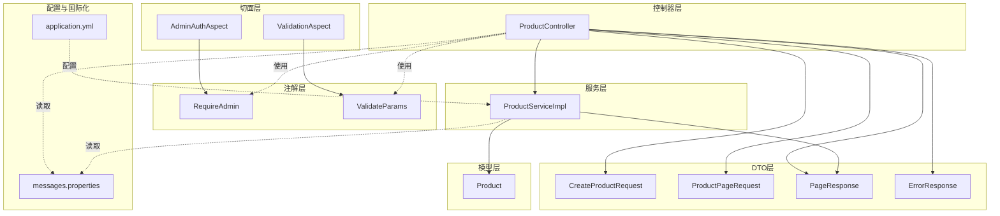
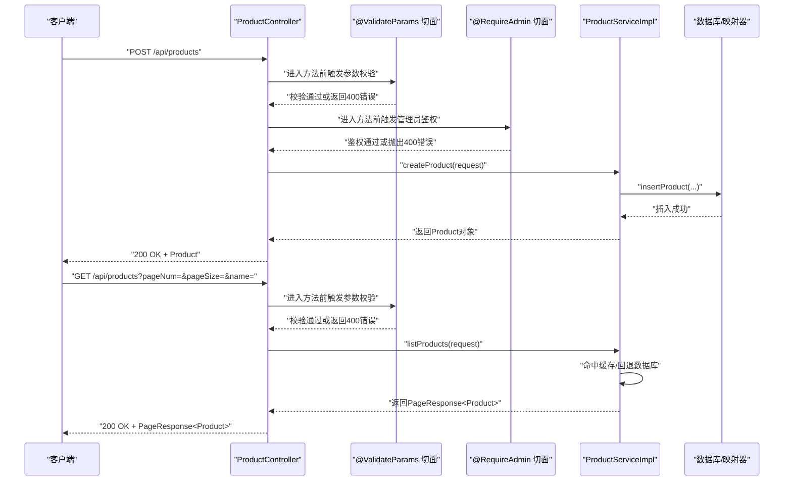
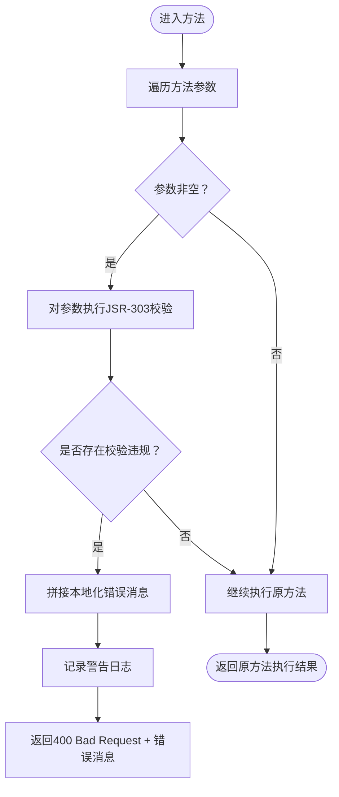
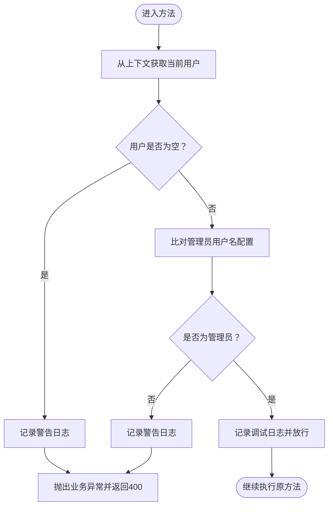
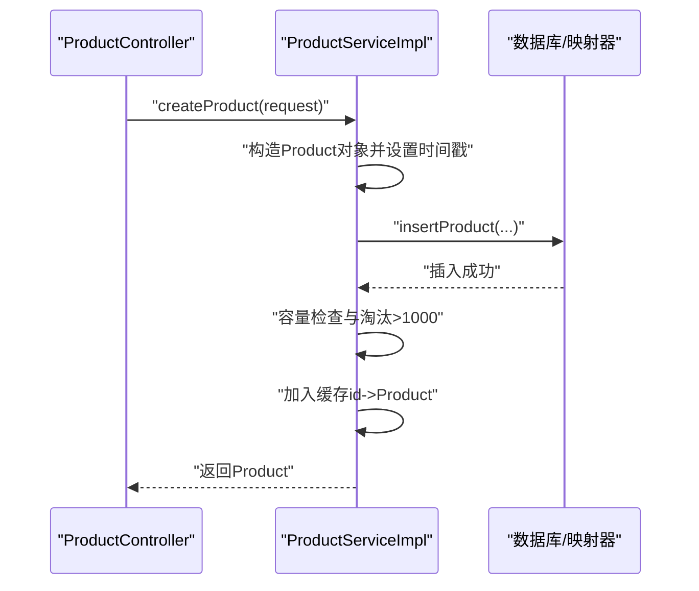
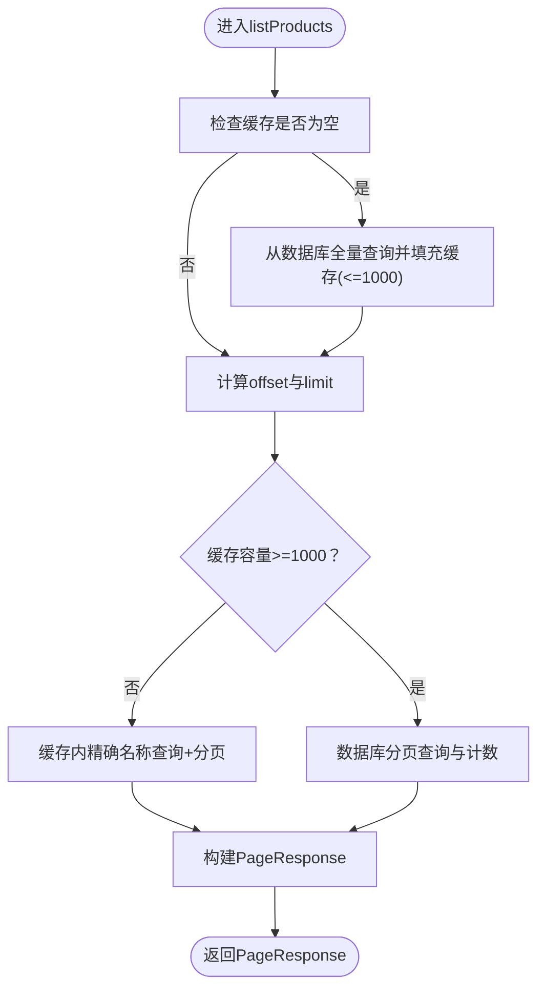
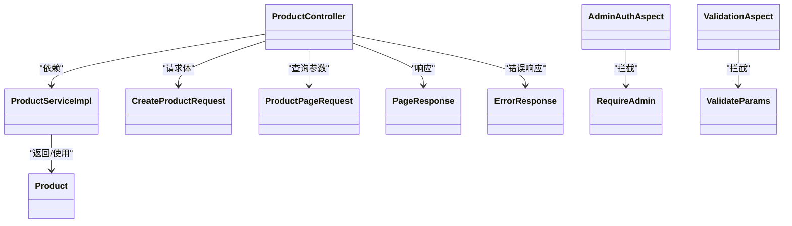

# 商品管理API

<cite>
**本文引用的文件**
- [ProductController.java](file://src/main/java/com/example/onlinestore/controller/ProductController.java)
- [ProductServiceImpl.java](file://src/main/java/com/example/onlinestore/service/impl/ProductServiceImpl.java)
- [CreateProductRequest.java](file://src/main/java/com/example/onlinestore/dto/CreateProductRequest.java)
- [ProductPageRequest.java](file://src/main/java/com/example/onlinestore/dto/ProductPageRequest.java)
- [PageResponse.java](file://src/main/java/com/example/onlinestore/dto/PageResponse.java)
- [ErrorResponse.java](file://src/main/java/com/example/onlinestore/dto/ErrorResponse.java)
- [Product.java](file://src/main/java/com/example/onlinestore/model/Product.java)
- [RequireAdmin.java](file://src/main/java/com/example/onlinestore/annotation/RequireAdmin.java)
- [ValidateParams.java](file://src/main/java/com/example/onlinestore/annotation/ValidateParams.java)
- [AdminAuthAspect.java](file://src/main/java/com/example/onlinestore/aspect/AdminAuthAspect.java)
- [ValidationAspect.java](file://src/main/java/com/example/onlinestore/aspect/ValidationAspect.java)
- [application.yml](file://src/main/resources/application.yml)
- [messages.properties](file://src/main/resources/i18n/messages.properties)
</cite>

## 目录
1. [简介](#简介)
2. [项目结构](#项目结构)
3. [核心组件](#核心组件)
4. [架构总览](#架构总览)
5. [详细组件分析](#详细组件分析)
6. [依赖关系分析](#依赖关系分析)
7. [性能与缓存策略](#性能与缓存策略)
8. [故障排查指南](#故障排查指南)
9. [结论](#结论)
10. [附录](#附录)

## 简介
本文件面向 ProductController 中的商品管理接口，提供完整、可操作的API文档。重点覆盖以下内容：
- POST /api/products：创建商品。包含请求体结构、权限要求、参数校验、成功响应及错误处理。
- GET /api/products：获取商品列表。包含分页参数、响应格式、缓存与数据库回退策略。
- 参数校验切面 @ValidateParams 的作用与行为。
- curl 示例：创建商品与查询商品列表。
- 错误处理：业务异常（400）与系统异常（500）的响应格式。
- 日志记录与缓存更新策略。

## 项目结构
围绕商品管理API的关键文件组织如下：
- 控制器层：ProductController 提供REST端点
- DTO层：CreateProductRequest、ProductPageRequest、PageResponse、ErrorResponse
- 模型层：Product
- 服务层：ProductServiceImpl 实现业务逻辑与缓存策略
- 切面层：AdminAuthAspect、ValidationAspect 实现权限与参数校验
- 注解层：RequireAdmin、ValidateParams
- 配置与国际化：application.yml、messages.properties

图表来源
- [ProductController.java](file://src/main/java/com/example/onlinestore/controller/ProductController.java#L1-L78)
- [ProductServiceImpl.java](file://src/main/java/com/example/onlinestore/service/impl/ProductServiceImpl.java#L1-L132)
- [CreateProductRequest.java](file://src/main/java/com/example/onlinestore/dto/CreateProductRequest.java#L1-L42)
- [ProductPageRequest.java](file://src/main/java/com/example/onlinestore/dto/ProductPageRequest.java#L1-L39)
- [PageResponse.java](file://src/main/java/com/example/onlinestore/dto/PageResponse.java#L1-L42)
- [ErrorResponse.java](file://src/main/java/com/example/onlinestore/dto/ErrorResponse.java#L1-L17)
- [Product.java](file://src/main/java/com/example/onlinestore/model/Product.java#L1-L61)
- [RequireAdmin.java](file://src/main/java/com/example/onlinestore/annotation/RequireAdmin.java#L1-L11)
- [ValidateParams.java](file://src/main/java/com/example/onlinestore/annotation/ValidateParams.java#L1-L11)
- [AdminAuthAspect.java](file://src/main/java/com/example/onlinestore/aspect/AdminAuthAspect.java#L1-L71)
- [ValidationAspect.java](file://src/main/java/com/example/onlinestore/aspect/ValidationAspect.java#L1-L79)
- [application.yml](file://src/main/resources/application.yml#L1-L48)
- [messages.properties](file://src/main/resources/i18n/messages.properties#L1-L17)

章节来源
- [ProductController.java](file://src/main/java/com/example/onlinestore/controller/ProductController.java#L1-L78)
- [ProductServiceImpl.java](file://src/main/java/com/example/onlinestore/service/impl/ProductServiceImpl.java#L1-L132)

## 核心组件
- ProductController：暴露两个端点，负责接收请求、调用服务、返回响应，并统一处理异常。
- ProductServiceImpl：实现商品创建与列表查询，内置内存缓存与容量淘汰策略。
- DTO与模型：CreateProductRequest、ProductPageRequest、PageResponse、ErrorResponse、Product。
- 切面与注解：RequireAdmin、ValidateParams、AdminAuthAspect、ValidationAspect。
- 国际化与配置：messages.properties提供错误消息模板，application.yml提供基础运行配置。

章节来源
- [ProductController.java](file://src/main/java/com/example/onlinestore/controller/ProductController.java#L1-L78)
- [ProductServiceImpl.java](file://src/main/java/com/example/onlinestore/service/impl/ProductServiceImpl.java#L1-L132)
- [CreateProductRequest.java](file://src/main/java/com/example/onlinestore/dto/CreateProductRequest.java#L1-L42)
- [ProductPageRequest.java](file://src/main/java/com/example/onlinestore/dto/ProductPageRequest.java#L1-L39)
- [PageResponse.java](file://src/main/java/com/example/onlinestore/dto/PageResponse.java#L1-L42)
- [ErrorResponse.java](file://src/main/java/com/example/onlinestore/dto/ErrorResponse.java#L1-L17)
- [Product.java](file://src/main/java/com/example/onlinestore/model/Product.java#L1-L61)
- [RequireAdmin.java](file://src/main/java/com/example/onlinestore/annotation/RequireAdmin.java#L1-L11)
- [ValidateParams.java](file://src/main/java/com/example/onlinestore/annotation/ValidateParams.java#L1-L11)
- [AdminAuthAspect.java](file://src/main/java/com/example/onlinestore/aspect/AdminAuthAspect.java#L1-L71)
- [ValidationAspect.java](file://src/main/java/com/example/onlinestore/aspect/ValidationAspect.java#L1-L79)
- [messages.properties](file://src/main/resources/i18n/messages.properties#L1-L17)
- [application.yml](file://src/main/resources/application.yml#L1-L48)

## 架构总览
下图展示了商品管理API的端到端调用链路，包括参数校验、权限拦截、业务处理与响应封装。

图表来源
- [ProductController.java](file://src/main/java/com/example/onlinestore/controller/ProductController.java#L30-L77)
- [ValidationAspect.java](file://src/main/java/com/example/onlinestore/aspect/ValidationAspect.java#L54-L79)
- [AdminAuthAspect.java](file://src/main/java/com/example/onlinestore/aspect/AdminAuthAspect.java#L54-L71)
- [ProductServiceImpl.java](file://src/main/java/com/example/onlinestore/service/impl/ProductServiceImpl.java#L34-L131)

## 详细组件分析

### POST /api/products：创建商品
- 请求方法与路径
  - 方法：POST
  - 路径：/api/products
- 权限要求
  - 使用注解 @RequireAdmin 对方法进行拦截，仅允许管理员访问。切面会从上下文获取当前用户，若未登录或用户名不匹配配置项，则抛出业务异常并返回400。
- 参数校验
  - 使用注解 @ValidateParams 对方法参数进行JSR-303校验。若任一参数存在校验失败，将返回400并携带本地化错误消息。
  - CreateProductRequest 字段约束：
    - 名称：必填，非空字符串
    - 类别：必填，非空字符串
    - 价格：必填，数值最小值为0.01
- 成功响应
  - 状态码：200
  - 响应体：完整的 Product 对象
- 错误处理
  - 业务异常（400）：参数校验失败或权限不足时返回 ErrorResponse
  - 系统异常（500）：其他未捕获异常时返回本地化的“内部错误”消息
- 日志记录
  - 控制器：记录请求参数、成功/失败信息
  - 服务层：记录创建开始/结束、缓存容量超限与淘汰、新增缓存条目
- 缓存策略
  - 内存缓存 Map<Long, Product>，容量上限为1000。超过上限时按插入顺序删除最旧条目；创建成功后立即加入缓存

章节来源
- [ProductController.java](file://src/main/java/com/example/onlinestore/controller/ProductController.java#L36-L54)
- [RequireAdmin.java](file://src/main/java/com/example/onlinestore/annotation/RequireAdmin.java#L1-L11)
- [ValidateParams.java](file://src/main/java/com/example/onlinestore/annotation/ValidateParams.java#L1-L11)
- [AdminAuthAspect.java](file://src/main/java/com/example/onlinestore/aspect/AdminAuthAspect.java#L54-L71)
- [ValidationAspect.java](file://src/main/java/com/example/onlinestore/aspect/ValidationAspect.java#L54-L79)
- [CreateProductRequest.java](file://src/main/java/com/example/onlinestore/dto/CreateProductRequest.java#L1-L42)
- [ProductServiceImpl.java](file://src/main/java/com/example/onlinestore/service/impl/ProductServiceImpl.java#L34-L57)
- [ErrorResponse.java](file://src/main/java/com/example/onlinestore/dto/ErrorResponse.java#L1-L17)
- [messages.properties](file://src/main/resources/i18n/messages.properties#L1-L17)

### GET /api/products：获取商品列表
- 请求方法与路径
  - 方法：GET
  - 路径：/api/products
- 查询参数（ProductPageRequest）
  - pageNum：页码，最小值为1，默认1
  - pageSize：每页数量，最小值为1，最大值为100，默认10
  - name：可选，按名称精确匹配（缓存内实现）
- 成功响应
  - 状态码：200
  - 响应体：PageResponse<Product>，包含 records、total、pageNum、pageSize
- 缓存与回退策略
  - 若缓存为空，首次加载会从数据库全量拉取并填充缓存（最多1000条），随后的分页查询优先走缓存
  - 当缓存容量达到1000条以上时，回退到数据库分页查询
- 错误处理
  - 业务异常（400）：参数校验失败时返回本地化错误消息
  - 系统异常（500）：其他未捕获异常时返回本地化的“内部错误”消息
- 日志记录
  - 控制器：记录请求参数与失败信息
  - 服务层：记录缓存命中/回退、数据库查询条数、分页计算

章节来源
- [ProductController.java](file://src/main/java/com/example/onlinestore/controller/ProductController.java#L62-L77)
- [ProductPageRequest.java](file://src/main/java/com/example/onlinestore/dto/ProductPageRequest.java#L1-L39)
- [PageResponse.java](file://src/main/java/com/example/onlinestore/dto/PageResponse.java#L1-L42)
- [ProductServiceImpl.java](file://src/main/java/com/example/onlinestore/service/impl/ProductServiceImpl.java#L59-L131)
- [messages.properties](file://src/main/resources/i18n/messages.properties#L1-L17)

### 参数校验流程（@ValidateParams 切面）

图表来源
- [ValidationAspect.java](file://src/main/java/com/example/onlinestore/aspect/ValidationAspect.java#L54-L79)

章节来源
- [ValidationAspect.java](file://src/main/java/com/example/onlinestore/aspect/ValidationAspect.java#L1-L79)

### 权限拦截流程（@RequireAdmin 切面）

图表来源
- [AdminAuthAspect.java](file://src/main/java/com/example/onlinestore/aspect/AdminAuthAspect.java#L54-L71)
- [application.yml](file://src/main/resources/application.yml#L45-L48)

章节来源
- [AdminAuthAspect.java](file://src/main/java/com/example/onlinestore/aspect/AdminAuthAspect.java#L1-L71)
- [application.yml](file://src/main/resources/application.yml#L45-L48)

### 商品创建流程（服务层）

图表来源
- [ProductServiceImpl.java](file://src/main/java/com/example/onlinestore/service/impl/ProductServiceImpl.java#L34-L57)

章节来源
- [ProductServiceImpl.java](file://src/main/java/com/example/onlinestore/service/impl/ProductServiceImpl.java#L1-L132)

### 商品列表查询流程（服务层）

图表来源
- [ProductServiceImpl.java](file://src/main/java/com/example/onlinestore/service/impl/ProductServiceImpl.java#L59-L131)

章节来源
- [ProductServiceImpl.java](file://src/main/java/com/example/onlinestore/service/impl/ProductServiceImpl.java#L1-L132)

## 依赖关系分析
- 控制器依赖服务层，服务层依赖模型与映射器，控制器与服务层均依赖DTO与响应包装类。
- 切面通过注解织入控制器方法，实现横切关注点（参数校验、权限拦截）。
- 国际化消息由MessageSource提供，错误响应体统一为ErrorResponse。

图表来源
- [ProductController.java](file://src/main/java/com/example/onlinestore/controller/ProductController.java#L1-L78)
- [ProductServiceImpl.java](file://src/main/java/com/example/onlinestore/service/impl/ProductServiceImpl.java#L1-L132)
- [CreateProductRequest.java](file://src/main/java/com/example/onlinestore/dto/CreateProductRequest.java#L1-L42)
- [ProductPageRequest.java](file://src/main/java/com/example/onlinestore/dto/ProductPageRequest.java#L1-L39)
- [PageResponse.java](file://src/main/java/com/example/onlinestore/dto/PageResponse.java#L1-L42)
- [ErrorResponse.java](file://src/main/java/com/example/onlinestore/dto/ErrorResponse.java#L1-L17)
- [Product.java](file://src/main/java/com/example/onlinestore/model/Product.java#L1-L61)
- [AdminAuthAspect.java](file://src/main/java/com/example/onlinestore/aspect/AdminAuthAspect.java#L1-L71)
- [ValidationAspect.java](file://src/main/java/com/example/onlinestore/aspect/ValidationAspect.java#L1-L79)
- [RequireAdmin.java](file://src/main/java/com/example/onlinestore/annotation/RequireAdmin.java#L1-L11)
- [ValidateParams.java](file://src/main/java/com/example/onlinestore/annotation/ValidateParams.java#L1-L11)

## 性能与缓存策略
- 缓存容量：1000条，超过上限按插入顺序淘汰最旧条目
- 首次访问：若缓存为空，全量加载数据库并填充缓存（最多1000条）
- 查询路径：
  - 缓存容量小于1000：优先走缓存，支持按名称精确匹配与分页
  - 缓存容量达到1000：回退数据库分页查询，避免缓存膨胀影响性能
- 事务性：创建商品使用事务，保证一致性

章节来源
- [ProductServiceImpl.java](file://src/main/java/com/example/onlinestore/service/impl/ProductServiceImpl.java#L28-L57)
- [ProductServiceImpl.java](file://src/main/java/com/example/onlinestore/service/impl/ProductServiceImpl.java#L59-L131)

## 故障排查指南
- 400 Bad Request
  - 参数校验失败：检查请求体字段是否满足 CreateProductRequest 与 ProductPageRequest 的约束
  - 权限不足：确认当前用户已登录且用户名与配置项一致
- 500 Internal Server Error
  - 未捕获异常：查看服务端日志定位具体异常堆栈
- 常见问题
  - 未登录或非管理员：@RequireAdmin 切面会拒绝访问
  - 参数越界：pageNum/pageSize 不在允许范围内会触发校验失败
  - 缓存未命中：首次访问或缓存清空后会触发数据库全量加载

章节来源
- [ProductController.java](file://src/main/java/com/example/onlinestore/controller/ProductController.java#L36-L77)
- [AdminAuthAspect.java](file://src/main/java/com/example/onlinestore/aspect/AdminAuthAspect.java#L54-L71)
- [ValidationAspect.java](file://src/main/java/com/example/onlinestore/aspect/ValidationAspect.java#L54-L79)
- [messages.properties](file://src/main/resources/i18n/messages.properties#L1-L17)

## 结论
本API通过清晰的DTO定义、严格的参数校验与权限拦截、以及高效的内存缓存策略，实现了稳定、可扩展的商品管理能力。建议在生产环境中结合数据库索引与更细粒度的缓存失效策略进一步优化性能与一致性。

## 附录

### API定义与示例

- POST /api/products
  - 请求头：Content-Type: application/json
  - 请求体字段（CreateProductRequest）：
    - name：字符串，必填
    - category：字符串，必填
    - price：数值，必填，最小值0.01
  - 成功响应：200 OK，响应体为 Product 对象
  - curl 示例：
    - curl -X POST http://localhost:8080/api/products -H "Content-Type: application/json" -d '{"name":"示例商品","category":"示例分类","price":99.99}'
- GET /api/products
  - 查询参数：
    - pageNum：整数，最小1，默认1
    - pageSize：整数，最小1，最大100，默认10
    - name：字符串，可选，精确匹配
  - 成功响应：200 OK，响应体为 PageResponse<Product>
  - curl 示例：
    - curl "http://localhost:8080/api/products?pageNum=1&pageSize=10&name=示例商品"

章节来源
- [CreateProductRequest.java](file://src/main/java/com/example/onlinestore/dto/CreateProductRequest.java#L1-L42)
- [ProductPageRequest.java](file://src/main/java/com/example/onlinestore/dto/ProductPageRequest.java#L1-L39)
- [PageResponse.java](file://src/main/java/com/example/onlinestore/dto/PageResponse.java#L1-L42)
- [Product.java](file://src/main/java/com/example/onlinestore/model/Product.java#L1-L61)
- [application.yml](file://src/main/resources/application.yml#L1-L48)