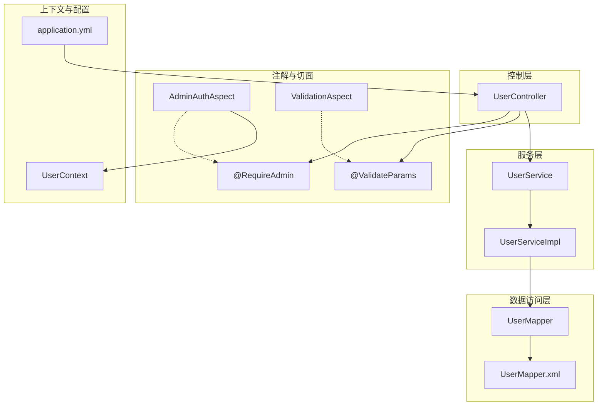
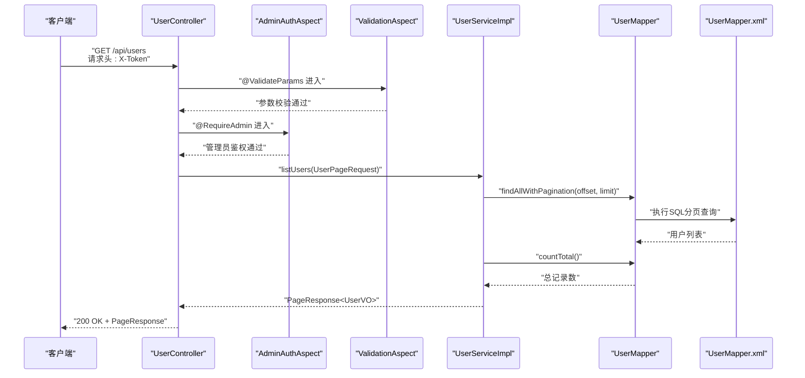
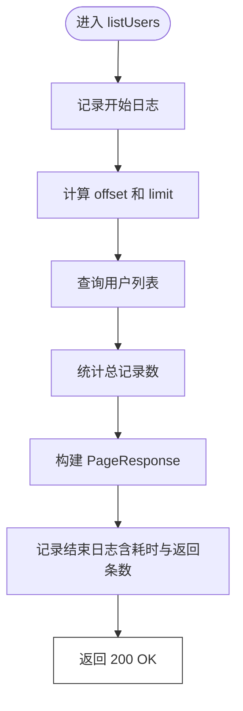
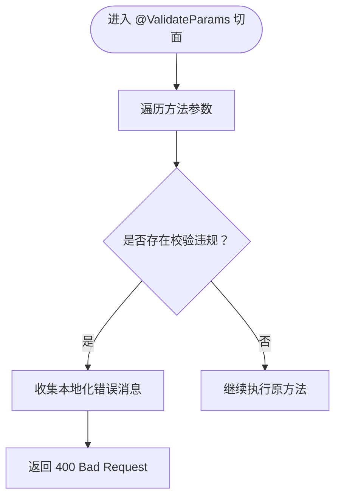
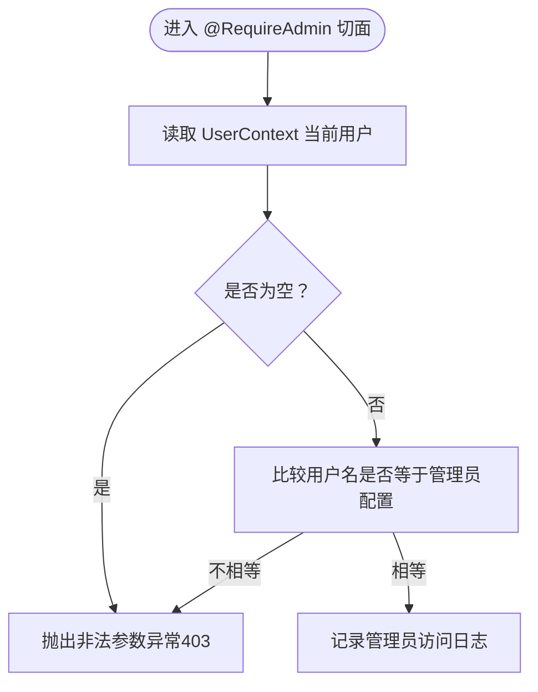
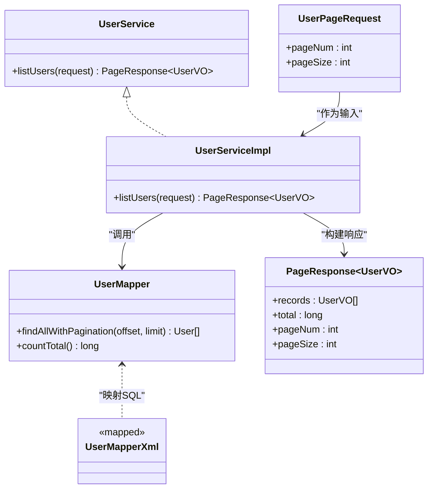
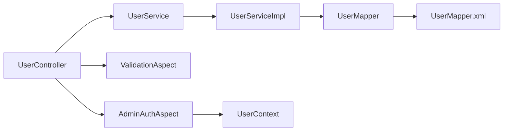

# 用户管理API

<cite>
**本文引用的文件**
- [UserController.java](file://src/main/java/com/example/onlinestore/controller/UserController.java)
- [UserPageRequest.java](file://src/main/java/com/example/onlinestore/dto/UserPageRequest.java)
- [PageResponse.java](file://src/main/java/com/example/onlinestore/dto/PageResponse.java)
- [RequireAdmin.java](file://src/main/java/com/example/onlinestore/annotation/RequireAdmin.java)
- [ValidateParams.java](file://src/main/java/com/example/onlinestore/annotation/ValidateParams.java)
- [AdminAuthAspect.java](file://src/main/java/com/example/onlinestore/aspect/AdminAuthAspect.java)
- [ValidationAspect.java](file://src/main/java/com/example/onlinestore/aspect/ValidationAspect.java)
- [UserService.java](file://src/main/java/com/example/onlinestore/service/UserService.java)
- [UserServiceImpl.java](file://src/main/java/com/example/onlinestore/service/impl/UserServiceImpl.java)
- [UserMapper.java](file://src/main/java/com/example/onlinestore/mapper/UserMapper.java)
- [UserMapper.xml](file://src/main/resources/mapper/UserMapper.xml)
- [UserContext.java](file://src/main/java/com/example/onlinestore/context/UserContext.java)
- [application.yml](file://src/main/resources/application.yml)
</cite>

## 目录
1. [简介](#简介)
2. [项目结构](#项目结构)
3. [核心组件](#核心组件)
4. [架构总览](#架构总览)
5. [详细组件分析](#详细组件分析)
6. [依赖关系分析](#依赖关系分析)
7. [性能考虑](#性能考虑)
8. [故障排查指南](#故障排查指南)
9. [结论](#结论)
10. [附录](#附录)

## 简介
本文件为在线商店系统的“用户管理”相关API文档，聚焦于GET /api/users端点，用于分页查询用户列表。文档详细说明请求参数（基于UserPageRequest DTO，包括pageNum与pageSize）、请求头要求（X-Token认证凭证）、权限控制（RequireAdmin注解）、响应格式（PageResponse<UserVO>封装）、错误处理（400参数校验失败、403权限不足、500系统错误）、参数校验切面（@ValidateParams）的工作机制、日志输出模式以及性能监控点（查询耗时记录），并提供curl示例以帮助快速验证接口行为。

## 项目结构
围绕用户管理API的关键文件组织如下：
- 控制层：UserController 提供REST接口，负责接收请求、权限与参数校验拦截、返回响应。
- DTO层：UserPageRequest定义分页参数；PageResponse封装分页响应体。
- 注解与切面：RequireAdmin用于方法级权限控制；ValidateParams配合ValidationAspect进行JSR-303参数校验。
- 服务层：UserService接口与UserServiceImpl实现，包含listUsers分页查询逻辑。
- 数据访问层：UserMapper接口与UserMapper.xml映射SQL，支持分页查询与总数统计。
- 上下文与配置：UserContext维护当前用户上下文；application.yml提供基础运行配置。

图表来源
- [UserController.java](file://src/main/java/com/example/onlinestore/controller/UserController.java#L1-L66)
- [RequireAdmin.java](file://src/main/java/com/example/onlinestore/annotation/RequireAdmin.java#L1-L11)
- [ValidateParams.java](file://src/main/java/com/example/onlinestore/annotation/ValidateParams.java)
- [AdminAuthAspect.java](file://src/main/java/com/example/onlinestore/aspect/AdminAuthAspect.java#L1-L71)
- [ValidationAspect.java](file://src/main/java/com/example/onlinestore/aspect/ValidationAspect.java#L1-L79)
- [UserService.java](file://src/main/java/com/example/onlinestore/service/UserService.java#L1-L14)
- [UserServiceImpl.java](file://src/main/java/com/example/onlinestore/service/impl/UserServiceImpl.java#L1-L193)
- [UserMapper.java](file://src/main/java/com/example/onlinestore/mapper/UserMapper.java#L1-L23)
- [UserMapper.xml](file://src/main/resources/mapper/UserMapper.xml#L1-L34)
- [UserContext.java](file://src/main/java/com/example/onlinestore/context/UserContext.java#L1-L19)
- [application.yml](file://src/main/resources/application.yml#L1-L48)

章节来源
- [UserController.java](file://src/main/java/com/example/onlinestore/controller/UserController.java#L1-L66)
- [application.yml](file://src/main/resources/application.yml#L1-L48)

## 核心组件
- GET /api/users
  - 请求方法：GET
  - 请求路径：/api/users
  - 权限要求：仅管理员可访问（@RequireAdmin）
  - 认证方式：请求头携带X-Token（由UserContext在鉴权流程中解析并设置）
  - 请求参数：基于UserPageRequest DTO
    - pageNum：页码，默认值为1，最小值为1
    - pageSize：每页条数，默认值为10，最小值为1，最大值为100
  - 响应体：PageResponse<UserVO>封装
    - records：当前页用户列表
    - total：总记录数
    - pageNum：当前页码
    - pageSize：每页大小
  - 成功响应：200 OK，返回PageResponse<UserVO>
  - 错误响应：
    - 400 参数校验失败（@ValidateParams触发）
    - 403 权限不足（非管理员访问）
    - 500 系统内部错误（其他异常）

章节来源
- [UserPageRequest.java](file://src/main/java/com/example/onlinestore/dto/UserPageRequest.java#L1-L29)
- [PageResponse.java](file://src/main/java/com/example/onlinestore/dto/PageResponse.java#L1-L42)
- [UserController.java](file://src/main/java/com/example/onlinestore/controller/UserController.java#L1-L66)
- [RequireAdmin.java](file://src/main/java/com/example/onlinestore/annotation/RequireAdmin.java#L1-L11)

## 架构总览
以下序列图展示了从客户端发起GET /api/users到最终返回分页结果的完整调用链，包括权限校验、参数校验、业务处理与日志记录。

图表来源
- [UserController.java](file://src/main/java/com/example/onlinestore/controller/UserController.java#L1-L66)
- [AdminAuthAspect.java](file://src/main/java/com/example/onlinestore/aspect/AdminAuthAspect.java#L1-L71)
- [ValidationAspect.java](file://src/main/java/com/example/onlinestore/aspect/ValidationAspect.java#L1-L79)
- [UserServiceImpl.java](file://src/main/java/com/example/onlinestore/service/impl/UserServiceImpl.java#L1-L193)
- [UserMapper.java](file://src/main/java/com/example/onlinestore/mapper/UserMapper.java#L1-L23)
- [UserMapper.xml](file://src/main/resources/mapper/UserMapper.xml#L1-L34)

## 详细组件分析

### GET /api/users 接口
- 功能概述：分页查询用户列表，返回PageResponse<UserVO>。
- 请求参数与默认值：
  - pageNum：默认1，最小值1
  - pageSize：默认10，最小值1，最大值100
- 请求头：
  - X-Token：用于标识当前登录用户，切面会据此判断管理员身份
- 权限控制：
  - 方法级注解@RequireAdmin，结合AdminAuthAspect在前置通知中校验当前用户是否为管理员
- 参数校验：
  - 方法参数使用@Valid与@ValidateParams注解，配合ValidationAspect对DTO进行JSR-303校验
- 响应格式：
  - PageResponse<UserVO>，包含records、total、pageNum、pageSize
- 日志与性能：
  - 控制器记录开始与结束日志，包含查询耗时与返回记录数
- 错误处理：
  - 参数校验失败：返回400
  - 权限不足：返回403（由切面抛出异常并统一处理）
  - 系统异常：返回500并返回本地化错误消息

图表来源
- [UserController.java](file://src/main/java/com/example/onlinestore/controller/UserController.java#L1-L66)
- [UserServiceImpl.java](file://src/main/java/com/example/onlinestore/service/impl/UserServiceImpl.java#L1-L193)

章节来源
- [UserController.java](file://src/main/java/com/example/onlinestore/controller/UserController.java#L1-L66)
- [UserServiceImpl.java](file://src/main/java/com/example/onlinestore/service/impl/UserServiceImpl.java#L1-L193)

### 参数校验切面（@ValidateParams）
- 触发条件：方法标注@ValidateParams时生效
- 校验策略：遍历方法参数，对每个非空参数执行JSR-303校验
- 失败处理：收集本地化错误消息，返回400 Bad Request
- 成功处理：继续执行原方法

图表来源
- [ValidationAspect.java](file://src/main/java/com/example/onlinestore/aspect/ValidationAspect.java#L1-L79)
- [UserPageRequest.java](file://src/main/java/com/example/onlinestore/dto/UserPageRequest.java#L1-L29)

章节来源
- [ValidationAspect.java](file://src/main/java/com/example/onlinestore/aspect/ValidationAspect.java#L1-L79)
- [UserPageRequest.java](file://src/main/java/com/example/onlinestore/dto/UserPageRequest.java#L1-L29)

### 管理员权限切面（@RequireAdmin）
- 触发条件：方法标注@RequireAdmin时生效
- 校验策略：读取UserContext中的当前用户，若为空或用户名不匹配管理员配置，则抛出异常
- 失败处理：返回403权限不足（由切面抛出异常，控制器捕获后统一返回）
- 成功处理：记录管理员访问日志

图表来源
- [AdminAuthAspect.java](file://src/main/java/com/example/onlinestore/aspect/AdminAuthAspect.java#L1-L71)
- [UserContext.java](file://src/main/java/com/example/onlinestore/context/UserContext.java#L1-L19)
- [application.yml](file://src/main/resources/application.yml#L41-L48)

章节来源
- [AdminAuthAspect.java](file://src/main/java/com/example/onlinestore/aspect/AdminAuthAspect.java#L1-L71)
- [UserContext.java](file://src/main/java/com/example/onlinestore/context/UserContext.java#L1-L19)
- [application.yml](file://src/main/resources/application.yml#L41-L48)

### 服务层与数据访问层
- 服务层：UserServiceImpl.listUsers根据pageNum与pageSize计算offset与limit，调用UserMapper分页查询与计数，再将模型转换为UserVO并填充PageResponse。
- 数据访问层：UserMapper接口声明分页查询与计数方法；UserMapper.xml映射SQL，实现按创建时间倒序分页查询与总数统计。

图表来源
- [UserService.java](file://src/main/java/com/example/onlinestore/service/UserService.java#L1-L14)
- [UserServiceImpl.java](file://src/main/java/com/example/onlinestore/service/impl/UserServiceImpl.java#L1-L193)
- [UserMapper.java](file://src/main/java/com/example/onlinestore/mapper/UserMapper.java#L1-L23)
- [UserMapper.xml](file://src/main/resources/mapper/UserMapper.xml#L1-L34)
- [UserPageRequest.java](file://src/main/java/com/example/onlinestore/dto/UserPageRequest.java#L1-L29)
- [PageResponse.java](file://src/main/java/com/example/onlinestore/dto/PageResponse.java#L1-L42)

章节来源
- [UserServiceImpl.java](file://src/main/java/com/example/onlinestore/service/impl/UserServiceImpl.java#L1-L193)
- [UserMapper.java](file://src/main/java/com/example/onlinestore/mapper/UserMapper.java#L1-L23)
- [UserMapper.xml](file://src/main/resources/mapper/UserMapper.xml#L1-L34)

## 依赖关系分析
- 控制器依赖服务层接口，服务层依赖数据访问层接口与MyBatis映射文件。
- 切面通过注解扫描在方法执行前后织入权限与参数校验逻辑。
- UserContext在切面中读取当前用户，依赖外部认证流程（例如登录后将用户信息写入Redis并在UserContext中设置）。

图表来源
- [UserController.java](file://src/main/java/com/example/onlinestore/controller/UserController.java#L1-L66)
- [UserService.java](file://src/main/java/com/example/onlinestore/service/UserService.java#L1-L14)
- [UserServiceImpl.java](file://src/main/java/com/example/onlinestore/service/impl/UserServiceImpl.java#L1-L193)
- [UserMapper.java](file://src/main/java/com/example/onlinestore/mapper/UserMapper.java#L1-L23)
- [UserMapper.xml](file://src/main/resources/mapper/UserMapper.xml#L1-L34)
- [AdminAuthAspect.java](file://src/main/java/com/example/onlinestore/aspect/AdminAuthAspect.java#L1-L71)
- [ValidationAspect.java](file://src/main/java/com/example/onlinestore/aspect/ValidationAspect.java#L1-L79)
- [UserContext.java](file://src/main/java/com/example/onlinestore/context/UserContext.java#L1-L19)

章节来源
- [UserController.java](file://src/main/java/com/example/onlinestore/controller/UserController.java#L1-L66)
- [UserServiceImpl.java](file://src/main/java/com/example/onlinestore/service/impl/UserServiceImpl.java#L1-L193)

## 性能考虑
- 分页查询性能：
  - SQL使用LIMIT与OFFSET实现分页，建议在users表上建立合适的索引以优化排序与分页查询（例如按created_at或主键索引）。
  - pageSize上限为100，避免一次性返回过多数据导致内存与网络压力。
- 查询耗时记录：
  - 控制器在开始与结束处记录日志，包含耗时与返回记录数，便于定位慢查询。
- 缓存与降载：
  - 登录后用户信息可能写入Redis，但用户列表查询未见显式缓存策略，建议在高频场景下评估缓存命中率与失效策略。

章节来源
- [UserServiceImpl.java](file://src/main/java/com/example/onlinestore/service/impl/UserServiceImpl.java#L1-L193)
- [UserMapper.xml](file://src/main/resources/mapper/UserMapper.xml#L1-L34)
- [UserController.java](file://src/main/java/com/example/onlinestore/controller/UserController.java#L1-L66)

## 故障排查指南
- 400 参数校验失败
  - 可能原因：pageNum小于1或pageSize不在[1,100]范围内
  - 排查步骤：检查请求参数是否符合UserPageRequest约束
- 403 权限不足
  - 可能原因：未携带有效X-Token，或当前用户非管理员
  - 排查步骤：确认X-Token有效且UserContext中当前用户为管理员配置用户名
- 500 系统内部错误
  - 可能原因：数据库异常、Redis读取失败或业务逻辑异常
  - 排查步骤：查看控制器日志中的错误堆栈，关注数据库连接、SQL执行与Redis操作

章节来源
- [ValidationAspect.java](file://src/main/java/com/example/onlinestore/aspect/ValidationAspect.java#L1-L79)
- [AdminAuthAspect.java](file://src/main/java/com/example/onlinestore/aspect/AdminAuthAspect.java#L1-L71)
- [UserController.java](file://src/main/java/com/example/onlinestore/controller/UserController.java#L1-L66)

## 结论
GET /api/users接口通过清晰的参数约束、严格的权限控制与参数校验，提供了安全可靠的用户分页查询能力。结合日志与性能监控点，能够有效支撑线上问题定位与性能优化。建议在生产环境中完善数据库索引与缓存策略，进一步提升分页查询效率与稳定性。

## 附录

### API定义与示例
- 端点：GET /api/users
- 请求头：
  - X-Token: 令牌字符串
- 请求参数（UserPageRequest）：
  - pageNum: 默认1，最小1
  - pageSize: 默认10，最小1，最大100
- 成功响应（200 OK）：
  - 响应体：PageResponse<UserVO>
    - records: 当前页用户列表
    - total: 总记录数
    - pageNum: 当前页码
    - pageSize: 每页大小
- 错误响应：
  - 400 参数校验失败：参数不符合UserPageRequest约束
  - 403 权限不足：非管理员访问
  - 500 系统内部错误：服务器异常

章节来源
- [UserPageRequest.java](file://src/main/java/com/example/onlinestore/dto/UserPageRequest.java#L1-L29)
- [PageResponse.java](file://src/main/java/com/example/onlinestore/dto/PageResponse.java#L1-L42)
- [UserController.java](file://src/main/java/com/example/onlinestore/controller/UserController.java#L1-L66)

### curl示例
- 查询第1页，每页10条记录（携带X-Token）：
  - curl -X GET "http://localhost:8080/api/users?pageNum=1&pageSize=10" -H "X-Token: <你的令牌>"
- 超出pageSize上限（例如120）将触发400：
  - curl -X GET "http://localhost:8080/api/users?pageNum=1&pageSize=120" -H "X-Token: <你的令牌>"
- 非管理员访问将触发403：
  - curl -X GET "http://localhost:8080/api/users?pageNum=1&pageSize=10" -H "X-Token: <非管理员令牌>"

章节来源
- [UserController.java](file://src/main/java/com/example/onlinestore/controller/UserController.java#L1-L66)
- [UserPageRequest.java](file://src/main/java/com/example/onlinestore/dto/UserPageRequest.java#L1-L29)
- [application.yml](file://src/main/resources/application.yml#L41-L48)