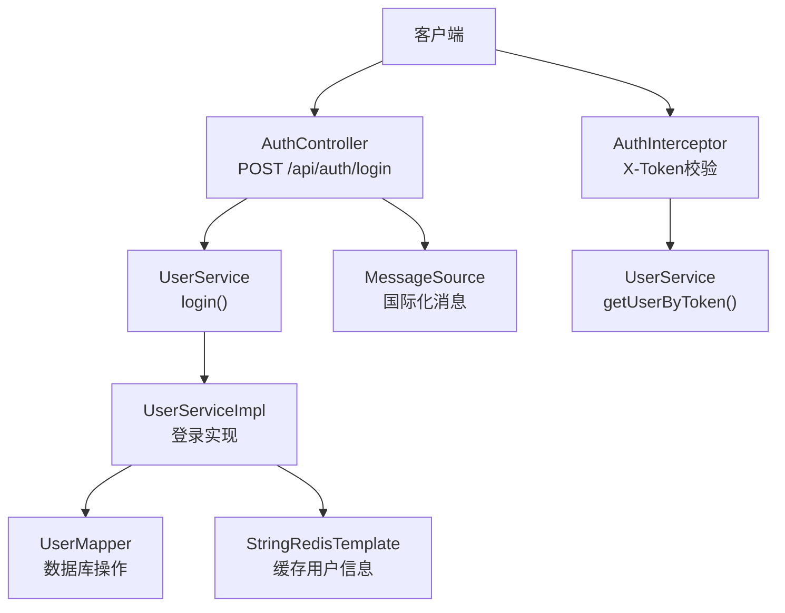
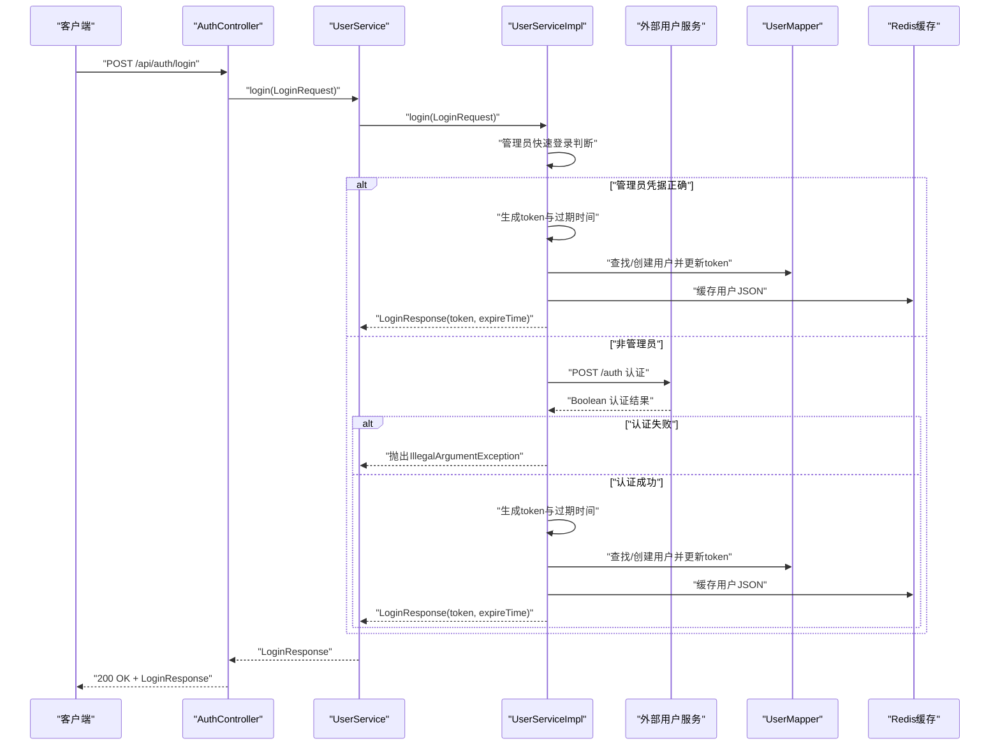
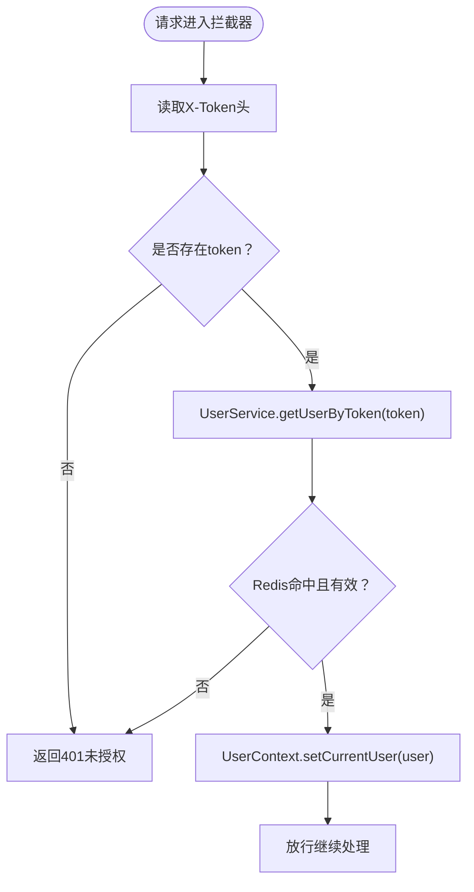
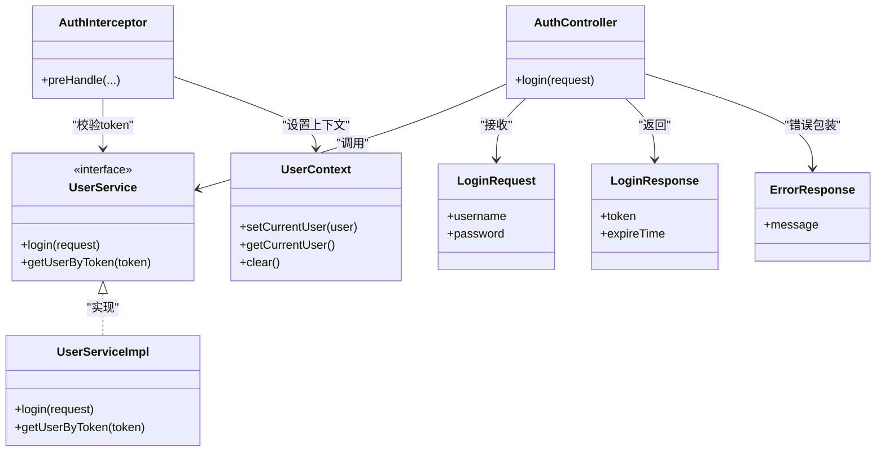

# 认证API

<cite>
**本文引用的文件**
- [AuthController.java](file://src/main/java/com/example/onlinestore/controller/AuthController.java)
- [UserService.java](file://src/main/java/com/example/onlinestore/service/UserService.java)
- [UserServiceImpl.java](file://src/main/java/com/example/onlinestore/service/impl/UserServiceImpl.java)
- [AuthInterceptor.java](file://src/main/java/com/example/onlinestore/interceptor/AuthInterceptor.java)
- [UserContext.java](file://src/main/java/com/example/onlinestore/context/UserContext.java)
- [LoginRequest.java](file://src/main/java/com/example/onlinestore/dto/LoginRequest.java)
- [LoginResponse.java](file://src/main/java/com/example/onlinestore/dto/LoginResponse.java)
- [ErrorResponse.java](file://src/main/java/com/example/onlinestore/dto/ErrorResponse.java)
- [messages.properties](file://src/main/resources/i18n/messages.properties)
- [messages_zh_CN.properties](file://src/main/resources/i18n/messages_zh_CN.properties)
- [application.yml](file://src/main/resources/application.yml)
- [AuthControllerTest.java](file://src/test/java/com/example/onlinestore/controller/AuthControllerTest.java)
</cite>

## 目录
1. [简介](#简介)
2. [项目结构](#项目结构)
3. [核心组件](#核心组件)
4. [架构总览](#架构总览)
5. [详细组件分析](#详细组件分析)
6. [依赖关系分析](#依赖关系分析)
7. [性能考虑](#性能考虑)
8. [故障排查指南](#故障排查指南)
9. [结论](#结论)
10. [附录](#附录)

## 简介
本文件为在线商店系统的认证API文档，聚焦于POST /api/auth/login端点。该接口用于用户登录认证，返回包含令牌及过期时间的响应；同时对不同类型的异常进行区分处理：业务异常返回400，系统异常返回500，并支持通过Accept-Language头进行多语言错误消息输出。此外，文档还解释了基于自定义Token的认证机制（非JWT），包括Token生成、存储与校验流程，并提供curl示例与常见问题排查建议。

## 项目结构
- 控制层：AuthController负责接收登录请求、调用服务层、统一异常处理与响应封装。
- 服务层：UserService定义登录契约，UserServiceImpl实现登录逻辑，包括管理员快速登录、调用外部用户服务认证、生成Token、写入数据库与Redis缓存。
- 拦截器：AuthInterceptor在请求进入控制器前校验X-Token头，校验失败返回401未授权。
- 国际化：i18n目录下提供英文与简体中文错误消息资源。
- DTO：LoginRequest、LoginResponse、ErrorResponse等数据传输对象。
- 配置：application.yml中包含Redis、数据库、服务地址等基础配置。

图表来源
- [AuthController.java](file://src/main/java/com/example/onlinestore/controller/AuthController.java#L29-L44)
- [UserService.java](file://src/main/java/com/example/onlinestore/service/UserService.java#L10-L14)
- [UserServiceImpl.java](file://src/main/java/com/example/onlinestore/service/impl/UserServiceImpl.java#L68-L139)
- [AuthInterceptor.java](file://src/main/java/com/example/onlinestore/interceptor/AuthInterceptor.java#L23-L43)
- [messages.properties](file://src/main/resources/i18n/messages.properties#L1-L17)
- [messages_zh_CN.properties](file://src/main/resources/i18n/messages_zh_CN.properties#L1-L17)

章节来源
- [AuthController.java](file://src/main/java/com/example/onlinestore/controller/AuthController.java#L1-L45)
- [application.yml](file://src/main/resources/application.yml#L1-L48)

## 核心组件
- AuthController：暴露登录端点，调用UserService执行登录，捕获IllegalArgumentException返回400，捕获其他异常返回500，并根据Accept-Language选择本地化错误消息。
- UserService/UserServiceImpl：实现登录逻辑，优先管理员快速登录，否则调用外部用户服务认证；认证通过后生成自定义Token，持久化用户信息并写入Redis缓存，返回LoginResponse。
- AuthInterceptor：拦截所有受保护请求，读取X-Token头，若为空或无效则返回401未授权。
- DTO：LoginRequest（username、password）、LoginResponse（token、expireTime）、ErrorResponse（message）。
- 国际化：messages.properties与messages_zh_CN.properties分别提供英文与中文错误消息键值。

章节来源
- [AuthController.java](file://src/main/java/com/example/onlinestore/controller/AuthController.java#L29-L44)
- [UserService.java](file://src/main/java/com/example/onlinestore/service/UserService.java#L10-L14)
- [UserServiceImpl.java](file://src/main/java/com/example/onlinestore/service/impl/UserServiceImpl.java#L68-L139)
- [AuthInterceptor.java](file://src/main/java/com/example/onlinestore/interceptor/AuthInterceptor.java#L23-L43)
- [LoginRequest.java](file://src/main/java/com/example/onlinestore/dto/LoginRequest.java#L1-L22)
- [LoginResponse.java](file://src/main/java/com/example/onlinestore/dto/LoginResponse.java#L1-L24)
- [ErrorResponse.java](file://src/main/java/com/example/onlinestore/dto/ErrorResponse.java#L1-L17)
- [messages.properties](file://src/main/resources/i18n/messages.properties#L1-L17)
- [messages_zh_CN.properties](file://src/main/resources/i18n/messages_zh_CN.properties#L1-L17)

## 架构总览
登录流程与Token认证机制如下图所示：

图表来源
- [AuthController.java](file://src/main/java/com/example/onlinestore/controller/AuthController.java#L29-L44)
- [UserServiceImpl.java](file://src/main/java/com/example/onlinestore/service/impl/UserServiceImpl.java#L68-L139)

章节来源
- [AuthController.java](file://src/main/java/com/example/onlinestore/controller/AuthController.java#L29-L44)
- [UserServiceImpl.java](file://src/main/java/com/example/onlinestore/service/impl/UserServiceImpl.java#L68-L139)

## 详细组件分析

### 登录端点：POST /api/auth/login
- 请求方法：POST
- URL路径：/api/auth/login
- 请求头：
  - Content-Type: application/json
  - Accept-Language: 可选，用于控制错误消息语言（如en、zh-CN）
- 请求体：LoginRequest
  - 字段：username（字符串）、password（字符串）
- 成功响应（200 OK）：LoginResponse
  - 字段：token（字符串）、expireTime（日期时间，格式为LocalDateTime）
- 错误响应：
  - 400 Bad Request：当用户名或密码无效时，返回字符串形式的错误消息（由国际化资源决定语言）
  - 401 Unauthorized：当后续请求缺少或无效的X-Token头时，拦截器返回未授权
  - 500 Internal Server Error：系统异常时，返回本地化的“系统内部错误”消息

curl示例
- 成功登录
  - curl -X POST http://localhost:8080/api/auth/login -H "Content-Type: application/json" -d '{"username":"admin","password":"password"}'
- 登录失败（凭据无效）
  - curl -X POST http://localhost:8080/api/auth/login -H "Content-Type: application/json" -H "Accept-Language: zh-CN" -d '{"username":"test","password":"wrong"}'
- 获取系统错误（模拟）
  - curl -X POST http://localhost:8080/api/auth/login -H "Content-Type: application/json" -H "Accept-Language: en" -d '{"username":"test","password":"any"}'

章节来源
- [AuthController.java](file://src/main/java/com/example/onlinestore/controller/AuthController.java#L29-L44)
- [LoginRequest.java](file://src/main/java/com/example/onlinestore/dto/LoginRequest.java#L1-L22)
- [LoginResponse.java](file://src/main/java/com/example/onlinestore/dto/LoginResponse.java#L1-L24)
- [AuthControllerTest.java](file://src/test/java/com/example/onlinestore/controller/AuthControllerTest.java#L63-L117)
- [AuthControllerTest.java](file://src/test/java/com/example/onlinestore/controller/AuthControllerTest.java#L119-L145)

### Token认证机制
- Token生成：UserServiceImpl使用UUID生成随机token，并设置过期时间为当前时间+1天。
- Token存储：
  - 数据库：UserMapper负责查找/创建用户并更新token与过期时间。
  - 缓存：将用户对象序列化为JSON后存入Redis，键前缀为token:，过期时间与数据库一致。
- Token校验：AuthInterceptor从请求头X-Token读取令牌，调用UserService.getUserByToken从Redis反序列化用户信息；若为空则返回401未授权。
- 上下文：UserContext用于在请求生命周期内持有当前用户，拦截器通过其设置当前用户，请求完成后清理。

图表来源
- [AuthInterceptor.java](file://src/main/java/com/example/onlinestore/interceptor/AuthInterceptor.java#L23-L43)
- [UserServiceImpl.java](file://src/main/java/com/example/onlinestore/service/impl/UserServiceImpl.java#L179-L193)
- [UserContext.java](file://src/main/java/com/example/onlinestore/context/UserContext.java#L1-L19)

章节来源
- [UserServiceImpl.java](file://src/main/java/com/example/onlinestore/service/impl/UserServiceImpl.java#L97-L139)
- [AuthInterceptor.java](file://src/main/java/com/example/onlinestore/interceptor/AuthInterceptor.java#L23-L43)
- [UserContext.java](file://src/main/java/com/example/onlinestore/context/UserContext.java#L1-L19)

### 异常处理策略
- IllegalArgumentException（业务异常）：
  - 触发条件：管理员密码错误、外部用户服务认证失败
  - 处理方式：控制器捕获后返回400，错误消息来自国际化资源，语言由Accept-Language决定
- 系统异常（其他异常）：
  - 触发条件：数据库写入失败、Redis缓存异常、未知运行时异常
  - 处理方式：控制器捕获后返回500，错误消息来自国际化资源，语言由Accept-Language决定
- 未授权访问：
  - 触发条件：请求头缺少X-Token或Redis中无对应用户信息
  - 处理方式：拦截器直接返回401未授权

章节来源
- [AuthController.java](file://src/main/java/com/example/onlinestore/controller/AuthController.java#L34-L44)
- [UserServiceImpl.java](file://src/main/java/com/example/onlinestore/service/impl/UserServiceImpl.java#L73-L95)
- [AuthInterceptor.java](file://src/main/java/com/example/onlinestore/interceptor/AuthInterceptor.java#L23-L43)
- [messages.properties](file://src/main/resources/i18n/messages.properties#L1-L17)
- [messages_zh_CN.properties](file://src/main/resources/i18n/messages_zh_CN.properties#L1-L17)

### 国际化支持
- 错误消息键：
  - error.invalid.credentials：用户名或密码错误
  - error.system.internal：系统内部错误
  - error.unauthorized：未授权的访问
- 使用方式：
  - 控制器与拦截器通过MessageSource按当前Locale加载对应语言的消息文本
  - 客户端通过Accept-Language请求头指定语言（如en、zh-CN）

章节来源
- [messages.properties](file://src/main/resources/i18n/messages.properties#L1-L17)
- [messages_zh_CN.properties](file://src/main/resources/i18n/messages_zh_CN.properties#L1-L17)
- [AuthController.java](file://src/main/java/com/example/onlinestore/controller/AuthController.java#L39-L43)
- [AuthInterceptor.java](file://src/main/java/com/example/onlinestore/interceptor/AuthInterceptor.java#L23-L43)

## 依赖关系分析
- 控制器依赖服务层接口与国际化消息源
- 服务实现依赖数据库映射器、Redis模板、RestTemplate与消息源
- 拦截器依赖服务层与国际化消息源
- DTO作为数据载体贯穿各层

图表来源
- [AuthController.java](file://src/main/java/com/example/onlinestore/controller/AuthController.java#L29-L44)
- [UserService.java](file://src/main/java/com/example/onlinestore/service/UserService.java#L10-L14)
- [UserServiceImpl.java](file://src/main/java/com/example/onlinestore/service/impl/UserServiceImpl.java#L68-L139)
- [AuthInterceptor.java](file://src/main/java/com/example/onlinestore/interceptor/AuthInterceptor.java#L23-L43)
- [UserContext.java](file://src/main/java/com/example/onlinestore/context/UserContext.java#L1-L19)
- [LoginRequest.java](file://src/main/java/com/example/onlinestore/dto/LoginRequest.java#L1-L22)
- [LoginResponse.java](file://src/main/java/com/example/onlinestore/dto/LoginResponse.java#L1-L24)
- [ErrorResponse.java](file://src/main/java/com/example/onlinestore/dto/ErrorResponse.java#L1-L17)

章节来源
- [AuthController.java](file://src/main/java/com/example/onlinestore/controller/AuthController.java#L29-L44)
- [UserService.java](file://src/main/java/com/example/onlinestore/service/UserService.java#L10-L14)
- [UserServiceImpl.java](file://src/main/java/com/example/onlinestore/service/impl/UserServiceImpl.java#L68-L139)
- [AuthInterceptor.java](file://src/main/java/com/example/onlinestore/interceptor/AuthInterceptor.java#L23-L43)
- [UserContext.java](file://src/main/java/com/example/onlinestore/context/UserContext.java#L1-L19)
- [LoginRequest.java](file://src/main/java/com/example/onlinestore/dto/LoginRequest.java#L1-L22)
- [LoginResponse.java](file://src/main/java/com/example/onlinestore/dto/LoginResponse.java#L1-L24)
- [ErrorResponse.java](file://src/main/java/com/example/onlinestore/dto/ErrorResponse.java#L1-L17)

## 性能考虑
- Token缓存：用户信息序列化后写入Redis，键带前缀token:，过期时间与数据库一致，减少重复查询数据库的压力。
- 管理员快速登录：管理员凭据直接在内存中校验，避免外部服务调用，降低延迟。
- 分页与事务：列表查询采用分页与事务控制，保证一致性与可扩展性。
- 建议：
  - 对Redis写入失败进行降级处理（当前代码会记录日志但不中断流程）
  - 在高并发场景下，可考虑对登录接口增加限流与幂等设计
  - 对外部用户服务认证超时进行合理配置与重试策略

章节来源
- [UserServiceImpl.java](file://src/main/java/com/example/onlinestore/service/impl/UserServiceImpl.java#L123-L133)
- [UserServiceImpl.java](file://src/main/java/com/example/onlinestore/service/impl/UserServiceImpl.java#L68-L95)

## 故障排查指南
- 400错误（凭据无效）
  - 检查用户名与密码是否正确（管理员凭据在配置中定义）
  - 确认Accept-Language是否导致错误消息语言切换
- 500错误（系统内部错误）
  - 检查数据库连接与Redis可用性
  - 查看日志中关于缓存写入失败或未知异常的信息
- 401错误（未授权）
  - 确认请求头是否包含有效的X-Token
  - 检查Redis中是否存在对应的token键
- curl调试建议
  - 使用-H "Accept-Language: zh-CN" 或 en验证多语言
  - 使用-H "Content-Type: application/json" 并确保请求体为合法JSON

章节来源
- [AuthController.java](file://src/main/java/com/example/onlinestore/controller/AuthController.java#L34-L44)
- [AuthInterceptor.java](file://src/main/java/com/example/onlinestore/interceptor/AuthInterceptor.java#L23-L43)
- [application.yml](file://src/main/resources/application.yml#L1-L48)
- [AuthControllerTest.java](file://src/test/java/com/example/onlinestore/controller/AuthControllerTest.java#L77-L145)

## 结论
本认证API通过清晰的端点设计与严格的异常分类处理，实现了登录认证与Token管理。管理员与普通用户的认证路径分离，既保证了性能又增强了安全性。配合拦截器的Token校验与国际化消息，系统在多语言环境下具备良好的用户体验。建议在生产环境中进一步完善缓存降级、外部服务超时与限流策略，以提升整体稳定性与吞吐能力。

## 附录
- 配置要点
  - 管理员凭据：admin.auth.username/admin.auth.password
  - Redis连接：data.redis.host/port/password/database
  - 外部用户服务地址：service.user.base-url
- DTO字段说明
  - LoginRequest：username（字符串）、password（字符串）
  - LoginResponse：token（字符串）、expireTime（日期时间）
  - ErrorResponse：message（字符串）

章节来源
- [application.yml](file://src/main/resources/application.yml#L1-L48)
- [LoginRequest.java](file://src/main/java/com/example/onlinestore/dto/LoginRequest.java#L1-L22)
- [LoginResponse.java](file://src/main/java/com/example/onlinestore/dto/LoginResponse.java#L1-L24)
- [ErrorResponse.java](file://src/main/java/com/example/onlinestore/dto/ErrorResponse.java#L1-L17)