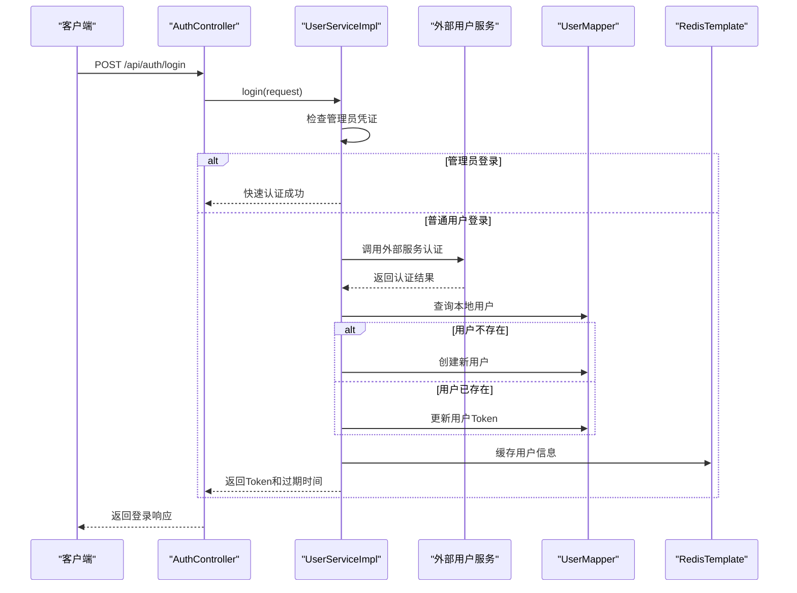
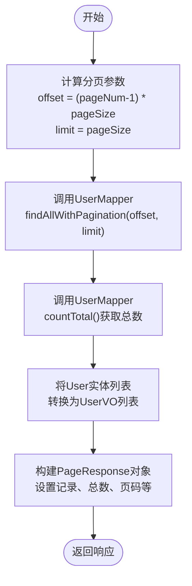
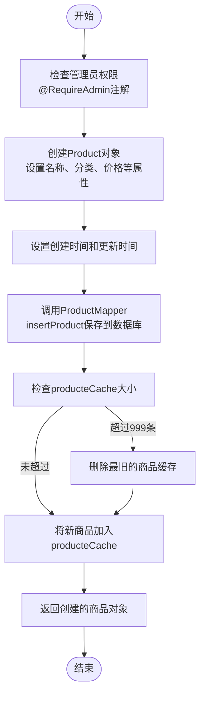

# 业务逻辑层

<cite>
**本文档中引用的文件**  
- [UserService.java](file://src/main/java/com/example/onlinestore/service/UserService.java)
- [ProductService.java](file://src/main/java/com/example/onlinestore/service/ProductService.java)
- [UserServiceImpl.java](file://src/main/java/com/example/onlinestore/service/impl/UserServiceImpl.java)
- [ProductServiceImpl.java](file://src/main/java/com/example/onlinestore/service/impl/ProductServiceImpl.java)
- [AuthController.java](file://src/main/java/com/example/onlinestore/controller/AuthController.java)
- [UserController.java](file://src/main/java/com/example/onlinestore/controller/UserController.java)
- [ProductController.java](file://src/main/java/com/example/onlinestore/controller/ProductController.java)
- [UserMapper.java](file://src/main/java/com/example/onlinestore/mapper/UserMapper.java)
- [ProductMapper.java](file://src/main/java/com/example/onlinestore/mapper/ProductMapper.java)
- [LoginRequest.java](file://src/main/java/com/example/onlinestore/dto/LoginRequest.java)
- [LoginResponse.java](file://src/main/java/com/example/onlinestore/dto/LoginResponse.java)
- [UserPageRequest.java](file://src/main/java/com/example/onlinestore/dto/UserPageRequest.java)
- [UserVO.java](file://src/main/java/com/example/onlinestore/dto/UserVO.java)
- [CreateProductRequest.java](file://src/main/java/com/example/onlinestore/dto/CreateProductRequest.java)
- [ProductPageRequest.java](file://src/main/java/com/example/onlinestore/dto/ProductPageRequest.java)
- [application.yml](file://src/main/resources/application.yml)
- [AdminAuthAspect.java](file://src/main/java/com/example/onlinestore/aspect/AdminAuthAspect.java)
- [RequireAdmin.java](file://src/main/java/com/example/onlinestore/annotation/RequireAdmin.java)
- [UserContext.java](file://src/main/java/com/example/onlinestore/context/UserContext.java)
</cite>

## 目录
1. [用户登录流程分析](#用户登录流程分析)
2. [用户列表分页查询实现](#用户列表分页查询实现)
3. [商品创建业务逻辑](#商品创建业务逻辑)
4. [服务层组件协调机制](#服务层组件协调机制)
5. [事务管理与数据一致性](#事务管理与数据一致性)
6. [异常处理策略](#异常处理策略)

## 用户登录流程分析

用户登录流程是系统安全性的核心，通过`UserService`接口的`login`方法实现，具体逻辑在`UserServiceImpl`类中。该流程涉及外部服务调用、本地用户管理以及Token生成与缓存。



**图示来源**  
- [UserServiceImpl.java](file://src/main/java/com/example/onlinestore/service/impl/UserServiceImpl.java#L67-L139)
- [AuthController.java](file://src/main/java/com/example/onlinestore/controller/AuthController.java#L29-L45)
- [UserMapper.java](file://src/main/java/com/example/onlinestore/mapper/UserMapper.java#L12-L17)

**本节来源**  
- [UserServiceImpl.java](file://src/main/java/com/example/onlinestore/service/impl/UserServiceImpl.java#L67-L139)
- [AuthController.java](file://src/main/java/com/example/onlinestore/controller/AuthController.java#L29-L45)
- [LoginRequest.java](file://src/main/java/com/example/onlinestore/dto/LoginRequest.java#L3-L22)
- [LoginResponse.java](file://src/main/java/com/example/onlinestore/dto/LoginResponse.java#L5-L24)

## 用户列表分页查询实现

用户列表分页查询功能通过`UserService`的`listUsers`方法实现，采用MyBatis进行数据库分页查询，并将实体对象转换为VO对象返回，确保接口数据的安全性和简洁性。



该流程首先根据请求参数计算分页偏移量和限制数量，然后通过`UserMapper`接口的`findAllWithPagination`方法从数据库查询指定范围的用户数据，并通过`countTotal`方法获取总记录数。查询结果通过流式处理转换为`UserVO`对象列表，最后构建包含分页信息的`PageResponse`对象返回。

**图示来源**  
- [UserServiceImpl.java](file://src/main/java/com/example/onlinestore/service/impl/UserServiceImpl.java#L153-L175)
- [UserMapper.java](file://src/main/java/com/example/onlinestore/mapper/UserMapper.java#L18-L20)

**本节来源**  
- [UserServiceImpl.java](file://src/main/java/com/example/onlinestore/service/impl/UserServiceImpl.java#L153-L175)
- [UserMapper.java](file://src/main/java/com/example/onlinestore/mapper/UserMapper.java#L18-L20)
- [UserPageRequest.java](file://src/main/java/com/example/onlinestore/dto/UserPageRequest.java#L6-L29)
- [UserVO.java](file://src/main/java/com/example/onlinestore/dto/UserVO.java#L5-L42)

## 商品创建业务逻辑

商品创建功能通过`ProductService`的`createProduct`方法实现，需要管理员权限验证，涉及数据持久化和缓存更新操作。



商品创建流程首先通过`@RequireAdmin`注解确保调用者具有管理员权限，然后创建`Product`实体对象并设置相关属性，通过`ProductMapper`的`insertProduct`方法将数据持久化到数据库。创建成功后，系统会检查内存缓存`producteCache`的大小，如果超过999条记录，则删除最旧的商品，然后将新创建的商品加入缓存，以提高后续查询性能。

**图示来源**  
- [ProductServiceImpl.java](file://src/main/java/com/example/onlinestore/service/impl/ProductServiceImpl.java#L34-L57)
- [ProductMapper.java](file://src/main/java/com/example/onlinestore/mapper/ProductMapper.java#L11-L12)
- [AdminAuthAspect.java](file://src/main/java/com/example/onlinestore/aspect/AdminAuthAspect.java#L54-L71)

**本节来源**  
- [ProductServiceImpl.java](file://src/main/java/com/example/onlinestore/service/impl/ProductServiceImpl.java#L34-L57)
- [ProductMapper.java](file://src/main/java/com/example/onlinestore/mapper/ProductMapper.java#L11-L12)
- [CreateProductRequest.java](file://src/main/java/com/example/onlinestore/dto/CreateProductRequest.java)
- [ProductController.java](file://src/main/java/com/example/onlinestore/controller/ProductController.java#L36-L54)
- [AdminAuthAspect.java](file://src/main/java/com/example/onlinestore/aspect/AdminAuthAspect.java#L54-L71)
- [RequireAdmin.java](file://src/main/java/com/example/onlinestore/annotation/RequireAdmin.java#L8-L11)

## 服务层组件协调机制

服务层通过协调`Mapper`、`RedisTemplate`和`RestTemplate`等组件完成复杂的业务目标。`UserServiceImpl`类展示了这种协调机制的典型实现。

```mermaid
classDiagram
class UserServiceImpl {
+RestTemplate restTemplate
+UserMapper userMapper
+StringRedisTemplate redisTemplate
+MessageSource messageSource
+login(LoginRequest) LoginResponse
+listUsers(UserPageRequest) PageResponse~UserVO~
+getUserByToken(String) User
}
class ProductServiceImpl {
+ProductMapper productMapper
+Map~Long, Product~ producteCache
+createProduct(CreateProductRequest) Product
+listProducts(ProductPageRequest) PageResponse~Product~
}
class UserMapper {
+findByUsername(String) User
+updateUserToken(User) int
+insertUser(User) void
+findAllWithPagination(int, int) User[]
+countTotal() long
}
class ProductMapper {
+insertProduct(Product) void
+findWithPagination(String, int, int) Product[]
+countTotal(String) long
}
UserServiceImpl --> UserMapper : "依赖"
UserServiceImpl --> "StringRedisTemplate" redisTemplate : "依赖"
UserServiceImpl --> "RestTemplate" restTemplate : "依赖"
ProductServiceImpl --> ProductMapper : "依赖"
ProductServiceImpl --> "Map~Long, Product~" producteCache : "内部缓存"
note right of UserServiceImpl
服务层协调多个组件：
- 通过RestTemplate调用外部服务
- 通过Mapper访问数据库
- 通过RedisTemplate操作缓存
- 使用MessageSource进行国际化
end
```

`UserServiceImpl`通过`@Autowired`注解注入`RestTemplate`用于调用外部用户认证服务，`UserMapper`用于数据库操作，`StringRedisTemplate`用于Redis缓存操作，以及`MessageSource`用于国际化消息处理。这种设计模式实现了关注点分离，使业务逻辑层能够专注于业务规则的实现，而将技术细节委托给专门的组件。

**图示来源**  
- [UserServiceImpl.java](file://src/main/java/com/example/onlinestore/service/impl/UserServiceImpl.java#L31-L193)
- [ProductServiceImpl.java](file://src/main/java/com/example/onlinestore/service/impl/ProductServiceImpl.java#L21-L132)
- [UserMapper.java](file://src/main/java/com/example/onlinestore/mapper/UserMapper.java#L10-L23)
- [ProductMapper.java](file://src/main/java/com/example/onlinestore/mapper/ProductMapper.java#L10-L20)

**本节来源**  
- [UserServiceImpl.java](file://src/main/java/com/example/onlinestore/service/impl/UserServiceImpl.java#L31-L193)
- [ProductServiceImpl.java](file://src/main/java/com/example/onlinestore/service/impl/ProductServiceImpl.java#L21-L132)
- [UserMapper.java](file://src/main/java/com/example/onlinestore/mapper/UserMapper.java#L10-L23)
- [ProductMapper.java](file://src/main/java/com/example/onlinestore/mapper/ProductMapper.java#L10-L20)
- [application.yml](file://src/main/resources/application.yml#L41-L48)

## 事务管理与数据一致性

系统通过`@Transactional`注解确保数据操作的原子性和一致性。当多个数据库操作需要作为一个整体成功或失败时，事务管理至关重要。

```mermaid
stateDiagram-v2
[*] --> TransactionStart
TransactionStart --> DatabaseOperations : "开启事务"
DatabaseOperations --> CheckSuccess : "执行数据库操作"
CheckSuccess --> |成功| Commit : "提交事务"
CheckSuccess --> |失败| Rollback : "回滚事务"
Commit --> TransactionEnd
Rollback --> TransactionEnd
TransactionEnd --> [*]
note right of DatabaseOperations
在UserServiceImpl.login方法中：
- 检查用户是否存在
- 如果不存在则创建新用户
- 如果存在则更新用户Token
这些操作作为一个事务执行
end
```

在`UserServiceImpl`的`login`方法上使用`@Transactional`注解，确保用户认证过程中的数据库操作具有原子性。例如，在创建新用户时，系统需要先检查用户是否存在，如果不存在则插入新用户记录。这两个操作被包含在同一个事务中，如果插入操作失败，整个事务将回滚，避免出现数据不一致的状态。

同样，`ProductServiceImpl`的`createProduct`方法也使用了`@Transactional`注解，确保商品创建操作的原子性。当向数据库插入商品记录时，如果操作失败，事务将自动回滚，不会留下部分完成的状态。

**图示来源**  
- [UserServiceImpl.java](file://src/main/java/com/example/onlinestore/service/impl/UserServiceImpl.java#L68-L69)
- [ProductServiceImpl.java](file://src/main/java/com/example/onlinestore/service/impl/ProductServiceImpl.java#L34-L35)

**本节来源**  
- [UserServiceImpl.java](file://src/main/java/com/example/onlinestore/service/impl/UserServiceImpl.java#L68-L69)
- [ProductServiceImpl.java](file://src/main/java/com/example/onlinestore/service/impl/ProductServiceImpl.java#L34-L35)

## 异常处理策略

系统采用分层的异常处理策略，通过捕获和转换`IllegalArgumentException`等业务异常，向客户端提供有意义的错误信息。

```mermaid
flowchart TD
Start([方法入口]) --> BusinessLogic["执行业务逻辑"]
BusinessLogic --> HasException{"发生异常?"}
HasException --> |是| CheckExceptionType{"异常类型?"}
HasException --> |否| Success["正常返回"]
Success --> End([方法出口])
CheckExceptionType --> |IllegalArgumentException| HandleBusinessError["处理业务异常<br/>记录警告日志<br/>返回400 Bad Request"]
CheckExceptionType --> |其他Exception| HandleSystemError["处理系统异常<br/>记录错误日志<br/>返回500 Internal Server Error"]
HandleBusinessError --> Return400["ResponseEntity.badRequest()"]
HandleSystemError --> Return500["ResponseEntity.internalServerError()"]
Return400 --> End
Return500 --> End
note right of HandleBusinessError
业务异常示例：
- 用户名密码错误
- 访问权限不足
- 参数验证失败
end
note right of HandleSystemError
系统异常示例：
- 数据库连接失败
- 外部服务不可用
- 空指针异常
end
```

在控制器层，如`AuthController`和`UserController`，采用了统一的异常处理模式。当业务逻辑抛出`IllegalArgumentException`时，控制器捕获该异常，记录警告日志，并返回400 Bad Request响应，包含本地化的错误消息。对于其他未预期的异常，则记录错误日志，并返回500 Internal Server Error响应。

这种异常处理策略实现了错误信息的分级：业务异常向用户暴露有意义的错误原因，而系统异常则隐藏技术细节，只返回通用的系统错误消息，提高了系统的安全性和用户体验。

**图示来源**  
- [AuthController.java](file://src/main/java/com/example/onlinestore/controller/AuthController.java#L34-L43)
- [UserController.java](file://src/main/java/com/example/onlinestore/controller/UserController.java#L56-L64)
- [ProductController.java](file://src/main/java/com/example/onlinestore/controller/ProductController.java#L45-L53)

**本节来源**  
- [AuthController.java](file://src/main/java/com/example/onlinestore/controller/AuthController.java#L34-L43)
- [UserController.java](file://src/main/java/com/example/onlinestore/controller/UserController.java#L56-L64)
- [ProductController.java](file://src/main/java/com/example/onlinestore/controller/ProductController.java#L45-L53)
- [UserServiceImpl.java](file://src/main/java/com/example/onlinestore/service/impl/UserServiceImpl.java#L78-L80)
- [AdminAuthAspect.java](file://src/main/java/com/example/onlinestore/aspect/AdminAuthAspect.java#L59-L66)