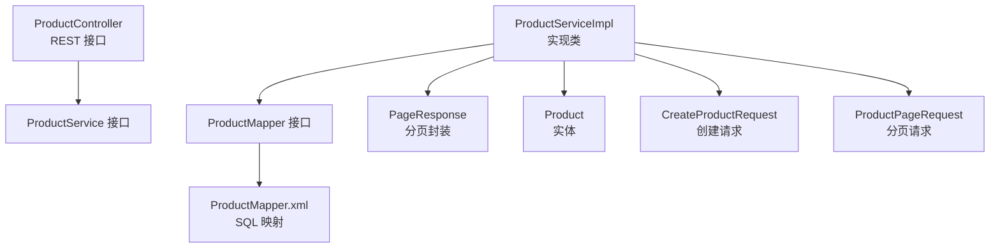
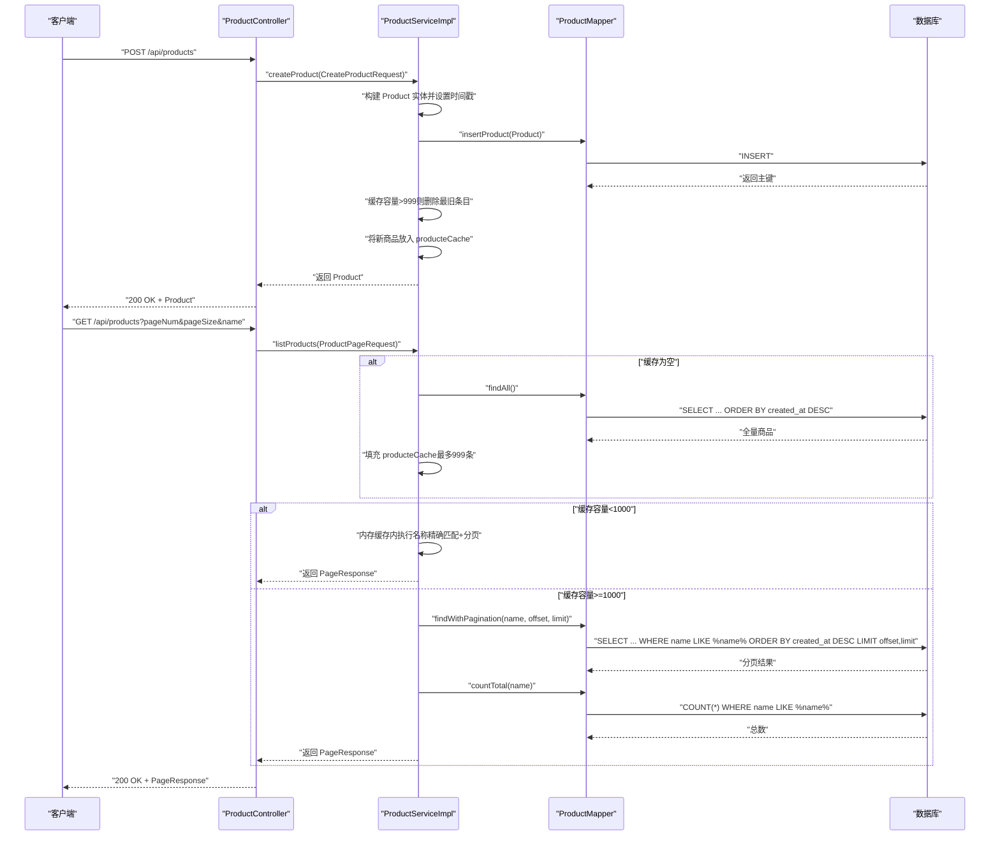
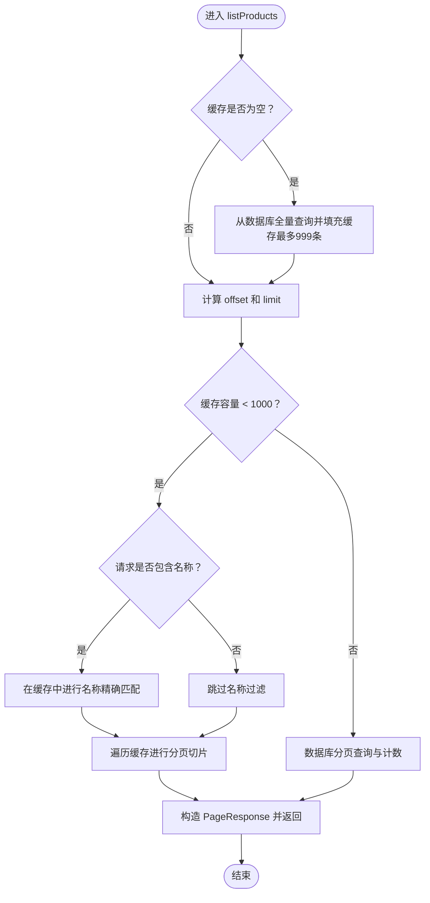
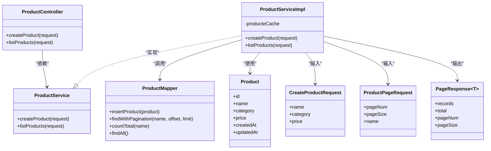

# 商品服务

<cite>
**本文引用的文件**
- [ProductService.java](file://src/main/java/com/example/onlinestore/service/ProductService.java)
- [ProductServiceImpl.java](file://src/main/java/com/example/onlinestore/service/impl/ProductServiceImpl.java)
- [CreateProductRequest.java](file://src/main/java/com/example/onlinestore/dto/CreateProductRequest.java)
- [ProductPageRequest.java](file://src/main/java/com/example/onlinestore/dto/ProductPageRequest.java)
- [PageResponse.java](file://src/main/java/com/example/onlinestore/dto/PageResponse.java)
- [Product.java](file://src/main/java/com/example/onlinestore/model/Product.java)
- [ProductMapper.java](file://src/main/java/com/example/onlinestore/mapper/ProductMapper.java)
- [ProductMapper.xml](file://src/main/resources/mapper/ProductMapper.xml)
- [ProductController.java](file://src/main/java/com/example/onlinestore/controller/ProductController.java)
</cite>

## 目录
1. [简介](#简介)
2. [项目结构](#项目结构)
3. [核心组件](#核心组件)
4. [架构总览](#架构总览)
5. [详细组件分析](#详细组件分析)
6. [依赖关系分析](#依赖关系分析)
7. [性能考量](#性能考量)
8. [故障排查指南](#故障排查指南)
9. [结论](#结论)

## 简介
本文件围绕 ProductService 接口及其实现 ProductServiceImpl 的核心功能展开，重点覆盖：
- createProduct 方法的完整业务流程：接收 CreateProductRequest 参数，构建 Product 实体，通过 ProductMapper 持久化到数据库，并在成功后将新创建的商品加入内存缓存（producteCache）。
- 缓存管理策略：当缓存容量超过 999 条时，自动移除最旧的商品条目以防止内存溢出。
- listProducts 方法的智能查询逻辑：优先加载全量商品数据到缓存；在缓存未满 1000 条时，优先从内存缓存中执行分页和精确名称查询以提升性能；当缓存容量达到上限则回退到数据库分页查询。
- 日志记录最佳实践、PageResponse 分页结果封装模式。
- @Transactional 注解在 createProduct 中保障数据一致性的意义，以及缓存与数据库之间的最终一致性模型。

## 项目结构
- 控制器层：ProductController 提供 REST 接口，负责参数校验与异常处理。
- 服务层：ProductService 定义接口，ProductServiceImpl 实现具体业务逻辑。
- 数据访问层：ProductMapper 接口与 ProductMapper.xml 映射 SQL。
- DTO/Model：CreateProductRequest、ProductPageRequest、PageResponse、Product。
- 配置与资源：MyBatis 配置、SQL 脚本等位于 resources 下。

图表来源
- [ProductController.java](file://src/main/java/com/example/onlinestore/controller/ProductController.java#L30-L77)
- [ProductService.java](file://src/main/java/com/example/onlinestore/service/ProductService.java#L8-L10)
- [ProductServiceImpl.java](file://src/main/java/com/example/onlinestore/service/impl/ProductServiceImpl.java#L21-L131)
- [ProductMapper.java](file://src/main/java/com/example/onlinestore/mapper/ProductMapper.java#L9-L19)
- [ProductMapper.xml](file://src/main/resources/mapper/ProductMapper.xml#L1-L36)
- [PageResponse.java](file://src/main/java/com/example/onlinestore/dto/PageResponse.java#L1-L42)
- [Product.java](file://src/main/java/com/example/onlinestore/model/Product.java#L1-L61)
- [CreateProductRequest.java](file://src/main/java/com/example/onlinestore/dto/CreateProductRequest.java#L1-L42)
- [ProductPageRequest.java](file://src/main/java/com/example/onlinestore/dto/ProductPageRequest.java#L1-L39)

章节来源
- [ProductController.java](file://src/main/java/com/example/onlinestore/controller/ProductController.java#L30-L77)
- [ProductService.java](file://src/main/java/com/example/onlinestore/service/ProductService.java#L8-L10)
- [ProductServiceImpl.java](file://src/main/java/com/example/onlinestore/service/impl/ProductServiceImpl.java#L21-L131)
- [ProductMapper.java](file://src/main/java/com/example/onlinestore/mapper/ProductMapper.java#L9-L19)
- [ProductMapper.xml](file://src/main/resources/mapper/ProductMapper.xml#L1-L36)
- [PageResponse.java](file://src/main/java/com/example/onlinestore/dto/PageResponse.java#L1-L42)
- [Product.java](file://src/main/java/com/example/onlinestore/model/Product.java#L1-L61)
- [CreateProductRequest.java](file://src/main/java/com/example/onlinestore/dto/CreateProductRequest.java#L1-L42)
- [ProductPageRequest.java](file://src/main/java/com/example/onlinestore/dto/ProductPageRequest.java#L1-L39)

## 核心组件
- ProductService：定义 createProduct 与 listProducts 两个核心方法。
- ProductServiceImpl：
  - 使用 @Transactional 保证 createProduct 的原子性与一致性。
  - 维护内存 Map<Long, Product> 作为 producteCache，容量阈值为 999。
  - listProducts 在缓存容量小于 1000 时优先走内存缓存，否则回退数据库。
- ProductMapper/ProductMapper.xml：提供插入、分页查询、总数统计、全量查询能力。
- DTO/Model：CreateProductRequest、ProductPageRequest、PageResponse、Product。

章节来源
- [ProductService.java](file://src/main/java/com/example/onlinestore/service/ProductService.java#L8-L10)
- [ProductServiceImpl.java](file://src/main/java/com/example/onlinestore/service/impl/ProductServiceImpl.java#L21-L131)
- [ProductMapper.java](file://src/main/java/com/example/onlinestore/mapper/ProductMapper.java#L9-L19)
- [ProductMapper.xml](file://src/main/resources/mapper/ProductMapper.xml#L1-L36)
- [CreateProductRequest.java](file://src/main/java/com/example/onlinestore/dto/CreateProductRequest.java#L1-L42)
- [ProductPageRequest.java](file://src/main/java/com/example/onlinestore/dto/ProductPageRequest.java#L1-L39)
- [PageResponse.java](file://src/main/java/com/example/onlinestore/dto/PageResponse.java#L1-L42)
- [Product.java](file://src/main/java/com/example/onlinestore/model/Product.java#L1-L61)

## 架构总览
下图展示从控制器到服务再到数据访问层的整体调用链路，以及缓存与数据库的交互策略。

图表来源
- [ProductController.java](file://src/main/java/com/example/onlinestore/controller/ProductController.java#L30-L77)
- [ProductServiceImpl.java](file://src/main/java/com/example/onlinestore/service/impl/ProductServiceImpl.java#L33-L130)
- [ProductMapper.java](file://src/main/java/com/example/onlinestore/mapper/ProductMapper.java#L11-L19)
- [ProductMapper.xml](file://src/main/resources/mapper/ProductMapper.xml#L1-L36)

## 详细组件分析

### ProductService 接口
- 定义 createProduct 与 listProducts 两个方法，职责清晰，便于扩展与测试。

章节来源
- [ProductService.java](file://src/main/java/com/example/onlinestore/service/ProductService.java#L8-L10)

### ProductServiceImpl 类
- 成员变量
  - producteCache：内存缓存，key 为商品 ID，value 为商品实体。
- createProduct 流程
  - 接收 CreateProductRequest，构建 Product 并设置时间戳。
  - 调用 ProductMapper.insertProduct 持久化。
  - 若缓存容量超过 999，则删除最旧条目（基于迭代器首个键）。
  - 将新商品放入缓存并返回。
- listProducts 流程
  - 若缓存为空，先从数据库全量查询并填充缓存（最多 999 条）。
  - 若缓存容量小于 1000：
    - 若请求包含名称，则在缓存中进行名称精确匹配（注意：当前实现对名称相等使用“==”，建议改为 equals）。
    - 对缓存进行分页切片，构造 PageResponse 返回。
  - 若缓存容量达到或超过 1000：
    - 回退到数据库分页查询与计数，构造 PageResponse 返回。

图表来源
- [ProductServiceImpl.java](file://src/main/java/com/example/onlinestore/service/impl/ProductServiceImpl.java#L59-L130)
- [ProductMapper.xml](file://src/main/resources/mapper/ProductMapper.xml#L9-L35)

章节来源
- [ProductServiceImpl.java](file://src/main/java/com/example/onlinestore/service/impl/ProductServiceImpl.java#L21-L131)

### CreateProductRequest 与 ProductPageRequest
- CreateProductRequest：包含名称、分类、价格字段，配合校验注解确保参数合法性。
- ProductPageRequest：包含 pageNum、pageSize、name 字段，含最小值与最大值约束。

章节来源
- [CreateProductRequest.java](file://src/main/java/com/example/onlinestore/dto/CreateProductRequest.java#L1-L42)
- [ProductPageRequest.java](file://src/main/java/com/example/onlinestore/dto/ProductPageRequest.java#L1-L39)

### PageResponse 分页封装
- PageResponse<T> 提供 records、total、pageNum、pageSize 字段，统一分页响应格式，便于前端消费。

章节来源
- [PageResponse.java](file://src/main/java/com/example/onlinestore/dto/PageResponse.java#L1-L42)

### ProductMapper 与 SQL 映射
- insertProduct：插入商品记录。
- findWithPagination：按名称模糊查询并分页。
- countTotal：按名称模糊查询总数。
- findAll：全量查询用于预热缓存。

章节来源
- [ProductMapper.java](file://src/main/java/com/example/onlinestore/mapper/ProductMapper.java#L11-L19)
- [ProductMapper.xml](file://src/main/resources/mapper/ProductMapper.xml#L1-L36)

### ProductController 控制器
- 提供创建商品与查询商品列表的 REST 接口，结合注解完成参数校验与权限控制。
- 对异常进行分级处理，返回标准化错误响应。

章节来源
- [ProductController.java](file://src/main/java/com/example/onlinestore/controller/ProductController.java#L30-L77)

## 依赖关系分析
- ProductServiceImpl 依赖 ProductMapper 进行数据库操作。
- 控制器层 ProductController 依赖 ProductService。
- DTO/Model 作为输入输出载体贯穿各层。
- PageResponse 作为跨层的通用响应封装。

图表来源
- [ProductController.java](file://src/main/java/com/example/onlinestore/controller/ProductController.java#L30-L77)
- [ProductService.java](file://src/main/java/com/example/onlinestore/service/ProductService.java#L8-L10)
- [ProductServiceImpl.java](file://src/main/java/com/example/onlinestore/service/impl/ProductServiceImpl.java#L21-L131)
- [ProductMapper.java](file://src/main/java/com/example/onlinestore/mapper/ProductMapper.java#L9-L19)
- [Product.java](file://src/main/java/com/example/onlinestore/model/Product.java#L1-L61)
- [CreateProductRequest.java](file://src/main/java/com/example/onlinestore/dto/CreateProductRequest.java#L1-L42)
- [ProductPageRequest.java](file://src/main/java/com/example/onlinestore/dto/ProductPageRequest.java#L1-L39)
- [PageResponse.java](file://src/main/java/com/example/onlinestore/dto/PageResponse.java#L1-L42)

## 性能考量
- 内存缓存命中率优化
  - 首次访问时全量加载至缓存（最多 999 条），后续读取直接走内存，避免频繁数据库 IO。
  - 当缓存容量达到阈值（1000）时，回退到数据库分页查询，避免缓存膨胀导致的性能与内存问题。
- 分页与查询策略
  - 缓存容量小于 1000 时，先在内存中进行名称精确匹配与分页切片，减少数据库压力。
  - 缓存容量达到上限后，采用数据库分页查询与计数，保证一致性与可扩展性。
- 事务与一致性
  - @Transactional 保证 createProduct 的插入与缓存更新在同一事务中，避免部分写入导致的数据不一致。
- 建议
  - listProducts 中名称比较使用 equals，避免“==”在字符串比较上的潜在问题。
  - 可考虑引入 LRU 或更高级的缓存淘汰策略，以提升缓存命中率与稳定性。

[本节为通用性能讨论，无需列出具体文件来源]

## 故障排查指南
- 创建商品失败
  - 参数校验失败：检查 CreateProductRequest 的必填与数值范围约束。
  - 服务端异常：查看控制器层的日志输出，定位异常类型与消息。
- 列表查询异常
  - 参数校验失败：检查 ProductPageRequest 的 pageNum、pageSize、name 是否符合约束。
  - 数据库异常：确认 ProductMapper.xml 的 SQL 是否正确，索引与排序是否合理。
- 缓存相关问题
  - 缓存未及时更新：确认 createProduct 成功后是否正确写入缓存。
  - 缓存容量溢出：确认容量阈值逻辑是否生效，必要时调整阈值或引入更优淘汰策略。

章节来源
- [ProductController.java](file://src/main/java/com/example/onlinestore/controller/ProductController.java#L30-L77)
- [ProductServiceImpl.java](file://src/main/java/com/example/onlinestore/service/impl/ProductServiceImpl.java#L33-L130)
- [ProductMapper.xml](file://src/main/resources/mapper/ProductMapper.xml#L1-L36)

## 结论
- ProductServiceImpl 通过内存缓存与数据库分页相结合的方式，在性能与一致性之间取得平衡。
- @Transactional 在 createProduct 中确保了数据一致性，配合缓存更新形成最终一致性模型。
- 建议进一步完善名称比较逻辑与缓存淘汰策略，以提升健壮性与可维护性。

[本节为总结性内容，无需列出具体文件来源]