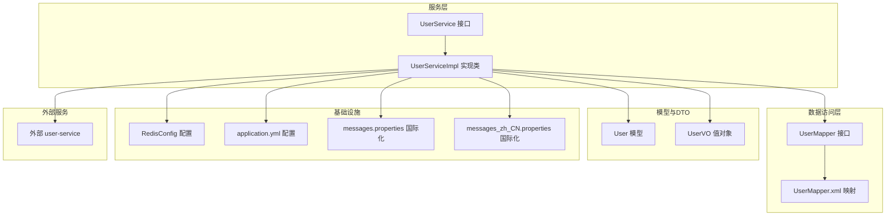
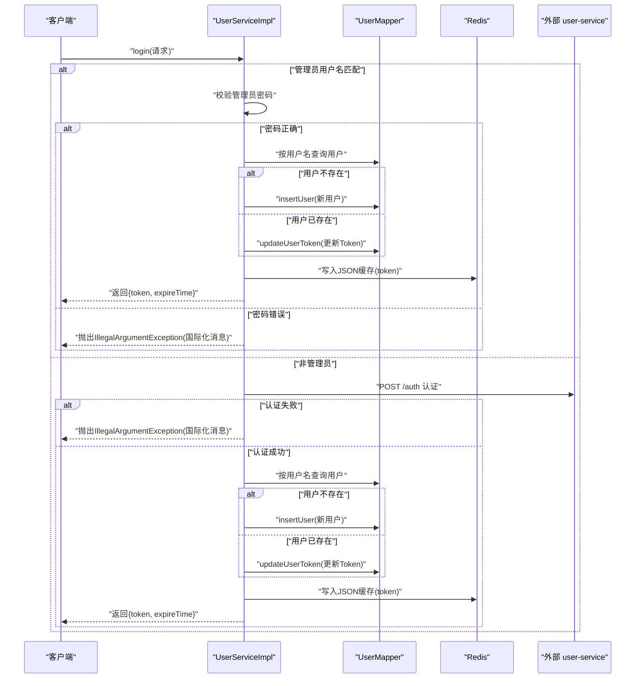
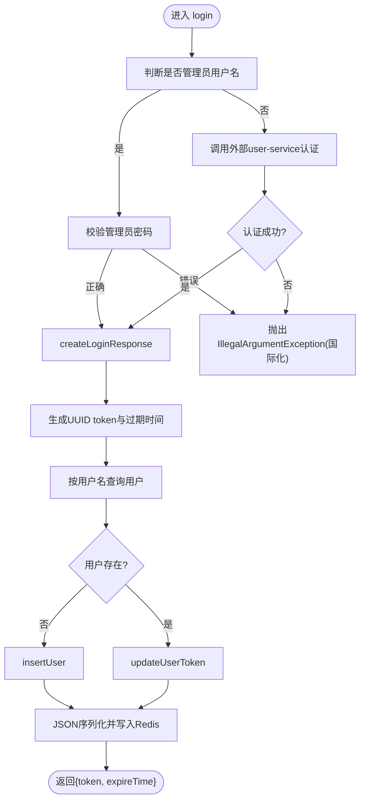
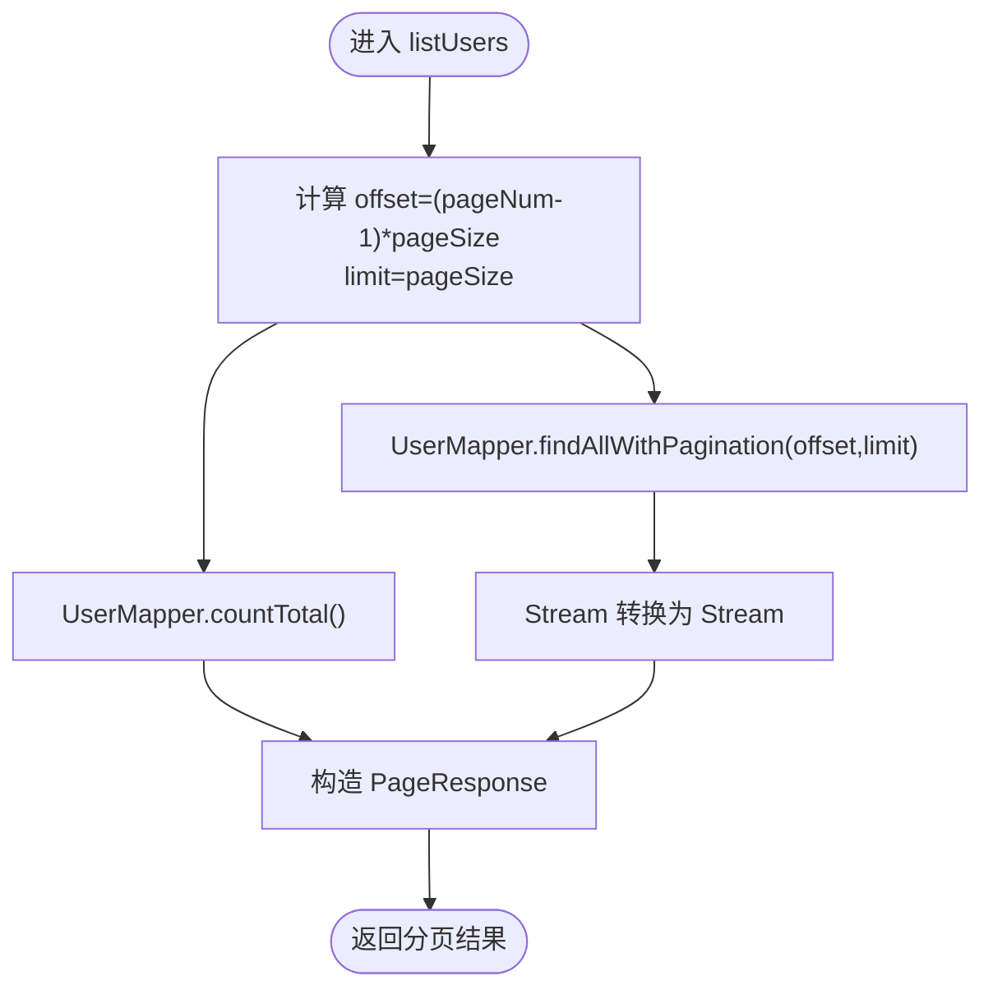
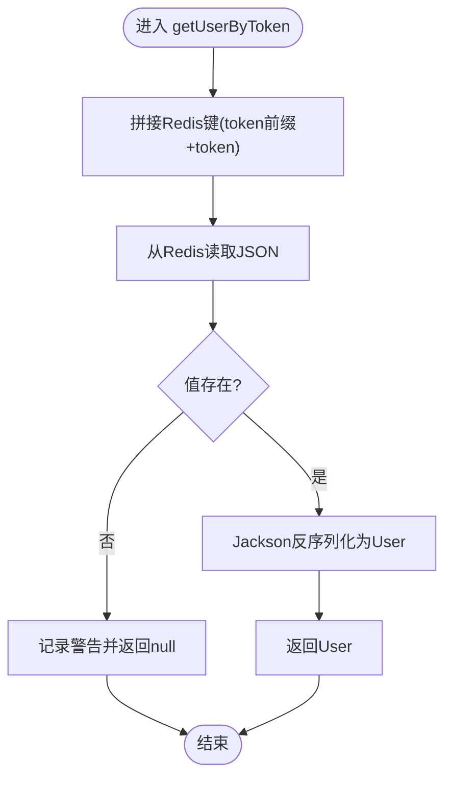
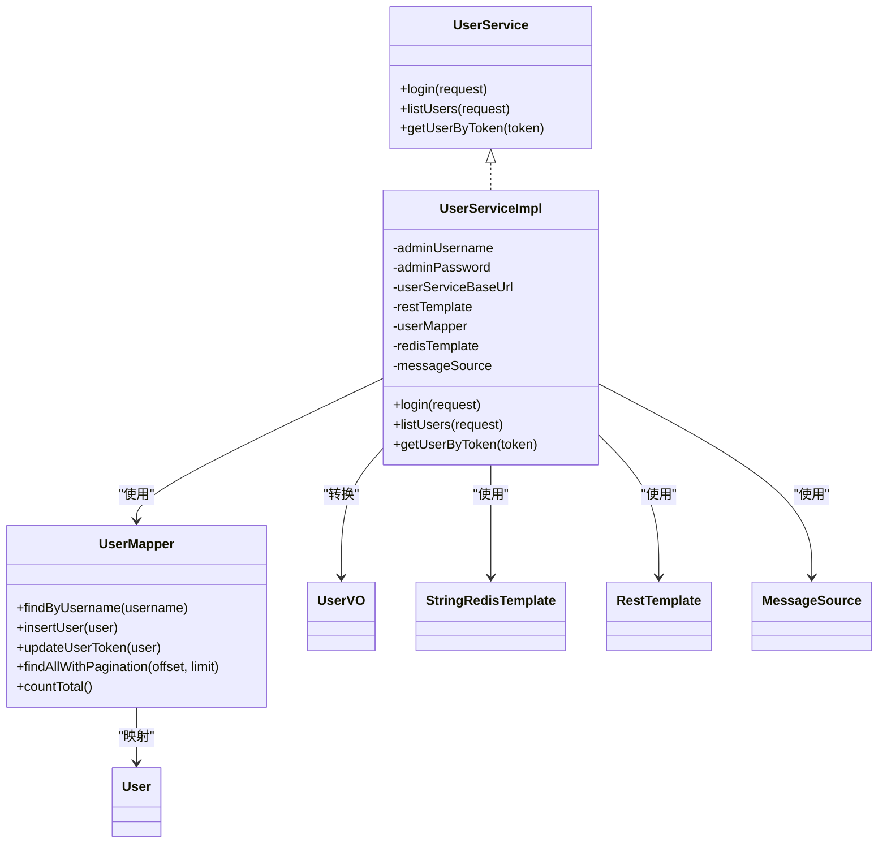

# 用户服务

<cite>
**本文引用的文件**
- [UserService.java](file://src/main/java/com/example/onlinestore/service/UserService.java)
- [UserServiceImpl.java](file://src/main/java/com/example/onlinestore/service/impl/UserServiceImpl.java)
- [UserMapper.java](file://src/main/java/com/example/onlinestore/mapper/UserMapper.java)
- [UserMapper.xml](file://src/main/resources/mapper/UserMapper.xml)
- [User.java](file://src/main/java/com/example/onlinestore/model/User.java)
- [UserVO.java](file://src/main/java/com/example/onlinestore/dto/UserVO.java)
- [RedisConfig.java](file://src/main/java/com/example/onlinestore/config/RedisConfig.java)
- [application.yml](file://src/main/resources/application.yml)
- [messages.properties](file://src/main/resources/i18n/messages.properties)
- [messages_zh_CN.properties](file://src/main/resources/i18n/messages_zh_CN.properties)
- [UserServiceTest.java](file://src/test/java/com/example/onlinestore/service/UserServiceTest.java)
</cite>

## 目录
1. [简介](#简介)
2. [项目结构](#项目结构)
3. [核心组件](#核心组件)
4. [架构总览](#架构总览)
5. [详细组件分析](#详细组件分析)
6. [依赖关系分析](#依赖关系分析)
7. [性能考量](#性能考量)
8. [故障排查指南](#故障排查指南)
9. [结论](#结论)
10. [附录](#附录)

## 简介
本文件围绕 UserService 接口及其实现类 UserServiceImpl 的业务逻辑展开，重点解析以下内容：
- 登录流程的两种模式：管理员快速登录（基于配置的用户名/密码验证）与普通用户登录（通过 RestTemplate 调用外部 user-service 进行认证）
- 登录成功后的本地用户信息创建/更新、Token 生成、用户对象 JSON 序列化与 Redis 缓存
- listUsers 方法的分页查询实现（offset/limit 计算、数据库查询、User 到 UserVO 的转换）
- getUserByToken 方法从 Redis 中高效读取用户信息以支持后续权限校验
- @Transactional 注解在 login 方法中保证数据库操作（insertUser/updateUserToken）的原子性，以及异常处理中对 IllegalArgumentException 的合理抛出与国际化消息集成
- 结合 UserServiceTest 的单元测试用例，说明管理员正确/错误密码登录、普通用户认证成功/失败等关键分支的测试覆盖情况

## 项目结构
在线商店应用采用分层架构，用户相关功能位于 service 层与 mapper 层，并通过 MyBatis 访问数据库，使用 Redis 缓存用户信息，通过 RestTemplate 调用外部 user-service 完成普通用户的认证。

图表来源
- [UserServiceImpl.java](file://src/main/java/com/example/onlinestore/service/impl/UserServiceImpl.java#L67-L139)
- [UserMapper.java](file://src/main/java/com/example/onlinestore/mapper/UserMapper.java#L1-L23)
- [UserMapper.xml](file://src/main/resources/mapper/UserMapper.xml#L1-L34)
- [User.java](file://src/main/java/com/example/onlinestore/model/User.java#L1-L60)
- [UserVO.java](file://src/main/java/com/example/onlinestore/dto/UserVO.java#L1-L42)
- [RedisConfig.java](file://src/main/java/com/example/onlinestore/config/RedisConfig.java#L1-L15)
- [application.yml](file://src/main/resources/application.yml#L1-L48)
- [messages.properties](file://src/main/resources/i18n/messages.properties#L1-L17)
- [messages_zh_CN.properties](file://src/main/resources/i18n/messages_zh_CN.properties#L1-L17)

章节来源
- [UserServiceImpl.java](file://src/main/java/com/example/onlinestore/service/impl/UserServiceImpl.java#L67-L139)
- [UserMapper.java](file://src/main/java/com/example/onlinestore/mapper/UserMapper.java#L1-L23)
- [UserMapper.xml](file://src/main/resources/mapper/UserMapper.xml#L1-L34)
- [application.yml](file://src/main/resources/application.yml#L1-L48)

## 核心组件
- UserService 接口：定义登录、分页查询用户、按 Token 获取用户等能力
- UserServiceImpl：实现登录、分页查询、按 Token 获取用户；负责管理员快速登录、普通用户认证、本地用户信息维护、Token 生成与 Redis 缓存
- UserMapper：MyBatis 接口，提供按用户名查询、插入用户、更新用户 Token、分页查询与总数统计
- User 模型与 UserVO：User 为持久化实体，UserVO 用于对外返回的轻量视图
- RedisConfig：提供 StringRedisTemplate Bean，供 UserServiceImpl 使用
- application.yml：提供 admin.auth.username/password 与 service.user.base-url 等关键配置
- 国际化资源：messages.properties 与 messages_zh_CN.properties 提供错误消息

章节来源
- [UserService.java](file://src/main/java/com/example/onlinestore/service/UserService.java#L1-L14)
- [UserServiceImpl.java](file://src/main/java/com/example/onlinestore/service/impl/UserServiceImpl.java#L67-L139)
- [UserMapper.java](file://src/main/java/com/example/onlinestore/mapper/UserMapper.java#L1-L23)
- [User.java](file://src/main/java/com/example/onlinestore/model/User.java#L1-L60)
- [UserVO.java](file://src/main/java/com/example/onlinestore/dto/UserVO.java#L1-L42)
- [RedisConfig.java](file://src/main/java/com/example/onlinestore/config/RedisConfig.java#L1-L15)
- [application.yml](file://src/main/resources/application.yml#L1-L48)
- [messages.properties](file://src/main/resources/i18n/messages.properties#L1-L17)
- [messages_zh_CN.properties](file://src/main/resources/i18n/messages_zh_CN.properties#L1-L17)

## 架构总览
下图展示登录流程与数据流的关键节点：管理员快速登录与普通用户登录两条路径，成功后统一走 createLoginResponse 流程完成本地用户维护、Token 生成与 Redis 缓存。

图表来源
- [UserServiceImpl.java](file://src/main/java/com/example/onlinestore/service/impl/UserServiceImpl.java#L67-L139)
- [UserMapper.java](file://src/main/java/com/example/onlinestore/mapper/UserMapper.java#L1-L23)
- [UserMapper.xml](file://src/main/resources/mapper/UserMapper.xml#L1-L34)
- [application.yml](file://src/main/resources/application.yml#L41-L48)
- [messages.properties](file://src/main/resources/i18n/messages.properties#L1-L17)

## 详细组件分析

### 登录流程（管理员快速登录 vs 普通用户登录）
- 管理员快速登录
  - 依据配置项 admin.auth.username/password 进行用户名/密码比对
  - 密码正确时直接进入 createLoginResponse 流程
  - 密码错误时抛出 IllegalArgumentException，并使用国际化消息源返回对应语言的错误提示
- 普通用户登录
  - 通过 RestTemplate 向 service.user.base-url + "/auth" 发起认证请求
  - 若返回空或 false，则抛出 IllegalArgumentException 并使用国际化消息
  - 认证成功后进入 createLoginResponse 流程
- createLoginResponse 流程
  - 生成 UUID 作为 token，并设置过期时间
  - 查询用户是否存在：不存在则插入新用户，存在则更新 token 与过期时间
  - 使用 Jackson 将 User 对象序列化为 JSON，键为 token 前缀拼接的字符串，写入 Redis，过期时间与 token 一致
  - 返回包含 token 与过期时间的 LoginResponse

图表来源
- [UserServiceImpl.java](file://src/main/java/com/example/onlinestore/service/impl/UserServiceImpl.java#L67-L139)
- [application.yml](file://src/main/resources/application.yml#L41-L48)
- [messages.properties](file://src/main/resources/i18n/messages.properties#L1-L17)

章节来源
- [UserServiceImpl.java](file://src/main/java/com/example/onlinestore/service/impl/UserServiceImpl.java#L67-L139)
- [application.yml](file://src/main/resources/application.yml#L41-L48)
- [messages.properties](file://src/main/resources/i18n/messages.properties#L1-L17)
- [messages_zh_CN.properties](file://src/main/resources/i18n/messages_zh_CN.properties#L1-L17)

### 分页查询 listUsers 的实现机制
- 参数计算
  - offset = (pageNum - 1) × pageSize
  - limit = pageSize
- 数据库查询
  - 使用 UserMapper.findAllWithPagination(offset, limit) 查询当前页记录
  - 使用 UserMapper.countTotal() 获取总记录数
- 对象转换
  - 将 List<User> 转换为 List<UserVO>，仅保留必要字段（id、username、createdAt、updatedAt）
- 响应构建
  - 构造 PageResponse<UserVO>，填充 records、total、pageNum、pageSize 字段

图表来源
- [UserServiceImpl.java](file://src/main/java/com/example/onlinestore/service/impl/UserServiceImpl.java#L153-L176)
- [UserMapper.java](file://src/main/java/com/example/onlinestore/mapper/UserMapper.java#L1-L23)
- [UserMapper.xml](file://src/main/resources/mapper/UserMapper.xml#L24-L33)
- [UserVO.java](file://src/main/java/com/example/onlinestore/dto/UserVO.java#L1-L42)

章节来源
- [UserServiceImpl.java](file://src/main/java/com/example/onlinestore/service/impl/UserServiceImpl.java#L153-L176)
- [UserMapper.java](file://src/main/java/com/example/onlinestore/mapper/UserMapper.java#L1-L23)
- [UserMapper.xml](file://src/main/resources/mapper/UserMapper.xml#L24-L33)
- [UserVO.java](file://src/main/java/com/example/onlinestore/dto/UserVO.java#L1-L42)

### 按 Token 获取用户 getUserByToken
- 从 Redis 读取 JSON 字符串，若为空则记录警告并返回 null
- 使用 Jackson 反序列化为 User 对象
- 异常捕获：读取失败或反序列化失败时记录错误日志并返回 null，不中断上层流程

图表来源
- [UserServiceImpl.java](file://src/main/java/com/example/onlinestore/service/impl/UserServiceImpl.java#L179-L193)

章节来源
- [UserServiceImpl.java](file://src/main/java/com/example/onlinestore/service/impl/UserServiceImpl.java#L179-L193)

### 事务性与原子性保障
- 在 login 方法上使用 @Transactional，确保 createLoginResponse 内部的数据库操作（按用户名查询、插入用户、更新 Token）处于同一事务上下文中
- 该设计避免了“查不到用户—插入—再查到用户”的竞态问题，保证数据一致性

章节来源
- [UserServiceImpl.java](file://src/main/java/com/example/onlinestore/service/impl/UserServiceImpl.java#L67-L139)
- [UserMapper.java](file://src/main/java/com/example/onlinestore/mapper/UserMapper.java#L1-L23)
- [UserMapper.xml](file://src/main/resources/mapper/UserMapper.xml#L1-L34)

### 错误处理与国际化
- 当管理员密码错误或外部认证失败时，抛出 IllegalArgumentException
- 使用 MessageSource 与 LocaleContextHolder 获取当前语言环境下的错误消息，提升用户体验
- 单元测试覆盖了管理员错误密码与普通用户认证失败的分支，验证异常抛出与消息内容

章节来源
- [UserServiceImpl.java](file://src/main/java/com/example/onlinestore/service/impl/UserServiceImpl.java#L76-L95)
- [messages.properties](file://src/main/resources/i18n/messages.properties#L1-L17)
- [messages_zh_CN.properties](file://src/main/resources/i18n/messages_zh_CN.properties#L1-L17)
- [UserServiceTest.java](file://src/test/java/com/example/onlinestore/service/UserServiceTest.java#L203-L225)
- [UserServiceTest.java](file://src/test/java/com/example/onlinestore/service/UserServiceTest.java#L227-L251)

### 单元测试覆盖情况
- 管理员登录
  - 新用户：验证插入用户、生成 token、写入 Redis、未调用外部服务
  - 已存在用户：验证更新 token、生成新 token、写入 Redis、未调用外部服务
  - 错误密码：验证抛出 IllegalArgumentException、未执行数据库与缓存操作
- 普通用户登录
  - 新用户：验证插入用户、生成 token、写入 Redis、调用外部认证且返回 true
  - 已存在用户：验证更新 token、生成新 token、写入 Redis、调用外部认证且返回 true
  - 认证失败：验证抛出 IllegalArgumentException、未执行数据库与缓存操作
- 断言要点
  - 使用 ArgumentCaptor 验证插入/更新用户对象的字段（username、token、tokenExpireTime）
  - 使用 verify 验证调用次数与顺序（如 never、times 等）

章节来源
- [UserServiceTest.java](file://src/test/java/com/example/onlinestore/service/UserServiceTest.java#L61-L88)
- [UserServiceTest.java](file://src/test/java/com/example/onlinestore/service/UserServiceTest.java#L90-L122)
- [UserServiceTest.java](file://src/test/java/com/example/onlinestore/service/UserServiceTest.java#L124-L159)
- [UserServiceTest.java](file://src/test/java/com/example/onlinestore/service/UserServiceTest.java#L161-L201)
- [UserServiceTest.java](file://src/test/java/com/example/onlinestore/service/UserServiceTest.java#L203-L225)
- [UserServiceTest.java](file://src/test/java/com/example/onlinestore/service/UserServiceTest.java#L227-L251)

## 依赖关系分析
- 组件耦合
  - UserServiceImpl 依赖 UserMapper、RestTemplate、StringRedisTemplate、MessageSource
  - UserMapper 通过 MyBatis XML 映射 SQL，与 User 模型绑定
  - RedisConfig 提供 StringRedisTemplate Bean，简化注入
- 外部依赖
  - application.yml 提供 admin.auth.username/password 与 service.user.base-url
  - 外部 user-service 通过 RestTemplate 访问其 /auth 接口
- 配置与国际化
  - 国际化消息由 messages.properties 与 messages_zh_CN.properties 提供
  - LocaleContextHolder 用于根据当前区域选择消息

图表来源
- [UserService.java](file://src/main/java/com/example/onlinestore/service/UserService.java#L1-L14)
- [UserServiceImpl.java](file://src/main/java/com/example/onlinestore/service/impl/UserServiceImpl.java#L67-L193)
- [UserMapper.java](file://src/main/java/com/example/onlinestore/mapper/UserMapper.java#L1-L23)
- [User.java](file://src/main/java/com/example/onlinestore/model/User.java#L1-L60)
- [UserVO.java](file://src/main/java/com/example/onlinestore/dto/UserVO.java#L1-L42)
- [RedisConfig.java](file://src/main/java/com/example/onlinestore/config/RedisConfig.java#L1-L15)
- [application.yml](file://src/main/resources/application.yml#L41-L48)

章节来源
- [UserServiceImpl.java](file://src/main/java/com/example/onlinestore/service/impl/UserServiceImpl.java#L67-L193)
- [UserMapper.java](file://src/main/java/com/example/onlinestore/mapper/UserMapper.java#L1-L23)
- [application.yml](file://src/main/resources/application.yml#L41-L48)

## 性能考量
- 登录流程
  - Redis 写入为异步友好操作，但当前实现未显式异步化；若高并发可考虑异步缓存策略
  - Jackson 序列化/反序列化开销较小，建议保持默认配置
- 分页查询
  - offset/limit 计算简单，数据库端使用 LIMIT 实现分页
  - UserMapper.xml 的排序按创建时间倒序，有利于新用户优先展示
- 缓存命中
  - Redis 缓存键带过期时间，避免长期占用内存；建议监控缓存命中率与过期策略

[本节为通用性能讨论，无需列出具体文件来源]

## 故障排查指南
- 管理员登录失败
  - 检查 application.yml 中 admin.auth.username/password 是否正确
  - 观察日志中管理员密码错误的警告信息
- 普通用户认证失败
  - 检查 service.user.base-url 配置与外部 user-service 可达性
  - 关注 RestTemplate 调用返回值是否为 true
- Redis 缓存异常
  - 检查 RedisConfig 是否正确装配 StringRedisTemplate
  - 观察缓存写入失败的日志与异常栈
- 分页查询异常
  - 确认 pageNum/pageSize 合法范围（最小为 1），避免负 offset
  - 核对 UserMapper.xml 的 LIMIT 语法与数据库方言兼容性

章节来源
- [application.yml](file://src/main/resources/application.yml#L41-L48)
- [UserServiceImpl.java](file://src/main/java/com/example/onlinestore/service/impl/UserServiceImpl.java#L67-L139)
- [UserServiceImpl.java](file://src/main/java/com/example/onlinestore/service/impl/UserServiceImpl.java#L179-L193)
- [UserMapper.xml](file://src/main/resources/mapper/UserMapper.xml#L24-L33)

## 结论
UserServiceImpl 将管理员快速登录与普通用户认证解耦，统一在 createLoginResponse 中完成本地用户状态维护、Token 生成与 Redis 缓存，保证了登录流程的一致性与可扩展性。配合 @Transactional 与完善的单元测试，系统在数据一致性与边界条件处理方面具备良好质量。分页查询与按 Token 获取用户的方法分别满足后台管理与权限校验场景，整体架构清晰、职责明确。

[本节为总结性内容，无需列出具体文件来源]

## 附录
- 关键配置项
  - admin.auth.username/admin.auth.password：管理员登录凭据
  - service.user.base-url：外部 user-service 地址
  - spring.data.redis.*：Redis 连接参数
- 国际化消息键
  - error.invalid.credentials：用户名或密码错误

章节来源
- [application.yml](file://src/main/resources/application.yml#L1-L48)
- [messages.properties](file://src/main/resources/i18n/messages.properties#L1-L17)
- [messages_zh_CN.properties](file://src/main/resources/i18n/messages_zh_CN.properties#L1-L17)