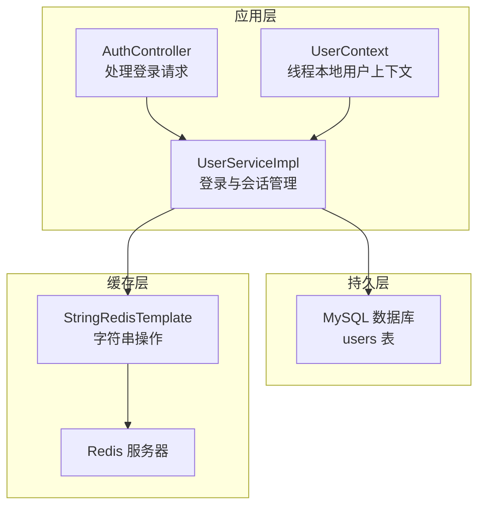
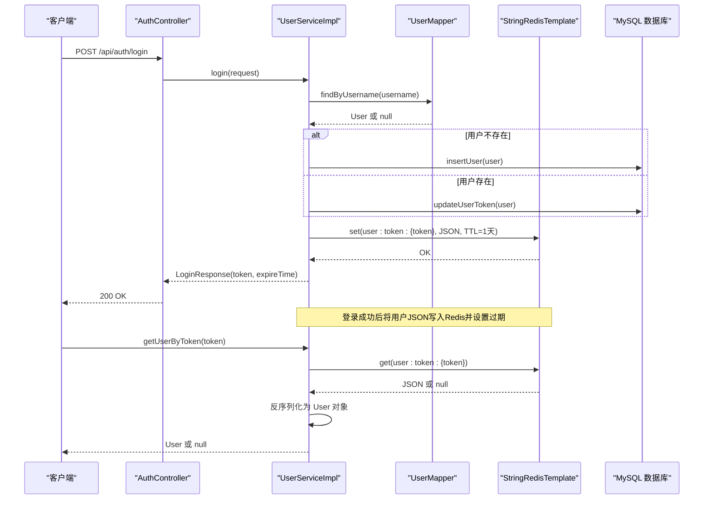
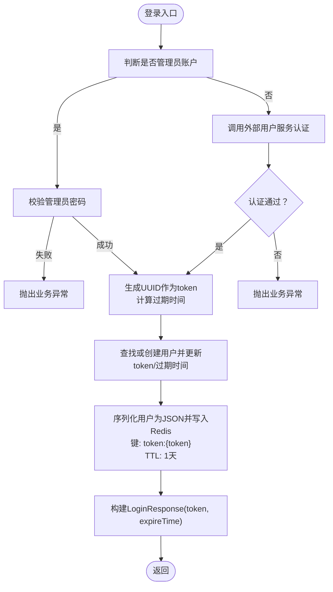
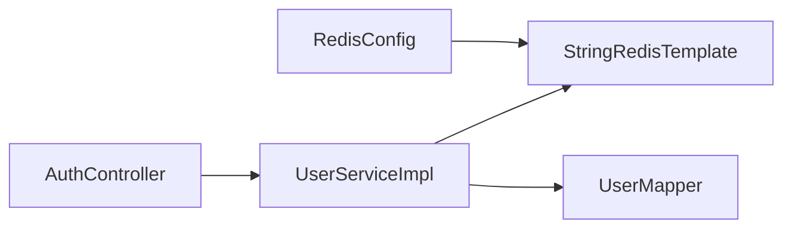

# Redis缓存集成

<cite>
**本文引用的文件**
- [RedisConfig.java](file://src/main/java/com/example/onlinestore/config/RedisConfig.java)
- [UserServiceImpl.java](file://src/main/java/com/example/onlinestore/service/impl/UserServiceImpl.java)
- [UserContext.java](file://src/main/java/com/example/onlinestore/context/UserContext.java)
- [AuthController.java](file://src/main/java/com/example/onlinestore/controller/AuthController.java)
- [application.yml](file://src/main/resources/application.yml)
- [pom.xml](file://pom.xml)
- [User.java](file://src/main/java/com/example/onlinestore/model/User.java)
- [LoginResponse.java](file://src/main/java/com/example/onlinestore/dto/LoginResponse.java)
- [schema.sql](file://src/main/resources/db/schema.sql)
- [UserServiceTest.java](file://src/test/java/com/example/onlinestore/service/UserServiceTest.java)
</cite>

## 目录
1. [简介](#简介)
2. [项目结构](#项目结构)
3. [核心组件](#核心组件)
4. [架构总览](#架构总览)
5. [详细组件分析](#详细组件分析)
6. [依赖关系分析](#依赖关系分析)
7. [性能考量](#性能考量)
8. [故障排查指南](#故障排查指南)
9. [结论](#结论)
10. [附录](#附录)

## 简介
本文件围绕 online-store 项目中 Redis 的集成方式进行系统化解析，重点覆盖以下方面：
- RedisConfig 如何通过 StringRedisTemplate 配置 Redis 连接工厂，支持字符串数据的高效存取；
- 在用户认证流程中，UserServiceImpl 如何将用户 Token 与会话信息写入 Redis，并设置合理的过期时间以实现自动清理；
- UserContext 如何从 Redis 中恢复用户上下文信息，支撑后续权限校验；
- 当前默认序列化策略（JDK 序列化）的局限性，以及建议替换为 Jackson2JsonRedisSerializer 的理由；
- Redis 键命名规范建议（如 user:token:{token}）；
- 连接池配置缺失可能带来的性能瓶颈；
- 缓存穿透、雪崩的预防建议及监控指标（命中率、内存使用）。

## 项目结构
online-store 使用 Spring Boot Starter Data Redis 与 Jedis 客户端，默认通过 application.yml 提供连接参数；RedisConfig 仅声明了 StringRedisTemplate Bean，便于以字符串形式读写用户会话 JSON 数据。

图表来源
- [AuthController.java](file://src/main/java/com/example/onlinestore/controller/AuthController.java#L1-L45)
- [UserServiceImpl.java](file://src/main/java/com/example/onlinestore/service/impl/UserServiceImpl.java#L1-L193)
- [RedisConfig.java](file://src/main/java/com/example/onlinestore/config/RedisConfig.java#L1-L15)
- [application.yml](file://src/main/resources/application.yml#L1-L48)

章节来源
- [application.yml](file://src/main/resources/application.yml#L1-L48)
- [RedisConfig.java](file://src/main/java/com/example/onlinestore/config/RedisConfig.java#L1-L15)

## 核心组件
- RedisConfig：定义 StringRedisTemplate Bean，用于以字符串键值对形式访问 Redis，适合存储 JSON 字符串的场景。
- UserServiceImpl：负责登录、生成 Token、持久化用户信息到 Redis、按 Token 获取用户信息等。
- UserContext：基于 ThreadLocal 的用户上下文容器，用于在同一线程内传递当前用户对象，支撑权限校验。
- AuthController：对外暴露登录接口，调用 UserService 完成认证与响应封装。

章节来源
- [RedisConfig.java](file://src/main/java/com/example/onlinestore/config/RedisConfig.java#L1-L15)
- [UserServiceImpl.java](file://src/main/java/com/example/onlinestore/service/impl/UserServiceImpl.java#L1-L193)
- [UserContext.java](file://src/main/java/com/example/onlinestore/context/UserContext.java#L1-L19)
- [AuthController.java](file://src/main/java/com/example/onlinestore/controller/AuthController.java#L1-L45)

## 架构总览
下图展示了登录与会话恢复的关键交互路径，包括数据库、Redis 与控制器之间的协作。

图表来源
- [AuthController.java](file://src/main/java/com/example/onlinestore/controller/AuthController.java#L1-L45)
- [UserServiceImpl.java](file://src/main/java/com/example/onlinestore/service/impl/UserServiceImpl.java#L67-L139)
- [UserServiceImpl.java](file://src/main/java/com/example/onlinestore/service/impl/UserServiceImpl.java#L179-L193)
- [schema.sql](file://src/main/resources/db/schema.sql#L1-L8)

## 详细组件分析

### RedisConfig：StringRedisTemplate 的装配
- 作用：通过注入 RedisConnectionFactory 创建 StringRedisTemplate，使其以字符串形式操作 Redis，适合存储 JSON 文本。
- 影响：配合 UserServiceImpl 的 JSON 序列化/反序列化，形成“键=字符串，值=JSON”的典型缓存模式。

章节来源
- [RedisConfig.java](file://src/main/java/com/example/onlinestore/config/RedisConfig.java#L1-L15)

### UserServiceImpl：登录与会话缓存
- Token 生成与过期：登录成功后生成 UUID 作为 token，并设置过期时间为 1 天。
- 用户持久化：若用户不存在则插入，否则更新 token 与过期时间。
- Redis 写入：将用户对象序列化为 JSON，使用键前缀“token:”+token 写入 Redis，并设置 TTL。
- Redis 读取：根据 token 从 Redis 读取 JSON 并反序列化为 User 对象；若无数据返回 null。
- 异常处理：缓存失败时记录日志但不中断主流程。

图表来源
- [UserServiceImpl.java](file://src/main/java/com/example/onlinestore/service/impl/UserServiceImpl.java#L67-L139)

章节来源
- [UserServiceImpl.java](file://src/main/java/com/example/onlinestore/service/impl/UserServiceImpl.java#L67-L139)
- [UserServiceImpl.java](file://src/main/java/com/example/onlinestore/service/impl/UserServiceImpl.java#L179-L193)
- [User.java](file://src/main/java/com/example/onlinestore/model/User.java#L1-L60)
- [LoginResponse.java](file://src/main/java/com/example/onlinestore/dto/LoginResponse.java#L1-L24)

### UserContext：线程本地用户上下文
- 设计：基于 ThreadLocal 存储当前用户，避免在方法间显式传递用户对象。
- 适用：结合 UserServiceImpl 的 getUserByToken 结果，可在后续权限校验中直接获取当前用户。

章节来源
- [UserContext.java](file://src/main/java/com/example/onlinestore/context/UserContext.java#L1-L19)

### AuthController：登录接口
- 职责：接收登录请求，调用 UserService 完成认证，返回登录响应或错误信息。
- 异常处理：区分业务异常（400）与系统异常（500），并国际化提示。

章节来源
- [AuthController.java](file://src/main/java/com/example/onlinestore/controller/AuthController.java#L1-L45)

### 键命名规范与数据模型
- 建议键名：user:token:{token}，其中 user 为业务域，token 为键类型，{token} 为具体值。该命名清晰表达键语义，便于运维检索与清理。
- 当前实现：使用 TOKEN_PREFIX + token 的组合，符合“键前缀+token”的思路，建议统一为 user:token:{token} 规范。
- 数据模型：users 表包含 username、token、token_expire_time 等字段，与 UserServiceImpl 的登录流程一一对应。

章节来源
- [UserServiceImpl.java](file://src/main/java/com/example/onlinestore/service/impl/UserServiceImpl.java#L52-L53)
- [schema.sql](file://src/main/resources/db/schema.sql#L1-L8)

### 序列化策略与可读性
- 当前策略：UserServiceImpl 使用 Jackson ObjectMapper 对 User 对象进行 JSON 序列化/反序列化，配合 StringRedisTemplate 存储 JSON 字符串。
- 默认序列化器：Spring Data Redis 默认使用 JDK 序列化器，其输出为二进制字节流，不可读且跨语言兼容差。
- 建议替换：将 RedisTemplate<String, Object> 的默认序列化器替换为 Jackson2JsonRedisSerializer，以获得更佳的可读性与跨语言互操作能力。

章节来源
- [UserServiceImpl.java](file://src/main/java/com/example/onlinestore/service/impl/UserServiceImpl.java#L123-L132)
- [UserServiceImpl.java](file://src/main/java/com/example/onlinestore/service/impl/UserServiceImpl.java#L179-L193)

### 连接池配置与性能瓶颈
- 已有配置：application.yml 中配置了 Jedis 连接池的基本参数（最大活跃、最大空闲、最小空闲、最大等待）。
- 潜在瓶颈：默认连接池较小，高并发场景下可能出现等待超时或拒绝连接，影响登录与会话读取性能。
- 建议：根据 QPS 与峰值并发调整 max-active、max-idle、min-idle、max-wait，并开启连接健康检测与超时重试策略。

章节来源
- [application.yml](file://src/main/resources/application.yml#L28-L34)
- [pom.xml](file://pom.xml#L124-L135)

## 依赖关系分析
- RedisConfig 依赖 RedisConnectionFactory，产出 StringRedisTemplate。
- UserServiceImpl 注入 StringRedisTemplate 与 UserMapper，完成登录、缓存与数据库交互。
- AuthController 注入 UserService，对外提供登录接口。
- pom.xml 引入 spring-boot-starter-data-redis 与 jedis，确保 Redis 客户端可用。

图表来源
- [RedisConfig.java](file://src/main/java/com/example/onlinestore/config/RedisConfig.java#L1-L15)
- [UserServiceImpl.java](file://src/main/java/com/example/onlinestore/service/impl/UserServiceImpl.java#L1-L193)
- [AuthController.java](file://src/main/java/com/example/onlinestore/controller/AuthController.java#L1-L45)
- [pom.xml](file://pom.xml#L124-L135)

章节来源
- [pom.xml](file://pom.xml#L124-L135)

## 性能考量
- 过期策略：登录后设置 1 天过期，可有效避免长期占用内存；建议在高并发场景下为不同业务键设置差异化 TTL，防止集中过期引发抖动。
- 连接池：适当增大 max-active 与 max-idle，缩短 max-wait，减少阻塞；启用连接复用与健康检查。
- 缓存命中：优先使用 GET 命令读取用户会话，避免重复序列化；批量读取时可考虑 pipeline 提升吞吐。
- 内存优化：控制单条用户 JSON 的体积，剔除冗余字段；对热点用户可采用压缩存储（需权衡 CPU 开销）。

## 故障排查指南
- 登录失败或无 Token：检查 Redis 是否连通、键是否存在、TTL 是否过期；查看 UserServiceImpl 的缓存写入日志。
- 会话读取为空：确认 token 是否正确、键命名是否一致（user:token:{token}）、JSON 是否完整；查看 getUserByToken 的日志。
- 连接池耗尽：观察 max-wait 是否为负值或过小，适当增大 max-active；检查是否存在未释放的连接。
- 序列化异常：确认 Jackson ObjectMapper 的模块注册情况，避免 LocalDateTime 等 JSR-310 类型无法序列化。

章节来源
- [UserServiceImpl.java](file://src/main/java/com/example/onlinestore/service/impl/UserServiceImpl.java#L123-L132)
- [UserServiceImpl.java](file://src/main/java/com/example/onlinestore/service/impl/UserServiceImpl.java#L179-L193)
- [application.yml](file://src/main/resources/application.yml#L28-L34)

## 结论
online-store 项目通过 StringRedisTemplate 实现了以 JSON 字符串形式存储用户会话的缓存方案，配合 1 天过期策略实现了自动清理。建议进一步完善：
- 统一键命名规范为 user:token:{token}；
- 将默认序列化器替换为 Jackson2JsonRedisSerializer；
- 优化连接池参数以应对高并发；
- 建立缓存穿透与雪崩的预防机制与监控指标（命中率、内存使用）。

## 附录
- 测试用例验证了登录流程中 Redis 写入与 ValueOperations 的调用，可作为集成测试参考。

章节来源
- [UserServiceTest.java](file://src/test/java/com/example/onlinestore/service/UserServiceTest.java#L75-L138)
- [UserServiceTest.java](file://src/test/java/com/example/onlinestore/service/UserServiceTest.java#L108-L138)