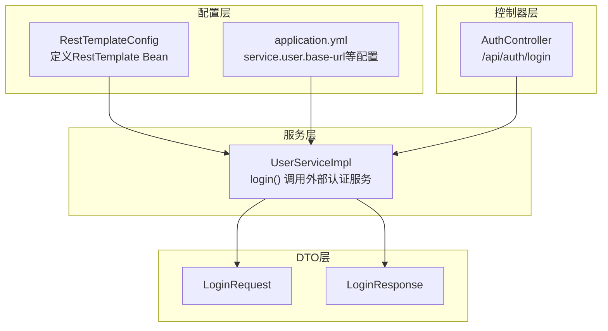
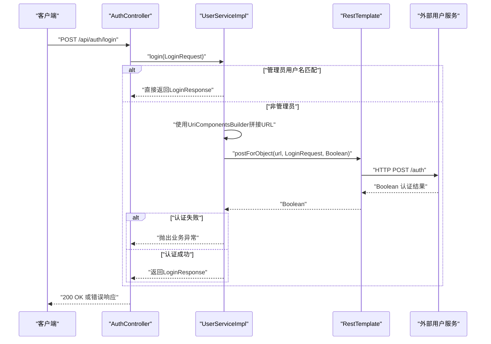
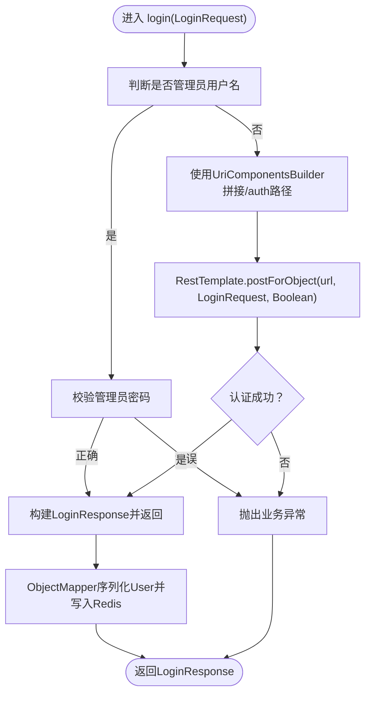
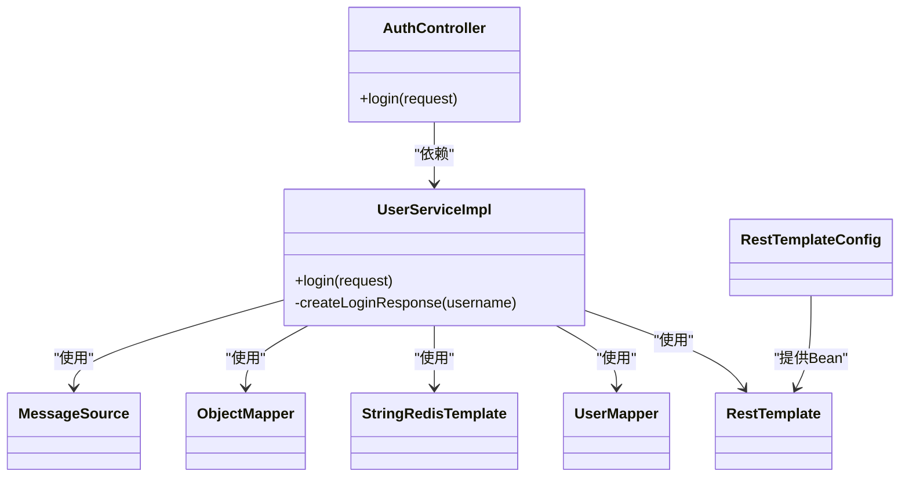

# 外部服务调用集成

<cite>
**本文引用的文件**
- [RestTemplateConfig.java](file://src/main/java/com/example/onlinestore/config/RestTemplateConfig.java)
- [UserServiceImpl.java](file://src/main/java/com/example/onlinestore/service/impl/UserServiceImpl.java)
- [AuthController.java](file://src/main/java/com/example/onlinestore/controller/AuthController.java)
- [LoginRequest.java](file://src/main/java/com/example/onlinestore/dto/LoginRequest.java)
- [LoginResponse.java](file://src/main/java/com/example/onlinestore/dto/LoginResponse.java)
- [application.yml](file://src/main/resources/application.yml)
- [application-local.yml](file://src/main/resources/application-local.yml)
- [pom.xml](file://pom.xml)
- [UserServiceTest.java](file://src/test/java/com/example/onlinestore/service/UserServiceTest.java)
</cite>

## 目录
1. [简介](#简介)
2. [项目结构](#项目结构)
3. [核心组件](#核心组件)
4. [架构总览](#架构总览)
5. [详细组件分析](#详细组件分析)
6. [依赖关系分析](#依赖关系分析)
7. [性能考虑](#性能考虑)
8. [故障排查指南](#故障排查指南)
9. [结论](#结论)
10. [附录](#附录)

## 简介
本文件聚焦于 online-store 项目中通过 RestTemplate 调用外部用户服务的实现机制，围绕以下目标展开：
- RestTemplateConfig 如何定义 RestTemplate Bean 以支持 HTTP 请求发送
- UserServiceImpl 中如何使用 UriComponentsBuilder 构建动态请求 URL、设置请求头、处理 JSON 序列化与反序列化
- 登录流程中调用外部认证服务的具体实现，包括异常处理策略（如 ResourceAccessException 捕获）、超时配置缺失的影响以及未来可扩展的重试机制
- 结合测试用例说明请求参数构造与响应数据映射过程
- 提供调试建议（启用日志、使用 Postman 模拟请求）
- 指出现有实现缺乏熔断机制的风险，并建议集成 Resilience4j 或 Sentinel 进行服务降级保护

## 项目结构
- 配置层：RestTemplateConfig 定义 RestTemplate Bean；application.yml 提供外部用户服务基础地址等配置
- 控制器层：AuthController 接收登录请求并委派给 UserService
- 服务层：UserServiceImpl 实现登录逻辑，包含对管理员快速放行与外部用户服务认证的分支处理
- DTO 层：LoginRequest/LoginResponse 定义登录请求与响应的数据结构
- 测试层：UserServiceTest 验证管理员与普通用户的登录路径、外部认证调用与异常分支

图表来源
- [RestTemplateConfig.java](file://src/main/java/com/example/onlinestore/config/RestTemplateConfig.java#L1-L14)
- [application.yml](file://src/main/resources/application.yml#L41-L48)
- [AuthController.java](file://src/main/java/com/example/onlinestore/controller/AuthController.java#L1-L45)
- [UserServiceImpl.java](file://src/main/java/com/example/onlinestore/service/impl/UserServiceImpl.java#L67-L95)
- [LoginRequest.java](file://src/main/java/com/example/onlinestore/dto/LoginRequest.java#L1-L22)
- [LoginResponse.java](file://src/main/java/com/example/onlinestore/dto/LoginResponse.java#L1-L24)

章节来源
- [RestTemplateConfig.java](file://src/main/java/com/example/onlinestore/config/RestTemplateConfig.java#L1-L14)
- [application.yml](file://src/main/resources/application.yml#L41-L48)
- [AuthController.java](file://src/main/java/com/example/onlinestore/controller/AuthController.java#L1-L45)
- [UserServiceImpl.java](file://src/main/java/com/example/onlinestore/service/impl/UserServiceImpl.java#L67-L95)
- [LoginRequest.java](file://src/main/java/com/example/onlinestore/dto/LoginRequest.java#L1-L22)
- [LoginResponse.java](file://src/main/java/com/example/onlinestore/dto/LoginResponse.java#L1-L24)

## 核心组件
- RestTemplateConfig：通过 @Bean 定义 RestTemplate Bean，供其他组件注入使用
- UserServiceImpl.login：实现登录流程，区分管理员与普通用户；普通用户路径会调用外部用户服务进行认证
- AuthController：对外暴露 /api/auth/login 接口，负责接收请求并返回响应
- 配置文件：application.yml 提供 service.user.base-url，作为外部用户服务的基础地址

章节来源
- [RestTemplateConfig.java](file://src/main/java/com/example/onlinestore/config/RestTemplateConfig.java#L1-L14)
- [UserServiceImpl.java](file://src/main/java/com/example/onlinestore/service/impl/UserServiceImpl.java#L67-L95)
- [AuthController.java](file://src/main/java/com/example/onlinestore/controller/AuthController.java#L1-L45)
- [application.yml](file://src/main/resources/application.yml#L41-L48)

## 架构总览
下图展示了登录流程中各组件之间的交互，以及外部用户服务认证的关键步骤。

图表来源
- [AuthController.java](file://src/main/java/com/example/onlinestore/controller/AuthController.java#L29-L44)
- [UserServiceImpl.java](file://src/main/java/com/example/onlinestore/service/impl/UserServiceImpl.java#L67-L95)
- [LoginRequest.java](file://src/main/java/com/example/onlinestore/dto/LoginRequest.java#L1-L22)
- [LoginResponse.java](file://src/main/java/com/example/onlinestore/dto/LoginResponse.java#L1-L24)

## 详细组件分析

### RestTemplateConfig：RestTemplate Bean 的定义
- 作用：在 Spring 上下文中注册一个默认的 RestTemplate Bean，供其他组件注入使用
- 特点：未自定义连接池、超时、拦截器等，采用默认配置
- 影响：在高并发或网络不稳定场景下，可能缺少超时控制与重试能力

章节来源
- [RestTemplateConfig.java](file://src/main/java/com/example/onlinestore/config/RestTemplateConfig.java#L1-L14)

### UserServiceImpl：登录流程与外部认证调用
- 管理员快速放行：当用户名匹配配置中的管理员用户名时，直接校验密码并返回登录响应
- 外部认证调用：
  - 使用 UriComponentsBuilder 从配置的服务基础地址拼接 /auth 路径，形成最终 URL
  - 使用 RestTemplate.postForObject 发送登录请求体（LoginRequest），期望返回 Boolean 类型的认证结果
  - 若返回值为 null 或 false，则抛出业务异常
- JSON 序列化与反序列化：
  - 在生成用户缓存时，使用 Jackson ObjectMapper 将 User 对象序列化为 JSON 字符串后写入 Redis
  - 从 Redis 读取时，使用 ObjectMapper 反序列化为 User 对象
- 异常处理策略：
  - 当外部认证返回失败或管理员密码错误时，抛出业务异常（由控制器层转换为 400）
  - 当前未捕获 ResourceAccessException，若外部服务不可达或网络异常，将向上抛出
- 缓存与事务：
  - 成功登录后，将用户信息序列化并写入 Redis，键前缀为 token:，过期时间与登录令牌一致
  - 登录流程包含数据库操作，使用 @Transactional

图表来源
- [UserServiceImpl.java](file://src/main/java/com/example/onlinestore/service/impl/UserServiceImpl.java#L67-L139)
- [LoginRequest.java](file://src/main/java/com/example/onlinestore/dto/LoginRequest.java#L1-L22)
- [LoginResponse.java](file://src/main/java/com/example/onlinestore/dto/LoginResponse.java#L1-L24)

章节来源
- [UserServiceImpl.java](file://src/main/java/com/example/onlinestore/service/impl/UserServiceImpl.java#L67-L139)

### AuthController：登录接口与异常映射
- 接口：POST /api/auth/login
- 行为：
  - 正常：返回 LoginResponse
  - 业务异常（如凭据无效）：返回 400 与本地化错误消息
  - 系统异常：返回 500 与本地化错误消息
- 与 UserService 的协作：控制器层不直接处理外部认证细节，仅负责响应封装与异常映射

章节来源
- [AuthController.java](file://src/main/java/com/example/onlinestore/controller/AuthController.java#L29-L44)

### 配置与依赖：service.user.base-url 与 Jackson
- 配置项：service.user.base-url 用于拼接外部用户服务的认证端点
- Jackson：在 UserServiceImpl 中注册了 JavaTimeModule，确保 LocalDateTime 的序列化/反序列化正常工作
- 依赖：pom.xml 引入了 spring-boot-starter-web 与 jackson-datatype-jsr310

章节来源
- [application.yml](file://src/main/resources/application.yml#L41-L48)
- [application-local.yml](file://src/main/resources/application-local.yml#L26-L33)
- [UserServiceImpl.java](file://src/main/java/com/example/onlinestore/service/impl/UserServiceImpl.java#L31-L40)
- [pom.xml](file://pom.xml#L50-L120)

### 请求参数构造与响应数据映射
- 请求参数构造：
  - 使用 UriComponentsBuilder.fromHttpUrl(...) 与 .path(...) 拼接 /auth 路径
  - 使用 RestTemplate.postForObject(...) 将 LoginRequest 作为请求体发送
- 响应数据映射：
  - 外部认证返回 Boolean，表示认证是否成功
  - 登录成功后，LoginResponse 包含 token 与过期时间
  - Redis 缓存使用 token: 前缀存储 User 的 JSON 字符串

章节来源
- [UserServiceImpl.java](file://src/main/java/com/example/onlinestore/service/impl/UserServiceImpl.java#L83-L95)
- [LoginRequest.java](file://src/main/java/com/example/onlinestore/dto/LoginRequest.java#L1-L22)
- [LoginResponse.java](file://src/main/java/com/example/onlinestore/dto/LoginResponse.java#L1-L24)

### 异常处理策略与超时配置缺失的影响
- 已有策略：
  - 认证失败或管理员密码错误时抛出业务异常，由控制器层映射为 400
  - Redis 写入失败时记录错误但不中断流程
- 缺失策略：
  - 未捕获 ResourceAccessException，若外部服务不可达或网络异常，异常将向上抛出
  - 未配置连接超时与读取超时，可能导致线程阻塞与资源占用
- 影响：
  - 在高并发或外部服务不稳定时，可能出现请求堆积、线程池耗尽等问题
  - 无法区分瞬时性网络问题与永久性服务不可用

章节来源
- [UserServiceImpl.java](file://src/main/java/com/example/onlinestore/service/impl/UserServiceImpl.java#L83-L95)
- [AuthController.java](file://src/main/java/com/example/onlinestore/controller/AuthController.java#L31-L44)

### 重试机制与熔断风险
- 当前实现：
  - 未集成重试与熔断机制
- 风险：
  - 外部服务偶发抖动或短暂不可用时，请求可能直接失败
  - 缺少降级保护，可能引发雪崩效应
- 建议：
  - 集成 Resilience4j 或 Sentinel，实现超时、重试、熔断与限流
  - 在 RestTemplate 层增加连接与读取超时配置，提升稳定性

章节来源
- [UserServiceImpl.java](file://src/main/java/com/example/onlinestore/service/impl/UserServiceImpl.java#L67-L95)
- [RestTemplateConfig.java](file://src/main/java/com/example/onlinestore/config/RestTemplateConfig.java#L1-L14)

## 依赖关系分析
- 组件耦合：
  - AuthController 依赖 UserService
  - UserServiceImpl 依赖 RestTemplate、UserMapper、StringRedisTemplate、ObjectMapper、MessageSource
  - RestTemplateConfig 为 RestTemplate 提供 Bean
- 外部依赖：
  - 外部用户服务地址来自配置 service.user.base-url
  - Jackson JSR310 模块用于时间类型序列化

图表来源
- [AuthController.java](file://src/main/java/com/example/onlinestore/controller/AuthController.java#L1-L45)
- [UserServiceImpl.java](file://src/main/java/com/example/onlinestore/service/impl/UserServiceImpl.java#L1-L193)
- [RestTemplateConfig.java](file://src/main/java/com/example/onlinestore/config/RestTemplateConfig.java#L1-L14)

章节来源
- [AuthController.java](file://src/main/java/com/example/onlinestore/controller/AuthController.java#L1-L45)
- [UserServiceImpl.java](file://src/main/java/com/example/onlinestore/service/impl/UserServiceImpl.java#L1-L193)
- [RestTemplateConfig.java](file://src/main/java/com/example/onlinestore/config/RestTemplateConfig.java#L1-L14)

## 性能考虑
- 连接与超时：
  - 当前未显式配置连接超时与读取超时，建议在 RestTemplate 中设置合理的超时参数，避免长时间阻塞
- 并发与线程：
  - 在高并发场景下，建议引入连接池与限流策略，防止外部依赖拖垮系统
- 缓存命中：
  - Redis 缓存用户信息可减少重复认证与数据库访问，但需注意缓存失效与一致性

[本节为通用建议，无需特定文件引用]

## 故障排查指南
- 启用日志：
  - 在 application.yml 中开启 debug 或 trace 日志级别，观察 RestTemplate 调用链路与外部服务响应
- 使用 Postman 模拟请求：
  - 构造 POST /api/auth/login，Body 选择 raw JSON，填写 username 与 password
  - 观察返回状态码与响应体，定位认证失败原因
- 关注关键配置：
  - 确认 service.user.base-url 是否指向正确的外部用户服务地址
  - 管理员用户名与密码配置是否正确
- 异常定位：
  - 若出现网络异常，检查外部服务可达性与防火墙策略
  - 若认证失败，确认外部服务 /auth 端点是否按预期返回 Boolean

章节来源
- [application.yml](file://src/main/resources/application.yml#L41-L48)
- [application-local.yml](file://src/main/resources/application-local.yml#L26-L33)
- [UserServiceImpl.java](file://src/main/java/com/example/onlinestore/service/impl/UserServiceImpl.java#L67-L95)
- [AuthController.java](file://src/main/java/com/example/onlinestore/controller/AuthController.java#L29-L44)

## 结论
- online-store 通过 RestTemplateConfig 提供 RestTemplate Bean，并在 UserServiceImpl 中利用 UriComponentsBuilder 动态拼接外部认证 URL，使用 postForObject 发起认证请求
- 登录流程对管理员与普通用户进行了分流处理，普通用户路径依赖外部用户服务认证
- 当前实现未配置超时与重试，且未捕获 ResourceAccessException，存在网络波动导致的稳定性风险
- 建议引入 Resilience4j/Sentinel 实现熔断与重试，同时为 RestTemplate 配置连接与读取超时，以提升整体健壮性

[本节为总结性内容，无需特定文件引用]

## 附录
- 测试用例参考：
  - UserServiceTest 验证了管理员登录、普通用户登录、认证失败等场景，有助于理解请求参数构造与响应映射
  - 可基于这些用例补充对 ResourceAccessException 的边界测试与超时行为验证

章节来源
- [UserServiceTest.java](file://src/test/java/com/example/onlinestore/service/UserServiceTest.java#L47-L246)