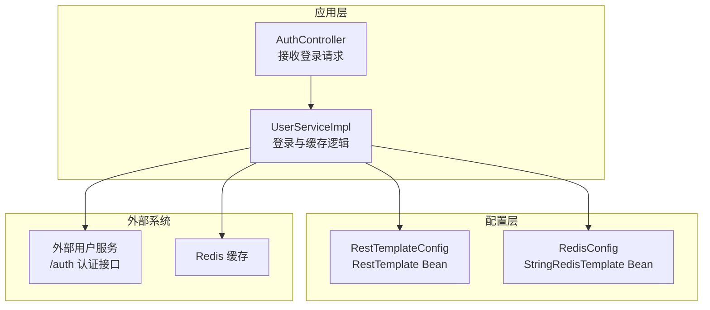
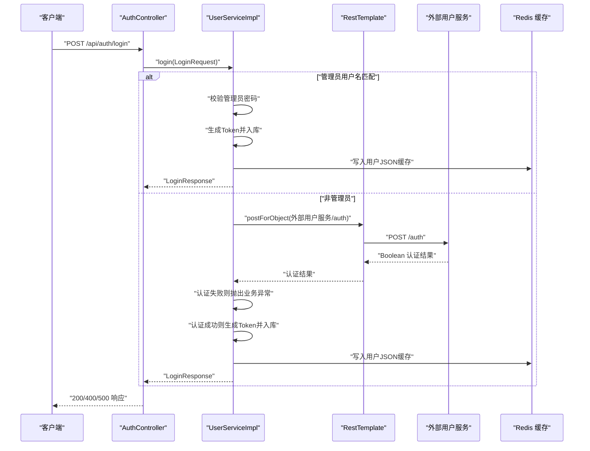
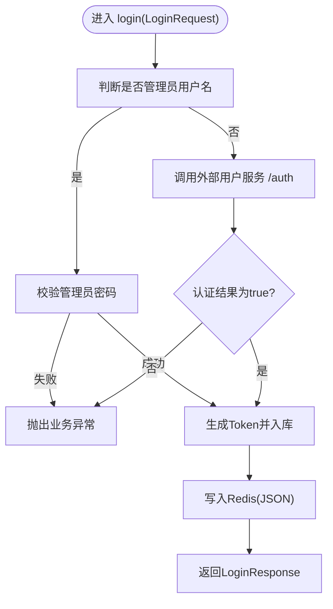
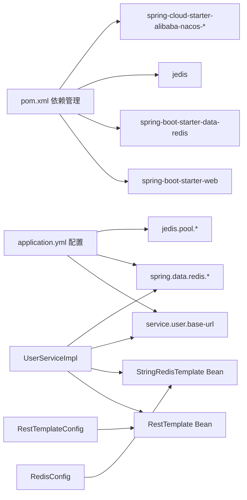

# 外部集成

<cite>
**本文引用的文件**
- [RestTemplateConfig.java](file://src/main/java/com/example/onlinestore/config/RestTemplateConfig.java)
- [RedisConfig.java](file://src/main/java/com/example/onlinestore/config/RedisConfig.java)
- [UserServiceImpl.java](file://src/main/java/com/example/onlinestore/service/impl/UserServiceImpl.java)
- [application.yml](file://src/main/resources/application.yml)
- [bootstrap.yml](file://src/main/resources/bootstrap.yml)
- [AuthController.java](file://src/main/java/com/example/onlinestore/controller/AuthController.java)
- [UserServiceTest.java](file://src/test/java/com/example/onlinestore/service/UserServiceTest.java)
- [pom.xml](file://pom.xml)
</cite>

## 目录
1. [简介](#简介)
2. [项目结构](#项目结构)
3. [核心组件](#核心组件)
4. [架构总览](#架构总览)
5. [详细组件分析](#详细组件分析)
6. [依赖分析](#依赖分析)
7. [性能考量](#性能考量)
8. [故障排查指南](#故障排查指南)
9. [结论](#结论)

## 简介
本文件聚焦于 online-store 项目与外部系统的集成方案，重点说明：
- 如何通过 RestTemplateConfig 配置 RestTemplate 以调用外部“用户服务”；
- 在 UserServiceImpl 中如何使用 UriComponentsBuilder 构建 URL 并进行 HTTP 调用，以及异常处理策略；
- 如何通过 RedisConfig 配置 StringRedisTemplate 实现用户 Token 和会话信息的缓存，包含连接池参数与序列化策略；
- 这些集成点对系统性能与可靠性的影响，以及在外部服务不可用时的降级策略（缓存兜底、熔断机制建议）。

## 项目结构
online-store 使用 Spring Boot 作为基础框架，结合 Spring Web、MyBatis、Spring Data Redis、Jedis、Nacos 等技术栈。与外部系统集成的关键点集中在以下模块：
- 配置层：RestTemplateConfig、RedisConfig 提供 HTTP 客户端与缓存客户端的 Bean；
- 控制器层：AuthController 接收登录请求，委派给 UserService；
- 业务层：UserServiceImpl 实现登录流程、与外部用户服务交互、Redis 缓存；
- 配置文件：application.yml 提供外部服务地址、Redis 连接参数、Nacos 配置开关等；
- 测试：UserServiceTest 验证登录流程、外部服务调用与缓存行为。

图表来源
- [AuthController.java](file://src/main/java/com/example/onlinestore/controller/AuthController.java#L1-L45)
- [UserServiceImpl.java](file://src/main/java/com/example/onlinestore/service/impl/UserServiceImpl.java#L1-L193)
- [RestTemplateConfig.java](file://src/main/java/com/example/onlinestore/config/RestTemplateConfig.java#L1-L14)
- [RedisConfig.java](file://src/main/java/com/example/onlinestore/config/RedisConfig.java#L1-L15)

章节来源
- [AuthController.java](file://src/main/java/com/example/onlinestore/controller/AuthController.java#L1-L45)
- [UserServiceImpl.java](file://src/main/java/com/example/onlinestore/service/impl/UserServiceImpl.java#L1-L193)
- [RestTemplateConfig.java](file://src/main/java/com/example/onlinestore/config/RestTemplateConfig.java#L1-L14)
- [RedisConfig.java](file://src/main/java/com/example/onlinestore/config/RedisConfig.java#L1-L15)
- [application.yml](file://src/main/resources/application.yml#L1-L48)

## 核心组件
- RestTemplateConfig：提供默认 RestTemplate Bean，用于发起 HTTP 请求；
- RedisConfig：提供 StringRedisTemplate Bean，用于字符串键值的缓存操作；
- UserServiceImpl：实现登录流程，包含管理员快速登录、调用外部用户服务认证、生成 Token、持久化用户信息、Redis 缓存；
- AuthController：对外暴露登录接口，负责异常映射与响应封装。

章节来源
- [RestTemplateConfig.java](file://src/main/java/com/example/onlinestore/config/RestTemplateConfig.java#L1-L14)
- [RedisConfig.java](file://src/main/java/com/example/onlinestore/config/RedisConfig.java#L1-L15)
- [UserServiceImpl.java](file://src/main/java/com/example/onlinestore/service/impl/UserServiceImpl.java#L1-L193)
- [AuthController.java](file://src/main/java/com/example/onlinestore/controller/AuthController.java#L1-L45)

## 架构总览
下面的序列图展示了登录流程中与外部系统的交互路径，包括与外部用户服务的认证调用与 Redis 缓存写入。

图表来源
- [AuthController.java](file://src/main/java/com/example/onlinestore/controller/AuthController.java#L1-L45)
- [UserServiceImpl.java](file://src/main/java/com/example/onlinestore/service/impl/UserServiceImpl.java#L1-L193)

## 详细组件分析

### RestTemplateConfig：RestTemplate 的配置与使用
- Bean 定义：通过 @Bean 提供默认 RestTemplate 实例，便于在业务层注入使用；
- 使用场景：UserServiceImpl 在登录流程中调用外部用户服务的 /auth 接口，使用 postForObject 发起同步 HTTP 调用；
- URL 构建：使用 UriComponentsBuilder.fromHttpUrl(...) 拼接基础地址与路径，确保 URL 构造安全且可维护；
- 异常处理：当认证结果为空或为 false 时，抛出业务异常；控制器层捕获后返回 400；
- 性能与可靠性：当前配置未设置超时、重试、熔断等高级特性，属于默认行为。

章节来源
- [RestTemplateConfig.java](file://src/main/java/com/example/onlinestore/config/RestTemplateConfig.java#L1-L14)
- [UserServiceImpl.java](file://src/main/java/com/example/onlinestore/service/impl/UserServiceImpl.java#L1-L193)
- [AuthController.java](file://src/main/java/com/example/onlinestore/controller/AuthController.java#L1-L45)

### RedisConfig：StringRedisTemplate 的配置与缓存策略
- Bean 定义：通过 @Bean 提供 StringRedisTemplate，基于 RedisConnectionFactory 注入；
- 序列化策略：默认采用 Spring Data Redis 的序列化策略（字符串键值），适合存储 JSON 字符串；
- 连接池参数：在 application.yml 中配置了 Jedis 连接池参数（最大活跃、最大空闲、最小空闲、最大等待时间），直接影响连接复用与并发能力；
- 缓存内容：UserServiceImpl 将用户对象序列化为 JSON 后写入 Redis，键前缀为 token:，过期时间为 1 天；
- 读取与兜底：getUserByToken 从 Redis 读取用户 JSON 并反序列化为 User 对象，异常时返回 null，实现缓存兜底。

章节来源
- [RedisConfig.java](file://src/main/java/com/example/onlinestore/config/RedisConfig.java#L1-L15)
- [UserServiceImpl.java](file://src/main/java/com/example/onlinestore/service/impl/UserServiceImpl.java#L1-L193)
- [application.yml](file://src/main/resources/application.yml#L1-L48)

### UserServiceImpl：登录流程与外部服务调用
- 管理员快速登录：若用户名匹配管理员配置，则直接校验密码，成功则生成 Token 并入库，随后写入 Redis；
- 非管理员登录：调用外部用户服务的 /auth 接口进行认证，认证失败抛出业务异常；
- URL 构建：使用 UriComponentsBuilder.fromHttpUrl(...) 拼接基础地址与路径；
- 异常处理：认证失败或业务异常由控制器层统一映射为 400 或 500；
- 缓存写入：将用户对象序列化为 JSON 写入 Redis，键前缀 token:，过期时间 1 天；
- 缓存读取：getUserByToken 从 Redis 读取用户 JSON 并反序列化，异常时返回 null。

图表来源
- [UserServiceImpl.java](file://src/main/java/com/example/onlinestore/service/impl/UserServiceImpl.java#L1-L193)

章节来源
- [UserServiceImpl.java](file://src/main/java/com/example/onlinestore/service/impl/UserServiceImpl.java#L1-L193)
- [UserServiceTest.java](file://src/test/java/com/example/onlinestore/service/UserServiceTest.java#L1-L252)

### AuthController：登录接口与异常映射
- 接口定义：/api/auth/login，支持 POST；
- 异常映射：业务异常返回 400，系统异常返回 500；
- 国际化：使用 MessageSource 获取本地化错误消息。

章节来源
- [AuthController.java](file://src/main/java/com/example/onlinestore/controller/AuthController.java#L1-L45)

## 依赖分析
- 外部用户服务地址：来自 application.yml 的 service.user.base-url；
- Redis 连接参数：来自 application.yml 的 spring.data.redis.* 与 jedis.pool.*；
- Nacos 配置：bootstrap.yml 开启 Nacos 配置中心与注册发现（可选）；
- 依赖管理：pom.xml 引入 spring-boot-starter-web、spring-boot-starter-data-redis、jedis、nacos 等。

图表来源
- [pom.xml](file://pom.xml#L1-L169)
- [application.yml](file://src/main/resources/application.yml#L1-L48)
- [bootstrap.yml](file://src/main/resources/bootstrap.yml#L1-L17)
- [RestTemplateConfig.java](file://src/main/java/com/example/onlinestore/config/RestTemplateConfig.java#L1-L14)
- [RedisConfig.java](file://src/main/java/com/example/onlinestore/config/RedisConfig.java#L1-L15)
- [UserServiceImpl.java](file://src/main/java/com/example/onlinestore/service/impl/UserServiceImpl.java#L1-L193)

章节来源
- [pom.xml](file://pom.xml#L1-L169)
- [application.yml](file://src/main/resources/application.yml#L1-L48)
- [bootstrap.yml](file://src/main/resources/bootstrap.yml#L1-L17)
- [RestTemplateConfig.java](file://src/main/java/com/example/onlinestore/config/RestTemplateConfig.java#L1-L14)
- [RedisConfig.java](file://src/main/java/com/example/onlinestore/config/RedisConfig.java#L1-L15)
- [UserServiceImpl.java](file://src/main/java/com/example/onlinestore/service/impl/UserServiceImpl.java#L1-L193)

## 性能考量
- 连接池参数：application.yml 中的 jedis.pool.* 参数控制 Redis 连接池大小与等待时间，直接影响并发访问下的吞吐与延迟；
- 默认 RestTemplate：未配置超时、重试与熔断，可能在外部服务不稳定时导致线程阻塞或堆积；
- 缓存命中：登录成功后写入 Redis，后续查询可通过 getUserByToken 直接命中缓存，降低数据库与外部服务压力；
- 序列化成本：UserServiceImpl 使用 ObjectMapper 将用户对象序列化为 JSON 存储，序列化/反序列化有一定 CPU 开销；
- 事务与 IO：登录流程涉及数据库写入与 Redis 写入，需关注事务边界与 IO 延迟对整体响应时间的影响。

章节来源
- [application.yml](file://src/main/resources/application.yml#L1-L48)
- [UserServiceImpl.java](file://src/main/java/com/example/onlinestore/service/impl/UserServiceImpl.java#L1-L193)

## 故障排查指南
- 外部用户服务不可用
  - 现象：login 调用外部 /auth 返回 null 或 false，抛出业务异常，控制器返回 400；
  - 排查：确认 service.user.base-url 是否正确，网络连通性，外部服务健康状态；
  - 降级：当前代码未实现熔断/隔离，可在 RestTemplateConfig 中引入 Hystrix 或 Resilience4j，或在 UserServiceImpl 中增加快速失败与缓存兜底逻辑。
- Redis 连接失败或写入异常
  - 现象：缓存写入失败日志，但不影响登录主流程（代码中有 try/catch 并继续执行）；
  - 排查：检查 spring.data.redis.host/port/password/database 与 jedis.pool.* 参数，确认 Redis 可用；
  - 降级：缓存失败不影响核心功能，但会降低后续查询性能，建议在 RedisConfig 中增加连接池监控与告警。
- 管理员登录失败
  - 现象：管理员密码错误抛出业务异常，控制器返回 400；
  - 排查：核对 admin.auth.username/password 配置。
- URL 构建问题
  - 现象：外部服务地址拼接错误导致 404；
  - 排查：确认 service.user.base-url 末尾无多余斜杠，路径拼接逻辑正确。

章节来源
- [UserServiceImpl.java](file://src/main/java/com/example/onlinestore/service/impl/UserServiceImpl.java#L1-L193)
- [AuthController.java](file://src/main/java/com/example/onlinestore/controller/AuthController.java#L1-L45)
- [UserServiceTest.java](file://src/test/java/com/example/onlinestore/service/UserServiceTest.java#L1-L252)
- [application.yml](file://src/main/resources/application.yml#L1-L48)

## 结论
- RestTemplateConfig 与 RedisConfig 提供了与外部系统集成的基础能力：HTTP 客户端与缓存客户端；
- UserServiceImpl 在登录流程中实现了管理员快速登录与外部用户服务认证，并通过 Redis 缓存提升查询性能；
- 当前实现未包含超时、重试、熔断等高级特性，建议在生产环境中引入 Resilience4j/Hystrix、连接池监控与告警，以增强可靠性与性能；
- 在外部服务不可用时，可通过缓存兜底与快速失败策略减少对用户体验的影响。