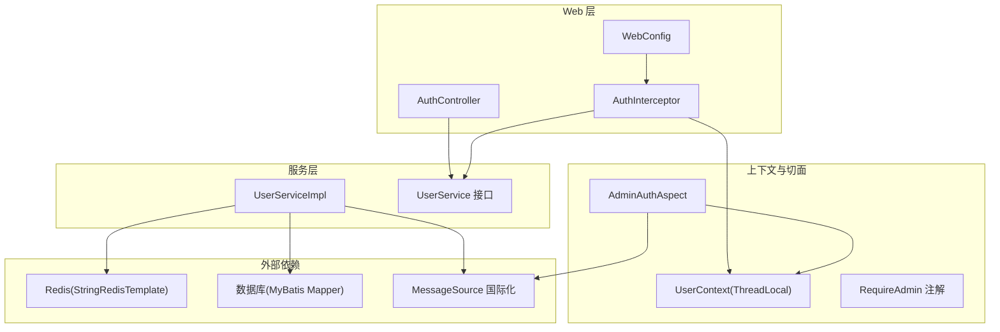
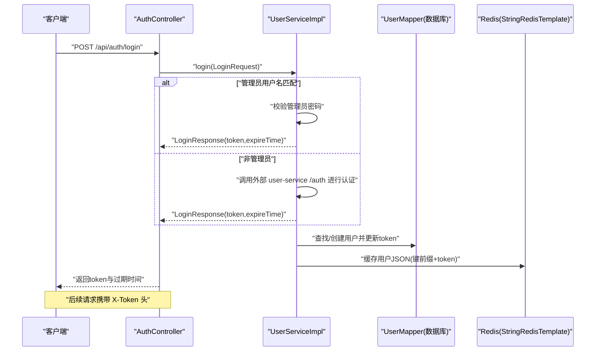
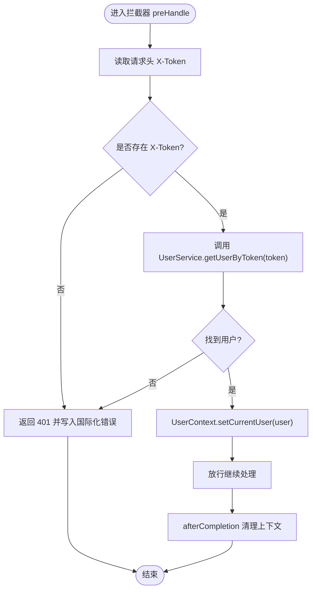
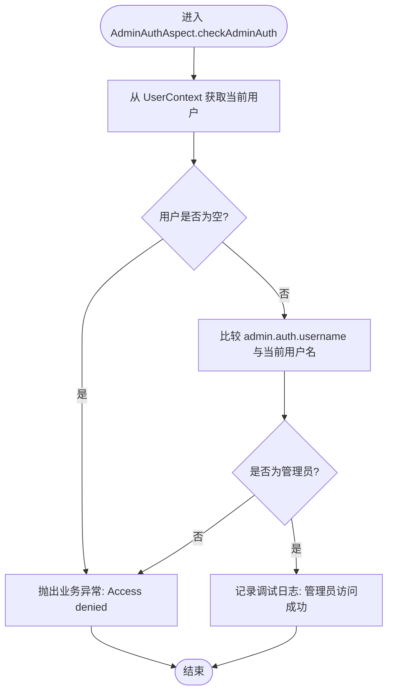
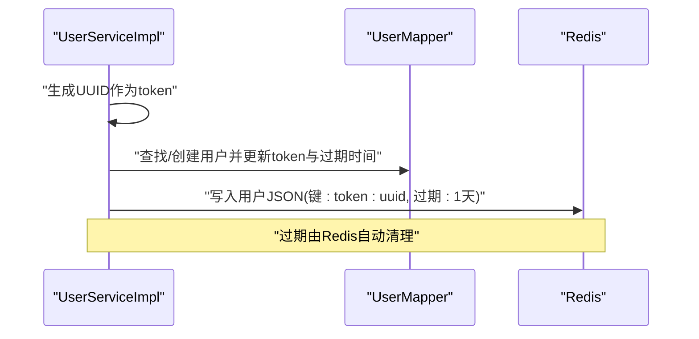
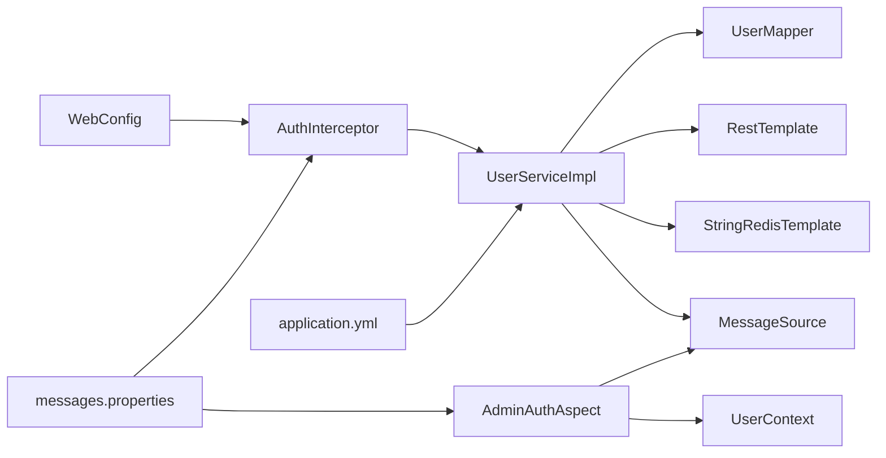

# 安全与认证

<cite>
**本文引用的文件**
- [UserContext.java](file://src/main/java/com/example/onlinestore/context/UserContext.java)
- [AuthInterceptor.java](file://src/main/java/com/example/onlinestore/interceptor/AuthInterceptor.java)
- [WebConfig.java](file://src/main/java/com/example/onlinestore/config/WebConfig.java)
- [RequireAdmin.java](file://src/main/java/com/example/onlinestore/annotation/RequireAdmin.java)
- [AdminAuthAspect.java](file://src/main/java/com/example/onlinestore/aspect/AdminAuthAspect.java)
- [UserService.java](file://src/main/java/com/example/onlinestore/service/UserService.java)
- [UserServiceImpl.java](file://src/main/java/com/example/onlinestore/service/impl/UserServiceImpl.java)
- [AuthController.java](file://src/main/java/com/example/onlinestore/controller/AuthController.java)
- [User.java](file://src/main/java/com/example/onlinestore/model/User.java)
- [LoginResponse.java](file://src/main/java/com/example/onlinestore/dto/LoginResponse.java)
- [application.yml](file://src/main/resources/application.yml)
- [messages.properties](file://src/main/resources/i18n/messages.properties)
</cite>

## 目录
1. [引言](#引言)
2. [项目结构](#项目结构)
3. [核心组件](#核心组件)
4. [架构总览](#架构总览)
5. [详细组件分析](#详细组件分析)
6. [依赖关系分析](#依赖关系分析)
7. [性能考量](#性能考量)
8. [故障排查指南](#故障排查指南)
9. [结论](#结论)
10. [附录](#附录)

## 引言
本文件聚焦于 online-store 项目的认证与授权体系，系统性阐述以下内容：
- 请求拦截与用户上下文传递：AuthInterceptor 如何从请求头读取 Token 并设置 UserContext。
- 管理员权限控制：@RequireAdmin 注解与 AdminAuthAspect 切面如何基于 AOP 实现管理员访问控制。
- Token 的生成、存储、校验与过期处理：从登录到 Redis 缓存、再到拦截器校验的完整链路。
- ThreadLocal 在用户上下文传递中的作用与潜在风险。
- 安全最佳实践建议：Token 加密、防重放、会话管理等。

## 项目结构
围绕安全相关的关键模块如下：
- 控制层：AuthController 提供登录入口。
- 服务层：UserService 接口与 UserServiceImpl 实现登录、Token 生成与校验。
- 拦截器：AuthInterceptor 在 MVC 流程中注入用户上下文。
- 配置：WebConfig 注册拦截器并定义路径规则。
- 上下文：UserContext 使用 ThreadLocal 保存当前用户。
- 切面：AdminAuthAspect 结合 @RequireAdmin 实现管理员权限校验。
- 配置与国际化：application.yml 提供管理员账号配置；messages.properties 提供错误消息。

图表来源
- [AuthController.java](file://src/main/java/com/example/onlinestore/controller/AuthController.java#L1-L45)
- [WebConfig.java](file://src/main/java/com/example/onlinestore/config/WebConfig.java#L1-L21)
- [AuthInterceptor.java](file://src/main/java/com/example/onlinestore/interceptor/AuthInterceptor.java#L1-L49)
- [UserService.java](file://src/main/java/com/example/onlinestore/service/UserService.java#L1-L14)
- [UserServiceImpl.java](file://src/main/java/com/example/onlinestore/service/impl/UserServiceImpl.java#L1-L193)
- [UserContext.java](file://src/main/java/com/example/onlinestore/context/UserContext.java#L1-L19)
- [RequireAdmin.java](file://src/main/java/com/example/onlinestore/annotation/RequireAdmin.java#L1-L11)
- [AdminAuthAspect.java](file://src/main/java/com/example/onlinestore/aspect/AdminAuthAspect.java#L1-L71)
- [application.yml](file://src/main/resources/application.yml#L1-L48)
- [messages.properties](file://src/main/resources/i18n/messages.properties#L1-L17)

章节来源
- [AuthController.java](file://src/main/java/com/example/onlinestore/controller/AuthController.java#L1-L45)
- [WebConfig.java](file://src/main/java/com/example/onlinestore/config/WebConfig.java#L1-L21)
- [AuthInterceptor.java](file://src/main/java/com/example/onlinestore/interceptor/AuthInterceptor.java#L1-L49)
- [UserService.java](file://src/main/java/com/example/onlinestore/service/UserService.java#L1-L14)
- [UserServiceImpl.java](file://src/main/java/com/example/onlinestore/service/impl/UserServiceImpl.java#L1-L193)
- [UserContext.java](file://src/main/java/com/example/onlinestore/context/UserContext.java#L1-L19)
- [RequireAdmin.java](file://src/main/java/com/example/onlinestore/annotation/RequireAdmin.java#L1-L11)
- [AdminAuthAspect.java](file://src/main/java/com/example/onlinestore/aspect/AdminAuthAspect.java#L1-L71)
- [application.yml](file://src/main/resources/application.yml#L1-L48)
- [messages.properties](file://src/main/resources/i18n/messages.properties#L1-L17)

## 核心组件
- UserContext：使用 ThreadLocal 存储当前登录用户，贯穿一次请求生命周期，便于后续业务方法读取。
- AuthInterceptor：拦截所有 /api/** 路径请求，校验 X-Token 头，若有效则将用户写入 UserContext；请求完成后清理上下文。
- UserService/UserServiceImpl：负责登录流程、Token 生成、Redis 缓存用户信息、按 Token 取用户。
- AdminAuthAspect：基于 @RequireAdmin 注解的前置切面，校验当前用户是否为管理员，否则抛出业务异常。
- RequireAdmin：方法级注解，标记需要管理员权限的方法。
- WebConfig：注册拦截器，排除 /api/auth/login，避免登录接口被拦截。

章节来源
- [UserContext.java](file://src/main/java/com/example/onlinestore/context/UserContext.java#L1-L19)
- [AuthInterceptor.java](file://src/main/java/com/example/onlinestore/interceptor/AuthInterceptor.java#L1-L49)
- [WebConfig.java](file://src/main/java/com/example/onlinestore/config/WebConfig.java#L1-L21)
- [RequireAdmin.java](file://src/main/java/com/example/onlinestore/annotation/RequireAdmin.java#L1-L11)
- [AdminAuthAspect.java](file://src/main/java/com/example/onlinestore/aspect/AdminAuthAspect.java#L1-L71)
- [UserService.java](file://src/main/java/com/example/onlinestore/service/UserService.java#L1-L14)
- [UserServiceImpl.java](file://src/main/java/com/example/onlinestore/service/impl/UserServiceImpl.java#L1-L193)

## 架构总览
下面以序列图展示一次登录与后续请求的认证与授权流程：

图表来源
- [AuthController.java](file://src/main/java/com/example/onlinestore/controller/AuthController.java#L1-L45)
- [UserServiceImpl.java](file://src/main/java/com/example/onlinestore/service/impl/UserServiceImpl.java#L1-L193)
- [User.java](file://src/main/java/com/example/onlinestore/model/User.java#L1-L60)
- [LoginResponse.java](file://src/main/java/com/example/onlinestore/dto/LoginResponse.java#L1-L24)

## 详细组件分析

### 认证拦截器：AuthInterceptor
- 路由与排除：WebConfig 对 /api/** 添加拦截器，并排除 /api/auth/login，避免登录接口被拦截。
- 请求头校验：拦截器从请求头读取 X-Token；若缺失或无效，直接返回未授权状态码并写入国际化错误消息。
- 用户上下文设置：当 Token 有效时，将用户对象写入 UserContext，供后续业务方法使用。
- 生命周期清理：afterCompletion 中清理 ThreadLocal，避免请求线程复用导致的上下文残留。

图表来源
- [AuthInterceptor.java](file://src/main/java/com/example/onlinestore/interceptor/AuthInterceptor.java#L1-L49)
- [WebConfig.java](file://src/main/java/com/example/onlinestore/config/WebConfig.java#L1-L21)
- [UserContext.java](file://src/main/java/com/example/onlinestore/context/UserContext.java#L1-L19)
- [UserService.java](file://src/main/java/com/example/onlinestore/service/UserService.java#L1-L14)
- [messages.properties](file://src/main/resources/i18n/messages.properties#L1-L17)

章节来源
- [AuthInterceptor.java](file://src/main/java/com/example/onlinestore/interceptor/AuthInterceptor.java#L1-L49)
- [WebConfig.java](file://src/main/java/com/example/onlinestore/config/WebConfig.java#L1-L21)
- [UserContext.java](file://src/main/java/com/example/onlinestore/context/UserContext.java#L1-L19)
- [UserService.java](file://src/main/java/com/example/onlinestore/service/UserService.java#L1-L14)
- [messages.properties](file://src/main/resources/i18n/messages.properties#L1-L17)

### 管理员权限控制：@RequireAdmin 与 AdminAuthAspect
- 注解定义：RequireAdmin 仅作用于方法级别，运行时保留。
- 切面实现：AdminAuthAspect 使用 @Before 匹配带有 @RequireAdmin 的方法，在方法执行前进行管理员校验。
- 校验逻辑：
  - 若当前用户为空，记录警告日志并抛出业务异常（国际化“Access denied”）。
  - 若当前用户名不等于配置项 admin.auth.username，同样抛出异常。
  - 成功则记录调试日志。
- AOP 表达式：execution 表达式匹配带 @RequireAdmin 的方法签名，确保对目标方法的前置控制。

图表来源
- [AdminAuthAspect.java](file://src/main/java/com/example/onlinestore/aspect/AdminAuthAspect.java#L1-L71)
- [RequireAdmin.java](file://src/main/java/com/example/onlinestore/annotation/RequireAdmin.java#L1-L11)
- [UserContext.java](file://src/main/java/com/example/onlinestore/context/UserContext.java#L1-L19)
- [application.yml](file://src/main/resources/application.yml#L1-L48)
- [messages.properties](file://src/main/resources/i18n/messages.properties#L1-L17)

章节来源
- [AdminAuthAspect.java](file://src/main/java/com/example/onlinestore/aspect/AdminAuthAspect.java#L1-L71)
- [RequireAdmin.java](file://src/main/java/com/example/onlinestore/annotation/RequireAdmin.java#L1-L11)
- [application.yml](file://src/main/resources/application.yml#L1-L48)
- [messages.properties](file://src/main/resources/i18n/messages.properties#L1-L17)

### Token 生成、验证与过期处理
- 登录流程：
  - 管理员：用户名匹配时，校验密码，成功后直接返回响应。
  - 非管理员：调用外部 user-service 的 /auth 接口进行认证，成功后继续生成 Token。
- Token 生成与存储：
  - 生成随机 UUID 作为 token，设置过期时间为 1 天。
  - 查找或创建用户记录，更新 token 与过期时间。
  - 将用户 JSON 序列化后写入 Redis，键前缀为 token:，过期时间与用户一致。
- 校验流程：
  - 拦截器调用 UserService.getUserByToken(token)，从 Redis 读取用户 JSON 并反序列化为 User。
  - 若 Redis 中无对应键，视为无效 Token，返回空。
- 过期处理：
  - Redis 自动过期，拦截器侧不再显式检查过期字段，依赖 Redis 过期策略。

图表来源
- [UserServiceImpl.java](file://src/main/java/com/example/onlinestore/service/impl/UserServiceImpl.java#L1-L193)
- [User.java](file://src/main/java/com/example/onlinestore/model/User.java#L1-L60)
- [LoginResponse.java](file://src/main/java/com/example/onlinestore/dto/LoginResponse.java#L1-L24)

章节来源
- [UserServiceImpl.java](file://src/main/java/com/example/onlinestore/service/impl/UserServiceImpl.java#L1-L193)
- [User.java](file://src/main/java/com/example/onlinestore/model/User.java#L1-L60)
- [LoginResponse.java](file://src/main/java/com/example/onlinestore/dto/LoginResponse.java#L1-L24)

### ThreadLocal 与用户上下文传递
- 作用：在一次请求的处理链中，将认证阶段解析出的用户对象放入 UserContext，供后续业务方法读取，避免重复查询或跨层传参。
- 生命周期：拦截器 preHandle 写入，afterCompletion 清理，确保线程复用场景下的上下文隔离。
- 风险提示：若在异步任务或线程池中使用 ThreadLocal，需手动清理，否则可能导致内存泄漏；在 Web 场景中，Spring 已在请求结束后清理，但仍需避免在请求外持有用户对象引用。

章节来源
- [UserContext.java](file://src/main/java/com/example/onlinestore/context/UserContext.java#L1-L19)
- [AuthInterceptor.java](file://src/main/java/com/example/onlinestore/interceptor/AuthInterceptor.java#L1-L49)

## 依赖关系分析
- WebConfig 依赖 AuthInterceptor，注册拦截器并配置路径。
- AuthInterceptor 依赖 UserService 与 MessageSource，用于 Token 校验与国际化错误输出。
- UserServiceImpl 依赖 UserMapper、StringRedisTemplate、RestTemplate、MessageSource，承担登录、Token 生成与 Redis 缓存。
- AdminAuthAspect 依赖 UserContext 与 MessageSource，结合 @RequireAdmin 实现管理员校验。
- application.yml 提供管理员账号配置与基础 URL，messages.properties 提供错误消息。

图表来源
- [WebConfig.java](file://src/main/java/com/example/onlinestore/config/WebConfig.java#L1-L21)
- [AuthInterceptor.java](file://src/main/java/com/example/onlinestore/interceptor/AuthInterceptor.java#L1-L49)
- [UserServiceImpl.java](file://src/main/java/com/example/onlinestore/service/impl/UserServiceImpl.java#L1-L193)
- [AdminAuthAspect.java](file://src/main/java/com/example/onlinestore/aspect/AdminAuthAspect.java#L1-L71)
- [application.yml](file://src/main/resources/application.yml#L1-L48)
- [messages.properties](file://src/main/resources/i18n/messages.properties#L1-L17)

章节来源
- [WebConfig.java](file://src/main/java/com/example/onlinestore/config/WebConfig.java#L1-L21)
- [AuthInterceptor.java](file://src/main/java/com/example/onlinestore/interceptor/AuthInterceptor.java#L1-L49)
- [UserServiceImpl.java](file://src/main/java/com/example/onlinestore/service/impl/UserServiceImpl.java#L1-L193)
- [AdminAuthAspect.java](file://src/main/java/com/example/onlinestore/aspect/AdminAuthAspect.java#L1-L71)
- [application.yml](file://src/main/resources/application.yml#L1-L48)
- [messages.properties](file://src/main/resources/i18n/messages.properties#L1-L17)

## 性能考量
- Redis 缓存命中：用户信息以 JSON 形式缓存，键前缀统一，过期时间与用户一致，减少数据库压力。
- Token 过期策略：Redis 自动过期，无需应用层逐条扫描，降低维护成本。
- 拦截器开销：每次请求仅做一次 Redis 读取与一次 JSON 反序列化，开销较小。
- 建议优化：
  - 对频繁访问的用户信息可考虑热点缓存与预热。
  - 合理设置 Redis 过期时间，平衡安全性与性能。
  - 对管理员接口可增加限流与审计日志。

[本节为通用建议，不直接分析具体文件]

## 故障排查指南
- 401 未授权：
  - 检查请求头是否包含 X-Token。
  - 确认 Token 是否存在于 Redis，且未过期。
  - 核对拦截器是否正确注册与排除登录路径。
- 管理员访问被拒：
  - 确认 admin.auth.username 与当前用户名一致。
  - 检查国际化消息是否正确加载。
- 登录失败：
  - 管理员密码错误会抛出业务异常。
  - 非管理员认证失败会返回错误消息。
- 日志定位：
  - 拦截器与切面均记录警告/调试日志，便于定位问题。

章节来源
- [AuthInterceptor.java](file://src/main/java/com/example/onlinestore/interceptor/AuthInterceptor.java#L1-L49)
- [AdminAuthAspect.java](file://src/main/java/com/example/onlinestore/aspect/AdminAuthAspect.java#L1-L71)
- [messages.properties](file://src/main/resources/i18n/messages.properties#L1-L17)
- [application.yml](file://src/main/resources/application.yml#L1-L48)

## 结论
online-store 的安全体系以拦截器与切面为核心，结合 Redis 缓存与 ThreadLocal 上下文传递，实现了简洁高效的认证与授权流程。管理员权限通过注解驱动的 AOP 切面实现，易于扩展与维护。建议在生产环境中进一步强化 Token 加密、防重放与审计能力，以提升整体安全性。

[本节为总结，不直接分析具体文件]

## 附录
- 安全最佳实践建议（概念性指导）
  - Token 加密：建议采用对称或非对称加密算法保护 Token，或引入 JWT 并签名校验。
  - 防重放：为 Token 引入一次性令牌或时间戳+随机数，服务端校验时间窗口与唯一性。
  - 会话管理：支持 Token 刷新与吊销，提供登出接口清理 Redis 与上下文。
  - 传输安全：强制 HTTPS，避免明文传输 Token。
  - 审计与监控：记录关键操作日志，设置告警阈值与异常检测。

[本节为通用建议，不直接分析具体文件]