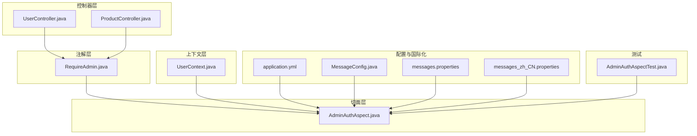
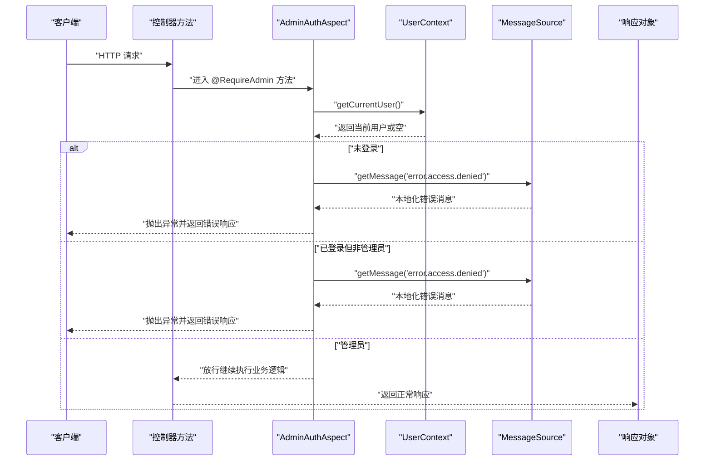
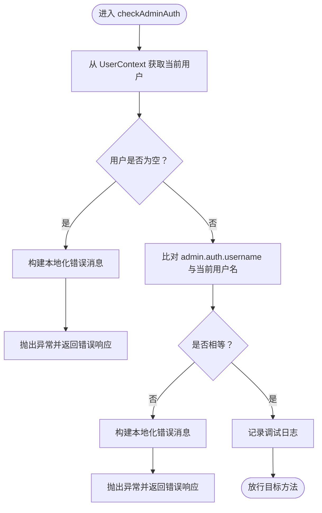
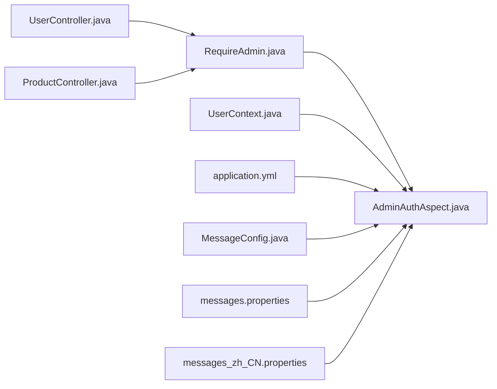

# 权限控制切面

<cite>
**本文引用的文件**
- [AdminAuthAspect.java](file://src/main/java/com/example/onlinestore/aspect/AdminAuthAspect.java)
- [RequireAdmin.java](file://src/main/java/com/example/onlinestore/annotation/RequireAdmin.java)
- [UserContext.java](file://src/main/java/com/example/onlinestore/context/UserContext.java)
- [UserController.java](file://src/main/java/com/example/onlinestore/controller/UserController.java)
- [ProductController.java](file://src/main/java/com/example/onlinestore/controller/ProductController.java)
- [application.yml](file://src/main/resources/application.yml)
- [MessageConfig.java](file://src/main/java/com/example/onlinestore/config/MessageConfig.java)
- [messages.properties](file://src/main/resources/i18n/messages.properties)
- [messages_zh_CN.properties](file://src/main/resources/i18n/messages_zh_CN.properties)
- [AdminAuthAspectTest.java](file://src/test/java/com/example/onlinestore/aspect/AdminAuthAspectTest.java)
</cite>

## 目录
1. [引言](#引言)
2. [项目结构](#项目结构)
3. [核心组件](#核心组件)
4. [架构总览](#架构总览)
5. [详细组件分析](#详细组件分析)
6. [依赖关系分析](#依赖关系分析)
7. [性能考量](#性能考量)
8. [故障排查指南](#故障排查指南)
9. [结论](#结论)
10. [附录](#附录)

## 引言
本文件围绕“权限控制切面”展开，重点解释 AdminAuthAspect 切面如何通过 @Aspect 和 @Component 注解被 Spring 容器管理，利用 @Before 通知在目标方法执行前进行权限检查；详解 @Before("@annotation(com.example.onlinestore.annotation.RequireAdmin)") 表达式如何匹配所有标注了 @RequireAdmin 的方法；说明切面从 UserContext 获取当前用户后，如何比对用户名与配置文件中 admin.auth.username 的一致性以判定管理员身份；描述当权限不足时抛出 IllegalArgumentException 并结合 MessageSource 返回多语言错误信息的处理流程；最后给出 UserController 和 ProductController 中实际应用 @RequireAdmin 的示例路径，展示其在保护敏感接口方面的具体用法。

## 项目结构
在线商店项目采用按功能模块划分的目录组织方式，权限控制相关代码集中在以下位置：
- 注解定义：annotation/RequireAdmin.java
- 切面实现：aspect/AdminAuthAspect.java
- 上下文工具：context/UserContext.java
- 控制器示例：controller/UserController.java、controller/ProductController.java
- 配置与国际化：config/MessageConfig.java、application.yml
- 国际化资源：i18n/messages*.properties
- 测试：test/java/com/example/onlinestore/aspect/AdminAuthAspectTest.java

图表来源
- [AdminAuthAspect.java](file://src/main/java/com/example/onlinestore/aspect/AdminAuthAspect.java#L38-L71)
- [RequireAdmin.java](file://src/main/java/com/example/onlinestore/annotation/RequireAdmin.java#L1-L11)
- [UserContext.java](file://src/main/java/com/example/onlinestore/context/UserContext.java#L1-L19)
- [UserController.java](file://src/main/java/com/example/onlinestore/controller/UserController.java#L1-L66)
- [ProductController.java](file://src/main/java/com/example/onlinestore/controller/ProductController.java#L1-L78)
- [application.yml](file://src/main/resources/application.yml#L41-L48)
- [MessageConfig.java](file://src/main/java/com/example/onlinestore/config/MessageConfig.java#L1-L36)
- [messages.properties](file://src/main/resources/i18n/messages.properties#L1-L17)
- [messages_zh_CN.properties](file://src/main/resources/i18n/messages_zh_CN.properties#L1-L17)
- [AdminAuthAspectTest.java](file://src/test/java/com/example/onlinestore/aspect/AdminAuthAspectTest.java#L1-L106)

章节来源
- [AdminAuthAspect.java](file://src/main/java/com/example/onlinestore/aspect/AdminAuthAspect.java#L38-L71)
- [RequireAdmin.java](file://src/main/java/com/example/onlinestore/annotation/RequireAdmin.java#L1-L11)
- [UserContext.java](file://src/main/java/com/example/onlinestore/context/UserContext.java#L1-L19)
- [UserController.java](file://src/main/java/com/example/onlinestore/controller/UserController.java#L1-L66)
- [ProductController.java](file://src/main/java/com/example/onlinestore/controller/ProductController.java#L1-L78)
- [application.yml](file://src/main/resources/application.yml#L41-L48)
- [MessageConfig.java](file://src/main/java/com/example/onlinestore/config/MessageConfig.java#L1-L36)
- [messages.properties](file://src/main/resources/i18n/messages.properties#L1-L17)
- [messages_zh_CN.properties](file://src/main/resources/i18n/messages_zh_CN.properties#L1-L17)
- [AdminAuthAspectTest.java](file://src/test/java/com/example/onlinestore/aspect/AdminAuthAspectTest.java#L1-L106)

## 核心组件
- 注解 RequireAdmin：用于声明方法需要管理员权限，仅在运行期生效，作用于方法级别。
- 切面 AdminAuthAspect：通过 @Aspect 和 @Component 被 Spring 容器管理；使用 @Before 匹配带 @RequireAdmin 的方法，在目标方法执行前进行权限校验。
- 上下文 UserContext：线程本地存储当前登录用户，提供获取与清理能力。
- 配置与国际化：application.yml 提供 admin.auth.username；MessageConfig 配置 MessageSource；i18n 资源提供英文与简体中文错误文案。
- 控制器示例：UserController 和 ProductController 在敏感接口上标注 @RequireAdmin，以受切面保护。

章节来源
- [RequireAdmin.java](file://src/main/java/com/example/onlinestore/annotation/RequireAdmin.java#L1-L11)
- [AdminAuthAspect.java](file://src/main/java/com/example/onlinestore/aspect/AdminAuthAspect.java#L38-L71)
- [UserContext.java](file://src/main/java/com/example/onlinestore/context/UserContext.java#L1-L19)
- [application.yml](file://src/main/resources/application.yml#L41-L48)
- [MessageConfig.java](file://src/main/java/com/example/onlinestore/config/MessageConfig.java#L1-L36)
- [messages.properties](file://src/main/resources/i18n/messages.properties#L1-L17)
- [messages_zh_CN.properties](file://src/main/resources/i18n/messages_zh_CN.properties#L1-L17)
- [UserController.java](file://src/main/java/com/example/onlinestore/controller/UserController.java#L1-L66)
- [ProductController.java](file://src/main/java/com/example/onlinestore/controller/ProductController.java#L1-L78)

## 架构总览
下面的时序图展示了从控制器方法调用到权限校验的完整流程，包括切面拦截、上下文读取、配置比对以及国际化错误返回。

图表来源
- [AdminAuthAspect.java](file://src/main/java/com/example/onlinestore/aspect/AdminAuthAspect.java#L54-L70)
- [UserContext.java](file://src/main/java/com/example/onlinestore/context/UserContext.java#L12-L14)
- [MessageConfig.java](file://src/main/java/com/example/onlinestore/config/MessageConfig.java#L16-L35)
- [messages.properties](file://src/main/resources/i18n/messages.properties#L1-L17)
- [messages_zh_CN.properties](file://src/main/resources/i18n/messages_zh_CN.properties#L1-L17)
- [UserController.java](file://src/main/java/com/example/onlinestore/controller/UserController.java#L41-L56)
- [ProductController.java](file://src/main/java/com/example/onlinestore/controller/ProductController.java#L36-L45)

## 详细组件分析

### 切面：AdminAuthAspect
- 组件角色
  - 通过 @Aspect 声明为切面，@Component 使其成为 Spring Bean，由容器扫描并纳入 AOP 代理。
  - 使用 @Before("@annotation(com.example.onlinestore.annotation.RequireAdmin)") 在目标方法执行前进行拦截。
- 关键逻辑
  - 从 UserContext.getCurrentUser() 获取当前用户；若为空则抛出异常并返回本地化“访问被拒绝”。
  - 读取配置 admin.auth.username，与当前用户用户名比对；不一致则抛出异常并返回本地化“访问被拒绝”。
  - 成功则记录调试日志，放行后续业务逻辑。
- 国际化与错误处理
  - 通过 @Autowired 注入 MessageSource，结合 LocaleContextHolder 获取当前区域设置，返回对应语言的错误消息。
  - 抛出 IllegalArgumentException，便于上层统一捕获并转换为合适的 HTTP 响应状态码。

图表来源
- [AdminAuthAspect.java](file://src/main/java/com/example/onlinestore/aspect/AdminAuthAspect.java#L54-L70)
- [application.yml](file://src/main/resources/application.yml#L41-L48)
- [MessageConfig.java](file://src/main/java/com/example/onlinestore/config/MessageConfig.java#L16-L35)
- [messages.properties](file://src/main/resources/i18n/messages.properties#L1-L17)
- [messages_zh_CN.properties](file://src/main/resources/i18n/messages_zh_CN.properties#L1-L17)

章节来源
- [AdminAuthAspect.java](file://src/main/java/com/example/onlinestore/aspect/AdminAuthAspect.java#L38-L71)
- [application.yml](file://src/main/resources/application.yml#L41-L48)
- [MessageConfig.java](file://src/main/java/com/example/onlinestore/config/MessageConfig.java#L1-L36)
- [messages.properties](file://src/main/resources/i18n/messages.properties#L1-L17)
- [messages_zh_CN.properties](file://src/main/resources/i18n/messages_zh_CN.properties#L1-L17)

### 注解：RequireAdmin
- 元注解
  - @Target(ElementType.METHOD)：仅能标注在方法上。
  - @Retention(RetentionPolicy.RUNTIME)：运行期保留，供 AOP 解析。
- 作用
  - 标记方法需要管理员权限，配合 AdminAuthAspect 的切入点表达式进行拦截。

章节来源
- [RequireAdmin.java](file://src/main/java/com/example/onlinestore/annotation/RequireAdmin.java#L1-L11)

### 上下文：UserContext
- 设计要点
  - 使用 ThreadLocal 存储当前用户，避免跨线程污染。
  - 提供 setCurrentUser、getCurrentUser、clear 三个静态方法，便于全局访问与清理。
- 与切面协作
  - 切面在拦截时调用 getCurrentUser() 获取当前用户，作为权限判断依据。

章节来源
- [UserContext.java](file://src/main/java/com/example/onlinestore/context/UserContext.java#L1-L19)
- [AdminAuthAspect.java](file://src/main/java/com/example/onlinestore/aspect/AdminAuthAspect.java#L54-L60)

### 控制器示例：UserController
- 敏感接口
  - GET /api/users：标注 @RequireAdmin，用于管理员查看用户列表。
- 错误处理
  - 捕获 IllegalArgumentException，返回 400 并封装本地化错误消息。
  - 其他异常返回 500 并封装本地化“系统内部错误”。

章节来源
- [UserController.java](file://src/main/java/com/example/onlinestore/controller/UserController.java#L41-L66)
- [MessageConfig.java](file://src/main/java/com/example/onlinestore/config/MessageConfig.java#L16-L35)
- [messages.properties](file://src/main/resources/i18n/messages.properties#L1-L17)
- [messages_zh_CN.properties](file://src/main/resources/i18n/messages_zh_CN.properties#L1-L17)

### 控制器示例：ProductController
- 敏感接口
  - POST /api/products：标注 @RequireAdmin，用于管理员创建商品。
- 错误处理
  - 捕获 IllegalArgumentException，返回 400 并封装本地化错误消息。
  - 其他异常返回 500 并封装本地化“系统内部错误”。

章节来源
- [ProductController.java](file://src/main/java/com/example/onlinestore/controller/ProductController.java#L36-L54)
- [MessageConfig.java](file://src/main/java/com/example/onlinestore/config/MessageConfig.java#L16-L35)
- [messages.properties](file://src/main/resources/i18n/messages.properties#L1-L17)
- [messages_zh_CN.properties](file://src/main/resources/i18n/messages_zh_CN.properties#L1-L17)

### 测试：AdminAuthAspectTest
- 场景覆盖
  - 管理员用户放行通过。
  - 非管理员用户触发异常并返回本地化错误消息。
  - 未登录用户触发异常并返回本地化错误消息。
- 断言要点
  - 使用 Mockito 验证 MessageSource.getMessage 被调用且返回预期消息。
  - 使用 UserContext.clear 清理线程上下文，确保测试隔离。

章节来源
- [AdminAuthAspectTest.java](file://src/test/java/com/example/onlinestore/aspect/AdminAuthAspectTest.java#L1-L106)

## 依赖关系分析
- 切面与注解
  - AdminAuthAspect 依赖 RequireAdmin 注解进行切入点匹配。
- 切面与上下文
  - AdminAuthAspect 依赖 UserContext 获取当前用户。
- 切面与配置
  - 通过 @Value 读取 admin.auth.username。
- 切面与国际化
  - 通过 @Autowired 注入 MessageSource，并结合 LocaleContextHolder 获取区域设置。
- 控制器与切面
  - 控制器方法标注 @RequireAdmin，经切面拦截后执行权限校验。

图表来源
- [AdminAuthAspect.java](file://src/main/java/com/example/onlinestore/aspect/AdminAuthAspect.java#L38-L71)
- [RequireAdmin.java](file://src/main/java/com/example/onlinestore/annotation/RequireAdmin.java#L1-L11)
- [UserContext.java](file://src/main/java/com/example/onlinestore/context/UserContext.java#L1-L19)
- [application.yml](file://src/main/resources/application.yml#L41-L48)
- [MessageConfig.java](file://src/main/java/com/example/onlinestore/config/MessageConfig.java#L1-L36)
- [messages.properties](file://src/main/resources/i18n/messages.properties#L1-L17)
- [messages_zh_CN.properties](file://src/main/resources/i18n/messages_zh_CN.properties#L1-L17)
- [UserController.java](file://src/main/java/com/example/onlinestore/controller/UserController.java#L1-L66)
- [ProductController.java](file://src/main/java/com/example/onlinestore/controller/ProductController.java#L1-L78)

章节来源
- [AdminAuthAspect.java](file://src/main/java/com/example/onlinestore/aspect/AdminAuthAspect.java#L38-L71)
- [RequireAdmin.java](file://src/main/java/com/example/onlinestore/annotation/RequireAdmin.java#L1-L11)
- [UserContext.java](file://src/main/java/com/example/onlinestore/context/UserContext.java#L1-L19)
- [application.yml](file://src/main/resources/application.yml#L41-L48)
- [MessageConfig.java](file://src/main/java/com/example/onlinestore/config/MessageConfig.java#L1-L36)
- [messages.properties](file://src/main/resources/i18n/messages.properties#L1-L17)
- [messages_zh_CN.properties](file://src/main/resources/i18n/messages_zh_CN.properties#L1-L17)
- [UserController.java](file://src/main/java/com/example/onlinestore/controller/UserController.java#L1-L66)
- [ProductController.java](file://src/main/java/com/example/onlinestore/controller/ProductController.java#L1-L78)

## 性能考量
- 切面开销
  - 权限检查为常量时间操作，仅涉及一次用户对象获取与字符串比较，开销极低。
- 国际化消息
  - MessageSource 查询基于键值映射，性能稳定；建议避免在高频路径中频繁切换 Locale。
- 线程安全
  - UserContext 使用 ThreadLocal，天然线程安全；注意在异步场景中正确传递用户上下文。
- 缓存策略
  - 对于频繁访问的敏感接口，可结合缓存与鉴权令牌减少重复校验成本（需在业务层实现）。

## 故障排查指南
- 症状：未登录用户访问 @RequireAdmin 接口返回“访问被拒绝”
  - 排查：确认 UserContext 是否在登录流程中正确设置当前用户；检查拦截链是否生效。
- 症状：非管理员用户访问 @RequireAdmin 接口返回“访问被拒绝”
  - 排查：确认 application.yml 中 admin.auth.username 配置是否正确；核对当前用户用户名。
- 症状：多语言错误未按预期显示
  - 排查：确认 Accept-Language 头部；检查 MessageConfig 的支持语言与默认语言；核对 i18n 资源文件键值。
- 症状：控制器捕获异常但响应码不符合预期
  - 排查：确认控制器是否捕获 IllegalArgumentException 并返回 400；其他异常是否返回 500。

章节来源
- [AdminAuthAspect.java](file://src/main/java/com/example/onlinestore/aspect/AdminAuthAspect.java#L54-L70)
- [MessageConfig.java](file://src/main/java/com/example/onlinestore/config/MessageConfig.java#L16-L35)
- [messages.properties](file://src/main/resources/i18n/messages.properties#L1-L17)
- [messages_zh_CN.properties](file://src/main/resources/i18n/messages_zh_CN.properties#L1-L17)
- [UserController.java](file://src/main/java/com/example/onlinestore/controller/UserController.java#L41-L66)
- [ProductController.java](file://src/main/java/com/example/onlinestore/controller/ProductController.java#L36-L54)

## 结论
AdminAuthAspect 通过 @Aspect 与 @Component 被 Spring 容器管理，借助 @Before("@annotation(RequireAdmin)") 精准拦截标注了 @RequireAdmin 的方法，在执行前完成管理员身份校验。切面从 UserContext 获取当前用户并与配置项 admin.auth.username 比对，不满足条件时抛出异常并通过 MessageSource 返回本地化错误信息。在 UserController 与 ProductController 中，敏感接口通过 @RequireAdmin 标注即可自动受保护，配合控制器层的异常处理，形成清晰、可维护的权限控制方案。

## 附录
- 实际应用示例路径
  - 管理员查看用户列表：[UserController.java](file://src/main/java/com/example/onlinestore/controller/UserController.java#L41-L56)
  - 管理员创建商品：[ProductController.java](file://src/main/java/com/example/onlinestore/controller/ProductController.java#L36-L45)
- 切面实现参考路径
  - 权限校验与国际化：[AdminAuthAspect.java](file://src/main/java/com/example/onlinestore/aspect/AdminAuthAspect.java#L54-L70)
- 配置与国际化参考路径
  - 管理员用户名配置：[application.yml](file://src/main/resources/application.yml#L41-L48)
  - 国际化配置与资源：[MessageConfig.java](file://src/main/java/com/example/onlinestore/config/MessageConfig.java#L16-L35)，[messages.properties](file://src/main/resources/i18n/messages.properties#L1-L17)，[messages_zh_CN.properties](file://src/main/resources/i18n/messages_zh_CN.properties#L1-L17)