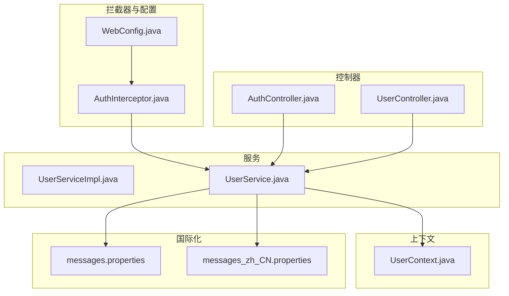
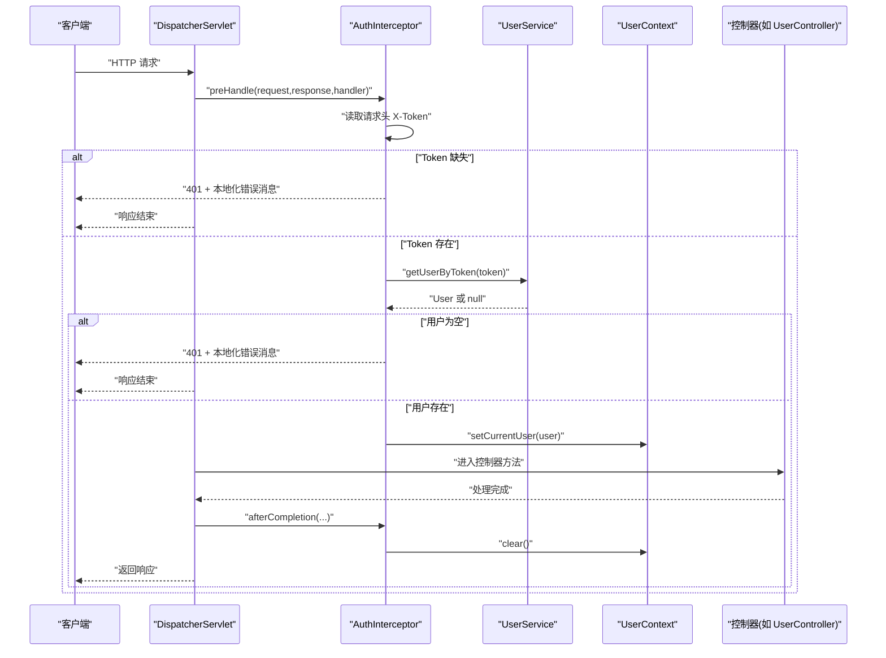
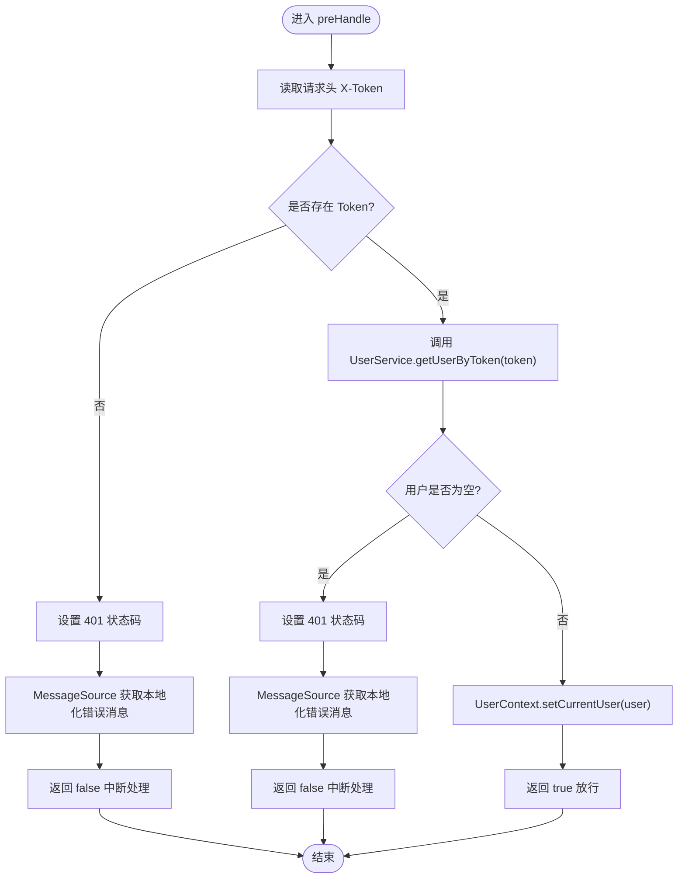
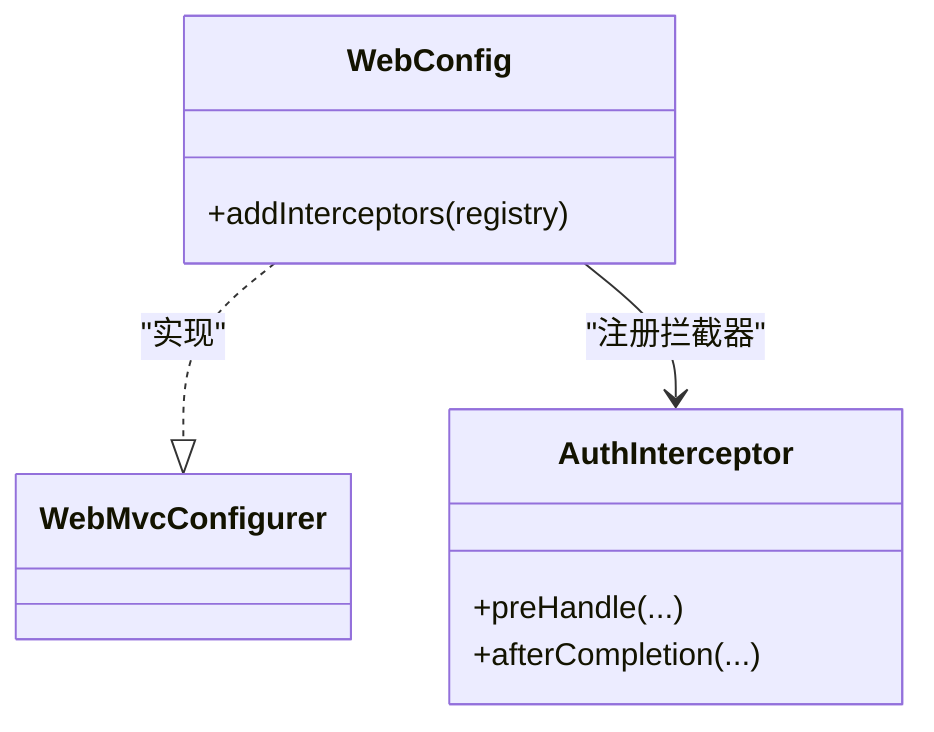
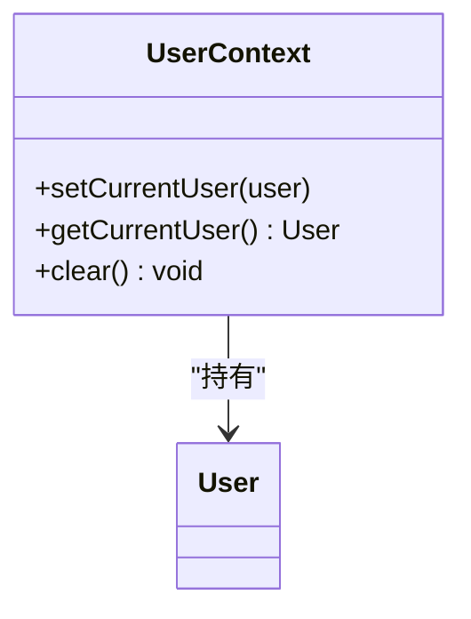
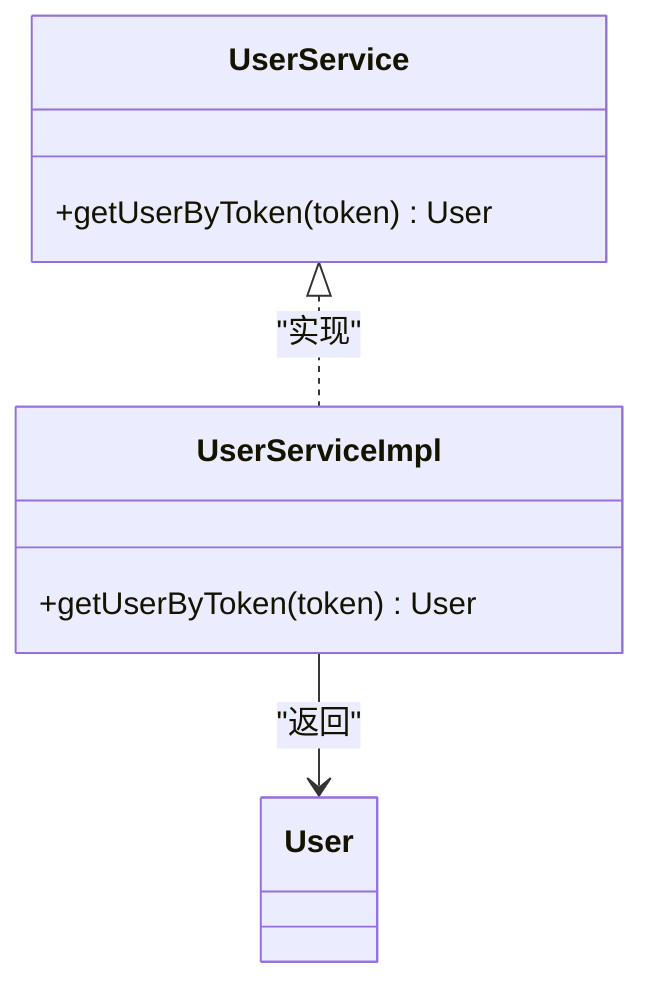
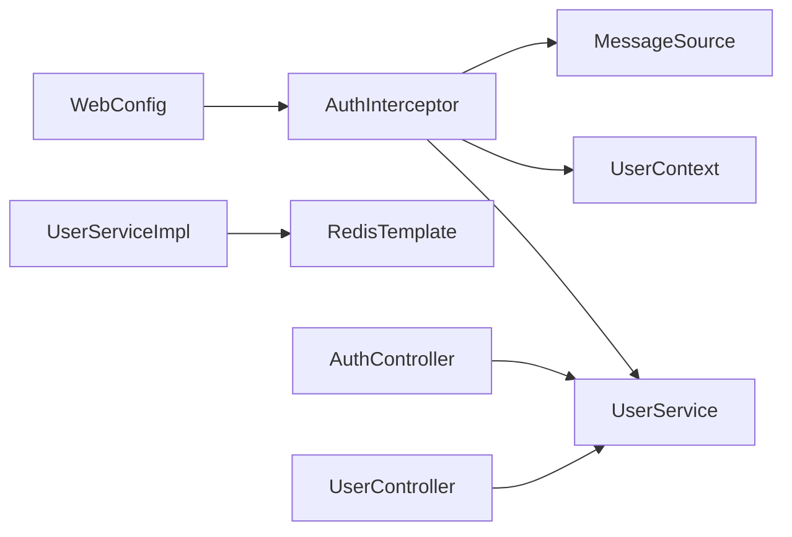

# 认证拦截器

<cite>
**本文引用的文件**
- [AuthInterceptor.java](file://src/main/java/com/example/onlinestore/interceptor/AuthInterceptor.java)
- [WebConfig.java](file://src/main/java/com/example/onlinestore/config/WebConfig.java)
- [UserContext.java](file://src/main/java/com/example/onlinestore/context/UserContext.java)
- [UserService.java](file://src/main/java/com/example/onlinestore/service/UserService.java)
- [UserServiceImpl.java](file://src/main/java/com/example/onlinestore/service/impl/UserServiceImpl.java)
- [messages.properties](file://src/main/resources/i18n/messages.properties)
- [messages_zh_CN.properties](file://src/main/resources/i18n/messages_zh_CN.properties)
- [AuthController.java](file://src/main/java/com/example/onlinestore/controller/AuthController.java)
- [UserController.java](file://src/main/java/com/example/onlinestore/controller/UserController.java)
</cite>

## 目录
1. [简介](#简介)
2. [项目结构](#项目结构)
3. [核心组件](#核心组件)
4. [架构总览](#架构总览)
5. [详细组件分析](#详细组件分析)
6. [依赖关系分析](#依赖关系分析)
7. [性能考量](#性能考量)
8. [故障排查指南](#故障排查指南)
9. [结论](#结论)

## 简介
本文件围绕认证拦截器 AuthInterceptor 展开，系统性说明其在请求处理前通过 preHandle 方法拦截 HTTP 请求、从请求头提取 X-Token 并调用 UserService.getUserByToken 进行身份验证的工作机制；当 Token 缺失或无效时，拦截器如何设置 401 状态码并返回本地化错误消息；以及 UserContext 如何利用 ThreadLocal 为当前线程绑定用户信息，确保上下文安全传递，并强调在 afterCompletion 中调用 clear() 防止内存泄漏的重要性。同时，结合代码示例路径展示拦截器注册流程及其在整个请求生命周期中的执行时机，分析其与 Spring MVC HandlerInterceptor 的集成机制。

## 项目结构
该模块采用典型的 Spring MVC 分层组织方式：
- 拦截器与配置位于 interceptor 与 config 包
- 上下文工具类 UserContext 位于 context 包
- 服务接口与实现位于 service 与 service/impl 包
- 国际化资源位于 resources/i18n
- 控制器位于 controller 包

图表来源
- [AuthInterceptor.java](file://src/main/java/com/example/onlinestore/interceptor/AuthInterceptor.java#L1-L49)
- [WebConfig.java](file://src/main/java/com/example/onlinestore/config/WebConfig.java#L1-L21)
- [UserContext.java](file://src/main/java/com/example/onlinestore/context/UserContext.java#L1-L19)
- [UserService.java](file://src/main/java/com/example/onlinestore/service/UserService.java#L1-L14)
- [UserServiceImpl.java](file://src/main/java/com/example/onlinestore/service/impl/UserServiceImpl.java#L1-L193)
- [messages.properties](file://src/main/resources/i18n/messages.properties#L1-L17)
- [messages_zh_CN.properties](file://src/main/resources/i18n/messages_zh_CN.properties#L1-L17)
- [AuthController.java](file://src/main/java/com/example/onlinestore/controller/AuthController.java#L1-L45)
- [UserController.java](file://src/main/java/com/example/onlinestore/controller/UserController.java#L1-L66)

章节来源
- [AuthInterceptor.java](file://src/main/java/com/example/onlinestore/interceptor/AuthInterceptor.java#L1-L49)
- [WebConfig.java](file://src/main/java/com/example/onlinestore/config/WebConfig.java#L1-L21)

## 核心组件
- 认证拦截器 AuthInterceptor：实现 HandlerInterceptor 接口，在 preHandle 中校验 X-Token 并将用户信息写入 UserContext；在 afterCompletion 清理上下文。
- WebConfig：注册拦截器，限定匹配路径与排除路径。
- UserContext：基于 ThreadLocal 的线程级用户上下文容器，提供设置、获取与清理能力。
- UserService 与 UserServiceImpl：定义并实现 getUserByToken，从 Redis 中解析用户信息。
- 国际化资源：messages.properties 与 messages_zh_CN.properties 提供本地化错误消息键值。
- 控制器：AuthController 负责登录并返回 token；UserController 在需要鉴权的场景使用上下文用户信息。

章节来源
- [AuthInterceptor.java](file://src/main/java/com/example/onlinestore/interceptor/AuthInterceptor.java#L1-L49)
- [WebConfig.java](file://src/main/java/com/example/onlinestore/config/WebConfig.java#L1-L21)
- [UserContext.java](file://src/main/java/com/example/onlinestore/context/UserContext.java#L1-L19)
- [UserService.java](file://src/main/java/com/example/onlinestore/service/UserService.java#L1-L14)
- [UserServiceImpl.java](file://src/main/java/com/example/onlinestore/service/impl/UserServiceImpl.java#L178-L193)
- [messages.properties](file://src/main/resources/i18n/messages.properties#L1-L17)
- [messages_zh_CN.properties](file://src/main/resources/i18n/messages_zh_CN.properties#L1-L17)
- [AuthController.java](file://src/main/java/com/example/onlinestore/controller/AuthController.java#L1-L45)
- [UserController.java](file://src/main/java/com/example/onlinestore/controller/UserController.java#L1-L66)

## 架构总览
下图展示了从客户端发起请求到控制器处理的完整链路，重点标注了拦截器的执行时机与上下文传递：

图表来源
- [AuthInterceptor.java](file://src/main/java/com/example/onlinestore/interceptor/AuthInterceptor.java#L23-L49)
- [UserService.java](file://src/main/java/com/example/onlinestore/service/UserService.java#L10-L14)
- [UserServiceImpl.java](file://src/main/java/com/example/onlinestore/service/impl/UserServiceImpl.java#L178-L193)
- [UserContext.java](file://src/main/java/com/example/onlinestore/context/UserContext.java#L1-L19)
- [WebConfig.java](file://src/main/java/com/example/onlinestore/config/WebConfig.java#L15-L21)

## 详细组件分析

### 认证拦截器 AuthInterceptor
- 执行时机：实现 HandlerInterceptor 接口，preHandle 在控制器方法执行前调用；afterCompletion 在视图渲染完成后调用。
- 请求头解析：从 HttpServletRequest 中读取 X-Token 头部。
- 身份验证：调用 UserService.getUserByToken(token) 获取用户对象；若返回 null 则判定为无效。
- 错误处理：当 X-Token 缺失或用户为空时，设置响应状态为 401，并通过 MessageSource 按当前 Locale 返回本地化“未授权”消息，随后中断后续处理。
- 上下文绑定：当用户有效时，调用 UserContext.setCurrentUser(user) 将用户信息绑定到当前线程。
- 生命周期收尾：在 afterCompletion 中调用 UserContext.clear() 清理线程变量，避免线程复用导致的内存泄漏。

图表来源
- [AuthInterceptor.java](file://src/main/java/com/example/onlinestore/interceptor/AuthInterceptor.java#L23-L43)
- [UserService.java](file://src/main/java/com/example/onlinestore/service/UserService.java#L10-L14)
- [messages.properties](file://src/main/resources/i18n/messages.properties#L1-L17)
- [messages_zh_CN.properties](file://src/main/resources/i18n/messages_zh_CN.properties#L1-L17)

章节来源
- [AuthInterceptor.java](file://src/main/java/com/example/onlinestore/interceptor/AuthInterceptor.java#L1-L49)

### 拦截器注册与 Spring MVC 集成
- 注册位置：WebConfig 实现 WebMvcConfigurer，并在 addInterceptors 中注册 AuthInterceptor。
- 匹配规则：通过 addPathPatterns("/api/**") 对所有 /api 前缀的请求生效；通过 excludePathPatterns("/api/auth/login") 排除登录接口，避免循环拦截。
- 与 HandlerInterceptor 的关系：AuthInterceptor 作为 Spring MVC 的拦截器，遵循 preHandle -> 控制器 -> afterCompletion 的标准生命周期。

图表来源
- [WebConfig.java](file://src/main/java/com/example/onlinestore/config/WebConfig.java#L1-L21)
- [AuthInterceptor.java](file://src/main/java/com/example/onlinestore/interceptor/AuthInterceptor.java#L1-L49)

章节来源
- [WebConfig.java](file://src/main/java/com/example/onlinestore/config/WebConfig.java#L1-L21)

### 用户上下文 UserContext
- 设计要点：基于 ThreadLocal 为每个线程维护独立的用户对象引用，避免跨线程污染。
- 使用方式：在 preHandle 成功后调用 setCurrentUser(user)；在 afterCompletion 中调用 clear() 清理，防止线程池复用引发内存泄漏。
- 安全性：由于 ThreadLocal 仅在线程内可见，配合拦截器的生命周期管理，可确保上下文在请求期间稳定传递，且在请求结束后释放。

图表来源
- [UserContext.java](file://src/main/java/com/example/onlinestore/context/UserContext.java#L1-L19)

章节来源
- [UserContext.java](file://src/main/java/com/example/onlinestore/context/UserContext.java#L1-L19)

### 身份验证服务 UserService 与实现
- 接口职责：对外暴露 getUserByToken(token)，用于根据令牌解析用户信息。
- 实现细节：UserServiceImpl 通过 Redis 读取用户 JSON 并反序列化为 User 对象；若 Redis 中无对应键则返回 null，表示无效 token。
- 异常处理：读取 Redis 或反序列化异常时记录日志并返回 null，由拦截器统一处理 401 场景。

图表来源
- [UserService.java](file://src/main/java/com/example/onlinestore/service/UserService.java#L1-L14)
- [UserServiceImpl.java](file://src/main/java/com/example/onlinestore/service/impl/UserServiceImpl.java#L178-L193)

章节来源
- [UserService.java](file://src/main/java/com/example/onlinestore/service/UserService.java#L1-L14)
- [UserServiceImpl.java](file://src/main/java/com/example/onlinestore/service/impl/UserServiceImpl.java#L178-L193)

### 国际化与本地化错误消息
- 消息键：error.unauthorized 用于“未授权访问”的本地化文本。
- 语言选择：MessageSource 结合 LocaleContextHolder 获取当前 Locale，返回对应语言的消息内容。
- 登录控制器：AuthController.login 在业务异常（如凭据无效）时返回 400；系统异常返回 500 内部错误消息，体现与拦截器错误处理的互补。

章节来源
- [messages.properties](file://src/main/resources/i18n/messages.properties#L1-L17)
- [messages_zh_CN.properties](file://src/main/resources/i18n/messages_zh_CN.properties#L1-L17)
- [AuthInterceptor.java](file://src/main/java/com/example/onlinestore/interceptor/AuthInterceptor.java#L23-L43)
- [AuthController.java](file://src/main/java/com/example/onlinestore/controller/AuthController.java#L1-L45)

### 控制器与拦截器的协作
- 登录接口：AuthController 提供 /api/auth/login，返回 token；该路径在 WebConfig 中被排除，避免被 AuthInterceptor 拦截。
- 业务接口：UserController 等控制器在需要鉴权的场景中可安全地通过 UserContext.getCurrentUser() 获取当前用户，前提是拦截器已正确放行并绑定上下文。

章节来源
- [WebConfig.java](file://src/main/java/com/example/onlinestore/config/WebConfig.java#L15-L21)
- [AuthController.java](file://src/main/java/com/example/onlinestore/controller/AuthController.java#L1-L45)
- [UserController.java](file://src/main/java/com/example/onlinestore/controller/UserController.java#L1-L66)
- [UserContext.java](file://src/main/java/com/example/onlinestore/context/UserContext.java#L1-L19)

## 依赖关系分析
- 拦截器对服务与上下文的依赖：AuthInterceptor 依赖 UserService 与 UserContext；对国际化资源依赖 MessageSource。
- 配置对拦截器的依赖：WebConfig 依赖 AuthInterceptor 并将其注册到 Spring MVC。
- 服务对 Redis 的依赖：UserServiceImpl 依赖 RedisTemplate 读取用户信息。
- 控制器对服务的依赖：各控制器依赖 UserService 提供的业务能力。

图表来源
- [WebConfig.java](file://src/main/java/com/example/onlinestore/config/WebConfig.java#L1-L21)
- [AuthInterceptor.java](file://src/main/java/com/example/onlinestore/interceptor/AuthInterceptor.java#L1-L49)
- [UserServiceImpl.java](file://src/main/java/com/example/onlinestore/service/impl/UserServiceImpl.java#L1-L193)
- [AuthController.java](file://src/main/java/com/example/onlinestore/controller/AuthController.java#L1-L45)
- [UserController.java](file://src/main/java/com/example/onlinestore/controller/UserController.java#L1-L66)

章节来源
- [WebConfig.java](file://src/main/java/com/example/onlinestore/config/WebConfig.java#L1-L21)
- [AuthInterceptor.java](file://src/main/java/com/example/onlinestore/interceptor/AuthInterceptor.java#L1-L49)
- [UserServiceImpl.java](file://src/main/java/com/example/onlinestore/service/impl/UserServiceImpl.java#L1-L193)

## 性能考量
- Token 解析成本：getUserByToken 通过 Redis 读取用户信息，通常具备较低延迟；建议确保 Redis 连接池与超时配置合理。
- 线程安全与内存：使用 ThreadLocal 绑定用户上下文，避免共享状态带来的同步开销；务必在 afterCompletion 中调用 clear()，防止线程池复用导致的内存泄漏。
- 拦截范围：通过 WebConfig 的路径匹配与排除策略，减少不必要的拦截开销，仅对受保护接口启用拦截。
- 本地化消息：MessageSource 的使用成本极低，但应避免在高频路径中重复构造消息对象。

[本节为通用性能建议，不直接分析具体文件]

## 故障排查指南
- 401 未授权常见原因
  - 缺少 X-Token 头：拦截器会直接返回 401。
  - Token 无效或过期：Redis 中无对应键或反序列化失败，拦截器返回 401。
  - 本地化消息未按预期显示：确认 Locale 设置与对应 messages_* 文件键值一致。
- 上下文未清理导致的异常
  - 若 afterCompletion 未调用 clear()，线程复用可能导致旧用户信息残留；请检查拦截器生命周期钩子是否生效。
- 登录接口被拦截
  - 确认 WebConfig 中已将 /api/auth/login 排除在拦截范围之外。
- 控制器无法获取当前用户
  - 确认拦截器已成功放行并调用 UserContext.setCurrentUser(user)；在 afterCompletion 中调用 clear() 后不应再持有用户信息。

章节来源
- [AuthInterceptor.java](file://src/main/java/com/example/onlinestore/interceptor/AuthInterceptor.java#L23-L49)
- [WebConfig.java](file://src/main/java/com/example/onlinestore/config/WebConfig.java#L15-L21)
- [messages.properties](file://src/main/resources/i18n/messages.properties#L1-L17)
- [messages_zh_CN.properties](file://src/main/resources/i18n/messages_zh_CN.properties#L1-L17)
- [UserContext.java](file://src/main/java/com/example/onlinestore/context/UserContext.java#L1-L19)

## 结论
AuthInterceptor 通过在 preHandle 中读取 X-Token 并调用 UserService.getUserByToken 完成身份验证，结合 MessageSource 实现本地化错误提示；通过 UserContext 将用户信息以 ThreadLocal 形式绑定到当前线程，确保上下文在请求生命周期内的安全传递；并在 afterCompletion 中清理上下文，防止线程池复用导致的内存泄漏。WebConfig 正确注册拦截器并限定匹配范围，与 Spring MVC HandlerInterceptor 机制无缝集成。整体设计简洁、边界清晰，满足高可用与可维护性的要求。