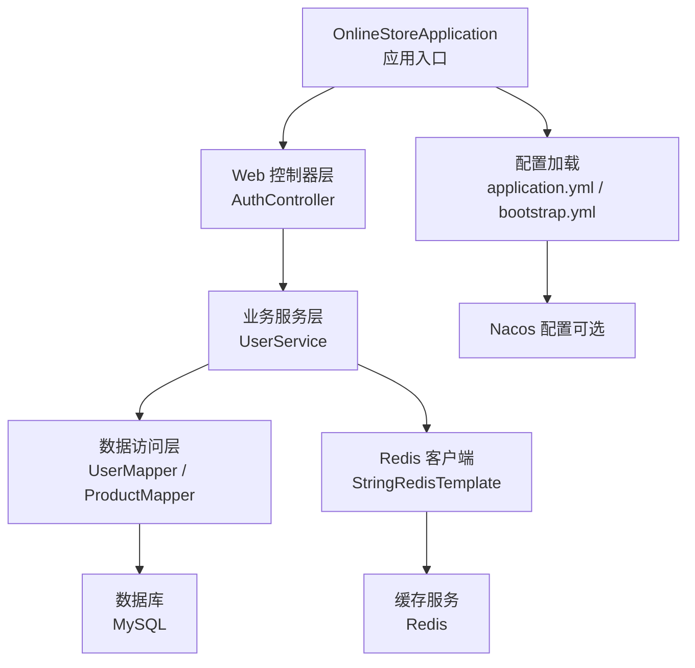
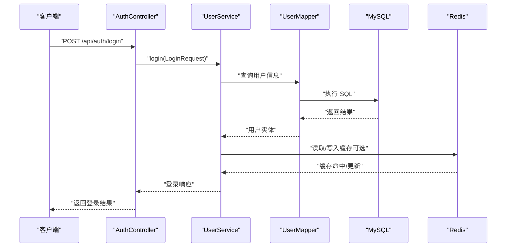

# 快速开始

<cite>
**本文引用的文件**
- [README.md](file://README.md)
- [pom.xml](file://pom.xml)
- [application.yml](file://src/main/resources/application.yml)
- [application-local.yml](file://src/main/resources/application-local.yml)
- [bootstrap.yml](file://src/main/resources/bootstrap.yml)
- [schema.sql](file://src/main/resources/db/schema.sql)
- [OnlineStoreApplication.java](file://src/main/java/com/example/onlinestore/OnlineStoreApplication.java)
- [NacosConfig.java](file://src/main/java/com/example/onlinestore/config/NacosConfig.java)
- [RedisConfig.java](file://src/main/java/com/example/onlinestore/config/RedisConfig.java)
- [MyBatisConfig.java](file://src/main/java/com/example/onlinestore/config/MyBatisConfig.java)
- [AuthController.java](file://src/main/java/com/example/onlinestore/controller/AuthController.java)
- [LoginRequest.java](file://src/main/java/com/example/onlinestore/dto/LoginRequest.java)
</cite>

## 目录
1. [简介](#简介)
2. [项目结构](#项目结构)
3. [前置条件与安装](#前置条件与安装)
4. [数据库初始化](#数据库初始化)
5. [配置文件修改](#配置文件修改)
6. [启动应用](#启动应用)
7. [验证服务](#验证服务)
8. [常见问题排查](#常见问题排查)
9. [架构概览](#架构概览)
10. [结语](#结语)

## 简介
本指南面向首次接触 online-store 的开发者，帮助你在 10 分钟内完成本地环境搭建与应用启动。你将学会：
- 安装并准备 JDK、Maven、MySQL、Redis
- 初始化数据库表结构
- 配置数据库连接、Redis 地址、Nacos（可选）
- 使用 mvn spring-boot:run 启动应用
- 基本验证登录接口是否可用
- 常见问题的快速排查方法

## 项目结构
online-store 是一个基于 Spring Boot 3.1.5 与 Spring Cloud 的后端服务，采用 MyBatis 访问 MySQL，使用 Redis 缓存，支持 Nacos 配置中心（可选）。

图表来源
- [OnlineStoreApplication.java](file://src/main/java/com/example/onlinestore/OnlineStoreApplication.java#L1-L15)
- [AuthController.java](file://src/main/java/com/example/onlinestore/controller/AuthController.java#L1-L45)
- [application.yml](file://src/main/resources/application.yml#L1-L48)
- [bootstrap.yml](file://src/main/resources/bootstrap.yml#L1-L17)

章节来源
- [README.md](file://README.md#L1-L55)
- [pom.xml](file://pom.xml#L1-L169)

## 前置条件与安装
- JDK：17 或更高版本
- Maven：3.6 或更高版本
- MySQL：8.0
- Redis：6.0 或更高版本

章节来源
- [README.md](file://README.md#L37-L43)
- [pom.xml](file://pom.xml#L11-L21)

## 数据库初始化
1) 启动 MySQL 服务后，创建数据库（示例名称：online_store）。
2) 执行 schema.sql 脚本以创建用户表。

提示
- 若你的数据库用户名或密码与默认配置不同，请先在配置文件中修改后再执行脚本。
- 如果你使用的是其他数据库名或字符集设置，请保持与配置一致。

章节来源
- [README.md](file://README.md#L44-L55)
- [schema.sql](file://src/main/resources/db/schema.sql#L1-L8)

## 配置文件修改
应用通过 profile 激活配置，默认使用 local。主要需要检查以下配置项：
- 数据库连接：URL、用户名、密码
- Redis 连接：主机、端口、密码（如有）、数据库索引
- Nacos（可选）：开关、服务地址、命名空间、分组等

定位文件
- 主配置：application.yml
- 本地开发配置：application-local.yml
- Nacos 配置：bootstrap.yml

章节来源
- [application.yml](file://src/main/resources/application.yml#L1-L48)
- [application-local.yml](file://src/main/resources/application-local.yml#L1-L33)
- [bootstrap.yml](file://src/main/resources/bootstrap.yml#L1-L17)

## 启动应用
1) 确保 MySQL 和 Redis 服务已启动。
2) 在项目根目录执行启动命令：
   - mvn spring-boot:run

注意
- 若需要使用 Nacos 配置中心，请在启动前设置相关环境变量或在配置中开启开关。
- 默认端口为 8080；若被占用，可在 application.yml 中修改 server.port。

章节来源
- [README.md](file://README.md#L44-L55)
- [application.yml](file://src/main/resources/application.yml#L1-L4)
- [OnlineStoreApplication.java](file://src/main/java/com/example/onlinestore/OnlineStoreApplication.java#L1-L15)

## 验证服务
你可以通过调用登录接口验证服务是否成功启动：
- 接口路径：POST /api/auth/login
- 请求体字段：username、password
- 成功响应：返回登录结果
- 失败响应：参数校验失败返回 400，系统异常返回 500

建议步骤
- 使用浏览器或 Postman 发送请求
- 若第一次登录，可能需要先创建用户或使用已有账号
- 观察服务日志输出，确认无异常

章节来源
- [AuthController.java](file://src/main/java/com/example/onlinestore/controller/AuthController.java#L1-L45)
- [LoginRequest.java](file://src/main/java/com/example/onlinestore/dto/LoginRequest.java#L1-L22)

## 常见问题排查
- 端口冲突
  - 现象：启动时报端口占用
  - 处理：修改 application.yml 中的 server.port
- 依赖下载失败
  - 现象：mvn 命令卡住或报网络错误
  - 处理：检查网络与 Maven 仓库配置；必要时更换镜像源
- 数据库连接错误
  - 现象：启动时报连接失败或无法找到数据库
  - 处理：核对 application.yml 中的数据库 URL、用户名、密码；确认数据库已创建且服务正常
- Redis 连接错误
  - 现象：启动时报 Redis 连接异常
  - 处理：核对 application.yml 中的 host、port、password；确认 Redis 已启动
- Nacos 未启用但报错
  - 现象：未配置 Nacos 但出现相关错误
  - 处理：在 application.yml 或 bootstrap.yml 中关闭 Nacos，或将 Nacos 服务启动并正确配置

章节来源
- [application.yml](file://src/main/resources/application.yml#L1-L48)
- [application-local.yml](file://src/main/resources/application-local.yml#L1-L33)
- [bootstrap.yml](file://src/main/resources/bootstrap.yml#L1-L17)
- [NacosConfig.java](file://src/main/java/com/example/onlinestore/config/NacosConfig.java#L1-L29)

## 架构概览
下面的时序图展示了从客户端到服务端的关键交互链路，以及配置加载与数据访问的层次关系。

图表来源
- [AuthController.java](file://src/main/java/com/example/onlinestore/controller/AuthController.java#L1-L45)
- [OnlineStoreApplication.java](file://src/main/java/com/example/onlinestore/OnlineStoreApplication.java#L1-L15)
- [application.yml](file://src/main/resources/application.yml#L1-L48)

## 结语
至此，你已经完成了 online-store 的本地环境搭建与应用启动。建议后续继续完善：
- 根据团队规范补充 Nacos 配置（如需）
- 使用测试工具完善接口测试
- 配合前端联调接口，逐步完善功能