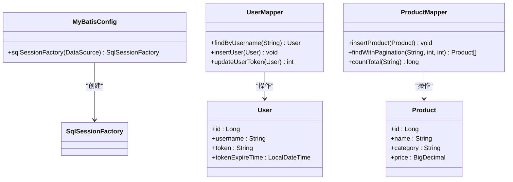
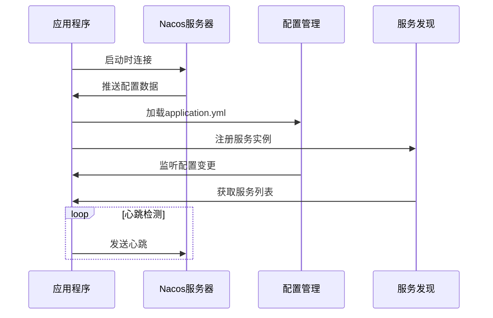
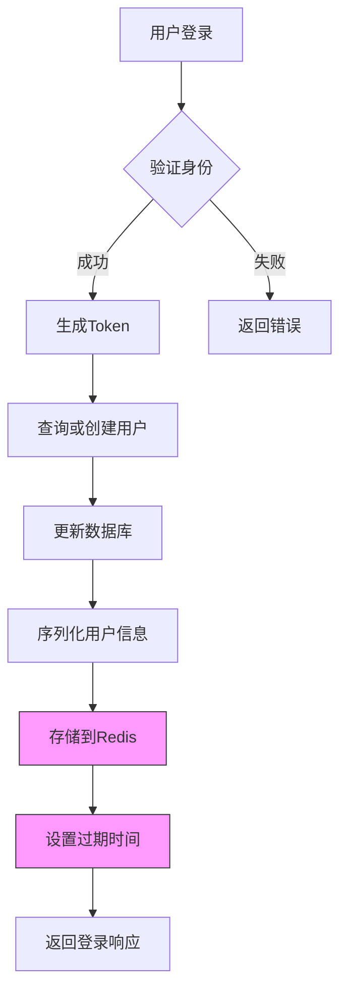
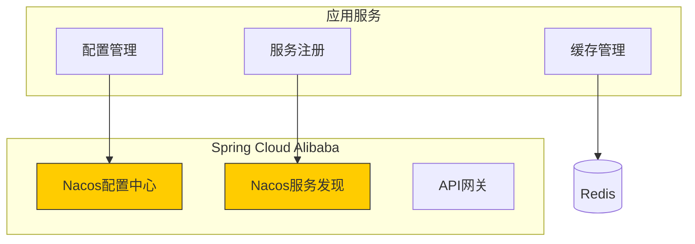
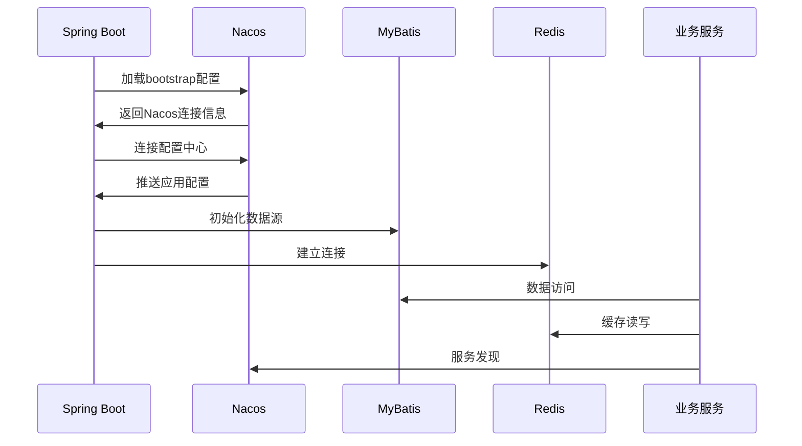

# 技术栈与依赖

<cite>
**本文档中引用的文件**  
- [pom.xml](file://pom.xml)
- [application.yml](file://src/main/resources/application.yml)
- [bootstrap.yml](file://src/main/resources/bootstrap.yml)
- [OnlineStoreApplication.java](file://src/main/java/com/example/onlinestore/OnlineStoreApplication.java)
- [MyBatisConfig.java](file://src/main/java/com/example/onlinestore/config/MyBatisConfig.java)
- [NacosConfig.java](file://src/main/java/com/example/onlinestore/config/NacosConfig.java)
- [RedisConfig.java](file://src/main/java/com/example/onlinestore/config/RedisConfig.java)
- [UserServiceImpl.java](file://src/main/java/com/example/onlinestore/service/impl/UserServiceImpl.java)
- [ProductServiceImpl.java](file://src/main/java/com/example/onlinestore/service/impl/ProductServiceImpl.java)
</cite>

## 目录
1. [项目概述](#项目概述)
2. [核心技术栈分析](#核心技术栈分析)
3. [Spring Boot 基础框架](#spring-boot-基础框架)
4. [MyBatis ORM 工具](#mybatis-orm-工具)
5. [Nacos 配置中心与服务发现](#nacos-配置中心与服务发现)
6. [Redis 会话缓存应用](#redis-会话缓存应用)
7. [pom.xml 关键依赖分析](#pomxml-关键依赖分析)
8. [Spring Cloud Alibaba 微服务支持](#spring-cloud-alibaba-微服务支持)
9. [组件协作机制](#组件协作机制)
10. [技术选型上下文](#技术选型上下文)

## 项目概述
online-store项目是一个基于Spring Boot构建的在线商城后端系统，采用微服务架构设计理念。项目通过Spring Cloud Alibaba生态实现服务治理，使用MyBatis作为持久层框架，Nacos作为配置中心和服务注册中心，Redis用于会话缓存管理。系统支持动态配置加载、服务发现、数据库访问和分布式缓存等核心功能，为开发者提供了完整的微服务解决方案。

## 核心技术栈分析
本项目采用现代化Java技术栈，以Spring Boot为核心基础，构建了一个可扩展的微服务应用。技术栈的选择体现了对开发效率、系统稳定性和运维便利性的综合考虑。通过Spring Cloud Alibaba集成，项目实现了云原生应用的关键特性，包括配置管理、服务发现和分布式缓存。各技术组件协同工作，形成了一个高效、可靠的应用架构。

## Spring Boot 基础框架
Spring Boot作为项目的基础框架，提供了自动配置、起步依赖和内嵌服务器等核心特性。在pom.xml中，通过spring-boot-starter-web、spring-boot-starter-actuator等起步依赖快速集成了Web服务和监控功能。项目入口类OnlineStoreApplication使用@SpringBootApplication注解启用自动配置，简化了应用初始化过程。Spring Boot的约定优于配置原则显著提升了开发效率，同时保持了良好的可定制性。

**Section sources**
- [pom.xml](file://pom.xml#L50-L58)
- [OnlineStoreApplication.java](file://src/main/java/com/example/onlinestore/OnlineStoreApplication.java#L8-L15)

## MyBatis ORM 工具
MyBatis作为ORM工具，在项目中负责数据库访问操作。通过mybatis-spring-boot-starter依赖集成，实现了与Spring Boot的无缝对接。项目配置了MyBatisConfig类，设置了mapper文件位置和驼峰命名转换规则。实体类User和Product通过XML映射文件（UserMapper.xml和ProductMapper.xml）定义SQL语句，实现了数据访问逻辑的分离。这种配置方式既保持了SQL的灵活性，又获得了框架的便利性。

**Diagram sources**
- [MyBatisConfig.java](file://src/main/java/com/example/onlinestore/config/MyBatisConfig.java#L10-L27)
- [UserMapper.java](file://src/main/java/com/example/onlinestore/mapper/UserMapper.java#L10-L23)
- [ProductMapper.java](file://src/main/java/com/example/onlinestore/mapper/ProductMapper.java#L10-L20)

**Section sources**
- [pom.xml](file://pom.xml#L110-L115)
- [MyBatisConfig.java](file://src/main/java/com/example/onlinestore/config/MyBatisConfig.java#L10-L27)
- [UserMapper.java](file://src/main/java/com/example/onlinestore/mapper/UserMapper.java#L10-L23)
- [ProductMapper.java](file://src/main/java/com/example/onlinestore/mapper/ProductMapper.java#L10-L20)

## Nacos 配置中心与服务发现
Nacos在项目中承担配置中心和服务发现的双重角色。通过spring-cloud-starter-alibaba-nacos-config和nacos-discovery依赖，实现了动态配置管理和服务注册发现功能。bootstrap.yml文件配置了Nacos服务器地址和命名空间，支持配置的集中管理和动态刷新。NacosConfig配置类使用@ConditionalOnProperty注解控制服务注册的启用状态，提供了灵活的部署选项。这种设计使得应用能够适应不同的运行环境，提高了系统的可维护性。

**Diagram sources**
- [pom.xml](file://pom.xml#L85-L108)
- [bootstrap.yml](file://src/main/resources/bootstrap.yml#L1-L17)
- [NacosConfig.java](file://src/main/java/com/example/onlinestore/config/NacosConfig.java#L24-L29)

**Section sources**
- [pom.xml](file://pom.xml#L85-L108)
- [bootstrap.yml](file://src/main/resources/bootstrap.yml#L1-L17)
- [NacosConfig.java](file://src/main/java/com/example/onlinestore/config/NacosConfig.java#L24-L29)
- [application.yml](file://src/main/resources/application.yml#L7-L14)

## Redis 会话缓存应用
Redis在项目中主要用于会话缓存管理，提升系统性能和用户体验。通过spring-boot-starter-data-redis和jedis客户端依赖，实现了与Redis的连接。RedisConfig配置类定义了StringRedisTemplate Bean，提供了字符串操作的便利接口。在UserServiceImpl中，用户登录成功后会将用户信息序列化存储到Redis，设置1天的过期时间。这种缓存策略减少了数据库查询压力，同时保证了会话数据的一致性和可靠性。

**Diagram sources**
- [pom.xml](file://pom.xml#L124-L135)
- [RedisConfig.java](file://src/main/java/com/example/onlinestore/config/RedisConfig.java#L8-L15)
- [UserServiceImpl.java](file://src/main/java/com/example/onlinestore/service/impl/UserServiceImpl.java#L123-L132)

**Section sources**
- [pom.xml](file://pom.xml#L124-L135)
- [RedisConfig.java](file://src/main/java/com/example/onlinestore/config/RedisConfig.java#L8-L15)
- [UserServiceImpl.java](file://src/main/java/com/example/onlinestore/service/impl/UserServiceImpl.java#L123-L132)
- [application.yml](file://src/main/resources/application.yml#L22-L34)

## pom.xml 关键依赖分析
pom.xml文件定义了项目的核心依赖及其版本管理。通过dependencyManagement集中管理Spring Cloud、Spring Boot和Spring Cloud Alibaba的版本，确保了依赖的一致性。关键依赖包括：spring-cloud-starter-alibaba-nacos-config（配置中心）、mybatis-spring-boot-starter（ORM框架）、spring-boot-starter-data-redis（Redis支持）等。版本选择遵循了Spring生态的兼容性要求，如Spring Boot 3.1.5与Spring Cloud 2022.0.4的匹配。这种依赖管理方式简化了版本控制，降低了依赖冲突的风险。

**Section sources**
- [pom.xml](file://pom.xml#L11-L21)
- [pom.xml](file://pom.xml#L23-L47)
- [pom.xml](file://pom.xml#L85-L135)

## Spring Cloud Alibaba 微服务支持
Spring Cloud Alibaba为项目提供了完整的微服务解决方案。通过集成Nacos组件，实现了服务注册发现和配置管理两大核心功能。项目利用@RefreshScope注解支持配置的动态刷新，无需重启应用即可生效。bootstrap.yml优先加载的机制确保了配置中心连接信息的及时获取。Spring Cloud Alibaba的starter模式简化了微服务组件的集成，开发者只需引入相应依赖即可获得完整功能。这种设计降低了微服务架构的复杂性，使开发者能够专注于业务逻辑实现。

**Diagram sources**
- [pom.xml](file://pom.xml#L39-L45)
- [OnlineStoreApplication.java](file://src/main/java/com/example/onlinestore/OnlineStoreApplication.java#L10-L15)
- [bootstrap.yml](file://src/main/resources/bootstrap.yml#L1-L17)

**Section sources**
- [pom.xml](file://pom.xml#L39-L45)
- [OnlineStoreApplication.java](file://src/main/java/com/example/onlinestore/OnlineStoreApplication.java#L10-L15)
- [bootstrap.yml](file://src/main/resources/bootstrap.yml#L1-L17)

## 组件协作机制
项目各组件通过清晰的协作机制共同支撑系统运行。启动时，Spring Boot加载bootstrap.yml中的Nacos配置，建立与配置中心的连接。随后从Nacos获取application.yml等配置信息，完成应用初始化。MyBatis根据配置创建数据访问层，Redis建立缓存连接。运行时，业务服务通过Nacos发现其他服务实例，利用MyBatis操作数据库，通过Redis缓存热点数据。这种分层协作模式实现了关注点分离，提高了系统的可维护性和可扩展性。

**Diagram sources**
- [bootstrap.yml](file://src/main/resources/bootstrap.yml#L1-L17)
- [application.yml](file://src/main/resources/application.yml#L1-L48)
- [MyBatisConfig.java](file://src/main/java/com/example/onlinestore/config/MyBatisConfig.java#L10-L27)
- [RedisConfig.java](file://src/main/java/com/example/onlinestore/config/RedisConfig.java#L8-L15)

**Section sources**
- [bootstrap.yml](file://src/main/resources/bootstrap.yml#L1-L17)
- [application.yml](file://src/main/resources/application.yml#L1-L48)
- [MyBatisConfig.java](file://src/main/java/com/example/onlinestore/config/MyBatisConfig.java#L10-L27)
- [RedisConfig.java](file://src/main/java/com/example/onlinestore/config/RedisConfig.java#L8-L15)

## 技术选型上下文
本项目的技术选型基于现代Java微服务开发的最佳实践。选择Spring Boot作为基础框架，因其成熟的生态系统和广泛的社区支持。MyBatis被选用是由于其对复杂SQL的良好支持和灵活的映射配置。Nacos作为阿里巴巴开源的配置中心，在国内有良好的应用基础和文档支持。Redis因其高性能和丰富的数据结构成为缓存的首选。这些技术的组合既保证了系统的稳定性，又提供了良好的开发体验，适合中大型项目的长期维护和发展。