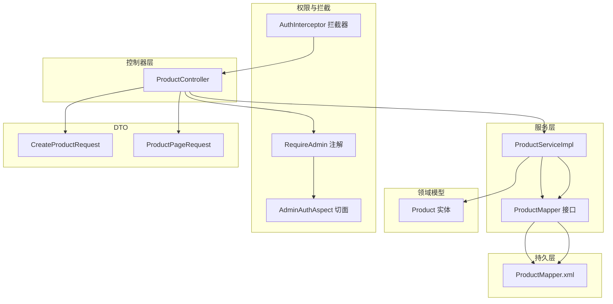
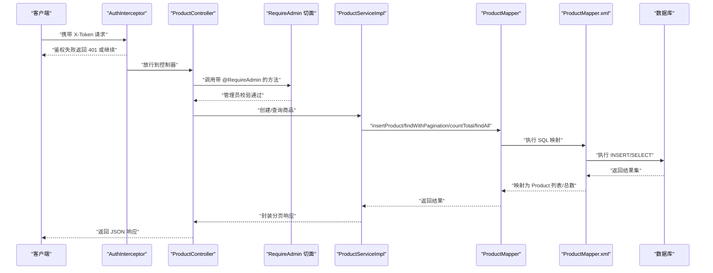
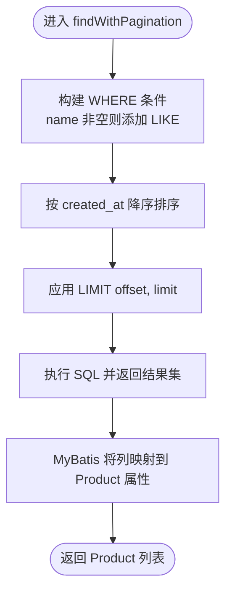
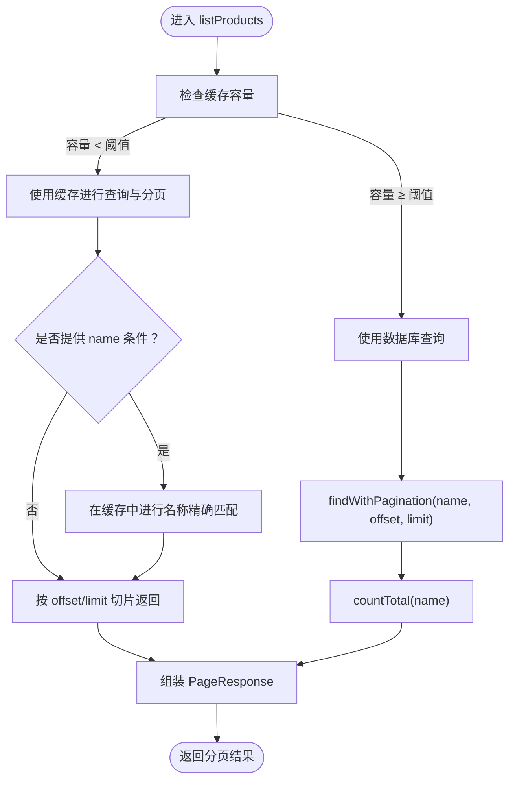
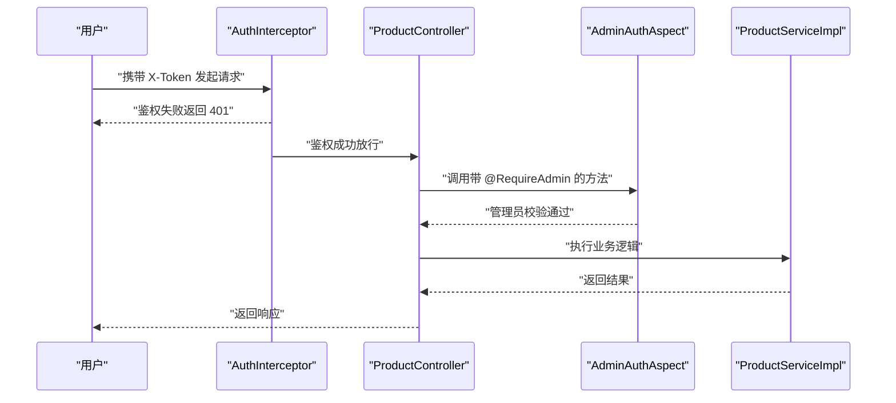
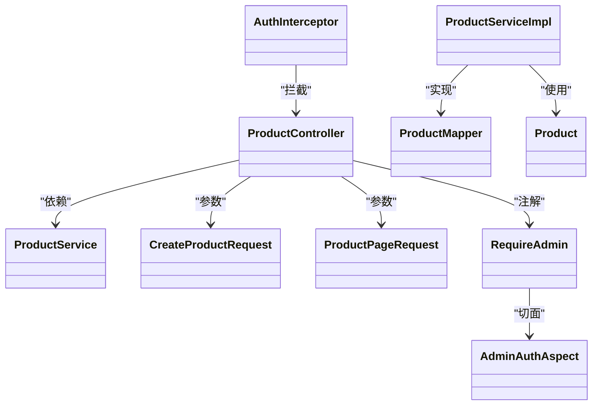

# 商品数据模型

<cite>
**本文引用的文件**
- [Product.java](file://src/main/java/com/example/onlinestore/model/Product.java)
- [ProductMapper.java](file://src/main/java/com/example/onlinestore/mapper/ProductMapper.java)
- [ProductMapper.xml](file://src/main/resources/mapper/ProductMapper.xml)
- [ProductController.java](file://src/main/java/com/example/onlinestore/controller/ProductController.java)
- [ProductServiceImpl.java](file://src/main/java/com/example/onlinestore/service/impl/ProductServiceImpl.java)
- [ProductService.java](file://src/main/java/com/example/onlinestore/service/ProductService.java)
- [CreateProductRequest.java](file://src/main/java/com/example/onlinestore/dto/CreateProductRequest.java)
- [ProductPageRequest.java](file://src/main/java/com/example/onlinestore/dto/ProductPageRequest.java)
- [RequireAdmin.java](file://src/main/java/com/example/onlinestore/annotation/RequireAdmin.java)
- [AdminAuthAspect.java](file://src/main/java/com/example/onlinestore/aspect/AdminAuthAspect.java)
- [AuthInterceptor.java](file://src/main/java/com/example/onlinestore/interceptor/AuthInterceptor.java)
- [schema.sql](file://src/main/resources/db/schema.sql)
</cite>

## 目录
1. [简介](#简介)
2. [项目结构](#项目结构)
3. [核心组件](#核心组件)
4. [架构总览](#架构总览)
5. [详细组件分析](#详细组件分析)
6. [依赖关系分析](#依赖关系分析)
7. [性能考量](#性能考量)
8. [故障排查指南](#故障排查指南)
9. [结论](#结论)
10. [附录](#附录)

## 简介
本文件聚焦于 online-store 项目的“商品数据模型”，系统性梳理 Product 实体类的字段设计、MyBatis 映射与 SQL 行为、分页与条件查询实现、以及与用户权限控制的关联。尽管数据库脚本中未直接出现 products 表定义，但通过 ProductMapper.xml 的 INSERT/SELECT 语义可反推表结构，并给出建议的 DDL；同时结合控制器与服务层对权限与分页的使用，完整呈现商品管理在系统中的位置与职责。

## 项目结构
围绕商品相关的核心文件组织如下：
- 实体与映射：model.Product、mapper.ProductMapper、resources/mapper/ProductMapper.xml
- 控制器与服务：controller.ProductController、service.ProductService 及其实现 service.impl.ProductServiceImpl
- DTO 与权限注解：dto.CreateProductRequest、dto.ProductPageRequest、annotation.RequireAdmin、aspect.AdminAuthAspect、interceptor.AuthInterceptor
- 数据库脚本：resources/db/schema.sql（当前仅包含 users 表）



图表来源
- [ProductController.java](file://src/main/java/com/example/onlinestore/controller/ProductController.java#L1-L78)
- [ProductServiceImpl.java](file://src/main/java/com/example/onlinestore/service/impl/ProductServiceImpl.java#L1-L132)
- [ProductMapper.java](file://src/main/java/com/example/onlinestore/mapper/ProductMapper.java#L1-L20)
- [ProductMapper.xml](file://src/main/resources/mapper/ProductMapper.xml#L1-L36)
- [Product.java](file://src/main/java/com/example/onlinestore/model/Product.java#L1-L61)
- [RequireAdmin.java](file://src/main/java/com/example/onlinestore/annotation/RequireAdmin.java#L1-L11)
- [AdminAuthAspect.java](file://src/main/java/com/example/onlinestore/aspect/AdminAuthAspect.java#L1-L71)
- [AuthInterceptor.java](file://src/main/java/com/example/onlinestore/interceptor/AuthInterceptor.java#L1-L49)
- [CreateProductRequest.java](file://src/main/java/com/example/onlinestore/dto/CreateProductRequest.java#L1-L42)
- [ProductPageRequest.java](file://src/main/java/com/example/onlinestore/dto/ProductPageRequest.java#L1-L39)

章节来源
- [ProductController.java](file://src/main/java/com/example/onlinestore/controller/ProductController.java#L1-L78)
- [ProductServiceImpl.java](file://src/main/java/com/example/onlinestore/service/impl/ProductServiceImpl.java#L1-L132)
- [ProductMapper.java](file://src/main/java/com/example/onlinestore/mapper/ProductMapper.java#L1-L20)
- [ProductMapper.xml](file://src/main/resources/mapper/ProductMapper.xml#L1-L36)
- [Product.java](file://src/main/java/com/example/onlinestore/model/Product.java#L1-L61)
- [schema.sql](file://src/main/resources/db/schema.sql#L1-L8)

## 核心组件
- Product 实体类：包含 id、name、category、price、createdAt、updatedAt 字段，提供标准 getter/setter。
- ProductMapper 接口与 XML 映射：定义 insertProduct、findWithPagination、countTotal、findAll 四个操作。
- ProductController：提供创建商品与分页查询接口，使用 RequireAdmin 注解保护创建接口。
- ProductServiceImpl：实现业务逻辑，包括事务性创建、基于内存缓存的快速分页与回退到数据库查询的策略。
- DTO：CreateProductRequest 与 ProductPageRequest 提供参数校验与分页约束。
- 权限控制：AuthInterceptor 基于 X-Token 进行鉴权，AdminAuthAspect 对标注了 RequireAdmin 的方法进行管理员校验。

章节来源
- [Product.java](file://src/main/java/com/example/onlinestore/model/Product.java#L1-L61)
- [ProductMapper.java](file://src/main/java/com/example/onlinestore/mapper/ProductMapper.java#L1-L20)
- [ProductMapper.xml](file://src/main/resources/mapper/ProductMapper.xml#L1-L36)
- [ProductController.java](file://src/main/java/com/example/onlinestore/controller/ProductController.java#L1-L78)
- [ProductServiceImpl.java](file://src/main/java/com/example/onlinestore/service/impl/ProductServiceImpl.java#L1-L132)
- [CreateProductRequest.java](file://src/main/java/com/example/onlinestore/dto/CreateProductRequest.java#L1-L42)
- [ProductPageRequest.java](file://src/main/java/com/example/onlinestore/dto/ProductPageRequest.java#L1-L39)
- [RequireAdmin.java](file://src/main/java/com/example/onlinestore/annotation/RequireAdmin.java#L1-L11)
- [AdminAuthAspect.java](file://src/main/java/com/example/onlinestore/aspect/AdminAuthAspect.java#L1-L71)
- [AuthInterceptor.java](file://src/main/java/com/example/onlinestore/interceptor/AuthInterceptor.java#L1-L49)

## 架构总览
下图展示从控制器到服务、再到 MyBatis 映射与数据库的调用链路，以及权限拦截与管理员校验的流程。



图表来源
- [AuthInterceptor.java](file://src/main/java/com/example/onlinestore/interceptor/AuthInterceptor.java#L1-L49)
- [ProductController.java](file://src/main/java/com/example/onlinestore/controller/ProductController.java#L1-L78)
- [RequireAdmin.java](file://src/main/java/com/example/onlinestore/annotation/RequireAdmin.java#L1-L11)
- [AdminAuthAspect.java](file://src/main/java/com/example/onlinestore/aspect/AdminAuthAspect.java#L1-L71)
- [ProductServiceImpl.java](file://src/main/java/com/example/onlinestore/service/impl/ProductServiceImpl.java#L1-L132)
- [ProductMapper.java](file://src/main/java/com/example/onlinestore/mapper/ProductMapper.java#L1-L20)
- [ProductMapper.xml](file://src/main/resources/mapper/ProductMapper.xml#L1-L36)

## 详细组件分析

### Product 实体类
- 字段与类型
  - id：Long，主键
  - name：String，商品名称
  - category：String，商品分类
  - price：BigDecimal，精确价格
  - createdAt、updatedAt：LocalDateTime，时间戳
- 设计要点
  - 使用 BigDecimal 存储价格，确保金融计算精度
  - 时间戳字段便于排序与审计
  - 所有字段均提供 getter/setter，便于 MyBatis 自动映射

章节来源
- [Product.java](file://src/main/java/com/example/onlinestore/model/Product.java#L1-L61)

### MyBatis 映射与 SQL 行为
- 表结构反推
  - INSERT 语句涉及字段：name、category、price、created_at、updated_at
  - SELECT 语句返回字段：id、name、category、price、created_at、updated_at
  - WHERE 条件支持 name 的模糊匹配
  - 分页使用 LIMIT offset, limit
  - COUNT 查询支持 name 条件
- 参数映射
  - #{name}、#{category}、#{price}、#{createdAt}、#{updatedAt} 与 Product 实体属性一一对应
- 动态查询
  - <if test="name != null and name != ''"> 控制 name LIKE 条件
- 分页逻辑
  - 由服务层计算 offset 与 limit，传入 XML 中的 LIMIT 占位符
- 结果映射
  - XML 中明确列出列名，配合 Java 类型（BigDecimal）与数据库 DECIMAL 的兼容性，确保读写一致



图表来源
- [ProductMapper.xml](file://src/main/resources/mapper/ProductMapper.xml#L9-L19)

章节来源
- [ProductMapper.xml](file://src/main/resources/mapper/ProductMapper.xml#L1-L36)
- [ProductMapper.java](file://src/main/java/com/example/onlinestore/mapper/ProductMapper.java#L1-L20)

### 服务层与分页策略
- 事务性创建
  - 在创建商品时设置 createdAt 与 updatedAt，并通过 insertProduct 写入数据库
- 缓存策略
  - 维护一个内存 Map 作为商品缓存，容量超过阈值时删除最旧条目
  - 当缓存容量小于阈值时优先走缓存查询与过滤
- 分页实现
  - 若缓存容量未达阈值：先在缓存中进行名称精确匹配与分页切片
  - 若缓存容量已达阈值：回退到数据库查询，使用 findWithPagination 与 countTotal



图表来源
- [ProductServiceImpl.java](file://src/main/java/com/example/onlinestore/service/impl/ProductServiceImpl.java#L59-L131)
- [ProductMapper.java](file://src/main/java/com/example/onlinestore/mapper/ProductMapper.java#L1-L20)
- [ProductMapper.xml](file://src/main/resources/mapper/ProductMapper.xml#L9-L19)

章节来源
- [ProductServiceImpl.java](file://src/main/java/com/example/onlinestore/service/impl/ProductServiceImpl.java#L1-L132)
- [ProductMapper.java](file://src/main/java/com/example/onlinestore/mapper/ProductMapper.java#L1-L20)

### 控制器与权限控制
- 创建商品接口
  - 使用 @RequireAdmin 注解，要求管理员身份
  - 使用 @ValidateParams 对请求参数进行校验
- 商品列表接口
  - 支持分页与可选的 name 条件
- 权限链路
  - AuthInterceptor 通过 X-Token 鉴权，将用户放入上下文
  - AdminAuthAspect 对标注 @RequireAdmin 的方法进行管理员校验



图表来源
- [AuthInterceptor.java](file://src/main/java/com/example/onlinestore/interceptor/AuthInterceptor.java#L1-L49)
- [ProductController.java](file://src/main/java/com/example/onlinestore/controller/ProductController.java#L1-L78)
- [RequireAdmin.java](file://src/main/java/com/example/onlinestore/annotation/RequireAdmin.java#L1-L11)
- [AdminAuthAspect.java](file://src/main/java/com/example/onlinestore/aspect/AdminAuthAspect.java#L1-L71)

章节来源
- [ProductController.java](file://src/main/java/com/example/onlinestore/controller/ProductController.java#L1-L78)
- [RequireAdmin.java](file://src/main/java/com/example/onlinestore/annotation/RequireAdmin.java#L1-L11)
- [AdminAuthAspect.java](file://src/main/java/com/example/onlinestore/aspect/AdminAuthAspect.java#L1-L71)
- [AuthInterceptor.java](file://src/main/java/com/example/onlinestore/interceptor/AuthInterceptor.java#L1-L49)

### DTO 与参数校验
- CreateProductRequest
  - name、category 非空校验
  - price 非空且最小值校验
- ProductPageRequest
  - pageNum 最小为 1
  - pageSize 最小为 1，最大为 100
  - name 为可选查询条件

章节来源
- [CreateProductRequest.java](file://src/main/java/com/example/onlinestore/dto/CreateProductRequest.java#L1-L42)
- [ProductPageRequest.java](file://src/main/java/com/example/onlinestore/dto/ProductPageRequest.java#L1-L39)

### 数据库表结构建议（基于映射反推）
- 字段建议
  - id：BIGINT 主键（自增或手动分配）
  - name：VARCHAR，NOT NULL
  - category：VARCHAR，建议非空
  - price：DECIMAL(M, N)，与 Java BigDecimal 对应
  - created_at：DATETIME，默认 CURRENT_TIMESTAMP
  - updated_at：DATETIME，默认 CURRENT_TIMESTAMP ON UPDATE CURRENT_TIMESTAMP
- 建议 DDL（不含外键）
```sql
CREATE TABLE IF NOT EXISTS products (
  id BIGINT AUTO_INCREMENT PRIMARY KEY,
  name VARCHAR(255) NOT NULL,
  category VARCHAR(255),
  price DECIMAL(10,2) NOT NULL,
  created_at DATETIME DEFAULT CURRENT_TIMESTAMP,
  updated_at DATETIME DEFAULT CURRENT_TIMESTAMP ON UPDATE CURRENT_TIMESTAMP
);
```

章节来源
- [ProductMapper.xml](file://src/main/resources/mapper/ProductMapper.xml#L4-L7)
- [ProductMapper.xml](file://src/main/resources/mapper/ProductMapper.xml#L9-L19)
- [ProductMapper.xml](file://src/main/resources/mapper/ProductMapper.xml#L21-L29)
- [ProductMapper.xml](file://src/main/resources/mapper/ProductMapper.xml#L31-L35)
- [Product.java](file://src/main/java/com/example/onlinestore/model/Product.java#L1-L61)

### 索引建议
- 在 name 上建立全文索引，提升模糊搜索效率
- 在 category 上建立普通索引，支持按分类筛选
- 在 created_at 上建立索引，优化排序与分页
- 注意：具体索引类型与存储引擎需结合数据库版本与业务场景选择

章节来源
- [ProductMapper.xml](file://src/main/resources/mapper/ProductMapper.xml#L12-L18)
- [ProductServiceImpl.java](file://src/main/java/com/example/onlinestore/service/impl/ProductServiceImpl.java#L80-L131)

## 依赖关系分析
- 控制器依赖服务接口，服务实现依赖 Mapper 接口
- Mapper 通过 XML 映射到数据库表
- 权限注解与切面在运行期织入控制器方法
- DTO 为控制器与服务之间的参数载体



图表来源
- [ProductController.java](file://src/main/java/com/example/onlinestore/controller/ProductController.java#L1-L78)
- [ProductService.java](file://src/main/java/com/example/onlinestore/service/ProductService.java#L1-L11)
- [ProductServiceImpl.java](file://src/main/java/com/example/onlinestore/service/impl/ProductServiceImpl.java#L1-L132)
- [ProductMapper.java](file://src/main/java/com/example/onlinestore/mapper/ProductMapper.java#L1-L20)
- [Product.java](file://src/main/java/com/example/onlinestore/model/Product.java#L1-L61)
- [CreateProductRequest.java](file://src/main/java/com/example/onlinestore/dto/CreateProductRequest.java#L1-L42)
- [ProductPageRequest.java](file://src/main/java/com/example/onlinestore/dto/ProductPageRequest.java#L1-L39)
- [RequireAdmin.java](file://src/main/java/com/example/onlinestore/annotation/RequireAdmin.java#L1-L11)
- [AdminAuthAspect.java](file://src/main/java/com/example/onlinestore/aspect/AdminAuthAspect.java#L1-L71)
- [AuthInterceptor.java](file://src/main/java/com/example/onlinestore/interceptor/AuthInterceptor.java#L1-L49)

章节来源
- [ProductController.java](file://src/main/java/com/example/onlinestore/controller/ProductController.java#L1-L78)
- [ProductServiceImpl.java](file://src/main/java/com/example/onlinestore/service/impl/ProductServiceImpl.java#L1-L132)
- [ProductMapper.java](file://src/main/java/com/example/onlinestore/mapper/ProductMapper.java#L1-L20)
- [Product.java](file://src/main/java/com/example/onlinestore/model/Product.java#L1-L61)
- [RequireAdmin.java](file://src/main/java/com/example/onlinestore/annotation/RequireAdmin.java#L1-L11)
- [AdminAuthAspect.java](file://src/main/java/com/example/onlinestore/aspect/AdminAuthAspect.java#L1-L71)
- [AuthInterceptor.java](file://src/main/java/com/example/onlinestore/interceptor/AuthInterceptor.java#L1-L49)

## 性能考量
- 缓存命中优先：当缓存容量未达阈值时，优先在内存中完成过滤与分页，避免数据库往返
- 回退策略：当缓存容量达到阈值时，回退到数据库查询，使用 LIMIT 与 COUNT 实现高效分页
- 索引优化：为 name、category、created_at 建立合适索引，减少 LIKE 与排序开销
- BigDecimal 与 DECIMAL：保持 Java 与数据库类型一致，避免转换误差与额外开销

章节来源
- [ProductServiceImpl.java](file://src/main/java/com/example/onlinestore/service/impl/ProductServiceImpl.java#L59-L131)
- [ProductMapper.xml](file://src/main/resources/mapper/ProductMapper.xml#L9-L19)

## 故障排查指南
- 创建商品失败
  - 检查请求参数是否满足 CreateProductRequest 校验（name、category 非空，price 非空且不小于阈值）
  - 确认 RequireAdmin 注解生效，管理员身份已通过 AuthInterceptor 鉴权
- 列表查询异常
  - 检查 pageNum、pageSize 是否在允许范围内
  - 若缓存容量已达阈值，确认数据库连接与索引是否合理
- 数据库映射问题
  - 确认 products 表存在且字段与 Product 实体一致（含 DECIMAL 类型）
  - 检查 MyBatis 映射文件列名与实体属性是否匹配

章节来源
- [CreateProductRequest.java](file://src/main/java/com/example/onlinestore/dto/CreateProductRequest.java#L1-L42)
- [ProductPageRequest.java](file://src/main/java/com/example/onlinestore/dto/ProductPageRequest.java#L1-L39)
- [ProductController.java](file://src/main/java/com/example/onlinestore/controller/ProductController.java#L1-L78)
- [AdminAuthAspect.java](file://src/main/java/com/example/onlinestore/aspect/AdminAuthAspect.java#L1-L71)
- [AuthInterceptor.java](file://src/main/java/com/example/onlinestore/interceptor/AuthInterceptor.java#L1-L49)
- [ProductMapper.xml](file://src/main/resources/mapper/ProductMapper.xml#L1-L36)
- [Product.java](file://src/main/java/com/example/onlinestore/model/Product.java#L1-L61)

## 结论
Product 实体与 MyBatis 映射清晰地定义了商品数据模型，配合服务层的缓存与数据库双路径分页策略，实现了高可用的商品管理能力。通过 RequireAdmin 与 AdminAuthAspect 的权限控制，确保商品创建接口仅对管理员开放。建议尽快完善数据库脚本，补充 products 表定义与索引，以支撑后续业务扩展与性能优化。

## 附录
- 产品表 DDL（建议）
```sql
CREATE TABLE IF NOT EXISTS products (
  id BIGINT AUTO_INCREMENT PRIMARY KEY,
  name VARCHAR(255) NOT NULL,
  category VARCHAR(255),
  price DECIMAL(10,2) NOT NULL,
  created_at DATETIME DEFAULT CURRENT_TIMESTAMP,
  updated_at DATETIME DEFAULT CURRENT_TIMESTAMP ON UPDATE CURRENT_TIMESTAMP
);
```

章节来源
- [ProductMapper.xml](file://src/main/resources/mapper/ProductMapper.xml#L4-L7)
- [ProductMapper.xml](file://src/main/resources/mapper/ProductMapper.xml#L9-L19)
- [ProductMapper.xml](file://src/main/resources/mapper/ProductMapper.xml#L21-L29)
- [ProductMapper.xml](file://src/main/resources/mapper/ProductMapper.xml#L31-L35)
- [Product.java](file://src/main/java/com/example/onlinestore/model/Product.java#L1-L61)