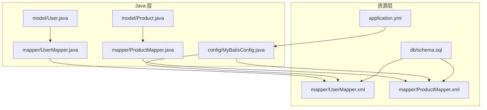
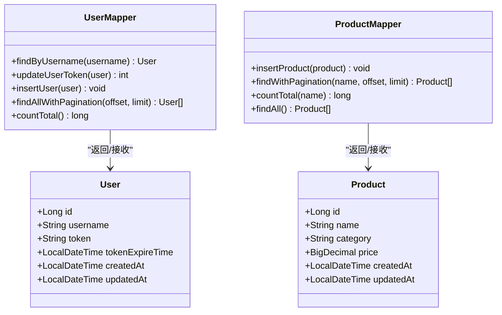
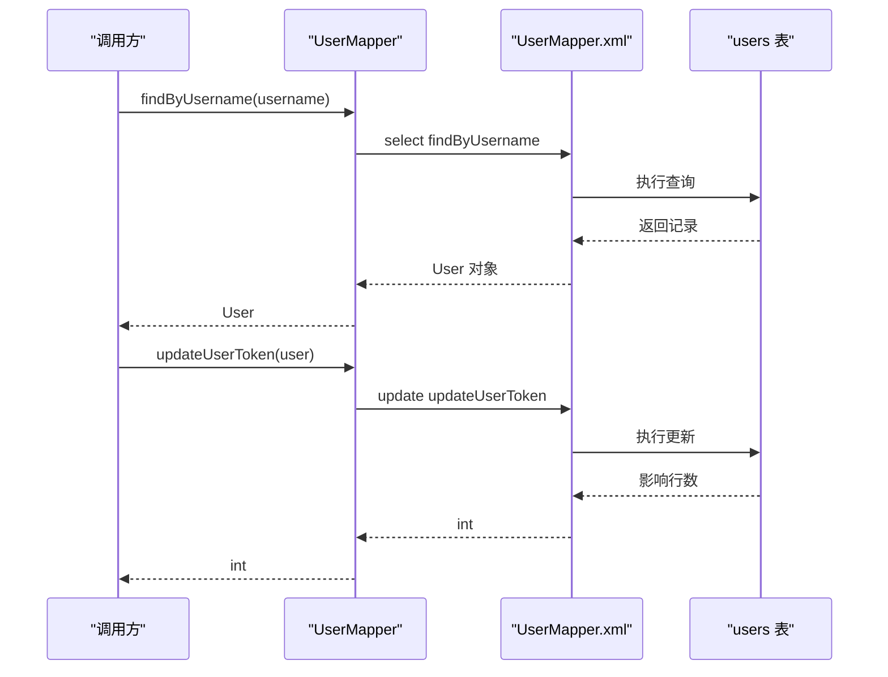
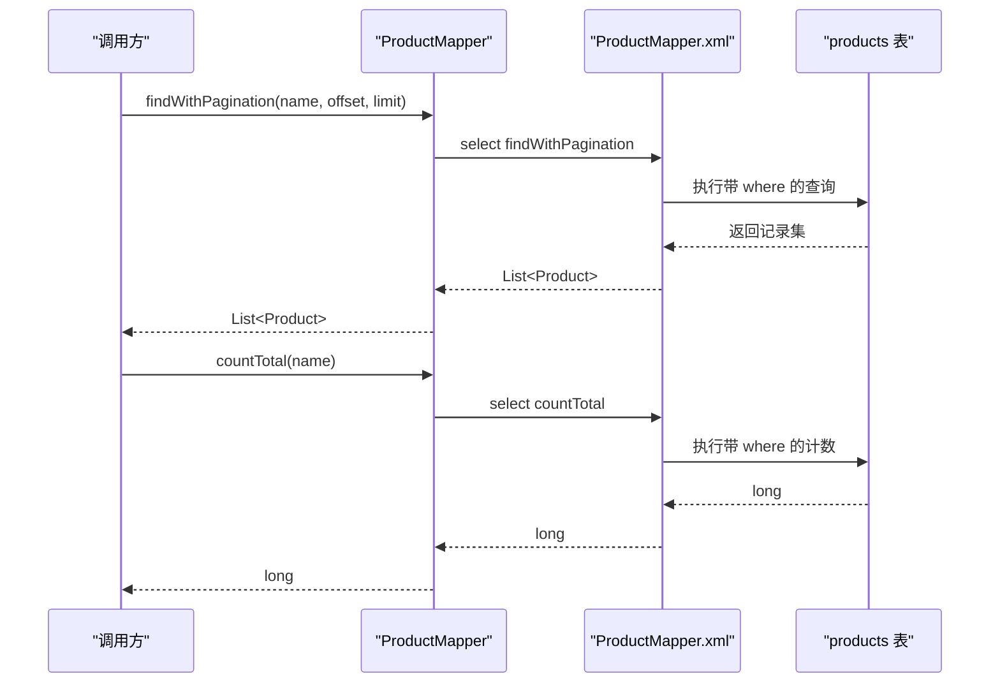
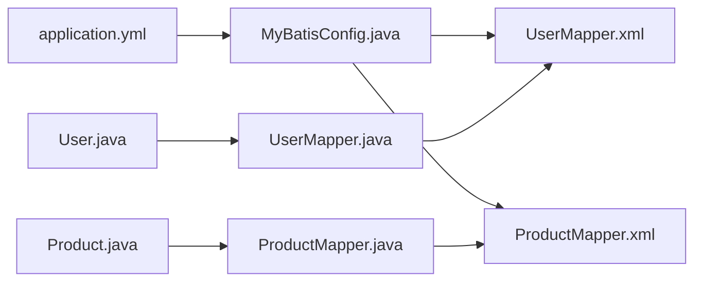
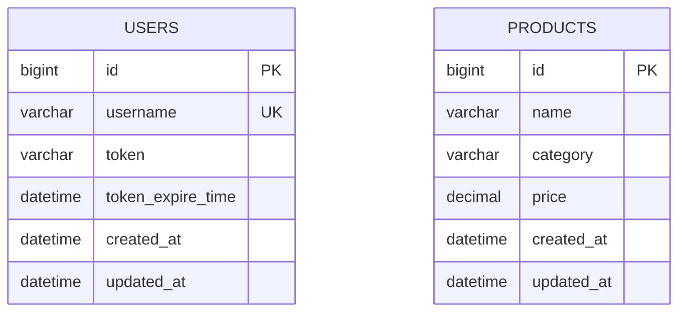

# 数据模型与数据库

<cite>
**本文引用的文件**
- [schema.sql](file://src/main/resources/db/schema.sql)
- [User.java](file://src/main/java/com/example/onlinestore/model/User.java)
- [Product.java](file://src/main/java/com/example/onlinestore/model/Product.java)
- [UserMapper.java](file://src/main/java/com/example/onlinestore/mapper/UserMapper.java)
- [ProductMapper.java](file://src/main/java/com/example/onlinestore/mapper/ProductMapper.java)
- [UserMapper.xml](file://src/main/resources/mapper/UserMapper.xml)
- [ProductMapper.xml](file://src/main/resources/mapper/ProductMapper.xml)
- [MyBatisConfig.java](file://src/main/java/com/example/onlinestore/config/MyBatisConfig.java)
- [application.yml](file://src/main/resources/application.yml)
</cite>

## 目录
1. [简介](#简介)
2. [项目结构](#项目结构)
3. [核心组件](#核心组件)
4. [架构总览](#架构总览)
5. [详细组件分析](#详细组件分析)
6. [依赖分析](#依赖分析)
7. [性能考虑](#性能考虑)
8. [故障排查指南](#故障排查指南)
9. [结论](#结论)
10. [附录](#附录)

## 简介
本文件聚焦于 online-store 项目的“数据模型与数据库”主题，围绕 User 和 Product 两大核心实体，系统梳理：
- 实体字段定义、数据类型、业务含义与约束条件
- 与数据库表结构的映射关系（基于 schema.sql）
- MyBatis 的 XML 映射文件如何实现 CRUD 操作（SQL、参数传递、结果映射）
- 驼峰命名与下划线转换配置（map-underscore-to-camel-case）
- 建议的 ER 图与索引优化思路

## 项目结构
online-store 采用典型的分层结构：model 层为实体类，mapper 接口与 XML 映射文件负责持久化，MyBatis 配置统一开启驼峰转换。

图表来源
- [User.java](file://src/main/java/com/example/onlinestore/model/User.java#L1-L60)
- [Product.java](file://src/main/java/com/example/onlinestore/model/Product.java#L1-L61)
- [UserMapper.java](file://src/main/java/com/example/onlinestore/mapper/UserMapper.java#L1-L23)
- [ProductMapper.java](file://src/main/java/com/example/onlinestore/mapper/ProductMapper.java#L1-L20)
- [UserMapper.xml](file://src/main/resources/mapper/UserMapper.xml#L1-L34)
- [ProductMapper.xml](file://src/main/resources/mapper/ProductMapper.xml#L1-L36)
- [schema.sql](file://src/main/resources/db/schema.sql#L1-L8)
- [MyBatisConfig.java](file://src/main/java/com/example/onlinestore/config/MyBatisConfig.java#L1-L27)
- [application.yml](file://src/main/resources/application.yml#L1-L48)

章节来源
- [schema.sql](file://src/main/resources/db/schema.sql#L1-L8)
- [User.java](file://src/main/java/com/example/onlinestore/model/User.java#L1-L60)
- [Product.java](file://src/main/java/com/example/onlinestore/model/Product.java#L1-L61)
- [UserMapper.java](file://src/main/java/com/example/onlinestore/mapper/UserMapper.java#L1-L23)
- [ProductMapper.java](file://src/main/java/com/example/onlinestore/mapper/ProductMapper.java#L1-L20)
- [UserMapper.xml](file://src/main/resources/mapper/UserMapper.xml#L1-L34)
- [ProductMapper.xml](file://src/main/resources/mapper/ProductMapper.xml#L1-L36)
- [MyBatisConfig.java](file://src/main/java/com/example/onlinestore/config/MyBatisConfig.java#L1-L27)
- [application.yml](file://src/main/resources/application.yml#L1-L48)

## 核心组件
本节从“实体类 -> 表结构 -> 映射文件”的视角，逐项说明 User 与 Product 的字段、类型、约束及映射关系。

- 用户表 users（来自 schema.sql）
  - id：BIGINT，主键，自增
  - username：VARCHAR(50)，非空，唯一
  - token：VARCHAR(100)，可空
  - token_expire_time：DATETIME，可空
  - created_at：DATETIME，默认当前时间
  - updated_at：DATETIME，默认当前时间，更新时自动刷新

- 商品表 products（来自 ProductMapper.xml 中的 INSERT 语句推断）
  - id：BIGINT，主键，自增
  - name：VARCHAR/TEXT，非空（INSERT 未显式声明 NOT NULL，但业务上通常非空）
  - category：VARCHAR/TEXT，分类
  - price：DECIMAL/NUMERIC，价格
  - created_at：DATETIME，默认当前时间
  - updated_at：DATETIME，默认当前时间，更新时自动刷新

- 实体类字段与表列的映射关系（基于驼峰命名转换）
  - users 表列与 User 类字段一一对应（下划线到驼峰自动转换）
  - products 表列与 Product 类字段一一对应（下划线到驼峰自动转换）

- 约束与默认值
  - users.username 唯一且非空
  - users.created_at、updated_at 默认值与自动更新策略
  - products 的非空约束由业务逻辑保证（INSERT 未显式声明 NOT NULL）

章节来源
- [schema.sql](file://src/main/resources/db/schema.sql#L1-L8)
- [User.java](file://src/main/java/com/example/onlinestore/model/User.java#L1-L60)
- [Product.java](file://src/main/java/com/example/onlinestore/model/Product.java#L1-L61)
- [application.yml](file://src/main/resources/application.yml#L35-L40)
- [MyBatisConfig.java](file://src/main/java/com/example/onlinestore/config/MyBatisConfig.java#L1-L27)

## 架构总览
下面以类图展示实体与映射接口的关系，以及 XML 映射文件与 SQL 的对应关系。

图表来源
- [User.java](file://src/main/java/com/example/onlinestore/model/User.java#L1-L60)
- [Product.java](file://src/main/java/com/example/onlinestore/model/Product.java#L1-L61)
- [UserMapper.java](file://src/main/java/com/example/onlinestore/mapper/UserMapper.java#L1-L23)
- [ProductMapper.java](file://src/main/java/com/example/onlinestore/mapper/ProductMapper.java#L1-L20)

## 详细组件分析

### User 实体与 users 表
- 字段与约束
  - id：主键，自增
  - username：非空且唯一
  - token/token_expire_time：用于登录态管理
  - created_at/updated_at：时间戳，默认值与自动更新

- 映射关系
  - 下划线字段名 users.id/users.username 等会通过驼峰转换映射到 User 的 id/username 等属性
  - UserMapper.xml 定义了查询、更新 token、插入、分页查询与计数等 SQL

- CRUD 映射要点
  - 查询：按用户名精确查询
  - 更新：按用户名更新 token 及过期时间
  - 插入：将 User 对象的各字段写入 users
  - 分页：按创建时间倒序，支持 offset/limit
  - 计数：统计用户总数

图表来源
- [UserMapper.java](file://src/main/java/com/example/onlinestore/mapper/UserMapper.java#L1-L23)
- [UserMapper.xml](file://src/main/resources/mapper/UserMapper.xml#L1-L34)
- [schema.sql](file://src/main/resources/db/schema.sql#L1-L8)

章节来源
- [User.java](file://src/main/java/com/example/onlinestore/model/User.java#L1-L60)
- [UserMapper.java](file://src/main/java/com/example/onlinestore/mapper/UserMapper.java#L1-L23)
- [UserMapper.xml](file://src/main/resources/mapper/UserMapper.xml#L1-L34)
- [schema.sql](file://src/main/resources/db/schema.sql#L1-L8)

### Product 实体与 products 表
- 字段与约束
  - id：主键，自增
  - name/category/price：商品名称、分类、价格
  - created_at/updated_at：时间戳，默认值与自动更新

- 映射关系
  - 下划线字段名 products.name/products.category 等会通过驼峰转换映射到 Product 的 name/category 等属性
  - ProductMapper.xml 定义了插入、分页查询（支持按名称模糊过滤）、全量查询与计数

- CRUD 映射要点
  - 插入：将 Product 对象写入 products
  - 分页查询：支持按名称模糊匹配，按创建时间倒序，支持 offset/limit
  - 全量查询：按创建时间倒序列出
  - 计数：在模糊条件下统计数量

图表来源
- [ProductMapper.java](file://src/main/java/com/example/onlinestore/mapper/ProductMapper.java#L1-L20)
- [ProductMapper.xml](file://src/main/resources/mapper/ProductMapper.xml#L1-L36)

章节来源
- [Product.java](file://src/main/java/com/example/onlinestore/model/Product.java#L1-L61)
- [ProductMapper.java](file://src/main/java/com/example/onlinestore/mapper/ProductMapper.java#L1-L20)
- [ProductMapper.xml](file://src/main/resources/mapper/ProductMapper.xml#L1-L36)

### 驼峰命名与下划线转换配置
- application.yml 中启用 map-underscore-to-camel-case: true
- MyBatisConfig.java 中也显式设置 setMapUnderscoreToCamelCase(true)
- 效果：users.username 自动映射到 User.username，products.name 自动映射到 Product.name

章节来源
- [application.yml](file://src/main/resources/application.yml#L35-L40)
- [MyBatisConfig.java](file://src/main/java/com/example/onlinestore/config/MyBatisConfig.java#L1-L27)

## 依赖分析
- 组件耦合
  - UserMapper 与 User、UserMapper.xml 强耦合；ProductMapper 与 Product、ProductMapper.xml 强耦合
  - MyBatisConfig 作为装配入口，统一开启驼峰转换并加载 XML 映射文件
- 外部依赖
  - 数据源配置来自 application.yml
  - XML 路径由 MyBatisConfig 与 application.yml 共同决定

图表来源
- [application.yml](file://src/main/resources/application.yml#L1-L48)
- [MyBatisConfig.java](file://src/main/java/com/example/onlinestore/config/MyBatisConfig.java#L1-L27)
- [UserMapper.java](file://src/main/java/com/example/onlinestore/mapper/UserMapper.java#L1-L23)
- [ProductMapper.java](file://src/main/java/com/example/onlinestore/mapper/ProductMapper.java#L1-L20)
- [UserMapper.xml](file://src/main/resources/mapper/UserMapper.xml#L1-L34)
- [ProductMapper.xml](file://src/main/resources/mapper/ProductMapper.xml#L1-L36)

章节来源
- [application.yml](file://src/main/resources/application.yml#L1-L48)
- [MyBatisConfig.java](file://src/main/java/com/example/onlinestore/config/MyBatisConfig.java#L1-L27)
- [UserMapper.java](file://src/main/java/com/example/onlinestore/mapper/UserMapper.java#L1-L23)
- [ProductMapper.java](file://src/main/java/com/example/onlinestore/mapper/ProductMapper.java#L1-L20)
- [UserMapper.xml](file://src/main/resources/mapper/UserMapper.xml#L1-L34)
- [ProductMapper.xml](file://src/main/resources/mapper/ProductMapper.xml#L1-L36)

## 性能考虑
- 索引建议
  - users.username：唯一索引（已由唯一约束保障）
  - products.name：若高频按名称检索或模糊匹配，建议建立索引
  - products.category：若按分类筛选频繁，建议建立索引
  - products.created_at：分页排序常用，建议保持索引以避免排序开销
- 分页与排序
  - 两表均按 created_at 倒序分页，确保排序字段有索引可显著降低排序成本
- 查询条件
  - Product 的模糊查询使用 LIKE CONCAT('%', ?, '%')，可能无法命中前缀索引，建议评估是否需要全文索引或更高效的检索方案（如搜索引擎）
- 写入路径
  - User 的 token 更新按用户名更新，建议确保 username 上存在索引（唯一索引已满足）

[本节为通用性能建议，不直接分析具体文件]

## 故障排查指南
- 字段映射异常
  - 症状：实体对象字段为空或类型不匹配
  - 排查：确认 application.yml 或 MyBatisConfig 是否开启 map-underscore-to-camel-case；检查 XML 中列名与实体属性是否一致
- SQL 参数绑定失败
  - 症状：传参报错或无影响行数
  - 排查：确认 XML 中参数占位符与实体属性名一致；确认 Mapper 方法参数注解与 XML id 对应
- 分页查询异常
  - 症状：分页结果为空或顺序异常
  - 排查：确认排序字段存在索引；确认 offset/limit 传参正确
- 计数与查询不一致
  - 症状：countTotal 与分页结果条数不一致
  - 排查：确认查询条件（如模糊匹配）是否一致；确认数据库事务隔离级别与并发写入情况

章节来源
- [application.yml](file://src/main/resources/application.yml#L35-L40)
- [MyBatisConfig.java](file://src/main/java/com/example/onlinestore/config/MyBatisConfig.java#L1-L27)
- [UserMapper.xml](file://src/main/resources/mapper/UserMapper.xml#L1-L34)
- [ProductMapper.xml](file://src/main/resources/mapper/ProductMapper.xml#L1-L36)

## 结论
- User 与 Product 实体与数据库表之间通过驼峰命名转换实现自然映射
- MyBatis 的 XML 映射文件清晰地实现了 CRUD：查询、更新、插入、分页与计数
- application.yml 与 MyBatisConfig 共同确保驼峰转换生效
- 建议针对高频查询字段增加索引，并对模糊查询进行性能评估

[本节为总结性内容，不直接分析具体文件]

## 附录

### ER 图建议

图表来源
- [schema.sql](file://src/main/resources/db/schema.sql#L1-L8)
- [ProductMapper.xml](file://src/main/resources/mapper/ProductMapper.xml#L1-L36)

### 字段对照与约束摘要
- users 表
  - id：主键，自增
  - username：非空，唯一
  - token/token_expire_time：可空
  - created_at/updated_at：默认当前时间，更新时自动刷新
- products 表
  - id：主键，自增
  - name/category/price：业务相关字段
  - created_at/updated_at：默认当前时间，更新时自动刷新

章节来源
- [schema.sql](file://src/main/resources/db/schema.sql#L1-L8)
- [ProductMapper.xml](file://src/main/resources/mapper/ProductMapper.xml#L1-L36)