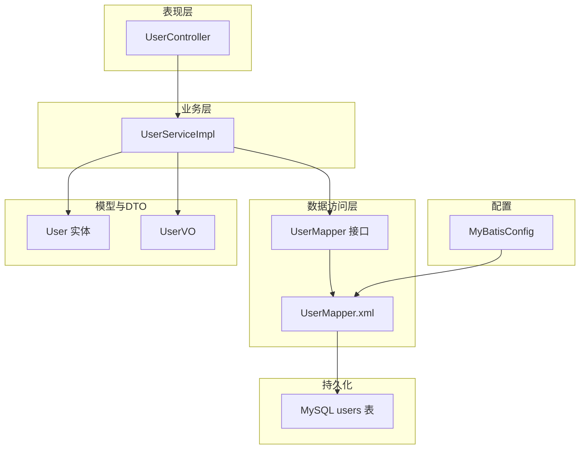
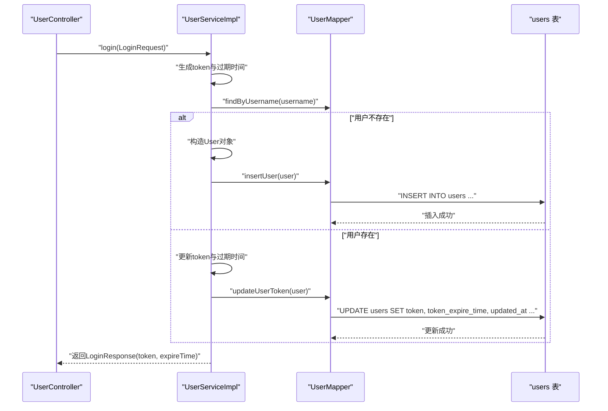
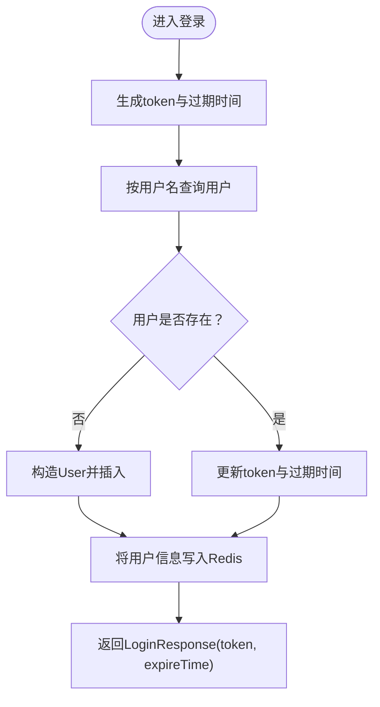
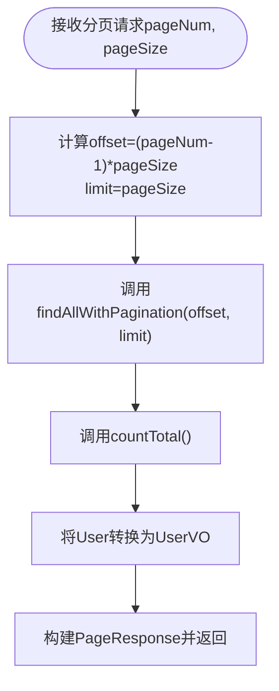
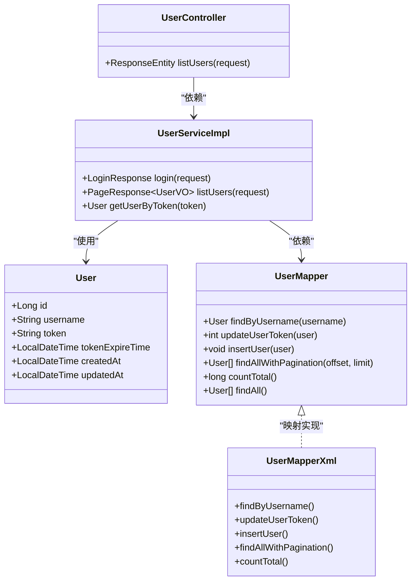
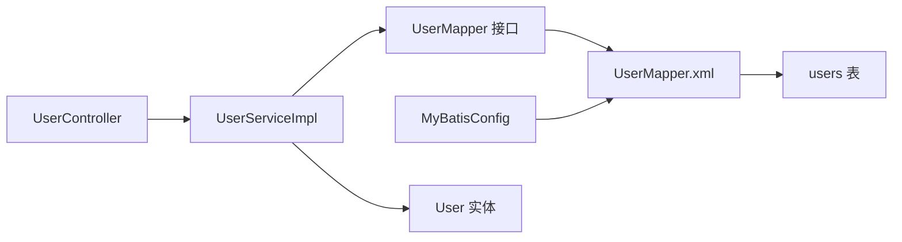
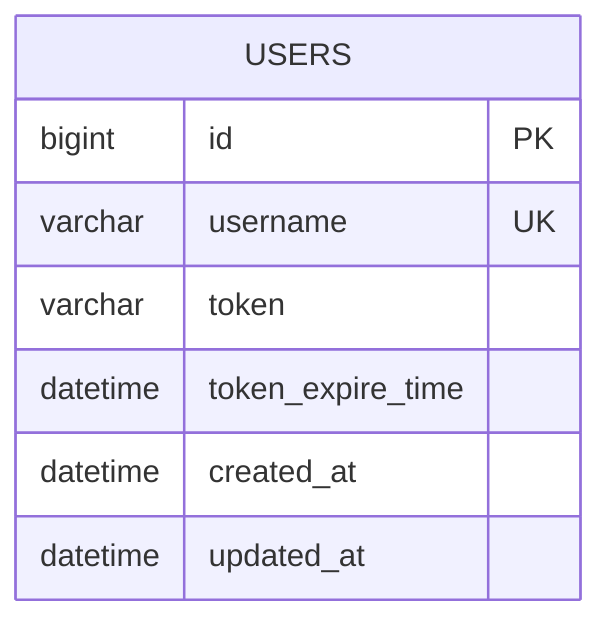

# 用户数据模型

<cite>
**本文引用的文件**
- [User.java](file://src/main/java/com/example/onlinestore/model/User.java)
- [schema.sql](file://src/main/resources/db/schema.sql)
- [UserMapper.xml](file://src/main/resources/mapper/UserMapper.xml)
- [UserMapper.java](file://src/main/java/com/example/onlinestore/mapper/UserMapper.java)
- [UserServiceImpl.java](file://src/main/java/com/example/onlinestore/service/impl/UserServiceImpl.java)
- [UserController.java](file://src/main/java/com/example/onlinestore/controller/UserController.java)
- [MyBatisConfig.java](file://src/main/java/com/example/onlinestore/config/MyBatisConfig.java)
- [UserVO.java](file://src/main/java/com/example/onlinestore/dto/UserVO.java)
</cite>

## 目录
1. [简介](#简介)
2. [项目结构](#项目结构)
3. [核心组件](#核心组件)
4. [架构总览](#架构总览)
5. [详细组件分析](#详细组件分析)
6. [依赖分析](#依赖分析)
7. [性能考虑](#性能考虑)
8. [故障排查指南](#故障排查指南)
9. [结论](#结论)
10. [附录](#附录)

## 简介
本文件围绕 online-store 项目的用户数据模型展开，系统性梳理 User 实体类的字段语义、与数据库 users 表的字段映射关系、MyBatis 的驼峰命名映射机制、以及 UserMapper.xml 中关键 SQL 操作的实现逻辑。同时给出索引优化建议与 ER 图设计建议，并说明该实体在认证、权限控制与用户管理中的核心作用。

## 项目结构
用户相关代码位于以下模块：
- 模型层：model/User.java 定义用户实体
- 数据访问层：mapper/UserMapper.java 接口 + resources/mapper/UserMapper.xml SQL 映射
- 服务层：service/impl/UserServiceImpl.java 实现登录、分页查询、基于 token 的用户读取
- 控制器层：controller/UserController.java 提供用户列表接口
- 配置层：config/MyBatisConfig.java 开启下划线到驼峰的自动映射
- DTO 层：dto/UserVO.java 用于对外分页返回

图表来源
- [UserController.java](file://src/main/java/com/example/onlinestore/controller/UserController.java#L1-L66)
- [UserServiceImpl.java](file://src/main/java/com/example/onlinestore/service/impl/UserServiceImpl.java#L1-L193)
- [UserMapper.java](file://src/main/java/com/example/onlinestore/mapper/UserMapper.java#L1-L23)
- [UserMapper.xml](file://src/main/resources/mapper/UserMapper.xml#L1-L34)
- [schema.sql](file://src/main/resources/db/schema.sql#L1-L8)
- [MyBatisConfig.java](file://src/main/java/com/example/onlinestore/config/MyBatisConfig.java#L1-L27)
- [User.java](file://src/main/java/com/example/onlinestore/model/User.java#L1-L60)
- [UserVO.java](file://src/main/java/com/example/onlinestore/dto/UserVO.java#L1-L42)

章节来源
- [User.java](file://src/main/java/com/example/onlinestore/model/User.java#L1-L60)
- [schema.sql](file://src/main/resources/db/schema.sql#L1-L8)
- [UserMapper.xml](file://src/main/resources/mapper/UserMapper.xml#L1-L34)
- [UserMapper.java](file://src/main/java/com/example/onlinestore/mapper/UserMapper.java#L1-L23)
- [UserServiceImpl.java](file://src/main/java/com/example/onlinestore/service/impl/UserServiceImpl.java#L1-L193)
- [UserController.java](file://src/main/java/com/example/onlinestore/controller/UserController.java#L1-L66)
- [MyBatisConfig.java](file://src/main/java/com/example/onlinestore/config/MyBatisConfig.java#L1-L27)
- [UserVO.java](file://src/main/java/com/example/onlinestore/dto/UserVO.java#L1-L42)

## 核心组件
- User 实体类：定义用户的核心属性与 getter/setter
- users 表结构：定义 id、username、token、token_expire_time、created_at、updated_at 的约束与默认值
- UserMapper 接口与映射：声明 findByUsername、updateUserToken、insertUser、findAllWithPagination、countTotal 等方法
- UserMapper.xml：实现上述 SQL，包含参数占位符与分页 LIMIT 动态片段
- MyBatisConfig：开启下划线到驼峰的自动映射，使数据库列 token_expire_time 自动映射到实体字段 tokenExpireTime
- UserServiceImpl：封装登录流程、分页查询与基于 token 的用户读取
- UserController：暴露用户列表接口，配合分页参数校验与权限注解

章节来源
- [User.java](file://src/main/java/com/example/onlinestore/model/User.java#L1-L60)
- [schema.sql](file://src/main/resources/db/schema.sql#L1-L8)
- [UserMapper.java](file://src/main/java/com/example/onlinestore/mapper/UserMapper.java#L1-L23)
- [UserMapper.xml](file://src/main/resources/mapper/UserMapper.xml#L1-L34)
- [MyBatisConfig.java](file://src/main/java/com/example/onlinestore/config/MyBatisConfig.java#L1-L27)
- [UserServiceImpl.java](file://src/main/java/com/example/onlinestore/service/impl/UserServiceImpl.java#L1-L193)
- [UserController.java](file://src/main/java/com/example/onlinestore/controller/UserController.java#L1-L66)

## 架构总览
下面以序列图展示“登录并写入用户信息”的关键流程，体现控制器、服务、数据访问与数据库之间的交互。

图表来源
- [UserController.java](file://src/main/java/com/example/onlinestore/controller/UserController.java#L1-L66)
- [UserServiceImpl.java](file://src/main/java/com/example/onlinestore/service/impl/UserServiceImpl.java#L67-L139)
- [UserMapper.java](file://src/main/java/com/example/onlinestore/mapper/UserMapper.java#L1-L23)
- [UserMapper.xml](file://src/main/resources/mapper/UserMapper.xml#L1-L34)
- [schema.sql](file://src/main/resources/db/schema.sql#L1-L8)

## 详细组件分析

### 字段与数据库映射关系
- id：Long 类型，对应 users.id，数据库为 BIGINT AUTO_INCREMENT PRIMARY KEY
- username：String，长度限制 50，数据库为 VARCHAR(50) NOT NULL UNIQUE
- token：String，最大长度 100，数据库为 VARCHAR(100)，允许为空
- tokenExpireTime：LocalDateTime，数据库列为 token_expire_time，允许为空
- createdAt：LocalDateTime，默认 CURRENT_TIMESTAMP，数据库列为 created_at
- updatedAt：LocalDateTime，默认 CURRENT_TIMESTAMP ON UPDATE CURRENT_TIMESTAMP，数据库列为 updated_at

字段映射依据：
- User 实体字段与 users 表列名通过 MyBatis 的下划线到驼峰映射自动匹配（例如 token_expire_time -> tokenExpireTime）
- UserMapper.xml 中显式 SELECT 列表确保映射完整

章节来源
- [User.java](file://src/main/java/com/example/onlinestore/model/User.java#L1-L60)
- [schema.sql](file://src/main/resources/db/schema.sql#L1-L8)
- [UserMapper.xml](file://src/main/resources/mapper/UserMapper.xml#L1-L34)
- [MyBatisConfig.java](file://src/main/java/com/example/onlinestore/config/MyBatisConfig.java#L1-L27)

### MyBatis 驼峰命名映射原理
- 在 MyBatisConfig 中启用 setMapUnderscoreToCamelCase(true)，使得数据库列名如 token_expire_time 自动映射到 Java 字段 tokenExpireTime
- UserMapper.xml 中的 SQL 使用下划线命名的列名，但 MyBatis 会自动转换为驼峰字段，无需额外 resultMap

章节来源
- [MyBatisConfig.java](file://src/main/java/com/example/onlinestore/config/MyBatisConfig.java#L1-L27)
- [UserMapper.xml](file://src/main/resources/mapper/UserMapper.xml#L1-L34)

### SQL 操作详解

#### findByUsername
- 作用：按用户名精确查询单个用户
- 参数：#{username}
- 结果映射：SELECT 指定列，MyBatis 基于下划线到驼峰映射填充 User 对象
- 使用场景：登录后查找用户是否存在，或构建用户信息

章节来源
- [UserMapper.java](file://src/main/java/com/example/onlinestore/mapper/UserMapper.java#L12-L12)
- [UserMapper.xml](file://src/main/resources/mapper/UserMapper.xml#L5-L9)

#### updateUserToken
- 作用：更新用户的 token、tokenExpireTime 与 updatedAt
- 参数：#{token}、#{tokenExpireTime}、#{updatedAt}、#{username}
- 使用场景：用户每次登录后刷新 token 与其过期时间

章节来源
- [UserMapper.java](file://src/main/java/com/example/onlinestore/mapper/UserMapper.java#L14-L14)
- [UserMapper.xml](file://src/main/resources/mapper/UserMapper.xml#L11-L17)

#### insertUser
- 作用：插入新用户
- 参数：#{username}、#{token}、#{tokenExpireTime}、#{createdAt}、#{updatedAt}
- 使用场景：首次登录创建用户记录

章节来源
- [UserMapper.java](file://src/main/java/com/example/onlinestore/mapper/UserMapper.java#L16-L16)
- [UserMapper.xml](file://src/main/resources/mapper/UserMapper.xml#L19-L22)

#### findAllWithPagination
- 作用：分页查询用户列表，按创建时间倒序
- 参数：#{offset}、#{limit}
- 使用场景：用户列表分页展示
- 注意：LIMIT 使用逗号分隔的两个参数，由 UserServiceImpl 计算 offset 与 limit

章节来源
- [UserMapper.java](file://src/main/java/com/example/onlinestore/mapper/UserMapper.java#L18-L18)
- [UserMapper.xml](file://src/main/resources/mapper/UserMapper.xml#L24-L29)
- [UserServiceImpl.java](file://src/main/java/com/example/onlinestore/service/impl/UserServiceImpl.java#L153-L176)

#### countTotal
- 作用：统计用户总数
- 返回：long
- 使用场景：分页响应的 total 字段

章节来源
- [UserMapper.java](file://src/main/java/com/example/onlinestore/mapper/UserMapper.java#L20-L20)
- [UserMapper.xml](file://src/main/resources/mapper/UserMapper.xml#L31-L33)

### 登录流程与分页流程

#### 登录流程（含 token 写入）

图表来源
- [UserServiceImpl.java](file://src/main/java/com/example/onlinestore/service/impl/UserServiceImpl.java#L67-L139)
- [UserMapper.xml](file://src/main/resources/mapper/UserMapper.xml#L5-L22)

#### 分页查询流程

图表来源
- [UserServiceImpl.java](file://src/main/java/com/example/onlinestore/service/impl/UserServiceImpl.java#L153-L176)
- [UserMapper.xml](file://src/main/resources/mapper/UserMapper.xml#L24-L33)
- [UserVO.java](file://src/main/java/com/example/onlinestore/dto/UserVO.java#L1-L42)

### 类关系图（模型与映射）

图表来源
- [User.java](file://src/main/java/com/example/onlinestore/model/User.java#L1-L60)
- [UserMapper.java](file://src/main/java/com/example/onlinestore/mapper/UserMapper.java#L1-L23)
- [UserMapper.xml](file://src/main/resources/mapper/UserMapper.xml#L1-L34)
- [UserServiceImpl.java](file://src/main/java/com/example/onlinestore/service/impl/UserServiceImpl.java#L1-L193)
- [UserController.java](file://src/main/java/com/example/onlinestore/controller/UserController.java#L1-L66)

## 依赖分析
- 控制器依赖服务层；服务层依赖数据访问层接口；数据访问层通过 XML 映射执行 SQL；MyBatis 配置开启下划线到驼峰映射
- User 实体与 users 表之间通过列名映射关联，无需额外 resultMap
- 分页依赖 offset 与 limit 两个参数，由服务层计算并传入

图表来源
- [UserController.java](file://src/main/java/com/example/onlinestore/controller/UserController.java#L1-L66)
- [UserServiceImpl.java](file://src/main/java/com/example/onlinestore/service/impl/UserServiceImpl.java#L1-L193)
- [UserMapper.java](file://src/main/java/com/example/onlinestore/mapper/UserMapper.java#L1-L23)
- [UserMapper.xml](file://src/main/resources/mapper/UserMapper.xml#L1-L34)
- [schema.sql](file://src/main/resources/db/schema.sql#L1-L8)
- [MyBatisConfig.java](file://src/main/java/com/example/onlinestore/config/MyBatisConfig.java#L1-L27)

章节来源
- [UserServiceImpl.java](file://src/main/java/com/example/onlinestore/service/impl/UserServiceImpl.java#L1-L193)
- [UserMapper.xml](file://src/main/resources/mapper/UserMapper.xml#L1-L34)
- [MyBatisConfig.java](file://src/main/java/com/example/onlinestore/config/MyBatisConfig.java#L1-L27)

## 性能考虑
- 分页查询使用 LIMIT offset, limit，建议在 created_at 上建立索引以优化 ORDER BY created_at DESC 的排序与分页扫描
- username 唯一索引已由数据库约束保证，可直接用于高频等值查询
- 大量写入 token 与过期时间时，建议对 token_expire_time 建立索引以支持过期清理任务
- 缓存层（Redis）与数据库双写，注意一致性与过期时间同步

[本节为通用性能建议，不直接分析具体文件]

## 故障排查指南
- 字段映射异常：确认 MyBatis 已开启下划线到驼峰映射；核对 UserMapper.xml 中 SELECT 列是否覆盖所有字段
- 分页结果异常：检查 UserServiceImpl 是否正确计算 offset 与 limit；确认 UserMapper.xml 的 LIMIT 语法
- 登录未写入：检查 UserServiceImpl 的 insertUser 与 updateUserToken 调用路径；核对数据库约束与默认值
- 控制器返回异常：查看 UserController 的异常分支与日志输出，定位上游服务异常

章节来源
- [MyBatisConfig.java](file://src/main/java/com/example/onlinestore/config/MyBatisConfig.java#L1-L27)
- [UserMapper.xml](file://src/main/resources/mapper/UserMapper.xml#L1-L34)
- [UserServiceImpl.java](file://src/main/java/com/example/onlinestore/service/impl/UserServiceImpl.java#L1-L193)
- [UserController.java](file://src/main/java/com/example/onlinestore/controller/UserController.java#L1-L66)

## 结论
User 实体与 users 表通过 MyBatis 的下划线到驼峰映射实现无缝对接，UserMapper.xml 提供了完整的用户 CRUD 与分页能力。登录流程将 token 与过期时间持久化并写入缓存，形成认证与权限控制的基础。建议在 created_at 与 token_expire_time 上建立索引以提升查询与清理效率。

[本节为总结性内容，不直接分析具体文件]

## 附录

### 索引优化建议
- 在 username 上保持唯一索引（数据库已约束）
- 在 created_at 上建立索引，优化分页与排序
- 在 token_expire_time 上建立索引，便于定时清理过期 token

### ER 图设计建议

图表来源
- [schema.sql](file://src/main/resources/db/schema.sql#L1-L8)