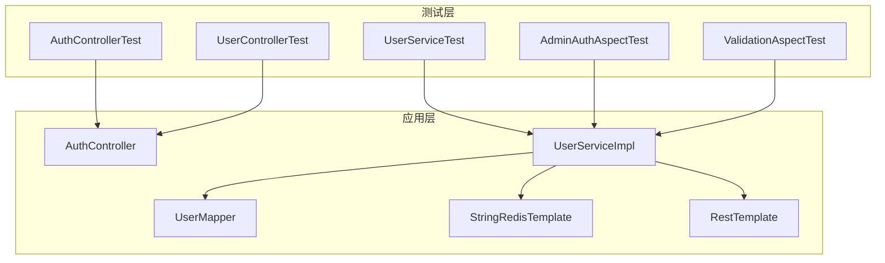
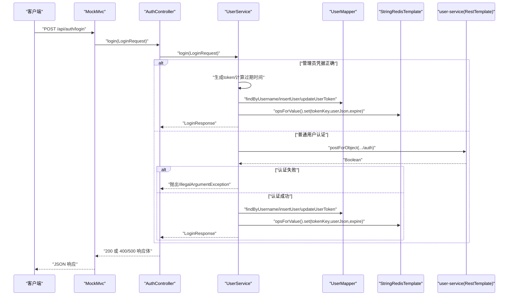
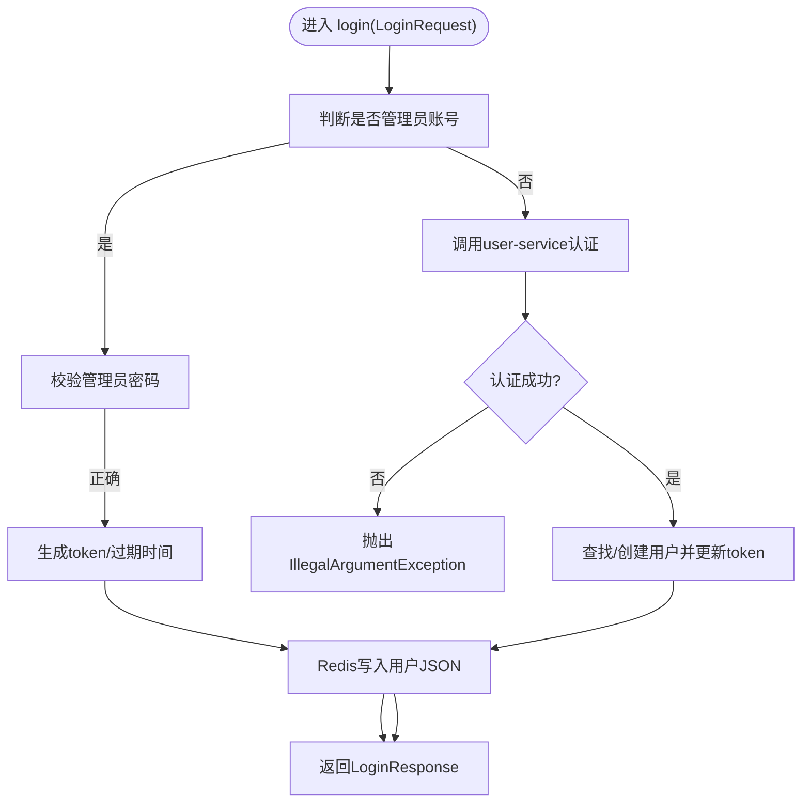
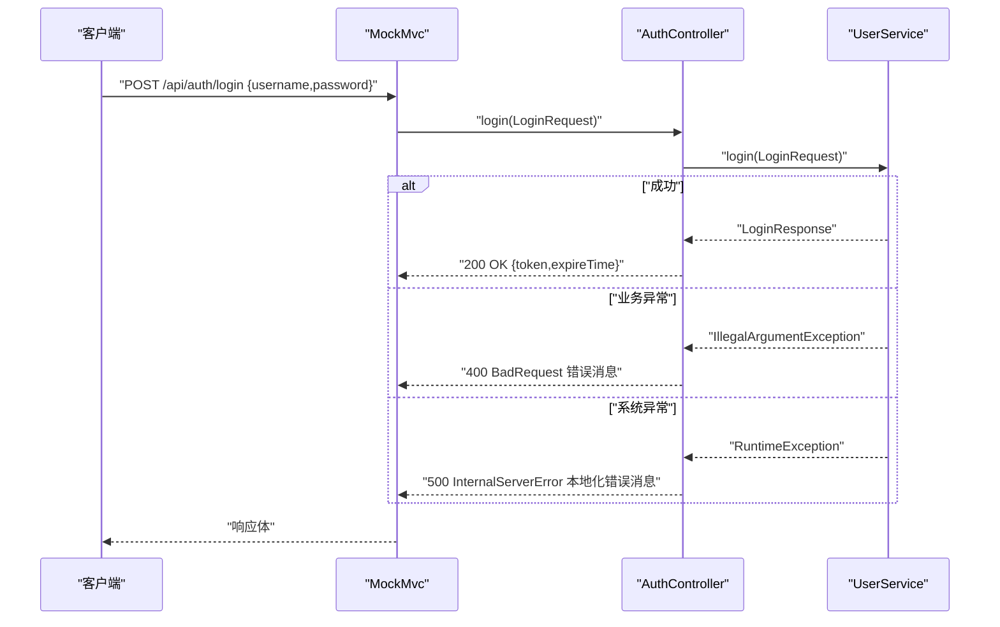
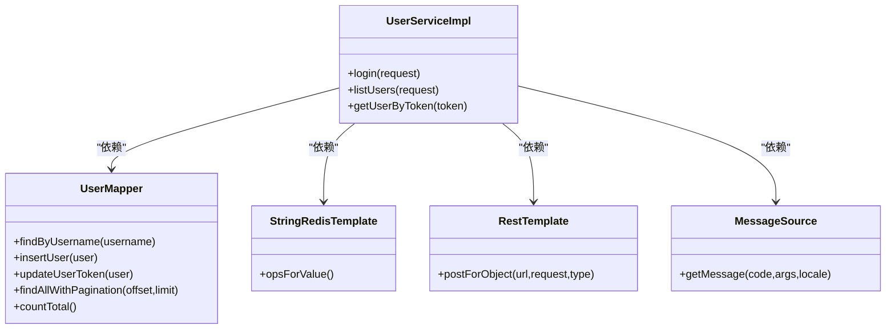

# 测试策略

<cite>
**本文引用的文件**
- [pom.xml](file://pom.xml)
- [application.yml](file://src/main/resources/application.yml)
- [application-local.yml](file://src/main/resources/application-local.yml)
- [UserServiceTest.java](file://src/test/java/com/example/onlinestore/service/UserServiceTest.java)
- [AuthControllerTest.java](file://src/test/java/com/example/onlinestore/controller/AuthControllerTest.java)
- [UserControllerTest.java](file://src/test/java/com/example/onlinestore/controller/UserControllerTest.java)
- [AdminAuthAspectTest.java](file://src/test/java/com/example/onlinestore/aspect/AdminAuthAspectTest.java)
- [ValidationAspectTest.java](file://src/test/java/com/example/onlinestore/aspect/ValidationAspectTest.java)
- [UserServiceImpl.java](file://src/main/java/com/example/onlinestore/service/impl/UserServiceImpl.java)
- [AuthController.java](file://src/main/java/com/example/onlinestore/controller/AuthController.java)
</cite>

## 目录
1. [引言](#引言)
2. [项目结构与测试组织](#项目结构与测试组织)
3. [核心组件与测试覆盖](#核心组件与测试覆盖)
4. [架构总览与测试边界](#架构总览与测试边界)
5. [详细组件测试分析](#详细组件测试分析)
6. [依赖关系与耦合度分析](#依赖关系与耦合度分析)
7. [性能与稳定性考量](#性能与稳定性考量)
8. [故障排查指南](#故障排查指南)
9. [结论与最佳实践建议](#结论与最佳实践建议)
10. [附录：测试覆盖率与指标](#附录测试覆盖率与指标)

## 引言
本测试策略文档面向 online-store 项目，聚焦于单元测试与集成测试的最佳实践。通过对现有 JUnit 5 与 Mockito 测试用例（如 UserServiceTest）的深入分析，说明如何通过 @Mock 与 @InjectMocks 对 RestTemplate、UserMapper、RedisTemplate 等外部依赖进行隔离测试；同时给出 API 层测试（基于 MockMvc）的示例，并建议引入 Testcontainers 进行真实数据库与 Redis 的集成测试，以验证核心业务逻辑（登录流程、权限检查）在端到端场景下的正确性与鲁棒性。

## 项目结构与测试组织
- 单元测试集中在 src/test/java 下，按功能模块划分：
  - service 包含 UserServiceTest
  - controller 包含 AuthControllerTest、UserControllerTest
  - aspect 包含 AdminAuthAspectTest、ValidationAspectTest
- 测试运行依赖 Spring Boot Starter Test 提供的自动配置与 MockMvc 支持。
- 应用配置位于 src/main/resources，包含数据库、Redis、Nacos、MyBatis 等配置，本地开发默认 profile 为 local。

图表来源
- [UserServiceTest.java](file://src/test/java/com/example/onlinestore/service/UserServiceTest.java#L1-L252)
- [AuthControllerTest.java](file://src/test/java/com/example/onlinestore/controller/AuthControllerTest.java#L1-L147)
- [UserControllerTest.java](file://src/test/java/com/example/onlinestore/controller/UserControllerTest.java#L1-L128)
- [AdminAuthAspectTest.java](file://src/test/java/com/example/onlinestore/aspect/AdminAuthAspectTest.java#L1-L106)
- [ValidationAspectTest.java](file://src/test/java/com/example/onlinestore/aspect/ValidationAspectTest.java#L1-L167)
- [UserServiceImpl.java](file://src/main/java/com/example/onlinestore/service/impl/UserServiceImpl.java#L1-L193)
- [AuthController.java](file://src/main/java/com/example/onlinestore/controller/AuthController.java#L1-L45)

章节来源
- [pom.xml](file://pom.xml#L138-L148)
- [application.yml](file://src/main/resources/application.yml#L1-L48)
- [application-local.yml](file://src/main/resources/application-local.yml#L1-L33)

## 核心组件与测试覆盖
- 登录流程（UserService.login）：覆盖管理员快速登录、普通用户远程认证、令牌生成与缓存、异常分支（凭据错误、系统异常）。
- 控制器层（AuthController.login）：覆盖成功响应、业务异常（400）、系统异常（500）与多语言错误消息。
- 参数校验与权限拦截：通过 ValidationAspect 与 AdminAuthAspect 的切面测试，验证参数合法性与管理员权限控制。
- 用户列表查询：控制器层对分页参数的边界条件与数据库异常的处理。

章节来源
- [UserServiceImpl.java](file://src/main/java/com/example/onlinestore/service/impl/UserServiceImpl.java#L68-L139)
- [AuthController.java](file://src/main/java/com/example/onlinestore/controller/AuthController.java#L29-L45)
- [UserServiceTest.java](file://src/test/java/com/example/onlinestore/service/UserServiceTest.java#L61-L252)
- [AuthControllerTest.java](file://src/test/java/com/example/onlinestore/controller/AuthControllerTest.java#L63-L147)
- [UserControllerTest.java](file://src/test/java/com/example/onlinestore/controller/UserControllerTest.java#L67-L128)
- [ValidationAspectTest.java](file://src/test/java/com/example/onlinestore/aspect/ValidationAspectTest.java#L56-L167)
- [AdminAuthAspectTest.java](file://src/test/java/com/example/onlinestore/aspect/AdminAuthAspectTest.java#L53-L105)

## 架构总览与测试边界
- 单元测试边界：通过 @Mock/@MockBean 隔离外部依赖，确保测试仅关注业务逻辑与断言。
- 集成测试边界：通过 Testcontainers 启动真实数据库与 Redis，验证持久化与缓存交互。
- API 测试边界：使用 MockMvc 模拟 HTTP 请求，验证控制器层的输入输出与状态码。

图表来源
- [AuthControllerTest.java](file://src/test/java/com/example/onlinestore/controller/AuthControllerTest.java#L63-L147)
- [AuthController.java](file://src/main/java/com/example/onlinestore/controller/AuthController.java#L29-L45)
- [UserServiceTest.java](file://src/test/java/com/example/onlinestore/service/UserServiceTest.java#L61-L252)
- [UserServiceImpl.java](file://src/main/java/com/example/onlinestore/service/impl/UserServiceImpl.java#L68-L139)

## 详细组件测试分析

### 服务层登录流程测试（UserServiceTest）
- 使用 @Mock 注入 RestTemplate、UserMapper、StringRedisTemplate、ValueOperations、MessageSource，使用 @InjectMocks 创建 UserServiceImpl 实例。
- 关键测试场景：
  - 管理员首次登录：期望创建用户并写入 Redis 缓存，且不调用远程认证。
  - 管理员重复登录：期望更新 token 并写入 Redis 缓存。
  - 普通用户首次登录：期望调用 user-service 认证成功后创建用户并写入 Redis。
  - 普通用户重复登录：期望调用 user-service 认证成功后更新 token 并写入 Redis。
  - 凭据错误：管理员密码错误与普通用户认证失败均抛出业务异常，不写入 Redis。
- 断言要点：
  - LoginResponse 字段完整性（token、expireTime）。
  - 对 UserMapper 的调用次数与参数匹配（findByUsername、insertUser、updateUserToken）。
  - 对 Redis 的 set 操作与过期时间参数。
  - 对 RestTemplate 的调用路径与条件匹配。

图表来源
- [UserServiceImpl.java](file://src/main/java/com/example/onlinestore/service/impl/UserServiceImpl.java#L68-L139)
- [UserServiceTest.java](file://src/test/java/com/example/onlinestore/service/UserServiceTest.java#L61-L252)

章节来源
- [UserServiceTest.java](file://src/test/java/com/example/onlinestore/service/UserServiceTest.java#L61-L252)
- [UserServiceImpl.java](file://src/main/java/com/example/onlinestore/service/impl/UserServiceImpl.java#L68-L139)

### 控制器层登录接口测试（AuthControllerTest）
- 使用 @AutoConfigureMockMvc 与 @SpringBootTest 启动 Web 环境，使用 @MockBean 注入 UserService。
- 关键测试场景：
  - 成功登录：返回 200 与 JSON 响应，包含 token 与 expireTime。
  - 业务异常（凭据错误）：根据 Accept-Language 返回对应语言的错误消息，状态码 400。
  - 系统异常：捕获 RuntimeException，返回 500 与本地化的系统错误消息。
- 断言要点：
  - 状态码与 JSONPath 断言。
  - 错误消息内容与语言环境匹配。

图表来源
- [AuthControllerTest.java](file://src/test/java/com/example/onlinestore/controller/AuthControllerTest.java#L63-L147)
- [AuthController.java](file://src/main/java/com/example/onlinestore/controller/AuthController.java#L29-L45)

章节来源
- [AuthControllerTest.java](file://src/test/java/com/example/onlinestore/controller/AuthControllerTest.java#L63-L147)
- [AuthController.java](file://src/main/java/com/example/onlinestore/controller/AuthController.java#L29-L45)

### 用户列表接口测试（UserControllerTest）
- 使用 @AutoConfigureMockMvc 与 @SpringBootTest，@MockBean 注入 UserService。
- 关键测试场景：
  - 正常分页查询：返回 200，断言 records 数量、字段与分页信息。
  - 页大小超限：返回 400。
  - 页码非法：返回 400。
  - 数据库异常：返回 500 与本地化错误消息。
- 断言要点：状态码、JSONPath 与错误消息。

章节来源
- [UserControllerTest.java](file://src/test/java/com/example/onlinestore/controller/UserControllerTest.java#L67-L128)

### 切面测试：参数验证与管理员权限
- 参数验证切面（ValidationAspectTest）：
  - 验证通过：继续执行目标方法。
  - 验证失败：返回 400 与本地化错误消息。
  - 参数为空：跳过验证直接放行。
  - 多个验证错误：聚合错误消息。
  - 目标方法抛出异常：切面不捕获，直接上抛。
- 管理员权限切面（AdminAuthAspectTest）：
  - 管理员用户允许访问。
  - 非管理员与未登录用户抛出业务异常并返回本地化错误消息。

章节来源
- [ValidationAspectTest.java](file://src/test/java/com/example/onlinestore/aspect/ValidationAspectTest.java#L56-L167)
- [AdminAuthAspectTest.java](file://src/test/java/com/example/onlinestore/aspect/AdminAuthAspectTest.java#L53-L105)

## 依赖关系与耦合度分析
- 服务层依赖：
  - RestTemplate：用于调用 user-service 的认证接口。
  - UserMapper：负责用户数据的读写。
  - StringRedisTemplate：负责用户信息的缓存。
  - MessageSource：负责国际化错误消息。
- 控制器层依赖：
  - UserService：封装业务逻辑。
  - MessageSource：负责国际化错误消息。
- 测试中的隔离策略：
  - 使用 @Mock/@MockBean 对外部依赖进行替换，避免真实网络与数据库访问。
  - 使用 @InjectMocks/@Mock 注入依赖，确保被测类实例化完整。
- 可能的耦合点：
  - 服务层与 Redis 的序列化/反序列化依赖 Jackson。
  - 控制器层与国际化消息源的耦合，需通过 MessageSource 进行断言。

图表来源
- [UserServiceImpl.java](file://src/main/java/com/example/onlinestore/service/impl/UserServiceImpl.java#L1-L193)
- [UserServiceTest.java](file://src/test/java/com/example/onlinestore/service/UserServiceTest.java#L1-L252)

章节来源
- [UserServiceImpl.java](file://src/main/java/com/example/onlinestore/service/impl/UserServiceImpl.java#L1-L193)
- [UserServiceTest.java](file://src/test/java/com/example/onlinestore/service/UserServiceTest.java#L1-L252)

## 性能与稳定性考量
- 单元测试性能：
  - 通过 @Mock/@MockBean 避免真实网络与数据库 IO，提升测试执行速度。
  - 对 Redis 的操作通过 ValueOperations 进行模拟，避免真实连接。
- 集成测试建议：
  - 引入 Testcontainers 启动 MySQL 与 Redis 容器，验证真实连接池、序列化与缓存策略。
  - 在 CI 中对关键路径（登录、分页查询、权限拦截）执行集成测试，确保跨组件协作稳定。
- 覆盖率建议：
  - 重点覆盖登录流程的异常分支、参数校验切面的多错误聚合、控制器层的多语言错误处理。
  - 对 UserService 的事务边界、Redis 缓存失败降级路径进行验证。

[本节为通用指导，无需列出具体文件来源]

## 故障排查指南
- 登录失败但未写入 Redis：
  - 检查 RedisTemplate.opsForValue() 是否被正确注入与调用。
  - 核对 tokenKey 前缀与过期时间参数。
- 远程认证失败：
  - 确认 user-service 地址与认证路径配置正确。
  - 检查 RestTemplate 的 postForObject 返回值与空指针处理。
- 控制器返回 500：
  - 确认 MessageSource 的本地化键是否存在，避免默认回退导致消息不一致。
- 参数校验失败：
  - 检查 ValidationAspect 的 validator 注入与约束消息映射。
- 权限拦截异常：
  - 确认 AdminAuthAspect 的 adminUsername 配置与 UserContext 当前用户设置。

章节来源
- [UserServiceImpl.java](file://src/main/java/com/example/onlinestore/service/impl/UserServiceImpl.java#L68-L139)
- [UserServiceTest.java](file://src/test/java/com/example/onlinestore/service/UserServiceTest.java#L61-L252)
- [AuthControllerTest.java](file://src/test/java/com/example/onlinestore/controller/AuthControllerTest.java#L63-L147)
- [ValidationAspectTest.java](file://src/test/java/com/example/onlinestore/aspect/ValidationAspectTest.java#L56-L167)
- [AdminAuthAspectTest.java](file://src/test/java/com/example/onlinestore/aspect/AdminAuthAspectTest.java#L53-L105)

## 结论与最佳实践建议
- 单元测试优先：使用 @Mock/@InjectMocks 隔离外部依赖，确保测试可重复、可维护。
- API 测试完备：结合 MockMvc 验证控制器层的输入输出、状态码与国际化错误消息。
- 切面测试独立：针对参数验证与权限拦截分别编写切面测试，覆盖正常与异常路径。
- 集成测试补位：引入 Testcontainers 验证数据库与 Redis 的真实交互，确保端到端稳定性。
- 覆盖率与质量：以登录流程、参数校验、权限拦截为核心，逐步扩展到其他关键路径。

[本节为总结性内容，无需列出具体文件来源]

## 附录：测试覆盖率与指标
- 关键指标建议：
  - 语句覆盖率：核心业务逻辑（登录、分页、权限）达到高覆盖率。
  - 分支覆盖率：异常分支（凭据错误、系统异常、参数非法、权限不足）全覆盖。
  - 方法覆盖率：UserService、AuthController、切面方法均覆盖。
  - 行为覆盖率：对外部依赖的调用次数与参数匹配断言。
- 工具建议：
  - 使用 Maven 插件或 IDE 报告生成覆盖率报告，定期审查。
  - 在 CI 中设置覆盖率阈值，阻断低质量合并。

[本节为通用指导，无需列出具体文件来源]