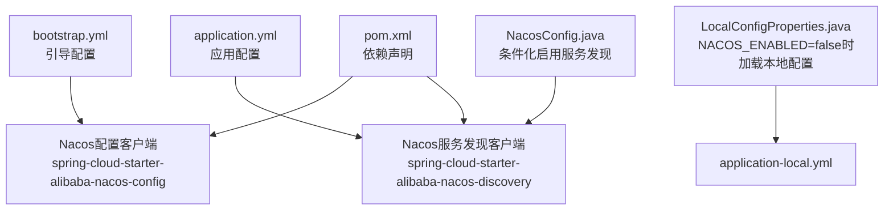
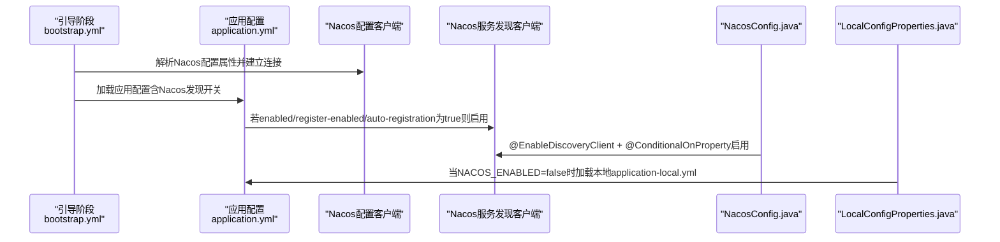
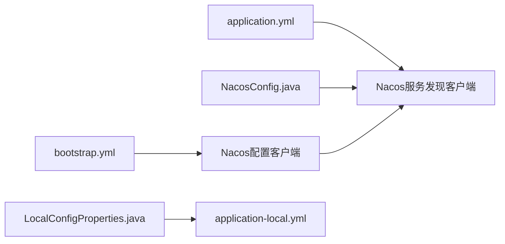
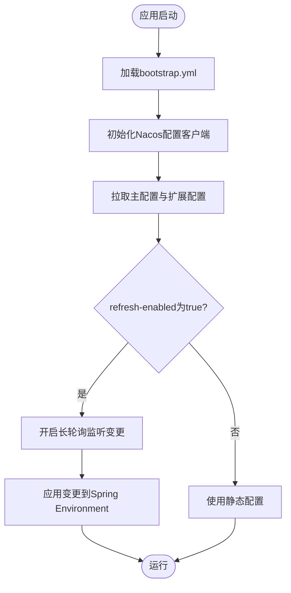

# Nacos配置集成

<cite>
**本文引用的文件**
- [bootstrap.yml](file://src/main/resources/bootstrap.yml)
- [application.yml](file://src/main/resources/application.yml)
- [NacosConfig.java](file://src/main/java/com/example/onlinestore/config/NacosConfig.java)
- [LocalConfigProperties.java](file://src/main/java/com/example/onlinestore/config/LocalConfigProperties.java)
- [application-local.yml](file://src/main/resources/application-local.yml)
- [pom.xml](file://pom.xml)
</cite>

## 目录
1. [简介](#简介)
2. [项目结构](#项目结构)
3. [核心组件](#核心组件)
4. [架构总览](#架构总览)
5. [详细组件分析](#详细组件分析)
6. [依赖关系分析](#依赖关系分析)
7. [性能与可用性考虑](#性能与可用性考虑)
8. [故障排查指南](#故障排查指南)
9. [结论](#结论)
10. [附录](#附录)

## 简介
本文件面向online-store项目的Nacos配置中心集成，系统性阐述以下主题：
- bootstrap.yml作为Spring Cloud引导配置文件，如何优先加载并启用Nacos配置与服务发现能力，以及通过${NACOS_ENABLED:false}实现默认关闭的控制方式。
- NacosConfig类上的@ConditionalOnProperty注解如何依据spring.cloud.nacos.enabled属性决定是否启用Nacos服务注册与发现。
- Nacos配置优先级与动态刷新（refresh-enabled）机制的工作原理，并结合extension-configs的多配置文件加载策略进行说明。
- 在生产环境中如何通过Nacos集中管理application.yml中的数据源、Redis、业务参数等配置项，实现配置的动态化与环境隔离。

## 项目结构
online-store项目采用标准Spring Boot工程结构，关键配置文件位于resources目录下，核心Java配置位于config包内。Nacos相关配置主要集中在bootstrap.yml与application.yml中，配合条件化配置类实现按需启用。

图表来源
- [bootstrap.yml](file://src/main/resources/bootstrap.yml#L1-L17)
- [application.yml](file://src/main/resources/application.yml#L1-L48)
- [NacosConfig.java](file://src/main/java/com/example/onlinestore/config/NacosConfig.java#L1-L29)
- [LocalConfigProperties.java](file://src/main/java/com/example/onlinestore/config/LocalConfigProperties.java#L1-L12)
- [application-local.yml](file://src/main/resources/application-local.yml#L1-L33)
- [pom.xml](file://pom.xml#L85-L122)

章节来源
- [bootstrap.yml](file://src/main/resources/bootstrap.yml#L1-L17)
- [application.yml](file://src/main/resources/application.yml#L1-L48)
- [NacosConfig.java](file://src/main/java/com/example/onlinestore/config/NacosConfig.java#L1-L29)
- [LocalConfigProperties.java](file://src/main/java/com/example/onlinestore/config/LocalConfigProperties.java#L1-L12)
- [application-local.yml](file://src/main/resources/application-local.yml#L1-L33)
- [pom.xml](file://pom.xml#L85-L122)

## 核心组件
- 引导配置（bootstrap.yml）
  - 通过${NACOS_ENABLED:false}控制Nacos配置与服务发现的开关，默认关闭；当设置为true时启用。
  - 配置Nacos服务器地址、命名空间、分组、文件扩展名、动态刷新开关与extension-configs多配置文件加载策略。
- 应用配置（application.yml）
  - 定义应用基础信息、激活的profile、Nacos服务发现开关、注册开关与自动注册开关，以及数据源、Redis、MyBatis、业务参数等。
- 条件化配置（NacosConfig.java）
  - 使用@EnableDiscoveryClient与@ConditionalOnProperty(name = "spring.cloud.nacos.enabled", havingValue = "true", matchIfMissing = true)，实现按属性启用/禁用服务发现。
- 本地回退（LocalConfigProperties.java + application-local.yml）
  - 当NACOS_ENABLED=false时，加载本地application-local.yml作为回退配置，确保开发环境可离线运行。

章节来源
- [bootstrap.yml](file://src/main/resources/bootstrap.yml#L1-L17)
- [application.yml](file://src/main/resources/application.yml#L1-L48)
- [NacosConfig.java](file://src/main/java/com/example/onlinestore/config/NacosConfig.java#L1-L29)
- [LocalConfigProperties.java](file://src/main/java/com/example/onlinestore/config/LocalConfigProperties.java#L1-L12)
- [application-local.yml](file://src/main/resources/application-local.yml#L1-L33)

## 架构总览
下图展示了Nacos在应用启动过程中的加载顺序与作用范围：bootstrap.yml先于application.yml被加载，负责拉取远程配置与开启服务发现；application.yml定义应用自身配置与服务发现开关；NacosConfig.java基于属性条件启用服务发现；LocalConfigProperties.java在Nacos不可用时提供本地回退。

图表来源
- [bootstrap.yml](file://src/main/resources/bootstrap.yml#L1-L17)
- [application.yml](file://src/main/resources/application.yml#L1-L48)
- [NacosConfig.java](file://src/main/java/com/example/onlinestore/config/NacosConfig.java#L1-L29)
- [LocalConfigProperties.java](file://src/main/java/com/example/onlinestore/config/LocalConfigProperties.java#L1-L12)

## 详细组件分析

### 组件一：引导配置（bootstrap.yml）
- 启用控制
  - 通过${NACOS_ENABLED:false}统一控制Nacos配置与服务发现的开关，默认关闭，避免在无Nacos环境下的启动失败。
- Nacos服务器与命名空间
  - server-addr支持外部注入，默认本地地址；namespace支持外部注入，便于环境隔离。
- 分组与文件扩展
  - group使用默认分组；file-extension设为yml，保证与项目YAML风格一致。
- 动态刷新
  - refresh-enabled开启，使配置变更后能实时生效。
- 多配置文件加载（extension-configs）
  - 通过data-id指定远程配置文件，group与refresh分别控制分组与是否监听变更，实现“主配置+扩展配置”的组合加载策略。

章节来源
- [bootstrap.yml](file://src/main/resources/bootstrap.yml#L1-L17)

### 组件二：应用配置（application.yml）
- 基础信息与profile
  - 定义应用名称与激活的profile，便于按环境切换。
- Nacos服务发现开关
  - discovery.enabled、register-enabled、service-registry.auto-registration均受${NACOS_ENABLED:false}控制，形成与引导层一致的开关语义。
- 数据源与Redis
  - 包含数据库驱动、URL、用户名、密码等；Redis连接参数与连接池配置；这些均可在Nacos中集中管理并动态刷新。
- MyBatis与业务参数
  - Mapper位置、类型别名包、驼峰映射等；以及service.user.base-url等业务参数。

章节来源
- [application.yml](file://src/main/resources/application.yml#L1-L48)

### 组件三：条件化启用（NacosConfig.java）
- 注解解析
  - @EnableDiscoveryClient启用服务发现客户端。
  - @ConditionalOnProperty(name = "spring.cloud.nacos.enabled", havingValue = "true", matchIfMissing = true)决定是否启用：默认true，即未显式设置时启用；设置为false时禁用。
- 作用范围
  - 仅在Nacos配置已正确加载且属性为true时生效，避免在Nacos不可用时误启服务发现。

章节来源
- [NacosConfig.java](file://src/main/java/com/example/onlinestore/config/NacosConfig.java#L1-L29)

### 组件四：本地回退（LocalConfigProperties.java + application-local.yml）
- 回退策略
  - 当NACOS_ENABLED=false时，@ConditionalOnProperty触发加载本地配置文件application-local.yml，确保开发环境无需Nacos即可运行。
- 适用场景
  - 本地开发、测试环境或临时离线场景，避免因Nacos不可用导致应用启动失败。

章节来源
- [LocalConfigProperties.java](file://src/main/java/com/example/onlinestore/config/LocalConfigProperties.java#L1-L12)
- [application-local.yml](file://src/main/resources/application-local.yml#L1-L33)

### 组件五：依赖声明（pom.xml）
- 关键依赖
  - spring-cloud-starter-alibaba-nacos-config：提供Nacos配置中心接入能力。
  - spring-cloud-starter-alibaba-nacos-discovery：提供Nacos服务发现接入能力。
  - spring-cloud-starter-bootstrap：启用Spring Cloud Bootstrap阶段，确保bootstrap.yml优先加载。
  - nacos-client：底层Nacos客户端，负责长轮询与配置拉取。

章节来源
- [pom.xml](file://pom.xml#L85-L122)

## 依赖关系分析
- bootstrap.yml与application.yml的加载顺序
  - 引导阶段先于应用阶段，bootstrap.yml负责Nacos配置与服务发现的初始化，application.yml随后加载应用自身的配置。
- 条件化启用链路
  - NacosConfig.java依赖spring.cloud.nacos.enabled属性，形成从引导到应用再到配置类的条件链。
- 本地回退与远程配置的互斥
  - 当NACOS_ENABLED=false时，LocalConfigProperties.java加载本地配置；否则由Nacos配置覆盖。

图表来源
- [bootstrap.yml](file://src/main/resources/bootstrap.yml#L1-L17)
- [application.yml](file://src/main/resources/application.yml#L1-L48)
- [NacosConfig.java](file://src/main/java/com/example/onlinestore/config/NacosConfig.java#L1-L29)
- [LocalConfigProperties.java](file://src/main/java/com/example/onlinestore/config/LocalConfigProperties.java#L1-L12)
- [application-local.yml](file://src/main/resources/application-local.yml#L1-L33)

章节来源
- [bootstrap.yml](file://src/main/resources/bootstrap.yml#L1-L17)
- [application.yml](file://src/main/resources/application.yml#L1-L48)
- [NacosConfig.java](file://src/main/java/com/example/onlinestore/config/NacosConfig.java#L1-L29)
- [LocalConfigProperties.java](file://src/main/java/com/example/onlinestore/config/LocalConfigProperties.java#L1-L12)
- [application-local.yml](file://src/main/resources/application-local.yml#L1-L33)

## 性能与可用性考虑
- 动态刷新与长轮询
  - Nacos客户端通过长轮询监听配置变更，refresh-enabled开启后可降低手动重启成本，提升运维效率。
- 命名空间与分组隔离
  - 通过namespace与group实现不同环境与模块的配置隔离，避免相互影响。
- 本地回退与容灾
  - 在Nacos不可用时，LocalConfigProperties.java加载本地配置，保障应用基本可用。
- 依赖版本与兼容性
  - 确保spring-cloud-starter-bootstrap与Nacos相关starter版本兼容，避免引导阶段异常。

[本节为通用建议，不直接分析具体文件]

## 故障排查指南
- 启动失败或Nacos不可用
  - 检查NACOS_ENABLED是否为false且本地application-local.yml存在；确认Nacos服务器地址与网络可达。
- 配置未生效或未动态刷新
  - 确认bootstrap.yml中refresh-enabled为true；检查extension-configs的data-id与group是否与Nacos一致；确认命名空间与分组正确。
- 服务发现未启用
  - 检查application.yml中discovery.enabled/register-enabled/auto-registration是否为true；确认NacosConfig.java所在包扫描路径正确。
- 本地回退未生效
  - 确认NACOS_ENABLED=false；检查LocalConfigProperties.java的条件注解与application-local.yml路径。

章节来源
- [bootstrap.yml](file://src/main/resources/bootstrap.yml#L1-L17)
- [application.yml](file://src/main/resources/application.yml#L1-L48)
- [NacosConfig.java](file://src/main/java/com/example/onlinestore/config/NacosConfig.java#L1-L29)
- [LocalConfigProperties.java](file://src/main/java/com/example/onlinestore/config/LocalConfigProperties.java#L1-L12)
- [application-local.yml](file://src/main/resources/application-local.yml#L1-L33)

## 结论
通过bootstrap.yml与application.yml的协同、NacosConfig.java的条件化启用、LocalConfigProperties.java的本地回退，以及pom.xml中的依赖声明，online-store实现了对Nacos配置中心的完整集成。该方案以${NACOS_ENABLED:false}为核心开关，默认关闭，既保证了离线开发体验，又能在生产环境中通过Nacos集中管理数据源、Redis、业务参数等配置，实现动态化与环境隔离。

[本节为总结性内容，不直接分析具体文件]

## 附录

### A. Nacos配置优先级与动态刷新机制（概念流程）

[本图为概念流程示意，不直接映射到具体源码文件]

### B. 生产环境配置管理建议
- 将数据源、Redis、业务参数等集中存储于Nacos，按环境设置namespace与group，避免硬编码。
- 对关键配置开启动态刷新，减少发布窗口与停机时间。
- 为不同环境（dev/staging/prod）配置独立的命名空间与分组，确保变更可控。

[本节为通用建议，不直接分析具体文件]